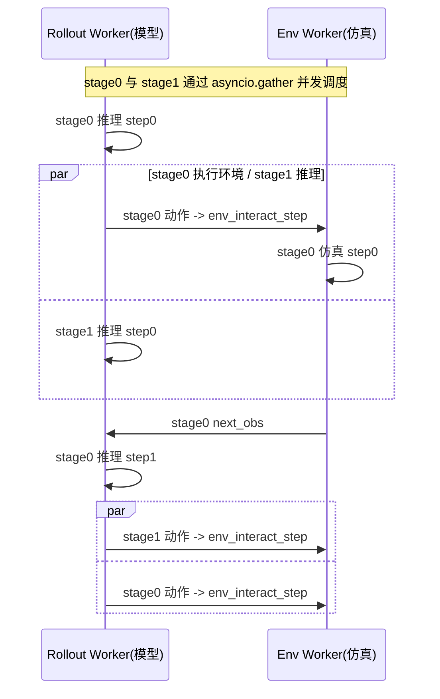

# 第 03 章 EnvLoop 流水线：异步 rollout 与部署形态

> 前情提要：第 02 章讲了 TrainCluster 的四种拓扑，其中 `env_loop` 拓扑还需要额外构造一个 `EnvLoop` 对象。这一章打开 EnvLoop，看它怎么让"模型推理"和"环境交互"这两件计算特征完全不同的事情在时间线上重叠执行。

## 知识链接

- 上一章：[TrainCluster：四种集群拓扑与生命周期](./02_TrainCluster四种集群拓扑与生命周期)
- 下一章：[Worker 体系：从 EnvWorker 到 FSDP 训练引擎](./04_Worker体系_从EnvWorker到FSDP训练引擎)
- [系列目录](./index)

---

## 1. 问题：模型推理和环境交互天然是串行的

一次"策略在环境里走一步"包含两个动作：模型看观测算出动作（GPU 推理），环境执行这个动作算出下一个观测（CPU 仿真或真机通信）。这两步有严格的数据依赖——第二步需要第一步的输出，天然串行。

如果只有一份环境实例，GPU 在等模型推理完之前，仿真器只能空闲；仿真器在跑物理步进的时候，GPU 也只能空闲。理想情况下想让两者重叠：**当 GPU 在给第一批环境算动作时，CPU 正好在给第二批环境跑上一步的物理仿真**。这就是 `EnvLoop` 里 `pipeline_stage_num`（流水线级数）要解决的问题。

## 2. Pipeline Stage：把一批环境切成互相独立的几组

`EnvLoop` 构造时接收 `EnvLoopConfig`：

```python
@dataclass
class EnvLoopConfig(BaseConfig):
    pipeline_stage_num: int = 2   # 流水线级数
    max_interactions: int = 8     # 单次 rollout 每条流水线跑多少个交互步
```

`pipeline_stage_num=2` 意味着每个 env worker 内部会启动**两个完全独立的模拟器子进程**（`EnvManager` 实例，每个对应 `stage_id=0/1`）。一批环境实例被平均分成两组：

```python
def _restructure_obs_data(self, data_proto: DataProto) -> list[DataProto]:
    num_workers = self.env_wg.world_size
    staged_data = [[] for _ in range(self.stage_num)]
    chunks = data_proto.chunk(num_workers)              # 先按 env worker 数切
    for worker_chunk in chunks:
        stage_chunks = worker_chunk.chunk(self.stage_num)   # 每个 worker 内部再按 stage 数切
        for stage_id, data in enumerate(stage_chunks):
            staged_data[stage_id].append(data)
    return [DataProto.concat(data_list) for data_list in staged_data]
```

**这段代码在做什么**：把一整批环境观测，先按 env worker 数量切一刀，再在每个 worker 内部按 stage 数量切一刀，最后按 stage 重新拼回两个大批次。效果是 stage 0 和 stage 1 各自持有**物理上独立的一份环境子集**——它们运行在不同的操作系统子进程里，可以真正并行，不是仅靠 Python 协程伪装的并发。

## 3. `run()`：两条流水线用 asyncio 交错调度

`EnvLoop.run()` 的核心是让 stage 0 和 stage 1 各自跑一条"模型推理 → 环境交互 → 模型推理…"的严格串行循环，但两条循环之间用 `asyncio.gather` 并发调度：

```python
async def _stage_loop(stage_id: int):
    step_idx = 0
    while step_idx < self.max_interactions:
        action_result = await asyncio.to_thread(rollout_futures[stage_id].get)   # 等模型推理结果
        env_ref = self.env_wg.env_interact_step(action_result, mode=env_mode)     # 非阻塞发起环境step
        env_result = await asyncio.to_thread(env_ref.get)                        # 等环境反馈
        ...
        step_idx += 1
        if step_idx < self.max_interactions:
            rollout_futures[stage_id] = self.rollout_wg.generate_sequences(next_obs)  # 立刻发起下一步推理请求

await asyncio.gather(*[asyncio.create_task(_stage_loop(sid)) for sid in range(self.stage_num)])
```

**为什么这样能重叠**：`rollout_wg.generate_sequences(...)` 和 `env_wg.env_interact_step(...)` 都是 Ray 的非阻塞远程调用，立刻返回一个 future（`ObjectRef`），`asyncio.to_thread(future.get)` 把"阻塞等待 Ray 结果"包装成一个可以被 `await` 的协程。当 `_stage_loop(0)` 在 `await` 等待模型推理结果时，Python 的事件循环会切换去跑 `_stage_loop(1)` 的逻辑（可能正好是在等环境反馈，或者刚好可以发起下一次请求）。两条 stage 循环各自独立地"谁先准备好谁先走"，宏观效果是 GPU 推理时间和 CPU 仿真时间在时间轴上错开、互相填补空隙。

一个直觉类比：这类似经典的**双缓冲流水线**——如果 GPU 推理耗时 $t_m$，环境仿真耗时 $t_e$，理想情况下总吞吐接近 $\max(t_m, t_e)$ 而不是串行时的 $t_m + t_e$。



（图示简化了真实的调度时序，实际先后顺序取决于事件循环调度和 Ray 响应延迟，核心是两条 stage 彼此不阻塞。）

`env_wg.env_interact_step` 通过 `action_result.meta_info["stage_id"]` 知道该转发给哪个 `EnvManager` 实例——每个 `EnvWorker` 内部维护一个 `self.simulator_list`，`stage_id` 就是列表下标。

框架同时记录了每个 stage 的等待时间指标（`rollout_wait_s`/`env_wait_s`/`effective_steps`），最终汇总出 `timing_s/env_loop_stage_wall_max`、`throughput/env_loop_effective_steps_per_s` 这类可观测量——排查"流水线到底重叠得好不好"时可以直接看这些指标名。

## 4. 轨迹拼接：`_collate_trajectories`

两条 stage 各自跑完 `max_interactions` 步之后，需要把它们的轨迹在 batch 维度重新拼回一份完整的 `DataProto`——因为对外呈现（给 trainer 用）时，stage 只是内部实现细节，trainer 只需要一份"完整批次的轨迹"：

```python
def _collate_trajectories(self, trajectories, meta_info):
    for stage_id in range(self.stage_num):
        for step_idx, step_data in enumerate(trajectories[stage_id]):
            # 把两个 stage 相同 step_idx 的数据在 batch 维拼接
            flat_trajs[step_idx][key] = DataProto.concat([left, right])
    ...
    return DataProto.from_single_dict(batch_dict, meta_info=meta_info)
```

## 5. Colocate 模式下的额外开关：FSDP 训练态/推理态切换

`generate_sequences()` 顶层入口有个分支，只在 colocate 模式（`switch_actor_rollout_mode=True`，即"Actor 和 Rollout 共用同一批权重"）下才触发：

```python
if self.switch_actor_rollout_mode:
    self.rollout_wg.switch_to_rollout()      # 把 FSDP 权重从分片训练态切到可推理态
    output, run_metrics = loop.run_until_complete(self.run(...))
    self.rollout_wg.switch_to_train()        # 切回分片训练态
else:
    output, run_metrics = loop.run_until_complete(self.run(...))
```

这是因为 colocate 模式下训练和推理**共享同一份 FSDP 分片权重**，但 FSDP 的分片状态（sharded，省显存）和推理需要的状态（unshard，可直接完整前向）是不兼容的两种物理布局，必须显式切换。这部分底层机制（`VLAFSDPEngine.switch_to_rollout/switch_to_train`）在第 04 章详细讲。

一个直接后果：**colocate 模式下，rollout 阶段和 train 阶段是严格串行的**——不可能训练和推理同时发生，因为它们用的是同一批 GPU 上的同一份权重。这也是为什么"异步 rollout"（第 02 章讲的双缓冲流水线）必须要求 disaggregated 部署——只有 rollout worker 和 actor worker 物理独立，才有可能真正并行。

## 6. Colocate vs Disaggregated：完整对比

| 维度 | Colocate（默认） | Disaggregated |
|---|---|---|
| 权重关系 | Rollout 直接引用 Actor 的 `nn.Module` 对象（同一份内存） | 各自独立 `build_vla_model` 加载一份权重 |
| 训练/推理切换 | `switch_to_rollout()`/`switch_to_train()`，串行切换 FSDP 分片态 | 不需要切换，两组 worker 各自独立运行 |
| 权重同步开销 | 零（`update_weights()` 是 no-op） | 需要 `CheckpointEngineManager` 定期把 actor 权重广播给 rollout |
| 是否支持异步 rollout | 不支持（训练推理互斥） | 支持（`TrainCluster.rollout(async_rollout=True)`） |
| 显存占用 | 低（一份权重） | 高（两份权重） |
| GPU 利用率 | 训练时推理空闲，推理时训练空闲 | 理想情况下训练和采集可以真正并行 |

选择哪种部署取决于硬件预算：显存/GPU 数量有限时用 colocate；有足够 GPU 分给独立的 rollout 资源池、且希望训练和数据采集重叠提升吞吐时用 disaggregated。

## 小结

| 概念 | 要点 |
|---|---|
| pipeline_stage_num | 每个 env worker 内部起 N 个独立仿真子进程，物理隔离，可真正并行 |
| _stage_loop 并发 | 用 asyncio.gather + to_thread 让多个 stage 的"推理→环境"循环交错执行，掩盖各自的等待延迟 |
| 效果 | 理想吞吐从 t_模型+t_环境 降到 max(t_模型, t_环境) |
| colocate 切换 | switch_to_rollout/switch_to_train 在同一份 FSDP 权重上切换分片状态，串行执行 |
| disaggregated | 权重物理独立，需要 CheckpointEngineManager 广播同步，但支持训练/采集真正并行 |

## 下章预告

[第 04 章](./04_Worker体系_从EnvWorker到FSDP训练引擎) 深入 Worker 层的具体实现——`EnvManager` 怎么用独立子进程隔离仿真器，`VLAActorRolloutRefWorker` 怎么用同一个类同时支持 colocate 和 disaggregated 两种角色，以及 `VLAFSDPEngine` 的 FSDP2 权重切分和训练/推理态切换的具体机制。
