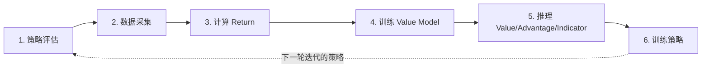

# 第 09 章 RECAP 工作流：六阶段自我提升闭环

> 前情提要：第 08 章讲了 SAC 的在线训练循环。这一章讲另一种完全不同的后训练范式——RECAP，一个不需要在线环境交互做梯度更新、纯粹靠"评估-采集-打分-训练"迭代循环实现自我提升的工作流,同时也是第 01 章提到的"workflow 可以组合多个 TrainCluster 完成复杂多阶段流程"的最佳例证。

## 知识链接

- 上一章：[SAC 训练循环：EpisodeBuffer、ReplayPool 与 RLPD](./08_SAC训练循环_EpisodeBuffer_ReplayPool与RLPD)
- 下一章：[资源配置与实战指南](./10_资源配置与实战指南)
- [系列目录](./index)
- [Advantage Conditioning：优势条件化策略提取](/前置知识/002r_前置知识_Advantage_Conditioning优势条件化策略提取) — **必读**，RECAP 第 6 阶段的核心思想
- [Q 函数与 Value 函数](/前置知识/000o_前置知识_Q函数与Value函数)
- [TD 学习与 n 步回报的偏差问题](/前置知识/001k_前置知识_TD学习与n步回报的偏差问题) — n-step advantage 估计的理论背景
- [离线强化学习基础](/前置知识/000s_前置知识_离线强化学习基础)

---

## 1. RECAP 不是一个训练算法，是一个复合工作流

第 01 章讲过 workflow 层的职责是"组合多个阶段、多个 `TrainCluster`、串联数据流"。RECAP 是这个设计原则的直接体现——它本身不引入任何新的分布式训练机制，而是把已有的评估（eval）、数据采集（collect）、监督训练（SFT trainer）三种已有能力，用六个阶段的固定顺序组合成一个**迭代式自我提升闭环**：



每一轮迭代（iteration）跑完这六个阶段，第 6 阶段产出的新策略成为下一轮迭代第 1、2 阶段使用的策略——这就是"自我提升"的含义：每一轮都用上一轮训练出的更好策略去采集更好的数据，再用更好的数据训出更好的策略。

`workflow.py::run_recap` 的主循环结构完全体现了这一点：

```python
for iteration_idx in range(recap_config.resume_iteration - 1, recap_config.num_iterations):
    if recap_config.should_run_stage(iteration, 1): metrics = eval_recap_policy(config, policy_path, ...)
    if recap_config.should_run_stage(iteration, 2): collected_datasets = collect_recap_env_data(config, policy_path)
    if recap_config.should_run_stage(iteration, 3): collected_datasets = ensure_recap_fields(config, collected_datasets)
    if recap_config.should_run_stage(iteration, 4): value_model_path = train_recap_value_model(config, collected_datasets)
    if recap_config.should_run_stage(iteration, 5): infer_recap_values(config, dataset, value_model_path)
    if recap_config.should_run_stage(iteration, 6): policy_path_from_previous_iteration = train_recap_policy(config, collected_datasets)
```

每个阶段都能独立跳过（`should_run_stage`），支持从任意 (迭代, 阶段) 组合断点恢复——这对动辄跑几天的多阶段流程是必需的工程能力。

## 2. 阶段 1-2：评估与数据采集，复用已有能力

**阶段 1（policy_eval）**：评估当前策略（或上一轮迭代训出的策略）在 benchmark 上的成功率，直接复用第 02 章讲的 `TrainCluster.eval()`。首轮迭代因为策略还没经过任何 ACP（advantage-conditioned policy，第 6 阶段会讲）训练，会关闭 ACP 相关的推理逻辑（`disable_acp=True`）。

**阶段 2（collect_data）**：用当前策略在环境里跑 rollout，产出的轨迹通过 recorder（第 07 章）写成 LeRobot 数据集：

```python
@ray.remote
def run_env_loop(config, policy_path=None):
    cluster = TrainCluster(instantiate(collect_config.cluster, _recursive_=False))
    cluster.start()
    return collect_lerobot_rollout_dataset(cluster, target_episodes=..., log_prefix="recap env loop rollout")
```

这一步跟第 02 章讲的 `env_rollout_cluster` 拓扑（Env + Rollout，无 Actor）完全对应——采集阶段只需要推理，不需要训练。

## 3. 阶段 3：Return 计算——不依赖显式 reward function

RECAP 最有特色的设计是它的 return 定义**完全不依赖环境给出的显式 reward**，只依赖两个最基本的信号：episode 长度和成功/失败标签。

**Step 1：这个公式在做什么**

$$
G_i = \text{clip}\!\left(\frac{-(L-i-1) - \mathbb{1}[\text{fail}]\cdot c_{\text{fail}}}{L_{\max} + c_{\text{fail}}},\ \ v_{\min},\ v_{\max}\right)
$$

这个公式给一条 episode 里的**每一步**都算出一个介于 $[v_\min, v_\max]$（默认 $[-1, 0]$）之间的 return 值 $G_i$，表示"从这一步往后看，距离任务完成还有多远"。

> **一句话直觉**：如果这条轨迹最终成功了，越接近结尾的步骤 return 越接近 0（马上就要成功了），越靠前的步骤越负（离成功还有很远）；如果失败了，全程整体再往下压一截，惩罚这条完整失败的轨迹。

**逐符号拆解**：

| 符号 | 数学含义 | 具体是什么 | 典型值 |
|---|---|---|---|
| $i$ | 当前帧在 episode 内的位置 | 从 0 开始的帧索引 | `frame_index` |
| $L$ | 这条 episode 的实际长度 | 总帧数 | 比如 60 |
| $L-i-1$ | 距离 episode 结束还剩几步 | "剩余步数" | 对最后一帧是 0 |
| $L_{\max}$ | 该任务下所有已收集 episode 里最长的长度 | 用作归一化基准，按 task 分别统计 | 比如该任务最长 episode 120 步 |
| $c_{\text{fail}}$ | 失败惩罚系数 | `c_fail_coef * L_max`，配置里 `c_fail_coef` 典型值 1.0 | 若 `c_fail_coef=1.0`，则 $c_\text{fail}=L_\max$ |
| $\mathbb{1}[\text{fail}]$ | 是否失败 | 该 episode 内是否曾出现 `next.success=True`，没有则为失败 | 0 或 1 |
| $[v_\min,v_\max]$ | 裁剪范围 | 默认 $[-1,0]$ | 保证 return 落在固定区间内 |

**数值代入**：假设某任务 $L_\max=120$，`c_fail_coef=1.0` 即 $c_\text{fail}=120$，一条**成功**的 episode 长度 $L=60$：

- 归一化分母 $\text{denom} = L_\max + c_\text{fail} = 120 + 120 = 240$
- 最后一帧（$i=59$）：$G_{59} = -(60-59-1)/240 = 0/240 = 0.0$
- 第一帧（$i=0$）：$G_0 = -(60-0-1)/240 = -59/240 \approx -0.246$

同样长度但**失败**的 episode：

- 最后一帧：$G_{59} = (-(0) - 120)/240 = -120/240 = -0.5$
- 第一帧：$G_0 = (-(59) - 120)/240 = -179/240 \approx -0.746$

**为什么是这个形式**：成功轨迹的 return 单调从负值升到 0，天然编码了"越接近任务完成越好"这个信号，不需要人工设计任何 reward shaping；失败轨迹整体多减一个 $c_\text{fail}$，让"完全没完成任务"这件事本身在数值上和"完成得慢"区分开来——否则一条很长但最终成功的轨迹，可能会和一条很短但失败的轨迹得到相近的 return，无法正确区分优劣。除以 $L_\max + c_\text{fail}$ 归一化到固定区间是为了让不同任务、不同 episode 长度之间的 return 数值可比。

代码实现（`compute_return.py::_compute_return_lookup`）：

```python
c_fail = float(task_max) * c_fail_coef
denom = float(task_max) + c_fail
for offset, record in enumerate(episode_records):
    remaining_steps = episode_length - offset - 1
    target = -float(remaining_steps)
    if not success:
        target -= c_fail
    target = np.clip(target / denom, clip_min, clip_max)
```

## 4. 阶段 4：训练 Value Model——直接复用 SFT trainer

拿到每一帧的 `recap.return` 标签之后，阶段 4 训练一个 value critic 去回归这个标签——**这一步没有任何新的训练机制，直接把它包装成一个 SFT 回归任务**，复用第 04 章讲过的 SFT trainer：

```python
OmegaConf.update(sft_config, "cluster.actor_rollout_ref.data_keys.target_value", RECAP_RETURN_FIELD)
run_sft(sft_config)
```

模型是 `ReCapValueCriticTrainableModel`（第 05 章简单提过），架构是一个独立的双流 Gemma（VLM prefix 流 + 新初始化的小型 value expert 流），value head 输出的是**类别化分布**而不是直接回归标量：

$$
\hat{v}(s) = \sum_{k=1}^{K} p_k \cdot z_k, \qquad p = \text{softmax}(\text{logits})
$$

**这个公式在做什么**：把 $[v_\min, v_\max]$ 这个连续价值范围离散化成 $K$ 个原子（atom）$z_1,\dots,z_K$，网络不直接输出一个数字，而是输出"落在每个原子附近的概率"，最终价值估计是所有原子按概率加权的期望。

> **一句话直觉**：不让网络直接猜一个数字，而是让它给出一个"这个价值大概落在哪个区间"的概率分布，再用这个分布的期望作为最终估计——这样能表达不确定性，而且对分布不对称、有多峰的价值信号更鲁棒。

训练用双线性插值的交叉熵（two-hot 编码）而不是简单的 MSE 回归：目标值 $v_\text{target}$ 落在两个相邻原子 $z_{\lfloor b\rfloor}, z_{\lceil b\rceil}$ 之间时，按距离比例分配概率质量到这两个原子上，再对预测分布和这个 two-hot 目标分布算交叉熵。这是 C51/MuZero 一脉的 distributional RL 常见技巧，本文不展开完整推导（属于价值分布方法的通用技术，超出 RECAP 本身的范畴），只需要知道 verl-vla 里 value model 训练用的是这套机制,不是普通的标量回归。

## 5. 阶段 5：推理 Value/Advantage/Indicator

拿训好的 value model 对整个数据集重新推理一遍，得到每一帧的 $\hat v(s)$，接下来要在此基础上算出 **advantage**（用于判断这一步比"平均水平"好还是差）和 **indicator**（用于筛选哪些样本值得让策略去模仿）。

### 5.1 N-step advantage：用 return 的差分近似 reward

**Step 1：这个公式在做什么**

$$
A_t = \underbrace{\sum_{k=0}^{n-1}\big(G_{t+k} - G_{t+k+1}\big)}_{\text{近似 } n \text{ 步内的即时奖励和}} + \underbrace{\hat v(s_{t+n})}_{\text{n 步后的 bootstrap 估值}} - \underbrace{\hat v(s_t)}_{\text{当前估值}}
$$

这是标准的 n-step TD advantage 估计器，用来回答"从 $s_t$ 出发走 $n$ 步，实际表现比 value model 原本预期的好多少"。

> **一句话直觉**：把"未来 $n$ 步真实拿到的进展"和"$n$ 步之后 value model 打的分"加起来，减去"当前这一步 value model 打的分"——如果结果是正的，说明这一步比 value model 预期的更有价值。

**逐符号拆解**：

| 符号 | 数学含义 | 在本文场景中的对应 | 典型值/维度 |
|---|---|---|---|
| $n$ | 向前看几步 | `recap.value_infer.n_step`，典型值 50 | 常数 |
| $G_{t+k}-G_{t+k+1}$ | 第 $t+k$ 步的"即时奖励"近似 | 第 3 节讲的 return 逐步单调递增，相邻差分近似即时奖励 | 标量 |
| $\hat v(s_{t+n})$ | $n$ 步后状态的 value 估计 | 若 $t+n$ 超过 episode 尾部，复用最后一帧的值而非补零 | 标量 |
| $\hat v(s_t)$ | 当前状态的 value 估计 | 阶段 4 训好的 value model 输出 | 标量 |
| $A_t$ | advantage | 最终写入 `recap.advantage` 字段 | 标量 |

**为什么用 return 差分近似 reward**：第 3 节的 return 是单调递增（越接近成功越大）的构造量，它相邻两步的差分天然就是"这一步往前推进了多少进度"，可以当作一个隐式的、稠密的 reward 信号使用——这样就不需要环境提供显式的逐步 reward，是 RECAP"不依赖显式 reward function"这条设计原则贯穿始终的体现。

**数值代入**：取 $n=3$（简化演示，实际配置默认 50），某条成功轨迹里 $t=57$ 附近，返回值序列 $G_{57}=-0.05, G_{58}=-0.02, G_{59}=0, G_{60}=0$（超过episode尾部复用最后一帧）：

- 差分和：$(G_{57}-G_{58}) + (G_{58}-G_{59}) + (G_{59}-G_{60}) = 0.03 + 0.02 + 0 = 0.05$
- 假设 $\hat v(s_{60})=0.0$，$\hat v(s_{57})=-0.08$
- $A_{57} = 0.05 + 0.0 - (-0.08) = 0.13$

正的 advantage 说明这一步实际走出来的效果（比预期提前完成任务）比 value model 原本估计的更好。

代码实现（`value_infer.py::_compute_n_step_advantages`）用 `_n_step_record_or_episode_tail` 处理"$n$ 步超出 episode 边界"的情况——不是简单补零，而是让指针停在 episode 最后一帧继续复用它的 return/value，避免边界处 advantage 被错误地压低（补零会让 $G_{t+n}$ 突然掉到 0，制造出不存在的"落差"）。

### 5.2 Indicator：按 task 分组的 top-k 二值化

拿到 advantage 之后（可选先做未来窗口的指数衰减平滑，减少单步噪声——`future_smoothed_advantage` 策略），最后要把它转成一个 0/1 的 `indicator` 标签,决定这一帧是否会被选中用来训练下一轮策略：

```python
for task_idx in np.unique(task_indices):
    task_scores = scores[task_mask]
    positive_count = int(np.ceil(task_scores.size * positive_ratio))
    positive_order = np.argsort(task_scores)[-positive_count:]      # 取该任务下 advantage 最高的一批
    indicators[task_mask][positive_order] = 1
if force_intervention_positive:
    indicators[interventions] = 1     # 人类干预/纠正的帧无条件标记为正样本
```

**为什么要按 task 分组而不是全局排序**：不同任务的 advantage 数值分布可能天差地别（简单任务本来就容易得到高 advantage，难任务普遍偏低），全局排序会导致简单任务的样本挤占几乎所有正样本配额，难任务的样本几乎都被标为负样本——这跟第 08 章 ReplayPool 按 task 分组采样是同一类设计考量。`force_intervention_positive` 则是一个业务规则：人类主动纠正的动作，无论 advantage 排名如何，都强制认为是值得学习的正样本——因为人类的介入本身就代表"这里策略原本会犯错，需要被纠正"，这个信息比单纯的数值排名更可靠。

## 6. 阶段 6：训练策略——Advantage-Conditioned Policy（ACP）

最后一步同样复用 SFT trainer，但打开一个新的开关：

```python
OmegaConf.update(sft_config, "cluster.actor_rollout_ref.actor.acp.enable", True)
OmegaConf.update(sft_config, "cluster.actor_rollout_ref.data_keys.indicator", RECAP_INDICATOR_FIELD)
```

ACP（advantage-conditioned policy，对应 [前置知识](/前置知识/002r_前置知识_Advantage_Conditioning优势条件化策略提取)）的核心思想是：训练时用 `indicator` 字段筛选/加权样本，让策略的梯度更新更多地来自高 advantage（indicator=1）的样本，弱化甚至跳过低价值样本对策略的影响——本质上是一种**过滤式的行为克隆**（filtered behavior cloning），而不是标准的、对所有样本一视同仁的监督学习。

这一步产出的新策略路径会被传给下一轮迭代的阶段 1（评估）和阶段 2（采集），完成整个自我提升闭环的闭合。

## 7. 六阶段总览表

| 阶段 | 输入 | 核心计算 | 输出 | 复用的能力 |
|---|---|---|---|---|
| 1. 策略评估 | 当前策略 checkpoint | 环境评估 | 成功率等指标 | `TrainCluster.eval()` |
| 2. 数据采集 | 当前策略 checkpoint | 环境 rollout | LeRobot 数据集 | `env_rollout_cluster` |
| 3. 计算 Return | 采集到的数据集 | 剩余步数+失败惩罚归一化 | `recap.return` 字段 | 无（RECAP 独有逻辑） |
| 4. 训练 Value Model | 带 return 标签的数据集 | 分布式回归（two-hot 交叉熵） | value model checkpoint | SFT trainer |
| 5. 推理 Advantage | value model + 数据集 | n-step advantage + top-k 二值化 | `recap.advantage`/`recap.indicator` 字段 | 无（RECAP 独有逻辑） |
| 6. 训练策略 | 带 indicator 标签的数据集 | ACP 过滤式行为克隆 | 新策略 checkpoint | SFT trainer |

## 小结

RECAP 最值得记住的架构启示是：**一个复杂的多阶段算法，不需要引入新的分布式执行机制，只需要按正确的顺序组合已有的 `TrainCluster` 操作（eval/rollout/train）和恰当的数据变换**。这正是第 01 章"workflow 组合 trainer 和 TrainCluster"这条设计原则最完整的体现——RECAP 的六个阶段里，只有第 3 和第 5 阶段是纯数据处理逻辑，其余全部复用已有基础设施。

| 概念 | 要点 |
|---|---|
| 六阶段闭环 | 评估→采集→打Return→训Value→打Advantage/Indicator→训Policy，产出策略反哺下一轮 |
| Return 定义 | 不依赖显式 reward，纯粹用"剩余步数+失败惩罚"归一化到 [-1,0] |
| Value Model | 复用 SFT trainer 做分布式回归，value head 是 distributional（类别化）而非标量 |
| N-step Advantage | 用 return 差分近似即时 reward + n 步后 bootstrap value，边界复用最后一帧而非补零 |
| Indicator | 按 task 分组 top-k 二值化，人类干预帧强制标记为正样本 |
| ACP 训练 | 用 indicator 过滤/加权样本的行为克隆，而非标准无差别监督学习 |

## 下章预告

[第 10 章](./10_资源配置与实战指南) 是全系列的收尾，整理 Hydra 配置树的组织方式、四种集群拓扑的选型建议、常用命令示例，作为查阅速查手册使用。
