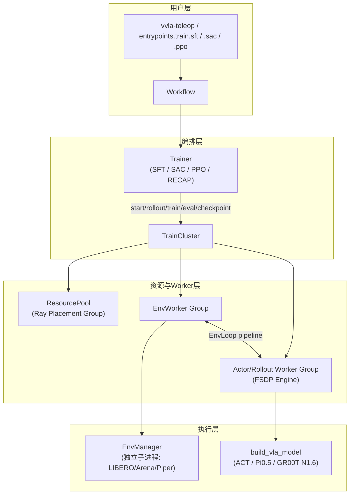

# verl-vla 架构全解析：VLA 后训练统一框架完全指南

> 从项目全景到每一个 worker 的实现细节，把 verl-vla 这个 VLA 后训练框架的架构设计彻底拆开讲清楚。

## 系列简介

[verl-vla](https://github.com/verl-project/verl-vla) 是字节跳动 verl 团队在 [verl](https://github.com/verl-project/verl) 分布式训练基础设施之上构建的**视觉-语言-动作（VLA）策略后训练统一框架**。它把人机协同数据采集、监督微调（SFT）、强化学习（SAC/PPO/DSRL）、策略评估这几件事，用一套共享的执行架构串联起来——同一份环境代码、同一份模型适配层、同一套分布式资源调度，可以直接复用在不同的训练阶段。

本系列的目标是：**让一个完全不了解这个项目的人，读完后能理解 verl-vla 的全部架构分层、每一层解决什么问题，以及关键训练算法（SAC/RECAP/Flow-SDE）在代码里具体是怎么实现的。**

重点放在项目本身的工程设计：分层架构、`TrainCluster` 执行抽象、Worker 体系、模型/环境集成契约、训练循环细节。不重复讲 SAC/PPO/Flow Matching 的基础理论——这些都已经有独立的前置知识文章，本系列只讲"这些理论在 verl-vla 里是怎么落地成代码的"。

**适合读者**：
- 想理解或二次开发 VLA 强化学习训练框架的工程师
- 对分布式 RL 系统架构（Ray + FSDP）感兴趣的研究者
- 想知道 SAC、RECAP、Flow-SDE 这些方法在真实工程里如何实现的人

## 章节目录

| 章节 | 标题 | 简介 |
|------|------|------|
| 01 | [全景图：verl-vla 在解决什么问题](./01_全景图_verl-vla在解决什么问题) | 项目定位、核心矛盾、workflow-trainer-TrainCluster 三层架构总览 |
| 02 | [TrainCluster：四种集群拓扑与生命周期](./02_TrainCluster四种集群拓扑与生命周期) | actor/env/env_actor_rollout/env_rollout 四种拓扑、start/rollout/train/eval API |
| 03 | [EnvLoop 流水线：异步 rollout 与部署形态](./03_EnvLoop流水线_异步rollout与部署形态) | pipeline stage 并发机制、colocate vs disaggregated、权重同步 |
| 04 | [Worker 体系：从 EnvWorker 到 FSDP 训练引擎](./04_Worker体系_从EnvWorker到FSDP训练引擎) | EnvManager 进程隔离、VLAActorRolloutRefWorker、FSDP2 权重切分 |
| 05 | [模型集成契约：三个接口统一 ACT / Pi0.5 / GR00T](./05_模型集成契约_三个接口统一ACT_Pi0_GR00T) | TrainableVLAModelBase 三契约、builder 显式分派、原生 checkpoint 保真 |
| 06 | [Flow-SDE 与 DSRL：给流匹配策略装上 SAC](./06_FlowSDE与DSRL_给流匹配策略装上SAC) | 确定性 ODE 为什么没法用 SAC、Flow-SDE 逐步加噪算 log-prob、DSRL 噪声空间转向 |
| 07 | [环境集成与人机协同：BaseEnv、Recorder、Teleop](./07_环境集成与人机协同_BaseEnv_Recorder_Teleop) | 仿真器与真机统一契约、action chunk 与实时干预、LeRobot 数据集录制链路 |
| 08 | [SAC 训练循环：EpisodeBuffer、ReplayPool 与 RLPD](./08_SAC训练循环_EpisodeBuffer_ReplayPool与RLPD) | 完整 episode 的收集与转换、双池采样、Bellman target 与 target 网络更新 |
| 09 | [RECAP 工作流：六阶段自我提升闭环](./09_RECAP工作流_六阶段自我提升闭环) | 评估-采集-打分-训练value-推理advantage-训练policy 的完整迭代闭环 |
| 10 | [资源配置与实战指南](./10_资源配置与实战指南) | Hydra 配置树、拓扑选型建议、常用命令与调参速查表 |

## 前置知识

阅读本系列前建议先了解：

- [SAC (Soft Actor-Critic)](/前置知识/000k_前置知识_SAC_Soft_Actor_Critic) — 第 06、08 章的算法基础
- [Q 函数与 Value 函数](/前置知识/000o_前置知识_Q函数与Value函数) — critic 设计相关
- [Replay Buffer 经验回放](/前置知识/000r_前置知识_Replay_Buffer_经验回放) — 第 08 章 replay pool 的基础概念
- [Flow Matching 与连续归一化流](/前置知识/000g_前置知识_Flow_Matching与连续归一化流) — 第 06 章 Pi0.5/GR00T 流匹配策略的基础
- [FSDP 全分片数据并行](/前置知识/001i_前置知识_FSDP全分片数据并行) — 第 04 章训练引擎的分布式基础
- 具备基本的 Ray 分布式计算概念（Actor、Placement Group）会更容易理解 Worker 体系

## 学习建议

1. 第 01 章建立全局认知——三层架构（workflow/trainer/TrainCluster）是理解全书的钥匙
2. 第 02-04 章是分布式执行核心，建议按顺序精读
3. 第 05-06 章讲模型侧怎么把生成式策略改造成可以做 RL 的 actor-critic，是本系列最硬核的部分
4. 第 07-09 章讲数据侧和训练算法的具体落地，可结合自己感兴趣的模块选读
5. 第 10 章是配置速查手册，用时查阅

## verl-vla 核心架构总览

## 源码目录速查

| 模块 | 目录 | 核心文件 |
|------|------|---------|
| 用户入口 | `src/verl_vla/entrypoints/` | `train/{sft,sac,ppo,recap}.py`, `teleop.py`, `eval.py`, `record.py` |
| Workflow | `src/verl_vla/workflows/` | `train/{sft,sac,ppo}.py`, `train/recap/workflow.py` |
| Trainer | `src/verl_vla/trainer/` | `sft/sft_ray_trainer.py`, `sac/sac_ray_trainer.py`, `ppo/rob_ray_trainer.py` |
| 执行抽象 | `src/verl_vla/train_cluster/` | `cluster.py`(TrainCluster), `env_loop.py`, `resource_pool.py`, `checkpoint.py` |
| Worker | `src/verl_vla/workers/` | `env/env_worker.py`, `engine/engine_workers.py`, `engine/fsdp/vla_impl.py` |
| 模型集成 | `src/verl_vla/models/` | `base.py`, `builder.py`, `act_torch/`, `pi0_torch/`, `gr00t_n1d6/`, `dsrl/` |
| 环境集成 | `src/verl_vla/envs/` | `base.py`(BaseEnv), `libero/`, `arena/`, `piper/` |
| 数据录制 | `src/verl_vla/recorder/` | `recorder.py`(MultiRecorder), `strategies/`, `impl/lerobot.py` |
| 人机协同 | `src/verl_vla/teleop/` | `teleop_controller.py`, `devices/`, `strategies/` |
| Hydra 配置 | `src/verl_vla/workflows/config/` | `cluster/`, `model/`, `env/`, `train/` |
