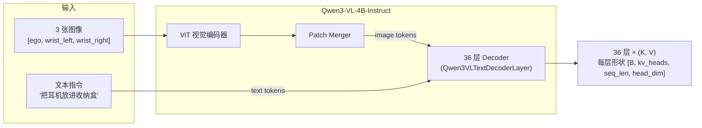
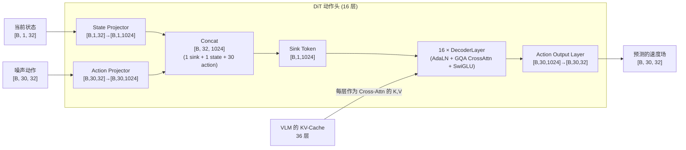

# 第二章：三段式架构总览 —— VLM + DiT + Rectified Flow

> 本章目标：建立 XR0 完整数据流的全局地图——从图像和指令输入，到 KV-Cache 生成，到 DiT 去噪，到最终输出动作块——每一步的张量形状都过一遍。

**前情提要**：第 1 章说明了 XR0 选择的技术路线：VLM 理解 + DiT 生成 + Rectified Flow 训练算法。本章把这三段串成一个完整的数据流。

**知识链接**：
- [Flow Matching 与连续归一化流](/前置知识/000g_前置知识_Flow_Matching与连续归一化流) — Rectified Flow 的数学基础
- [KV-Cache 与自回归解码](/前置知识/002m_前置知识_KV_Cache与自回归解码) — VLM 到 DiT 之间的桥梁机制

---

## 一、贯穿全文的例子

为了让每一章的讲解具体可感，我们定义一个贯穿全系列的例子：

> **任务**：一台双臂人形机器人执行指令"把耳机放进收纳盒"。机器人配备三个摄像头（Ego 视角、左手腕视角、右手腕视角），双臂各有 6 个关节 + 1 个夹爪。

对应到 XR0 的具体参数：

- **状态维度**：`state_shape = (1, 32)`——当前帧的双臂关节角 + 夹爪状态，打包成 32 维向量（大部分维度是左右臂各 7 维有效值 + 补零，详见 [第 9 章](./09_数据管线_JSON标注与相对动作计算)）
- **动作维度**：`action_shape = (30, 32)`——未来 30 步的动作，每步 32 维（末端位姿增量 + 关节角增量 + 夹爪增量）
- **图像输入**：3 张多视角图像（每帧任务只用当前时刻的单帧图像，不是视频）

## 二、完整数据流：三个阶段

### 阶段一：VLM 理解 —— 图像 + 指令 → KV-Cache



这一阶段本质上是一次标准的 VLM 前向传播，唯一的特殊之处是设置 `use_cache=True`，让模型把每一层 Attention 算出来的 Key、Value 保存下来（而不是像正常推理那样只保留最后一层的输出用于生成文字）。

**输出**：`past_key_values`——一个包含 36 层（Qwen3-VL-4B 的层数）`(key, value)` 元组的列表。

### 阶段二：DiT 生成 —— 噪声 + 状态 + KV-Cache → 动作



DiT 每一层的 Attention 模块，Query 来自 `[sink, state, noisy_action]` 这个长度为 32 的序列，Key/Value 直接取自 VLM 对应层的 KV-Cache——这是一次典型的 Cross-Attention：DiT 的 token 在"查询"VLM 已经理解好的视觉-语言信息。具体每一层内部的调制机制、注意力细节，见 [第 4 章](./04_DiT动作头架构_AdaLN与GQA跨注意力)。

### 阶段三：Rectified Flow —— 训练目标与推理过程

DiT 本身只是一个函数 $f_\theta(\text{noisy\_action}, t) \to \text{velocity}$，具体怎么用它来训练、怎么用它来生成最终动作，由 Rectified Flow 这套算法定义：

**训练时**：
1. 从数据集中拿到真实动作 $x_1$（形状 `[B, 30, 32]`）
2. 采样一个随机时间步 $t \in [0, 1]$（用 Beta 分布，偏向采到较大的 $t$，见 [第 5 章](./05_RectifiedFlow_直线插值与速度场回归)）
3. 采样一个随机噪声 $x_0 \sim \mathcal{N}(0, I)$
4. 线性插值得到"带噪动作" $z_t = (1-t)x_0 + t x_1$
5. 把 $z_t$ 和 $t$ 喂给 DiT，得到预测速度 $v_\theta(z_t, t)$
6. 用 MSE 损失让 $v_\theta(z_t, t)$ 逼近真实速度 $x_1 - x_0$

**推理时**：
1. 从纯噪声 $z = x_0 \sim \mathcal{N}(0, I)$ 出发
2. 分 5 步（`num_steps=5`），每步 $\Delta t = 1/5 = 0.2$：把当前 $z$ 和当前时间 $t$ 喂给 DiT，得到 $v = v_\theta(z, t)$，更新 $z \leftarrow z + v \cdot \Delta t$
3. 迭代 5 次后，$z$ 就是最终生成的动作块

这个流程的数学细节和为什么用直线插值、为什么用 Beta 分布采样时间步，详见 [第 5 章](./05_RectifiedFlow_直线插值与速度场回归)；更基础的 Flow Matching 原理见前置知识 [Flow Matching 与连续归一化流](/前置知识/000g_前置知识_Flow_Matching与连续归一化流)。

## 三、三个阶段的关键衔接点

理解 XR0 架构的关键，是搞清楚三个阶段之间"接口"的设计：

### 3.1 VLM → DiT：KV-Cache 是唯一的信息通道

DiT 完全不接触原始图像和文本——它看不到像素，也看不到 token id。它能获取的关于场景和指令的所有信息，都压缩在 VLM 那 36 层 KV-Cache 里。这意味着 VLM 的理解质量直接决定了 DiT 能利用到的信息上限：如果 VLM 没有正确理解指令里的物体，DiT 无论怎么设计都补不回这个信息。这也解释了为什么 XR0 选择直接用一个成熟的预训练 VLM，而不是从头训练——理解质量的地基必须足够扎实。

### 3.2 层对齐：DiT 的第 $i$ 层用 VLM 倒数第几层的 KV-Cache

VLM 有 36 层，DiT 只有 16 层，两者层数不一致，需要一个对齐规则。XR0 的做法是取 VLM KV-Cache 的**尾部** 16 层，对应到 DiT 的第 0-15 层：

```python
start_idx = max(0, len(past_key_values) - self.layer_num)  # 36 - 16 = 20
for i, layer in enumerate(self.layers):
    hidden_states = layer(hidden_states, past_key_values[start_idx + i], ...)
```

也就是说 DiT 第 0 层用 VLM 第 20 层的 KV-Cache，DiT 第 15 层用 VLM 第 35 层（最后一层）的 KV-Cache。这个设计的直觉是：VLM 越靠后的层，特征越"高层语义化"（更接近"这是什么物体、要做什么事"这类抽象理解），而 DiT 越靠后的层，也应该对应更抽象、更接近最终动作决策的表示——用浅层 DiT 对齐浅层语义、深层 DiT 对齐深层语义，是一种自然的层级对应关系。

### 3.3 DiT → Rectified Flow：DiT 只是"速度场函数"，不知道自己在训练还是推理

DiT 本身的 `forward` 方法（对应代码里的 `dit_forward`）是一个纯函数：给定带噪动作和时间步，返回预测速度。训练循环和推理循环的区别，完全由外层的 Rectified Flow 逻辑（`_flow_interpolate`、`_flow_velocity_target`、`_flow_generate`）决定，DiT 内部不需要知道自己当前处于哪个阶段。这是一种清晰的职责分离：DiT 负责"函数拟合"，Rectified Flow 负责"怎么用这个函数训练和推理"。

## 四、完整前向传播时的张量形状一览

以本章的例子（batch_size=1，state_shape=(1,32)，action_shape=(30,32)）为参考：

| 步骤 | 张量 | 形状 |
|------|------|------|
| 输入图像（3 视角） | `pixel_values` | 取决于分辨率，经 patch 化后变为若干 image token |
| VLM 输出 | `past_key_values[i]` (36 组) | 每组 `(k, v)`，形状 `[1, kv_heads, seq_len, head_dim]` |
| 噪声动作 | `noise` | `[1, 30, 32]` |
| 真实动作 | `action` | `[1, 30, 32]` |
| 状态 | `state` | `[1, 1, 32]` |
| 状态投影 | `state_embed` | `[1, 1, 1024]` |
| 动作投影 | `noisy_action` (投影后) | `[1, 30, 1024]` |
| Sink Token | `sink` | `[1, 1, 1024]` |
| DiT 输入序列 | `hidden_states` | `[1, 32, 1024]`（1 sink + 1 state + 30 action） |
| DiT 输出（截取动作部分） | `hidden_states[:, -30:, :]` | `[1, 30, 1024]` |
| 最终预测 | `output` (投影回动作维度) | `[1, 30, 32]` |

**下一章预告**：[第 3 章](./03_Qwen3VL骨干_视觉编码与MRoPE)深入 VLM 骨干网络内部，看图像具体怎么被切成 patch、怎么编码位置、怎么和文本 token 一起进入 Decoder 层。
