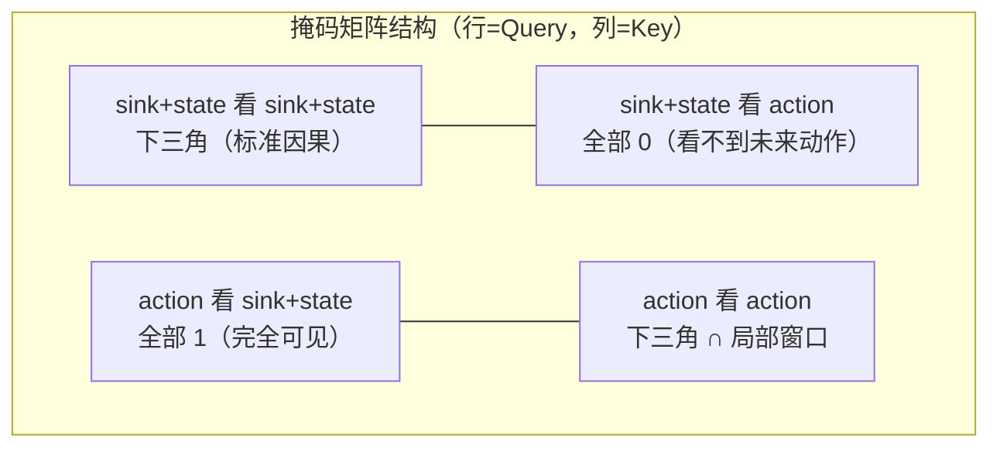

# 第六章：局部因果掩码 —— sink + state + action 的注意力结构设计

> 本章目标：理解 DiT 输入序列 `[sink, state, action_0...action_29]` 之间的注意力掩码具体是怎么构造的，以及为什么动作 token 之间要限制成"局部窗口"而不是全局可见。

**前情提要**：第 4 章讲了 DiT Attention 内部把 VLM 的 KV-Cache 和自己的 KV 拼接起来做联合 Attention，注意力矩阵里"谁能看到谁"由本章要讲的掩码控制。

**知识链接**：
- [Causal Attention 因果注意力掩码](/前置知识/001g_前置知识_Causal_Attention因果注意力掩码) — 标准因果掩码的基础原理
- [Cross-Attention 与交替注意力机制](/前置知识/001e_前置知识_Cross_Attention与交替注意力机制) — Attention 掩码控制信息流的通用思路

---

## 一、DiT 输入序列的三个角色

回顾 DiT 的输入序列构造（第 4 章代码）：

```python
sink = self.sink.weight[None].repeat(state_embed.shape[0], 1, 1)   # [B, 1, D]
hidden_states = torch.cat([sink, state_embed, noisy_action], dim=1) # [B, 1+1+30, D]
```

序列长度为 $1(\text{sink}) + 1(\text{state}) + 30(\text{action}) = 32$。三种 token 各自的角色：

- **Sink Token**：一个可学习的、不依赖任何具体输入的固定向量（`nn.Embedding(1, hidden_size)`）。它的作用类似于给整个序列提供一个"全局锚点"，可以被所有其他 token 关注，充当信息汇聚/分发的中继站——这个设计思路借鉴了长序列建模里"attention sink"现象的应用（某些固定位置的 token 天然会吸引大量注意力权重，用一个专门的可学习 token 承担这个角色，比让某个真实数据 token 意外承担这个角色更可控）。
- **State Token**：编码机器人当前状态（关节角、夹爪）的单个 token，代表"当前时刻的物理现实"。
- **Action Tokens（30 个）**：正在被去噪的动作块，每一步对应未来的一个时间点。

三种角色之间应该允许什么样的信息流动，由局部因果掩码精确定义。

## 二、掩码的分块结构

### 2.1 四个子块

```python
s_len = self.state_shape[-2] + 1  # sink + state，例如 1+1=2
a_len = self.action_shape[-2]     # action，例如 30

mask_ss = torch.tril(torch.ones(s_len, s_len))                       # sink+state 内部
mask_sa = torch.zeros(s_len, a_len)                                  # sink+state 看不到 action
mask_as = torch.ones(a_len, s_len)                                   # action 能看到全部 sink+state
mask_aa = torch.tril(torch.ones(a_len, a_len))                       # action 内部先做标准因果
mask_aa = mask_aa * torch.triu(torch.ones(a_len, a_len), diagonal=-self.local_window)  # 再叠加局部窗口限制

top = torch.cat([mask_ss, mask_sa], dim=1)
bottom = torch.cat([mask_as, mask_aa], dim=1)
full_mask = torch.cat([top, bottom], dim=0)
```

把这个 $32\times32$ 的掩码矩阵按行(Query)、列(Key)分成四个象限来理解（这里 `s_len=2` 代表 sink+state 合并计数，`a_len=30` 代表动作块长度）：



### 2.2 逐块解释：为什么这样设计

**$\text{mask}_{ss}$（sink+state 看 sink+state）：标准因果下三角**

`torch.tril` 生成下三角矩阵，意味着 sink token（第 0 位）只能看到自己，state token（第 1 位）能看到 sink 和自己。这个先后关系其实不太重要（sink 和 state 都是单个 token，不存在真正的时间先后），主要是延续了"序列前面的 token 不看后面"这个统一约定，避免设计上出现不一致。

**$\text{mask}_{sa}$（sink+state 看 action）：全 0，完全看不到**

这是一个关键的设计决策：**sink 和 state 的表示不依赖任何动作 token 的信息**。直觉上这是合理的——sink 是一个固定的全局锚点，state 编码的是"当前时刻的物理状态"，这两者的含义不应该随着"正在被去噪到什么程度的动作块"而改变。如果允许 state token 关注 action token，会造成一种不必要的耦合：同一个物理状态，在不同的去噪时间步会被编码成不同的表示，这没有道理。

**$\text{mask}_{as}$（action 看 sink+state）：全 1，完全可见**

每一个动作 token 都需要知道"当前的物理状态是什么"才能判断"应该往哪个方向修正"——比如夹爪当前是张开的还是闭合的，直接决定了下一步动作增量的合理范围。所以所有动作 token 无条件地对 sink 和 state 保持完全可见。

**$\text{mask}_{aa}$（action 看 action）：因果下三角 ∩ 局部窗口**

这一块是本章的核心，拆成两层来看：

$$
\text{mask}_{aa} = \underbrace{\text{tril}(\mathbf{1})}_{\text{标准因果：不看未来}} \odot \underbrace{\text{triu}(\mathbf{1}, \text{diagonal}=-w)}_{\text{局部窗口：不看太远的过去}}
$$

**为什么需要这个公式**：单纯的因果掩码（只保留下三角）允许第 29 步动作看到第 0 步到第 28 步的**全部**历史动作 token。但动作块内部的时间步之间，相关性主要体现在"相邻步骤的连续性"（比如第 15 步和第 16 步的末端位姿应该平滑过渡），第 29 步动作理论上不太需要精确知道第 0 步的具体数值才能生成——过度长程的依赖反而可能引入不必要的噪声或者让训练更难收敛。

> **一句话**：动作块内部保持标准的"不看未来"，但进一步限制只能回看最近 $w$ 步，太久之前的动作步骤直接忽略。

**逐项拆解**：

| 符号 | 含义 | 具体是什么 |
|------|------|-----------|
| $\text{tril}(\mathbf{1})$ | 标准因果下三角 | 第 $i$ 步能看到第 $0$ 到第 $i$ 步（包含自己） |
| $\text{triu}(\mathbf{1}, \text{diagonal}=-w)$ | 上三角（偏移 $-w$） | 第 $i$ 行从第 $i-w$ 列开始才是 1，之前全是 0 |
| $\odot$ | 逐元素乘法 | 两个条件同时满足才保留（"不看未来" 且 "不看太远的过去"） |
| $w$ | 局部窗口大小 | XR0 默认 `local_window=4` |

**数值例子**：取 $a\_len=6$（简化演示，实际是 30），$w=2$。先看标准因果下三角（第 $i$ 行第 $j$ 列，$i\geq j$ 为 1）：

```
行\列  0  1  2  3  4  5
 0     1  0  0  0  0  0
 1     1  1  0  0  0  0
 2     1  1  1  0  0  0
 3     1  1  1  1  0  0
 4     1  1  1  1  1  0
 5     1  1  1  1  1  1
```

再叠加局部窗口（$j \geq i-2$ 才保留，即每行只保留最近 2 步 + 自己）：

```
行\列  0  1  2  3  4  5
 0     1  0  0  0  0  0
 1     1  1  0  0  0  0
 2     1  1  1  0  0  0
 3     0  1  1  1  0  0   ← 第3步不再看第0步（3-0=3 > local_window=2）
 4     0  0  1  1  1  0   ← 第4步不再看第0、1步
 5     0  0  0  1  1  1   ← 第5步不再看第0、1、2步
```

可以看到，前几行（$i \leq w$）因为回看范围本来就没超过 $w$，两个矩阵是重合的；从第 $i=w+1$ 行开始，局部窗口开始真正生效——比如第 3 步（$i=3$），只保留 $j \in \{1,2,3\}$，第 0 步被排除。

**为什么是这个形式**：这种"sink + state + 局部因果 action"的设计延续了 P2 系列（一类扩散策略架构）里的窗口注意力思路——用一个较小的固定窗口，既保留了动作块内部必要的时间连续性建模，又避免了让每个动作 token 承担对整个 30 步序列的全局依赖，降低了训练难度和过拟合风险,同时也降低了长序列 Attention 的计算量(尽管在 30 这个长度下计算量本身就不大,主要收益还是建模层面的)。

## 三、掩码的动态调整：`_make_local_causal_mask`

代码里存在一个预计算的缓存版本（`saved_causal_mask`，在模型初始化时算好，避免每次前向传播都重新构造），但如果实际输入的 state/action 长度和默认配置不一致（比如推理时用了不同的动作块长度），会走 `_make_local_causal_mask` 的动态构造分支：

```python
def _make_local_causal_mask(self, batch_size, state_length, action_length, device):
    expected_state_length = self.state_shape[-2]
    expected_action_length = self.action_shape[-2]
    if state_length == expected_state_length and action_length == expected_action_length:
        return self.saved_causal_mask.expand(batch_size, -1, -1)
    # ... 否则动态构造，逻辑和初始化时完全一致
```

这是一个常见的性能优化模式：默认情况下配置固定，直接复用预先算好的缓存矩阵（避免重复计算 `tril`/`triu` 这类操作），只有在真正需要不同形状时才动态构造。

## 四、训练时的额外随机化：`_random_mask_prefix`

在异步训练模式下（`async_train=True`，详见 [第 8 章](./08_异步训练_Prefix条件化与加权Loss)），会对已经生成的局部因果掩码做进一步的随机扰动：

```python
def _random_mask_prefix(self, causal_mask, prefix_length, state_length, keep_last_k=2):
    action_start = 1 + state_length
    masked_prefix_end = action_start + prefix_length - keep_last_k
    suffix_start = action_start + prefix_length
    rand_mask = torch.rand(num_maskable, device=causal_mask.device) < self.prefix_mask_prob
    causal_mask[:, suffix_start:, action_start:masked_prefix_end] *= (~rand_mask).int()
    return causal_mask
```

**这一步在做什么**：当训练样本带有"动作前缀"（prefix，即已经确定、不需要去噪的历史动作步骤）时，以 `prefix_mask_prob`（默认 0.5）的概率，随机地让后续正在去噪的动作 token **看不到**前缀里某些步骤（但始终保留最后 `keep_last_k=2` 步可见）。这是为了让模型不要过度依赖"能看到完整、精确的前缀"这个假设——真实部署时前缀的可靠性可能有波动,这种训练时的随机丢弃提高了模型对不完整上下文的鲁棒性,具体应用场景在第 8 章详细展开。

## 五、本章小结：掩码设计的核心原则

| 设计选择 | 背后的原则 |
|---------|-----------|
| Sink/State 互相因果可见，但看不到 Action | 物理状态的表示不应该依赖"去噪到什么程度" |
| Action 完全可见 Sink/State | 动作生成必须以当前物理状态为条件 |
| Action 内部：因果 + 局部窗口 | 保留必要的时间连续性，避免不必要的长程依赖 |
| 训练时对前缀做随机遮盖 | 提高模型对不完整/不可靠上下文的鲁棒性（服务于异步执行场景） |

**下一章预告**：[第 7 章](./07_训练前向传播完整走读)把前六章讲过的所有组件串联起来，完整走一遍训练时一个 batch 从输入到 Loss 的全过程，把所有张量形状对齐清楚。
