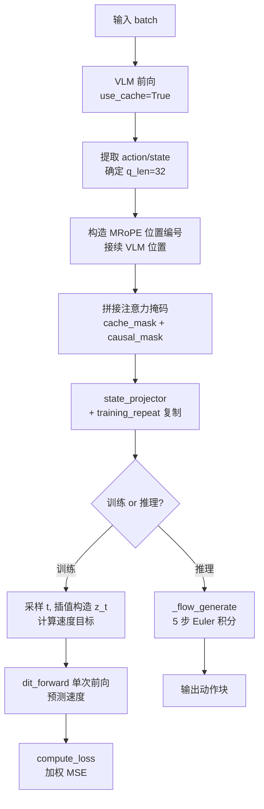

# 第七章：训练前向传播完整走读 —— 从 Batch 到 Loss

> 本章目标：把前六章讲过的所有组件（VLM、DiT、Rectified Flow、局部因果掩码）串成一次完整的训练前向传播，逐行对照代码，把每个中间变量的形状和含义讲清楚。

**前情提要**：第 3-6 章分别讲了 VLM、DiT、Rectified Flow、掩码设计这四块的内部原理。本章把它们组装起来，看 `XR0.forward()` 具体怎么把一个训练 batch 变成一个标量 loss。

**知识链接**：
- [RoPE 旋转位置编码](/前置知识/002k_前置知识_RoPE旋转位置编码) — 本章会用到 MRoPE 位置延续的具体计算

---

## 一、训练 batch 长什么样

在深入 `forward` 之前，先明确一个训练样本包含什么（更详细的数据构造过程见 [第 9 章](./09_数据管线_JSON标注与相对动作计算)）：

```python
batch = {
    "input_ids": ...,          # VLM 文本 token，[B, S_vlm]
    "attention_mask": ...,     # VLM 输入的有效性掩码，[B, S_vlm]
    "pixel_values": ...,       # 图像 patch，具体形状取决于分辨率
    "image_grid_thw": ...,     # 图像网格形状信息（供 MRoPE 使用）
    "action": ...,             # 真实动作（已归一化），[B, 30, 32]
    "action_mask": ...,        # 动作有效性掩码，[B, 30, 32]
    "state": ...,              # 当前状态，[B, 1, 32]
}
```

## 二、第一步：VLM 前向传播，产出 KV-Cache

```python
prefix_length = batch.pop("prefix_length", 0)
vlm_outputs = self.vlm(**batch, use_cache=True)
```

注意这里 `**batch` 会把 `action`、`action_mask`、`state` 这些非 VLM 字段也传进去——Qwen3-VL 的 `forward` 方法通过 `**kwargs` 接收并忽略掉自己不认识的字段（这是 HuggingFace `transformers` 库模型的常见约定），只处理 `input_ids`、`attention_mask`、`pixel_values` 等它认识的字段。`vlm_outputs.past_key_values` 就是第三章讲过的 36 层 KV-Cache。

## 三、第二步：提取动作/状态输入，确定序列长度

```python
action, action_mask, state = self.get_action_input(batch)
action_bs, action_length, _ = action.shape         # action_bs=B, action_length=30
_, state_length, _ = state.shape                    # state_length=1
q_len = action_length + state_length + 1            # 30+1+1=32（DiT 输入序列总长）
prefix_length = self._normalize_prefix_length(prefix_length, action_length)
past_key_values = list(vlm_outputs.past_key_values)
```

`get_action_input` 从 batch 里弹出（`pop`）`action`、`action_mask`、`state`（如果没提供，比如纯推理场景，则用全零张量填充占位，详见第五节推理路径）。`q_len=32` 正是第六章掩码矩阵的边长。

同步训练模式下（`async_train=False`，默认配置），`prefix_length` 会被强制设为 0：

```python
if self.training:
    prefix_length = 0
    if self.async_train and random.random() < 0.5:
        prefix_length = random.randint(1, min(6, action_length))
```

本章先只讲 `prefix_length=0` 的同步训练路径（对应默认配置 `async_train=false`），异步训练的 prefix 条件化机制留给 [第 8 章](./08_异步训练_Prefix条件化与加权Loss)专门展开。

## 四、第三步：位置编码延续 —— 让 DiT 的 RoPE 位置接着 VLM 走

```python
position_ids = (
    torch.arange(0, q_len, device=action.device).view(1, 1, -1).repeat(3, action_bs, 1)
    + vlm_outputs.position_ids.max(dim=-1)[0][..., None]
    + 1
)
if action_length > prefix_length:
    position_ids[:, :, -(action_length - prefix_length):] += 10
```

**这一步在做什么**：DiT 的 32 个 token（sink+state+action）需要一套自己的 RoPE 位置编号，但这套编号不是从 0 开始独立计数，而是**紧接着 VLM 序列最后一个 token 的位置继续往后编号**。这样设计的直觉是：整个"VLM 序列 + DiT 序列"在概念上被当成一条**统一延伸**的位置轴,即使 DiT 内部走的是完全独立的 Cross-Attention 路径,位置编号上仍然保持"DiT token 排在 VLM token 之后"这个自然的顺序关系,避免两段位置编号意外重叠导致位置歧义。

**逐项拆解**：

| 符号 | 含义 | 具体是什么 |
|------|------|-----------|
| `torch.arange(0, q_len)` | DiT 内部的相对位置序号 | $[0, 1, \ldots, 31]$ |
| `.repeat(3, action_bs, 1)` | 扩展到 MRoPE 的三个维度 | 因为 Qwen3-VL 用 $(t,h,w)$ 三元组位置（第三章），DiT 这里三个维度取值相同(退化为一维序号) |
| `vlm_outputs.position_ids.max(dim=-1)[0]` | VLM 序列中最大的位置编号 | 即 VLM 最后一个 token 的位置 |
| `+1` | 从 VLM 最后位置的下一个开始 | 保证不和 VLM 的位置编号重叠 |
| `position_ids[..., -(action_length-prefix_length):] += 10` | 额外给"待去噪"的动作 token 加一个偏移 10 | 见下方解释 |

**为什么 action token 要额外 +10**：这是为了在位置编号上把"state/sink"和"待去噪的 action"进一步区分开——避免 state token（位置紧接在 VLM 之后）和第一个 action token（原本紧接在 state 之后）的位置编号过于接近导致 RoPE 编码相似度过高。额外加一个固定偏移量，人为拉大两者在位置轴上的距离，让 Attention 更容易区分"这是状态信息"还是"这是待去噪的动作"。这是一个经验性的工程技巧，不是严格的数学推导结果。

## 五、第四步：构造联合注意力掩码

```python
cache_mask = batch["attention_mask"][:, None, :].expand(-1, q_len, -1)
causal_mask = self._make_local_causal_mask(action_bs, state_length, action_length, action.device)
if self.training and prefix_length > 2:
    causal_mask = self._random_mask_prefix(causal_mask, prefix_length, state_length)
attn_mask = torch.cat([cache_mask, causal_mask], dim=-1)[:, None].bool()
```

**这一步在做什么**：把两部分掩码拼接成一个完整的 `[B, 1, q_len, S_vlm+q_len]` 掩码，对应第四章讲的"把 VLM 的 K/V 拼接到 DiT 自己的 K/V 前面"这个设计。

- `cache_mask`：形状 `[B, q_len, S_vlm]`，直接复制 VLM 自己的 `attention_mask`（哪些 VLM token 是有效的、非 padding 的），并广播到所有 32 个 DiT Query 位置——也就是说,所有 DiT token 对 VLM 部分的可见性完全一致,只受 VLM 侧的 padding 影响,不做任何额外限制。
- `causal_mask`：形状 `[B, q_len, q_len]`，就是第六章详细讲的局部因果掩码，控制 DiT token 之间（sink/state/action）互相能看到谁。
- `torch.cat(..., dim=-1)`：在"Key 维度"上拼接，最终形状 `[B, q_len, S_vlm+q_len]`——这正好和第四章 `DiTAttention.forward` 里 `torch.cat([k_cache, key_states], dim=-2)` 拼出来的联合 Key 序列长度对齐。

## 六、第五步：状态投影与训练重复因子

```python
state_embed = self.state_projector(state)   # [B, 1, 32] → [B, 1, 1024]

if self.training and self.training_repeat > 1:
    position_ids = self._repeat_tensor(position_ids, dim=1)
    action = self._repeat_tensor(action)
    prefix = self._repeat_tensor(prefix)
    action_mask = self._repeat_tensor(action_mask)
    state_embed = self._repeat_tensor(state_embed)
    attn_mask = self._repeat_tensor(attn_mask)
    past_key_values = self._repeat_past_key_values(past_key_values)
```

**这一步在做什么**：`training_repeat=4`（XR0 默认配置）意味着，VLM 前向传播只跑**一次**，但把它的输出（KV-Cache、位置编号等）沿 batch 维度复制 4 份，配合 4 组**不同的**随机噪声和时间步采样（下一步会看到），相当于"用一次 VLM 计算的成本，换来 4 倍于原始 batch size 的 Rectified Flow 训练样本"。

**为什么这样做是合理的**：VLM 是整个模型里参数量最大、计算量最重的部分（4.7B 参数），而 Rectified Flow 训练本身需要大量不同的 $(t, x_0)$ 采样才能让网络学好从任意噪声程度出发的去噪能力。既然给定同一个视觉-语言输入，可以配上任意多组不同的噪声/时间步组合，不如"一次 VLM 前向、多次 Flow 训练"来分摊成本——这是一个用少量额外显存开销（复制张量）换取大量计算节省（避免重复调用最昂贵的 VLM 前向）的工程权衡。

## 七、第六步：Rectified Flow 训练核心逻辑

```python
position_embeds = self.rotary_emb(action, position_ids)
noise = torch.randn_like(action)

if self.training:
    t = self._sample_timestep(action.shape[0], dtype=action.dtype, device=action.device)
    t = t.unsqueeze(dim=1).unsqueeze(dim=1)               # [B] → [B,1,1]
    noisy_action = self._flow_interpolate(noise, action, t)
    target = self._flow_velocity_target(noise, action)
    pred = self.dit_forward(
        torch.cat([prefix, noisy_action[:, prefix_length:]], dim=1),
        t, action_mask, state_embed, position_embeds, past_key_values, attn_mask,
        prefix_length=prefix_length,
    )[:, prefix_length:]
    target = target[:, prefix_length:]
```

这里的每一步都是前几章讲过的组件的直接调用：

1. `self.rotary_emb(action, position_ids)`：用第四步算出的位置编号，计算 DiT 用的 RoPE $(\cos,\sin)$——复用第三章介绍的 `Qwen3VLTextRotaryEmbedding`
2. `self._sample_timestep(...)`：第五章讲的 Beta 分布时间步采样
3. `self._flow_interpolate(...)`：第五章讲的直线插值构造带噪动作
4. `self._flow_velocity_target(...)`：第五章讲的速度场目标 $x_1-x_0$
5. `self.dit_forward(...)`：第四章讲的 DiT 完整前向传播（内部拼接 `[sink, state, noisy_action]`，跑 16 层 DecoderLayer）

同步训练时 `prefix_length=0`，所以 `torch.cat([prefix, noisy_action[:, 0:]], dim=1)` 就是完整的 30 步带噪动作（`prefix` 是空张量），`pred[:, 0:]` 也是完整的 30 步预测——切片操作在这个路径下相当于空操作，是为了和异步训练路径共享同一份代码逻辑。

## 八、第七步：计算 Loss

```python
if prefix_length > 0:
    with torch.no_grad():
        pred_prefix = self._flow_generate(...)
    weight = (pred_prefix[:, prefix_length:] - action[:, prefix_length:]).abs()
else:
    weight = torch.ones_like(pred)

action_mask = action_mask[:, prefix_length:]
...
return self.compute_loss(pred, target, action_mask, weight if self.training else None)
```

同步训练路径下 `prefix_length=0`，直接进入 `else` 分支，`weight` 是全 1 张量——也就是第五章讲的加权 MSE 在这个路径下退化为标准 MSE（不做额外加权）。`compute_loss` 的完整逻辑已经在第五章第 2.3 节讲过。

## 九、推理路径的差异

`generate` 方法本质上是调用同一个 `forward`，只是 `return_loss=False`：

```python
@torch.no_grad()
def generate(self, batch):
    return self.forward(batch, return_loss=False)
```

推理时的关键差异：

```python
else:  # 对应 self.training == False
    target = action  # 推理时没有意义，只是占位
    dit_kwargs = dict(action_mask=action_mask, state_embed=state_embed, position_embeds=position_embeds,
                       past_key_values=past_key_values, attn_mask=attn_mask, prefix_length=prefix_length)
    pred = self._flow_generate(torch.cat([prefix, noise[:, prefix_length:]], dim=1), dit_kwargs)
```

不再是单次前向预测速度，而是调用第五章讲的 `_flow_generate`——从纯噪声出发，做 5 步 Euler 积分，`pred` 就是最终生成的动作块本身（不是速度）。另外推理时 `self.training=False`，所以 `prefix_length` 不会被强制清零，而是保留调用方传入的原始值（通常是 0，除非是异步执行场景，见 [第 12 章](./12_推理与部署_同步异步执行模式)）。

## 十、本章小结：完整前向传播流程图



**下一章预告**：[第 8 章](./08_异步训练_Prefix条件化与加权Loss)展开本章故意跳过的异步训练路径——`prefix_length > 0` 时具体发生了什么，以及那个用 no-grad 推理误差构造出来的动态权重是怎么工作的。
