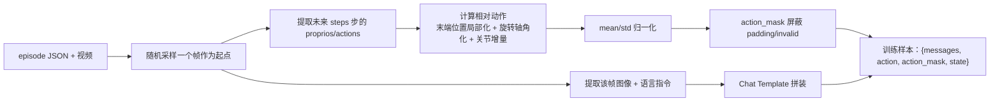

# 第九章：数据管线 —— JSON 标注、相对动作计算与归一化

> 本章目标：理解 XR0 的训练数据长什么样、32 维动作空间每一维代表什么、旋转量怎么从旋转矩阵转换成轴角表示，以及归一化统计量怎么使用。

**前情提要**：前八章讲完了模型架构和训练算法。从本章开始转向数据侧——一份训练样本具体是怎么从原始机器人轨迹数据构造出来的。

**知识链接**：
- [概率密度函数与高斯分布](/前置知识/002b_前置知识_概率密度函数与高斯分布) — 归一化统计量（均值/方差）的基础

---

## 一、原始数据格式：一个 episode 一个 JSON + 三段视频

每条训练轨迹（episode）由一个 JSON 标注文件和三段同步录制的视频（Ego 视角、左腕视角、右腕视角）组成：

```jsonc
{
  "trajectory_type": "success",
  "num_frames": 5997,
  "instruction": {
    "general": [{
      "images": ["observations.ego", "observations.wrist_left", "observations.wrist_right"],
      "conversations": [
        {"from": "human", "value": "...\n<image>\n...\n<image>\n...\n<image>\nGenerate robot actions for the task:\n把耳机放进收纳盒"},
        {"from": "gpt", "value": "<bot></bot>"}
      ]
    }]
  },
  "observations": {
    "ego": [{"path": "data/videos/episode_001_ego.mp4", "start": 0, "end": 5997, "fps": 30}],
    "wrist_left": [...], "wrist_right": [...]
  },
  "proprios": {
    "left_ee_pos": [[x,y,z], ...],       // [N,3] 左臂末端位置
    "left_ee_rotm": [[r00,...,r22], ...], // [N,9] 左臂末端旋转矩阵（3x3展平）
    "left_arm_joint": [[j0,...,j5], ...], // [N,6] 左臂关节角
    "left_gripper_pos": [[g], ...],       // [N,1] 左夹爪
    "right_ee_pos": ..., "right_ee_rotm": ..., "right_arm_joint": ..., "right_gripper_pos": ...
  },
  "actions": { /* 结构和 proprios 完全一样，代表每一帧的目标值 */ }
}
```

**关键设计**：`proprios` 记录的是"当前帧实际测得的机器人状态"，`actions` 记录的是"这一帧对应的目标状态"。两者结构完全对称，训练时会计算 `actions - proprios` 得到"增量"，这也是下一节要讲的"相对动作"的数据来源。

`trajectory_type` 有三种取值：`"success"`（完整成功的轨迹）、`"ongoing"`（未完成的部分轨迹，仍可用于训练但需要正确处理边界）、`"invalid"`（失败轨迹，训练时该样本的动作会被完全掩码，不贡献 Loss）。

## 二、32 维动作空间：为什么是这个布局

```python
ACTION_PARTS = (
    ("left_ee_pos",   slice(0, 3)),    # 左臂末端位置增量 (3维)
    ("left_ee_aa",    slice(3, 6)),    # 左臂末端旋转增量·轴角表示 (3维)
    ("left_gripper",  slice(6, 7)),    # 左夹爪增量 (1维)
    ("left_joint",    slice(7, 13)),   # 左臂关节角增量 (6维)
    # 第13维保留（恒0）
    ("right_ee_pos",  slice(14, 17)),
    ("right_ee_aa",   slice(17, 20)),
    ("right_gripper", slice(20, 21)),
    ("right_joint",   slice(21, 27)),
    # 第27-31维保留（恒0）
)
```

**为什么末端位姿和关节角都要**：末端位姿（位置+旋转）和关节角是描述机械臂状态的两种互补方式——末端位姿更贴近任务语义（"移动到某个位置、转到某个朝向"），关节角更贴近底层执行器的实际控制信号（每个电机转多少度）。同时提供两种表示，让下游控制器可以根据实际部署场景灵活选择使用哪一种（比如末端位姿更适合做视觉伺服式的闭环控制，关节角更适合直接的位置控制）。

**为什么有保留维度（第 13、27-31 维恒为 0）**：这是给未来可能扩展的自由度（比如更多的手指关节、额外的传感器读数）预留空间，同时把总维度对齐成一个统一的 32——固定动作维度让模型架构（`action_shape=(30,32)`）不需要因为具体机器人配置的细微差异而改变，是一种为了工程简洁性做的设计。

## 三、相对动作：为什么不直接预测绝对位姿

### 3.1 末端位置增量的计算

```python
def _arm_action(self, traj, arm, frame, steps):
    rotm = self._frame(traj, f"proprios.{arm}_ee_rotm", frame).reshape(3, 3)
    pos = self._frame(traj, f"proprios.{arm}_ee_pos", frame)
    target_pos = self._future(traj, f"actions.{arm}_ee_pos", frame, steps)
    target_rotm = self._future(traj, f"actions.{arm}_ee_rotm", frame, steps).reshape(-1, 3, 3)
    return (
        self._pad((rotm.T @ (target_pos - pos).T).T, steps),
        self._pad(rotm2aa_batch(rotm.T @ target_rotm), steps),
        ...
    )
```

**为什么需要这个公式**：如果直接让模型预测"未来 30 步的绝对末端位置"，模型必须同时学会"当前处在世界坐标系里的哪个位置"和"应该移动到哪里"两件事——但机器人在整个工作空间里的绝对位置分布可能很分散（不同 episode 起始位置不同），直接回归绝对坐标会让训练目标的分布范围很宽、难以标准化。改成预测**相对于当前帧的位置增量**，把问题简化成"从当前位置出发，应该往哪个方向移动多远"，这个增量的取值范围天然更集中（相邻几十帧之间的位移通常是小范围的），更容易被神经网络学好。

$$
\Delta p^{\text{local}} = R_{\text{cur}}^T \big(p_{\text{target}} - p_{\text{cur}}\big)
$$

> **一句话**：先算出目标位置和当前位置之间的世界坐标系位移，再把这个位移转换到"以当前末端姿态为参考"的局部坐标系下表示。

**逐项拆解**：

| 符号 | 含义 | 具体是什么 |
|------|------|-----------|
| $p_{\text{cur}}, p_{\text{target}}$ | 当前帧/目标帧的末端位置 | 世界坐标系下的 3D 坐标 |
| $p_{\text{target}} - p_{\text{cur}}$ | 世界坐标系下的位移向量 | 还没有考虑末端本身的朝向 |
| $R_{\text{cur}}$ | 当前帧末端的旋转矩阵 | 描述末端坐标系相对世界坐标系的朝向 |
| $R_{\text{cur}}^T$ | 旋转矩阵的转置（即逆矩阵，因为旋转矩阵是正交矩阵） | 把一个世界坐标系下的向量转换到末端自身坐标系下表示 |

**数值例子**：假设末端当前朝向使得它的旋转矩阵恰好是绕 z 轴转 90° 的矩阵，$R_{\text{cur}}=\begin{pmatrix}0&-1&0\\1&0&0\\0&0&1\end{pmatrix}$。世界坐标系下位移 $p_{\text{target}}-p_{\text{cur}}=(1,0,0)$（沿世界 x 轴移动了 1 个单位）：

$$
\Delta p^{\text{local}} = R_{\text{cur}}^T (1,0,0)^T = \begin{pmatrix}0&1&0\\-1&0&0\\0&0&1\end{pmatrix}\begin{pmatrix}1\\0\\0\end{pmatrix} = \begin{pmatrix}0\\-1\\0\end{pmatrix}
$$

也就是说，在末端自己的局部坐标系里，这个位移相当于"往末端自身坐标系的 -y 方向移动了 1 个单位"——因为末端本身转了 90°，同一个世界坐标系下的位移，从末端自己的视角看方向发生了变化。**为什么要转换到局部坐标系**：这让"往前伸"这个动作，不管末端当前朝向如何，在局部坐标系下都对应大致相同的增量模式（比如末端坐标系的 +x 方向总是代表"沿当前朝向前伸"），比直接用世界坐标系下的位移更容易被模型学到一种跨场景通用的模式。

### 3.2 旋转增量：轴角表示

```python
return self._pad(rotm2aa_batch(rotm.T @ target_rotm), steps)
```

先计算相对旋转矩阵 $R_{\text{rel}} = R_{\text{cur}}^T R_{\text{target}}$（描述"从当前朝向转到目标朝向需要转多少"），再用 `rotm2aa_batch` 把旋转矩阵转换成**轴角表示**（axis-angle：一个 3 维向量，方向是旋转轴，长度是旋转角度）。

**为什么用轴角而不是直接用旋转矩阵（9 个数）或四元数（4 个数）**：轴角表示只需要 3 个数就能唯一描述一个旋转（旋转矩阵有 9 个数但只有 3 个自由度，存在冗余约束；四元数有 4 个数外加一个单位长度约束）。3 维的轴角向量可以像位置增量一样直接参与后续的归一化、MSE 回归，不需要额外处理"旋转矩阵必须保持正交""四元数必须保持单位长度"这类流形约束——这是让旋转量也能被当作普通欧几里得向量来训练回归的一个常见工程选择。

### 3.3 关节角和夹爪增量：直接相减

```python
def _delta(self, traj, current_key, target_key, frame, steps):
    return self._pad(self._future(traj, target_key, frame, steps) - self._frame(traj, current_key, frame), steps)
```

关节角和夹爪不涉及坐标系转换问题（它们本身就是标量或独立的角度，没有"局部坐标系"的概念），直接用目标值减当前值即可得到增量。

## 四、归一化：mean/std 标准化

```python
def normalize_action(action, mean, std):
    return (action - mean) / (std + ACTION_EPS)
```

**为什么需要归一化**：动作空间里不同维度的数值范围差异很大——比如末端位置增量可能是厘米级别的小数值，关节角增量可能是弧度制的小数值，夹爪开合量又是另一个量级。如果不做归一化，MSE Loss 会天然地更"偏向"数值范围更大的维度（因为它们贡献的平方误差绝对值更大），导致训练时梯度更新不成比例地照顾某些维度而忽略其他维度。

XR0 的归一化统计量（`mean`, `std`）不是全局单一的一对数字，而是形状为 `(action_length, 32)` 的**逐时间步、逐维度**的统计量——也就是说，动作块里第 5 步的第 3 维和第 20 步的第 3 维，各自有独立的均值方差（详见数据配置文件 `configs/data/earphone.yaml` 里的 `mean`/`std` 数组）。这允许归一化统计量捕捉"动作块里越靠后的时间步，增量的方差可能天然更大"这种时间上的分布差异（比如展望更远的未来，累积的不确定性通常更高）。

## 五、Action Mask：屏蔽 padding 帧和无效轨迹

```python
def _mask(self, traj, steps):
    kind = traj.get("trajectory_type", "success")
    if kind == "invalid":
        return np.ones(self.action_length, dtype=np.int32)  # 全部有效但会在其他环节被处理为完全无意义
    mask = np.zeros(self.action_length, dtype=np.int32)
    mask[:steps] = 1
    return mask
```

**这一步在做什么**：当采样到的起始帧靠近 episode 末尾时，实际可用的未来帧数 `steps` 可能小于目标动作块长度 30（比如 episode 只剩 10 帧就结束了）。这时用 `_pad` 函数把最后一帧的动作值重复填充到 30 步（详见 `_pad` 方法），同时用 `mask` 标记哪些步骤是"真实"的（前 `steps` 步），哪些是"填充凑数"的（后面重复的部分）——这样训练时 Loss 计算会用 `action_mask` 把填充部分完全屏蔽，不让这些人为重复的数值污染梯度。

`build_action_mask` 进一步把这个时间维度的 0/1 掩码（长度 30），广播到完整的 32 维动作空间（利用第二节的 `ACTION_PARTS` 布局，只有真正对应有效动作分量的维度才置 1，保留维度和被掩码的时间步都是 0）。

## 六、State 组成：单帧、不含增量

```python
@staticmethod
def _state(traj, frame):
    return compose_state(
        left_gripper=..., left_joint=..., right_gripper=..., right_joint=...,
    )
```

和动作不同，`state`（模型输入的当前状态）不涉及"增量"的概念——它直接是当前帧的绝对读数（关节角、夹爪开合量），因为这本来就是给模型提供的"当前物理现实"，不需要相对化。State 只用 32 维空间里的一部分（关节角和夹爪对应的维度，不包含末端位姿——因为末端位姿理论上可以从关节角和机器人模型正解算出来，不需要重复提供）。

## 七、本章小结：从原始数据到训练样本的完整链路



**下一章预告**：[第 10 章](./10_图像增强与批处理)看图像具体经历了哪些数据增强步骤，以及多个样本怎么被拼装成一个可以直接喂给 VLM 的 batch。
