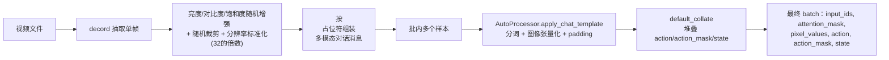

# 第十章：图像增强与批处理 —— 从视频帧到 VLM 输入

> 本章目标：理解视频帧怎么被抽取、增强，语言指令怎么和图像拼装成 VLM 能理解的对话格式，以及一批不同长度的样本怎么被整理成统一的 batch。

**前情提要**：第 9 章讲完了动作/状态数据的构造。本章看数据管线里的另一半——图像和文本怎么变成模型输入。

---

## 一、图像抽取：从视频文件里取一帧

```python
@staticmethod
def _images(traj, keys, frame):
    images = []
    frame = [max(frame, 0)]
    for key in keys:
        infos = get_value(traj, key)
        for info in infos:
            video = VideoReader(info["path"], num_threads=2)
            video.seek(0)
            images.extend(Image.fromarray(image) for image in video.get_batch(frame).asnumpy())
    return images
```

**这一步在做什么**：XR0 的每个训练样本只用**单帧**图像（不是视频片段），对应"当前时刻拍到的画面"。`keys` 来自 JSON 标注里 `instruction.general[].images` 字段指定的路径列表（比如 `["observations.ego", "observations.wrist_left", "observations.wrist_right"]`），依次用 `decord.VideoReader` 打开对应的视频文件，用 `get_batch([frame])` 精确抽取第 `frame` 帧,转换成 PIL 图像对象。

`max(frame, 0)` 是一个边界保护——理论上 `frame` 应该总是非负的采样起点，这里做一个防御性处理避免索引越界。

## 二、图像增强：亮度、对比度、饱和度随机扰动

```python
def _augment(self, images):
    ops = (
        (adjust_brightness, 1.0 + random.uniform(-32.0/255.0, 32.0/255.0)),
        (adjust_contrast, random.uniform(0.5, 1.5)),
        (adjust_saturation, random.uniform(0.5, 1.5)),
        (adjust_hue, 0.0),
    )
    flags = [random.randint(0, 1) == 0 for _ in ops]
    out = []
    for image in images:
        image = self._crop(resize_image(image, factor=32, max_pixels=90000))
        for use, (op, value) in zip(flags, ops):
            if use:
                image = op(image, value)
        out.append(image)
    return out
```

**为什么需要图像增强**：训练数据的采集条件（光照、摄像头曝光设置、场景摆放）往往和真实部署时的条件存在细微差异。如果模型在训练时只见过一种固定的视觉风格，稍微变化的光照或色彩就可能让模型的视觉理解出现偏差。随机扰动亮度、对比度、饱和度，让模型在训练时见过更多样的视觉呈现方式，学会忽略这些和任务本身无关的表面变化，只关注真正重要的场景语义（物体的位置、形状、指令要求的目标）。

**逐项拆解**：

| 增强操作 | 参数范围 | 效果 |
|---------|---------|------|
| `adjust_brightness` | $[1-32/255,\ 1+32/255] \approx [0.874, 1.126]$ | 整体亮度上下浮动约 12.6% |
| `adjust_contrast` | $[0.5, 1.5]$ | 明暗对比度的强弱变化 |
| `adjust_saturation` | $[0.5, 1.5]$ | 色彩鲜艳程度的变化 |
| `adjust_hue` | 固定为 $0.0$ | 色调保持不变（虽然定义了这个操作，但参数恒为 0，等价于不生效） |

**每种操作是否生效也是随机的**（`flags`），50% 概率跳过某个增强，进一步增加训练时看到的图像风格组合的多样性——不是每次都同时应用全部 4 种扰动，而是随机子集组合。

### 2.1 随机裁剪：`_crop`

```python
@staticmethod
def _crop(image, ratio=0.95):
    height, width = image.size[1], image.size[0]
    crop_h, crop_w = int(height * ratio), int(width * ratio)
    top = int(np.random.randint(0, height - crop_h + 1))
    left = int(np.random.randint(0, width - crop_w + 1))
    return vision_f.resize(vision_f.crop(image, top, left, crop_h, crop_w), size=(height, width))
```

先按 95% 的比例裁出一个稍小的区域（随机选取裁剪窗口的位置），再把裁剪结果缩放回原始尺寸。**这样做的效果**是引入一种轻微的"随机平移/缩放"扰动——原本贴近图像边缘的物体，裁剪后可能整体往画面中心偏移了一点，让模型不会过度依赖"某个物体总是出现在画面固定位置"这种偶然的数据集偏置。

### 2.2 分辨率标准化：`resize_image`

```python
def resize_image(image, factor=32, min_pixels=32*32, max_pixels=90000):
    ...
    new_height = max(factor, round(height/factor)*factor)
    new_width = max(factor, round(width/factor)*factor)
    if new_height * new_width > max_pixels:
        scale = math.sqrt(height*width/max_pixels)
        new_height = max(factor, math.floor(height/scale/factor)*factor)
        new_width = max(factor, math.floor(width/scale/factor)*factor)
    ...
    return image.resize((new_width, new_height))
```

**为什么需要这一步**：Qwen3-VL 的视觉编码器要求输入图像的高宽都是 `factor`（这里是 32）的整数倍——因为 patch embedding 用固定大小的方块切图（第三章讲过），高宽不对齐就会导致最后一行/列的像素无法被完整切成一个 patch。这个函数先把原始分辨率就近调整到 32 的整数倍，再检查总像素数是否超出 `max_pixels`（90000，对应大约 300×300 的画面），超出则等比例缩小,确保视觉 token 的数量不会因为图像分辨率过大而爆炸。

## 三、构造对话格式：Chat Template

### 3.1 从标注里的 `<image>` 占位符到实际图像

```python
@staticmethod
def _messages(conversations, images):
    pool = [{"type": "image", "image": image} for image in images]
    messages = []
    for turn in conversations:
        role = "user" if turn["from"] == "human" else "assistant"
        if role == "assistant":
            messages.append({"role": role, "content": [{"type": "text", "text": turn["value"]}]})
            continue
        content = []
        for part in PROMPT_RE.split(turn["value"]):
            if part == "<image>":
                content.append(pool.pop(0))
            elif part:
                content.append({"type": "text", "text": part})
        messages.append({"role": role, "content": content})
    return messages
```

**这一步在做什么**：JSON 标注里的对话文本形如 `"...\n<image>\n...\n<image>\n...\n<image>\nGenerate robot actions..."`，其中 `<image>` 是占位符，代表"这里插入一张图"。这个方法用正则表达式把文本按 `<image>` 切分，依次把切分出来的文本段和图像对象重新组装成 HuggingFace `transformers` 处理器（`AutoProcessor`）能理解的多模态消息格式——一个 `content` 列表，里面按顺序混合了 `{"type": "text", ...}` 和 `{"type": "image", ...}` 元素。

图像池 `pool` 按顺序被消耗（`pool.pop(0)`），如果 `<image>` 占位符数量和实际提供的图像数量不匹配，会抛出异常——这是一个数据一致性检查，确保标注文件里的占位符数量和 `images` 字段列出的视图数量严格对齐。

### 3.2 特殊的"无思维链"标记

回顾第 9 章数据构造代码里的：

```python
conversations[0]["value"] += " /no_cot"
conversations[1]["value"] = "<cot></cot>"
```

`/no_cot` 和 `<cot></cot>` 是训练数据里插入的特殊标记，暗示 XR0 的骨干网络（或者其训练配方）设计上支持"思维链"（Chain-of-Thought）模式——模型有能力在给出动作之前先输出一段推理过程（"思考"），但在当前的训练配置里，通过 `/no_cot` 指令主动关闭了这个功能，直接用空的 `<cot></cot>` 占位。这留下一个可以扩展的接口：如果未来想让模型在生成动作前先做显式推理，只需要调整这个标记的用法，不需要改动模型结构。

## 四、批处理：CustomCollate

### 4.1 为什么需要自定义的 collate 逻辑

标准的 `torch.utils.data.dataloader.default_collate` 只能处理规则的张量堆叠（比如把 N 个形状相同的张量拼成一个 batch 维度的张量），但一个 batch 里的每个样本包含"长度不同的对话消息 + 数量不同的图像"这种非规则结构，需要先经过 VLM 自己的 `AutoProcessor`（负责 tokenize 文本、把图像转换成模型输入的像素张量、并对不等长的文本做 padding）处理成规则张量之后，再走标准的 collate 逻辑。

```python
class CustomCollate:
    def __init__(self):
        self.processor = AutoProcessor.from_pretrained("Qwen/Qwen3-VL-4B-Instruct")
        self.processor.tokenizer.padding_side = "right"

    def __call__(self, batch):
        messages = [item["messages"] for item in batch]
        payload = [{k: v for k, v in item.items() if k != "messages"} for item in batch]
        inputs = self.processor.apply_chat_template(
            messages, tokenize=True, return_dict=True, return_tensors="pt",
            padding=True, images_kwargs={"do_resize": False},
        )
        if payload[0]:
            inputs.update(default_collate(payload))
        return inputs
```

**这一步在做什么**：先把一批样本的 `messages`（对话+图像）交给 `processor.apply_chat_template` 统一处理——这一步内部完成了分词、图像转张量、以及**按 batch 内最长序列做右侧 padding**（`padding_side="right"`，`padding=True`）。剩下的字段（`action`, `action_mask`, `state`，即第九章构造的动作/状态张量，它们本身长度已经固定为 30 或 1，可以直接用标准 `default_collate` 堆叠）单独走一遍标准 collate，再合并进最终的输入字典。

**`images_kwargs={"do_resize": False}`**：告诉处理器不要对图像再做一次自动缩放——因为图像已经在 `_augment`（第二节）里被显式缩放到 32 的整数倍分辨率了，避免处理器内部的默认缩放逻辑和数据管线里已经做过的缩放逻辑产生冲突或重复计算。

### 4.2 Padding 对 Attention Mask 的影响

因为一个 batch 里不同样本的文本长度（指令长度不同）和图像数量可能不同，右侧 padding 会让较短的样本在序列末尾补上填充 token。`attention_mask`（VLM 输入里标记哪些位置是真实 token、哪些是 padding）正是为了让 VLM 的 Attention 计算正确忽略这些填充位置——这份 mask 也正是第七章讲到的 `cache_mask` 的来源（`batch["attention_mask"]`），会被拼接进 DiT 的联合注意力掩码里，确保 DiT 查询 VLM KV-Cache 时也不会被填充位置的无意义信息干扰。

## 五、本章小结：从视频文件到模型输入的完整链路



**下一章预告**：[第 11 章](./11_训练配置_DeepSpeed与优化器)看训练配置的具体细节——DeepSpeed ZeRO 分布式策略、优化器参数分组、学习率调度器的公式细节。
