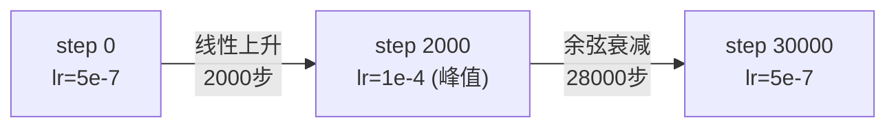

# 第十一章：训练配置 —— DeepSpeed ZeRO + AdamW + Cosine Warmup

> 本章目标：理解 XR0 训练时的分布式策略、优化器参数分组逻辑，以及学习率调度公式的具体计算方式。

**前情提要**：第 7-10 章讲完了模型的前向传播和数据管线。本章看"训练"这个动作本身是怎么被组织起来的——用什么优化器、什么学习率策略、怎么分布式扩展到多机多卡。

**知识链接**：
- [数据并行与 AllReduce 基础](/前置知识/001h_前置知识_数据并行与AllReduce基础) — 分布式训练的地基概念
- [FSDP：全分片数据并行](/前置知识/001i_前置知识_FSDP全分片数据并行) — DeepSpeed ZeRO 和 FSDP 是同一类思路的不同实现

---

## 一、整体训练框架：PyTorch Lightning + Hydra

XR0 用 [PyTorch Lightning](https://lightning.ai/) 组织训练循环，用 [Hydra](https://hydra.cc/) + [OmegaConf](https://omegaconf.readthedocs.io/) 管理配置。三层配置文件分别管数据、模型、训练器：

```yaml
# configs/config.yaml
defaults:
  - _self_
  - data: midata/earphone
  - model: XR0
  - trainer: deepspeed
```

这种分层配置的好处是可以独立替换某一层而不影响其他层——比如换一个新任务只需要新增一个 `data` 配置文件（复制 `earphone.yaml` 改数据路径和归一化统计量），模型和训练器配置完全不用动。

`BaseRunner`（继承自 `lightning.LightningModule`）封装了模型构建、优化器构建、训练/验证步骤：

```python
class BaseRunner(LightningModule):
    def configure_model(self):
        self.model = MIMODEL.build(self._model)
        if self._pretrained:
            ckpt = torch.load(self._pretrained, map_location="cpu")
            info = self.load_state_dict(ckpt["module"], strict=False)

    def training_step(self, batch, batch_idx):
        self.log("train/token", batch["input_ids"].shape[1])
        loss_dict = self.model(batch, return_loss=True)
        for loss_name, loss_value in loss_dict.items():
            self.log(f"train/{loss_name}", loss_value.detach())
        self.log("lr", self.optimizers().param_groups[0]["lr"])
        return loss_dict
```

`training_step` 直接调用第七章讲过的 `XR0.forward(batch, return_loss=True)`，得到 `{"loss": ..., "loss_mse": ..., "loss_freq": ...}` 这个字典（第五章 `compute_loss` 的输出），逐项记录到日志（Weights & Biases），Lightning 框架会自动用 `loss_dict["loss"]` 做反向传播。

## 二、优化器参数分组：哪些参数不需要 Weight Decay

```python
no_decay = ["bias", "norm", "Norm", "ln", "Ln", "rotary_emb", "adaln"]

optimizer_grouped_parameters = [
    {"params": [p for n, p in parameters if not any(nd in n.lower() for nd in no_decay) and p.requires_grad],
     "weight_decay": module_params.get("weight_decay", 0.1)},
    {"params": [p for n, p in parameters if any(nd in n.lower() for nd in no_decay) and p.requires_grad],
     "weight_decay": 0.0},
]
```

**为什么需要这个分组**：Weight Decay（权重衰减）本质上是在损失函数里添加一个 $\lambda\|\theta\|^2$ 的正则项，鼓励参数数值不要过大，防止过拟合。但这个正则化假设"参数数值本身没有绝对含义,越小越好"——这个假设对普通的线性层权重矩阵是合理的,但对某些特殊参数并不合理：

- **Bias 和 Norm 层参数**（`bias`, `norm`）：这些参数通常代表偏移量或缩放系数,数值本身有明确的物理含义(比如 RMSNorm 的缩放系数如果被无差别地拉向 0，会削弱归一化层本应提供的自适应能力)，对它们做权重衰减容易起反作用
- **RoPE 相关的旋转参数**（`rotary_emb`）：RoPE 的频率参数是几何构造出来的（详见 [第三章](./03_Qwen3VL骨干_视觉编码与MRoPE)提到的固定频率公式），本身不是通过梯度下降"学习"出来的自由参数（或者即使可学习也不应该被"拉小"这种正则化逻辑影响）
- **AdaLN 调制参数**（`adaln`）：第四章讲过 `adaln_table` 的作用是产生 shift/scale/gate 这类调制信号，其数值范围的意义和普通权重矩阵不同，同样不适合被权重衰减无差别地压制

这种"按参数名字符串匹配来分组"的做法（检查参数名里是否包含这些关键词）是一种简单直接、在大模型训练里很常见的工程实践,不需要对每个模块单独手动标注。

## 三、DeepSpeed ZeRO：分布式训练策略

```yaml
strategy:
  type: deepspeed
  params:
    allgather_bucket_size: 5e8
    reduce_bucket_size: 5e8
```

DeepSpeed 的 ZeRO（Zero Redundancy Optimizer）系列策略，核心思路是把模型的参数、梯度、优化器状态**切分**到多个 GPU 上分别存储，而不是像标准数据并行那样让每个 GPU 都完整保留一份全部拷贝——这和 [FSDP：全分片数据并行](/前置知识/001i_前置知识_FSDP全分片数据并行)是同一类思路的不同实现（FSDP 是 PyTorch 原生方案，DeepSpeed ZeRO 是另一个成熟的开源实现）。对于 XR0 这种包含 4.7B 参数 VLM 骨干的模型，如果每张 GPU 都要完整保存一份优化器状态（AdamW 需要额外保存动量和二阶矩估计，通常是参数量的 2 倍显存），显存开销会非常可观，ZeRO 通过切分分摊这部分开销，让训练能在有限的多卡资源下跑起来。

`allgather_bucket_size` 和 `reduce_bucket_size` 是通信层面的调优参数，控制梯度/参数在不同 GPU 之间同步时,一次通信操作打包多大的数据块——太小会导致通信次数过多、开销累积；太大会导致单次通信占用过多显存缓冲区。这类参数通常需要根据具体的硬件配置（GPU 型号、网络带宽）做经验性调优，5e8（5 亿个元素）是一个中等规模的默认值。

## 四、优化器：FusedAdam

```yaml
optimizer:
  type: "deepspeed.ops.adam.FusedAdam"
  params:
    lr: 1.
    betas: [0.9, 0.95]
    weight_decay: 0.1
    eps: 1.0e-08
```

`FusedAdam` 是 DeepSpeed 提供的 AdamW 优化器的一个融合（fused）实现——把 AdamW 更新公式里的多个逐元素操作（一阶矩更新、二阶矩更新、参数更新）合并成更少的 CUDA kernel 调用，减少显存访问和 kernel 启动开销，在大模型训练中能带来明显的速度提升,行为上和标准 AdamW 完全等价。

**注意这里 `lr: 1.`**：这不是真正生效的学习率，而是一个占位值——真正的学习率完全由下面的调度器（`lr_lambda` 函数）动态计算并覆盖，优化器配置里的 `lr` 字段在这种"每一步都由调度器重新赋值"的用法下变得不太重要（详见下一节）。

`betas=[0.9, 0.95]`（一阶矩、二阶矩的指数衰减系数）和标准 AdamW 默认值 `[0.9, 0.999]` 略有不同——降低二阶矩的衰减系数（从 0.999 降到 0.95）意味着优化器对"梯度数值范围变化"的适应速度更快,这在大模型训练中是一个常见的调整,能让优化器更快地响应训练过程中损失landscape的变化。

## 五、学习率调度：Cosine Warmup 公式详解

```python
def lr_lambda(current_step):
    if current_step < num_warmup_steps:
        lr = min(max_lr, warmup_lr_start + (max_lr - warmup_lr_start) * current_step / max(num_warmup_steps, 1))
        return lr
    progress = float(current_step - num_warmup_steps) / float(max(1, num_training_steps - num_warmup_steps))
    lr = (max_lr - min_lr) * 0.5 * (1.0 + math.cos(math.pi * progress)) + min_lr
    return lr
```

配置为 `num_warmup_steps=2000`, `warmup_lr_start=5e-7`, `max_lr=1e-4`, `min_lr=5e-7`, `num_training_steps=30000`（即 `trainer.max_steps`）。

### 5.1 热身阶段（Warmup）：线性上升

**为什么需要这个公式**：训练刚开始时，模型参数是随机初始化（或者从预训练权重加载后接触到新任务分布），如果直接用较大的学习率更新，容易在训练早期造成剧烈震荡甚至发散。让学习率从一个很小的值线性增长到目标峰值，给模型一段"适应期"，逐步进入正常的高学习率训练节奏。

$$
\text{lr}(\text{step}) = \text{lr}_{\text{start}} + (\text{lr}_{\max} - \text{lr}_{\text{start}}) \times \frac{\text{step}}{\text{num\_warmup\_steps}}, \qquad \text{step} < \text{num\_warmup\_steps}
$$

**逐项拆解**：

| 符号 | 含义 | XR0 配置值 |
|------|------|-----------|
| $\text{lr}_{\text{start}}$ | 热身起始学习率 | $5\times10^{-7}$ |
| $\text{lr}_{\max}$ | 热身结束时达到的峰值学习率 | $1\times10^{-4}$ |
| $\text{num\_warmup\_steps}$ | 热身总步数 | 2000 |
| $\text{step}/\text{num\_warmup\_steps}$ | 热身进度百分比 | 从 0 线性增长到 1 |

**数值例子**：取 $\text{step}=1000$（热身进行到一半）：

$$
\text{lr}(1000) = 5\times10^{-7} + (1\times10^{-4} - 5\times10^{-7})\times\frac{1000}{2000} = 5\times10^{-7} + 4.975\times10^{-5} = 5.025\times10^{-5}
$$

大约是峰值学习率的一半，符合线性增长的直觉。

### 5.2 余弦衰减阶段：从峰值缓慢降到底值

**为什么需要这个公式**：训练后期需要逐渐降低学习率,让参数更新的步长变小,帮助模型收敛到损失曲面上更精细的最优点附近，而不是持续用较大的学习率在局部反复震荡。余弦函数提供了一种平滑的衰减曲线——相比线性衰减,余弦衰减在中间阶段下降更快,在两端（刚进入衰减阶段和接近训练结束）变化更缓慢，这种非线性节奏在实践中被广泛验证效果更好。

$$
\text{lr}(\text{step}) = (\text{lr}_{\max}-\text{lr}_{\min}) \times \frac{1+\cos(\pi\times\text{progress})}{2} + \text{lr}_{\min}, \qquad \text{progress} = \frac{\text{step}-\text{num\_warmup\_steps}}{\text{num\_training\_steps}-\text{num\_warmup\_steps}}
$$

**逐项拆解**：

| 符号 | 含义 | XR0 配置值 |
|------|------|-----------|
| $\text{progress}$ | 衰减阶段的进度百分比 | 从 0（刚进入衰减阶段）到 1（训练结束） |
| $\cos(\pi\times\text{progress})$ | 余弦函数在 $[0,\pi]$ 区间的取值 | progress=0 时为 1，progress=1 时为 -1 |
| $\frac{1+\cos(\cdot)}{2}$ | 归一化到 $[0,1]$ 区间的衰减系数 | progress=0 时为 1（刚开始衰减，接近峰值），progress=1 时为 0（衰减到底值） |
| $\text{lr}_{\min}$ | 衰减到最后的最低学习率 | $5\times10^{-7}$（和热身起始值恰好相同） |

**数值例子**：取 $\text{step}=16000$（热身 2000 步之后，进入衰减阶段的进度是 $(16000-2000)/(30000-2000)=14000/28000=0.5$，即衰减阶段的中点）：

$$
\text{lr}(16000) = (1\times10^{-4}-5\times10^{-7})\times\frac{1+\cos(0.5\pi)}{2}+5\times10^{-7} = 9.995\times10^{-5}\times\frac{1+0}{2}+5\times10^{-7} \approx 5.0\times10^{-5}
$$

刚好是峰值和底值的中间值（因为 $\cos(0.5\pi)=0$，衰减系数恰好是 0.5）——符合余弦曲线在中点附近对称的性质。

### 5.3 整体学习率曲线形状



整条学习率曲线呈现"快速线性爬升到峰值，再缓慢余弦下降回接近 0"的形状,这是大模型训练里非常标准的一种学习率调度策略（类似的模式在 GPT、LLaMA 等大模型的预训练配方里都能看到）。

## 六、Checkpoint 与训练监控

```python
cfg.trainer["callbacks"] = [
    ModelSummary(max_depth=2),
    ModelCheckpoint(save_top_k=-1, save_last=True, every_n_train_steps=cfg.trainer.pop("save_interval", 10000), ...),
]
logger = [WandbLogger(project=..., name=..., entity="rfm", config=cfg)]
```

`save_top_k=-1` 表示保存所有 checkpoint（不做"只保留最好的 k 个"这种筛选），配合 `every_n_train_steps` 每隔固定步数存一次（配置里 `save_interval=5000`），这样即使训练中途中断，也能从任意一个存档点恢复（对应 `trainer.ckpt_path` 参数支持传入 `"last"`、`"best"` 或具体路径）。训练指标（loss、学习率、token 数等）通过 Weights & Biases（`WandbLogger`）实时可视化，方便监控训练是否正常收敛。

## 七、本章小结：训练配置的关键数字

| 配置项 | 取值 | 作用 |
|--------|------|------|
| 精度 | bf16-mixed | 降低显存占用，加速计算 |
| 分布式策略 | DeepSpeed ZeRO-2 | 切分优化器状态/梯度到多卡 |
| 优化器 | FusedAdam, betas=(0.9,0.95) | 融合实现提速，二阶矩衰减更快 |
| 学习率峰值/底值 | 1e-4 / 5e-7 | 训练主体阶段的学习率范围 |
| 热身步数 | 2000 | 避免训练初期震荡 |
| 总训练步数 | 30000 | 官方实验用 8 GPU 训练达到此步数 |
| 梯度裁剪 | norm=1.0 | 防止梯度爆炸 |
| 权重衰减豁免 | bias/norm/rotary_emb/adaln | 避免对不适合正则化的参数施加衰减 |

**下一章预告**：[第 12 章](./12_推理与部署_同步异步执行模式)看训练好的模型怎么部署成一个推理服务，以及第八章讲过的 Prefix Conditioning 机制在真实机器人执行时具体怎么被用来支撑同步/异步两种执行模式。
