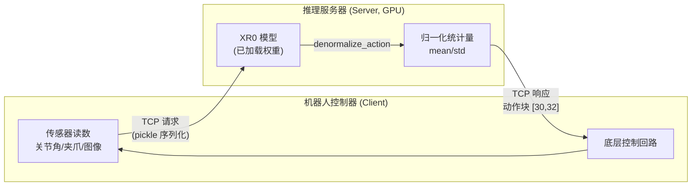
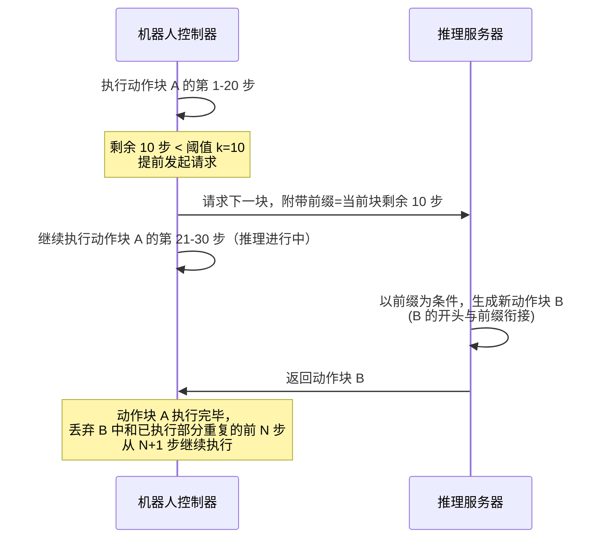

# 第十二章：推理与部署 —— 同步/异步执行模式与真机集成

> 本章目标：理解训练好的 XR0 模型怎么被封装成一个推理服务，Server/Client 之间的通信协议，以及第八章讲过的 Prefix Conditioning 训练技巧在真实部署时具体解决了什么问题。

**前情提要**：前十一章讲完了模型架构、训练算法、数据管线和训练配置。本章是系列的最后一章，看训练成果怎么真正跑到机器人上。

**知识链接**：
- [第 8 章：异步训练](./08_异步训练_Prefix条件化与加权Loss) — 本章的异步执行模式正是为了利用第 8 章训练出的能力

---

## 一、部署架构：Server/Client 分离

XR0 采用经典的客户端-服务器架构：模型权重加载在一台配备 GPU 的机器上作为 Server，机器人控制器作为 Client 通过网络请求推理结果。



**为什么要分离**：VLM+DiT 模型有 4.7B+ 参数，需要专用 GPU 才能高效推理；机器人控制器本身通常运行在算力有限的嵌入式设备或工控机上，没有能力本地跑这么大的模型。分离架构让 GPU 资源可以集中部署（甚至可以是云端或局域网内的一台专用推理服务器），机器人端只需要负责传感器采集、网络通信和底层控制执行。

## 二、通信协议：定长前缀 + Pickle 序列化

```python
def _send(self, payload):
    payload = pickle.dumps(payload, protocol=pickle.HIGHEST_PROTOCOL)
    self.socket.sendall(struct.pack(">I", len(payload)) + payload)

def _recv(self):
    size = struct.unpack(">I", self._recv_all(self.socket, 4))[0]
    return pickle.loads(self._recv_all(self.socket, size))
```

**这一步在做什么**：TCP 是面向字节流的协议，没有天然的"消息边界"概念——如果直接把数据丢进 socket，接收端不知道一条完整的消息在哪里结束。这里用了一种常见的"长度前缀"协议：每条消息前面先发送 4 个字节（`struct.pack(">I", ...)`，大端序无符号整数）表示接下来消息体的字节长度，接收端先读这 4 个字节知道消息体有多长，再精确读取对应长度的数据，就能准确切分出一条完整消息，即使消息体被 TCP 分片传输(一次 `recv` 调用可能只读到部分数据)也能通过 `_recv_all` 循环读取直到凑够指定长度。

消息内容用 Python 的 `pickle` 序列化——直接把包含张量、字典等复杂对象的 payload 序列化成字节流，比手动设计一套跨语言的数据格式（比如 Protobuf 或 JSON）更简单，代价是通信双方必须都是 Python 环境（这在机器人控制器和推理服务器都用 Python 开发的场景下是合理的简化）。

## 三、Server 端推理逻辑

```python
batch = {key: value.to(self.device) for key, value in request.items()}
mask = self.action_mask.unsqueeze(0).expand(batch["input_ids"].shape[0], -1, -1)

if "action" in batch:
    batch["action"] = ((batch["action"] - self.mean) / (self.std + ACTION_EPS)) * mask
else:
    batch["action"] = torch.zeros(...)

batch["action_mask"] = mask if "action_mask" not in batch else batch["action_mask"].to(self.device) * mask

action = self.model.generate(batch)
action = denormalize_action(action * mask, self.mean, self.std) * mask
self._send(conn, action.cpu())
```

**这一步在做什么**：接收到请求后，Server 端先对可能存在的 `action` 字段（对应异步执行场景下客户端传来的 prefix，见下一节）做归一化处理（用训练时保存的 `mean`/`std` 统计量，第九章讲过的归一化公式），调用 `self.model.generate(batch)`（第七章讲过的推理路径，内部走 5 步 Euler 积分），得到的输出再做**反归一化**（`denormalize_action`）还原成真实物理单位的动作值（比如厘米、弧度），才能发回给机器人控制器直接使用。

**注意 `action = action * mask` 出现了两次**：一次在反归一化之前，一次之后。这是为了确保输出的 padding/无效维度（第九章讲过的 32 维空间里的保留维度）始终严格保持为 0，不会因为反归一化公式（`action * std + mean`）意外把 0 值变成一个非零的 `mean` 值——如果不做这次遮盖，理论上填充维度的均值统计量本应也是 0（因为训练数据里这些维度从未被使用），但显式地再乘一次 mask 是更稳妥的双重保险。

## 四、Client 端：组装请求

```python
def __call__(self, robot_state, ego_obs, left_wrist_obs, right_wrist_obs, instruction):
    ego_obs, left_wrist_obs, right_wrist_obs = [resize_image(image, factor=32, max_pixels=90000) for image in (...)]
    payload = self.processor.apply_chat_template([self._messages(...)], tokenize=True, ...)
    payload["state"] = torch.from_numpy(compose_state(...))[None]
    self._send(payload)
    action = self._recv()
    return {"raw_action": action, "action_components": split_action(action), "action_targets": recover_action(action, robot_state)}
```

Client 端直接复用了和训练时**完全一致**的图像预处理（`resize_image`，第十章讲过的分辨率标准化）和 Chat Template 拼装逻辑（`AutoProcessor.apply_chat_template`），这是保证"训练-推理一致性"的关键——如果推理时的图像预处理方式和训练时不一样，模型见到的输入分布就会和训练时不匹配，容易导致性能下降。

拿到 Server 返回的原始动作块（32 维、每步一个）后，`split_action` 把它拆解回第九章讲的各个语义分量（末端位置增量、旋转轴角增量、夹爪增量、关节增量），`recover_action` 进一步把这些**相对**增量叠加回当前机器人状态，还原成机器人控制器能直接执行的**绝对**目标值——这是第九章"相对动作计算"的逆过程：

$$
p_{\text{target}} = p_{\text{cur}} + R_{\text{cur}} \cdot \Delta p^{\text{local}}
$$

正好对应第九章 $\Delta p^{\text{local}} = R_{\text{cur}}^T(p_{\text{target}}-p_{\text{cur}})$ 的逆运算——两边同时左乘 $R_{\text{cur}}$（利用旋转矩阵的正交性 $R_{\text{cur}}R_{\text{cur}}^T=I$），再加上 $p_{\text{cur}}$，就还原出目标位置。

## 五、两种执行模式：同步与异步

### 5.1 同步执行

控制器执行完一个动作块的全部 30 步之后，才请求下一个动作块，并**等待**推理完成后再继续。这是最简单的模式，兼容任何训练配置的 checkpoint（不需要模型具备 Prefix Conditioning 能力），但代价是每次动作块切换时都有一段推理延迟造成的停顿。

### 5.2 异步执行：提前请求 + Prefix 衔接

当剩余待执行步数少于某个阈值 $k$（部署实验里 $k=10$）时，控制器就提前发起下一次推理请求，不等当前动作块完全执行完。这正是第八章训练时刻意准备的场景：



**这一步在做什么**：Client 把"当前动作块还没执行完的那部分"（即将成为 `prefix`）连同新的观测（图像、状态、指令）一起发给 Server。Server 端调用模型推理时，这部分历史动作会被当作第八章讲的 `action` 输入（对应 Server 代码里 `if "action" in batch` 分支），模型在生成新动作块时，会以这个前缀为条件，保证新动作块的开头几步和前缀在数值上保持一致——衔接处不会有突兀的跳变。

机器人控制器收到新动作块后，因为推理过程中自己已经继续执行了几步（比如又执行了 3 步），需要丢弃新动作块里和"已经额外执行过的部分"重复的前几步，从正确的位置继续衔接执行，避免同一段动作被重复执行两次。

**这个模式为什么需要专门训练**：如果直接把一个只在同步模式下训练的 checkpoint（`async_train=False`，从未见过非零 `prefix_length`）强行用在异步执行流程里，模型在推理时收到的"以真实前缀为条件生成"这种输入模式,和它训练时见过的分布不一致，生成质量会明显下降——这正是第八章要专门设计 Prefix Conditioning 训练机制的原因：**必须让训练分布覆盖推理时实际会遇到的使用模式**，这个原则在本系列前面几章（比如第五章 Beta 分布时间步采样的动机）也反复出现,是训练机器学习模型时一条普遍适用的经验法则。

## 六、本章与全系列的收尾

至此，我们完整走过了 XR0 从"图像+指令输入"到"机器人动作输出"的全部链路：

- **第 1-2 章**：全局架构认知——VLM 理解 + DiT 生成 + Rectified Flow 训练三段式设计
- **第 3-6 章**：架构细节——Qwen3-VL 骨干、DiT 逐层结构、Rectified Flow 数学、局部因果掩码
- **第 7-8 章**：训练算法——完整前向传播走读、异步训练的 Prefix Conditioning 机制
- **第 9-10 章**：数据管线——JSON 标注格式、相对动作计算、图像增强与批处理
- **第 11-12 章**：工程落地——分布式训练配置、部署架构与两种执行模式

XR0 的设计哲学贯穿全系列：**尽量复用已经训练好的开源组件（Qwen3-VL），把复杂度集中在"怎么衔接"而不是"怎么重新发明"**——VLM 不做额外预训练，DiT 通过 Cross-Attention 直接复用 VLM 的 KV-Cache，训练和部署的每一个环节（Beta 分布采样、Prefix Conditioning、图像预处理一致性）都在为"训练分布尽量匹配实际使用场景"这个目标服务。这是一种务实的工程思路，也是理解很多现代 VLA 系统设计决策的一把有效钥匙。

## 延伸阅读

- [GR00T N1.7 深度解析](/系列/groot_n1d7_deep_dive/) — 对比阅读另一种更重量级的 VLA 架构设计
- [OpenPI 深度解析](/系列/openpi_deep_dive/) — π₀ 系列的 Flow Matching 动作生成实现
- [Flow Matching 与连续归一化流](/前置知识/000g_前置知识_Flow_Matching与连续归一化流) — Rectified Flow 的完整理论基础
- [KV-Cache 与自回归解码](/前置知识/002m_前置知识_KV_Cache与自回归解码) — 本系列反复用到的跨模块缓存复用机制
