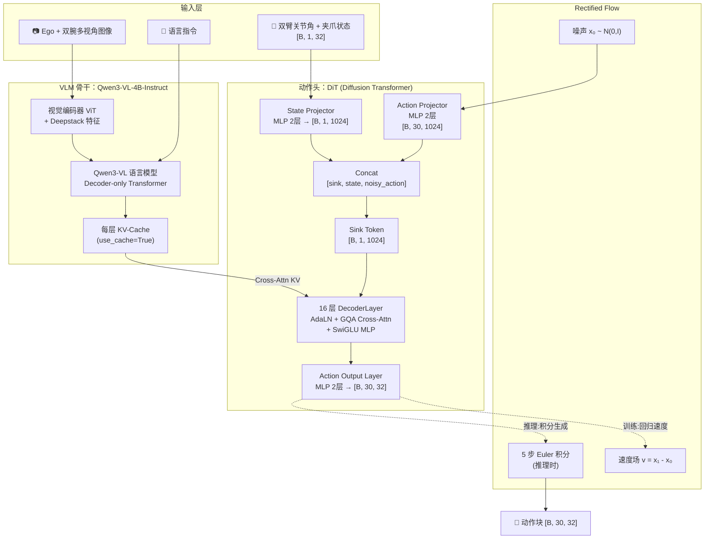

# Xiaomi-Robotics-0 (XR0) 深度解析：架构、设计与训练流程全拆解

> 从"VLM 怎么理解图像和指令"到"DiT 怎么把噪声变成机器人动作"，再到"20 小时数据怎么后训练出一个新任务"，完整拆解小米开源 VLA 基础模型 Xiaomi-Robotics-0 的网络架构、设计动机与训练全流程。

## 系列简介

Xiaomi-Robotics-0（简称 XR0）是小米开源的一个 4.7B 参数视觉-语言-动作（VLA）模型，主打**实时推理**和**易部署**。它的整体设计思路和 GR00T、π₀ 系列一脉相承——用一个视觉语言模型（VLM）理解场景和指令，再用一个扩散式的动作生成模块把理解结果转化为连续的机器人动作——但在具体实现上做了几处务实的简化：

- **骨干网络**：直接用现成的 **Qwen3-VL-4B-Instruct**，不做额外的多模态预训练，靠"VLM 理解 + KV-Cache 复用"这套机制把负担转移给已经训练好的开源模型
- **动作头**：一个较小的 **Diffusion Transformer (DiT)**，通过 Cross-Attention **直接复用 VLM 算出的 KV-Cache**，而不是重新对图像/文本做一次编码
- **生成算法**：**Rectified Flow**（直线插值 + 速度场回归），5 步 Euler 积分即可从噪声生成一个 30 步的动作块
- **局部因果掩码**：一种类似 P2 系列的 sink + state + action 注意力结构，让动作 token 之间保持时间上的局部因果关系
- **异步执行支持**：训练时可选地对动作序列的前缀做条件化，让模型学会"接着上一个动作块的尾部继续生成"，从而支持推理延迟和机器人执行的异步流水线

这个系列会像拆 GR00T N1.7 一样，把 XR0 的每一个组件、每一个公式、每一段训练代码都过一遍——从骨干网络的视觉编码，到 DiT 里每一层的 AdaLN 调制，到 Rectified Flow 的训练目标，再到真实的数据格式和部署方式。

**适合读者**：
- 已经了解 VLA 基本范式（比如读过 [GR00T N1.7 系列](/系列/groot_n1d7_deep_dive/) 或 [OpenPI 系列](/系列/openpi_deep_dive/)），想看一个更轻量、更工程化的实现
- 想理解"VLM 的 KV-Cache 被动作头跨模块复用"这个具体设计的工程师
- 想在自己的机器人上后训练 XR0、需要理解数据格式和训练配置的开发者
- 对 Rectified Flow、AdaLN-Zero、GQA 这些现代生成模型组件感兴趣的研究者

**你将获得**：
- 对 XR0 三段式架构（VLM → DiT → Rectified Flow）的完整理解
- 对 Qwen3-VL 骨干网络（视觉编码、MRoPE、KV-Cache）的代码级认知
- 对 DiT 动作头每一层（AdaLN 调制、GQA 跨注意力、SwiGLU MLP）的逐行拆解
- 对 Rectified Flow 训练目标、时间步采样、Euler 积分推理的数学理解
- 对异步训练（Prefix Conditioning）这个工程细节的完整认知
- 独立准备数据、配置训练、部署 XR0 到自己任务上的实操能力

## 章节目录

| 章节 | 标题 | 简介 |
|------|------|------|
| **第一部分：全局认知与架构总览** | | |
| 01 | [全景图：XR0 在解决什么问题？](./01_全景图_XR0在解决什么问题) | XR0 的设计目标、与 GR00T/π₀/OpenVLA 的定位对比 |
| 02 | [三段式架构总览：VLM + DiT + Rectified Flow](./02_三段式架构总览_VLM_DiT_RectifiedFlow) | 一图看懂数据怎么从图像/指令流向动作，模块之间怎么衔接 |
| **第二部分：VLM 骨干网络** | | |
| 03 | [Qwen3-VL 骨干：视觉编码、MRoPE 与 KV-Cache 生成](./03_Qwen3VL骨干_视觉编码与MRoPE) | ViT 视觉编码器、Deepstack 特征、MRoPE 多模态位置编码怎么工作 |
| **第三部分：DiT 动作头** | | |
| 04 | [DiT 动作头架构：AdaLN-Zero 调制与 GQA 跨注意力](./04_DiT动作头架构_AdaLN与GQA跨注意力) | DecoderLayer 逐层拆解：Attention → AdaLN → SwiGLU MLP |
| 05 | [Rectified Flow：直线插值、速度场回归与 Beta 时间步采样](./05_RectifiedFlow_直线插值与速度场回归) | 训练目标的数学推导，为什么用 Beta(1.5,1.0) 而不是均匀采样 |
| 06 | [局部因果掩码：sink + state + action 的注意力结构设计](./06_局部因果掩码_sink_state_action结构) | P2-Local 风格掩码怎么构造，为什么动作 token 只看邻近窗口 |
| **第四部分：训练流程** | | |
| 07 | [训练前向传播完整走读：从 Batch 到 Loss](./07_训练前向传播完整走读) | 一个 batch 从输入到 MSE Loss 的每一步，附张量形状变化 |
| 08 | [异步训练：Prefix Conditioning 与加权 Loss 设计](./08_异步训练_Prefix条件化与加权Loss) | 为什么要在训练时"条件化动作前缀"，加权 Loss 怎么计算 |
| 09 | [数据管线：JSON 标注、相对动作计算与归一化](./09_数据管线_JSON标注与相对动作计算) | 32 维动作空间、轴角表示、mean/std 归一化的完整链路 |
| 10 | [图像增强与批处理：从视频帧到 VLM 输入](./10_图像增强与批处理) | Albumentations 风格的增强策略、Chat Template 拼装 |
| **第五部分：训练配置与部署** | | |
| 11 | [训练配置：DeepSpeed ZeRO + AdamW + Cosine Warmup](./11_训练配置_DeepSpeed与优化器) | 参数分组、学习率调度、分布式训练的具体设置 |
| 12 | [推理与部署：同步/异步执行模式与真机集成](./12_推理与部署_同步异步执行模式) | Server/Client 架构、TCP 通信协议、两种执行模式的取舍 |

## 核心架构图

## XR0 关键设计参数速查

| 维度 | 取值 | 说明 |
|------|------|------|
| VLM 骨干 | Qwen3-VL-4B-Instruct | 直接加载 HuggingFace 预训练权重 |
| VLM 精度 | bfloat16 + Flash Attention 2 | 全程 bf16，节省显存 |
| DiT 层数 | 16 | `dit_num_layers=16` |
| DiT 隐层维度 | 1024 | `dit_hidden_size=1024` |
| DiT 注意力头 | head_dim=128, kv_heads=8 | 每层用 GQA Cross-Attention 复用 VLM KV-Cache |
| 状态维度 | (1, 32) | 双臂关节角 + 夹爪，单帧 |
| 动作维度 | (30, 32) | 30 步动作块，每步 32 维 |
| Flow 采样步数 | 5 | 推理时 Euler 积分步数 |
| 时间步分布 | Beta(1.5, 1.0) | 偏向高噪声区间训练 |
| 局部窗口 | local_window=4 | 动作 token 只关注前 4 步内的邻居 |
| 训练重复因子 | training_repeat=4 | 同一个 VLM 前向对应 4 组不同噪声/时间步采样 |
| 优化器 | FusedAdam, lr=1e-4 | betas=(0.9,0.95), weight_decay=0.1 |
| 调度器 | Cosine + Warmup | 2000 步热身，30000 步总训练 |
| 分布式策略 | DeepSpeed ZeRO-2 | bf16-mixed 精度 |

## 前置知识要求

阅读本系列前建议了解（系列中遇到时会链接到对应文章）：
- 线性代数基础：矩阵乘法、向量空间
- 概率论基础：条件概率、高斯分布、Beta 分布
- 深度学习入门：前向传播、反向传播、Transformer 基本结构
- [Flow Matching 与连续归一化流](/前置知识/000g_前置知识_Flow_Matching与连续归一化流)（第 5 章需要，Rectified Flow 是它的特例）
- [Cross-Attention 与交替注意力机制](/前置知识/001e_前置知识_Cross_Attention与交替注意力机制)（第 4 章需要）
- [AdaLayerNorm 条件化归一化](/前置知识/001f_前置知识_AdaLayerNorm条件化归一化)（第 4 章需要）
- [RoPE 旋转位置编码](/前置知识/002k_前置知识_RoPE旋转位置编码)（第 3-4 章需要）
- [分组查询注意力 GQA](/前置知识/002l_前置知识_分组查询注意力GQA)（第 4 章需要）
- [KV-Cache 与自回归解码](/前置知识/002m_前置知识_KV_Cache与自回归解码)（第 3-4 章需要）
- [Causal Attention 因果注意力掩码](/前置知识/001g_前置知识_Causal_Attention因果注意力掩码)（第 6 章需要）
- [VLM 层截断](/前置知识/001d_前置知识_VLM层截断_只用大模型的前N层)（了解同类设计的对比）

## 阅读建议

1. **完全零基础**：按顺序从第 1 章读起，前 2 章建立全局认知
2. **熟悉 VLA 概念（读过 GR00T/π₀ 系列）**：可以直接从第 3 章开始，重点看和其他模型的差异
3. **想理解架构设计**：重点读第二、三部分（Ch03-06）
4. **想做微调**：重点读 Ch09（数据）+ Ch11（训练配置）+ Ch12（部署）
5. **想理解异步执行怎么训练出来的**：重点读 Ch08 + Ch12
6. **想对比 GR00T 和 XR0 的设计取舍**：读 Ch02（架构总览）并对照 [GR00T N1.7 全景图](/系列/groot_n1d7_deep_dive/01_全景图_GR00T_N1d7在解决什么问题)

## 相关系列

- [GR00T N1.7 深度解析](/系列/groot_n1d7_deep_dive/) — NVIDIA 人形机器人基础模型，架构思路上的直接对照
- [OpenPI 深度解析](/系列/openpi_deep_dive/) — π₀ 系列模型的完整拆解，Flow Matching 动作生成的另一种实现
- [SAC_FLOW_G 深度解析](/系列/sac_flow_g_deep_dive/) — GR00T 上在线 RL 后训练的工程实现，可对照理解 VLA 模型 RL 后训练与 BC 后训练的差异
