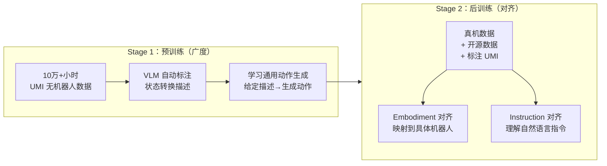
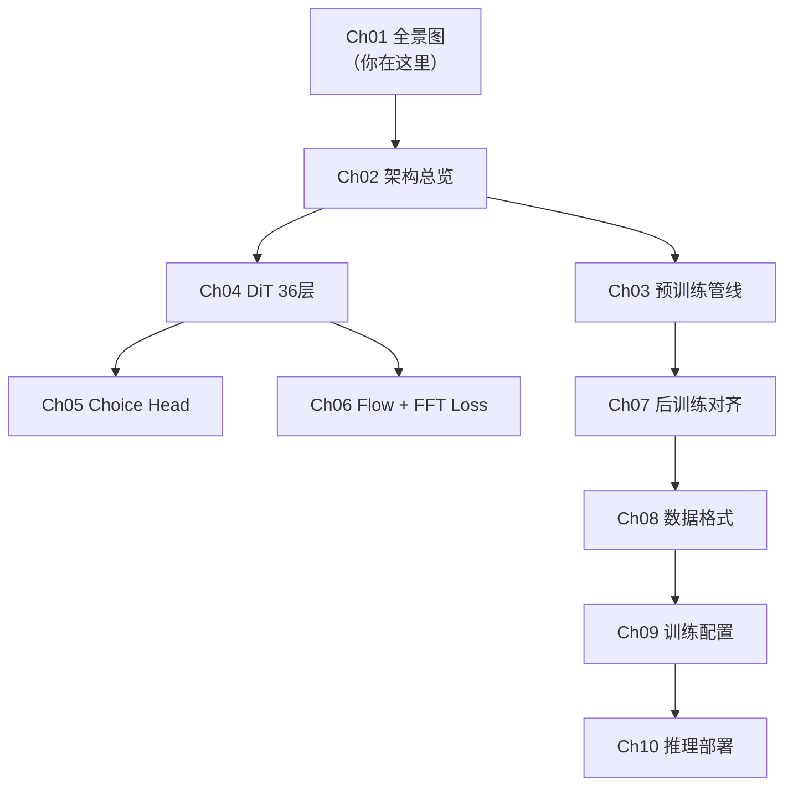

# 全景图：XR-1 在解决什么问题？

> **前情提要**：本系列开篇，从零建立对 Xiaomi-Robotics-1 的全局认知。

**知识链接**：
- 前置知识：[Flow Matching 与连续归一化流](/前置知识/000g_前置知识_Flow_Matching与连续归一化流)
- 前代模型：[XR-0 深度解析](/系列/xr0_deep_dive/)
- 相关范式：[GR00T N1.7 全景图](/系列/groot_n1d7_deep_dive/01_全景图_GR00T_N1d7在解决什么问题)

---

## 1. 机器人策略模型面临的核心瓶颈：数据

在大语言模型领域，GPT-4、Claude 等模型的成功已经反复验证了一个规律：**更多数据 + 更大模型 = 更强能力**。训练 LLM 的语言数据几乎取之不尽——互联网上有万亿 token 的文本。

但机器人策略模型面临一个致命问题：**数据极度稀缺**。

为什么？因为机器人操作数据的获取链路太重了：
1. 你需要一台真实的机器人硬件（几十万元起步）
2. 你需要一个操作员遥操作数百小时收集演示（人力成本巨大）
3. 每换一个任务/场景就要重新采集（泛化性差）
4. 不同机器人的数据格式不通用（跨体态困难）

结果就是：目前公开的最大机器人操作数据集（如 Open X-Embodiment）总量不过几千小时——和 LLM 的万亿 token 相比差了好几个数量级。

**XR-1 的核心命题**：能不能绕过"必须用真机器人采数据"这个瓶颈？

## 2. XR-1 的回答：Embodiment-Free Pre-training

XR-1 的解法直截了当：

> 用便宜的手持夹爪（UMI）代替昂贵的机器人，大规模采集操作数据，然后在这些"没有机器人的数据"上做预训练。

**UMI (Universal Manipulation Interface)** 是一种手持式的通用操作接口——本质上就是一个人手持的夹爪，上面装了 IMU 和摄像头，人可以拿着它在任何真实场景中做各种操作动作。和实体机器人相比，它的优势是：

| 维度 | 实体机器人 | UMI 手持夹爪 |
|------|-----------|------------|
| 硬件成本 | 几十万 | 几千 |
| 部署场景 | 固定工位 | 随身携带到任何地方 |
| 采集效率 | 遥操慢 | 手持操作自然快 |
| 场景多样性 | 受限 | 家庭/商业/工业/户外都可以 |
| 动作空间 | 具体机器人的关节 | 末端执行器 6DoF + 夹爪 |

小米用 UMI 在 1700+ 个场景中采集了超过 10 万小时的操作轨迹。但问题来了：这些数据只有视频+IMU轨迹，**没有语言标注**（没人告诉你这段视频在干什么）。怎么变成可训练的数据？

答案是 **VLM 自动标注管线**：
1. 把长轨迹自动切割成固定长度的 clip
2. 用 VLM 观察每个 clip 的起始帧和结束帧，生成"状态转换描述"（如："夹爪从桌面左侧移动到杯子上方"）
3. 训练模型学习"给定当前画面+状态转换描述→生成对应动作"

这样就把原本无标注的操作数据变成了可用的监督信号——不需要人工标注，完全自动化。

## 3. 两阶段训练范式：Pre-training + Post-training

XR-1 完全借鉴了 LLM 的成功经验，采用两阶段训练：

**Stage 1 — 预训练（breadth）**：在 10 万小时 UMI 数据上训练，模型学会的是一种**通用的动作生成能力**——"看到一个场景，听到一段描述，生成能实现这个描述的动作"。这一阶段完全不涉及任何具体机器人的关节空间。

**Stage 2 — 后训练（alignment）**：用少量跨体态数据做两轴对齐：
- **Embodiment alignment**（体态对齐）：把抽象的"动作生成能力"映射到具体机器人的关节空间——比如 60 维动作空间里哪些维度控制左臂、哪些控制右臂
- **Instruction alignment**（指令对齐）：把"状态转换描述"的理解方式切换为"自然语言指令"——模型不再只是"从 A 状态到 B 状态"，而是直接理解"帮我把杯子放到桌子上"

## 4. 架构关键升级：从 XR-0 到 XR-1

在 [XR-0](/系列/xr0_deep_dive/) 的基础上，XR-1 做了三个核心升级：

### 4.1 DiT 从 16 层扩展到 36 层

XR-0 的 DiT 只有 16 层，hidden size 1024。XR-1 把层数提高到 36 层——与 VLM 骨干（Qwen3-VL-4B 有 36 层 Transformer）**层数完全匹配**。这不是巧合：XR-1 采用 **Mixture-of-Transformers (MoT)** 设计，DiT 的第 $i$ 层通过 Cross-Attention 复用 VLM 第 $i$ 层的 KV-Cache。层数匹配让这种跨模块对齐成为可能。

但 DiT 的 hidden size 仍然只有 1024（VLM 是 2560），所以 DiT 的参数量远小于 VLM——更快的推理速度。

### 4.2 Choice Head：5 候选动作 + 评分排序

XR-0 的 DiT 直接输出一个动作序列。XR-1 引入了全新的 **Choice Head**：

1. VLM 前向时，在输出序列中插入特殊的 ACTION token 和 SCORE token
2. ACTION token 经过 Projector 后生成 5 组候选动作（每组完整的 30×60 动作序列）
3. SCORE token 经过 Projector 后对 5 组候选打分
4. 训练时用 L1 Loss 让最好的候选接近 ground truth，用 MSE Loss 让打分准确反映各候选的误差
5. 推理时选得分最高的候选作为最终输出

这个设计的直觉：单一预测可能因为多模态性（同一个指令对应多种合理执行方式）而模糊；生成多个候选再选最好的，能提升输出的确定性和鲁棒性。

### 4.3 频率域 Loss（FFT Loss）

XR-0 只用时域 MSE Loss。XR-1 额外加了一个频率域 Loss：

1. 对预测动作序列和目标动作序列分别做 FFT（沿时间轴）
2. 计算频谱差的绝对值作为 Loss

设计动机：时域 MSE 倾向于让模型输出"平均"的平滑轨迹（因为均方误差惩罚偏差的平方），而频率域 Loss 保护高频细节——比如快速的抓取动作或方向切换。两者互补。

## 5. Benchmark 表现与定位对比

### 5.1 SOTA 成绩

| Benchmark | XR-1 | 第二名 | 提升幅度 |
| :--- | :---: | :---: | :---: |
| RoboCasa | 74.5% | 72.6% | +2.6% |
| RoboCasa365 | 57.4% | 46.6% | +23.2% |
| VLABench | 59.1% | 53.2% | +11.1% |
| RoboDojo | 13.93% | 8.80% | +58.3% |

注意 RoboCasa365 和 RoboDojo 上的提升幅度——这两个是更难的 benchmark，XR-1 的优势更加明显。

### 5.2 数据高效适配

XR-1 在新任务上只需极少数据即可适配：

| 任务 | XR-1 (<10h/task) | π0.5 (<10h/task) |
| :--- | :---: | :---: |
| 手机打包 | 70% | 30% |
| 打印机换纸 | 70% | 20% |
| 衣物装洗衣机 | 80% | 40% |
| 箱子打包 | 80% | 70% |
| **平均** | **75%** | **40%** |

每个任务平均不到 10 小时的示教数据，XR-1 就能达到 75% 成功率——这说明预训练阶段学到的通用能力确实有效迁移到了新任务。

### 5.3 和其他模型的定位对比

| 模型 | 预训练数据 | 架构核心 | 动作生成方式 | 体态 |
|------|-----------|---------|------------|------|
| XR-1 | 10万h UMI | VLM + DiT (MoT) | Rectified Flow | 双臂移动底盘 |
| π0.5 | 未公开 | VLM + Flow | Flow Matching | 多种 |
| GR00T N1.7 | 1000+h | VLM + DiT (MoT) | Flow Matching | 人形全身 |
| OpenVLA | 无大规模预训练 | VLM | 离散化 token | 单臂 |
| Octo | 800K episodes | Transformer | Diffusion | 单臂 |

XR-1 的独特定位：**数据量最大的开源 VLA 模型**，且验证了"预训练 Scaling 能力可以通过后训练可靠传递到真机表现"这个关键假设。

## 6. 本系列的阅读路线图

---

**下一章预告**：[Ch02 架构总览](./02_架构总览_MoT耦合VLM与DiT) 将用完整的数据流图展示一个 batch 从输入到输出经过了哪些模块、张量形状如何变化。
