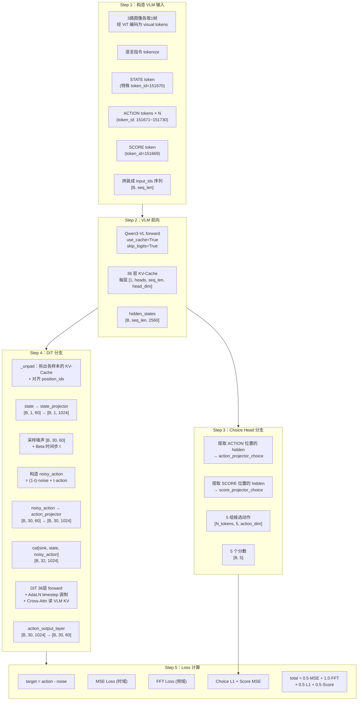

# 架构总览：MoT 耦合 VLM+DiT 的完整数据流

> **前情提要**：上一章建立了 XR-1 的全局认知——10 万小时 UMI 预训练 + 两阶段范式。本章将用完整数据流展示模型的内部结构。

**知识链接**：
- 前置知识：[KV-Cache 与自回归解码](/前置知识/002m_前置知识_KV_Cache与自回归解码)、[Cross-Attention 与交替注意力机制](/前置知识/001e_前置知识_Cross_Attention与交替注意力机制)
- 前代对照：[XR-0 三段式架构总览](/系列/xr0_deep_dive/02_三段式架构总览_VLM_DiT_RectifiedFlow)
- 相关系列：[GR00T N1.7 架构总览](/系列/groot_n1d7_deep_dive/02_N1d7全局架构_MoT与双流设计)

---

## 1. 一句话总结架构

XR-1 = **Qwen3-VL-4B（VLM 骨干）** + **36 层 DiT（动作生成头）** + **Choice Head（多候选评分）**

三个模块的分工：
- VLM 负责"理解"：把多视角图像 + 语言指令编码为语义表示（KV-Cache）
- DiT 负责"生成"：在 VLM 的 KV-Cache 条件化下，通过 Rectified Flow 把噪声变成动作
- Choice Head 负责"选择"：VLM 额外输出 5 组候选动作 + 评分，和 DiT 输出互补

## 2. 完整前向传播数据流

以一个 batch 在**训练时**的前向传播为例，逐步跟踪张量形状：



## 3. 关键张量形状速查表

以 batch_size=2, action_length=30, action_dim=60 为例（training_repeat=4 意味着 DiT 分支实际 batch 会变为 2×4=8）：

| 阶段 | 张量 | 形状 | 说明 |
|------|------|------|------|
| 输入 | `input_ids` | [2, ~800] | VLM token 序列（视觉+文本+特殊token） |
| 输入 | `state` | [2, 1, 60] | 当前机器人状态 |
| 输入 | `action` | [2, 30, 60] | Ground truth 动作序列 |
| 输入 | `action_mask` | [2, 30, 60] | 有效动作维度掩码 |
| VLM 输出 | KV-Cache 每层 | [1, 8, ~800, 160] | GQA: 8 个 kv_heads |
| VLM 输出 | `hidden_states` | [2, ~800, 2560] | VLM 最后一层输出 |
| Choice Head | `action_choice` | [N, 300] | N=ACTION token数，300=60×5 |
| Choice Head | `score_choice` | [2, 5] | 每个样本 5 个分数 |
| DiT | state_embed | [8, 1, 1024] | repeat 4 倍后 |
| DiT | noisy_action | [8, 30, 1024] | 投影后 |
| DiT | hidden concat | [8, 32, 1024] | sink(1) + state(1) + action(30) |
| DiT | attn_mask | [8, 1, 32, 32+~800] | 完整掩码（cache+query） |
| DiT 输出 | pred velocity | [8, 30, 60] | 预测的速度场 |

## 4. VLM 和 DiT 的耦合方式：Mixture-of-Transformers

XR-1 中 VLM 和 DiT 的关系不是简单的"前者编码，后者解码"。它采用了一种 **Mixture-of-Transformers (MoT)** 设计：

**核心机制**：DiT 的第 $i$ 层通过 Cross-Attention 机制读取 VLM 第 $i$ 层输出的 KV-Cache。

具体实现方式：
1. VLM 前向一次后，`use_cache=True` 会缓存所有 36 层的 key/value 张量
2. DiT 有同样的 36 层。DiT 第 $i$ 层的 Attention 模块中，query 来自 DiT 当前层的 hidden states，而 key/value 从 VLM 第 $i$ 层的 cache 中取出后**拼接到 DiT 自己的 local key/value 前面**
3. 这意味着 DiT 每一层都能同时"看到" VLM 对应层的语义表示 **和** DiT 自身前面 token 的表示

代码中的实现（`DiT.forward`）：

```python
def forward(self, hidden_states, past_key_values, attn_mask, position_embeds, timestep):
    start = len(past_key_values) - self.layer_num  # VLM 可能有更多层
    for index, layer in enumerate(self.layers):
        hidden_states = layer(
            hidden_states,
            past_key_values[start + index],  # ← 取 VLM 对应层的 KV
            position_embeds,
            timestep,
            attn_mask,
        )
    return hidden_states
```

这种设计的优点：
- DiT 每一层都能获得 VLM 不同层次的语义信息（浅层偏视觉特征，深层偏语义理解）
- 比"只用 VLM 最后一层输出做条件化"的信息更丰富
- 推理时 VLM 只需前向一次，后续 DiT 的 5 步 Flow 采样复用同一份 KV-Cache

## 5. DiT 内部的注意力结构

DiT 每一层的 Attention 做的事情：

```
Query 来源：DiT 当前层的 hidden_states（经 QKV 投影）
Key/Value 来源：VLM 第 i 层的 KV-Cache [拼接] DiT 自身 token 的 KV

具体拼接：
  key = cat([vlm_cache_key, dit_local_key], dim=-2)
  value = cat([vlm_cache_value, dit_local_value], dim=-2)

注意力掩码：
  - VLM cache 部分：由 cache_mask 控制（通常全可见）
  - DiT 自身部分：因果掩码（causal）
```

这实质上是一种 **半因果注意力**：DiT token 能看到 VLM 的全部 cache（跨注意力），同时 DiT token 之间保持因果顺序（不能看未来的动作 token）。

## 6. Training Repeat：一次 VLM 前向，四次 DiT 训练

XR-1 的一个重要工程优化：`training_repeat = 4`。

**问题**：VLM 前向计算量大（处理三路图像 + 语言 token），但 KV-Cache 算完后就固定了。DiT 每次前向只需要读 cache + 处理 32 个 token，计算量相对小。

**解法**：一次 VLM 前向算好 KV-Cache 后，对同一个 batch 进行 4 次不同的噪声采样和时间步采样，让 DiT 训练 4 次。具体做法是在 DiT 分支中 `repeat_interleave` 所有相关张量：

```python
def _repeat(self, x, dim=0):
    if not self.training:
        return x
    return x.repeat_interleave(self.training_repeat, dim=dim)
```

这样 batch_size=2 的 VLM 前向就能产生 batch_size=8 的 DiT 训练，极大提高 GPU 利用率。

## 7. 推理时的数据流（简化版）

推理时没有 Choice Head 的训练分支，流程简化为：

1. VLM 前向 → 得到 KV-Cache
2. 采样纯噪声 [B, 30, 60]
3. 如果有异步前缀，把前 `prefix_length` 步替换为已知动作
4. DiT 做 5 步 Euler 积分：每步输入当前 sample + 时间步 → 输出速度 → sample += velocity × dt
5. 输出去归一化后的 30 步动作

```python
@torch.no_grad()
def _generate(self, noise, kwargs):
    sample = noise.clone()
    dt = 1.0 / self.num_steps  # = 0.2
    for step in range(self.num_steps):  # 5 步
        timestep = step / self.num_steps  # 0.0, 0.2, 0.4, 0.6, 0.8
        sample = sample + self.dit_forward(sample, timestep, **kwargs) * dt
    return sample
```

## 8. 本章小结

| 模块 | 参数量（估算） | 作用 |
|------|-------------|------|
| Qwen3-VL ViT | ~300M | 把 3 路图像编码为 visual tokens |
| Qwen3-VL LM (36层) | ~3.7B | 把 visual + text tokens 编码为 KV-Cache |
| State/Action Projectors | ~10M | 维度转换（60↔1024） |
| DiT (36层×1024d) | ~800M | 在 VLM 条件下做 Flow 动作生成 |
| Choice Head | ~50M | VLM 分支产生 5 候选+评分 |
| Timestep Embedder | ~2M | 正弦编码 → MLP |
| **总计** | **~5B** | |

---

**下一章预告**：[Ch03 预训练管线](./03_预训练_UMI数据与自动标注管线) 将详解 UMI 数据的自动标注管线——VLM 如何把 10 万小时无标注视频变成训练数据。
