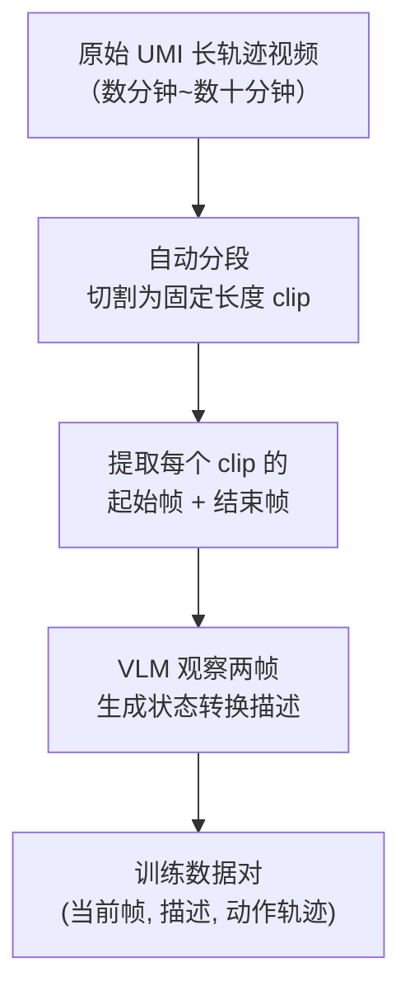

# Embodiment-Free 预训练：UMI 数据的自动标注管线

> **前情提要**：上一章展示了 VLM + DiT + Choice Head 的完整数据流。本章深入 Stage 1 预训练——XR-1 如何把 10 万小时无标注 UMI 视频变成可训练的监督信号。

**知识链接**：
- 相关系列：[XR-0 深度解析](/系列/xr0_deep_dive/)（没有预训练阶段，直接后训练）
- 前置知识：[行为克隆与 RL 微调范式](/前置知识/000d_前置知识_行为克隆与RL微调范式)

---

## 1. 预训练阶段要解决的核心问题

XR-1 预训练面临三个技术挑战：

| 挑战 | 具体问题 | XR-1 的解法 |
|------|---------|------------|
| 数据无标注 | UMI 视频只有轨迹，没有语言描述 | VLM 自动标注管线 |
| 轨迹长度不一 | 一次采集可能持续数分钟 | 自动分段为固定长度 clip |
| 无具体机器人 | UMI 的末端动作空间和目标机器人不同 | 预训练只学通用模式，后训练做体态对齐 |

## 2. VLM 自动标注管线

整个管线的流程：

### 2.1 自动分段

长轨迹被切割成固定长度的 clip，每个 clip 包含连续若干帧。切割策略的关键考量：

- **clip 长度**和模型的 action_length 对齐（30 步）
- 相邻 clip 之间可以有重叠（sliding window 方式），增加数据量
- 长时间静止或重复的段落可能被过滤掉

### 2.2 VLM 生成状态转换描述

对每个 clip，标注管线做的事情：

1. 取 clip 的**第一帧**（起始状态）和**最后一帧**（结束状态）
2. 将两帧图像输入一个 VLM（如 Qwen3-VL 本身或同级别模型）
3. 用特定 prompt 让 VLM 生成"从状态 A 到状态 B 发生了什么"的描述

生成的描述类似：
- "夹爪从桌面左侧移动到杯子上方并闭合"
- "物体被推到桌面右侧，夹爪张开并回到初始位置"
- "夹爪向下接近盘子边缘"

这些描述**不是任务指令**（不是"帮我倒水"），而是对**状态转换的客观描述**。这个区别很重要——预训练阶段模型学的是"实现状态转换"的通用能力，不是"理解人类意图"。

### 2.3 为什么用"状态转换描述"而不是"任务指令"

设计考量：

1. **可自动化**：状态转换可以由 VLM 客观描述（两帧之间发生了什么），不需要人工判断"操作者的意图是什么"
2. **无歧义**：同一个物理动作只有一种正确的状态描述，但可能对应多种意图（比如"把杯子放右边"和"清理桌面"都可能涉及同一个动作）
3. **覆盖完整**：每个 clip 都能标注，不会出现"这段动作的意图不明确"的情况
4. **后训练再切换**：Stage 2 用真机数据做 instruction alignment 时再教模型理解人类语言指令

### 2.4 训练目标

预训练阶段的训练目标和后训练完全一致（同一个模型架构和 loss 函数）：

- 输入：当前帧图像 + 状态转换描述（替代后训练中的"任务指令"）
- 输出：生成使场景从当前状态过渡到描述的目标状态所需的动作序列
- Loss：MSE + FFT（和后训练相同）

唯一的区别是文本 prompt 的内容——预训练用"状态转换描述"，后训练用"自然语言指令"。

## 3. 为什么这种预训练有效？

### 3.1 学到的是什么

预训练阶段，模型学会了三件事：

1. **视觉理解**：从图像中识别物体、空间关系、场景布局
2. **动作-效果关联**：什么样的动作序列能导致什么样的状态变化
3. **运动原语**：抓取、推动、放置、插入等基本操作的运动模式

这些能力是**跨体态通用的**——不管最终用什么机器人，"从左边移到右边"的运动轨迹模式是类似的。

### 3.2 Scaling 行为

XR-1 的关键发现：**预训练数据量的增加 → 后训练性能持续提升，没有饱和迹象。**

这意味着如果继续增加 UMI 采集量（比如到 100 万小时），模型性能可能还会继续提升。这和 LLM 的 Scaling Law 一致：更多的预训练数据带来更强的基础能力，这种能力能够可靠地通过后训练传递到下游任务。

### 3.3 类比 LLM 的训练范式

| LLM | XR-1 |
|-----|------|
| 互联网文本（万亿 token） | UMI 操作视频（10万小时） |
| 下一个 token 预测 | 状态转换条件下的动作生成 |
| Instruction Tuning (SFT) | Post-training (对齐) |
| 遵循人类指令 | 理解自然语言任务指令 |
| 预训练学到"世界知识" | 预训练学到"操作知识" |

## 4. UMI 数据采集的实际规模

论文报告的数据规模：

| 维度 | 数值 |
|------|------|
| 总采集时长 | 100,000+ 小时 |
| 场景数量 | 1,700+ |
| 场景类型 | 家庭、商业、工业、户外 |
| 动作空间 | 末端 6DoF + 夹爪开合 |
| 摄像头 | 手持夹爪上的 ego 相机 |

场景多样性是关键——如果只在单一厨房里采集 10 万小时，模型就只能泛化到类似厨房。1700+ 个不同场景的覆盖让模型见过各种桌面、物体、光照条件。

## 5. 预训练与后训练的数据格式差异

| 维度 | 预训练 | 后训练 |
|------|--------|--------|
| 视觉输入 | UMI ego 相机（单视角） | Ego + 双腕相机（三视角） |
| 文本输入 | VLM 生成的状态转换描述 | 人类自然语言指令 |
| 动作空间 | UMI 末端 6DoF + 夹爪 | 具体机器人的完整 60 维 |
| 本体感觉 | UMI IMU 数据 | 双臂关节角+夹爪+底盘 |
| 数据量 | 10万+小时 | 1万+小时 |

后训练阶段的数据包含三个来源：
1. **真机数据**：小米自有双臂移动机器人的遥操作数据
2. **过滤后的开源数据**：从 Open X-Embodiment 等开源数据集中筛选质量较高的子集
3. **高质量手动标注 UMI 数据**：部分 UMI 数据由人工补充自然语言指令标注

## 6. 本章小结

XR-1 预训练的核心洞察：

1. **数据瓶颈可以绕过**——不一定需要真机器人，便宜的手持设备就能大规模采集
2. **VLM 自动标注让大规模数据可用**——不需要人工标注每条轨迹的意图
3. **状态转换描述是一种巧妙的中间表示**——既能自动生成，又能提供足够的监督信号
4. **预训练的 Scaling 行为可靠传递到下游**——这是 XR-1 存在的核心价值

---

**下一章预告**：[Ch04 DiT 动作头](./04_DiT动作头_36层AdaLN与跨注意力) 将逐层拆解 36 层 DiT 的内部结构——AdaLN-Zero 时间步调制、GQA 跨注意力、SwiGLU MLP，以及和 VLM KV-Cache 的具体耦合代码。
