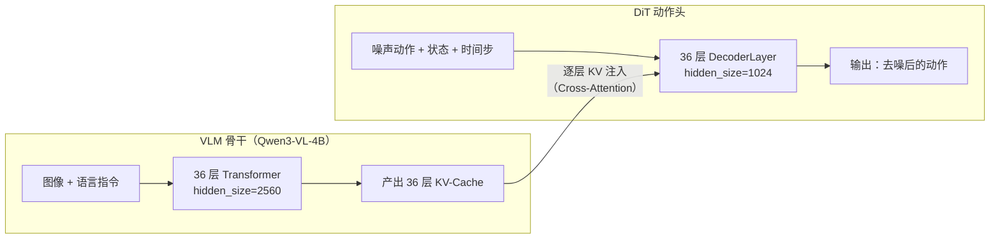
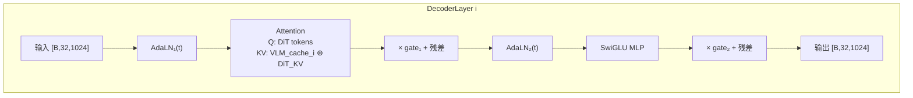
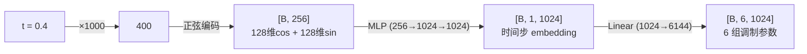
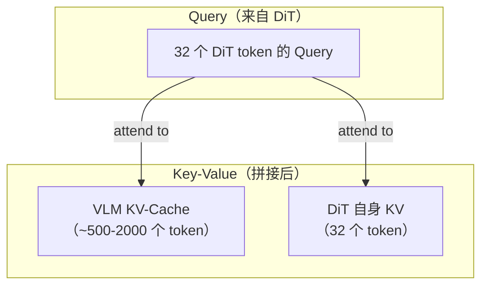
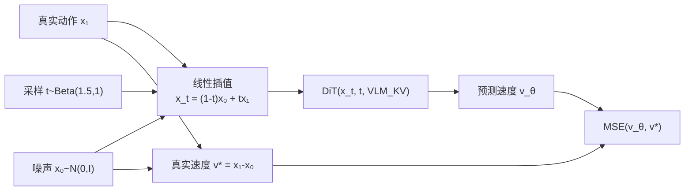
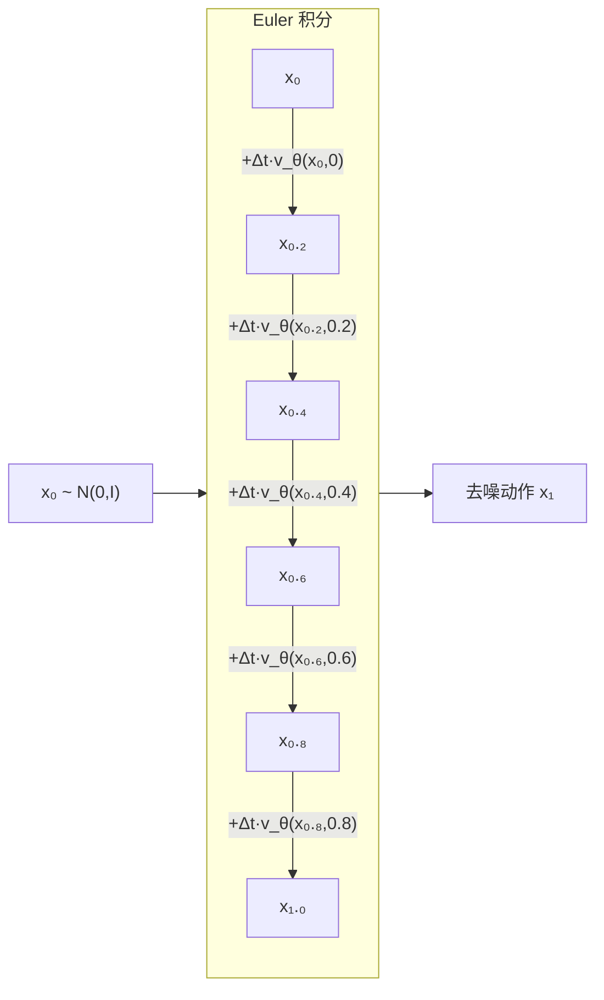

# 36 层 DiT 动作头（上）：整体架构与信号流

> **前情提要**：上一章介绍了预训练阶段的 UMI 自动标注管线——如何把 10 万小时无标注视频变成训练数据。本章进入模型架构的核心：DiT 动作头。我们先建立对整体结构的直觉——它由哪些组件构成、数据怎么流过、与 VLM 的耦合关系是什么——下一章再深入每个组件的内部实现。

**知识链接**：
- 前置知识：[DiT：Diffusion Transformer 架构](/前置知识/002x_前置知识_DiT_Diffusion_Transformer架构)、[AdaLayerNorm 条件化归一化](/前置知识/001f_前置知识_AdaLayerNorm条件化归一化)、[Cross-Attention 与交替注意力机制](/前置知识/001e_前置知识_Cross_Attention与交替注意力机制)、[KV-Cache 与自回归解码](/前置知识/002m_前置知识_KV_Cache与自回归解码)
- 前代对照：[XR-0 DiT 动作头](/系列/xr0_deep_dive/04_DiT动作头架构_AdaLN与GQA跨注意力)
- 下一章：[DecoderLayer 逐层实现](./04b_DiT动作头_DecoderLayer逐层实现)

---

## 1. DiT 在 XR-1 系统中的位置

在读任何细节之前，先明确 DiT 在整个系统中"在哪里、做什么、和谁交互"：



**三个核心定位问题的回答**：

| 问题 | 答案 |
|------|------|
| **它和已有系统是什么关系？** | DiT 是 VLM 的"下游执行器"——VLM 理解视觉和语言，DiT 把理解结果转化为具体的动作序列 |
| **在什么阶段使用？** | 训练时和推理时都用。训练时接收随机噪声+真实动作的插值，学习预测速度场；推理时从纯噪声出发，经 5 步 Euler 积分逐步去噪生成动作 |
| **为什么需要它？** | VLM 擅长理解但不擅长"生成连续值序列"——动作是 30 步×60 维的连续向量，用扩散/Flow 方式生成比直接回归更能覆盖多模态分布 |

---

## 2. 整体组件一览

DiT 动作头由以下 7 个组件构成，总参数约 800M：

| 组件 | 功能 | 输入 → 输出形状 |
|------|------|----------------|
| **TimestepEmbedder** | 把标量时间步 $t$ 编码为高维向量 | $[B] \to [B, 1, 1024]$ |
| **t_projector** | 把时间步向量投影为 6 组调制参数 | $[B, 1, 1024] \to [B, 6, 1024]$ |
| **state_projector** | 把机器人状态投影到 DiT 隐藏维度 | $[B, 1, 60] \to [B, 1, 1024]$ |
| **action_projector** | 把带噪动作投影到 DiT 隐藏维度 | $[B, 30, 60] \to [B, 30, 1024]$ |
| **sink** | 可学习的全局汇聚 token | 固定 $[1, 1024]$，repeat 到 batch |
| **layers × 36** | 核心：36 层 DecoderLayer（AdaLN + Attn + MLP） | $[B, 32, 1024] \to [B, 32, 1024]$ |
| **action_output_layer** | 把 DiT 隐藏状态投影回动作维度 | $[B, 30, 1024] \to [B, 30, 60]$ |

另外还有 DiT 专属的 **rotary_emb**（RoPE 位置编码），提供 token 之间的位置信息。

---

## 3. 完整数据流：从噪声到动作

下面用一个具体的数值例子，跟踪一个 batch（$B=1$）的数据从输入到输出的完整路径。

### 3.1 Step 1：准备输入

DiT 接收三路输入：

```
时间步:    t = 0.4                    → 标量
机器人状态: state = [B, 1, 60]         → 60 维（双臂关节角+底盘+腰部）
带噪动作:  noisy_action = [B, 30, 60]  → 30 步 × 60 维动作序列
```

其中 `noisy_action` 是训练时通过 Rectified Flow 的线性插值构造的：

$$
x_t = (1-t) \cdot x_0 + t \cdot x_1
$$

**这个公式在做什么**：在纯噪声 $x_0 \sim \mathcal{N}(0, I)$ 和真实动作 $x_1$ 之间做线性插值，$t$ 控制"噪声程度"——$t=0$ 是纯噪声，$t=1$ 是纯真实动作。

::: details 📐 逐符号拆解 + 数值代入（点击展开）
**逐符号拆解**：

| 符号 | 含义 | 具体是什么 |
|------|------|-----------|
| $x_t$ | 时间步 $t$ 处的带噪动作 | DiT 的实际输入 |
| $x_0$ | 起点（纯噪声） | 从标准高斯 $\mathcal{N}(0, I)$ 采样 |
| $x_1$ | 终点（真实动作） | 数据集里的 ground truth 动作序列 |
| $t$ | 时间步 | 从 $\text{Beta}(1.5, 1.0)$ 采样 |

**数值代入**（单个动作维度）：$x_0 = 0.7$（噪声采样值），$x_1 = -0.3$（真实动作），$t = 0.4$：

$$
x_t = (1-0.4) \times 0.7 + 0.4 \times (-0.3) = 0.42 - 0.12 = 0.30
$$

DiT 接收 $x_t = 0.30$，需要预测速度场 $v = x_1 - x_0 = -0.3 - 0.7 = -1.0$——即"从噪声到真实数据的方向"。

**为什么是这个形式**：Rectified Flow 用**直线路径**连接噪声和数据，比 DDPM 的曲线路径更简单，推理时只需少步 Euler 积分即可完成。详见 [Flow Matching 前置知识](/前置知识/000g_前置知识_Flow_Matching与连续归一化流)。
:::

### 3.2 Step 2：投影到 DiT 隐藏空间

三路输入分别经过独立的 MLP 投影到 1024 维：

```
TimestepEmbedder(t=0.4)  → t_embed: [B, 1, 1024]
t_projector(t_embed)     → t_modulate: [B, 6, 1024]  （6 组 AdaLN 参数）

state_projector(state)   → state_embed: [B, 1, 1024]
action_projector(noisy)  → action_embed: [B, 30, 1024]
```

### 3.3 Step 3：拼接成 DiT 输入序列

三个嵌入按固定顺序拼接：

```
DiT 输入 = [Sink(1)] + [State(1)] + [Action(30)] = [B, 32, 1024]
```

| 位置索引 | Token 身份 | 作用 |
|---------|-----------|------|
| 0 | Sink Token | 全局信息汇聚点，类似 BERT 的 [CLS] |
| 1 | State Token | 携带当前机器人本体感觉 |
| 2-31 | Action Tokens | 待去噪的动作序列（核心输出来源） |

**Sink Token 的设计动机**：在扩散模型中，所有 Action Token 的初始值是噪声——信息量为零。State Token 有信息但只有 1 个。Sink Token 提供一个"不带噪声也不带特定含义"的锚点，让 Attention 在早期有一个稳定的注意力目标，避免所有 token 都在噪声上互相 attend 导致信号坍塌。

### 3.4 Step 4：36 层 DecoderLayer 处理

输入序列 $[B, 32, 1024]$ 依次通过 36 层 DecoderLayer，每层做三件事：

1. **AdaLN-Zero 调制**：用时间步信息控制输入分布（shift/scale）和输出强度（gate）
2. **Attention（含 VLM KV-Cache 拼接）**：同时做自注意力和跨模块注意力
3. **SwiGLU MLP**：非线性特征变换

关键：第 $i$ 层 DecoderLayer 使用 VLM 第 $i$ 层的 KV-Cache 做跨模块注意力。



所有 36 层**共享同一份时间步调制参数** `t_modulate: [B, 6, 1024]`——但每层有自己的 `adaln_table`（可学习偏置），所以即使输入的 `t_modulate` 相同，不同层的实际调制效果也不同。

### 3.5 Step 5：提取动作输出

36 层处理完后，只取 Action Token 对应的位置（索引 2:32），投影回 60 维：

```
output = action_output_layer(hidden_states[:, 2:, :])  → [B, 30, 60]
```

这个输出就是 DiT 预测的**速度场** $v_\theta(x_t, t)$——训练时和 ground truth 速度场做 MSE Loss，推理时用于 Euler 积分。

---

## 4. 与 VLM 的耦合：Mixture-of-Transformers

### 4.1 层级化的信息传递

XR-1 最重要的架构设计之一是 **DiT 和 VLM 层数完全相同（都是 36 层）**，且逐层 1:1 对齐共享 KV-Cache：

| DiT 层 | 使用的 VLM KV-Cache | 语义层级 |
|--------|---------------------|---------|
| Layer 0 | VLM Layer 0 | 底层视觉特征（边缘、纹理） |
| Layer 12 | VLM Layer 12 | 中层特征（物体部件、空间关系） |
| Layer 24 | VLM Layer 24 | 高层语义（物体类别、动作意图） |
| Layer 35 | VLM Layer 35 | 最高层抽象（任务理解、指令对齐） |

这种设计让 DiT 的每一层都能获取**对应抽象层级**的 VLM 信息：
- 浅层 DiT 处理动作的底层运动学特征时，从 VLM 浅层获取空间位置信息
- 深层 DiT 决策高层动作策略时，从 VLM 深层获取语义理解

### 4.2 为什么叫 Mixture-of-Transformers

"Mixture-of-Transformers" (MoT) 这个名字来自于这种设计的本质：

> 两个 Transformer（VLM 和 DiT）各自有独立的参数、独立的隐藏维度、独立的任务目标，但通过 KV-Cache 机制**每一层都在交换信息**——它们不是两个独立模型串联，而是一个"混合体"在协同工作。

和 XR-0 的区别：XR-0 的 VLM 有 36 层但 DiT 只有 16 层，所以 DiT 只能用 VLM **后 16 层**的 KV-Cache（`start_idx = 36 - 16 = 20`）。XR-1 让两者层数对齐，DiT 能从 VLM 的**每一层**获取信息——这是 MoT 结构的完整形态。

### 4.3 hidden_size 的不对称设计

| 模块 | hidden_size | 参数量 |
|------|-------------|--------|
| VLM (Qwen3-VL-4B) | 2560 | ~4B |
| DiT 动作头 | 1024 | ~800M |

VLM 需要处理图像+语言的复杂多模态信息，用 2560d。DiT 只需要基于已理解的条件做动作生成——任务更窄、用 1024d 就够了。这种不对称设计比两者用相同 hidden_size 更节省算力（DiT 每一步 Flow 采样都要完整跑一遍）。

VLM 的 KV-Cache 从 2560d 传入 DiT 的 1024d 时，通过 GQA 的 head 对齐实现：VLM 的 `kv_heads=8` × `head_dim=128` = 1024d 的 KV，恰好和 DiT 的 hidden_size=1024 匹配。这不是巧合——DiT 的维度设计就是为了无需额外投影即可直接复用 VLM 的 KV-Cache。

---

## 5. 时间步条件化：从标量 $t$ 到 6 组调制信号

### 5.1 编码链路

时间步 $t$（一个 0 到 1 之间的标量）经过三步变换，最终变成控制所有 36 层行为的 6 组参数：



**为什么 $t \times 1000$**：原始 $t \in [0, 1]$ 的范围太窄——正弦编码的频率设计（`max_period=10000`）更适合 $[0, 1000]$ 量级的输入，这样不同 $t$ 值之间的编码差异更明显。

### 5.2 6 组参数的语义

投影出的 6144 维向量被 reshape 为 $[B, 6, 1024]$，对应：

| 参数 | 缩写 | 作用位置 | 物理含义 |
|------|------|---------|---------|
| shift_attn | $\beta_1$ | Attention 子层输入 | 平移归一化后的特征分布 |
| scale_attn | $\gamma_1$ | Attention 子层输入 | 缩放归一化后的特征分布 |
| gate_attn | $\alpha_1$ | Attention 子层输出 | 控制 Attention 结果对残差流的贡献权重 |
| shift_mlp | $\beta_2$ | MLP 子层输入 | 平移归一化后的特征分布 |
| scale_mlp | $\gamma_2$ | MLP 子层输入 | 缩放归一化后的特征分布 |
| gate_mlp | $\alpha_2$ | MLP 子层输出 | 控制 MLP 结果对残差流的贡献权重 |

**关键设计**：所有 36 层共享同一份 `[B, 6, 1024]` 的时间步参数，但每层有自己的 `adaln_table`（$[6, 1024]$ 的可学习偏置）。实际调制 = `adaln_table + t_modulate`，所以不同层即使收到相同的时间步信号，最终的 scale/shift/gate 也不同。

### 5.3 直觉理解：时间步如何改变网络行为

| 时间步 | 噪声程度 | 网络需要做什么 | gate 的期望行为 |
|--------|---------|--------------|----------------|
| $t=0$（纯噪声） | 100% 噪声 | 预测"大方向"——输出应该是指向数据中心的粗略速度 | gate 大（需要 Attention 和 MLP 都积极工作） |
| $t=0.5$（半噪声） | 50% 噪声 | 预测中等精度的修正方向 | gate 中等 |
| $t=0.9$（几乎干净） | 10% 噪声 | 预测微小的精修方向 | gate 可以小（细微调整即可） |

训练过程中，网络通过 `adaln_table` 的梯度更新自动学会这种"不同阶段不同工作强度"的模式。

---

## 6. Attention 的双重角色：自注意力 + 跨模块注意力

### 6.1 核心技巧：KV 拼接

DiT Attention 模块最关键的设计是**把 VLM KV-Cache 和 DiT 自己的 KV 拼接在一起，用一次 Attention 计算同时完成两种注意力**：



对于 DiT 的每个 Query token 来说：
- **Attend to VLM KV-Cache** = Cross-Attention：从 VLM 已理解的视觉-语言信息中提取条件
- **Attend to DiT 自身 KV** = Self-Attention：Action tokens 之间交流、State token 广播状态

两种注意力在 softmax 中自动竞争权重——模型学会在需要视觉信息时多 attend to VLM，需要动作内部协调时多 attend to 自身。

### 6.2 Attention Mask 的结构

拼接后的注意力有一个特定的 mask 结构：

```
            VLM tokens (可见)     DiT tokens (因果)
Query[0]:   [1, 1, 1, ..., 1]    [1, 0, 0, ..., 0]   ← Sink 只看 VLM + 自己
Query[1]:   [1, 1, 1, ..., 1]    [1, 1, 0, ..., 0]   ← State 看 VLM + Sink + 自己
Query[2]:   [1, 1, 1, ..., 1]    [1, 1, 1, 0, ...,0]  ← Action₀ 看 VLM + 前面所有
...
Query[31]:  [1, 1, 1, ..., 1]    [1, 1, 1, ..., 1]   ← Action₂₉ 看所有
```

- VLM 部分对所有 Query **完全可见**（每个 DiT token 都能看完整的 VLM 信息）
- DiT 部分是**因果掩码**（每个 token 只能看到自己和前面的 token）

### 6.3 为什么不用独立的 Cross-Attention 层

传统做法是在 Self-Attention 之后额外加一个 Cross-Attention 层（如 Stable Diffusion 1.x 的 U-Net）。XR-1 的 KV 拼接方式的优势：

| 维度 | 独立 Cross-Attention | KV 拼接 |
|------|---------------------|---------|
| 参数量 | 需要额外的 KV 投影层 | **无额外参数**（直接复用 VLM 的 KV） |
| 计算次数 | 2 次 Attention（Self + Cross） | **1 次**（合并计算） |
| 信息融合 | Self 和 Cross 的结果需要额外合并 | **softmax 自动融合**（统一的权重归一化） |
| 实现复杂度 | 两套独立的 Q/K/V 路径 | 只需一行 `cat` |

---

## 7. 从 XR-0 到 XR-1 的 DiT 演进

### 7.1 核心变化

| 维度 | XR-0 | XR-1 | 变化意义 |
|------|------|------|---------|
| 层数 | 16 | **36** | 与 VLM 1:1 对齐，完整 MoT |
| hidden size | 1024 | 1024 | 不变（保持 KV 维度兼容） |
| 动作维度 | (30, 32) | **(30, 60)** | 支持双臂+底盘+腰部 |
| VLM KV 来源 | VLM 后 16 层 | **全部 36 层** | 浅层信息也可用 |
| 参数量 | ~350M | **~800M** | 翻倍+ |
| 每层 LayerNorm 数 | 4 | **2** | 简化结构 |

### 7.2 层数翻倍的意义

从 16 层到 36 层不只是"更深"那么简单。核心区别在于 VLM KV-Cache 的利用方式：

**XR-0（16 层 DiT，36 层 VLM）**：
```
VLM Layer 0-19: 产出 KV-Cache → 不被 DiT 使用（丢弃）
VLM Layer 20-35: 产出 KV-Cache → DiT Layer 0-15 分别使用
```
DiT 只能看到 VLM 的高层语义信息，浅层的空间/纹理信息被完全忽略。

**XR-1（36 层 DiT，36 层 VLM）**：
```
VLM Layer 0: 产出 KV-Cache → DiT Layer 0 使用
VLM Layer 1: 产出 KV-Cache → DiT Layer 1 使用
...
VLM Layer 35: 产出 KV-Cache → DiT Layer 35 使用
```
DiT 从浅层到深层都能获取对应层级的 VLM 信息——这是一个更完整、更对称的信息利用方式。

### 7.3 LayerNorm 简化

XR-0 每层有 4 个 RMSNorm（input/middle/post/final），XR-1 简化为 2 个（input/post）：

- XR-0：`RMSNorm → Modulate → Attn → +残差 → RMSNorm → RMSNorm → Modulate → MLP → +残差 → RMSNorm`
- XR-1：`RMSNorm → Modulate → Attn → +残差 → RMSNorm → Modulate → MLP → +残差`

XR-1 的简化说明在 36 层深度下，AdaLN-Zero 的 gate 机制已经足够稳定训练，不需要额外的 Norm 来约束残差流。

---

## 8. 参数量分析

了解每个组件占多少参数，有助于理解模型的"成本"分布：

| 组件 | 计算方式 | 参数量 |
|------|---------|--------|
| TimestepEmbedder | $256 \times 1024 + 1024 \times 1024$ | ~1.3M |
| t_projector | $1024 \times 6144$ | ~6.3M |
| state_projector | $60 \times 1024 + 1024 \times 1024$ | ~1.1M |
| action_projector | $60 \times 1024 + 1024 \times 1024$ | ~1.1M |
| 单层 DecoderLayer | QKV: $1024 \times 3072$ + O: $1024^2$ + MLP: $3 \times 1024 \times 4096$ + AdaLN: $6 \times 1024$ | ~22M |
| 36 层 DecoderLayer | $22M \times 36$ | **~790M** |
| action_output_layer | $1024 \times 1024 + 1024 \times 60$ | ~1.1M |
| **总计** | | **~800M** |

结论：**98%+ 的参数都在 36 层 DecoderLayer 里**，其他组件都是"边角料"。优化 DiT 的计算效率等价于优化 DecoderLayer 的效率。

---

## 9. 训练时 vs 推理时的使用方式

### 9.1 训练时



每次训练：随机采样 $t$，构造带噪动作 $x_t$，让 DiT 预测速度场 $v_\theta$，和真实速度 $v^* = x_1 - x_0$ 做 MSE。

### 9.2 推理时



推理时从纯噪声开始，每步调用 DiT 预测当前位置的速度场，按 $\Delta t = 0.2$ 步进。**DiT 在推理时要跑 5 次**（每次 Flow 步都要完整跑一遍 36 层），这是推理延迟的主要来源。VLM 只需跑一次产出 KV-Cache，所以"VLM 跑一次 + DiT 跑 5 次"是 XR-1 推理的基本计算模式。

---

## 10. 本章小结

本章建立了对 DiT 动作头的全局理解：

1. **系统位置**：DiT 是 VLM 的下游执行器，接收 VLM 的 KV-Cache 作为条件，输出去噪后的动作序列
2. **输入构造**：Sink + State + Noisy Action 拼成 32 token 的序列
3. **核心结构**：36 层 DecoderLayer，每层通过 AdaLN-Zero 接收时间步信号，通过 KV 拼接接收 VLM 信息
4. **MoT 设计**：DiT 与 VLM 层数 1:1 对齐，逐层共享 KV-Cache
5. **训练/推理模式**：训练时预测速度场（MSE Loss），推理时 5 步 Euler 积分

---

**下一章预告**：[DiT 动作头（下）：DecoderLayer 逐层实现](./04b_DiT动作头_DecoderLayer逐层实现) 将深入每个组件的代码实现——TimestepEmbedder 的正弦编码、DecoderLayer 的 AdaLN-Zero 调制细节、Attention 的 QK-Norm + RoPE + KV 拼接实现、SwiGLU MLP 结构、以及异步模式下的 +10 位置间隔设计。
