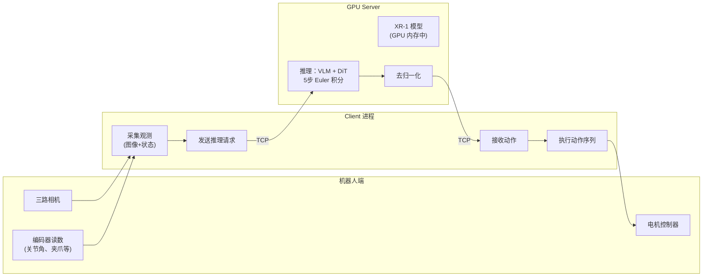
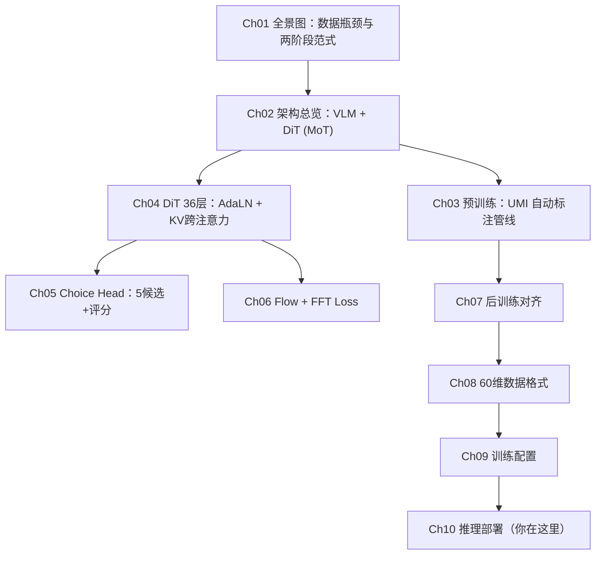

# 推理部署：异步执行、Server/Client 架构与真机集成

> **前情提要**：上一章拆解了训练配置的工程细节。本章是系列的最后一章，聚焦模型训练完成后如何部署到真实机器人上。

**知识链接**：
- 前代对照：[XR-0 推理与部署](/系列/xr0_deep_dive/12_推理与部署_同步异步执行模式)
- 相关系列：[OpenPI 推理部署](/系列/openpi_deep_dive/)

---

## 1. 部署架构：Server/Client 分离

XR-1 采用经典的 Server/Client 分离部署方式：



分离设计的优点：
- GPU Server 可以是独立的服务器（网络远程部署）
- 机器人端只需要能发 TCP 请求的计算（嵌入式板即可）
- 同一个 Server 可以服务多台机器人

## 2. 启动 Server

```bash
bash scripts/deploy.sh outputs/project_xiaomi-robotics-1/posttrain 1 1
```

参数：
- 第 1 个：checkpoint 目录路径
- 第 2 个：启动端口数量（多端口并行服务）
- 第 3 个：使用 GPU 数量

内部执行流程：
1. 从 checkpoint 目录加载 `config.py` 和 `model_states.pt`
2. 构建模型并加载权重到 GPU（eval 模式）
3. 从 config 中加载 mean/std/q01/q99 归一化参数
4. 在指定端口启动 TCP server 等待请求

Server 运行在 tmux session 中（`tmux attach -t model_servers` 查看）。

## 3. Client API

Client 的调用接口：

```python
from mibot.server.runtime.client import Client

client = Client(host="localhost", port=10086)

result = client.infer(
    images=[ego_pil, wrist_left_pil, wrist_right_pil],  # 3个 PIL Image
    instruction="load the washer",                        # 任务指令
    state={
        "left_arm_joint": [...],       # 7 floats
        "left_gripper_pos": [...],     # 1 float
        "left_ee_pos": [...],          # 3 floats
        "left_ee_rotm": [...],         # 9 floats (flattened)
        "right_arm_joint": [...],
        "right_gripper_pos": [...],
        "right_ee_pos": [...],
        "right_ee_rotm": [...],
        "waist_pos": [...]             # optional, 1 float
    },
    action_prefix=None,     # 异步模式：[N, 60] 之前预测的未执行动作
    crop_bboxes=None,       # 可选：三路相机的裁切参数
)
```

返回值 `result` 包含：
- `raw_action`：[30, 60] 去归一化后的完整动作序列
- `action_components`：拆解后的各分量（左臂位置、右臂旋转等）
- `action_targets`：绝对目标位置（当前状态 + 相对动作）

## 4. 同步执行 vs 异步执行

### 4.1 同步执行

最简单的模式：

```
时间线：
[观测] → [推理] → [执行30步] → [观测] → [推理] → [执行30步] → ...
```

特点：
- 每次执行完 30 步动作后才采集新观测
- 推理延迟直接叠加到执行周期上
- 实现简单，稳定性好

### 4.2 异步执行

利用训练时的 Prefix Conditioning，实现推理和执行的流水线并行：

```
时间线：
执行：  [━━━━ 动作块 A ━━━━][━━━━ 动作块 B ━━━━][━━━━ 动作块 C ━━━━]
推理：       [==推理B==]          [==推理C==]          [==推理D==]
```

关键机制：
1. 当前正在执行动作块 A 时，同时在推理下一个动作块 B
2. 推理 B 时，把 A 中**还未执行完的尾部几步**作为 `action_prefix` 传入
3. 模型基于 prefix 条件生成 B，保证 B 和 A 的尾部自然衔接

### 4.3 异步模式的 Client 调用

```python
# 假设当前正在执行 prev_action[0:30]
# 还剩 prev_action[24:30] 未执行（6步）

result = client.infer(
    images=[...],
    instruction="load the washer",
    state=current_state,
    action_prefix=prev_action[24:30],  # [6, 60] 未执行的前缀
)

# 结果 result.raw_action 的前 6 步应该和 action_prefix 一致
# 真正新生成的是后 24 步
new_action = result.raw_action[6:]  # [24, 60]
```

### 4.4 异步模式的延迟优化

假设：
- 推理延迟 = 100ms
- 动作频率 = 30Hz（每步 33ms）
- 动作块 30 步 = 1000ms

同步模式：每 1000ms + 100ms = 1100ms 产生新动作块（有 100ms 空白）

异步模式：推理在执行期间完成，0 空白延迟。实际动作频率完全由控制频率决定（30Hz），推理延迟被完全隐藏。

## 5. 推理流程详解

Server 收到请求后的内部执行：

```python
# 1. 图像预处理
#    - 解码 PIL → tensor
#    - 可选 crop
#    - Resize 到 ViT 输入分辨率
#    - 归一化

# 2. 构造 VLM 输入
#    - tokenize 指令
#    - 拼装 chat template（含 <image> 占位）
#    - 处理特殊 token (STATE, ACTION, SCORE)

# 3. 状态归一化
#    state_norm = (state - q01) / (q99 - q01)

# 4. VLM 前向 → KV-Cache

# 5. DiT 生成
#    - 噪声采样
#    - 如果有 prefix：前 N 步用 prefix 替换噪声
#    - 5 步 Euler 积分
#    - 输出归一化空间的动作 [30, 60]

# 6. 去归一化
#    action = action_norm * std + mean

# 7. 返回结果
```

## 6. 多 GPU 部署

对于较大的 batch 或更低延迟需求，可以启动多个端口+多 GPU：

```bash
bash scripts/deploy.sh outputs/... 4 4
# 4 个端口（10086~10089），每个用 1 张 GPU
```

Client 可以轮询多个端口实现负载均衡，或者固定绑定某端口。

## 7. 部署 Checklist

在自己的机器人上部署 XR-1 的完整步骤：

| 步骤 | 操作 | 验证 |
|------|------|------|
| 1 | 安装环境 `pip install -e .` + flash-attn | `python -c "import mibot"` |
| 2 | 下载 Qwen3-VL-4B-Instruct | 模型路径可访问 |
| 3 | 准备训练数据（JSON + 视频） | 格式合规 |
| 4 | 计算 mean/std/q01/q99 | 填入 data config |
| 5 | 下载预训练权重 | `pretrained_ckpt/model_states.pt` |
| 6 | 启动训练 | WandB 可见 loss 下降 |
| 7 | 部署 Server | `deploy.sh` 无报错 |
| 8 | 编写 Client | 连接成功，推理返回合理形状 |
| 9 | 接入机器人控制 | 动作发送到电机 |
| 10 | 调试执行 | 观察真机行为，调整 crop/归一化 |

## 8. 常见问题与调试

### 8.1 推理结果全是噪声

- 检查归一化参数是否正确
- 确认预训练权重加载成功（`load_state_dict` 返回无 missing keys）
- 确认图像预处理和训练时一致

### 8.2 动作抖动

- 可能是 crop_bbox 和训练时不一致
- 检查状态输入的格式是否和训练数据匹配
- 降低控制频率或对输出做低通滤波

### 8.3 显存不足

- 降低输入图像分辨率
- 确认 `torch.no_grad()` 在推理路径上生效
- 用 `torch.cuda.empty_cache()` 清理碎片

### 8.4 推理延迟过高

- 确认使用了 Flash Attention 2
- 确认精度为 bf16（不是 fp32）
- 图像 token 数过多→降低分辨率或增大 patch size

## 9. 系列总结

回顾 XR-1 的完整知识链路：



XR-1 的核心贡献可以用一句话概括：**用大规模无机器人数据预训练打破了机器人策略模型的数据瓶颈，并验证了预训练的 Scaling 行为能够可靠传递到真机部署性能。**

这对整个机器人学习领域的启示是：不需要等到有百万小时真机数据才能训大模型——便宜的手持设备 + VLM 自动标注就足够支撑 Scaling。

## 延伸阅读

- [XR-0 深度解析](/系列/xr0_deep_dive/) — 前代模型，理解架构基础
- [GR00T N1.7 深度解析](/系列/groot_n1d7_deep_dive/) — MoT 设计的另一种实现
- [OpenPI 深度解析](/系列/openpi_deep_dive/) — π₀ 系列的 Flow Matching 实现
- [Flow Matching 前置知识](/前置知识/000g_前置知识_Flow_Matching与连续归一化流) — Rectified Flow 的数学基础
