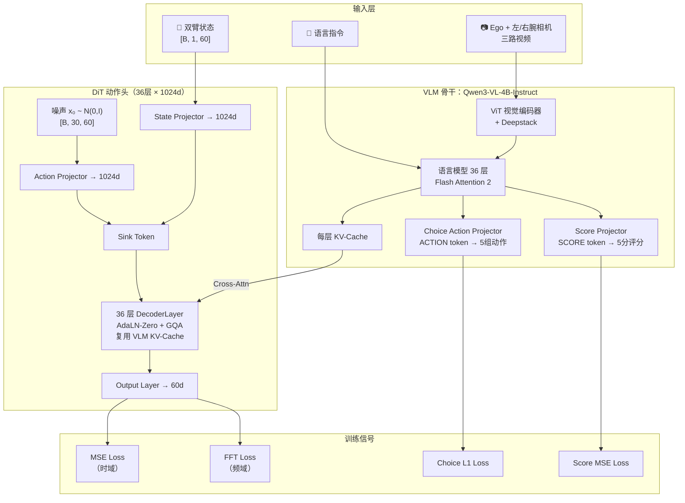

# Xiaomi-Robotics-1 (XR-1) 深度解析：十万小时数据打破机器人数据瓶颈

> 从"为什么 10 万小时无机器人数据能训出机器人策略"到"VLM+DiT 的 Mixture-of-Transformers 怎么耦合"，再到"5 选 1 动作候选机制如何提升鲁棒性"，完整拆解 Xiaomi-Robotics-1 的两阶段训练范式、网络架构与工程实现。

## 系列简介

**Xiaomi-Robotics-1**（简称 XR-1）是小米 2026 年开源的机器人基础模型。相比前代 [XR-0](/系列/xr0_deep_dive/)，XR-1 做了一次质的飞跃：

- **数据规模**：预训练用了超过 **10 万小时**的真实世界操作轨迹（全部来自 UMI 手持夹爪采集，没有任何实体机器人参与），覆盖 1700+ 场景
- **训练范式**：借鉴 LLM 的"预训练→后训练"两阶段模式——先在无机器人数据上学会通用动作生成能力，再用少量真机数据做对齐（embodiment alignment + instruction alignment）
- **架构升级**：引入 **Mixture-of-Transformers (MoT)** 设计——DiT 和 VLM 层数相同但用更小的 hidden size，以及全新的 **Choice Head**（5 候选动作+评分排序）机制
- **Benchmark SOTA**：在 RoboCasa、RoboCasa365、VLABench、RoboDojo 四个标准评测上均达到 SOTA

核心创新在于：**用 VLM 自动标注管线把海量无标注 UMI 视频变成"状态转换描述+动作"的训练对，从而打破了机器人数据稀缺的瓶颈**。预训练后模型获得了通用的动作生成能力，再通过后训练将这种能力对齐到真实机器人的具体操作空间和语言指令。

**和 XR-0 的关键区别**：

| 维度 | XR-0 | XR-1 |
|------|------|------|
| 预训练数据 | 无专门预训练 | 10万+小时 UMI 轨迹 |
| 训练范式 | 直接后训练 | 预训练 + 后训练 |
| VLM 骨干 | Qwen3-VL-4B-Instruct | Qwen3-VL-4B-Instruct |
| DiT 层数 | 16 | **36** |
| DiT hidden size | 1024 | 1024 |
| 动作维度 | (30, 32) | **(30, 60)** |
| Action Head | 直接输出 | **Choice Head（5候选+评分）** |
| 频率域 Loss | 无 | **有（FFT Loss）** |
| 异步训练 | 有 | 有（改进版） |
| 最高适配效率 | — | 每任务 <10h 数据达 75% 成功率 |

**适合读者**：
- 已经了解 VLA 基本范式（读过 [XR-0 系列](/系列/xr0_deep_dive/) 或 [GR00T N1.7 系列](/系列/groot_n1d7_deep_dive/)），想看更大规模预训练带来了什么
- 想理解"无机器人数据预训练→机器人对齐"这个范式的研究者
- 想理解 Choice Head（多候选选择机制）设计动机的工程师
- 想在自己的机器人上后训练 XR-1 的开发者
- 对 Scaling Law 在机器人策略上是否成立感兴趣的从业者

**你将获得**：
- 对"无机器人数据预训练为什么有效"的完整理解
- 对 VLM 自动标注管线（长轨迹分段 + 状态描述生成）的认知
- 对 Mixture-of-Transformers 耦合架构的代码级理解
- 对 Choice Head 多候选动作生成与评分排序机制的完整拆解
- 对频率域 Loss（FFT Loss）设计动机和实现的数学理解
- 对 60 维动作空间（双臂+底盘+腰部）数据格式的清晰认知
- 独立准备数据、配置训练、部署 XR-1 的实操能力

## 章节目录

| 章节 | 标题 | 简介 |
|------|------|------|
| **第一部分：全局认知** | | |
| 01 | [全景图：XR-1 在解决什么问题？](./01_全景图_XR1在解决什么问题) | 数据瓶颈、两阶段范式、Scaling 行为与定位 |
| 02 | [架构总览：MoT 耦合 VLM+DiT 的完整数据流](./02_架构总览_MoT耦合VLM与DiT) | 一图看懂 10 万小时数据怎么流过整个系统 |
| **第二部分：预训练阶段** | | |
| 03 | [Embodiment-Free 预训练：UMI 数据的自动标注管线](./03_预训练_UMI数据与自动标注管线) | VLM 如何把无标注视频变成训练数据 |
| **第三部分：模型架构** | | |
| 04 | [36 层 DiT 动作头（上）：整体架构与信号流](./04_DiT动作头_整体架构与信号流) | 组件一览、数据流、MoT 耦合、训练/推理模式 |
| 04b | [36 层 DiT 动作头（下）：DecoderLayer 逐层实现](./04b_DiT动作头_DecoderLayer逐层实现) | TimestepEmbedder、AdaLN-Zero 调制、Attention KV 拼接、SwiGLU、位置编码 |
| 05 | [Choice Head：5 候选动作生成与评分排序机制](./05_ChoiceHead_多候选动作与评分机制) | 为什么生成 5 个候选再选最好的，L1+Score 双头怎么训练 |
| 06 | [Rectified Flow + 频率域 Loss：训练目标完整拆解](./06_RectifiedFlow与频率域Loss) | Beta 时间步采样、MSE Loss、FFT Loss 的设计动机与数值分析 |
| **第四部分：后训练与数据** | | |
| 07 | [后训练对齐：Embodiment Alignment + Instruction Alignment](./07_后训练对齐_Embodiment与Instruction) | 两轴对齐怎么做，跨体态数据怎么混合 |
| 08 | [60 维动作空间：双臂+底盘数据格式与归一化](./08_60维动作空间_数据格式与归一化) | Action Layout、相对动作计算、mean/std 归一化全链路 |
| **第五部分：训练与部署** | | |
| 09 | [训练配置：DeepSpeed + FusedAdam + 梯度检查点实战](./09_训练配置_DeepSpeed与梯度检查点) | 参数分组、学习率调度、显存优化的实操细节 |
| 10 | [推理部署：异步执行、Server/Client 架构与真机集成](./10_推理部署_异步执行与Server架构) | 部署流程、TCP 通信、异步执行流水线 |

## 核心架构图

## XR-1 关键设计参数速查

| 维度 | 取值 | 说明 |
|------|------|------|
| 预训练数据 | 100K+ 小时 UMI 轨迹 | 1700+ 场景，无实体机器人 |
| 后训练数据 | 10K+ 小时跨体态数据 | 真机 + 开源 + 标注 UMI |
| VLM 骨干 | Qwen3-VL-4B-Instruct | bfloat16 + Flash Attention 2 |
| DiT 层数 | **36** | 与 VLM 层数匹配的 MoT 设计 |
| DiT hidden size | 1024 | 比 VLM 的 2560 小，加速推理 |
| 注意力机制 | GQA, head_dim=128, kv_heads=8 | 跨模块复用 VLM KV-Cache |
| 状态维度 | (1, 60) | 双臂+底盘完整本体感觉 |
| 动作维度 | (30, 60) | 30步动作块 × 60维动作空间 |
| Choice 候选数 | 5 | VLM 产生 5 组动作候选 + 评分 |
| Flow 步数 | 5 | 推理时 Euler 积分步数 |
| 时间步分布 | Beta(1.5, 1.0) | 偏向高噪声区间 |
| 训练重复因子 | 4 | 1 次 VLM 前向 → 4 组 DiT 训练 |
| 频率域 Loss | freq_coefficient=1.0 | 排除 base_vel 维度 |
| 优化器 | FusedAdam, lr=2e-5 | betas=(0.9,0.95), wd=0.1 |
| 调度器 | Cosine + 500步Warmup | max_lr=2e-5, min_lr=5e-6 |
| batch size | 48 | 可多 GPU 扩展 |
| 默认总步数 | 10000 | 根据任务规模调整 |

## 前置知识要求

阅读本系列前建议了解（系列中遇到时会链接到对应文章）：
- 线性代数基础：矩阵乘法、向量空间
- 概率论基础：条件概率、高斯分布、Beta 分布
- 深度学习入门：前向传播、反向传播、Transformer 结构
- [Flow Matching 与连续归一化流](/前置知识/000g_前置知识_Flow_Matching与连续归一化流)（第 6 章核心依赖）
- [DiT：Diffusion Transformer 架构](/前置知识/002x_前置知识_DiT_Diffusion_Transformer架构)（第 4 章核心依赖）
- [Cross-Attention 与交替注意力机制](/前置知识/001e_前置知识_Cross_Attention与交替注意力机制)（第 4 章需要）
- [AdaLayerNorm 条件化归一化](/前置知识/001f_前置知识_AdaLayerNorm条件化归一化)（第 4 章需要）
- [RoPE 旋转位置编码](/前置知识/002k_前置知识_RoPE旋转位置编码)（第 4 章需要）
- [分组查询注意力 GQA](/前置知识/002l_前置知识_分组查询注意力GQA)（第 4 章需要）
- [KV-Cache 与自回归解码](/前置知识/002m_前置知识_KV_Cache与自回归解码)（第 2/4 章需要）

## 阅读建议

1. **完全新手**：先读 [XR-0 系列](/系列/xr0_deep_dive/)建立基础，再回来读本系列
2. **已读过 XR-0 系列**：从第 1 章开始，重点关注预训练阶段（Ch03）和新架构组件（Ch05-06）
3. **想理解两阶段范式**：重点读 Ch01 + Ch03 + Ch07
4. **想理解 Choice Head**：直接跳到 Ch05
5. **想做自己任务的后训练**：重点读 Ch08（数据）+ Ch09（训练）+ Ch10（部署）
6. **想和其他模型对比**：读 Ch01 中的定位对比 + Ch02 的架构总览

## 相关系列

- [XR-0 深度解析](/系列/xr0_deep_dive/) — 前代模型，架构基础完全共用，本系列会频繁引用
- [GR00T N1.7 深度解析](/系列/groot_n1d7_deep_dive/) — NVIDIA 人形机器人基础模型，MoT 思路的另一种实现
- [OpenPI 深度解析](/系列/openpi_deep_dive/) — π₀ 系列，同为 Flow Matching 动作生成，对比参考
