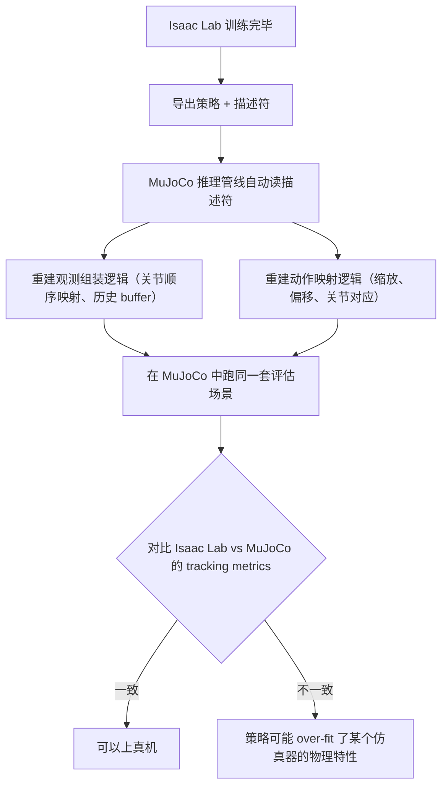
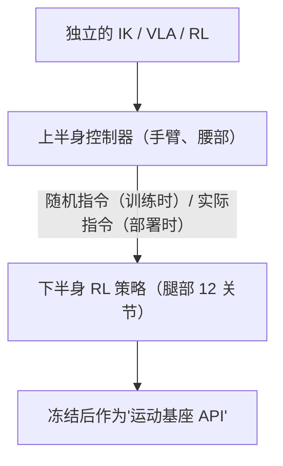
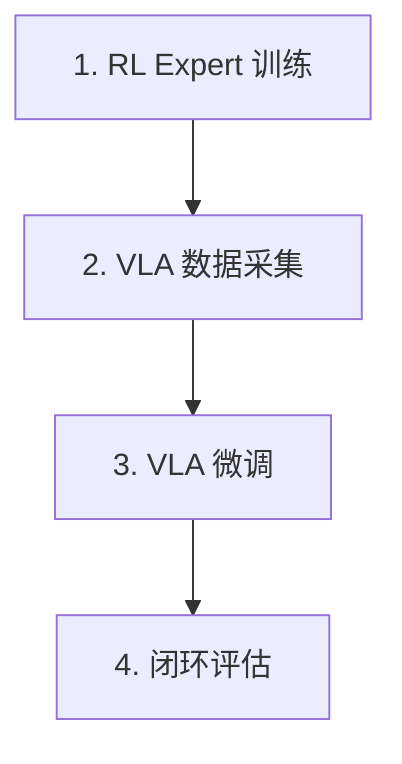

# AGILE：人形机器人 RL 的完整工程化工作流 深度精读

> **论文标题**: AGILE: A Comprehensive Workflow for Humanoid Loco-Manipulation Learning  
> **作者**: Huihua Zhao, Rafael Cathomen, Lionel Gulich, Wei Liu, Efe Arda Ongan, Michael Lin, Shalin Jain, Soha Pouya, Yan Chang  
> **机构**: NVIDIA  
> **发表**: 2026年3月 (arXiv:2603.20147)  
> **代码**: https://github.com/nvidia-isaac/WBC-AGILE

**标签**: `#人形机器人` `#强化学习` `#Sim2Real` `#工程化` `#Isaac-Lab` `#PPO` `#运动控制` `#VLA` `#全身控制` `#最佳实践`

**知识链接**：
- [策略梯度与 PPO](/前置知识/000a_前置知识_策略梯度与PPO) — AGILE 使用的 RL 算法
- [DPPO：扩散策略策略优化](./001_DPPO_扩散策略策略优化) — 另一种 PPO 微调方案
- [行为克隆与 RL 微调范式](/前置知识/000d_前置知识_行为克隆与RL微调范式) — 先 BC 再 RL 的大框架

---

## 一、背景与动机

### 1.1 人形机器人 RL 的现状（2025-2026）

最近两年，强化学习在人形机器人上取得了惊人进展：Unitree G1 能跑能跳、Figure 能做操作、Tesla Optimus 能分拣物品。这些背后几乎都是 RL 在仿真中训练 + 迁移到真机。

但一个不为人知的事实是：**发表论文时展示的成功 demo 背后，是数周甚至数月的调试。** 而调试过程完全没有被记录或系统化。每个新团队做人形 RL 都要重新踩一遍同样的坑。

### 1.2 两大 Gap

**工作流 Gap（Workflow Gap）**：

人形 RL 开发是碎片化的脚本集合，缺乏结构化的流程。常见痛点：

- 关节方向搞反了，训了 10 小时 GPU 才发现（reward 怎么都不涨）
- 奖励函数某一项写错了符号，策略学到了诡异的行为
- 碰撞几何体没配好，仿真中机器人脚能穿过地面
- 评估只靠随机 rollout 的平均分，看不出具体哪里会在真机上出问题
- 不同实验的配置管理混乱，无法复现上周跑出的好结果

**迁移 Gap（Transfer Gap）**：

把仿真训好的策略拿去真机（或另一个仿真器验证），需要解决：

- 关节顺序不一致（Isaac Lab 的关节 0 是哪个？真机 SDK 的关节 0 是哪个？）
- 观测历史 buffer 重建（策略用了过去 5 帧？怎么在真机部署时组装？）
- 动作缩放和偏移（训练时动作归一化了？怎么映射回真实力矩？）
- 不同仿真器的物理差异（Isaac Lab vs MuJoCo 的接触模型不同）

每次部署都是手工对齐，引入 silent bug 的温床。

### 1.3 AGILE 要做什么

AGILE 不是提出新算法，而是把人形 RL 的**正确做法系统化**为一个四阶段流水线：


每个阶段之间有明确的输入输出接口。核心理念：**把人形 RL 从"艺术"变成"工程"。**

---

## 二、四阶段 Pipeline 详解

### 2.1 Stage 1: Prepare（准备/环境验证）

**核心理念**：在花 GPU 训练之前，用 10 分钟的交互调试确认环境没有基础错误。

提供三个 GUI 插件（基于 Isaac Lab 的 manager terms 构建）：

**关节位置 GUI（Joint Position GUI）**：

功能：
- 每个关节一个滑条，实时控制关节位置
- 显示实时力矩读数
- 对称模式：左右两个机器人并排显示，镜像操作

能抓住的 bug：
- 关节方向（sign）错误：滑条往正方向拉，但关节往反方向转
- 关节限位设置错误：允许超出物理极限的角度
- Roll/Yaw 轴混淆：在对称模式下一眼看出左右不对称

真实案例：Unitree G1 的腰部 yaw 轴符号曾经搞反。没有这个工具时，训练了一整天才从奇怪的转身行为中发现。有了这个工具，5 分钟就能确认所有关节方向。

**物体操作 GUI（Object Manipulation GUI）**：

功能：
- 6-DOF 拖拽场景中的物体
- 实时显示接触传感器的触发状态
- 用于验证操作相关的奖励项

能抓住的 bug：
- 碰撞几何体没配对（视觉上物体碰到了手，但物理上没有接触力）
- 奖励中的距离计算用错了坐标系
- 抓取检测条件设置不合理

**奖励可视化器（Reward Visualizer）**：

功能：
- 用户操作场景时，实时显示每个 reward term 的数值和权重
- 看"哪些 reward term 在什么条件下激活"

能抓住的 bug：
- 某个 reward term 的系数符号写反了（惩罚变奖励）
- 两个 reward term 互相矛盾（一个鼓励站高，一个惩罚站高）
- 某个 term 始终为 0（条件设置过严永远不触发）

### 2.2 Stage 2: Train（训练）

基于 Isaac Lab（GPU 仿真）+ RSL-RL（PPO 实现）构建。

**训练基础设施**：

可复现性保障：
- 每次训练自动记录：git commit hash + branch + uncommitted diff
- YAML 配置完整 dump（所有参数都有据可查）
- Docker 容器化（环境一致）
- W&B 日志自动上传

超参数扫描：
- "scaled-dict" 参数：一组相关参数（如腿部 PD gains）用一个缩放因子控制
- 比如 $K_p = \text{base\_gains} \times \text{scale}$，只扫描 scale
- 保持参数组内的相对比例，减少搜索维度

统一入口：
- 一个命令行入口管理：训练 / 评估 / 参数扫描
- 支持本地执行和云部署（同一份配置）

**算法工具箱（每个模块都可独立开关）**：

#### L2C2 正则化（Local Lipschitz Continuity Constraint）

**解决的问题**：策略对观测的微小变化过度敏感 → 输出抖动 → 真机执行器受不了。

原理：取连续两步的观测 $x_t$ 和 $x_{t+1}$，在两者之间随机插值：

$$
\tilde{x} = x_t + \alpha \cdot (x_{t+1} - x_t), \quad \alpha \sim U(0,1)
$$

要求策略输出在 $\tilde{x}$ 和 $x_t$ 之间变化不能太大：

$$
\mathcal{L}_{\text{L2C2}} = \lambda_\pi \cdot \|\pi(\tilde{x}) - \pi(x_t)\|^2 + \lambda_V \cdot \|V(\tilde{x}_p) - V(x_{t,p})\|^2
$$

含义：
- 输入变了一点点 → 输出也只能变一点点
- 局部 Lipschitz 连续性
- 防止策略学到"高频震荡"的控制模式

实际效果：
- 没有 L2C2：真机执行器发出可听到的高频振荡噪声（嗡嗡声）
- 有 L2C2：安静平滑的运动

量化指标（MuJoCo 评估，15 条确定性 rollout，8 秒 each）：

| 指标 | 改善幅度 |
|------|----------|
| RMS 关节加速度 | 降低 30–50% |
| RMS 关节 jerk | 降低 40–60% |
| 关节限位违规次数 | 减少 60%+ |
| 高频能量比（>10Hz） | 降低 50–70% |

噪声越大，L2C2 的收益越明显（在高观测噪声下差距拉大）。

#### 在线奖励归一化（Online Reward Normalization）

**解决的问题**：训练过程中奖励量级变化（curriculum 从简单到复杂，奖励尺度跳变）。

归一化公式：

$$
\hat{r}_t = \frac{r_t}{\sigma_r \cdot \varphi_\gamma \cdot c + \varepsilon}
$$

符号含义：
- $r_t$：原始奖励
- $\sigma_r$：奖励的 EMA 标准差（跨所有并行环境）
- $\varphi_\gamma = 1/\sqrt{1-\gamma^2}$：折扣回报的方差修正系数
- $c$：return-scale 修正因子，自适应更新
- $\varepsilon = 0.01$：防除零

$c$ 的更新规则：

$$
c \leftarrow \beta \cdot c + (1-\beta) \cdot \sigma_G \cdot c
$$

其中 $\sigma_G$ 是 GAE return 的标准差。因为奖励被除以 $c$，所以 $\sigma_G \cdot c$ 不受当前归一化影响（不变量）。

效果：奖励放大 100 倍 → 有归一化时性能几乎不变 → 训练对奖励绝对量级免疫 → 跨机器人复用配置时不用重新调奖励权重。

#### Value-Bootstrapped Terminations

**解决的问题**：标准做法中 "agent 宁可死也不想继续" 的 suicidal 行为。

背景：标准 GAE 中，episode 终止时 value bootstrap 到 0 + 一个固定 penalty $p$。问题是，如果策略在某些状态累积的负奖励预期 $> |p|$，那么尽早终止比继续活着"划算" → agent 学会故意摔倒/触发终止条件 → episode 长度塌缩到接近 0。

AGILE 的解法：

$$
\hat{r}_T = \hat{r}_T + \gamma \cdot V(x_T) + \sigma_{\text{offset}}
$$

- $\gamma \cdot V(x_T)$：让终止变成 "value-neutral"（好像 episode 还在继续）
- $\sigma_{\text{offset}}$ 的取值：
  - $= -5$：如果是"坏终止"（摔倒）
  - $= +5$：如果是"好终止"（达到目标）
  - $= 0$：如果是"中性终止"（超时）

因为 $\sigma$ 作用在归一化后的奖励上，它是 scale-invariant 的。$\sigma=5$ 在 $\gamma=0.99$ 的 value 空间中放大到约 500 的有效偏移。所有任务统一用 $\sigma=5$，无需逐任务调节。

对比实验（Booster T1 站起来任务，5 seeds）：Value-bootstrapped 方案 timeout ratio 更高（更少 bad termination），种子间方差更小；手调 penalty 需要逐任务尝试不同 $p$ 值，方差大。

#### Virtual Harness（虚拟安全带）

**解决的问题**：训练最开始，策略还完全不会站 → 一瞬间就摔倒 → 没有机会学到任何东西。

机制：在机器人根部施加外部 PD 力/力矩：

$$
\tau_{\text{harness}} = K_p \cdot e_{\text{orientation}} - K_d \cdot \omega \quad \text{（防止倾倒）}
$$

$$
f_{\text{harness}} = K_p \cdot (h^* - h) - K_d \cdot \dot{h} \quad \text{（防止塌陷）}
$$

其中 $e_{\text{orientation}}$ 是当前朝向和直立之间的误差，$\omega$ 是角速度，$h^*$ 是期望站立高度，$h$ 是当前根部高度。

Curriculum 衰减：所有力乘以 scale $s \in [0, 1]$，三种调度方式：

- 线性：$s = 1 - t/T$
- 指数：$s = \exp\bigl((t/T) \cdot \ln(0.01)\bigr)$
- 自适应：只在 standing ratio > threshold 时才降 $s$

效果（G1 高度控制运动，5 seeds）：有 harness 时快速从负奖励区恢复，最终收敛到更高奖励；无 harness 时在不稳定区域停留更久，最终收敛更低，种子方差更大。

直觉类比：就像教小孩学走路时用安全带扶着。一开始全力扶 → 慢慢松手 → 最终完全放开。

#### 对称增强（Symmetry Augmentation）

原理：对观测和动作做左右镜像，等效加倍训练数据。例如双足机器人：
- 原始：$[\text{左腿关节角}, \text{右腿关节角}, \ldots]$
- 镜像：$[\text{右腿关节角}, \text{左腿关节角}, \ldots]$（左右互换）

对应的动作也做镜像。

实现：配置驱动（不是硬编码索引映射）→ 换机器人只需改配置文件 → 适配不同观测空间。

效果：奖励提升幅度不大（因为本来数据就足够多），但行为对称性显著改善（左右步态一致），主要体现在 motion quality 而非 reward curve。

### 2.3 Stage 3: Evaluate（评估）

**核心理念**：只看随机 rollout 的平均奖励不够。需要三管齐下：

**确定性场景测试（Deterministic Scenario Tests）**：

做法：所有并行环境接收相同的脚本命令序列：
- 速度扫描：$v_x$ 从 $-1$ 到 $1$ m/s 线性变化
- 高度斜坡：目标身高从蹲到站线性变化
- 极限测试：突然给大的 yaw rate 命令

优点：
- 可重复（每次跑完全一样）
- 低方差（不依赖随机命令采样）
- 可以精确对比两个策略的差异
- 做回归测试（代码改了之后是否变差）

**随机 rollout（Stochastic Rollouts）**：

做法：随机采样命令（速度、方向、高度等），跑多组环境，统计平均成功率和奖励。

优点：
- 测鲁棒性（面对未见过的命令组合）
- 更接近真实部署时的分布

缺点：
- 方差大（同一策略不同种子跑出差异大）
- 需要更长时间才能收敛到可靠数字
- 不好 debug（不知道具体哪个条件下失败）

**运动质量诊断（Motion-Quality Diagnostics）**：

逐关节分析指标：

| 指标 | 含义 | 为什么重要 |
|------|------|------------|
| RMS 加速度 | 关节运动是否过于剧烈 | 高加速度 → 真实执行器可能跟不上 |
| RMS Jerk（加加速度） | 运动是否平滑 | 高 jerk → 机械结构受力冲击大，可能损坏硬件 |
| 关节限位违规次数 | 是否碰到物理极限 | 真机会触发安全保护停机 |
| 高频能量比 | 超过 10Hz 的运动成分占比 | 真机控制带宽有限，这些成分会被滤掉 |

输出：交互式 HTML 报告，可以快速定位哪个关节在哪个时段有问题。

**跨仿真器一致评估**：

这套评估在 Isaac Lab（GPU）和 MuJoCo（CPU）上统一运行。同一组场景、同一组 metrics，两个仿真器对照。如果 Isaac Lab 里 work 但 MuJoCo 里不 work → 策略可能依赖了 Isaac Lab 特有的物理行为 → 真机大概率也不 work。

### 2.4 Stage 4: Deploy（部署）

**I/O 描述符系统**：

策略导出时自动生成 YAML 描述符：

```yaml
observation_config:
  joint_names: [left_hip_pitch, left_hip_roll, ...]  # 关节名和顺序
  joint_pos_offset: [0.0, 0.0, ...]                   # 默认姿态偏移
  history_length: 5                                    # 历史观测帧数
  noise_config:                                        # 训练时加的噪声参数
    joint_pos: 0.01
    joint_vel: 0.05

action_config:
  joint_names: [left_hip_pitch, ...]
  action_scale: 0.25
  action_type: position_offset                         # 位置增量 or 力矩

export_config:
  model_path: policy.pt                                # TorchScript 模型
  inference_freq: 50                                   # Hz
```

**Sim-to-Sim 验证**：



**真机部署**：

推理栈支持 Python（开发调试用）和 C++（真机实时用，50Hz 控制频率），共用相同的描述符，只换 state provider。

描述符保证了：无论在哪里推理，观测组装和动作映射逻辑完全一致。不会出现"训练时关节 3 是右膝，部署时关节 3 是左肘"这种 bug。

---

## 三、案例研究详情

### 3.1 速度跟踪（Unitree G1 & Booster T1）

- **任务**：跟踪命令的 $(v_x, v_y, \omega_z)$
- **动作**：腿部 12 个关节的位置偏移（G1）/ 10 个（T1）
- **观测**：带噪声的本体感受 + 地形扫描（heightmap）
- **训练**：崎岖地形 + 自适应难度 curriculum
- **时间**：单卡 L40，约 10 小时

关键设计：
- 上半身关节在训练时被随机扰动（梯形速度曲线）
- 目的：让腿部策略对上半身运动鲁棒
- 部署时上半身可以独立控制（IK/VLA）

验证 AGILE 通用性：G1 和 T1 使用完全相同的 MDP 模板和训练 pipeline，只改机器人 URDF 和关节配置，两个平台都成功迁移到真机。

### 3.2 高度可控运动（Unitree G1）

扩展：在速度跟踪基础上增加目标骨盆高度命令，范围从深蹲（~0.5m）到全站立（~0.8m）。

**解耦全身控制架构（关键设计模式）**：



为什么这样设计：
1. 运动和操作解耦 → 各自独立迭代
2. 运动策略对上身扰动鲁棒 → 上身可以自由换控制方案
3. 运动策略训练时不需要知道最终上身任务是什么

评估结果（Sim-to-Sim，MuJoCo 确定性扫描 50 秒）：

| 指标 | 确定性扫描 | 随机命令 |
|------|-----------|----------|
| $v_x$ 跟踪误差 | 0.070 m/s | 0.116 m/s |
| $v_y$ 跟踪误差 | 0.083 m/s | 0.110 m/s |
| $\omega_z$ 跟踪误差 | 0.074 rad/s | 0.117 rad/s |
| 高度跟踪误差 | 0.035 m | 0.037 m |

Teacher vs Student 蒸馏：Teacher（特权观测）可以看到地形高度图，Student（LSTM/History-MLP）只用传感器能给的观测。蒸馏后 student 误差仅略高于 teacher（验证了评估管线跨架构通用性）。

### 3.3 站起来（Booster T1 & Unitree G1）

- **任务**：从任意摔倒姿态恢复到稳定站立
- **难度**：全身控制（所有关节参与）、大范围姿态变化、接触模式复杂

关键技术：

1. **状态缓存（State Caching）**：先跑一次长 rollout，收集多样的摔倒姿态，存为初始状态库。训练时从库中采样初始化（不用每次重新模拟摔倒过程）。省时：不浪费训练 compute 在"等机器人摔到地上"这个过程上。

2. **在线奖励归一化**：站起来任务中，精细姿态奖励（小值）和站立 bonus（大值）量级差很多，归一化让两者在梯度中贡献平衡。

3. **Value-Bootstrapped Terminations**：初期策略很容易触发"坏终止"（倒下不起来），用 value-bootstrap 避免 suicidal 行为。

训练时间：单卡 L40，G1 约 25 小时，T1 约 15 小时。两个平台都成功迁移到真机。

### 3.4 动作模仿（Unitree G1 跳舞）

- **任务**：跟踪一段 8 秒的舞蹈动作序列（BeyondMimic 风格）
- **方法**：给定参考动作轨迹，策略学习跟踪

关键发现：默认 BeyondMimic 设置 → 连 sim-to-sim（Isaac→MuJoCo）都过不了！

解决方案：
1. 额外的域随机化（动力学参数、质量、延迟）
2. L2C2 正则化（压制高频振荡）
3. Curriculum：更难的片段被采样更频繁

部署：因为 actor 只用硬件可用的观测（无特权状态）→ 不需要蒸馏，直接部署到真机 → G1 在真机上成功复现了舞蹈动作。

### 3.5 拾放 + VLA 微调

完整 pipeline：



**阶段 1：RL Expert 训练**
- 只控制右臂 + 腰部（上半身）
- 用特权信息：物体真实位姿、手-物距离
- 跟踪参考轨迹 + 奖励引导
- 下半身用冻结的运动策略
- 训练 20k iterations，约 10 小时
- 跨环境变换物体种类 → 视觉多样性

**阶段 2：VLA 数据采集**
- 并行瓦片渲染（tiled rendering）
- 物理 + 视觉域随机化
- 100 条成功轨迹
- 配对的 RGB + proprioception + action
- 无需人类遥操作！

**阶段 3：VLA 微调**
- 用 GR00T N1.5 模型
- 替换特权输入为：RGB 图像 + 语言任务描述
- 标准的 VLA fine-tuning recipe

**阶段 4：闭环评估**
- 100 次测试，随机初始化机器人状态
- VLA 预测上身动作 + 冻结的运动策略维持下身稳定
- 成功率：90%

这证明了：RL expert 可以替代人类遥操作来采集数据；解耦架构允许上下身独立发展；从特权 RL → 感知驱动 VLA 的迁移是可行的。

---

## 四、消融实验详解

### 4.1 奖励归一化消融

G1 速度跟踪任务：
- 1x 奖励尺度：有/无归一化差不多（归一化略好一点点）
- 100x 奖励尺度：无归一化时训练严重退化；有归一化时恢复到接近 1x 的性能

结论：归一化是"保险" → 平时可能不明显有用，但在奖励尺度跳变时是救命的。

### 4.2 L2C2 消融

G1 舞蹈模仿任务（MuJoCo，15 确定性 rollout，8s each），在不同观测噪声水平下对比有/无 L2C2：

| 指标 | 噪声=0 | 噪声=0.5 | 噪声=1.0 | 噪声=2.0 |
|------|--------|----------|----------|----------|
| RMS 加速度（无 L2C2） | 12.5 | 18.3 | 25.7 | 38.2 |
| RMS 加速度（有 L2C2） | 8.1 | 10.2 | 12.8 | 15.5 |
| RMS Jerk（无 L2C2） | 450 | 680 | 950 | 1400 |
| RMS Jerk（有 L2C2） | 220 | 310 | 380 | 480 |
| 关节限位违规（无 L2C2） | 3.2 | 8.7 | 15.1 | 28.3 |
| 关节限位违规（有 L2C2） | 1.1 | 2.0 | 3.5 | 5.8 |
| 高频能量比 >10Hz（无 L2C2） | 0.12 | 0.21 | 0.33 | 0.48 |
| 高频能量比 >10Hz（有 L2C2） | 0.04 | 0.06 | 0.09 | 0.12 |

观察：噪声越大，L2C2 的收益越显著。因为高噪声下策略更容易产生高频响应，L2C2 正好压制这个。两个策略在真机上都能跑同一段舞蹈，但无 L2C2 版本执行器有可听到的高频嗡嗡声。

### 4.3 Value-Bootstrapped Terminations 消融

Booster T1 站起来任务（5 seeds，min/max shown）：

- **Value-bootstrapped（$\sigma=5$）**：Timeout ratio（episode 因超时而非摔倒结束的比例）更高，种子间方差更小（min-max 范围窄），不需要 per-task 调 penalty。
- **手调 termination penalty**：需要尝试多个 penalty 值，有的值会导致 suicidal behavior，种子间方差大。

注意：value-bootstrapped 方法依赖 $V$ 函数的预测。如果 $V$ 严重不准，bootstrap 可能引入错误。监控 value loss：如果开启 bootstrap 后 value loss 上升 → 减小 $\sigma$。

### 4.4 Virtual Harness 消融

G1 高度控制运动（5 seeds）：

- **有 harness（前 2k iterations 衰减到 0）**：训练初期快速脱离"负奖励区"（机器人能站住不摔），更快达到正奖励区，最终收敛值更高。
- **无 harness**：初期长时间停留在不稳定区域（反复摔倒-重置），收敛更慢，最终值更低，种子间方差更大。

---

## 五、最佳实践（Best Practices）——含金量最高的部分

论文附录给了 9 条经过大量实验验证的实战经验。每一条背后都有血泪教训。

### 5.1 先验证机器人模型

步骤：
1. 在平地上 spawn 机器人，让它自由落下
2. 观察：它应该自然落地并略微弹跳，不应该穿过地面或飞起来
3. 手动施加扰动（推一下）：应该物理合理地倒下
4. 用 Joint GUI 扫描所有关节到极限：确认方向和范围正确
5. 对称模式检查：左右肢体在相同命令下应该镜像运动

投入：10 分钟。回报：可能节省数天 GPU 时间。

最贵的 bug：关节轴方向错。表现为训练完全不收敛（因为策略要做的动作和环境的响应方向相反）。没工具时可能检查了奖励函数、网络架构、超参数一周后才怀疑到模型；有工具时 5 分钟发现。

### 5.2 MDP 验证

在发长训练之前做的快速检查：

**测试 1：零动作测试** — 发送全零动作 → 机器人应该稳定站住（如果默认姿态设置正确的话）。如果站不住 → 默认 pose 或 action offset 有问题。

**测试 2：奖励检查** — 用 reward visualizer 手动操作场景，确认每个 reward term 在预期条件下激活。特别注意：有没有 term 始终为 0（死掉的奖励项 → 白写了）。

**测试 3：观测合理性** — 打印观测向量的值和范围，确认没有 NaN、没有极端值、量级合理。

投入：15 分钟。回报：避免"训了一天发现奖励第 3 项符号反了"的悲剧。

### 5.3 奖励结构化设计

把奖励分成三组：

| 分组 | 作用 | 示例 |
|------|------|------|
| Task rewards（要做什么） | 定义目标 | 速度跟踪误差、目标到达 bonus、任务完成 bonus |
| Style rewards（怎么做好看） | 约束行为风格 | 步态对称性、脚离地高度、姿态美观程度 |
| Regularization rewards（避免什么） | 防止危险行为 | 动作 norm、动作 rate、关节限位惩罚、碰撞惩罚 |

建议顺序：先只用 task + 基础 regularization → 确认策略能完成任务，再逐步添加 style rewards → 让行为更自然。如果一上来就加 style → 可能 style 项的梯度压过 task 项 → 策略学会"姿势好看但不干活"。

### 5.4 终止设计

如果 mean episode length 塌缩到接近 0：
- → Agent 学会了 "suicidal behavior"
- → 原因：累积负奖励的期望 > 终止 penalty
- → 继续活着"更痛苦" → 不如早死

紧急修复：增大终止 penalty（让死亡代价更高）。根本解决：Value-Bootstrapped Terminations（不需要调 penalty）。

额外建议：
- 对不可恢复的状态（摔倒）一定要终止 → 不浪费 compute 在无望的轨迹上
- 对超时终止不要给 penalty → 跑完整个 episode 不是错误

### 5.5 Curriculum 设计

两种策略：

1. **辅助衰减（Fading Guidance）**：开始有帮助 → 慢慢去掉
   - 例：Virtual Harness 从满力衰减到零
   - 例：动作 noise 从大变小

2. **难度递增（Increasing Difficulty）**：开始简单 → 慢慢变难
   - 例：地形从平坦 → 崎岖
   - 例：速度命令从低速 → 高速
   - 例：初始姿态从理想 → 随机

两者可以组合：前期 harness + 简单地形，中期去掉 harness + 中等地形，后期困难地形。

### 5.6 训练监控——如何判断出了问题

**正常信号**：
- Reward 稳步上升
- Task metrics（成功率、tracking 误差）和 reward 同步改善
- Value loss 在前几千 iterations 后稳定在 $< 1.0$
- 策略噪声 std 初期可能增大（探索），后期逐渐减小（利用）

**异常信号 1：Reward 涨但 task metric 没涨** → Reward hacking！策略找到了刷奖励但不完成任务的方式。解决：检查 reward 设计，可能某个 term 被意外 exploit。

**异常信号 2：Value loss 持续 $> 1.0$ 不降** → Critic 学不好。可能原因：奖励量级太大 → 用 reward normalization；可能原因：奖励非平稳（curriculum 导致奖励分布剧变）。

**异常信号 3：策略噪声 std 持续增大** → Entropy bonus 压过了 task gradient。策略在"逃避学习"——增大随机性来获得 entropy bonus。解决：先改善 reward function（更清晰的信号 → 更强的 task gradient），然后再降 entropy coefficient，或者跑一部分环境不加 domain randomization（保证每个 batch 有干净梯度）。

**终极建议**：定期录制 rollout 视频。数字会骗人（reward 涨可能是 reward hacking），但视频不会。

### 5.7 种子鲁棒性

至少跑 5 个不同 random seed。

一个幸运种子不能证明 MDP 设计是对的。一个失败种子也不能证明设计是错的。

如果 5 个种子中只有 1-2 个成功：
- → 不是"运气好" → 是 MDP 设计脆弱
- → reward 或 curriculum 有问题
- → 需要改设计，不是多跑几次希望"碰运气"

人形 RL 训练对种子敏感是正常的（高维非线性优化）。但过度敏感通常指向：奖励信号不清晰 / curriculum 不平滑 / 探索不足。

### 5.8 Sim-to-Real 的两根柱子

**柱子 1：鲁棒性（Robustness）**

来源：Domain Randomization
- 动力学参数随机化（质量、摩擦、弹性）
- 执行器延迟随机化
- 外部力扰动
- 传感器噪声注入

目的：让策略在各种条件下都能 work → 真实世界只是随机化空间中的一个点。

**柱子 2：平滑性（Smoothness）**

来源：动作正则化

| 正则项 | 公式 | 作用 |
|--------|------|------|
| Action norm penalty | $\|a\|^2$ | 不要用太大的力 |
| Action rate penalty | $\|a_t - a_{t-1}\|^2$ | 不要突变 |
| Action acceleration penalty | $\|a_t - 2a_{t-1} + a_{t-2}\|^2$ | 不要急加急减 |
| L2C2 | 观测-动作映射的 Lipschitz 约束 | 输入平滑 → 输出平滑 |

目的：确保策略输出的命令在真实执行器的带宽和力矩限制内。

**陷阱**：在仿真中看起来"平滑"的策略可能不是真的平滑！仿真中的高阻尼会掩盖激进动作。策略本身必须输出平滑命令 → 不能依赖仿真物理来"柔化"输出。

### 5.9 最后的忠告

> **"如果真机行为和仿真差很多 → 是仿真错了。修仿真，不要用 reward shaping 补偿。"**

- ❌ **错误做法**：真机总是往左歪 → 加一个"往右偏的奖励"来补偿
- ✅ **正确做法**：真机总是往左歪 → 检查仿真模型中质心是否正确、执行器参数是否准确

reward shaping 来补偿仿真错误 = 用错误的目标训练策略 → 换一个真机或稍改条件就崩。修仿真 = 让训练和真实物理更接近 → 泛化性好。

---

## 六、训练配置详情

PPO 超参数（适用于所有任务，特殊值在括号中注明）：

| 参数 | 值 |
|------|-----|
| Actor 网络 | [256, 128, 64]（pick&place: [512, 256, 128]） |
| Critic 网络 | [256, 128, 64]（pick&place: [512, 256, 128]） |
| 激活函数 | ELU |
| 学习率 | $3 \times 10^{-4}$ |
| 折扣 $\gamma$ | 0.99（stand-up: 0.95） |
| GAE $\lambda$ | 0.95 |
| Clip ratio | 0.2 |
| Mini-batches | 4 |
| Learning epochs | 5 |
| Entropy coeff | 0.01（height: 0.005, stand-up: 0.001） |
| 并行环境数 | 4096 |
| 对称增强 | 左右镜像（除 pick&place 外） |
| L2C2 $\lambda_\pi$ | 0.5 |
| L2C2 $\lambda_V$ | 0.5 |
| 奖励归一化 EMA $\beta$ | 0.99 |

各任务训练时间（单卡 L40）：

| 任务 | 平台 | 训练时间 |
|------|------|----------|
| 运动 | G1/T1 | ~10h |
| 运动+高度 | G1 | ~10h |
| 站起来 | G1 | ~25h |
| 站起来 | T1 | ~15h |
| 动作模仿 | G1 | ~6h |
| 拾放 | G1 | ~10h |

---

## 七、局限性与展望

**当前局限**：
1. 只验证了 2 个平台（G1, T1），更广泛的硬件验证是 future work
2. 依赖 Isaac Lab 生态（GPU 仿真 + USD 场景格式）
3. 当前任务主要是本体感知的，视觉驱动操作覆盖有限
4. 没有跑步、爬楼梯等更动态的运动
5. Sim-to-Real 没有外部动捕定量评估（用视觉定性验证）

**未来方向**：
- 扩展到更多机器人平台
- 感知驱动的操作任务（结合视觉）
- 更动态的运动行为
- 量化 Sim-to-Real gap（需要动捕设备）

---

## 八、个人评价

### 8.1 工程价值远超算法创新

这不是一篇"提出新算法"的论文。它的价值在于把分散的经验系统化。对于实际做 humanoid RL 的团队，这比十篇新算法论文有用。

### 8.2 值得学习的设计模式

1. **解耦上下半身**：运动策略冻结后作为 API，上身随便换
2. **确定性 + 随机评估**：双管齐下抓 corner case + 测鲁棒性
3. **描述符驱动部署**：消除手工对齐的 silent bug
4. **每个增强模块可独立开关**：方便 ablation，也方便按需组合

### 8.3 最佳实践部分是宝藏

附录的 9 条实战经验比正文还值钱。尤其是"零动作测试"、"reward 三分法"、"训练监控信号诊断"这几条，能帮新手少走几个月弯路。

---

## 延伸阅读

- **000a_前置知识_策略梯度与PPO.md** ← AGILE 的 RL 算法基础
- **001_DPPO** ← 另一种策略参数化 + PPO 微调的方案
- Isaac Lab (NVIDIA, 2025) ← AGILE 的仿真基础设施
- RSL-RL ← 底层 PPO 实现
- L2C2 (Kobayashi, 2022) ← Lipschitz 正则化原文
- GR00T N1.5 ← NVIDIA 的人形 VLA 模型
- BeyondMimic (Liao et al., 2025) ← 动作模仿框架
