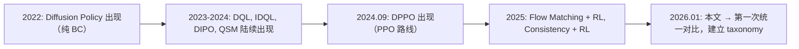

# Online DPRL 综述：扩散策略遇上在线强化学习 深度精读

> **论文标题**: A Review of Online Diffusion Policy RL Algorithms for Scalable Robotic Control  
> **作者**: Wonhyeok Choi, Shutong Ding, Minwoo Choi, Jungwan Woo, Kyumin Hwang, Jaeyeul Kim, Ye Shi, Sunghoon Im  
> **发表**: 2026年1月 (arXiv:2601.06133, v2 2026-02-09)  
> **基准平台**: NVIDIA Isaac Lab, 12 个机器人任务

**标签**: `#扩散策略` `#在线强化学习` `#综述` `#机器人控制` `#算法对比` `#DPPO` `#Q-learning` `#Flow-Matching` `#可扩展性` `#Benchmark`

**知识链接**：
- [DPPO：扩散策略策略优化](./001_DPPO_扩散策略策略优化) — Proximity-Based 家族的代表作
- [IDQL：隐式扩散 Q 学习](./005_IDQL_隐式扩散Q学习) — Q-Weighting 家族的代表作
- [为什么扩散策略难以 RL 微调](/前置知识/000f_前置知识_为什么扩散策略难以RL微调) — 核心困难解析
- [Flow Matching 与连续归一化流](/前置知识/000g_前置知识_Flow_Matching与连续归一化流) — 新兴替代范式
- [Consistency Model 与一步生成](/前置知识/000h_前置知识_Consistency_Model与一步生成) — 让 BPTT 可行的加速方案
- [策略梯度与 PPO](/前置知识/000a_前置知识_策略梯度与PPO) — 理解并行可扩展性的基础

---

## 一、为什么需要这篇综述

### 1.1 扩散策略 + 在线 RL 的爆发

2024-2026 年，"用 RL 来微调/提升 Diffusion Policy" 成了机器人学习最热门的方向之一。但每篇论文都声称自己是最好的，用的 benchmark 不同、评估方式不同、超参数不同——根本无法公平对比。

### 1.2 核心难题：扩散模型和 RL 为什么不兼容

**扩散模型的训练目标**：学会逆转噪声过程 → 本质是监督学习（拟合数据分布）

**RL 的训练目标**：最大化累积奖励 → 需要策略改进（让动作分布向高奖励方向移动）

冲突点：

1. **似然不可算**：扩散策略没有 $\log \pi(\mathbf{a}|\mathbf{s})$ 的解析表达式
2. **采样过程多步**：生成一个动作需要 $K$ 步去噪，等效 horizon 变长 $K$ 倍
3. **梯度路径长**：奖励信号要穿过 $K$ 步去噪才能到达网络参数
4. **多模态保持**：RL 微调容易让多模态策略坍缩成单模态

不同方法本质上是在用不同方式绕过这些冲突。

### 1.3 这篇综述的贡献

1. **Taxonomy**：把所有方法分成 4 大家族，每个家族有清晰的定义
2. **统一 Benchmark**：在 Isaac Lab 上构建 12 个任务，统一评测
3. **5 维评估**：不只是看最终性能，从多个角度系统对比
4. **Selection Guide**：根据实际约束给出选型建议

---

## 二、四大算法家族——详细分析

### 2.1 Family 1: Action-Gradient（动作梯度法）

**代表方法**: DIPO (Yang et al., 2024)

**核心思路**：

不改策略的参数 $\theta$，而是用 $Q$ 函数的梯度来"推动"已有动作向更好的方向移动。

具体流程：

1. 用当前策略 $\pi_\theta$ 采样一批动作 $\{a_1, a_2, \ldots\}$
2. 学一个 $Q(s, a)$ 函数评估每个动作的价值
3. 对 buffer 中的动作做梯度上升，把动作推向 $Q$ 值更高的方向：

$$
a' = a + \alpha \cdot \nabla_a Q(s, a)
$$

4. 用改进后的动作 $a'$ 作为新的监督目标，用标准 BC loss 更新策略：

$$
\mathcal{L} = \|\boldsymbol{\epsilon}_\theta(a'_k, k, s) - \boldsymbol{\epsilon}\|^2
$$

和预训练一样的去噪 loss，只是目标变了。

**为什么能绕过似然问题**：

完全不需要算 $\log \pi(a|s)$。策略更新本质上是"BC 到新目标"，去噪 loss 不变。$Q$ 函数只需要评估动作好不好，不需要知道动作的概率。

**优点**：
- 实现简单（只需要额外一个 Q 网络 + buffer 中的梯度上升）
- 不碰扩散模型的采样过程（不需要穿过去噪链做反向传播）
- 对去噪步数不敏感（因为只在最终动作 $a_0$ 上做梯度）

**缺点**：
- 策略更新是**间接的**：先改动作，再拟合策略到改过的动作。信息损失大。
- 动作梯度 $\nabla_a Q(s,a)$ 可能不稳定（$Q$ 函数在高维动作空间中的 landscape 复杂）
- 无法保证策略改进的方向：改过的动作可能在策略分布之外，拟合时产生偏差

**在综述评测中的表现**：

- 简单任务：能 work，收敛速度一般
- 复杂任务：性能天花板较低（间接更新的信息损失限制了改进幅度）
- 并行化：中等（需要 replay buffer + Q 学习，不完全利用 on-policy 数据）

### 2.2 Family 2: Q-Weighting（Q 值加权法）

**代表方法**: IDQL (Hansen-Estruch et al., 2023), AWR/RWR 变体

**核心思路**：

用 $Q$ 值（或 advantage）给采样的动作加权，然后用加权的 BC loss 更新策略。

具体流程：

1. 用策略采样多个动作 $\{a_1, a_2, \ldots, a_M\}$
2. 用 $Q$ 函数对每个动作打分
3. 把得分转化为权重（比如 softmax 或 exponentiated advantage）
4. 用加权的去噪 loss 更新策略：

$$
\mathcal{L} = \sum_i w(a_i) \cdot \|\boldsymbol{\epsilon}_\theta(a_{i,k}, k, s) - \boldsymbol{\epsilon}_i\|^2
$$

权重设计（以 AWR 为例）：

$$
w(a) = \min\!\bigl(\exp(\beta \cdot A(s,a)),\; w_{\max}\bigr)
$$

- $A > 0$ → 好动作 → 高权重 → 策略更多地学这个动作
- $A < 0$ → 差动作 → 低权重 → 策略较少学这个动作

**和 Action-Gradient 的区别**：
- Action-Gradient：改动作本身，然后拟合
- Q-Weighting：不改动作，改学习时给不同动作的权重

**IDQL 的特殊做法**：

IDQL 不做加权训练，而是在推理时用 $Q$ 值选择动作：

1. 训练时：策略用标准 BC loss 无权重拟合所有数据
2. 推理时：采样 $M$ 个动作 → 用 $Q$ 函数打分 → 选分最高的执行

等效于一个"采样+筛选"机制。好处是策略训练稳定（不受 $Q$ 估计误差影响训练）；坏处是推理时需要采样多次，更慢，且策略本身没有改进。

**优点**：
- 训练稳定（本质还是 BC 的 loss 形式）
- 不需要穿过去噪链做梯度反传
- Off-policy：可以用 replay buffer，样本效率高
- 对去噪步数不敏感

**缺点**：
- 本质上还是"监督学习"——只是调整了监督信号的权重
- 策略改进的上限受 $Q$ 函数准确性制约
- 需要 $Q$ 函数在高维动作空间中的估计准确 → 很难
- 需要大量采样才能覆盖到"好动作"

**在综述评测中的表现**：

- 样本效率：较高（off-policy，replay buffer）
- 训练稳定性：中等（$Q$ 函数不准时权重也不准）
- 大规模并行：不完全受益（off-policy 方法不需要那么多 on-policy 数据）
- 复杂任务：性能有上限

### 2.3 Family 3: Proximity-Based（近端约束法）

**代表方法**: DPPO (Ren et al., 2024)

**核心思路**：

把去噪过程展开成 MDP，利用每步去噪的高斯似然来做策略梯度 + PPO 的近端约束。

具体流程：

1. 把整个环境 episode 展开为"两层 MDP"：
   - 外层：环境交互 $s_t \to a_t \to s_{t+1}$
   - 内层：每个 $a_t$ 的生成过程 $a_K \to a_{K-1} \to \cdots \to a_0$（去噪）

2. 在展开的 MDP 上定义：
   - 状态 $\bar{s} = (\text{环境状态 } s,\; \text{去噪中间结果 } a^{k+1})$
   - 动作 $\bar{a} = \text{去噪一步得到 } a^k$
   - 策略 $\bar{\pi}(\bar{a}|\bar{s}) = \mathcal{N}(a^k;\; \mu_\theta(a^{k+1}, k, s),\; \sigma_k^2)$ ← 高斯！有解析 log-likelihood

3. 对每步去噪独立计算概率比：

$$
r_k(\theta) = \frac{\pi_{\theta_{\text{new}}}(a^k \mid a^{k+1}, s)}{\pi_{\theta_{\text{old}}}(a^k \mid a^{k+1}, s)}
$$

4. 用 PPO clip 约束每步的更新幅度：

$$
\mathcal{L} = \min\!\bigl(r_k \cdot A,\; \text{clip}(r_k, 1-\epsilon, 1+\epsilon) \cdot A\bigr)
$$

**为什么这是最"正统"的策略梯度方法**：

它满足策略梯度定理的所有条件：
- 有可采样的策略 ✓（正常去噪采样）
- 有可计算的 log-likelihood ✓（每步高斯）
- 有近端约束防止更新过大 ✓（PPO clip）

**关键设计选择**：
- Advantage 只依赖环境状态 $s$（不依赖去噪中间结果）→ 降低方差
- $\gamma_{\text{denoise}} < 1$ → 对早期（高噪声）去噪步降权
- 只微调最后 $K'$ 步 → 前面步骤冻结
- 不同去噪步用不同 clip ratio → 更精细的控制

**优点**：
- **训练最稳定**：PPO clip 天然防止策略崩溃
- **结构化探索**：去噪过程让探索在数据流形上进行
- **最适合大规模并行**：on-policy 方法 + GPU 并行仿真 = 几千环境同时跑
- **Sim-to-Real 最好**：输出平滑、策略鲁棒

**缺点**：
- On-policy → 每批数据用完就扔，样本效率不如 off-policy
- 需要好的 BC 预训练作为起点
- 多步去噪增加计算开销（比 Gaussian PPO 慢 ~20-50%）
- 探索可能"太保守"（被流形约束住）

**在综述评测中的表现**：

- 综合性能：最好或接近最好（尤其是复杂任务）
- 训练稳定性：最高（几乎不崩溃）
- 并行可扩展性：最高（天然匹配 GPU 并行仿真）
- 去噪步数可扩展性：好（只微调后几步）
- 鲁棒性：最好（对观测噪声和域随机化最不敏感）

### 2.4 Family 4: BPTT（反向传播穿透法）

**代表方法**: DQL (Wang et al., 2022), QSM (Psenka et al., 2023)

**核心思路**：

学一个 $Q$ 函数，然后把 $Q$ 值的梯度反向传播穿过整个去噪链来更新策略。

**DQL 的做法**：

1. 策略从噪声去噪到 $a_0$：$a_K \to a_{K-1} \to \cdots \to a_0$
2. $Q$ 函数评估最终动作：$Q(s, a_0)$
3. 对策略参数 $\theta$ 求梯度——需要梯度穿过整个去噪过程（$K$ 步网络前向传播的反向传播）：

$$
\nabla_\theta Q(s, a_0) = \nabla_\theta Q\bigl(s,\; \text{denoise}_\theta(a_K, s)\bigr)
$$

**QSM（Q-Score Matching）的做法**：

不是直接梯度穿透，而是让策略的 score（$\nabla_a \log \pi$）对齐 $Q$ 函数的动作梯度：

$$
\mathcal{L} = \|\alpha \cdot \nabla_a Q(s, a) - (-\boldsymbol{\epsilon}_\theta(a_k, k, s))\|^2
$$

即让扩散模型学到的"去噪方向"指向 $Q$ 值高的地方。

**为什么叫 BPTT**：

Back-Propagation Through Time。去噪 $K$ 步类似于 RNN 展开 $K$ 步。梯度要穿过 $K$ 层网络。

**优点**：
- 理论上最"直接"的策略改进信号（$Q$ 梯度直接指导每一步去噪）
- 不需要估计 advantage（直接用 $Q$ 函数）

**缺点**：
- **梯度不稳定**：$K$ 步反向传播 → vanishing/exploding gradient
- **对 $Q$ 函数精度极敏感**：$Q$ 稍有偏差 → 梯度方向完全错误 → 训练崩
- **计算开销大**：需要存储整条去噪链的中间状态来做反向传播
- **GPU 显存消耗高**：$K$ 步的计算图都要保留
- **去噪步数越多越差**：梯度路径越长越不稳定

**在综述评测中的表现**：

- 简单任务 + 少步去噪（$K \le 5$）：能 work，性能尚可
- 复杂任务 + 多步去噪（$K \ge 20$）：性能急剧下降
- 训练稳定性：最低
- 噪声敏感性：最高（对观测噪声最不鲁棒）

---

## 三、统一 Benchmark 设计

### 3.1 任务设计

12 个机器人任务覆盖不同维度的挑战：

**按复杂度**：
- 简单：单关节控制、基础导航
- 中等：多关节协调、物体操作
- 困难：双臂协作、长 horizon、稀疏奖励

**按机器人类型**：
- 机械臂（7-DOF）
- 双臂系统（14-DOF）
- 移动操作
- 四足

**按奖励类型**：
- 密集奖励（每步都有信号）
- 稀疏奖励（只在完成时有信号）

**按动作分布**：
- 单模态（只有一种好的做法）
- 多模态（多种等效的好做法）

### 3.2 统一评测框架

所有方法使用：
- 相同的仿真平台（Isaac Lab）
- 相同的预训练策略（BC + Diffusion Policy）
- 相同的观测空间和动作空间
- 相同的计算资源和训练 budget
- 相同的评估 protocol（固定种子数、固定评估次数）

---

## 四、五维评测结果

### 4.1 维度 1：Task Diversity（任务多样性）

核心发现：

- 简单密集奖励任务：所有方法都能 work，差距不大
- 复杂稀疏奖励任务：Proximity-Based（DPPO）明显领先
- 多模态任务：DPPO 和 Q-Weighting 都能保持多模态
- 单模态任务：所有方法差不多

解释：稀疏奖励 → 需要有效探索才能碰到奖励。DPPO 的结构化探索 → 能高效地在数据流形附近找到成功路径。Q-learning 类方法 → $Q$ 函数在稀疏奖励下很难学准 → 策略改进信号弱。

### 4.2 维度 2：Parallelization Capability（并行化能力）

测试：从 32 个并行环境 scale 到 4096 个并行环境。

**Proximity-Based（DPPO）**：
- 32 环境：慢但能收敛
- 4096 环境：速度线性提升，性能也因更准的 advantage 估计而提升
- 完美匹配大规模 GPU 并行

**Action-Gradient / Q-Weighting**：
- 更多并行环境 = 更多数据进 replay buffer
- 但 $Q$ 函数训练不完全利用大规模在线数据（off-policy bottleneck）
- Buffer 刷新频率反而成为瓶颈

**BPTT**：
- GPU 显存被去噪链的计算图占用
- 并行环境数受显存限制
- 不如 on-policy 方法 scale 好

### 4.3 维度 3：Diffusion Step Scalability（去噪步数可扩展性）

测试：去噪步数从 $K=5$ 到 $K=100$。

**BPTT**：$K=5$ 性能合理；$K=20$ 性能明显下降；$K=50$ 几乎不收敛；$K=100$ 完全不 work。梯度消失/爆炸问题随 $K$ 线性恶化。

**Proximity-Based（DPPO）**：$K=5$ 好；$K=20$ 好（只微调后 10 步）；$K=100$ 还是好（只微调后 5 步 DDIM）。因为可以只微调后几步，对总 $K$ 不敏感。

**Action-Gradient / Q-Weighting**：完全不受 $K$ 影响（它们只看最终动作 $a_0$，不碰中间步）。但也因此无法利用去噪过程的结构。

**结论**：如果必须用多步去噪（更好的多模态建模）→ 排除 BPTT。如果能用少步（Flow Matching, Consistency）→ BPTT 变得可行。

### 4.4 维度 4：Cross-Embodiment Generalization（跨具身泛化）

测试：同一算法在不同机器人形态上的相对排名是否一致。

结果：各方法的相对排名在不同机器人上基本保持一致 → taxonomy 是稳健的（不是特定机器人上的 artifact）。

- DPPO 在所有机器人上都是 top 2
- BPTT 在所有机器人上都是最差或倒数第二
- Q-Weighting 和 Action-Gradient 在中间，排名略有浮动

### 4.5 维度 5：Environmental Robustness（环境鲁棒性）

测试：加入观测噪声、动力学随机化后的表现退化程度。

**Proximity-Based**：退化最小（因为多步去噪天然有"去噪"能力）。在高噪声下仍然能收敛。

**Q-Weighting**：中等退化（$Q$ 函数在噪声下估计变差 → 权重不准 → 性能下降）。

**Action-Gradient**：中等退化（动作梯度在噪声 $Q$ landscape 上方向不稳定）。

**BPTT**：退化最严重（梯度穿过去噪链时，噪声被放大）。高噪声下几乎完全失效。

---

## 五、核心 Trade-off 总结

### 5.1 综合对比表

| 评估维度 | Action-Gradient | Q-Weighting | Proximity-Based | BPTT |
|----------|----------------|-------------|-----------------|------|
| 综合性能 | 中 | 中-高 | **最高** | 低-中 |
| 训练稳定性 | 中 | 中 | **最高** | 最低 |
| 样本效率 | 中 | 高（off-policy） | 中（on-policy） | 低-中 |
| 并行可扩展性 | 中 | 低-中 | **最高** | 低 |
| 去噪步数可扩展性 | 不受影响 | 不受影响 | 好 | 差 |
| 鲁棒性 | 中 | 中 | **最高** | 最低 |
| 实现复杂度 | 低 | 中 | 中 | 高 |
| Wall-clock 速度 | 中 | 中 | 中（比 Gaussian 慢 20%） | 慢 |

### 5.2 什么时候用哪个

| 场景 | 推荐方法 | 理由 |
|------|----------|------|
| 有大量 GPU 并行环境（Isaac Gym/Lab, 1000+ 环境） | Proximity-Based（DPPO） | 完美匹配 on-policy 大规模并行 |
| 数据稀缺（真实机器人在线学习，只有 1-few 个环境） | Q-Weighting（IDQL, AWR） | Off-policy，replay buffer 重复利用数据 |
| 去噪步数很少（$\le 5$，Flow Matching / Consistency Model） | BPTT | 短链梯度稳定性可以接受 |
| 需要最高鲁棒性（Sim-to-Real, 噪声大） | Proximity-Based | 多步去噪的天然去噪能力 + 结构化探索 |
| 快速原型验证 | Action-Gradient | 最简单，不需要改太多代码 |
| 已有好的 BC 预训练 + 需要精细微调 | Proximity-Based | 在数据流形上精细调整，不会跑偏 |

---

## 六、当前瓶颈与未来方向

### 6.1 计算瓶颈

**问题**：扩散策略推理慢（每次出动作要去噪 $K$ 步），在线 RL 训练时 rollout 速度受限。

计算分析：

| 组件 | 推理耗时 |
|------|----------|
| 环境 step（GPU 仿真） | ~0.1 ms |
| Gaussian 策略 | ~0.01 ms（一次前向传播） |
| Diffusion $K=20$ | ~0.2 ms（20 次前向传播） |
| Diffusion $K=100$ | ~1 ms（100 次前向传播） |

Rollout 瓶颈从"环境"变成了"策略推理"。在线 RL 需要海量 rollout → 推理速度是硬瓶颈。

**当前缓解方法**：
- DDIM：把 100 步压缩到 5 步（$\sim 4\times$ 加速但有精度损失）
- 只微调后几步：减少需要梯度的步数
- Consistency Model：一步出动作（但表达力下降）
- Flow Matching：通常 4-10 步就够好（比 DDPM 快很多）

**未来方向**：
- 自适应步数：简单状态少步去噪，复杂状态多步去噪
- 蒸馏：训练完后把多步策略蒸馏成 1-2 步的快速策略
- 硬件加速：为扩散推理优化的专用算子

### 6.2 算法瓶颈

**瓶颈 1：探索-利用权衡**

扩散模型的结构化探索是优点但也是局限：
- **优点**：探索在数据流形附近，不会产生完全无意义的动作
- **局限**：如果最优策略不在预训练数据流形上，可能永远找不到

例子：预训练数据包含人类用两种方式完成任务；最优策略是第三种人类没做过的方式（更快/更稳定）；扩散探索只在两种已知方式附近搜索 → 可能错过第三种。

可能的解决方案：
- 更多样的预训练数据 → 更广的流形
- 周期性注入无结构噪声（跳出流形）
- 结合 model-based planning 发现新模式

**瓶颈 2：Credit Assignment（信用分配）**

问题：一个好的最终动作 $a_0$，功劳应该归到哪个去噪步？

$K=20$ 步的去噪链中：
- 第 20 步决定了大方向
- 最后几步做精细调整
- 中间步骤做什么？

DPPO 用 $\gamma_{\text{denoise}}$ 来折扣早期步 → 一种启发式的 credit assignment，但不一定最优。

未来方向：
- 学习 per-step 的 credit assignment（自适应 $\gamma_{\text{denoise}}$）
- 对不同去噪步用不同的学习率
- Hierarchical 结构：粗粒度步骤做大方向，细粒度做精调

**瓶颈 3：多模态保持 vs 策略改进**

RL 微调的本质：让策略向"更好的模式"倾斜。但如果有两个模式都不错，只是其中一个略好：RL 自然会让策略坍缩到那个略好的模式 → 多模态性丢失 → 如果部署时遇到"略好模式不适用"的情况，就没有备选方案了。

如何保持多模态：
- Entropy regularization（鼓励分布多样性）
- KL penalty 到预训练策略（限制偏离原始多模态分布）
- Population-based training（多个策略各覆盖不同模式）

### 6.3 生态瓶颈

当前所有方法都在各自的小 benchmark 上验证：
- DPPO：Robomimic + FurnitureBench
- DQL/IDQL：D4RL + Robomimic
- DIPO：自建任务
- 本综述：Isaac Lab 12 任务

缺少：
- 真机 Sim-to-Real 的统一对比（目前只有 DPPO 做了真机实验）
- 大规模多任务预训练 + 微调的对比
- 和 non-diffusion 方法（如 SAC, TD3）在相同任务上的公平对比

---

## 七、与 Flow Matching 的关系

### 7.1 Flow Matching 是什么

DDPM 使用离散时间步 $k=1,\ldots,K$，加/去高斯噪声。Flow Matching 使用连续时间 $t \in [0,1]$，学一个向量场 $v_\theta(x_t, t)$ 把噪声"流"向数据。

推理时解 ODE：

$$
\frac{dx}{dt} = v_\theta(x_t, t)
$$

从 $t=1$（噪声）到 $t=0$（数据），用 Euler method 或更高阶 ODE solver。通常 4-10 步就足够好（比 DDPM 的 20-100 步快很多）。

### 7.2 对 Online DPRL 的影响

Flow Matching + RL 的优势：

1. 步数少 → BPTT 方法变得可行（梯度链短了）
2. 推理快 → rollout 瓶颈缓解
3. ODE 过程有解析的 log-likelihood（用 instantaneous change of variables formula）

2025-2026 年的趋势：越来越多工作转向 Flow Policy + RL，综合了 DPPO 的稳定性 + BPTT 的直接性。但理论和实践还在发展中。

---

## 八、个人评价

### 8.1 综述的价值

这是第一篇把混乱的"Diffusion + RL"领域做了系统整理的工作。Taxonomy 清晰，评测公平，结论实用。对于想进入这个方向的研究者是很好的路线图。

### 8.2 确认了 DPPO 路线的正确性

综述的评测结果基本确认了 DPPO 论文的核心结论：
- Proximity-Based 在综合性能上最好
- 大规模并行 + on-policy 是当前最实用的范式
- 结构化探索和训练稳定性是扩散策略 + RL 的核心优势

### 8.3 遗漏和不足

- 没有 Flow Matching 方法的详细评测（2026 年初可能还太新）
- 没有真机实验（所有对比都在仿真中）
- 只用了 Isaac Lab（和 MuJoCo-based 的结果可能有差异）
- 预训练数据量和质量的影响没有深入分析

### 8.4 对实践的指导意义

如果你今天（2026 年中）要做"Diffusion Policy + RL"：

1. 默认选 DPPO（最稳、最不容易踩坑）
2. 如果推理速度是瓶颈 → 考虑 Flow Matching + Proximity-Based
3. 如果是真机在线学习（不能并行）→ 考虑 Q-Weighting（off-policy）
4. 如果去噪步数 $\le 5$ → BPTT 也值得试试

避免：
- 在复杂任务 + 多步去噪上用 BPTT（大概率不收敛）
- 在大规模并行环境下用 off-policy 方法（浪费了并行的优势）

---

## 延伸阅读

- **001_DPPO** ← Proximity-Based 的代表作（本系列第 1 篇精读）
- **000a_前置知识_策略梯度与PPO** ← 理解为什么 PPO 适合大规模并行
- **000b_前置知识_扩散模型DDPM** ← 去噪步数、噪声调度的基础
- **000e_前置知识_对数似然与变分下界** ← 理解"似然不可算"这个核心困难
- Diffusion Policy (Chi et al., 2024) ← 被微调的基础模型
- DIPO (Yang et al., 2024) ← Action-Gradient 代表
- DQL (Wang et al., 2022) ← BPTT 代表
- IDQL (Hansen-Estruch et al., 2023) ← Q-Weighting 代表
- Flow Policy RL (2025-2026) ← 新兴替代范式
