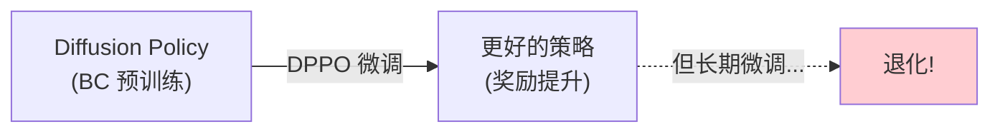
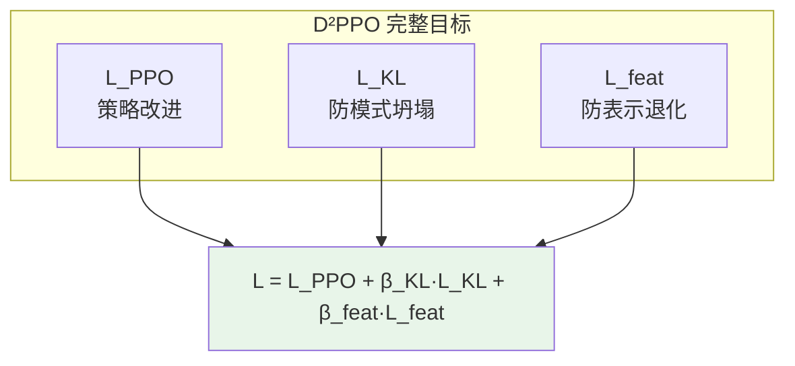
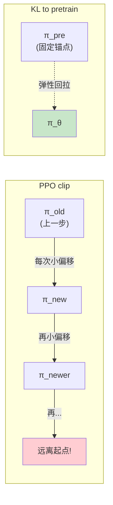
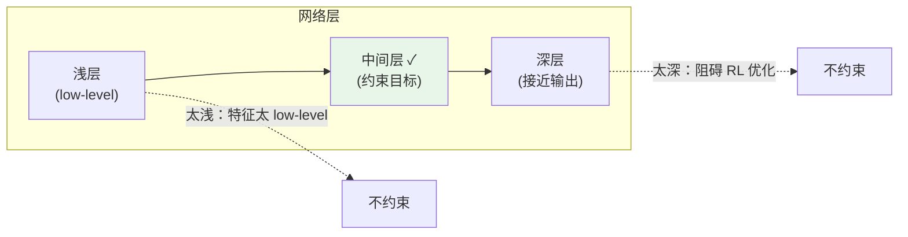
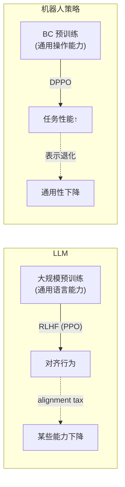

# D²PPO：解决 DPPO 的表示坍塌问题 深度精读

> **论文标题**: D²PPO: Preventing Mode Collapse and Representation Degradation in Diffusion Policy Fine-Tuning  
> **作者**: Yifan Zhang, Jiangmiao Pang, Hao Chen  
> **机构**: Shanghai AI Lab, CUHK  
> **发表**: 2025 (arXiv)  
> **基于**: DPPO 框架的改进

**标签**: `#扩散策略` `#RL微调` `#表示坍塌` `#模式坍塌` `#PPO` `#正则化` `#DPPO改进` `#策略退化`

**知识链接**：
- [DPPO：扩散策略策略优化](./001_DPPO_扩散策略策略优化) — D²PPO 改进的基线方法
- [策略梯度与 PPO](/前置知识/000a_前置知识_策略梯度与PPO) — PPO 的 clip 机制
- [为什么扩散策略难以 RL 微调](/前置知识/000f_前置知识_为什么扩散策略难以RL微调) — 微调的根本困难
- [Online DPRL 综述](./003_Online_DPRL_综述_扩散策略与在线RL) — 多模态保持的讨论
- [Diffusion Policy](/前置知识/000c_前置知识_Diffusion_Policy) — 被微调的基础模型

---

## 一、背景：DPPO 微调的"隐蔽退化"

### 1.1 DPPO 解决了什么（回顾）

DPPO 成功解决了 $\log\pi$ 不可算的问题，让 PPO 能直接微调扩散策略。短期微调效果很好。**但 D²PPO 发现了两个长期微调的隐蔽问题**。

### 1.2 问题 1：模式坍塌 (Mode Collapse)

预训练的扩散策略能表示多种行为模式（如避障时的左绕/右绕）。DPPO 微调后，**劣势模式逐渐消失**：

**后果**：环境稍有变化时（新障碍物），唯一剩的模式不适用 → 策略鲁棒性崩塌。

### 1.3 问题 2：表示退化 (Representation Degradation)

扩散模型内部的特征表示在微调过程中逐渐退化：

- 中间层 feature 方差塌缩
- 去噪能力下降
- 网络的"通用性"丢失

**原因**：PPO 梯度稀疏（只有成功/失败信号），但网络所有参数都被更新 → 噪声梯度逐渐破坏预训练表示。

> 类比 LLM 的 RLHF：学习率太高时模型会"忘记"预训练知识（alignment tax）。扩散策略 RL 微调也有同样现象。

### 1.4 为什么 DPPO 原有保护不够

| DPPO 保护机制 | 能防什么 | 防不住什么 |
|---|---|---|
| PPO clip ($\epsilon$=0.01) | 单步概率变化不过大 | 累积偏移（100步×每步0.01=大偏移） |
| $\gamma_{\text{denoise}}$ | 早期去噪步梯度过大 | 梯度方向的破坏性 |
| 冻结前面步骤 | 前面步骤的参数 | 后 $K'$ 步的表示退化 |

---

## 二、方法：双重正则化

### 2.1 整体架构

### 2.2 KL 正则化：防模式坍塌

**核心想法**：限制微调策略不能偏离预训练策略太远。

传统做法中 $\mathrm{KL}(\pi_\theta \| \pi_{\text{pre}})$ 需要计算两个扩散策略的 KL 散度——和 $\log\pi$ 一样不可算。

**D²PPO 的解法**：利用 DPPO 的展开 MDP，在**每步去噪**上做 KL。每步去噪是高斯，两个高斯的 KL 有解析公式：

$$
\mathrm{KL}\!\left(\mathcal{N}(\mu_\theta, \sigma^2) \,\|\, \mathcal{N}(\mu_{\text{pre}}, \sigma_{\text{pre}}^2)\right) = \frac{1}{2}\left[\frac{(\mu_\theta - \mu_{\text{pre}})^2}{\sigma_{\text{pre}}^2} + \frac{\sigma^2}{\sigma_{\text{pre}}^2} - 1 - \ln\frac{\sigma^2}{\sigma_{\text{pre}}^2}\right]
$$

总 KL 惩罚对所有去噪步加权求和：

$$
\boxed{\mathcal{L}_{\text{KL}} = \beta_{\text{KL}} \sum_{k=0}^{K'-1} \gamma_{\text{denoise}}^k \cdot \mathrm{KL}\!\left(\pi_\theta(\cdot | \mathbf{a}^{k+1}, \mathbf{s}) \;\|\; \pi_{\text{pre}}(\cdot | \mathbf{a}^{k+1}, \mathbf{s})\right)}
$$

**和 PPO clip 的本质区别**：

PPO clip 是"绳子拴在前一步"（允许累积漂移）；KL to pretrain 是"绳子拴在起点"（绝对偏移有上限）。

### 2.3 特征保持正则化：防表示退化

**核心想法**：让微调网络的中间层特征和预训练网络保持相似。

保留一份冻结的预训练网络 $F_{\text{pre}}$（只推理，不占训练显存梯度），对中间层特征做 L2 约束：

$$
\boxed{\mathcal{L}_{\text{feat}} = \beta_{\text{feat}} \cdot \left\| \mathrm{sg}(\mathbf{h}_{\text{pre}}) - \mathbf{h}_\theta \right\|^2}
$$

其中：
- $\mathbf{h}_\theta = F_\theta^{\text{mid}}(\mathbf{a}^{k+1}, k, \mathbf{s})$：微调网络的中间层特征
- $\mathbf{h}_{\text{pre}} = F_{\text{pre}}^{\text{mid}}(\mathbf{a}^{k+1}, k, \mathbf{s})$：预训练网络的中间层特征
- $\mathrm{sg}(\cdot)$：stop gradient（不对预训练网络求梯度）

**选择哪些层做约束**：

经验：选总层数 40%–60% 位置的层。

### 2.4 完整目标函数

$$
\mathcal{L}_{\text{D}^2\text{PPO}} = \underbrace{\mathcal{L}_{\text{PPO-clip}}}_{\text{驱动策略改进}} + \underbrace{\beta_{\text{KL}} \cdot \mathcal{L}_{\text{KL}}}_{\text{防止分布偏移}} + \underbrace{\beta_{\text{feat}} \cdot \mathcal{L}_{\text{feat}}}_{\text{防止表示退化}}
$$

三个项的作用：

| 项 | 优化方向 | 防护对象 |
|---|---|---|
| $\mathcal{L}_{\text{PPO}}$ | 最大化奖励 | — |
| $\mathcal{L}_{\text{KL}}$ | 限制策略分布偏移 | 模式坍塌 |
| $\mathcal{L}_{\text{feat}}$ | 保持内部表示 | 表示退化 |

---

## 三、实验结果

### 3.1 模式坍塌的修复

D3IL Avoid 环境（2D 避障，预训练有左绕/右绕两种模式）：

| Iteration | DPPO 模式比例 | D²PPO 模式比例 |
|---|---|---|
| 0 | 50:50 | 50:50 |
| 50 | 70:30 | 65:35 |
| 100 | 95:5 | 75:25 |
| 200 | 100:0 ❌ | 80:20 ✓ |

D²PPO 仍然让好模式增强（RL 在起作用），但差模式不会完全消失（KL 在保护）。

### 3.2 长期微调性能对比

短期（100 iterations）两者差不多。**长期（500 iterations）差距拉大**——DPPO 出现性能退化，D²PPO 保持稳定：

| 任务 (500 iter) | DPPO | D²PPO | 差值 |
|---|---|---|---|
| Can | 96% (退化↓) | 99% | +3% |
| Square | 89% (退化↓) | 97% | +8% |
| Transport | 75% (退化↓) | 91% | +16% |

### 3.3 表示保持验证

用 CKA (Centered Kernel Alignment) 度量微调后 vs 预训练的特征相似度（$\text{CKA} \in [0,1]$，1 表示完全相同）：

| 层深度 | DPPO (200 iter) | D²PPO (200 iter) |
|---|---|---|
| 浅层 | 0.95 | 0.97 |
| 中间层 | 0.65 ⚠️ | 0.88 ✓ |
| 深层 | 0.40 ❌ | 0.72 ✓ |

### 3.4 迁移能力验证

在任务 A 上 RL 微调 → 再在任务 B 上 BC 微调：

$$
\text{DPPO 微调后} \xrightarrow{\text{BC on task B}} \text{性能低于直接用预训练模型} \quad \text{（通用表示被破坏）}
$$

$$
\text{D}^2\text{PPO 微调后} \xrightarrow{\text{BC on task B}} \text{性能接近直接用预训练模型} \quad \text{（通用表示保留）}
$$

---

## 四、消融实验

### 4.1 各组件的贡献

| 配置 | 防模式坍塌 | 防表示退化 | 长期性能 |
|---|---|---|---|
| DPPO (baseline) | ✗ | ✗ | 退化 |
| + KL only | ✓ | 部分 | 好 |
| + feat only | 部分 | ✓ | 好 |
| + KL + feat (D²PPO) | ✓ | ✓ | **最好** |

两者有协同效应：KL 保护分布形状 + feat 保护内部表示 → 互相增强。

### 4.2 超参数敏感性

$$
\beta_{\text{KL}}:\quad
\begin{cases}
0.001 & \text{太弱，等于没加} \\
0.01\text{–}0.1 & \text{效果最好（推荐 0.05）} \\
1.0 & \text{太强，策略几乎不更新}
\end{cases}
$$

$$
\beta_{\text{feat}}:\quad
\begin{cases}
0.01 & \text{太弱} \\
0.1\text{–}1.0 & \text{效果好（对此参数不太敏感）} \\
10.0 & \text{开始影响 RL 性能}
\end{cases}
$$

---

## 五、和 LLM RLHF 的类比

相同的解决范式：

| LLM | Diffusion Policy |
|---|---|
| KL penalty to reference policy | $\mathcal{L}_{\text{KL}}$ to $\pi_{\text{pre}}$ |
| — | $\mathcal{L}_{\text{feat}}$ (LLM 领域较少用) |

机器人场景更需要这个防护：退化后果更严重（碰撞/硬件损坏），数据更珍贵（50–300 条示教），任务多样性要求更高。

---

## 六、实践指南

### 6.1 什么时候需要 D²PPO

| 场景 | 推荐 |
|---|---|
| 长时间微调 (>100 iter) | D²PPO |
| 多模态任务 | D²PPO |
| 微调后迁移其他任务 | D²PPO |
| 短期微调 (<50 iter) | DPPO 够用 |
| 单模态任务 | DPPO 够用 |

### 6.2 推荐超参数

$$
\beta_{\text{KL}} = 0.05, \quad \beta_{\text{feat}} = 0.5, \quad \text{特征层: 网络中间 50\% 位置}
$$

### 6.3 监控指标

| 指标 | 正常 | 异常 → 动作 |
|---|---|---|
| 采样动作方差 | 稳定 | 持续下降 → 增大 $\beta_{\text{KL}}$ |
| CKA 相似度 | > 0.7 | < 0.7 → 增大 $\beta_{\text{feat}}$ |
| 任务成功率 | 上升或稳定 | 下降 → 减小 $\beta$ 值 |

---

## 七、个人评价

### 解决了被忽视的重要问题

DPPO 专注于"能不能做"，D²PPO 回答了"做久了会怎样"。两个正则化项都是标准技术的组合（KL penalty + feature distillation），简洁有效，工程上容易实现。

### 对实践的启示

> 即使不用完整 D²PPO，至少应该**监控**模式多样性和特征相似度。发现退化再加正则化也不晚。

---

## 延伸阅读

- **001_DPPO** ← D²PPO 改进的基线（必读）
- **000f_前置知识_为什么扩散策略难以RL微调** ← 微调的根本困难
- **003_Online_DPRL_综述** ← 多模态保持的讨论
- InstructGPT / RLHF ← LLM 领域类似的退化问题
- EWC (Elastic Weight Consolidation) ← 另一种防灾难性遗忘方法
