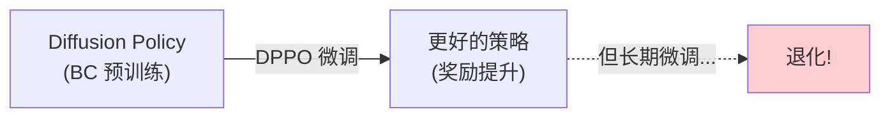
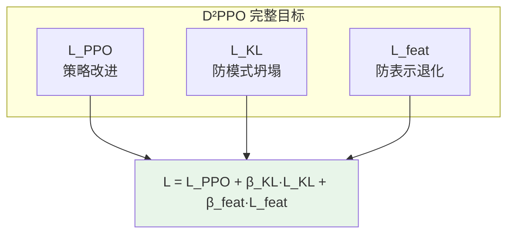
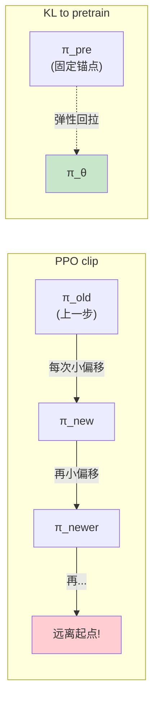
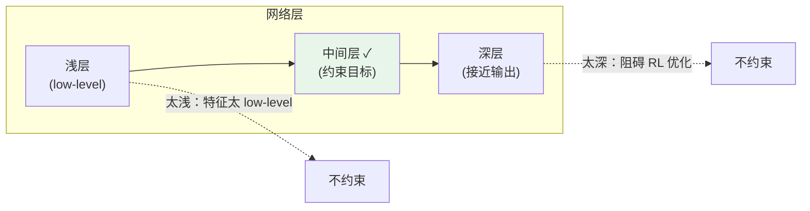
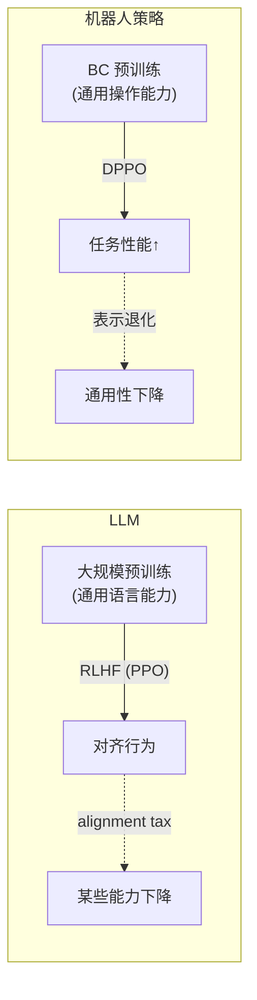

# D²PPO：解决 DPPO 的表示坍塌问题 深度精读

> **论文标题**: D²PPO: Preventing Mode Collapse and Representation Degradation in Diffusion Policy Fine-Tuning  
> **作者**: Yifan Zhang, Jiangmiao Pang, Hao Chen  
> **机构**: Shanghai AI Lab, CUHK  
> **发表**: 2025 (arXiv)  
> **基于**: DPPO 框架的改进

**标签**: `#扩散策略` `#RL微调` `#表示坍塌` `#模式坍塌` `#PPO` `#正则化` `#DPPO改进` `#策略退化`

**知识链接**：
- [DPPO：扩散策略策略优化](./001_DPPO_扩散策略策略优化) — D²PPO 改进的基线方法
- [策略梯度与 PPO](/前置知识/000a_前置知识_策略梯度与PPO) — PPO 的 clip 机制
- [为什么扩散策略难以 RL 微调](/前置知识/000f_前置知识_为什么扩散策略难以RL微调) — 微调的根本困难
- [Online DPRL 综述](./003_Online_DPRL_综述_扩散策略与在线RL) — 多模态保持的讨论
- [Diffusion Policy](/前置知识/000c_前置知识_Diffusion_Policy) — 被微调的基础模型

---

## 一、背景：DPPO 微调的"隐蔽退化"

### 1.1 DPPO 解决了什么（回顾）

```mermaid
flowchart LR
    A["Diffusion Policy<br/>(BC 预训练)"] -->|"DPPO 微调"| B["更好的策略<br/>(奖励提升)"]
    B -.->|"但长期微调..."| C["退化!"]
    style C fill:#ffcdd2
```

DPPO 成功解决了 $\log\pi$ 不可算的问题，让 PPO 能直接微调扩散策略。短期微调效果很好。**但 D²PPO 发现了两个长期微调的隐蔽问题**。

### 1.2 问题 1：模式坍塌 (Mode Collapse)

预训练的扩散策略能表示多种行为模式（如避障时的左绕/右绕）。DPPO 微调后，**劣势模式逐渐消失**：

```mermaid
graph TD
    subgraph "Iteration 0"
        A1["模式A 50%"] --- A2["模式B 50%"]
    end
    subgraph "Iteration 100"
        B1["模式A 95%"] --- B2["模式B 5%"]
    end
    subgraph "Iteration 200"
        C1["模式A 100%"] --- C2["模式B 0% ❌"]
    end
    style C2 fill:#ffcdd2
```

**后果**：环境稍有变化时（新障碍物），唯一剩的模式不适用 → 策略鲁棒性崩塌。

### 1.3 问题 2：表示退化 (Representation Degradation)

扩散模型内部的特征表示在微调过程中逐渐退化：

- 中间层 feature 方差塌缩
- 去噪能力下降
- 网络的"通用性"丢失

**原因**：PPO 梯度稀疏（只有成功/失败信号），但网络所有参数都被更新 → 噪声梯度逐渐破坏预训练表示。

> 类比 LLM 的 RLHF：学习率太高时模型会"忘记"预训练知识（alignment tax）。扩散策略 RL 微调也有同样现象。

### 1.4 为什么 DPPO 原有保护不够

| DPPO 保护机制 | 能防什么 | 防不住什么 |
|---|---|---|
| PPO clip ($\epsilon$=0.01) | 单步概率变化不过大 | 累积偏移（100步×每步0.01=大偏移） |
| $\gamma_{\text{denoise}}$ | 早期去噪步梯度过大 | 梯度方向的破坏性 |
| 冻结前面步骤 | 前面步骤的参数 | 后 $K'$ 步的表示退化 |

---

## 二、方法：双重正则化

### 2.1 整体架构

```mermaid
flowchart TD
    subgraph "D²PPO 完整目标"
        L1["L_PPO<br/>策略改进"] 
        L2["L_KL<br/>防模式坍塌"]
        L3["L_feat<br/>防表示退化"]
    end
    L1 --> TOTAL["L = L_PPO + β_KL·L_KL + β_feat·L_feat"]
    L2 --> TOTAL
    L3 --> TOTAL
    style TOTAL fill:#e8f5e9
```

### 2.2 KL 正则化：防模式坍塌

**核心想法**：限制微调策略不能偏离预训练策略太远。

传统做法中 $\mathrm{KL}(\pi_\theta \| \pi_{\text{pre}})$ 需要计算两个扩散策略的 KL 散度——和 $\log\pi$ 一样不可算。

**D²PPO 的解法**：利用 DPPO 的展开 MDP，在**每步去噪**上做 KL。每步去噪是高斯，两个高斯的 KL 有解析公式：

$$
\mathrm{KL}\!\left(\mathcal{N}(\mu_\theta, \sigma^2) \,\|\, \mathcal{N}(\mu_{\text{pre}}, \sigma_{\text{pre}}^2)\right) = \frac{1}{2}\left[\frac{(\mu_\theta - \mu_{\text{pre}})^2}{\sigma_{\text{pre}}^2} + \frac{\sigma^2}{\sigma_{\text{pre}}^2} - 1 - \ln\frac{\sigma^2}{\sigma_{\text{pre}}^2}\right]
$$

**这个公式在做什么**：算出微调后的每一步去噪分布和预训练时同一步去噪分布之间差了多少——两个高斯分布不需要采样近似，直接套公式就能精确算出 [KL 散度](/前置知识/000j_前置知识_KL散度与策略约束)。

::: details 📐 公式详解（点击展开）

| 子表达式 | 它是谁 | 它在干嘛 |
|---------|--------|---------|
| $\mathcal{N}(\mu_\theta, \sigma^2)$ | **微调后的去噪分布** | 当前策略在这一去噪步上，网络预测出的均值/方差决定的高斯分布 |
| $\mathcal{N}(\mu_{\text{pre}}, \sigma_{\text{pre}}^2)$ | **预训练时的去噪分布** | 同一去噪步上，冻结的预训练策略给出的高斯分布，作为"标准答案" |
| $\frac{(\mu_\theta-\mu_{\text{pre}})^2}{\sigma_{\text{pre}}^2}$ | **均值跑偏的代价** | 两个分布中心点隔了多远，按预训练方差归一化后的平方距离 |
| $\frac{\sigma^2}{\sigma_{\text{pre}}^2} - 1 - \ln\frac{\sigma^2}{\sigma_{\text{pre}}^2}$ | **方差走形的代价** | 微调后分布"胖了"还是"瘦了"，偏离 1（完全一致）越远这一项越大 |

**用人话读**："这一步去噪，微调网络给出的高斯分布，和预训练网络给出的高斯分布差多远——中心点偏了多少、胖瘦变了多少，两部分加起来就是这一步的 KL 距离。"

**为什么是这个形式**：两个高斯分布之间的 KL 散度有闻名的解析解（不需要采样、不需要蒙特卡罗近似），这正是 D²PPO 能"绕开扩散策略 $\log\pi$ 不可算"这个老问题的关键——虽然整条扩散链的 KL 没法直接算，但拆到每一个单步去噪（本身就是一个高斯）上，KL 就变成了闭式公式。
:::

总 KL 惩罚对所有去噪步加权求和：

$$
\boxed{\mathcal{L}_{\text{KL}} = \beta_{\text{KL}} \sum_{k=0}^{K'-1} \gamma_{\text{denoise}}^k \cdot \mathrm{KL}\!\left(\pi_\theta(\cdot | \mathbf{a}^{k+1}, \mathbf{s}) \;\|\; \pi_{\text{pre}}(\cdot | \mathbf{a}^{k+1}, \mathbf{s})\right)}
$$

**这个公式在做什么**：把每一步去噪算出的 KL 距离加权累加成一个总惩罚项，作为损失函数的一部分，逼着微调策略不能离预训练策略太远——这是 D²PPO 防止模式坍塌的核心机制。

::: details 📐 公式详解（点击展开）

| 子表达式 | 它是谁 | 它在干嘛 |
|---------|--------|---------|
| $\mathrm{KL}(\pi_\theta \,\|\, \pi_{\text{pre}})$ | **单步偏移量** | 上一个公式算出的、第 $k$ 步去噪上微调策略偏离预训练策略的距离 |
| $\gamma_{\text{denoise}}^k$ | **去噪步权重** | 和 DPPO 里一样的折扣系数，让不同去噪步的 KL 惩罚权重不同（通常早期步权重更高） |
| $\sum_{k=0}^{K'-1}$ | **跨去噪步累加** | 把 $K'$ 个去噪步各自的（加权）KL 距离全部加起来 |
| $\beta_{\text{KL}}$ | **惩罚力度旋钮** | 一个标量系数，决定这个约束项在总损失里占多重的分量 |
| $\mathcal{L}_{\text{KL}}$ | **模式坍塌的刹车片** | 最终这一项损失，越大代表微调策略离预训练锚点越远 |

**用人话读**："把每一步去噪时微调策略和预训练策略的差距（按权重）加总起来，乘上一个可调的惩罚系数，就是防止策略跑偏太远的正则项。"

**为什么是这个形式**：直接对整条扩散链算 KL 不可行（和 $\log\pi$ 一样不可算），但 DPPO 已经把整条去噪链展开成了一个多步 MDP（详见 [DPPO 精读](./001_DPPO_扩散策略策略优化)），所以可以把 KL 惩罚也拆到每一步去噪上分别计算再求和，绕开原本不可算的问题。
:::

**和 PPO clip 的本质区别**：

```mermaid
graph LR
    subgraph "PPO clip"
        A["π_old<br/>(上一步)"] -->|"每次小偏移"| B["π_new"]
        B -->|"再小偏移"| C["π_newer"]
        C -->|"再..."| D["远离起点!"]
    end
    subgraph "KL to pretrain"
        E["π_pre<br/>(固定锚点)"] -.->|"弹性回拉"| F["π_θ"]
    end
    style D fill:#ffcdd2
    style F fill:#c8e6c9
```

PPO clip 是"绳子拴在前一步"（允许累积漂移）；KL to pretrain 是"绳子拴在起点"（绝对偏移有上限）。

### 2.3 特征保持正则化：防表示退化

**核心想法**：让微调网络的中间层特征和预训练网络保持相似。

保留一份冻结的预训练网络 $F_{\text{pre}}$（只推理，不占训练显存梯度），对中间层特征做 L2 约束：

$$
\boxed{\mathcal{L}_{\text{feat}} = \beta_{\text{feat}} \cdot \left\| \mathrm{sg}(\mathbf{h}_{\text{pre}}) - \mathbf{h}_\theta \right\|^2}
$$

**这个公式在做什么**：拿微调网络中间层的输出特征，和一份冻结不动的预训练网络在同一位置的输出特征做比较，惩罚两者的差距——逼着微调网络的"内部表示"不能偏离预训练时的样子太远。

::: details 📐 公式详解（点击展开）

| 子表达式 | 它是谁 | 它在干嘛 |
|---------|--------|---------|
| $\mathbf{h}_\theta = F_\theta^{\text{mid}}(\mathbf{a}^{k+1}, k, \mathbf{s})$ | **正在被微调的中间层输出** | 微调网络在同一个输入（噪声动作、去噪步 $k$、状态 $s$）下，中间层给出的特征向量 |
| $\mathbf{h}_{\text{pre}} = F_{\text{pre}}^{\text{mid}}(\mathbf{a}^{k+1}, k, \mathbf{s})$ | **预训练时的参照特征** | 一份只做推理、不参与训练的冻结预训练网络，在同样输入下中间层给出的特征 |
| $\mathrm{sg}(\mathbf{h}_{\text{pre}})$ | **只做参照不挨打的锚点** | stop gradient（停止梯度），确保梯度只更新 $F_\theta$，绝不反向传播去改动预训练网络 |
| $\|\mathrm{sg}(\mathbf{h}_{\text{pre}}) - \mathbf{h}_\theta\|^2$ | **特征漂移的体检分** | 两份特征向量的欧氏距离平方，越大代表微调网络的内部表示跑得越偏 |
| $\beta_{\text{feat}}$ | **约束力度旋钮** | 决定这一项在总损失中的权重 |

**用人话读**："让微调网络中间层算出来的特征，尽量和预训练网络在同样输入下算出来的特征保持一致，偏得越远惩罚越大。"

**为什么是这个形式**：PPO 的梯度信号很稀疏（只有成功/失败），却要更新整个网络所有参数，这会让噪声梯度逐渐把预训练学到的通用特征"冲坏"。直接用 L2 距离约束中间层特征，是特征蒸馏（feature distillation）的标准做法——比约束最终输出更早介入，能在表示层面就防止退化，而不是等策略行为已经变差才发现问题。用 stop gradient 冻住预训练网络，是因为它只是一个静态参照，不应该也被 RL 梯度改动。
:::

其中：
- $\mathbf{h}_\theta = F_\theta^{\text{mid}}(\mathbf{a}^{k+1}, k, \mathbf{s})$：微调网络的中间层特征
- $\mathbf{h}_{\text{pre}} = F_{\text{pre}}^{\text{mid}}(\mathbf{a}^{k+1}, k, \mathbf{s})$：预训练网络的中间层特征
- $\mathrm{sg}(\cdot)$：stop gradient（不对预训练网络求梯度）

**选择哪些层做约束**：

```mermaid
graph LR
    subgraph "网络层"
        L1["浅层<br/>(low-level)"] --> L2["中间层 ✓<br/>(约束目标)"] --> L3["深层<br/>(接近输出)"]
    end
    L1 -.->|"太浅：特征太 low-level"| X1["不约束"]
    L3 -.->|"太深：阻碍 RL 优化"| X2["不约束"]
    style L2 fill:#e8f5e9
```

经验：选总层数 40%–60% 位置的层。

### 2.4 完整目标函数

$$
\mathcal{L}_{\text{D}^2\text{PPO}} = \underbrace{\mathcal{L}_{\text{PPO-clip}}}_{\text{驱动策略改进}} + \underbrace{\beta_{\text{KL}} \cdot \mathcal{L}_{\text{KL}}}_{\text{防止分布偏移}} + \underbrace{\beta_{\text{feat}} \cdot \mathcal{L}_{\text{feat}}}_{\text{防止表示退化}}
$$

**这个公式在做什么**：把"让策略变好"、"不许离预训练太远"、"不许内部表示走形"三个目标打包进一个总损失，一次反向传播里同时优化——这是 D²PPO 相对 DPPO 的全部改动。

::: details 📐 公式详解（点击展开）

| 子表达式 | 它是谁 | 它在干嘛 |
|---------|--------|---------|
| $\mathcal{L}_{\text{PPO-clip}}$ | **进攻手** | 标准 [PPO clip 损失](/前置知识/000a_前置知识_策略梯度与PPO)，负责把策略往奖励更高的方向推 |
| $\beta_{\text{KL}}\cdot\mathcal{L}_{\text{KL}}$ | **分布锚点** | 上一节定义的每步去噪 KL 惩罚，拉着策略不许离预训练分布太远，防模式坍塌 |
| $\beta_{\text{feat}}\cdot\mathcal{L}_{\text{feat}}$ | **表示守卫** | 上一节定义的中间层特征约束，防止网络内部表示被 RL 噪声梯度冲坏 |

**用人话读**："总损失 = 原来的 PPO 目标，加上两个'别跑太远'的惩罚项——一个管策略分布不能偏离预训练太多，一个管内部特征不能被冲坏。"

**为什么三项要加在一起联合优化**：三个目标互相独立但要同时满足——PPO 项负责"进攻"，KL 项和 feat 项负责"防守"，三者共享同一套网络参数，写成一个总损失一次反向传播即可同时更新，这正是 D²PPO 相对 DPPO 唯一的结构性改动：加两个正则项，不改基础的 PPO 更新逻辑。
:::

三个项的作用：

| 项 | 优化方向 | 防护对象 |
|---|---|---|
| $\mathcal{L}_{\text{PPO}}$ | 最大化奖励 | — |
| $\mathcal{L}_{\text{KL}}$ | 限制策略分布偏移 | 模式坍塌 |
| $\mathcal{L}_{\text{feat}}$ | 保持内部表示 | 表示退化 |

---

## 三、实验结果

### 3.1 模式坍塌的修复

D3IL Avoid 环境（2D 避障，预训练有左绕/右绕两种模式）：

| Iteration | DPPO 模式比例 | D²PPO 模式比例 |
|---|---|---|
| 0 | 50:50 | 50:50 |
| 50 | 70:30 | 65:35 |
| 100 | 95:5 | 75:25 |
| 200 | 100:0 ❌ | 80:20 ✓ |

D²PPO 仍然让好模式增强（RL 在起作用），但差模式不会完全消失（KL 在保护）。

### 3.2 长期微调性能对比

短期（100 iterations）两者差不多。**长期（500 iterations）差距拉大**——DPPO 出现性能退化，D²PPO 保持稳定：

| 任务 (500 iter) | DPPO | D²PPO | 差值 |
|---|---|---|---|
| Can | 96% (退化↓) | 99% | +3% |
| Square | 89% (退化↓) | 97% | +8% |
| Transport | 75% (退化↓) | 91% | +16% |

### 3.3 表示保持验证

用 CKA (Centered Kernel Alignment) 度量微调后 vs 预训练的特征相似度（$\text{CKA} \in [0,1]$，1 表示完全相同）：

| 层深度 | DPPO (200 iter) | D²PPO (200 iter) |
|---|---|---|
| 浅层 | 0.95 | 0.97 |
| 中间层 | 0.65 ⚠️ | 0.88 ✓ |
| 深层 | 0.40 ❌ | 0.72 ✓ |

### 3.4 迁移能力验证

在任务 A 上 RL 微调 → 再在任务 B 上 BC 微调：

$$
\text{DPPO 微调后} \xrightarrow{\text{BC on task B}} \text{性能低于直接用预训练模型} \quad \text{（通用表示被破坏）}
$$

**这个公式在做什么**：描述一个迁移实验的流程和结论——先用 DPPO 在任务 A 上微调，再拿这个微调后的模型去任务 B 上做 BC（行为克隆）微调，结果比"跳过 DPPO 那一步，直接用预训练模型做 BC"还差，说明 DPPO 微调把预训练模型原本通用的表示破坏掉了。

::: details 📐 公式详解（点击展开）

| 子表达式 | 它是谁 | 它在干嘛 |
|---------|--------|---------|
| $\text{DPPO 微调后}$ | **实验起点** | 已经在任务 A 上跑过长期 DPPO 微调（比如 500 iterations）的模型 |
| $\xrightarrow{\text{BC on task B}}$ | **迁移测试的操作** | 在这个起点模型上，换到一个新任务 B，用行为克隆（BC）继续训练/微调 |
| $\text{性能低于直接用预训练模型}$ | **测得的结果** | 对照组是"跳过 DPPO 步骤，直接拿最初的预训练模型在任务 B 上做 BC"——DPPO 微调过的模型反而更差 |
| $\text{（通用表示被破坏）}$ | **结论解释** | 之所以更差，是因为长期 DPPO 微调把预训练模型原本适用于多任务的通用特征破坏掉了，只剩下适配任务 A 的窄特征 |

**用人话读**："把在任务 A 上练久了的 DPPO 模型拿去任务 B 做行为克隆，效果反而比压根没做过 DPPO 微调的原始预训练模型还差——说明 DPPO 长期微调把模型本来的'通用能力'练废了。"

**为什么用这个流程验证表示退化**：3.3 节的 CKA 相似度只是"内部特征像不像"的间接指标，这个迁移实验则是直接验证退化的实际后果——如果表示真的退化了，那这个模型在新任务上的学习能力应该比"从未被 RL 动过"的原始模型更差，这是最直观、最贴近实际应用的验证方式。
:::

$$
\text{D}^2\text{PPO 微调后} \xrightarrow{\text{BC on task B}} \text{性能接近直接用预训练模型} \quad \text{（通用表示保留）}
$$

**这个公式在做什么**：同样的迁移实验，但换成 D²PPO 微调后的模型——结果和直接用预训练模型做 BC 差不多，说明 D²PPO 的两个正则项确实保住了模型的通用表示能力。

::: details 📐 公式详解（点击展开）

| 子表达式 | 它是谁 | 它在干嘛 |
|---------|--------|---------|
| $\text{D}^2\text{PPO 微调后}$ | **实验起点（对照组）** | 在任务 A 上用 D²PPO（带 KL + feat 正则）微调过的模型 |
| $\xrightarrow{\text{BC on task B}}$ | **同样的迁移测试** | 和上一个公式完全相同的操作，唯一变量是起点模型的微调方式 |
| $\text{性能接近直接用预训练模型}$ | **测得的结果** | 这次迁移到任务 B 的效果，和从未做过 RL 微调的原始预训练模型基本一致 |
| $\text{（通用表示保留）}$ | **结论解释** | D²PPO 的 KL 惩罚和特征约束成功防止了内部表示被破坏，所以迁移能力没有损失 |

**用人话读**："同样把模型拿去任务 A 上练，但这次用 D²PPO，再迁移到任务 B 做行为克隆——效果和压根没被 RL 动过的原始模型差不多，说明通用能力保住了。"

**为什么这个对比能证明 D²PPO 有效**：这两个公式是同一套实验的两个分支，唯一变量是"用 DPPO 还是 D²PPO 微调"。DPPO 分支迁移变差、D²PPO 分支迁移不变差，直接证明了退化的根源确实是"长期 RL 微调破坏通用表示"，而 D²PPO 的正则项确实解决了这个问题，而不只是在 CKA 这类间接指标上好看。
:::

---

## 四、消融实验

### 4.1 各组件的贡献

| 配置 | 防模式坍塌 | 防表示退化 | 长期性能 |
|---|---|---|---|
| DPPO (baseline) | ✗ | ✗ | 退化 |
| + KL only | ✓ | 部分 | 好 |
| + feat only | 部分 | ✓ | 好 |
| + KL + feat (D²PPO) | ✓ | ✓ | **最好** |

两者有协同效应：KL 保护分布形状 + feat 保护内部表示 → 互相增强。

### 4.2 超参数敏感性

$$
\beta_{\text{KL}}:\quad
\begin{cases}
0.001 & \text{太弱，等于没加} \\
0.01\text{–}0.1 & \text{效果最好（推荐 0.05）} \\
1.0 & \text{太强，策略几乎不更新}
\end{cases}
$$

**这个公式在做什么**：列出 KL 惩罚系数 $\beta_{\text{KL}}$ 在不同取值区间下的实际效果，帮助确定这个超参数该怎么调——太小约束形同虚设，太大又会锁死策略更新。

::: details 📐 公式详解（点击展开）

| 子表达式 | 它是谁 | 它在干嘛 |
|---------|--------|---------|
| $0.001 \to \text{太弱}$ | **形同虚设区** | KL 惩罚力度太小，策略几乎不受约束，模式坍塌照样发生，等于白加了这一项 |
| $0.01\text{–}0.1 \to \text{效果最好}$ | **甜蜜点区间** | 约束力度刚好能拉住策略不跑偏，又不妨碍 PPO 正常学习，推荐值 0.05 落在这个区间正中 |
| $1.0 \to \text{太强}$ | **锁死区** | KL 惩罚权重过大，策略被死死拴在预训练分布附近，PPO 项的更新信号被淹没，几乎学不到新东西 |

**用人话读**："$\beta_{\text{KL}}$ 太小等于没加这个约束，太大会让策略学不动，0.01 到 0.1 之间（推荐 0.05）是效果最好的区间。"

**为什么会有这种"两头差、中间好"的形状**：这是所有正则化系数的典型模式——正则项和主任务目标（这里是 PPO 的奖励最大化）天然存在拉扯，系数太小约束不起作用，系数太大又会压制主任务的学习信号，中间总有一个平衡区间让两者都不被严重牺牲。
:::

$$
\beta_{\text{feat}}:\quad
\begin{cases}
0.01 & \text{太弱} \\
0.1\text{–}1.0 & \text{效果好（对此参数不太敏感）} \\
10.0 & \text{开始影响 RL 性能}
\end{cases}
$$

**这个公式在做什么**：同样列出特征约束系数 $\beta_{\text{feat}}$ 在不同取值区间下的效果，说明这个超参数的容错范围比 $\beta_{\text{KL}}$ 更宽。

::: details 📐 公式详解（点击展开）

| 子表达式 | 它是谁 | 它在干嘛 |
|---------|--------|---------|
| $0.01 \to \text{太弱}$ | **约束不足区** | 特征约束力度太小，中间层表示依然会被 RL 噪声梯度慢慢冲坏 |
| $0.1\text{–}1.0 \to \text{效果好}$ | **宽容的有效区间** | 在这个跨越一个数量级的区间内效果都不错，说明该超参数对具体取值不敏感，调参负担小 |
| $10.0 \to \text{开始影响 RL 性能}$ | **过度约束区** | 特征约束太强，网络被迫和预训练特征完全一致，反而挤占了 PPO 项本该有的优化空间 |

**用人话读**："$\beta_{\text{feat}}$ 取 0.01 太弱防不住退化，取 10 又会拖累 RL 本身的学习效果，0.1 到 1.0 之间效果都不错，而且这个参数对具体取多少不太敏感。"

**为什么这个参数比 $\beta_{\text{KL}}$ 容错区间更宽**：特征约束作用在中间层，离最终的动作输出和策略分布还有几层网络的缓冲，系数波动的影响会被后续层部分吸收；而 KL 惩罚直接作用在动作分布上，对策略行为的影响更直接，所以需要更精细地调节。
:::

---

## 五、和 LLM RLHF 的类比

```mermaid
graph LR
    subgraph "LLM"
        A1["大规模预训练<br/>(通用语言能力)"] -->|"RLHF (PPO)"| A2["对齐行为"]
        A2 -.->|"alignment tax"| A3["某些能力下降"]
    end
    subgraph "机器人策略"
        B1["BC 预训练<br/>(通用操作能力)"] -->|"DPPO"| B2["任务性能↑"]
        B2 -.->|"表示退化"| B3["通用性下降"]
    end
```

相同的解决范式：

| LLM | Diffusion Policy |
|---|---|
| KL penalty to reference policy | $\mathcal{L}_{\text{KL}}$ to $\pi_{\text{pre}}$ |
| — | $\mathcal{L}_{\text{feat}}$ (LLM 领域较少用) |

机器人场景更需要这个防护：退化后果更严重（碰撞/硬件损坏），数据更珍贵（50–300 条示教），任务多样性要求更高。

---

## 六、实践指南

### 6.1 什么时候需要 D²PPO

| 场景 | 推荐 |
|---|---|
| 长时间微调 (>100 iter) | D²PPO |
| 多模态任务 | D²PPO |
| 微调后迁移其他任务 | D²PPO |
| 短期微调 (<50 iter) | DPPO 够用 |
| 单模态任务 | DPPO 够用 |

### 6.2 推荐超参数

$$
\beta_{\text{KL}} = 0.05, \quad \beta_{\text{feat}} = 0.5, \quad \text{特征层: 网络中间 50\% 位置}
$$

**这个公式在做什么**：给出一组"拿来就能用"的默认超参数组合，把前面两节的敏感性分析（4.2 节）浓缩成一份可以直接套用的配置。

::: details 📐 公式详解（点击展开）

| 子表达式 | 它是谁 | 它在干嘛 |
|---------|--------|---------|
| $\beta_{\text{KL}} = 0.05$ | **KL 惩罚的默认值** | 落在 4.2 节"效果最好"区间（0.01–0.1）的中点，兼顾防模式坍塌和不妨碍学习 |
| $\beta_{\text{feat}} = 0.5$ | **特征约束的默认值** | 落在 4.2 节"效果好"区间（0.1–1.0）内，且该参数对具体取值不敏感，选中点是稳妥的默认选择 |
| $\text{特征层: 网络中间 50\% 位置}$ | **约束该加在哪一层** | 呼应 2.3 节的结论——太浅的层特征太底层，太深的层会阻碍 RL 优化，中间层（总层数的 40%–60% 位置）是最佳选择 |

**用人话读**："如果不想自己调参，直接用 $\beta_{\text{KL}}=0.05$、$\beta_{\text{feat}}=0.5$，特征约束加在网络中间 50% 位置的层上，这是一组经过验证的默认配置。"

**为什么推荐这组值**：这不是任意选择，而是把 4.2 节两条敏感性曲线各自的"最佳区间"取中点得到的——既不会因为系数太小让正则项形同虚设，也不会因为系数太大压制 PPO 本身的学习能力，是一个在大多数任务上都能开箱即用的起点，实际使用时仍建议按 6.3 节的监控指标做微调。
:::

### 6.3 监控指标

| 指标 | 正常 | 异常 → 动作 |
|---|---|---|
| 采样动作方差 | 稳定 | 持续下降 → 增大 $\beta_{\text{KL}}$ |
| CKA 相似度 | > 0.7 | < 0.7 → 增大 $\beta_{\text{feat}}$ |
| 任务成功率 | 上升或稳定 | 下降 → 减小 $\beta$ 值 |

---

## 七、个人评价

### 解决了被忽视的重要问题

DPPO 专注于"能不能做"，D²PPO 回答了"做久了会怎样"。两个正则化项都是标准技术的组合（KL penalty + feature distillation），简洁有效，工程上容易实现。

### 对实践的启示

> 即使不用完整 D²PPO，至少应该**监控**模式多样性和特征相似度。发现退化再加正则化也不晚。

---

## 延伸阅读

- **001_DPPO** ← D²PPO 改进的基线（必读）
- **000f_前置知识_为什么扩散策略难以RL微调** ← 微调的根本困难
- **003_Online_DPRL_综述** ← 多模态保持的讨论
- InstructGPT / RLHF ← LLM 领域类似的退化问题
- EWC (Elastic Weight Consolidation) ← 另一种防灾难性遗忘方法
