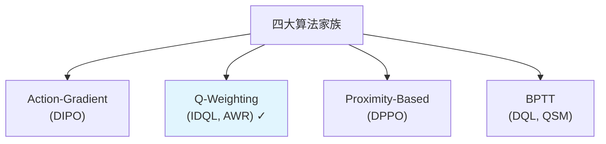
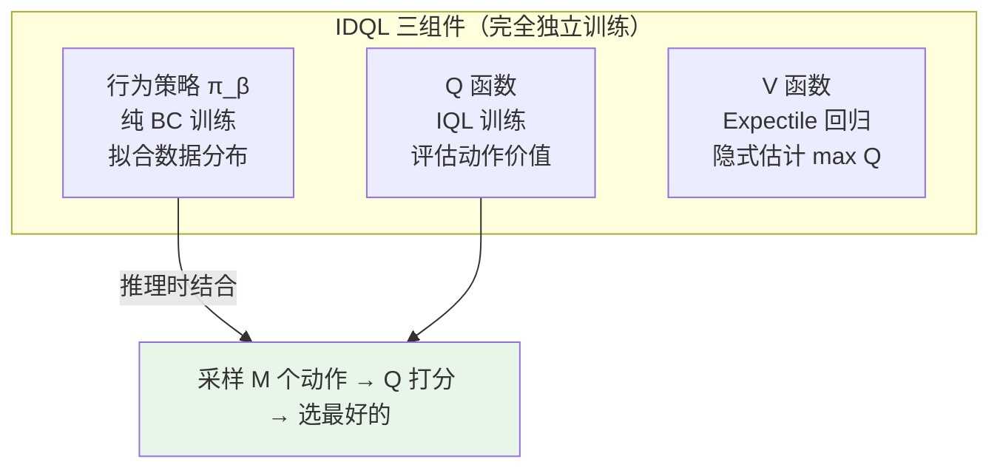
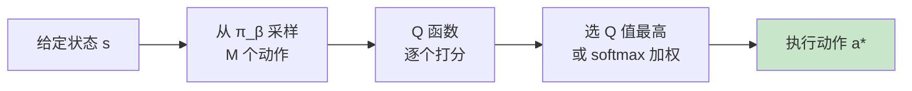

# IDQL：Implicit Diffusion Q-Learning 深度精读

> **论文标题**: Implicit Diffusion Q-Learning  
> **作者**: Philippe Hansen-Estruch, Ilya Kostrikov, Michael Janner, Jakub Grudzien Kuba, Sergey Levine  
> **机构**: UC Berkeley  
> **发表**: 2023 (arXiv:2304.10573)  
> **代码**: https://github.com/philippe-eecs/IDQL

**标签**: `#扩散策略` `#Q-Learning` `#离线RL` `#Offline-to-Online` `#隐式策略` `#加权回归` `#D4RL` `#样本效率`

**知识链接**：
- [行为克隆与 RL 微调范式](/前置知识/000d_前置知识_行为克隆与RL微调范式) — 为什么先 BC 再 RL
- [Diffusion Policy](/前置知识/000c_前置知识_Diffusion_Policy) — 扩散策略基础
- [DPPO：扩散策略策略优化](./001_DPPO_扩散策略策略优化) — 对比：on-policy 路线
- [Online DPRL 综述](./003_Online_DPRL_综述_扩散策略与在线RL) — Q-Weighting 家族的代表
- [为什么扩散策略难以 RL 微调](/前置知识/000f_前置知识_为什么扩散策略难以RL微调) — Q-Learning 路线的分析

---

## 一、定位：Off-Policy 路线的代表

### 1.1 为什么需要 Off-Policy 方法

DPPO 需要大量并行环境（1000–4096 个）来收集 on-policy 数据。但很多场景中这不现实：

- **真实机器人**：只有 1 个物理环境，每次交互昂贵
- **已有离线数据**：想直接利用之前采集的数据，不必重新交互
- **安全约束**：不能大量在线探索

这些场景都需要**样本效率高**的 off-policy 方法。

### 1.2 在综述中的定位

回忆 Online DPRL 综述的四大家族，IDQL 属于 **Q-Weighting** 家族——不直接改策略参数，而是用 $Q$ 值给动作"打分"来实现策略改进：

---

## 二、核心方法

### 2.1 核心理念：解耦策略训练和策略改进

传统 Actor-Critic 中，Actor 和 Critic 耦合训练——$Q$ 的梯度直接流入 Actor，两者互相影响。IDQL 彻底解耦二者：

**好处**：$\pi_\beta$ 的训练完全是 BC（稳定可靠）；$Q$ 训练是标准 off-policy（成熟技术）；两者互不干扰，不存在"$Q$ 梯度破坏策略"的问题。

### 2.2 扩散行为策略的训练

完全标准的 Diffusion Policy BC 训练，不做任何 RL 修改：

$$
\mathcal{L}_{\text{BC}} = \mathbb{E}_{(\mathbf{s},\mathbf{a})\sim\mathcal{D},\; k\sim U(1,K),\; \boldsymbol{\epsilon}\sim\mathcal{N}(\mathbf{0},\mathbf{I})} \left\|\boldsymbol{\epsilon}_\theta(\mathbf{a}_k, k, \mathbf{s}) - \boldsymbol{\epsilon}\right\|^2
$$

策略 $\pi_\beta$ 纯粹拟合数据分布，不做任何奖励相关优化。

### 2.3 IQL 风格的 $Q$ 函数训练

IDQL 使用 Implicit Q-Learning (IQL) 来训练 $Q$ 和 $V$。标准 Q-Learning 的 target 需要 $\max_{\mathbf{a}'} Q(\mathbf{s}', \mathbf{a}')$，在连续高维动作空间中不可行。IQL 的 trick 是引入 $V(\mathbf{s})$ 来隐式估计这个 max：

**Q 更新**（用 $V$ 替代 max）：

$$
\mathcal{L}_Q = \mathbb{E}_{(\mathbf{s},\mathbf{a},r,\mathbf{s}')\sim\mathcal{D}}\left[\left(Q(\mathbf{s},\mathbf{a}) - r - \gamma V(\mathbf{s}')\right)^2\right]
$$

**V 更新**（Expectile 回归，关键！）：

$$
\mathcal{L}_V = \mathbb{E}_{(\mathbf{s},\mathbf{a})\sim\mathcal{D}}\left[L_\tau\!\left(Q(\mathbf{s},\mathbf{a}) - V(\mathbf{s})\right)\right]
$$

其中 $L_\tau(u) = |\tau - \mathbb{1}(u < 0)| \cdot u^2$ 是 expectile loss，$\tau > 0.5$（通常 0.7–0.9）。

**为什么 expectile 能近似 max**：当 $\tau > 0.5$ 时，低估（$Q > V$）的惩罚远大于高估（$Q < V$），所以 $V$ 被推向 $Q$ 分布的上尾部 → $V(\mathbf{s}) \approx \max_{\mathbf{a}} Q(\mathbf{s}, \mathbf{a})$。$\tau$ 越接近 1，近似越紧。

### 2.4 推理时的动作选择

策略改进**完全发生在推理时**，而非训练时：

$$
\mathbf{a}^* = \arg\max_{i \in \{1,\ldots,M\}} Q(\mathbf{s}, \mathbf{a}_i), \quad \mathbf{a}_i \sim \pi_\beta(\cdot|\mathbf{s})
$$

或者用 softmax 加权采样：$w_i \propto \exp\!\left(\beta \cdot Q(\mathbf{s}, \mathbf{a}_i)\right)$。

**和其他方法的本质区别**：

| 方法 | 策略本身变了吗 | 改进机制 |
|---|---|---|
| DQL | ✓（$Q$ 梯度穿去噪链） | 改策略参数 |
| DIPO | ✓（用新目标重训练） | 推动作再拟合 |
| IDQL | **✗（策略不变！）** | 选择效应：好的被执行，差的被丢弃 |

### 2.5 Offline-to-Online 扩展

IDQL 天然支持渐进式改进：

1. **纯 offline 阶段**：用离线数据训练 $\pi_\beta$（BC）和 $Q, V$（IQL），部署时 $Q$ 打分选动作
2. **Online 微调阶段**：继续用新的在线数据更新 $Q$ 和 $V$；$\pi_\beta$ 也可以用新数据微调（仍是 BC loss），或固定不动

在线数据少量就有效（$Q$ 更新比策略梯度更 data-efficient），策略训练保持稳定。

---

## 三、优缺点分析

### 3.1 优点

- **训练极稳定**：策略训练 = 纯 BC，$Q$ 训练 = 标准 IQL，两者解耦互不影响
- **样本效率高**：off-policy，replay buffer 可重复利用数据
- **不需要 $\log\pi$**：扩散策略的概率密度不可算？没关系，只需要从中采样
- **对去噪步数不敏感**：无论 $K=5$ 还是 $K=100$，只在最终动作上做选择

### 3.2 缺点

- **策略改进有上限**：只能选择 $\pi_\beta$ 能生成的动作。如果数据中没有好动作，选不出来
- **推理时需要多次采样**：$M=64$ 次采样 × $K=20$ 步去噪 = 1280 次前向传播，远慢于 DPPO
- **$Q$ 函数在高维动作空间仍然难学**：action chunk 使动作维度达到 56–112 维
- **不利用大规模并行**：off-policy 方法不能充分利用 GPU 仿真的海量 on-policy 数据

### 3.3 和 DPPO 的直接对比

| 维度 | IDQL | DPPO |
|---|---|---|
| 更新方式 | 间接（选择） | 直接（梯度） |
| 策略改进上限 | 受 $\pi_\beta$ 支持集限制 | 理论上无上限 |
| 样本效率 | 高（off-policy） | 中（on-policy） |
| 并行利用率 | 低 | 高 |
| 推理速度 | 慢（$M$ 次采样 + 打分） | 正常（$K$ 次去噪） |
| 复杂任务性能 | 中等 | 最好 |
| 适用场景 | 数据少、不能大量并行 | GPU 仿真、大规模并行 |

---

## 四、关键实验结果

### 4.1 高维操作任务——差距拉开

当动作空间变大（7+ 维 + action chunk），IDQL 和 DPPO 的差距明显：

| 任务 | 动作维度 | IDQL | DPPO |
|---|---|---|---|
| Transport | 14×8 = 112 维 | ~40% | >90% |
| Square | 7×8 = 56 维 | ~70% | ~100% |

差距来源：采样 $M=64$ 个动作覆盖 112 维空间的概率极低；$Q$ 在高维中估计不准；"选最好的"不如"往更好的方向走"。

### 4.2 Online DPRL 综述中的评测

| 维度 | Q-Weighting (IDQL 类) |
|---|---|
| 简单任务 | 性能不错 |
| 复杂任务 | 有上限 |
| 样本效率 | 高 |
| 并行可扩展性 | 低–中 |
| 鲁棒性 | 中等 |

---

## 五、什么时候用 IDQL

### 推荐场景

- 有大量高质量离线数据想直接利用
- 只有 1–few 个真实环境，不能大量并行
- 需要渐进式 offline-to-online 改进
- 动作空间相对低维（≤14 维，无大 action chunk）
- 安全约束严格，不能大量在线探索

### 不推荐场景

- 有 GPU 仿真 + 1000+ 并行环境 → 用 DPPO
- 动作空间高维 (>50 维 action chunk) → $Q$ 学不好
- 需要超越预训练数据分布的策略 → 受限于 $\pi_\beta$ 支持集
- 推理延迟敏感 (<10ms) → 多次采样太慢

---

## 六、个人评价

IDQL 最大的贡献是展示了"不需要让 $Q$ 梯度流入策略"这条路线的可行性。在 DPPO 出现之前，它是扩散策略 + RL 最稳定的方案。DPPO 出现后在大部分场景中被超越，但在数据稀缺的 offline/few-shot 场景中，IDQL 仍有不可替代的价值。

"解耦"的设计思想影响了后续的 AWR 变体和加权回归方法——证明了在某些条件下"简单选择 > 复杂优化"。

---

## 延伸阅读

- Hansen-Estruch et al. (2023) "IDQL" ← 原文
- Kostrikov et al. (2022) "IQL: Offline RL with Implicit Q-Learning" ← $Q$ 函数训练基础
- [DPPO](./001_DPPO_扩散策略策略优化) ← On-policy 对比方案
- [Online DPRL 综述](./003_Online_DPRL_综述_扩散策略与在线RL) ← 统一评测
- [为什么扩散策略难以 RL 微调](/前置知识/000f_前置知识_为什么扩散策略难以RL微调) ← Q-Weighting 如何绕过难题
