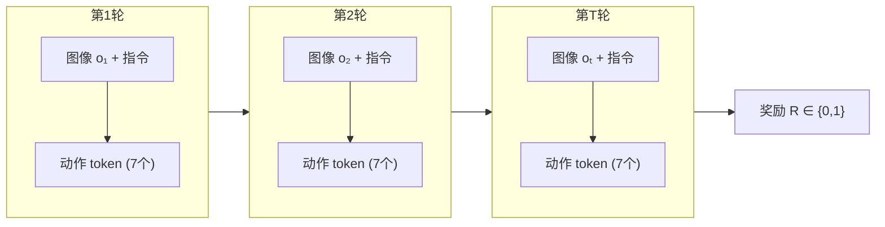

# VLA-RL：PPO 直接训练自回归 VLA 深度精读

> **论文标题**: Towards Masterful and General Robotic Manipulation with Scalable Reinforcement Learning  
> **作者**: Guanxing Lu, Wenkai Guo, Chubin Zhang, Yuheng Zhou, Haonan Jiang, Zifeng Gao, Yansong Tang, Ziwei Wang  
> **机构**: Tsinghua University, Nanyang Technological University  
> **发表**: arXiv:2505.18719, 2025  
> **代码**: https://github.com/GuanxingLu/vlarl

**标签**: `#VLA` `#强化学习` `#PPO` `#自回归策略` `#机器人操作` `#过程奖励模型` `#LIBERO`

**知识链接**：
- [策略梯度与 PPO](/前置知识/000a_前置知识_策略梯度与PPO) — PPO clip 机制
- [行为克隆与 RL 微调范式](/前置知识/000d_前置知识_行为克隆与RL微调范式) — 先 BC 再 RL 的思路
- [动作 Token 化与自回归策略](/前置知识/000l_前置知识_动作Token化与自回归策略) — 自回归 VLA 的动作表示
- [Process Reward Model](/前置知识/000n_前置知识_Process_Reward_Model) — 过程奖励模型的原理
- [KL 散度与策略约束](/前置知识/000j_前置知识_KL散度与策略约束) — 防止 RL 微调崩溃
- [VLA 模型的 RL 后训练综述](/论文综述/S06_VLA模型的RL后训练综述) — VLA + RL 的全景图

---

## 一、背景与动机

### 1.1 VLA 的现状

2025 年的机器人操作学习已经进入 Vision-Language-Action (VLA) 大模型时代。代表性的 VLA 模型如 OpenVLA（7B 参数），通过在大规模人类示教数据上做 SFT（监督微调），学会了"看图+读指令→输出动作"的能力。

但 SFT 有一个根本性天花板：**策略只能模仿训练数据中见过的行为，无法超越它**。

具体表现：
- 训练数据只覆盖有限的初始状态 → 新场景下策略崩溃
- 人类示教本身有抖动和不一致 → 模型学到了"噪声"
- 没有闭环反馈 → 小偏差会累积成大错误

### 1.2 核心问题：能否像 RLHF 一样用 PPO 训练 VLA？

LLM 的成功路径是：预训练 → SFT → RLHF (PPO)。VLA 本质上也是 LLM（OpenVLA 基于 Llama-2-7B），那能否直接套用 RLHF 的 PPO 框架？

**答案是可以，但有几个独特挑战需要解决：**

| LLM RLHF | VLA RL | 区别 |
|-----------|--------|------|
| 奖励来自人类偏好模型 | 奖励来自环境（0/1 success） | 机器人奖励极度稀疏 |
| 一次生成就有奖励 | 需要跑完整条轨迹（50+ steps）才有奖励 | 序列更长，credit assignment 更难 |
| 纯文本输入/输出 | 图像+语言输入，动作 token 输出 | 多模态，计算更贵 |
| 训练环境是文本生成（快） | 训练环境是物理仿真（慢） | 采样效率是瓶颈 |

### 1.3 VLA-RL 的核心贡献

1. **第一个系统性的自回归 VLA + PPO 训练框架**：把机器人操作轨迹建模为多模态多轮对话
2. **Robotic Process Reward Model (RPRM)**：解决稀疏奖励问题的过程奖励模型
3. **工程优化**：Curriculum 选择、GPU 负载均衡、Critic warmup 等让大模型 RL 跑得起来
4. **实验验证**：OpenVLA-7B 在 LIBERO 40 个任务上超越最强 SFT baseline 4.5%

---

## 二、方法：把机器人操作建模为多轮对话

### 2.1 核心思路

OpenVLA 的工作方式：每个时间步，输入一张图像 $o_t$ + 语言指令 $v_t^{\text{in}}$（如 "pick up the red mug"），输出 7 个 action token $v_t^{\text{out}} = (v_{t,1}, v_{t,2}, \ldots, v_{t,7})$。每个 token 是 0-255 的离散值，对应动作空间一个维度的量化 bin。

VLA-RL 的视角：**一条完整的机器人轨迹就是一段多轮对话**。

### 2.2 MDP 形式化

**状态空间**：$\mathcal{S} = \mathcal{O} \times \mathcal{V}^m$，其中 $\mathcal{O}$ 是图像空间，$\mathcal{V}^m$ 是输入文本空间。

**动作空间**：$\mathcal{V}^n$——VLA 输出的 token 序列（对于 OpenVLA，$n=7$）。

**策略**：$\pi_\theta: \mathcal{O} \times \mathcal{V}^m \to \mathcal{V}^n$

**转移**：环境物理模拟器决定下一个观测

**奖励**：环境返回的稀疏 binary reward $r_t \in \{0, 1\}$（只在最终成功时为 1）

### 2.3 策略的 log-probability 计算

自回归 VLA 的每一步输出是一个分类问题（256 个 bin 选一个），所以 log-probability 可以精确计算：

$$
\log \pi_\theta(\mathbf{a}_t | o_t, v_t^{\text{in}}) = \sum_{i=1}^{7} \log \pi_\theta(v_{t,i}^{\text{out}} | o_t, v_t^{\text{in}})
$$

**逐项拆解**：
- $v_{t,i}^{\text{out}}$：第 $t$ 步第 $i$ 维动作的离散 token（0-255 中的一个）
- $\pi_\theta(v_{t,i}^{\text{out}} | o_t, v_t^{\text{in}})$：softmax 分类器输出的概率
- 求和是因为 7 个维度独立预测（条件独立假设）

**一句话**：自回归 VLA 的 log-prob 就是 7 个分类 head 的 log-softmax 之和——和 LLM 生成文本完全一样。

**对比扩散策略**：扩散策略需要对整个去噪链积分才能算 log-prob（[为什么扩散策略难以 RL 微调](/前置知识/000f_前置知识_为什么扩散策略难以RL微调)），而自回归 VLA 天然具有精确的 log-prob！

### 2.4 PPO 更新

有了 log-prob，PPO 的 clip 目标函数直接可用：

$$
\mathcal{L}_{\text{PPO}}(\theta) = \mathbb{E}_t\left[\min\left(\frac{\pi_\theta(\mathbf{a}_t | o_t, v_t^{\text{in}})}{\pi_{\theta_{\text{old}}}(\mathbf{a}_t | o_t, v_t^{\text{in}})} \hat{A}_t, \; \text{clip}(\cdot, 1-\epsilon, 1+\epsilon) \hat{A}_t\right)\right]
$$

Advantage $\hat{A}_t$ 通过 GAE 计算：

$$
\hat{A}_t = \sum_{l=0}^{T-t}(\gamma\lambda)^l \delta_{t+l}, \quad \delta_t = r_t + \gamma V(s_{t+1}) - V(s_t)
$$

其中 $V(s_t)$ 是 Critic 网络的输出。

---

## 三、解决稀疏奖励：Robotic Process Reward Model

### 3.1 为什么需要 RPRM

在 LIBERO 中，一条轨迹可能有 30-50 步（210-350 个 action token），但环境只在最后给一个 0/1 奖励。这意味着：

- GAE 需要从最后一步反传 value 到第一步——中间经过 50 步的 $\gamma$ 折扣，信号衰减到几乎为零
- Critic 对中间状态的 value 估计非常不准确（没有中间监督信号）
- 策略梯度方差巨大——一次成功被归因到 350 个 token，每个 token 的贡献稀释到微不足道

### 3.2 RPRM 的设计

VLA-RL 把奖励建模重新表述为 **next-token prediction** 问题（详见 [Process Reward Model](/前置知识/000n_前置知识_Process_Reward_Model)）。

**训练数据准备**（自动化，无需人工标注）：

1. 收集成功的专家轨迹
2. **里程碑分割**（Milestone Segmentation）：
   - 检测夹爪开合状态变化的时刻（标志着"抓住/放下"动作完成）
   - 这些时刻被认为是子任务的边界
3. **进度标注**（Progress Labeling）：
   - 在每个子任务内，找到末端执行器速度接近零的时刻（"稳定状态"）
   - 对这些关键帧对应的动作 token 标注正奖励

**训练目标**：

$$
\mathcal{L}_{\text{RPRM}}(\phi) = -\mathbb{E}_t\left[\sum_{j=1}^{|a_t|} \log p_\phi(v_{t,j}^{\text{rprm}} | v_{t,<j}^{\text{out}}, o_t, v_t^{\text{in}})\right]
$$

**一句话**：RPRM 是一个微调过的 VLM，它学会了"成功动作在每个阶段应该长什么样"，给新动作打分就是看它有多"像"成功动作的对应阶段。

### 3.3 最终奖励组合

$$
r_t = r_t^{\text{sparse}} + r_t^{\text{RPRM}}
$$

- $r_t^{\text{sparse}}$：环境给的 0/1 reward（只在最后一步非零）
- $r_t^{\text{RPRM}}$：RPRM 对每步动作的进度评分

**效果**：消融实验显示，加入 RPRM 后成功率从 85.8% 提升到 90.2%（+4.4%）。

---

## 四、工程优化：让 7B 模型跑 RL

### 4.1 Shared Actor-Critic Backbone

训练 7B 的 PPO 需要 Actor + Critic 共 14B+ 参数。VLA-RL 的解决方案：

- Actor 和 Critic **共享** VLA 的 transformer backbone
- 只在最后一层分叉：Actor 输出 action token logits，Critic 输出 scalar value
- 节省约 45% 显存

### 4.2 Critic Warmup

**问题**：如果 Critic 从随机初始化开始和 Actor 一起训练，早期的 value 估计完全不靠谱，导致 advantage 估计有害无益，策略可能崩溃。

**解决方案**：
1. 先用预训练的 SFT 策略收集一批轨迹
2. 只训练 Critic 若干 epoch（不更新 Actor）
3. 等 Critic 有了合理的 value 估计后，再开始联合训练

**消融实验**：不做 Critic warmup 的成功率只有 80.0%，做了之后 90.2%（+10.2%！）。

### 4.3 Curriculum Selection Strategy

不同任务难度差异巨大。直接均匀采样所有任务会导致：
- 简单任务浪费计算（已经 100% 成功）
- 困难任务得不到足够训练

**自适应课程学习**：

$$
P(\text{task}_j) \propto \exp\left(\frac{0.5 - s_j}{\tau}\right)
$$

其中 $s_j$ 是任务 $j$ 的当前成功率，$\tau$ 控制探索温度。

**直觉**：优先训练成功率接近 50% 的任务（"正好在学习边界上"的任务），不浪费时间在已掌握或完全无法完成的任务上。

### 4.4 GPU-balanced Vectorized Environments

- 多个 GPU 并行运行向量化环境
- 每个 GPU 负责一部分环境的渲染和交互
- 用 `all_reduce` 操作同步环境状态
- 推理用 vLLM 加速（单独一个 GPU 做推理引擎）

### 4.5 基础设施总结

| 组件 | 配置 |
|------|------|
| 模型 | OpenVLA-7B (Llama-2-7B + SigLIP + DinoV2) |
| 微调方式 | LoRA |
| 精度 | bfloat16 |
| 推理加速 | vLLM |
| 分布式 | PyTorch FSDP + Ray |
| 环境 | LIBERO（GPU 渲染） |
| 总 GPU 时长 | 48 小时（达到 SOTA） |

---

## 五、实验结果

### 5.1 主实验：LIBERO Benchmark

LIBERO 有 4 个任务套件：Spatial（空间关系）、Object（物体类别）、Goal（目标导向）、Long（长序列）。

| 方法 | Spatial | Object | Goal | Long | **平均** |
|------|---------|--------|------|------|--------|
| Diffusion Policy | 78.3% | 92.5% | 68.3% | 50.5% | 72.4% |
| Octo (SFT) | 78.9% | 85.7% | 84.6% | 51.1% | 75.1% |
| OpenVLA (SFT) | 84.7% | 88.4% | 79.2% | 53.7% | 76.5% |
| GRAPE (DPO) | 87.6% | 91.2% | 82.2% | 55.8% | 79.2% |
| π₀-FAST | 96.4% | 96.8% | 88.6% | 60.2% | 85.5% |
| **VLA-RL (PPO)** | **90.2%** | **91.8%** | **82.2%** | **59.8%** | **81.0%** |

**关键发现**：
- VLA-RL 超越 SFT baseline 4.5%，超越 DPO 1.8%
- 在最难的 LIBERO-Long（需要长序列操作）上提升最大（+6.1%）
- **48 小时 GPU 训练就匹配了商业模型 π₀-FAST 的水平**

### 5.2 Test-time Scaling

论文观察到一个类似 LLM 推理缩放的现象：随着 RL 训练步数增加，测试成功率**持续稳定上升**，没有明显的饱和趋势。

这意味着 VLA-RL 可能具有类似 LLM 的 inference scaling law——只要给更多计算（更多训练步），性能就能继续提升。

### 5.3 RL vs SFT 的动作覆盖分析

论文可视化了 SFT 和 RL 策略采集的动作分布：

- **SFT 动作**：聚集在动作空间的中心附近，模式单一（人类示教的典型模式）
- **RL 动作**：均匀分布在更广的动作空间中，覆盖更多可能性

**结论**：RL 训练让策略探索到了人类示教中未覆盖的动作空间区域，这些新探索到的动作组合带来了更高的成功率和更强的鲁棒性。

### 5.4 消融实验

| 配置 | LIBERO-Spatial 成功率 |
|------|---------------------|
| **完整 VLA-RL** | **90.2%** |
| 去掉 RPRM | 85.8%（-4.4%） |
| 去掉 Curriculum | 88.0%（-2.2%） |
| 采样温度从 1.5 降到 1.0 | 85.8%（-4.4%） |
| 去掉 Critic Warmup | 80.0%（-10.2%） |
| 学习率从 2e-5 升到 2e-4 | 0.2%（崩溃！） |

**关键观察**：
- Critic warmup 是最重要的组件——没有它，训练直接崩溃
- RPRM 和采样温度同等重要——都影响探索能力
- 学习率敏感——大模型 RL 需要非常小的学习率

---

## 六、训练动态分析

### 6.1 Episode 长度变化

训练过程中，成功 episode 的平均长度**逐渐减少**。

**含义**：模型学到了更高效的动作序列——用更少的步数完成同样的任务。这和 LLM RLHF 中"回答变长"的趋势相反，是因为机器人操作有明确的效率目标。

### 6.2 策略熵变化

策略的动作熵从高开始，训练过程中逐渐降低。

**含义**：初期高熵 → 充分探索；后期低熵 → 收敛到确定性的最优策略。这和好的 RL 训练曲线一致——先探索后利用。

### 6.3 时间分析

| 组件 | 耗时占比 |
|------|---------|
| 环境渲染+交互 | 15%（已被 GPU 并行大幅压缩） |
| 模型 Rollout 推理 | 25%（vLLM 加速） |
| PPO 训练更新 | **60%**（主要瓶颈） |

**结论**：进一步加速的关键在于优化训练阶段的效率（如更好的 LoRA、更快的梯度计算）。

---

## 七、为什么 PPO 适合自回归 VLA

### 7.1 和扩散策略的对比

| 维度 | 扩散策略 + RL（如 DPPO） | 自回归 VLA + RL（VLA-RL） |
|------|------------------------|--------------------------|
| log-prob | 需要展开去噪链 MDP | 直接 softmax 计算 |
| 动作表示 | 连续空间 | 离散 token（256 bins） |
| PPO 适配 | 需要特殊设计（去噪步 clip） | 直接套用标准 PPO |
| 推理速度 | 需要 K 步去噪 | 自回归生成（7 个 token） |
| 模型大小 | 通常 < 100M | 7B+（大模型） |
| 预训练知识 | 较少（专用网络） | 丰富（继承 LLM + 视觉知识） |

### 7.2 自回归 VLA 做 RL 的天然优势

1. **精确 log-prob**：每个 action token 的概率是 softmax 分类输出，精确可计算
2. **成熟的 LLM RL 基础设施**：可以直接复用 OpenRLHF、veRL 等框架
3. **丰富的预训练表征**：7B 参数的 LLM backbone 提供了强大的状态理解能力
4. **Language grounding**：VLA 天然理解语言指令，RL 微调可以针对具体指令优化

### 7.3 自回归 VLA 做 RL 的挑战

1. **计算成本**：7B 模型的推理和训练都很慢
2. **动作量化误差**：256 bin 的分辨率限制了动作精度（约 0.8% 的量化误差）
3. **灾难性遗忘**：RL 微调可能破坏预训练学到的泛化能力
4. **多模态输入**：图像编码器的计算开销在每步都要承受

---

## 八、局限性与展望

### 8.1 当前局限

1. **只在仿真中验证**：没有真实机器人实验
2. **依赖环境奖励**：仍需要仿真器提供 success 判定
3. **单一 VLA 架构**：只验证了 OpenVLA，未验证 π₀ 等 Flow-based VLA
4. **训练成本**：48 GPU 小时对学术实验室仍然不低

### 8.2 论文提出的未来方向

1. 扩展到 Flow-based VLA（如 π₀）
2. 结合真实世界在线 RL
3. 探索更大规模的 VLA + 更长时间的 RL 训练是否有持续的 scaling

---

## 九、和其他工作的关系

| 工作 | 和 VLA-RL 的关系 |
|------|----------------|
| RIPT-VLA | 类似框架但用 GRPO（无 Critic），VLA-RL 证明 PPO > GRPO |
| SimpleVLA-RL | 基于 veRL 的工程优化，发现 "pushcut" 现象 |
| SRPO | 用 progress reward 替代 RPRM，不需要训 reward model |
| DPPO | 扩散策略的 PPO 微调，VLA-RL 是自回归策略的 PPO 微调 |
| iRe-VLA | 迭代 RL+SFT 交替，VLA-RL 是纯 RL 路线 |

---

## 十、个人评价

### 10.1 贡献

VLA-RL 的最大价值是**证明了 PPO 可以直接规模化地训练 7B VLA**。这在之前并不明显——大家不确定大模型 RL 的不稳定性是否会在机器人场景中更严重。

### 10.2 技术洞察

最深刻的 insight 是"把机器人操作轨迹视为多轮对话"——这个视角让整个 LLM RL 的工具链（vLLM、FSDP、LoRA、GAE）都能直接复用。

### 10.3 不足

- RPRM 的里程碑分割依赖启发式（检测夹爪变化），可能不适用于更精细的操作
- 只有仿真实验，缺乏 real-world 验证

---

## 延伸阅读

- [RIPT-VLA 精读](./007_RIPT_VLA_无Critic的VLA后训练) ← 对比 VLA-RL 的无 Critic 路线
- [DPPO 精读](./001_DPPO_扩散策略策略优化) ← 扩散策略的 PPO 微调
- [VLA 模型的 RL 后训练综述](/论文综述/S06_VLA模型的RL后训练综述) ← 完整方法对比
- [Process Reward Model 前置知识](/前置知识/000n_前置知识_Process_Reward_Model) ← RPRM 的详细原理
