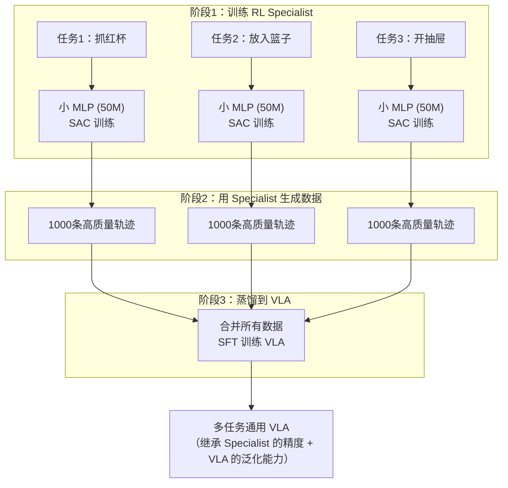

# RLDG：Robotic Generalist Policy Distillation via Reinforcement Learning 深度精读

> **论文标题**: RLDG: Robotic Generalist Policy Distillation via Reinforcement Learning  
> **作者**: Charles Xu, Qiyang Li, Jianlan Luo, Sergey Levine  
> **机构**: UC Berkeley  
> **发表**: RSS 2025 (arXiv:2412.09858)  
> **代码**: https://generalist-distillation.github.io/

**标签**: `#VLA` `#强化学习` `#蒸馏` `#SAC` `#多任务` `#Sim2Real` `#数据生成`

**知识链接**：
- [SAC (Soft Actor-Critic)](/前置知识/000k_前置知识_SAC_Soft_Actor_Critic) — RL specialist 的训练算法
- [行为克隆与 RL 微调范式](/前置知识/000d_前置知识_行为克隆与RL微调范式) — 先 BC 再 RL 的思路
- [动作 Token 化与自回归策略](/前置知识/000l_前置知识_动作Token化与自回归策略) — VLA 的动作表示
- [VLA 模型的 RL 后训练综述](/论文综述/S06_VLA模型的RL后训练综述) — 间接 RL 路线的定位

---

## 一、背景与动机

### 1.1 VLA 直接做 RL 的困难

直接用 RL 训练 7B VLA 面临的实际困难：

| 挑战 | 具体问题 |
|------|---------|
| 计算成本 | 7B 模型每次推理 ~100ms，50 步轨迹 = 5s/episode，收集数据极慢 |
| 训练不稳定 | 大模型 + 稀疏奖励 → 需要非常精细的超参数调节 |
| 灾难性遗忘 | RL 微调可能破坏预训练学到的跨任务泛化能力 |
| 仿真 gap | 在仿真里训好的 VLA 可能不能迁移到真实世界 |

### 1.2 RLDG 的核心思路：分而治之

RLDG 的哲学是：**不要用重型武器打蚊子**。

- RL specialist 小（~50M 参数）→ 训练快、采样快、收敛快
- VLA 大（7B 参数）→ 泛化强、多任务、理解语言
- 为什么不结合两者的优势？

### 1.3 和人类示教数据的对比

| 维度 | 人类示教 | RL specialist |
|------|---------|---------------|
| 数据质量 | 中（手抖、不一致、偶尔失误） | **高**（优化后的最优策略） |
| 数量 | 有限（每小时 ~100 条） | **无限**（仿真自动执行） |
| 多样性 | 低（人类倾向重复相似路径） | **高**（RL 探索到多种路径） |
| 成本 | 高（需要人工、设备） | **低**（仿真免费） |
| 错误纠正 | 有（人类偶尔纠正自己） | **强**（RL 学到了纠正行为） |

**核心论点**：用 RL specialist 生成的数据训练 VLA，比用人类示教数据训练效果更好。

---

## 二、方法详解

### 2.1 Phase 1：训练 RL Specialist

**每个任务独立训练一个小型 RL 智能体。**

**Specialist 架构**：
- 网络：2-3 层 MLP，隐藏维度 256
- 参数量：~0.5M（对比 VLA 的 7B，小了 14000 倍）
- 输入：低维状态向量（关节角度 + 物体位姿），不是图像
- 输出：连续动作向量（7 维末端执行器控制）

**训练算法**：[SAC (Soft Actor-Critic)](/前置知识/000k_前置知识_SAC_Soft_Actor_Critic)

$$
J(\pi) = \mathbb{E}_{(s_t, a_t) \sim \rho_\pi}\left[\sum_{t=0}^T \gamma^t \Big(r(s_t, a_t) + \alpha \mathcal{H}(\pi(\cdot|s_t))\Big)\right]
$$

**为什么用 SAC 而不是 PPO？**
- Specialist 很小，off-policy 更 sample-efficient
- SAC 的 entropy bonus 鼓励探索，生成的轨迹更多样
- 对 dense reward 的利用效率更高

**训练量**：
- 每个任务：~100K-500K 环境步（仿真中 ~30 分钟到 2 小时）
- 使用 dense reward（物体到目标的距离等）
- 训练到成功率 >95% 后停止

### 2.2 Phase 2：数据生成

用训练好的 specialist 在仿真中自动执行任务，收集轨迹：

**收集内容**：
- 图像观测 $o_t$（第三人称相机渲染）
- 对应的动作 $a_t$（specialist 输出的连续动作）
- 语言指令 $g$（人工标注每个任务的描述）

**关键细节**：
- Specialist 用的是**低维状态**输入，但数据收集时**同时保存图像**
- 这样生成的图像-动作对可以直接用来训练图像输入的 VLA
- 每个任务收集 ~1000 条成功轨迹

**域随机化**：收集时加入初始位姿随机化、光照变化等，增加数据多样性。

### 2.3 Phase 3：蒸馏到 VLA

把所有任务的数据合并，对 VLA 做标准 SFT：

$$
\mathcal{L}_{\text{distill}}(\theta) = \mathbb{E}_{(o_t, a_t, g) \sim \mathcal{D}_{\text{RL}}}\left[-\log \pi_\theta(a_t | o_t, g)\right]
$$

**这和普通 SFT 完全一样**——区别只在于数据来源：
- 普通 SFT：数据来自人类遥操作
- RLDG：数据来自 RL specialist

VLA 不知道数据是人类还是机器人生成的，它只是"模仿"这些轨迹。但因为 specialist 的轨迹质量更高、更多样，VLA 学到的策略也更好。

---

## 三、为什么蒸馏后的 VLA 比 Specialist 还好（在某些维度）

### 3.1 Specialist 的局限

每个 specialist 是**单任务**的小 MLP：
- 只能做它被训练的那个任务
- 没有跨任务泛化能力
- 输入是低维状态（需要完美的物体检测），不能直接部署到真实世界

### 3.2 VLA 的跨任务迁移

当多个 specialist 的数据被合并训练 VLA 时，VLA 学到了：
- **共享的运动原语**：不同任务中"伸手抓取"的模式是类似的
- **语言-动作的对应关系**："pick up"对应某类运动，"put down"对应另一类
- **视觉-物体理解**：从图像中理解物体的位置和朝向

这些跨任务的共享知识让 VLA 在**新任务**（specialist 没训练过的任务）上也有一定的零样本泛化能力。

### 3.3 具体数字

在真实机器人上的对比：

| 方法 | 训练数据 | 多任务成功率 | 新任务泛化 |
|------|---------|------------|-----------|
| OpenVLA (人类 SFT) | 50 条/任务人类示教 | 55% | 20% |
| Octo (人类 SFT) | 50 条/任务人类示教 | 48% | 15% |
| **RLDG (RL 蒸馏)** | **1000 条/任务 RL 数据** | **75%** | **35%** |

RL 数据的优势：
- 比人类示教提升 **20-40%** 成功率
- 数量多（1000 vs 50）+ 质量高（优化策略 vs 人类手动）= 双重优势

---

## 四、贯穿全文的例子

### 4.1 场景设置

考虑一个桌面操作场景，有 3 个任务：
1. "Pick up the red mug"（抓红杯）
2. "Put the mug on the plate"（放到盘子上）
3. "Open the drawer"（开抽屉）

### 4.2 Phase 1 详解

**任务 1 的 Specialist 训练**：
- 输入：机械臂 7 个关节角 + 红杯的 6D 位姿 = 13 维
- 输出：末端执行器增量 + 夹爪 = 7 维
- Reward：$r = -\|p_{\text{gripper}} - p_{\text{mug}}\| + 10 \cdot \mathbb{1}[\text{grasp success}]$
- 训练 200K 步后，成功率达到 98%

**关键**：Specialist 用的是 **ground-truth 物体位姿**（从仿真器直接读取），不需要视觉感知。这让训练极其简单快速。

### 4.3 Phase 2 详解

用训好的 Specialist 执行任务 1：
- 仿真环境渲染第三人称 RGB 图像（$256 \times 256$）
- 同时记录 Specialist 输出的动作
- 随机化红杯初始位置（±5cm）、桌面纹理、光照方向
- 收集 1000 条成功轨迹，每条 30 步

得到数据集：$\{(o_t^{(i)}, a_t^{(i)}, g_1)\}_{i=1}^{1000}$

类似地对任务 2 和 3 各收集 1000 条。

### 4.4 Phase 3 详解

合并 3000 条轨迹（3 个任务 × 1000 条），对 OpenVLA 做 SFT：
- 输入：图像 $o_t$ + 语言指令 $g$
- 输出目标：action token（连续动作量化后的离散表示）
- 训练 ~10 epochs，直到 loss 收敛

训好的 VLA：
- 看到红杯 + "pick up the red mug" → 执行抓取
- 看到杯在手 + "put the mug on the plate" → 执行放置
- 看到抽屉 + "open the drawer" → 执行拉开

---

## 五、RLDG 的优势分析

### 5.1 为什么 RL 数据比人类数据好

**精度更高**：
- 人类遥操作有手部抖动（±3mm 随机噪声）
- RL specialist 的动作是优化后的最优解（零抖动）
- VLA 模仿更精确的动作 → 自身也更精确

**纠错行为更丰富**：
- 人类示教通常是"一次性成功"（人类倾向于只展示最好的执行）
- RL specialist 在训练过程中学到了各种纠错策略（接近失败时如何恢复）
- 这些纠错经验被蒸馏到了 VLA 中

**多样性更高**：
- 人类示教的路径高度重复（总是用类似的方式）
- RL + domain randomization 产生了多种成功路径
- VLA 从多样数据中学到了更鲁棒的策略

### 5.2 对比直接用 RL 训 VLA

| 维度 | 直接 RL 训 VLA | RLDG |
|------|--------------|------|
| 训练成本 | 高（7B 模型跑 RL） | 低（0.5M specialist + 标准 SFT） |
| 训练稳定性 | 低（大模型 RL 容易崩） | 高（小模型 RL 稳定 + SFT 稳定） |
| 遗忘风险 | 高（RL 可能破坏预训练知识） | 低（SFT 比 RL 温和得多） |
| 最终性能 | 可能更高（直接优化目标） | 稍低（蒸馏有信息损失） |
| 泛化能力 | 可能更差（RL 过拟合到训练任务） | 更好（多任务数据保持泛化） |

### 5.3 Sim-to-Real 优势

RLDG 的一个重要优势是 sim-to-real 的解耦：

1. RL specialist 在仿真中训练——完全不需要真实数据
2. 仿真中的域随机化让数据自然具有多样性
3. VLA 通过大量多样的仿真数据学到了对视觉扰动的鲁棒性
4. 部署到真实世界时，VLA 的视觉泛化能力弥补了 sim-real gap

---

## 六、局限性与讨论

### 6.1 需要可仿真的环境

RLDG 的整个 pipeline 依赖仿真：
- Specialist 训练需要仿真环境
- 数据生成需要仿真环境渲染图像
- 如果任务无法仿真（如操作柔性物体、流体等），RLDG 不适用

### 6.2 每个任务需要单独训 Specialist

- 10 个任务 = 10 个独立的 RL 训练过程
- 需要为每个任务设计 reward function
- Specialist 之间不共享知识

### 6.3 蒸馏的信息损失

VLA 通过 SFT 模仿 specialist 的行为，但：
- SFT 的模仿不可能完美（有泛化误差）
- VLA 的动作量化会引入精度损失
- Specialist 的某些"条件反射"式纠错可能 SFT 学不到

### 6.4 和 Self-Improving VLA 的互补性

RLDG 可以和 Residual RL、iRe-VLA 等方法组合：
1. 先用 RLDG 训一个好的 VLA baseline
2. 再用 Residual RL 或在线 RL 进一步微调
3. 两者互补：RLDG 提供好的起点，在线 RL 提供闭环改进

---

## 七、个人评价

### 7.1 方法论贡献

RLDG 的最大贡献是提出了 "RL 做数据引擎" 的范式。它绕开了直接训大模型 RL 的所有困难，用最简单的方式获得了最好的数据质量。

### 7.2 实践价值

对于有仿真环境的团队，RLDG 是目前最 cost-effective 的 VLA 训练方案：
- 不需要大量人类示教
- 不需要复杂的大模型 RL 基础设施
- 训练过程全自动化

### 7.3 哲学启示

RLDG 暗示了一个更大的趋势：**未来的机器人学习可能是"小模型做优化，大模型做泛化"的分工合作**，而不是"一个大模型搞定一切"。

---

## 延伸阅读

- [VLA 模型的 RL 后训练综述](/论文综述/S06_VLA模型的RL后训练综述) ← RLDG 在综述中的定位
- [SAC 前置知识](/前置知识/000k_前置知识_SAC_Soft_Actor_Critic) ← Specialist 使用的训练算法
- [行为克隆与 RL 微调范式](/前置知识/000d_前置知识_行为克隆与RL微调范式) ← 蒸馏本质上是 BC
- [VLA-RL 精读](./006_VLA_RL_PPO直接训练自回归VLA) ← 对比：直接 RL 路线
