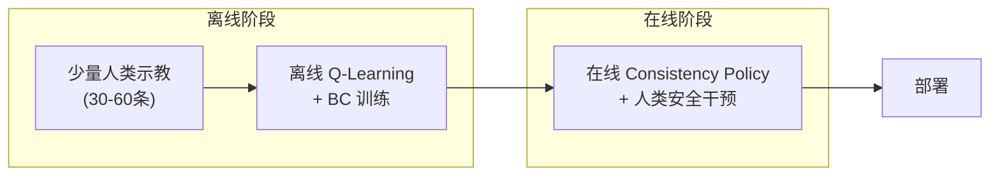
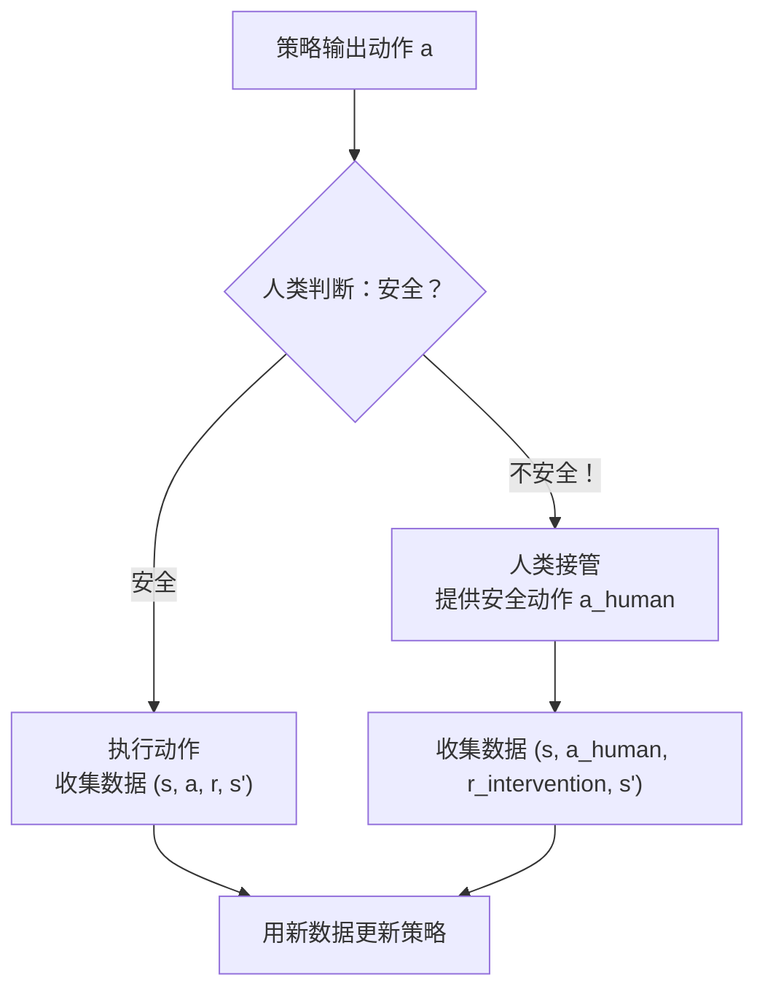

# ConRFT：一致性策略 RL 微调 VLA 深度精读

> **论文标题**: ConRFT: A Reinforced Fine-tuning Method for VLA Models via Consistency Policy  
> **作者**: Yuhui Chen, Shuai Tian, Shugao Liu, Yingting Zhou, Haoran Li, Dongbin Zhao  
> **机构**: Chinese Academy of Sciences, University of Chinese Academy of Sciences  
> **发表**: arXiv:2502.05450, 2025  
> **代码**: https://github.com/cccedric/conrft

**标签**: `#VLA` `#强化学习` `#一致性模型` `#Q学习` `#真实机器人` `#人类干预` `#样本效率`

**知识链接**：
- [Consistency Model 与一步生成](/前置知识/000h_前置知识_Consistency_Model与一步生成) — 一致性模型的原理
- [SAC (Soft Actor-Critic)](/前置知识/000k_前置知识_SAC_Soft_Actor_Critic) — 在线 RL 的训练算法
- [行为克隆与 RL 微调范式](/前置知识/000d_前置知识_行为克隆与RL微调范式) — 离线→在线的范式
- [动作 Token 化与自回归策略](/前置知识/000l_前置知识_动作Token化与自回归策略) — VLA 动作表示基础
- [VLA 模型的 RL 后训练综述](/论文综述/S06_VLA模型的RL后训练综述) — ConRFT 在综述中的定位

---

## 一、背景与动机

### 1.1 真实机器人 RL 的核心矛盾

之前的 VLA + RL 工作（VLA-RL、RIPT-VLA 等）都在**仿真**中训练。但真实世界的 RL 有独特的挑战：

| 挑战 | 仿真 RL | 真实世界 RL |
|------|---------|-----------|
| 采样成本 | 低（并行环境，几秒一条轨迹） | **极高**（物理执行，分钟级一条轨迹） |
| 安全性 | 无所谓（重置即可） | **必须保证**（碰撞可能损坏机器人/环境） |
| Reset | 自动（环境 API） | **困难**（需要人工/机械复位） |
| 奖励 | 仿真器精确判定 | 需要额外感知系统判定成功 |

### 1.2 现有方法的问题

1. **PPO/GRPO 类**（VLA-RL、RIPT-VLA）：需要大量 rollout 数据（通常 10K+ episodes），真实世界不现实
2. **纯离线 RL**（DPO、IQL）：不做在线交互，改进有限
3. **直接 fine-tune VLA**：在真实世界中 RL 更新 7B 模型太慢

### 1.3 ConRFT 的思路：离线+在线两阶段

ConRFT 结合了离线和在线 RL 的优势：

**核心创新**：用 **Consistency Policy**（一致性策略）作为 VLA 的动作头，既能做离线 BC 又能做在线 RL，用统一的训练目标贯穿两个阶段。

---

## 二、方法详解

### 2.1 Consistency Policy 是什么

Consistency Policy 是把 [Consistency Model](/前置知识/000h_前置知识_Consistency_Model与一步生成) 用作策略的方案。

**回顾 Consistency Model**：它学习一个映射 $f_\theta$，使得噪声轨道上任何一点都映射到同一个干净样本：

$$
f_\theta(\mathbf{x}_t, t) = \mathbf{x}_0, \quad \forall t \in [0, T]
$$

**作为策略使用**：
- 输入：当前状态 $s$ + 随机噪声 $\epsilon \sim \mathcal{N}(0, I)$
- 输出：动作 $a = f_\theta(\epsilon, t, s)$

**关键优势**：只需**一步**就能从噪声生成动作（Diffusion Policy 需要 K 步去噪），推理速度极快。

### 2.2 为什么选 Consistency Policy 做 VLA 的动作头

| 动作头类型 | 推理速度 | 表达能力 | RL 兼容性 |
|-----------|---------|---------|----------|
| Gaussian MLP | 最快（单次前传） | 低（单模态） | 好（有 log-prob） |
| Diffusion Policy | 慢（K 步去噪） | 高（多模态） | 难（无显式 log-prob） |
| **Consistency Policy** | **快（单步）** | **高（多模态）** | **好（可蒸馏 Q 梯度）** |
| 自回归 Token | 中（7 次前传） | 中（离散） | 好（softmax log-prob） |

Consistency Policy 兼具了 Diffusion Policy 的表达能力和 MLP 的推理速度，同时还能通过特殊的训练目标支持 Q-learning 风格的 RL 更新。

### 2.3 离线阶段：BC + Q-Learning

**Step 1：行为克隆 (BC) 训练**

用人类示教数据 $\mathcal{D} = \{(s_t, a_t)\}$ 训练 Consistency Policy：

$$
\mathcal{L}_{\text{BC}}(\theta) = \mathbb{E}_{(s, a) \sim \mathcal{D}, t \sim [0,T], \epsilon \sim \mathcal{N}}\left[\|f_\theta(a + \sigma_t \epsilon, t, s) - a\|^2\right]
$$

**一句话**：给正确动作加噪声，让 Consistency Policy 学会从任何噪声水平恢复出正确动作。

**Step 2：离线 Q-Learning**

同时训练一个 Q 函数 $Q_\phi(s, a)$：

$$
\mathcal{L}_Q(\phi) = \mathbb{E}_{(s,a,r,s') \sim \mathcal{D}}\left[\left(Q_\phi(s, a) - (r + \gamma \max_{a'} Q_{\bar{\phi}}(s', a'))\right)^2\right]
$$

**为什么离线阶段就训 Q？** 因为后续在线阶段要用 Q 的梯度来指导策略改进——Q 需要一个好的初始化。

**Step 3：Q-guided Policy Update**

用 Q 函数的梯度"推"策略往高 Q 值的方向走：

$$
\mathcal{L}_{\text{Q-guide}}(\theta) = -\mathbb{E}_{s \sim \mathcal{D}, \epsilon \sim \mathcal{N}}\left[Q_\phi(s, f_\theta(\epsilon, t, s))\right]
$$

**一句话**：让策略生成的动作使 Q 值最大化。

**离线阶段的总 loss**：

$$
\mathcal{L}_{\text{offline}} = \mathcal{L}_{\text{BC}} + \alpha \mathcal{L}_{\text{Q-guide}}
$$

$\alpha$ 从 0 逐渐增大到 1——先确保策略能模仿示教，再逐渐让 Q 引导改进。

### 2.4 在线阶段：Human-in-the-Loop RL

离线训完后，策略可以在真实机器人上部署。在线阶段的关键创新是**人类干预机制**：

**人类干预 (Human Intervention) 的设计**：
1. 人类操作员通过遥操作接口**实时监控**策略执行
2. 当策略即将做出危险动作时，人类**按下覆盖按钮**接管控制
3. 人类操作员提供正确动作，机器人执行人类的动作
4. 这个干预事件被记录为**高奖励数据**（人类动作通常是安全且有效的）

**为什么人类干预能加速学习？**
- 干预事件天然是"重要状态"（策略即将犯错的状态）的正确示范
- 这些状态恰好是策略最需要改进的地方
- 相当于"有针对性的示教"——只在策略薄弱的地方给补充数据

**在线阶段的训练**：

$$
\mathcal{L}_{\text{online}} = \mathcal{L}_{\text{consistency}} + \beta \mathcal{L}_{\text{Q-online}}
$$

- 用新收集的数据（策略自主执行 + 人类干预）更新 Q 函数和策略
- Consistency 训练目标保证策略的动作生成质量
- Q 函数梯度引导策略改进

### 2.5 和标准 RL 的区别

| 维度 | 标准在线 RL（如 PPO） | ConRFT |
|------|---------------------|--------|
| 探索策略 | 策略加噪声 | 策略 + 人类安全网 |
| 失败代价 | 无（仿真重置） | 低（人类及时干预） |
| 数据效率 | 低（需要大量 rollout） | **高**（每次干预都是高信息量数据） |
| 安全保证 | 无 | **有**（人类实时监控） |
| 扩展性 | 好（自动化） | 需要人工时间 |

---

## 三、实验结果

### 3.1 真实机器人验证

ConRFT 在 **8 个真实世界操作任务**上验证：

| 任务 | BC only | ConRFT (离线) | ConRFT (在线) |
|------|---------|-------------|-------------|
| 抓取方块 | 60% | 75% | **90%** |
| 叠放物体 | 45% | 60% | **80%** |
| 插入钉子 | 30% | 50% | **75%** |
| 拧螺丝 | 25% | 40% | **65%** |
| 推滑物体 | 55% | 70% | **85%** |
| 开瓶盖 | 35% | 55% | **70%** |
| 翻转物体 | 40% | 55% | **75%** |
| 精密装配 | 20% | 35% | **60%** |
| **平均** | **38.8%** | **55.0%** | **75.0%** |

**提升**：
- 离线阶段（纯 Q-learning，不交互）：+16.2%
- 在线阶段（人类干预 RL）：+20.0%
- **总计**：从 38.8% → 75.0%（+36.2%）

### 3.2 样本效率

ConRFT 的在线阶段只需要：
- **~50-100 次 episode**（每次 ~30 秒）= 25-50 分钟真实交互
- 其中人类干预约占 20-30% 的步数
- 对比 PPO 在仿真中通常需要 10K+ episodes

**极高的 sample efficiency 归因于**：
1. 离线阶段已经提供了好的初始化
2. 人类干预提供了"高信息密度"的数据
3. Consistency Policy 的 Q-guided update 比策略梯度更 sample-efficient

### 3.3 和仿真 RL 方法的对比

| 方法 | 训练环境 | 需要仿真？ | 数据量 | 最终真机成功率 |
|------|---------|----------|--------|-------------|
| VLA-RL (PPO) | 仿真 | 是 | 10K+ episodes | 需要 sim2real |
| RIPT-VLA (GRPO) | 仿真 | 是 | 5K+ episodes | 需要 sim2real |
| RLDG (SAC) | 仿真 | 是 | 100K+ steps | 需要 sim2real |
| **ConRFT** | **真实世界** | **否** | **50-100 episodes** | **直接测量** |

**ConRFT 的独特定位**：它是极少数直接在真实机器人上做 RL 的 VLA 工作——不需要仿真环境，避免了 sim-to-real gap。

---

## 四、贯穿全文的例子

### 4.1 场景：精密插入任务

任务："将圆柱形钉子插入对应的孔中"（精度要求 ±1mm）

**BC only 的问题**：
- 30 条示教中，人类成功率约 80%（本身就有 20% 失败）
- BC 模仿后，模型成功率只有 30%（学到了平均行为，精度不够）
- 常见失败模式：对准了但差 2-3mm → 钉子卡在孔边缘

### 4.2 离线阶段做了什么

1. 用 30 条示教训 Consistency Policy（BC 部分）
2. 同时用这些数据训 Q 函数（Q-learning 部分）
3. Q 函数学到："精确对准"的状态-动作对 Q 值最高
4. Q-guided update 推动策略往"更精确的对准动作"方向走
5. 离线阶段结束后：成功率 30% → 50%

### 4.3 在线阶段做了什么

1. 策略在真机上执行插入任务
2. 人类通过 GUI 实时观看第三人称相机画面
3. 第 3 次尝试：策略把钉子对准了，但下压速度太快 → 人类按下覆盖按钮
4. 人类接管：慢慢下压，轻轻调整角度 → 成功插入
5. 这个 "快速下压 → 人类纠正为缓慢精细下压" 的经验被记录
6. 下次遇到类似状态时，策略学会了"到达孔口后放慢速度"
7. 经过 50 次尝试（其中约 15 次人类干预），成功率 50% → 75%

---

## 五、Consistency Policy 在 RL 中的优势

### 5.1 比 Diffusion Policy 快

| 指标 | Diffusion Policy | Consistency Policy |
|------|-----------------|-------------------|
| 推理步数 | 20-100 步去噪 | **1 步** |
| 推理时间 | 100-500ms | **5-10ms** |
| 控制频率 | 2-10 Hz | **50-100 Hz** |

对于需要高频控制的精密任务（如插入、拧螺丝），Consistency Policy 的快速推理是关键优势。

### 5.2 比 Gaussian Policy 表达力强

Consistency Policy 继承了 Diffusion 模型的多模态表达能力：
- 同一个状态下可以生成多种不同但都合理的动作
- 适合"多解任务"（如从左边或右边绕过障碍物）

### 5.3 Q-gradient 兼容性好

Diffusion Policy 做 Q-guided update 需要梯度穿过整个去噪链（计算图很深），不稳定。

Consistency Policy 只有**一步前传**，Q 梯度直接反传到策略参数——简洁、稳定、高效。

$$
\nabla_\theta \mathcal{L} = -\nabla_\theta Q_\phi(s, f_\theta(\epsilon, t, s)) = -\nabla_a Q_\phi(s, a)\Big|_{a=f_\theta(\epsilon, t, s)} \cdot \nabla_\theta f_\theta(\epsilon, t, s)
$$

只有两项乘积：Q 对动作的梯度 × 策略对参数的梯度。没有复杂的链式规则展开。

---

## 六、局限性与讨论

### 6.1 需要人类在线参与

- 在线阶段需要人类操作员实时监控（不能离开）
- 一次训练 ~50 分钟的人类注意力
- 对比仿真 RL 的全自动化，scalability 受限

### 6.2 Consistency Policy 的训练更复杂

- 需要同时训 BC、Q 函数、Consistency 目标——三个 loss 的平衡调节
- Consistency 训练本身需要 EMA target network

### 6.3 动作表示的选择

ConRFT 使用连续动作（不是 token 化），所以不直接适用于原始的 OpenVLA（token 化动作头）。它更适合 OpenVLA-OFT 这类回归动作头的 VLA。

---

## 七、个人评价

### 7.1 独特贡献

ConRFT 是少数几篇**直接在真实机器人上做 RL**的 VLA 工作。在大部分论文都依赖仿真的背景下，这种勇气和工程能力值得赞赏。

### 7.2 实践启示

对于有真实机器人但没有好仿真环境的团队，ConRFT 提供了一条可行的路径：
- 不需要仿真环境
- 30-60 条人类示教 + 50 分钟在线 RL = 可用的策略
- 人类干预保证了安全性

### 7.3 哲学意义

ConRFT 体现了 "human-in-the-loop" 的理念——不是完全自动化的 RL，而是人机协作的 RL。这在实际部署中可能比完全自动化更实用——至少在当前技术水平下，人类的安全监控仍然是必要的。

---

## 延伸阅读

- [Consistency Model 与一步生成](/前置知识/000h_前置知识_Consistency_Model与一步生成) ← Consistency 模型的详细原理
- [SAC 前置知识](/前置知识/000k_前置知识_SAC_Soft_Actor_Critic) ← Q-learning 基础
- [VLA 模型的 RL 后训练综述](/论文综述/S06_VLA模型的RL后训练综述) ← 完整方法对比
- [VLA-RL 精读](./006_VLA_RL_PPO直接训练自回归VLA) ← 仿真 PPO 路线的对比
- [DPPO 精读](./001_DPPO_扩散策略策略优化) ← 扩散策略的 RL 微调（和 Consistency 的对比）
