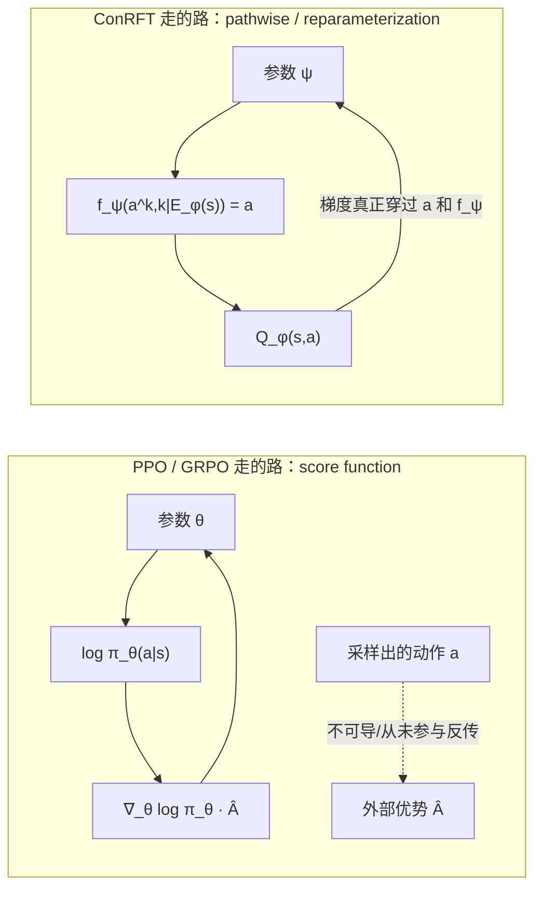
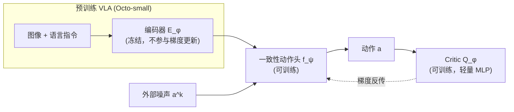
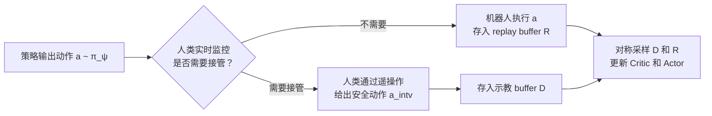
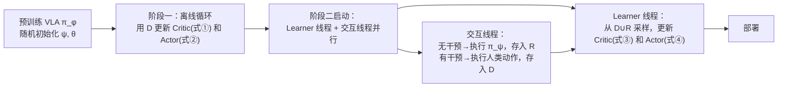

# ConRFT：一致性策略 RL 微调 VLA 深度精读

> **论文标题**: ConRFT: A Reinforced Fine-tuning Method for VLA Models via Consistency Policy
> **作者**: Yuhui Chen, Shuai Tian, Shugao Liu, Yingting Zhou, Haoran Li, Dongbin Zhao
> **机构**: Chinese Academy of Sciences, University of Chinese Academy of Sciences
> **发表**: arXiv:2502.05450, 2025
> **代码**: https://github.com/cccedric/conrft

**标签**: `#VLA` `#强化学习` `#一致性模型` `#Q学习` `#真实机器人` `#人类干预` `#样本效率`

**知识链接**：
- [连续动作与离散动作的梯度回传](/前置知识/001r_前置知识_连续动作与离散动作的梯度回传) — **必读**，本文的梯度回传方式就是这里说的 pathwise / reparameterization 梯度
- [重参数化技巧](/前置知识/002e_前置知识_重参数化技巧) — pathwise 梯度的通用数学基础
- [DDPG（确定性策略梯度）](/前置知识/000p_前置知识_DDPG_确定性策略梯度) — "Q 的梯度直接穿过策略网络"这个机制最早的来源
- [Consistency Model 与一步生成](/前置知识/000h_前置知识_Consistency_Model与一步生成) — 一致性模型的原理，本文用它做动作头
- [CQL 保守 Q 学习](/前置知识/002g_前置知识_CQL保守Q学习) 与 [Cal-QL 校准保守 Q 学习](/前置知识/002h_前置知识_CalQL校准保守Q学习) — 离线阶段 Critic 训练用的正是 Cal-QL
- [SAC (Soft Actor-Critic)](/前置知识/000k_前置知识_SAC_Soft_Actor_Critic) — 在线阶段 Critic 的 TD 更新形式
- [行为克隆与 RL 微调范式](/前置知识/000d_前置知识_行为克隆与RL微调范式) — 离线→在线两阶段范式
- [动作 Token 化与自回归策略](/前置知识/000l_前置知识_动作Token化与自回归策略) — 对比：token 化动作头为什么走不了这条梯度路径
- [VLA 模型的 RL 后训练综述](/论文综述/S06_VLA模型的RL后训练综述) — ConRFT 在综述中的定位

---

## 贯穿全文的例子

论文在 8 个真实世界任务上做了实验，其中最"硬核"的一个是 **Insert Wheel**：把一个黑色轮子上的销钉，插进灰色椅子底座的孔里。这是一个接触丰富（contact-rich）任务——对准差 2~3mm 就会卡住插不进去。全文用这个任务讲清楚"一步生成的动作头到底在干什么、Q 的梯度怎么传回去、离线和在线两个阶段分别在做什么"。

任务的具体设置（论文 Table X）：状态 $s$ = 腕部相机 128×128 图像 + 侧面相机 256×256 图像 + 机械臂末端位姿/力矩/夹爪状态；动作 $a$ 是 7 维（6 维末端位姿增量 + 1 维夹爪开合）；控制频率 10Hz；只有 30 条人类遥操作示教。基座 VLA 模型是 **Octo-small**。

---

## 一、背景与动机

### 1.1 真实机器人 RL 的核心矛盾

之前的 VLA + RL 工作大多在**仿真**中训练。但真实世界的 RL 有几个仿真里不存在的硬约束：

| 挑战 | 仿真 RL | 真实世界 RL |
|------|---------|-----------|
| 采样成本 | 低（并行环境，几秒一条轨迹） | **极高**（物理执行，几十秒一条轨迹） |
| 安全性 | 无所谓（重置即可） | **必须保证**（碰撞可能损坏机器人/环境） |
| Reset | 自动（环境 API） | **困难**（需要人工或脚本复位） |
| 探索代价 | 免费 | 每一次失败都是真实的时间和磨损成本 |

论文把每个任务建模成标准 MDP $\mathcal{M}=(\mathcal{S},\mathcal{A},\mathcal{P},r,\rho,\gamma)$，目标是学一个策略 $\pi$ 最大化折扣累积回报 $V^\pi(s)=\mathbb{E}_\pi[\sum_t \gamma^t r(s_t,a_t)]$。

### 1.2 为什么不能直接监督微调（SFT）

标准做法是用示教数据对 VLA 做负对数似然（NLL）或均方误差（MSE）微调。问题是：**示教数据本身量少（20~30 条）且质量不稳定**（人类操作有失误、犹豫、次优路径），SFT 只能模仿这些数据里已经出现过的行为，学不出"比示教更好"的策略，也无法在示教没覆盖到的状态下给出合理动作。

### 1.3 ConRFT 的思路：离线 + 在线两阶段，同一套训练目标贯穿

```mermaid
flowchart LR
    A["20-30 条人类示教<br/>(纯离线数据)"] --> B["阶段一 Cal-ConRFT<br/>离线 Cal-QL Critic + Consistency Actor"]
    B --> C["阶段二 HIL-ConRFT<br/>真机在线交互 + 人类安全干预"]
    C --> D["最终策略<br/>96.3% 平均成功率"]
```

两个阶段用的是**同一套训练目标**（Q 值引导 + 一致性行为克隆），唯一变化的是数据来源：阶段一只用固定的示教数据集，阶段二加入真机 rollout 和人类介入的数据。这个"统一目标贯穿两阶段"是论文的核心设计——不需要在两个阶段之间切换算法框架。

---

## 二、核心问题：一步生成的动作头到底在算什么

这是全文最容易被讲糊的地方，也是本文重写的重点。先把结论摆在最前面：

> **Consistency Policy 不是在算"动作的概率"，它是一个确定性函数：输入一份随机噪声和当前状态编码，输出直接就是动作本身**。整个"一步生成"就是这一次前向传播，没有任何采样离散化、没有显式的密度函数。Q 函数的梯度能传回这个动作头，靠的不是策略梯度定理（需要 $\log\pi(a|s)$），而是像 [DDPG](/前置知识/000p_前置知识_DDPG_确定性策略梯度) 那样，直接把梯度沿着这个确定性函数的计算图反向传播回去——这条路径在 [连续动作与离散动作的梯度回传](/前置知识/001r_前置知识_连续动作与离散动作的梯度回传) 里被称为 **pathwise / reparameterization 梯度**，和 score function 梯度（PPO/GRPO 那条路）是完全不同的两条路。

下面把这句话拆开，一步步讲清楚。

### 2.1 策略的表示：噪声 + 状态编码 → 动作

论文把 Consistency Policy 写成：

$$
\pi_\psi(a|s) = f_\psi(a^k, k \mid E_\phi(s)), \qquad a^k \sim \mathcal{N}(0, kI)
$$

**这个公式在做什么**：策略不是"从一个概率分布里抽一个动作"，而是"喂一份随机噪声进一个网络，网络一次前向直接吐出动作"——整套生成过程只有一次函数调用，没有第二步。

::: details 📐 公式详解（点击展开）

| 子表达式 | 它是谁 | 它在干嘛 |
|---------|--------|---------|
| $E_\phi(s)$ | **VLA 的状态编码** | 预训练 VLA（Octo-small）的视觉-语言编码器输出，把图像+语言指令压缩成一个向量，$\phi$ 是 VLA 的原始参数 |
| $k$ | **噪声等级** | 一个标量，控制输入噪声 $a^k$ 的方差有多大；$k$ 越大表示"离纯噪声越近" |
| $a^k \sim \mathcal{N}(0, kI)$ | **外部随机源** | 和网络参数 $\psi$ 完全无关的高斯噪声，采样过程不涉及任何需要求导的东西 |
| $f_\psi(\cdot,\cdot\mid\cdot)$ | **一致性动作头** | 参数为 $\psi$ 的网络，输入"噪声 + 噪声等级 + 状态编码"，一次前向直接输出一个动作 |
| $\pi_\psi(a|s)$ | **策略** | 上面这个"喂噪声、出动作"的整个过程，被记作策略，但它本质是一个确定性函数,不是一个显式的概率密度 |

**用人话读**："策略不是抽一个动作出来，而是把一份随机噪声和当前看到的画面/指令一起丢进一个网络，网络直接告诉你该做什么动作。"

**为什么是这个形式**：这正是 [Consistency Model](/前置知识/000h_前置知识_Consistency_Model与一步生成) 的核心设计——网络被训练成"轨迹上任意一点都能一步映射到终点"，所以推理时不需要像 Diffusion Policy 那样反复迭代去噪，取 $k$ 为最大噪声等级、喂一份纯噪声进去，一次前向就能得到最终动作。
:::

**训练阶段和推理阶段用的是同一个网络，但喂给它的 $k$ 不一样**：

- **推理时**：$k$ 固定取论文设定的最大值 $K=80$（近似纯噪声），采一次 $a^K\sim\mathcal{N}(0,80I)$，一次前向得到动作——这就是真正部署时的"一步生成"。
- **训练时**：$k$ 会在 $[\epsilon, K]=[0.002, 80.0]$ 之间按论文给定的 $M=40$ 个子区间边界随机取值（边界公式和 Karras 噪声调度一致，完整推导见 [Consistency Model 前置知识](/前置知识/000h_前置知识_Consistency_Model与一步生成)），目的是让网络在"任意噪声等级输入"下都学会一致地映射回同一个动作——这是 Consistency Model 自一致性约束的具体落地方式。

### 2.2 关键澄清：这里没有"动作的概率"这个东西

标准策略梯度（PPO、GRPO）需要显式计算 $\log\pi_\theta(a|s)$，用它乘以优势函数 $\hat A$ 来更新参数。而 $f_\psi$ 是一个确定性映射——给定同一份噪声 $a^k$ 和同一个状态，它每次输出完全相同的动作，**没有定义任何显式的概率密度函数**。这也是为什么本文开头就要把这件事挑出来讲：Consistency Policy 走的完全不是"算概率"这条路，而是把整个动作生成过程变成一个**可导的确定性函数**，为下一步"Q 的梯度直接穿过去"铺路。

### 2.3 Q 的梯度怎么传回策略参数 $\psi$

这是回答"能不能对 Actor 本身梯度回传"的核心。整条计算链路是：

$$
\psi \;\to\; f_\psi(a^k, k \mid E_\phi(s)) = a \;\to\; Q_\phi(s, a)
$$

**这个公式在做什么**：画出从策略参数到 Q 值打分的完整计算链路——中间只有两步，且每一步都可导。

::: details 📐 公式详解（点击展开）

| 子表达式 | 它是谁 | 它在干嘛 |
|---------|--------|---------|
| $\psi\to f_\psi(\cdot)$ | **第一步：参数生成动作** | 一致性动作头一次前向，把噪声变成动作，全程可导（2.1 节已说明噪声 $a^k$ 外生，不依赖 $\psi$） |
| $f_\psi(\cdot)=a\to Q_\phi(s,a)$ | **第二步：Critic 打分** | 生成出的动作喂进 Critic 网络，Critic 是普通的可导 MLP |
| 整条链路无断点 | **可以整体求导** | 两步都可导，意味着可以对整条链路一次性用链式法则求 $\partial Q/\partial\psi$ |

**用人话读**："参数变成动作，动作变成打分，这两步都是普通的可导计算，没有任何'掷骰子'式的断点。"

**为什么要单独把这条链路画出来**：这是回答"Q 的梯度能不能穿过 Actor"这个问题的关键——只要证明链路上每一步都可导，后面链式法则求梯度就是水到渠成的事。
:::

于是可以直接用链式法则求梯度：

$$
\nabla_\psi \mathcal{L}_{\text{Q-guide}} = -\nabla_a Q(s,a)\Big|_{a=f_\psi(a^k,k|E_\phi(s))} \cdot \nabla_\psi f_\psi(a^k, k \mid E_\phi(s))
$$

**这个公式在做什么**：Q 网络对动作的敏感度，乘上动作头对自己参数的敏感度，两者相乘就是"调一下策略参数,Q 值会怎么变"——这条链路和 Diffusion Policy 需要展开 K 步去噪链完全不同，这里只有**一次前向对应一次反向**。

::: details 📐 公式详解（点击展开）

| 子表达式 | 它是谁 | 它在干嘛 |
|---------|--------|---------|
| $\nabla_a Q(s,a)\big\|_{a=f_\psi(\cdot)}$ | **Q 对动作的敏感度** | 固定住当前生成的动作 $a$，Critic 网络内部反传算出"这个动作稍微变一下，Q 值会变多少"——这是 Critic 内部普通的反向传播，$Q_\phi$ 是个正常可导网络 |
| $\nabla_\psi f_\psi(a^k,k\mid E_\phi(s))$ | **动作头对参数的敏感度** | 一致性网络一次前向生成动作，这个动作对网络参数 $\psi$ 的梯度——只需一次前向对应的一次反向 |
| 两者相乘 | **链式法则的完整路径** | 把"参数变化 → 动作变化 → Q 值变化"这条链用乘法串起来，就是 Q 值对策略参数的完整梯度 |
| 负号 | **上升变下降** | 训练框架默认最小化 loss，加负号把"让 Q 变大"这个目标转成梯度下降 |

**用人话读**："想知道调一下动作头的参数能让 Q 值涨多少，只要看两件事——动作变了 Q 值会怎么变，参数变了动作会怎么变，两者乘起来就是答案。"

**为什么是这个形式（对比 Diffusion Policy 和对比 PPO/GRPO）**：Diffusion Policy 生成一个动作要经过 $K$ 步去噪，$\nabla_\psi f_\psi$ 这一项要展开成 $K$ 层的链式求导，计算图深，梯度容易爆炸或消失；Consistency Policy 只有一步前传，链式法则只有两项相乘，反传路径极短、梯度稳定。而 PPO/GRPO 走的是完全不同的路——它们对 $\log\pi_\theta(a|s)$ 求导，Q 值（或优势 $\hat A$）只是从外部乘进来的标量权重，梯度从未真正穿过采样出的动作本身（这条路径的完整对比见 [连续动作与离散动作的梯度回传](/前置知识/001r_前置知识_连续动作与离散动作的梯度回传)）。
:::

用一张图直接对比两条路径的梯度走向：

```mermaid
flowchart LR
    subgraph SF["PPO / GRPO 走的路：score function"]
        t1["参数 θ"] --> logp["log π_θ(a|s)"]
        logp --> g1["∇_θ log π_θ · Â"]
        g1 --> t1
        act1["采样出的动作 a"] -.不可导/从未参与反传.-> Ahat["外部优势 Â"]
    end
    subgraph RP["ConRFT 走的路：pathwise / reparameterization"]
        t2["参数 ψ"] --> fpsi["f_ψ(a^k,k|E_φ(s)) = a"]
        fpsi --> Q["Q_φ(s,a)"]
        Q -- 梯度真正穿过 a 和 f_ψ --> t2
    end
```

第一张图里，采样出的动作是虚线（不可导）分支，梯度从 $\log\pi_\theta$ 直接跳回参数。第二张图里，梯度从 Critic $Q_\phi$ 出发，实线一路穿过生成出的动作 $a$，穿过 $f_\psi$，回到 $\psi$——**这条路径在 PPO/GRPO 的计算图里根本不存在**。

### 2.4 什么被冻结、什么被训练

一个之前的版本完全没有强调、但对理解"能不能对 Actor 梯度回传"至关重要的细节：**梯度只会传到一致性动作头 $\psi$，VLA 的视觉-语言编码器和 Transformer backbone（参数 $\phi$）全程冻结**。

```mermaid
flowchart LR
    subgraph VLA["预训练 VLA (Octo-small)"]
        img["图像 + 语言指令"] --> Ephi["编码器 E_φ<br/>(冻结，不参与梯度更新)"]
    end
    Ephi --> fpsi["一致性动作头 f_ψ<br/>(可训练)"]
    noise["外部噪声 a^k"] --> fpsi
    fpsi --> a["动作 a"]
    a --> Q["Critic Q_φ<br/>(可训练，轻量 MLP)"]
    Q -. 梯度反传 .-> fpsi
```

论文在局限性一节明确指出（VI-B）：这个设计是为了保证实时性——机器人在线交互时不可能承受对整个 VLA backbone 做反向传播的算力和延迟。代价是策略在线阶段没法更新自己的视觉/语言表征，只能调整"看到编码之后怎么把噪声变成动作"这一层。

---

## 三、离线阶段：Cal-ConRFT

阶段一只用示教数据集 $\mathcal{D}$（20~30 条），目标是同时训好 Critic 和 Actor，给在线阶段一个稳定的起点。

### 3.1 Critic：为什么不能直接用标准 Q-learning

示教数据量很小，覆盖的状态-动作范围很窄。如果直接用标准 TD 目标 $Q_\theta(s,a)\to r+\gamma\max_{a'}Q(s',a')$ 训练，Critic 会在训练数据没覆盖到的动作（OOD 动作）上产生虚高的估值——这正是 [离线强化学习](/前置知识/000s_前置知识_离线强化学习基础) 里讲的**外推误差**。ConRFT 用 [Cal-QL](/前置知识/002h_前置知识_CalQL校准保守Q学习) 来解决这个问题：

$$
\mathcal{L}_Q^{\text{offline}}(\theta) = \alpha\Big(\mathbb{E}_{s\sim\mathcal{D},a\sim\pi(\cdot|s)}\big[\max(Q_\theta(s,a), V_\mu(s))\big] - \mathbb{E}_{s,a\sim\mathcal{D}}[Q_\theta(s,a)]\Big) + \frac{1}{2}\mathbb{E}_{(s,a,s')\sim\mathcal{D}}\Big[\big(Q_\theta(s,a)-\mathcal{B}^\pi\bar Q_{\bar\theta}(s,a)\big)^2\Big]
$$

**这个公式在做什么**：标准 TD 回归（后半项）之外，再加一个保守正则项（前半项），防止 Critic 对示教数据没覆盖到的动作给出虚高估值。

::: details 📐 公式详解（点击展开）

| 子表达式 | 它是谁 | 它在干嘛 |
|---------|--------|---------|
| $\max(Q_\theta(s,a), V_\mu(s))$ | **止损后的候选打分** | 候选动作的 Q 值先和参考下界 $V_\mu(s)$ 取 max，压低时不会无止境往负无穷跑——这正是 [Cal-QL 前置知识](/前置知识/002h_前置知识_CalQL校准保守Q学习#3.2-cal-ql-的保守项) 里讲的止损阀机制 |
| $\mathbb{E}_{s,a\sim\mathcal{D}}[Q_\theta(s,a)]$ | **真实动作的打分** | 数据集里真实示教动作的 Q 值，作为对照锚点，正则项只压"比锚点虚高"的部分 |
| $\frac{1}{2}\mathbb{E}[(Q_\theta-\mathcal{B}^\pi\bar Q_{\bar\theta})^2]$ | **标准 TD 回归** | 让 $Q_\theta$ 逼近目标网络给出的贝尔曼目标 $\mathcal{B}^\pi\bar Q_{\bar\theta}(s,a)=r(s,a)+\gamma\,\mathbb{E}_{a'\sim\pi(\cdot|s')}[\bar Q_{\bar\theta}(s',a')]$——注意这里是对当前策略采样动作 $a'$ 后取期望,不是取 $\max_{a'}$（那是 Q-learning 的写法，Cal-QL 用的是 SARSA 式的期望备份） |
| $\alpha$ | **保守强度旋钮** | 控制正则项和 TD 项的相对权重 |

**用人话读**："Critic 的训练目标 = 标准的贝尔曼回归，再加一项'不许把没见过的动作打分抬得比真实动作虚高太多，但也不许压到已知下界以下'的保守约束。"

**为什么这里不重复推导**：这就是标准的 [Cal-QL](/前置知识/002h_前置知识_CalQL校准保守Q学习) 损失，$V_\mu(s)$ 这个下界从哪来、$\max$ 为什么能"止损"、TD 目标为什么是期望而不是 $\max_{a'}$，本站已经在 [Cal-QL 前置知识 §3.2](/前置知识/002h_前置知识_CalQL校准保守Q学习#3.2-cal-ql-的保守项) 里用数值算例讲得很透，这里不重复——**唯一要记住的是**：这个损失约束的是 Critic $Q_\theta$，不涉及动作头 $\psi$ 的任何计算图，训练时两者的梯度是分开算的。
:::

### 3.2 Actor：Q 引导 + 一致性行为克隆

这才是 ConRFT 真正的核心贡献——**一个统一的 loss，同时让动作头"像示教"又"追求更高 Q 值"**：

$$
\mathcal{L}_\pi^{\text{offline}}(\psi) = -\eta\,\mathbb{E}_{s\sim\mathcal{D},\,a\sim\pi_\psi}\big[Q(s,a)\big] + \beta\,\mathbb{E}_{(s,a)\sim\mathcal{D},\,m\sim\mathcal{U}[1,M-1]}\big[d\big(f_\psi(a+k_m z,\,k_m\mid E(s)),\,a\big)\big]
$$

**这个公式在做什么**：前一半是 2.3 节讲的 Q 梯度引导——让动作头生成的动作尽量让 Critic 打高分；后一半是一致性行为克隆——往真实示教动作上加一份随机强度的噪声，再要求网络能从这份脏动作里一步"猜"回原来的示教动作。两项加权相加,同时优化。

::: details 📐 公式详解（点击展开）

| 子表达式 | 它是谁 | 它在干嘛 |
|---------|--------|---------|
| $a\sim\pi_\psi$ | **动作头当场生成的动作** | 也就是 $f_\psi(a^k,k\mid E(s))$，用的是 2.1 节的重参数化采样，梯度能穿过去 |
| $-\eta\,\mathbb{E}[Q(s,a)]$ | **Q 引导项** | 和 2.3 节完全一致——用 Critic 的打分推动动作头往高价值方向走，$\eta$ 是这一项的权重 |
| $a+k_m z$ | **加噪后的示教动作** | 取一条真实示教动作 $a$，叠加一份强度为 $k_m$ 的高斯噪声 $z$（$m$ 随机取自 $[1,M-1]$，即 2.1 节的 40 个噪声等级之一） |
| $f_\psi(a+k_m z, k_m\mid E(s))$ | **网络的还原猜测** | 把这份脏动作喂进同一个一致性网络，让它试图一步猜出原始的干净动作 |
| $d(\cdot,\cdot)=\|\cdot-\cdot\|_2$ | **还原误差** | 猜测和真实示教动作 $a$ 之间的欧氏距离 |
| $\beta\,\mathbb{E}[\cdots]$ | **一致性 BC 项** | 对示教样本、噪声等级、噪声本身取平均，$\beta$ 是这一项的权重 |

**用人话读**："一边让动作头生成的动作尽量讨 Critic 喜欢，一边往示教动作上加噪声再要求网络能一步猜回来——两件事同时练。"

**为什么 BC 项要"加噪声再还原"而不是直接对干净示教动作做普通回归**：这里训练用的不是 [Consistency Model 前置知识](/前置知识/000h_前置知识_Consistency_Model与一步生成) 里讲的"学生网络 vs 自己的 EMA 影子在两个相邻噪声等级互相印证"那种自举训练（那种设计是给无条件生成、没有配对真值时用的），而是更直接的版本：这里手上有配对好的 $(s,a)$ 示教数据，可以让网络在**任意**噪声等级下都直接去噪回已知的真实动作 $a$——这本质上更接近标准扩散模型的去噪训练目标，只是因为网络架构满足 Consistency Model 的边界条件设计（见 [前置知识 §3](/前置知识/000h_前置知识_Consistency_Model与一步生成#三网络架构怎么保证边界条件一定成立)），推理时才能只用一次前向而不需要多步迭代。之所以要在**多个**随机噪声等级 $k_m$ 上都训练这个还原能力（而不是只在推理时用的最大噪声等级 $K$ 上训练），是为了保证网络在真正推理时（输入纯噪声 $k=K$）依然能给出合理输出——训练分布必须覆盖推理时会遇到的噪声区间。
:::

**为什么两项要放在同一个 loss 里，而不是先 BC 预训练再单独做 Q 引导**：如果只有 BC 项，动作头学到的上限就是示教数据本身的质量（示教里 20~30% 的失败率会被直接模仿进去）；如果只有 Q 引导项，示教数据量太少时 Critic 本身还没训准，会把动作头带偏到 Critic 虚高估值的区域。两项加权同时训练，让 BC 项当"安全绳"、Q 引导项当"改进方向"——这正是论文对比实验（Cal-QL alone 在小样本下 0% 成功率）证明的必要性。

---

## 四、在线阶段：HIL-ConRFT

离线阶段结束后，策略被部署到真实机器人上，通过与环境的真实交互继续改进,同时引入**人类干预（Human Intervention）**保证安全。

```mermaid
flowchart LR
    A["策略输出动作 a ~ π_ψ"] --> B{"人类实时监控<br/>是否需要接管？"}
    B -->|"不需要"| C["机器人执行 a<br/>存入 replay buffer R"]
    B -->|"需要接管"| D["人类通过遥操作<br/>给出安全动作 a_intv"]
    D --> E["存入示教 buffer D"]
    C --> F["对称采样 D 和 R<br/>更新 Critic 和 Actor"]
    E --> F
```

**人类干预怎么触发、干预的数据怎么用**：人类操作员通过遥操作设备（如 SpaceMouse）实时观察机器人执行，一旦策略即将做出危险或明显错误的动作（比如插入时下压过快），就按下接管按钮，人类给出的动作会被记录进**示教 buffer** $\mathcal{D}$（和离线阶段的示教数据同一个 buffer），而不是普通的在线 replay buffer $\mathcal{R}$。这意味着人类干预的数据在后续训练中会被当作"高质量示教"反复使用。

### 4.1 在线 Critic：换回标准 TD，不再用 Cal-QL 保守项

$$
\mathcal{L}_Q^{\text{online}}(\theta) = \mathbb{E}_{(s,a,s')\sim(\mathcal{D}\cup\mathcal{R})}\Big[\big(Q_\theta(s,a) - \mathcal{B}^\pi\bar Q(s,a)\big)^2\Big]
$$

**这个公式在做什么**：把离线阶段 Cal-QL 里的保守正则项去掉，只留标准的贝尔曼 TD 回归,数据来源换成示教 buffer 和在线 buffer 的混合。

::: details 📐 公式详解（点击展开）

| 子表达式 | 它是谁 | 它在干嘛 |
|---------|--------|---------|
| $(s,a,s')\sim(\mathcal{D}\cup\mathcal{R})$ | **混合数据源** | 从示教 buffer $\mathcal{D}$（含人类干预动作）和在线 buffer $\mathcal{R}$（策略自主执行的 rollout）里对称采样 |
| $\mathcal{B}^\pi\bar Q(s,a)$ | **贝尔曼目标** | 和离线阶段同一个目标算子，$r(s,a)+\gamma\,\mathbb{E}_{a'\sim\pi(\cdot|s')}[\bar Q(s',a')]$,用目标网络算 |
| $(Q_\theta - \mathcal{B}^\pi\bar Q)^2$ | **回归误差** | 让当前 Critic 逼近贝尔曼目标的平方误差,标准 TD loss |

**用人话读**："在线阶段的 Critic 训练就是普通的 TD 回归，数据一半来自示教（含人类纠正），一半来自策略自己跑出来的经验。"

**为什么可以去掉 Cal-QL 的保守项**：外推误差的根源是"数据覆盖不足"，在线阶段有真实交互持续补充数据,这个风险自然消退,继续加保守项只会拖慢 Q 值上升（见 [Cal-QL 前置知识 §5.4](/前置知识/002h_前置知识_CalQL校准保守Q学习#5.4-只在离线阶段使用)）。
:::

### 4.2 在线 Actor：结构不变，权重反转

$$
\mathcal{L}_\pi^{\text{online}}(\psi) = -\eta\,\mathbb{E}_{s\sim(\mathcal{D}\cup\mathcal{R}),\,a\sim\pi_\psi}[Q(s,a)] + \beta\,\mathbb{E}_{(s,a)\sim(\mathcal{D}\cup\mathcal{R}),\,m\sim\mathcal{U}[1,M-1]}\big[d(f_\psi(a+k_m z,k_m|E(s)),a)\big]
$$

**这个公式在做什么**：和 3.2 节的离线 Actor loss 结构完全一样,只是数据来源换成了 $\mathcal{D}\cup\mathcal{R}$，且两项的权重会在训练过程中动态调整。

::: details 📐 公式详解（点击展开）

| 子表达式 | 它是谁 | 它在干嘛 |
|---------|--------|---------|
| $-\eta\,\mathbb{E}[Q(s,a)]$ | **Q 引导项** | 和 3.2 节同一个机制——用 Critic 的梯度推动动作头往高价值方向走，只是这里的 $Q$ 已经是在线更新过的 Critic |
| $\beta\,\mathbb{E}[d(f_\psi(a+k_mz,k_m|E(s)),a)]$ | **一致性 BC 项** | 同 3.2 节，往数据里的动作（现在包含人类干预动作）加噪声再要求网络还原 |
| $\eta,\beta$ | **两个旋钮，随训练动态调整** | 论文的做法是在线阶段逐渐降 $\beta$、升 $\eta$——离线阶段依赖 BC 站稳，在线阶段让 Q 引导逐渐主导 |

**用人话读**："在线阶段用的还是同一套'Q 引导 + 一致性模仿'的公式，只是喂给它的数据换成了真机交互和人类纠正,而且训练过程中会慢慢把权重从'重模仿'调到'重 Q 引导'。"

**为什么权重要调整而不是固定**：离线阶段 Critic 还不可靠,BC 项要占主导防止被带偏；在线阶段有了真实奖励持续校正 Critic，可以让 Q 引导逐渐接管,去追求"比示教更好"的行为，但不能把 BC 项降到 0——它仍然防止策略在探索中突然跑飞、做出危险动作（论文 IV-B 节明确给出这两个理由）。
:::

---

## 五、算法全貌

把两个阶段串起来（对应论文 Algorithm 1）：

```mermaid
flowchart LR
    A["预训练 VLA π_φ<br/>随机初始化 ψ, θ"] --> B["阶段一：离线循环<br/>用 D 更新 Critic(式①) 和 Actor(式②)"]
    B --> C["阶段二启动：<br/>Learner 线程 + 交互线程并行"]
    C --> D["交互线程：<br/>无干预→执行 π_ψ，存入 R<br/>有干预→执行人类动作，存入 D"]
    C --> E["Learner 线程：<br/>从 D∪R 采样，更新 Critic(式③) 和 Actor(式④)"]
    D --> E
    E --> F["部署"]
```

两个线程异步运行——机器人不需要等训练完成才能继续交互，训练也不需要等一条 episode 跑完才能更新（每一步 transition 进来就可以采样训练）。

---

## 六、实验结果

### 6.1 真实机器人任务与关键数字

论文在 **8 个真实世界操作任务**上验证（7-DoF Franka Emika 机械臂 + Octo-small VLA）：Pick Banana、Put Spoon、Open Drawer、Pick Bread、Open Toaster、Put Bread、**Insert Wheel**（本文的贯穿例子）、Hang Chinese Knot。

| 方法 | 阶段 | 平均成功率 | 相对 SFT 提升 | 平均 episode 长度 |
|------|------|----------|--------------|-------------------|
| SFT（NLL 微调） | 离线基线 | 39.4% | — | 59.9 步 |
| Cal-ConRFT（本文，离线） | 离线 | ≈39.4%（与 SFT 相近，但 Q 初始化更稳） | ≈0% | 57.5 步 |
| HG-DAgger | 在线基线 | 65.0% | +65% | 56.3 步（1.1x） |
| PA-RL | 在线基线 | 71.3% | +81% | 51.1 步（1.2x） |
| **HIL-ConRFT（本文，在线）** | 在线 | **96.3%** | **+144%** | **30.7 步（1.9x）** |

训练成本：45~90 分钟真机在线交互（累计 80~120 条策略/人类混合 rollout）。作为对照，从零训练的 HIL-SERL（同样用人类干预但不基于预训练 VLA）在相同交互预算下只达到 **31.9%** 平均成功率（论文 Table II），说明预训练 VLA 提供的初始化本身价值巨大。

### 6.2 为什么离线阶段要引入 Q loss（而不是纯 SFT）

论文的消融实验（V-B3 节）显示：单独用 Cal-QL（没有 BC 项）在示教量只有 20~30 条时，训出来的策略成功率是 **0%**——数据太少，Q 值估计不准，策略被带偏。单独用 SFT，离线成功率和 Cal-ConRFT 相近，但切到在线阶段后，从 SFT 起步的在线训练会经历更严重的"策略遗忘"（干预率明显更高），因为 Q 函数是从零开始学的；从 Cal-ConRFT 起步则平稳得多——离线阶段训好的 Q 函数给在线阶段的策略梯度提供了一个已经大致校准好的方向。

---

## 七、局限性（论文原文）

### 7.1 对奖励工程敏感

论文用一个二分类器判断任务是否成功，作为奖励信号。这个分类器的训练分布和 RL 探索阶段实际遇到的状态分布之间存在偏移，可能导致 reward hacking——策略找到一个让分类器误判为"成功"的位置，而不是真正完成任务。

### 7.2 编码器和 backbone 全程冻结

正如 2.4 节强调的，在线阶段只训练一致性动作头，VLA 的视觉编码器和 Transformer backbone 不参与更新。这保证了实时性，但也意味着策略无法在线调整自己的感知/表征能力——遇到示教数据里没见过的视觉场景时，这个限制会更明显。论文指出未来可以考虑 LoRA 等参数高效微调方式部分解冻 backbone。

---

## 八、这篇论文在 RL-for-VLA 图谱中的位置

ConRFT 走的是 [连续动作与离散动作的梯度回传](/前置知识/001r_前置知识_连续动作与离散动作的梯度回传) 里说的**端到端确定性策略梯度**这条路（和 DDPG、标准 SAC 的 Actor 更新同源），这和 [VLA On-Policy RL 方法综述](/论文综述/S12_VLA_On_Policy_RL方法综述) 里 PPO/GRPO 走的**score function** 路线是两条本质不同的技术路线。在 [VLA Off-Policy RL 方法综述](/论文综述/S13_VLA_Off_Policy_RL方法综述) 的分类里，ConRFT 属于"混合组"——阶段一是 100% 离线数据（标准 Offline RL），阶段二靠少量高信息密度的人类干预数据校正外推误差。和另一条同样在真实机器人上验证的路线 [RECAP](/论文综述/016_RECAP_从真实部署经验中RL学习) 相比，两者的核心差异是：RECAP 只改训练数据的输入格式（advantage conditioning），Actor 本身完全不改；ConRFT 直接用 Q 函数的梯度改变 Actor 的参数——这也是本文反复强调的"梯度能不能穿过 Actor"这件事在两篇论文里给出的两种不同答案。完整对比见 [RECAP 精读 §5.2](/论文综述/016_RECAP_从真实部署经验中RL学习#5.2-recap-vs-conrft-q-gradient-路线)。

---

## 九、个人评价

**独特贡献**：ConRFT 是少数几篇**直接在真实机器人上做 RL 微调 VLA** 的工作，而且把"梯度到底怎么传回 Actor"这个问题用一个具体、可实现的方案（Consistency Policy 的确定性一步生成 + pathwise 梯度）解决了，不需要 PPO/GRPO 那套 rollout-heavy 的 on-policy 机制。

**实践启示**：对于有真实机器人但仿真环境不好搭的团队，ConRFT 给出了一条可行路径——20~30 条人类示教 + 45~90 分钟真机在线交互（含人类干预）就能把成功率从不到 40% 提到 96%以上。核心代价是训练全程需要人类实时盯着按接管按钮，不是完全自动化。

---

## 延伸阅读

- [连续动作与离散动作的梯度回传](/前置知识/001r_前置知识_连续动作与离散动作的梯度回传) ← 本文梯度回传机制的完整原理
- [Consistency Model 与一步生成](/前置知识/000h_前置知识_Consistency_Model与一步生成) ← 一致性模型的详细原理
- [Cal-QL 校准保守 Q 学习](/前置知识/002h_前置知识_CalQL校准保守Q学习) ← 离线阶段 Critic 训练的完整推导
- [SAC 前置知识](/前置知识/000k_前置知识_SAC_Soft_Actor_Critic) ← Q-learning 基础
- [VLA 模型的 RL 后训练综述](/论文综述/S06_VLA模型的RL后训练综述) ← 完整方法对比
- [RECAP 精读](/论文综述/016_RECAP_从真实部署经验中RL学习) ← 另一种真实世界 RL 方案（Advantage-conditioning 路线，对比 ConRFT 的 Q-gradient 路线）
- [DPPO 精读](/论文综述/001_DPPO_扩散策略策略优化) ← 多步扩散策略的 RL 微调（对比 Consistency 的一步生成）
