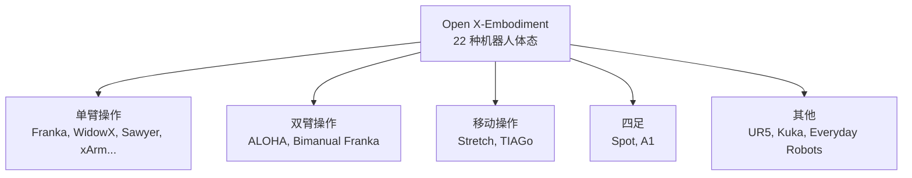

# Open X-Embodiment：大规模跨体机器人数据集与 RT-X 模型 深度精读

> **论文标题**: Open X-Embodiment: Robotic Learning Datasets and RT-X Models  
> **作者**: Open X-Embodiment Collaboration (33+ 机构，150+ 研究者)  
> **机构**: Google DeepMind, Stanford, UC Berkeley, CMU, MIT 等  
> **发表**: ICRA 2024  
> **代码/数据**: https://robotics-transformer-x.github.io/

**标签**: `#机器人数据集` `#跨体学习` `#预训练` `#RT-X` `#Open X-Embodiment`

**知识链接**：
- [机器人模仿学习综述](/论文综述/S02_机器人模仿学习综述) — 模仿学习系统背景
- [视觉-语言-动作模型 VLA 综述](/论文综述/S03_视觉语言动作模型VLA综述) — VLA 大模型路线图
- [行为克隆与 RL 微调范式](/前置知识/000d_前置知识_行为克隆与RL微调范式) — BC 预训练基本概念

---

## 一、背景与动机

### 1.1 机器人数据的"孤岛问题"

在 NLP 和 CV 领域，大规模预训练已成为标配——GPT 系列用了万亿 token 的文本，CLIP 用了 4 亿图文对。但机器人领域长期面临一个尴尬局面：**每个实验室都在自己的机器人上采集自己的数据，格式不统一、体态不同、任务各异**，无法像 ImageNet 那样汇聚成一个大池子。

具体来说：

| 数据来源 | 机器人类型 | 数据量 | 格式 | 能否直接混合训练？ |
|---------|----------|-------|-----|--------------|
| Stanford | Franka Panda | ~50k 条 | 自定义 HDF5 | ❌ |
| Berkeley | WidowX | ~60k 条 | robonet 格式 | ❌ |
| Google | Everyday Robots | ~100k 条 | RT-1 格式 | ❌ |
| CMU | Stretch | ~10k 条 | 自定义 | ❌ |

每个数据集都是"信息孤岛"，独立训练只能得到窄专家策略。

### 1.2 核心问题：跨体数据能否产生正迁移？

Open X-Embodiment 提出了一个大胆假设：

> **如果把 22 种不同机器人的 100 万+ 条轨迹混在一起训练一个大模型，能否得到比在单一数据集上训练更好的策略？**

这个假设之所以大胆，是因为不同机器人的动作空间完全不同——7 自由度的 Franka、6 自由度的 WidowX、移动底盘的 Stretch、四足的 Spot——混合训练怎么处理动作维度不匹配的问题？

### 1.3 核心贡献

1. **统一数据格式 RLDS (Robot Learning Dataset Schema)**：把 60+ 个现有数据集转换为统一的 TFRecord 格式
2. **超大规模数据集**：100 万+ 真实机器人轨迹，覆盖 22 种体态、527 种技能
3. **RT-X 模型**：在这些数据上训练的跨体策略，验证了正迁移的存在
4. **开源生态**：所有数据和代码公开，建立了机器人学习社区的"共享文化"

---

## 二、数据集构成

### 2.1 规模概览

Open X-Embodiment 汇集了来自 33 个研究机构的 60+ 个独立数据集，核心统计：

- **总轨迹数**：1,000,000+
- **覆盖机器人**：22 种不同体态
- **技能种类**：527 种
- **数据格式**：统一为 RLDS (基于 TFRecord)

### 2.2 体态多样性

数据覆盖的机器人类型远超以往任何单一数据集：

### 2.3 数据标准化：RLDS 格式

统一格式的关键设计：

每条轨迹包含：
- **观测** (observation)：RGB 图像（一个或多个视角）、本体感受（关节角度、末端位姿）
- **动作** (action)：各体态对应的动作向量（维度不同！）
- **语言指令** (instruction)：自然语言描述，如 "pick up the red cup"
- **元信息**：机器人类型、场景描述、成功标志

**关键设计决策**：动作空间不做统一归一化，而是保留每个体态的原始动作表示。不同体态通过**条件化**的方式区分。

### 2.4 数据不均衡问题

需要注意的是，数据分布并不均衡——前 4 种机器人贡献了超过 85% 的真实数据。这意味着模型容易过拟合到常见体态 + 场景组合。后续工作（如 OXE-Aug，2024 年底）专门针对这个问题做了数据增强。

---

## 三、RT-X 模型

### 3.1 两个变体

基于 Open X-Embodiment 数据训练了两个模型：

| 模型 | 基础架构 | 参数量 | 核心思路 |
|------|---------|-------|---------|
| RT-1-X | RT-1 (EfficientNet + TokenLearner + Transformer) | ~35M | 轻量级，验证跨体正迁移 |
| RT-2-X | RT-2 (PaLI-X 55B VLM) | 55B | 大模型，利用视觉-语言预训练知识 |

### 3.2 RT-1-X 的跨体处理

RT-1-X 的动作输出方式：

$$
a_t = f_\theta(o_t, l, e)
$$

**逐项拆解**：
- $o_t$ — 当前时间步的视觉观测
- $l$ — 语言指令 embedding
- $e$ — 体态标识 (embodiment token)，告诉模型"我是哪种机器人"
- $f_\theta$ — Transformer 策略网络

输出的动作维度根据体态标识 $e$ 动态切换。本质上是一个**多任务多头**的架构：共享视觉和语言理解的 trunk，针对不同体态用不同的 action head。

### 3.3 正迁移的实验验证

关键实验结果：在 5 个不同机器人平台上对比"只用自己数据训练" vs "用全量 OXE 数据训练"：

- **RT-1-X 在 5/5 个评估平台上超越了 RT-1（单体态训练）**
- 平均成功率提升约 50%（相对提升）
- 即使某些体态在训练集中占比很小，也能受益于其他体态的数据

这证明了：**不同机器人体态之间确实存在可迁移的操作知识**——抓取的视觉特征、物体的语义理解、运动的高层规划——这些在体态间是共享的。

---

## 四、设计启示与局限

### 4.1 关键启示

1. **数据规模比体态一致性更重要**：即使动作空间完全不同，大规模混合训练仍然有益
2. **语言是关键的统一接口**：自然语言指令让不同任务、不同机器人能在同一个语义空间中对齐
3. **视觉预训练迁移有效**：RT-2-X 利用 VLM 的视觉理解，比从头训练的 RT-1-X 表现更好

### 4.2 局限性

- 数据不均衡严重（少数机器人贡献大部分数据）
- 动作空间差异大时（如四足 vs 单臂），低层迁移有限
- 仅验证了操作任务，导航和移动操作的验证不足
- 数据质量参差——有些源数据集的成功率本身就不高

---

## 五、总结与后续影响

| 维度 | 贡献 |
|------|------|
| 数据规模 | 建立了百万级的机器人操作数据集标准 |
| 社区建设 | 推动了"开放数据共享"文化 |
| 技术验证 | 证明跨体正迁移的存在 |
| 后续影响 | Octo、OpenVLA、π₀ 等模型全部基于 OXE 数据训练 |

Open X-Embodiment 的意义不仅在于技术贡献，更在于**社区范式的转变**——它证明了机器人学习也可以走 NLP 的路：先有大数据，再有大模型。

---

## 延伸阅读

- [Octo：开源通用机器人策略](./012_Octo_开源通用机器人策略) — 基于 OXE 训练的开源策略模型
- [DROID：大规模真实世界操作数据集](./013_DROID_大规模真实世界操作数据集) — 另一个重要的大规模数据集
- [OpenVLA：开源视觉-语言-动作模型](./015_OpenVLA_开源视觉语言动作模型) — 基于 OXE 训练的 VLA
- [CrossFormer：跨体通用策略](./017_CrossFormer_跨体通用策略) — 改进跨体态处理的后续工作
