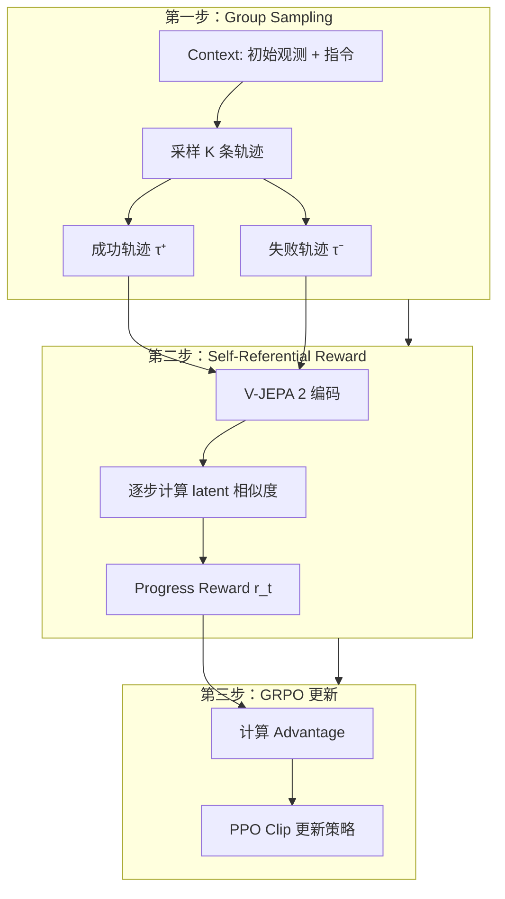
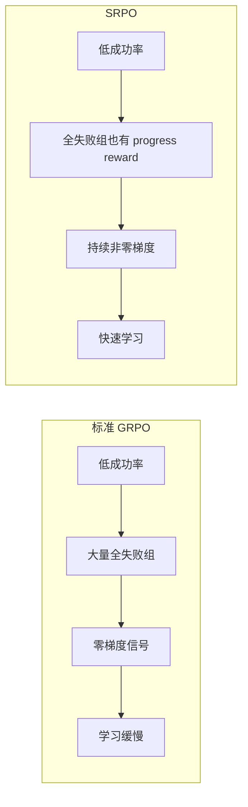

# SRPO：自参考策略优化 深度精读

> **论文标题**: Self-Referential Policy Optimization for Vision-Language-Action Models  
> **作者**: Zhenyang Chen, Jianxiong Li, Xinyi Yang, et al.  
> **机构**: Meta / FAIR  
> **发表**: arXiv:2511.15605, CVPR 2026  
> **代码**: https://github.com/facebookresearch/srpo

**标签**: `#VLA` `#强化学习` `#GRPO` `#自参考` `#过程奖励` `#WorldModel` `#V-JEPA2`

**知识链接**：
- [GRPO](/前置知识/000m_前置知识_GRPO_Group_Relative_Policy_Optimization) — GRPO 组内比较的基础
- [Process Reward Model](/前置知识/000n_前置知识_Process_Reward_Model) — 过程奖励的概念
- [策略梯度与 PPO](/前置知识/000a_前置知识_策略梯度与PPO) — PPO clip 机制
- [KL 散度与策略约束](/前置知识/000j_前置知识_KL散度与策略约束) — 防止策略崩溃
- [VLA 模型的 RL 后训练综述](/论文综述/S06_VLA模型的RL后训练综述) — VLA + RL 全景图
- [RIPT-VLA 精读](./007_RIPT_VLA_无Critic的VLA后训练) — 对比：GRPO 无 Critic 路线

---

## 一、背景与动机

### 1.1 GRPO 在机器人场景的困境

[GRPO](/前置知识/000m_前置知识_GRPO_Group_Relative_Policy_Optimization) 的核心思路：对同一个任务采样 $K$ 条轨迹，成功轨迹得正 advantage，失败轨迹得负 advantage。但在机器人操作场景中存在一个严重问题：

**成功率极低时，组内全部失败 → 零 advantage → 无梯度信号。**

更具体地说：

| 问题 | 描述 | 后果 |
|------|------|------|
| 全失败组 | $K$ 条轨迹全部 $R=0$ | $A_k = 0$，浪费计算 |
| 只有 binary 信号 | 差一点成功 vs 完全乱动，都得 $R=0$ | 无法区分"好的失败"和"坏的失败" |
| Credit assignment 粗糙 | 轨迹级 0/1 奖励 | 不知道哪一步做错了 |

### 1.2 SRPO 的核心洞察

**如果我有一条成功轨迹作为参考，就能衡量每条失败轨迹"走到了哪一步"。**

直觉类比：考试阅卷时，如果只看"通过/不通过"（binary reward），那所有不及格的人分数一样。但如果有一份标准答案（成功轨迹），就能看出"这个人答对了前 3 题"vs"这个人全错"——这就是**过程奖励（progress reward）**。

SRPO 的创新：**不需要训一个额外的 reward model**——直接用模型自身的成功轨迹作为参考，利用 V-JEPA 2 世界模型的 latent space 来衡量轨迹之间的相似度。

### 1.3 贯穿全文的例子

> **场景**：一个桌面机械臂执行 pick-and-place 任务——"把红色方块从左边移到右边的碗中"。
>
> 完成该任务需要 4 个阶段：(1) 移动到方块上方 → (2) 下降并抓取 → (3) 移动到碗上方 → (4) 释放。
>
> 假设成功率目前只有 10%——每组 $K=8$ 条轨迹中，平均只有 0.8 条成功。绝大部分组全是失败。

---

## 二、方法：Self-Referential Progress Reward

### 2.1 整体框架



### 2.2 V-JEPA 2 World Model 的角色

V-JEPA 2 是 Meta 提出的视频预测 world model，它在 latent space 中编码视频帧的语义信息。SRPO 利用它的 latent representation 来度量两条轨迹在"任务进度"上的相似度。

**为什么选 V-JEPA 2 而不是像素级比较？**

| 方法 | 优点 | 缺点 |
|------|------|------|
| 像素级 MSE | 简单 | 对光照、相机角度敏感；背景变化会干扰 |
| CLIP embedding | 语义丰富 | 对细粒度空间位置不敏感 |
| **V-JEPA 2 latent** | 语义 + 动态感知 | 需要预训练好的 world model |

V-JEPA 2 的优势在于它是在**视频预测**任务上训练的，因此其 latent space 不仅编码了"当前帧是什么"，还编码了"这一帧在序列中处于什么阶段"——这正是衡量任务进度需要的信息。

### 2.3 Self-Referential Progress Reward 的计算

**Step 1：选择参考轨迹**

从当前组（或历史 buffer）中选出一条成功轨迹 $\tau^+ = (o_1^+, o_2^+, \ldots, o_T^+)$ 作为参考。

**Step 2：编码所有帧**

用 V-JEPA 2 的 encoder 将每帧编码为 latent vector：

$$
z_t = f_{\text{VJEPA}}(o_t), \quad z_t^+ = f_{\text{VJEPA}}(o_t^+)
$$

**Step 3：计算逐步进度奖励**

对失败轨迹 $\tau^- = (o_1^-, o_2^-, \ldots, o_{T'}^-)$ 的每一步 $t$，计算它与成功轨迹的最大对齐得分：

$$
r_t^{\text{progress}} = \max_{j \in [1, T]} \text{sim}(z_t^-, z_j^+) - \max_{j \in [1, T]} \text{sim}(z_{t-1}^-, z_j^+)
$$

**逐项拆解**：
- $z_t^-$：失败轨迹在第 $t$ 步的 latent 表示
- $z_j^+$：成功轨迹在第 $j$ 步的 latent 表示
- $\text{sim}(z_a, z_b) = \frac{z_a \cdot z_b}{\|z_a\| \|z_b\|}$：余弦相似度
- $\max_{j} \text{sim}(z_t^-, z_j^+)$：失败轨迹第 $t$ 步与成功轨迹**最近的阶段**的相似度
- 做差：第 $t$ 步相比第 $t-1$ 步，是否"靠近"了成功轨迹的某个阶段

**一句话直觉**：如果失败轨迹在第 $t$ 步变得更像成功轨迹的某个阶段，就给正奖励；如果偏离了，就给负奖励。

**代入数字的例子**：

回到我们的 pick-and-place 场景。假设成功轨迹有 4 个关键帧：
- $z_1^+$：手臂在初始位置
- $z_5^+$：手臂移动到方块上方
- $z_8^+$：夹爪夹住方块
- $z_{12}^+$：方块放入碗中

一条失败轨迹，前 5 步正确移向方块，第 6 步突然偏了：

| 步骤 $t$ | $\max_j \text{sim}(z_t^-, z_j^+)$ | $r_t^{\text{progress}}$ | 解释 |
|----------|-------------------------------------|-------------------------|------|
| 1 | 0.95 | — | 初始帧，很像 |
| 2 | 0.92 | -0.03 | 稍微偏离 |
| 3 | 0.90 | -0.02 | 继续微偏 |
| 4 | 0.93 | +0.03 | 接近"移到方块上方" |
| 5 | 0.96 | +0.03 | 非常像成功轨迹第 5 帧！ |
| 6 | 0.72 | **-0.24** | 突然偏离！大负奖励 |
| 7 | 0.65 | -0.07 | 继续偏离 |

**结论**：第 6 步获得大负奖励 → PPO 会减小在那个状态下执行那个动作的概率。这就是 step-level 的 credit assignment！

### 2.4 与 GRPO 框架的结合

最终的 per-step advantage 结合了 trajectory-level 和 step-level 两层信号：

$$
A_t^{\text{SRPO}} = \underbrace{(R_{\text{traj}} - b)}_{\text{轨迹级 GRPO advantage}} + \alpha \cdot \underbrace{r_t^{\text{progress}}}_{\text{步级进度奖励}}
$$

**逐项拆解**：
- $R_{\text{traj}}$：整条轨迹的 binary reward（0 或 1）
- $b$：组内 leave-one-out baseline
- $r_t^{\text{progress}}$：V-JEPA 2 计算的逐步进度奖励
- $\alpha$：平衡系数（论文中 $\alpha = 0.5$）

**关键创新：即使全失败组，也有梯度信号！**

当组内 $K$ 条轨迹全部失败时：
- 标准 GRPO：$R_k = 0$ for all $k$ → $A_k = 0$ → 零梯度
- **SRPO**：从历史 buffer 中取一条成功轨迹做参考 → 每步都有 $r_t^{\text{progress}}$ → 非零梯度

这解决了 GRPO 在低成功率场景下的根本缺陷。

### 2.5 策略更新公式

最终的 PPO clip 更新：

$$
\mathcal{L}_{\text{SRPO}}(\theta) = -\mathbb{E}_t\left[\min\left(r_t(\theta) \cdot A_t^{\text{SRPO}}, \; \text{clip}(r_t(\theta), 1-\epsilon, 1+\epsilon) \cdot A_t^{\text{SRPO}}\right)\right]
$$

其中 $r_t(\theta) = \frac{\pi_\theta(a_t | s_t)}{\pi_{\theta_{\text{old}}}(a_t | s_t)}$ 是概率比值，$\epsilon = 0.2$。

同时加入 KL 正则化防止策略偏离太远（详见 [KL 散度与策略约束](/前置知识/000j_前置知识_KL散度与策略约束)）：

$$
\mathcal{L}_{\text{total}} = \mathcal{L}_{\text{SRPO}} + \beta \cdot D_{\text{KL}}(\pi_\theta \| \pi_{\text{ref}})
$$

---

## 三、为什么不需要外部 Reward Model

### 3.1 和 RPRM（VLA-RL）的对比

[VLA-RL](./006_VLA_RL_PPO直接训练自回归VLA) 使用 Robotic Process Reward Model（RPRM）来提供密集奖励。RPRM 需要：
1. 收集成功轨迹数据
2. 设计里程碑分割规则（检测夹爪状态变化）
3. 训练一个独立的 reward model（额外参数 + 训练成本）

**SRPO 完全不需要这些额外步骤**：

| 维度 | RPRM (VLA-RL) | SRPO |
|------|---------------|------|
| 额外模型 | 需要训一个 reward model | 不需要（用预训练好的 V-JEPA 2） |
| 标注数据 | 需要里程碑标注规则 | 不需要标注 |
| 参考来源 | 专家轨迹 + 启发式 | 策略自身的成功轨迹 |
| 适应性 | reward model 可能过时 | 参考轨迹随策略改进而更新 |
| 计算开销 | 训练 + 推理 reward model | 仅 V-JEPA 2 forward pass |

### 3.2 "自参考"的含义

"Self-Referential"的精确含义：

1. **参考轨迹来自策略自身**——不是专家示教、不是人类标注，而是当前策略采样到的成功轨迹
2. **随训练动态更新**——策略越强，成功轨迹质量越高，参考标准自动提升
3. **无外部知识引入**——不需要定义"什么是进步"的规则，让 latent space 自动度量

这形成了一个自我改进的循环：
- 策略偶尔成功 → 成功轨迹作为参考 → 失败轨迹获得进度奖励 → 策略学会做得更好 → 更多成功轨迹 → 更好的参考 → ……

---

## 四、实验结果

### 4.1 LIBERO 标准测试

| 方法 | LIBERO-Spatial | LIBERO-Object | LIBERO-Goal | LIBERO-Long | **平均** |
|------|----------------|---------------|-------------|-------------|---------|
| SFT baseline | 52.3% | 46.1% | 50.8% | 46.4% | 48.9% |
| GRPO (标准) | 78.4% | 81.2% | 76.5% | 72.1% | 77.1% |
| VLA-RL (PPO+RPRM) | 90.2% | 91.8% | 82.2% | 59.8% | 81.0% |
| RIPT-VLA (RLOO) | 92.7% | 95.6% | 98.4% | 87.5% | 93.6% |
| **SRPO** | **99.4%** | **99.6%** | **99.0%** | **98.8%** | **99.2%** |

**关键发现**：
- 从 SFT baseline 的 48.9% 提升到 99.2%——**翻倍还多！**
- 在最难的 LIBERO-Long 上也达到 98.8%，远超其他方法
- 比标准 GRPO 高出 22.1%——证明 progress reward 的巨大价值

### 4.2 LIBERO-Plus 鲁棒性测试

LIBERO-Plus 是一个对环境施加扰动的鲁棒性 benchmark（改变光照、物体位置、背景纹理等）。

| 方法 | LIBERO-Plus 成功率 | 相对 SFT 提升 |
|------|-------------------|--------------|
| SFT baseline | 22.3% | — |
| GRPO | 38.7% | +73% |
| VLA-RL (PPO) | 42.5% | +90% |
| **SRPO** | **59.5%** | **+167%** |

**为什么 SRPO 鲁棒性也好？**

进度奖励让策略学到的是"任务进度"的概念（接近某个阶段），而不是"精确复制某条轨迹"。这种基于语义进度的学习信号天然具有泛化能力——即使环境外观变了，只要任务进度的 latent 表示相似，策略就能正确行动。

### 4.3 Sample Efficiency 对比



定量对比（达到 90% 成功率所需的 RL iteration 数）：

| 方法 | 达到 90% 所需 iteration |
|------|----------------------|
| GRPO 标准 | 150+ iterations |
| GRPO + SRPO | **45 iterations** |
| 加速比 | **3.3×** |

### 4.4 消融实验

| 配置 | LIBERO 平均成功率 |
|------|-----------------|
| **完整 SRPO** | **99.2%** |
| 去掉 progress reward（退化为标准 GRPO） | 77.1%（-22.1%） |
| 用随机轨迹作为参考（非成功轨迹） | 65.3%（-33.9%） |
| 用像素级 MSE 替代 V-JEPA latent | 82.4%（-16.8%） |
| 只用 progress reward，不加 trajectory-level | 91.7%（-7.5%） |
| $\alpha = 0.1$（过小的 progress 权重） | 88.3%（-10.9%） |
| $\alpha = 2.0$（过大的 progress 权重） | 85.6%（-13.6%） |

**关键观察**：
- Progress reward 是最关键的组件，去掉后性能暴跌 22.1%
- V-JEPA 2 的 latent 比像素级度量好 16.8%——语义 latent space 的价值
- $\alpha = 0.5$ 是最佳平衡点——过大或过小都不行

---

## 五、技术细节与实现

### 5.1 成功轨迹 Buffer 管理

SRPO 维护一个 per-task 的成功轨迹 buffer $\mathcal{B}$：

- 初始化：用 SFT 策略跑几轮，收集少量成功轨迹（即使只有 1-2 条也够启动）
- 更新：每次 RL iteration 中新产生的成功轨迹加入 buffer
- 选择：计算参考奖励时，从 buffer 中选**最近的成功轨迹**（因为策略在进步，旧轨迹质量可能不够好）
- Buffer 大小：每个任务保留最近 10 条成功轨迹

### 5.2 V-JEPA 2 的使用细节

V-JEPA 2 在 SRPO 中是**冻结的**——不参与梯度更新，只做前向推理计算 latent embedding。

| 参数 | 值 |
|------|-----|
| V-JEPA 2 backbone | ViT-H/16 |
| Latent 维度 | 1280 |
| 输入帧大小 | 224×224 |
| 推理开销 | ~5ms/帧（A100 GPU） |
| 是否微调 | 否（冻结） |

### 5.3 完整算法伪代码

```
输入：SFT 预训练策略 π_θ, 冻结的 V-JEPA 2 encoder f, 空的成功 buffer B
重复 N 次 iteration：
    1. 对每个任务 context c：
       a. 采样 K 条轨迹 {τ_1, ..., τ_K}
       b. 获得 rewards {R_1, ..., R_K}
       c. 若有成功轨迹 (R_k=1)：加入 B[task]
       
    2. 对每条失败轨迹 τ⁻：
       a. 从 B[task] 选参考轨迹 τ⁺
       b. 编码：z_t⁻ = f(o_t⁻), z_j⁺ = f(o_j⁺)
       c. 计算 progress reward：r_t = max_j sim(z_t⁻, z_j⁺) - max_j sim(z_{t-1}⁻, z_j⁺)
       
    3. 计算 advantage：A_t = (R_traj - b) + α · r_t
    
    4. PPO clip 更新策略 π_θ
```

### 5.4 训练配置

| 配置项 | 值 |
|--------|-----|
| VLA 模型 | OpenVLA-7B |
| RL 算法 | GRPO + PPO clip |
| Group size $K$ | 16 |
| 学习率 | 1e-5 |
| PPO clip $\epsilon$ | 0.2 |
| Progress 权重 $\alpha$ | 0.5 |
| KL 系数 $\beta$ | 0.01 |
| Batch size | 128 轨迹/iteration |
| 总训练时间 | ~60 GPU 小时 (8×A100) |

---

## 六、和其他方法的深度对比

### 6.1 全方位对比表

| 维度 | SRPO | VLA-RL (PPO) | RIPT-VLA (RLOO) | GRPO 标准 |
|------|------|-------------|-----------------|-----------|
| Critic | 不需要 | 需要 | 不需要 | 不需要 |
| 外部 Reward Model | 不需要 | 需要训 RPRM | 不需要 | 不需要 |
| 密集奖励来源 | V-JEPA latent | RPRM 打分 | 无（纯 trajectory-level） | 无 |
| 处理全失败组 | ✓ progress reward | ✓ Critic + RPRM | Dynamic rejection | 无法处理 |
| 参考来源 | 自身成功轨迹 | 专家轨迹训 RM | 组内比较 | 组内比较 |
| 额外计算 | V-JEPA forward | RPRM forward + 训练 | 无 | 无 |
| 鲁棒性 | 最强 | 中等 | 中等 | 一般 |
| LIBERO 最佳 | 99.2% | 90.2% | 93.6% | 77.1% |

### 6.2 为什么 SRPO > RIPT-VLA

RIPT-VLA 的 Dynamic Rejection 策略是"丢弃全失败组，重新采样"。这有两个问题：
1. **浪费计算**：低成功率时，大量采样被丢弃
2. **无步级信号**：即使保留的组有成功/失败混合，也只有轨迹级 advantage

SRPO 解决了这两个问题：全失败组不丢弃而是用 progress reward 利用起来，且每步都有梯度信号。

---

## 七、局限性与讨论

### 7.1 对 V-JEPA 2 的依赖

SRPO 的 progress reward 质量取决于 V-JEPA 2 的 latent space 质量。如果 V-JEPA 2 没有被充分训练在目标域上，latent 相似度可能不能准确反映任务进度。

**缓解**：V-JEPA 2 是在大规模视频数据上预训练的通用模型，对大多数桌面操作场景有足够好的表示。但对于高度特殊化的任务（如需要感知透明物体、流体等），可能需要额外的 domain adaptation。

### 7.2 冷启动问题

SRPO 需要至少一条成功轨迹来启动。如果 SFT baseline 的成功率为 0%，则无法产生参考轨迹。

**论文的解决方案**：使用 SFT 策略在简单变体上先获得少量成功，或使用 1-2 条人类示教作为初始参考。实验显示只需要 1 条成功轨迹就能启动自我改进循环。

### 7.3 只在仿真中验证

和大部分 VLA RL 工作一样，SRPO 只在 LIBERO 仿真中验证。真实世界的挑战包括：
- 每条轨迹耗时 10-30 秒（vs 仿真中 <1 秒）
- 无法大规模并行
- 需要安全机制防止碰撞

---

## 八、个人评价

### 8.1 核心贡献

SRPO 优雅地解决了 GRPO 在机器人操作中的核心痛点（全失败组零梯度 + 无步级 credit assignment），而且解决方案极其简洁——不需要训额外模型，只需要一个冻结的 V-JEPA 2 做 forward pass。

### 8.2 实践建议

- 如果你的 SFT baseline 成功率 > 30%：标准 GRPO/RIPT-VLA 可能足够
- 如果你的 SFT baseline 成功率 < 30%：**强烈建议使用 SRPO**——低成功率时 progress reward 的价值最大
- 如果没有 V-JEPA 2：可以尝试用 CLIP 或 DINOv2 的 latent 做相似度，效果可能稍差但仍优于纯 GRPO

### 8.3 学术价值

99.2% 的 LIBERO 成功率基本上"解决"了这个 benchmark。更有意义的是 LIBERO-Plus 上的鲁棒性结果（+167%），这表明 progress reward 不仅帮助学会任务，还帮助学到了更鲁棒的策略。

---

## 延伸阅读

- [GRPO 前置知识](/前置知识/000m_前置知识_GRPO_Group_Relative_Policy_Optimization) ← SRPO 的基础框架
- [Process Reward Model](/前置知识/000n_前置知识_Process_Reward_Model) ← 过程奖励的原理
- [VLA-RL 精读](./006_VLA_RL_PPO直接训练自回归VLA) ← 对比：RPRM 路线
- [RIPT-VLA 精读](./007_RIPT_VLA_无Critic的VLA后训练) ← 对比：Dynamic Rejection 路线
- [VLA 模型的 RL 后训练综述](/论文综述/S06_VLA模型的RL后训练综述) ← 完整方法对比
