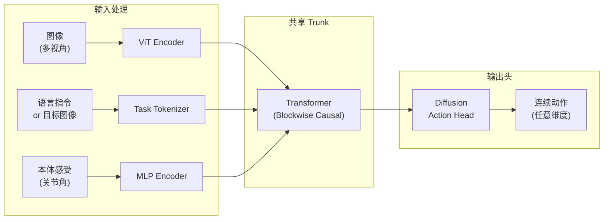

# Octo：开源通用机器人策略 深度精读

> **论文标题**: Octo: An Open-Source Generalist Robot Policy  
> **作者**: Octo Model Team (Dibya Ghosh, Homer Walke, Karl Pertsch 等)  
> **机构**: UC Berkeley RAIL Lab, Stanford  
> **发表**: CoRL 2024 (原 arXiv: 2405.12213)  
> **代码**: https://github.com/octo-models/octo  
> **权重**: https://huggingface.co/rail-berkeley/octo-base

**标签**: `#预训练模型` `#通用策略` `#Transformer` `#扩散策略` `#开源` `#Octo`

**知识链接**：
- [Open X-Embodiment 数据集](./011_OpenX_大规模跨体机器人数据集与RTX模型) — Octo 的训练数据来源
- [扩散模型 DDPM](/前置知识/000b_前置知识_扩散模型DDPM) — Octo 的 action head 使用扩散去噪
- [机器人模仿学习综述](/论文综述/S02_机器人模仿学习综述) — 模仿学习的基本框架
- [视觉-语言-动作模型 VLA 综述](/论文综述/S03_视觉语言动作模型VLA综述) — VLA 路线对比

---

## 一、背景与动机

### 1.1 预训练策略的空白

2024 年初，NLP 有 GPT/LLaMA，CV 有 CLIP/DINOv2——但机器人操作领域没有一个公认的**开源预训练策略**可以拿来直接用或微调。

之前的尝试要么闭源（RT-2，55B，Google 内部），要么只在小数据集上训练（BridgeData V2 的 baseline 模型）。研究者想在新机器人上快速部署一个还不错的策略，必须从头训练。

### 1.2 Octo 的定位

Octo 的目标是做**机器人操作的 "LLaMA"**：

> 一个开源的、在大规模数据上预训练好的通用策略。你可以零样本部署到新机器人，也可以用少量数据（~100 条示教）快速微调适配。

核心设计约束：
- **灵活的输入**：支持单摄像头/多摄像头/手眼/第三人称，支持语言指令或目标图像
- **灵活的输出**：不绑定特定动作空间，能适配不同维度的动作
- **高效微调**：在消费级 GPU 上 5 小时内完成微调

### 1.3 核心贡献

1. **架构设计**：Transformer trunk + 可插拔的 observation tokenizer + diffusion action head
2. **大规模预训练**：在 OXE 数据集的 800k 轨迹上训练（当时最大）
3. **微调范式**：证明预训练+少量微调 >> 从头训练
4. **完全开源**：代码、权重、微调脚本全部公开

---

## 二、模型架构

### 2.1 整体设计

Octo 的架构可以分为三个模块：

### 2.2 Observation Tokenizer

Octo 需要处理**异构输入**——有的机器人有两个摄像头，有的只有一个；有的有手腕摄像头，有的没有。

解决方案：**模块化的 tokenizer**。

- **图像**：每张图像通过一个小 ViT 编码为一组 token（如 16 个 token per 视角）
- **语言**：用预训练语言模型编码为 token 序列
- **本体感受**：通过 MLP 映射为固定数量的 token

不同输入的 token 拼接起来送入 Transformer trunk。如果某个输入不存在（如没有手腕摄像头），对应的 token 位置置零或 mask 掉。

### 2.3 Blockwise Causal Transformer

Trunk 是一个标准 Transformer，但 attention mask 设计为 **blockwise causal**：

$$
\text{Attn}(Q, K, V) = \text{softmax}\left(\frac{QK^T}{\sqrt{d_k}} + M\right)V
$$

其中 mask $M$ 的规则是：
- **同一时间步内**的所有 token 互相可见（双向注意力）
- **跨时间步**只能看过去（因果注意力）

这兼顾了"同一帧内图像和本体感受需要融合"和"时间维度需要因果性"。

### 2.4 Diffusion Action Head

输出不是直接回归一个动作向量，而是用**扩散去噪**的方式生成动作：

$$
a_0 = \text{Denoise}(a_T, c; \theta_{\text{head}})
$$

**为什么用扩散而不是直接回归？**

1. **多模态动作分布**：真实操作中，同一个状态下可能有多种合理动作（从左边绕过 vs 从右边绕过）。MSE 回归会取平均，导致"不左不右"的错误动作；扩散可以采样不同模态
2. **动作维度灵活**：扩散头输出的维度可以在微调时调整，不需要改 trunk
3. **action chunk 支持**：可以一次性预测未来多步动作（如 4 步），通过扩散生成整个 chunk

去噪步数在推理时通常设为 5-10 步（DDIM 加速），延迟在可接受范围。

### 2.5 模型规模

| 变体 | 参数量 | ViT 大小 | Trunk 层数 |
|------|-------|---------|----------|
| Octo-Small | 27M | ViT-S | 12 层 |
| Octo-Base | 93M | ViT-B | 24 层 |

相比 RT-2 的 55B 参数，Octo 轻量得多，可以在单张消费级 GPU 上运行。

---

## 三、预训练与微调

### 3.1 预训练数据

Octo 在 Open X-Embodiment 的一个子集上训练：
- **约 800k 轨迹**
- 涵盖 9 种机器人体态
- 数据通过重要性采样平衡不同数据源

### 3.2 微调范式

微调时冻结或部分冻结 trunk，只训练 action head 和少量适配层：

1. **换 action head**：新机器人的动作维度可能不同，直接换一个新的 diffusion head
2. **加新的 observation tokenizer**：如果新机器人有额外传感器，加对应的 tokenizer
3. **少量数据微调**：100 条示教、5 小时训练、单张 A100

**代入数字的例子**：假设你有一个新的 xArm 机器人，6DOF + gripper = 7 维动作。你：
1. 加载 Octo-Base 预训练权重
2. 替换 action head 为 7 维输出
3. 收集 100 条"抓杯子"的示教
4. 微调 5 小时

结果通常远好于用同样 100 条数据从头训练一个 Diffusion Policy。

### 3.3 为什么预训练有效？

Octo trunk 在大规模训练中学到了：
- **视觉理解**：识别物体、理解空间关系
- **语言对齐**：把"pick up the red mug"映射到正确的视觉区域
- **运动先验**：接近物体→对准→抓取的高层动作模式

这些知识在不同机器人之间是共享的，微调只需要适配低层动力学差异。

---

## 四、实验结果

### 4.1 零样本泛化

在 BridgeData V2 的 WidowX 机器人上，Octo 预训练模型零样本（不微调）就能完成简单的 pick-and-place 任务，成功率约 40-60%。

### 4.2 微调后的性能

在多个真实机器人平台上微调后对比：

| 方法 | Franka | WidowX | ALOHA |
|------|--------|--------|-------|
| 从头训练 Diffusion Policy | 45% | 52% | 38% |
| Octo 微调 (100 demos) | **68%** | **71%** | **57%** |

微调后平均提升 ~20% 绝对成功率。

### 4.3 数据效率

Octo 的数据效率优势在小数据量时尤为明显：
- 10 条示教：从头训练基本不可用；Octo 微调已有 30+% 成功率
- 50 条示教：从头训练 20%；Octo 微调 50%+
- 100 条示教：差距缩小但仍显著

---

## 五、总结与对比

| 维度 | Octo | RT-2-X | OpenVLA |
|------|------|--------|---------|
| 参数量 | 27M/93M | 55B | 7B |
| 开源 | ✅ | ❌ | ✅ |
| 动作表示 | 连续（扩散） | 离散 token | 离散 token |
| 训练数据 | 800k (OXE 子集) | OXE 全集 | 970k (OXE) |
| 微调灵活性 | 极高 | 未公开 | 中等 |
| 推理速度 | 快（93M） | 慢（55B） | 中等（7B） |

Octo 的核心优势是**轻量 + 灵活 + 完全开源**，适合资源有限的研究者快速适配新平台。

---

## 延伸阅读

- [Open X-Embodiment 数据集](./011_OpenX_大规模跨体机器人数据集与RTX模型) — Octo 的训练数据
- [OpenVLA：开源 VLA 模型](./015_OpenVLA_开源视觉语言动作模型) — 另一条路线：VLM 微调
- [π₀：Physical Intelligence 基础模型](./014_Pi0_通用机器人基础模型) — 工业级的大规模方案
- [HPT：异构预训练 Transformer](./016_HPT_异构预训练Transformer) — 处理异构体态的另一种方式
