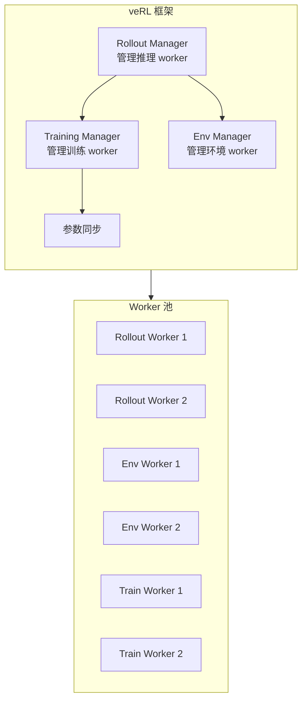
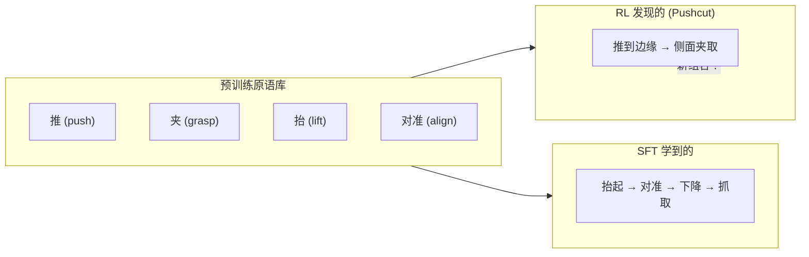

# SimpleVLA-RL：可扩展 VLA RL 训练 深度精读

> **论文标题**: Scaling VLA Training via Reinforcement Learning  
> **作者**: Qingwen Bu, Jia Zeng, Bangjun Wang, et al.  
> **机构**: Shanghai AI Lab, Tsinghua University, CUHK  
> **发表**: arXiv:2509.09674, ICLR 2026  
> **代码**: https://github.com/SimpleVLA/SimpleVLA-RL

**标签**: `#VLA` `#强化学习` `#PPO` `#veRL` `#pushcut` `#可扩展` `#新行为涌现`

**知识链接**：
- [策略梯度与 PPO](/前置知识/000a_前置知识_策略梯度与PPO) — PPO 的核心机制
- [动作 Token 化与自回归策略](/前置知识/000l_前置知识_动作Token化与自回归策略) — VLA 动作表示
- [行为克隆与 RL 微调范式](/前置知识/000d_前置知识_行为克隆与RL微调范式) — SFT → RL 的范式
- [VLA 模型的 RL 后训练综述](/论文综述/S06_VLA模型的RL后训练综述) — VLA + RL 全景图
- [VLA-RL 精读](./006_VLA_RL_PPO直接训练自回归VLA) — 对比：另一种 PPO 训练 VLA 的方案

---

## 一、背景与动机

### 1.1 VLA RL 训练的工程瓶颈

训练 7B 参数的 VLA 做强化学习，计算需求巨大：

| 组件 | 计算需求 | 瓶颈 |
|------|---------|------|
| Rollout（推理） | 每步要跑 7B 模型 forward | GPU 显存 + 推理延迟 |
| 环境交互 | 物理仿真渲染 | CPU/GPU 并行度 |
| 训练更新 | 7B 模型反向传播 | 显存 + 通信 |
| Critic（如 PPO） | 额外一个 7B 模型 | 显存翻倍 |

现有框架的问题：
- **OpenRLHF**：为 LLM RLHF 设计，不支持环境交互
- **VLA-RL 自建系统**：能跑但扩展性差，改环境或模型很痛苦
- **RIPT-VLA**：工程简洁但不支持多 GPU 并行 rollout

### 1.2 SimpleVLA-RL 的核心贡献

SimpleVLA-RL 基于 **veRL**（Volcano Engine RL，字节跳动开源的大模型 RL 框架）构建，将其扩展到支持 VLA + 机器人仿真环境的闭环训练。

**三大贡献**：
1. **工程框架**：首个将 veRL 适配到 VLA 机器人训练的开源方案
2. **Pushcut 发现**：RL 训练中涌现出全新的操作行为（不在训练数据中！）
3. **实验验证**：在真实机器人上验证 RL 训练的 VLA 超越纯 SFT

### 1.3 贯穿全文的例子

> **场景**：桌面机械臂执行 pick-and-place 任务——"把罐头推到桌子边缘并抓住它"。
>
> SFT 数据中，人类示教的标准策略是"从上方直接抓取罐头"。但 RL 训练后，策略发现了一种全新的方式："先用手掌侧面把罐头推到桌子边缘（pushcut），然后从边缘夹取"——**这种行为从未出现在训练数据中**。

---

## 二、方法：基于 veRL 的 VLA RL 框架

### 2.1 veRL 框架简介

veRL 是字节跳动为大模型 RLHF 开发的分布式 RL 框架。核心设计理念：

**核心思想**：将 RL 训练的三个阶段（rollout、环境交互、训练更新）解耦为独立的 worker 池，通过异步调度最大化 GPU 利用率。

### 2.2 SimpleVLA-RL 对 veRL 的扩展

veRL 原本只支持文本生成（LLM RLHF）。SimpleVLA-RL 做了以下适配：

**扩展 1：环境交互 Worker**

原 veRL 的 "environment" 是 reward model（给文本打分）。SimpleVLA-RL 替换为真正的物理仿真环境：

$$
\text{veRL 原版}: \quad \text{text} \xrightarrow{\text{reward model}} r \in \mathbb{R}
$$
$$
\text{SimpleVLA-RL}: \quad (o_t, a_t) \xrightarrow{\text{physics sim}} (o_{t+1}, r_t, \text{done})
$$

**扩展 2：多模态输入处理**

LLM 只处理 text token。VLA 需要处理图像 + 文本。SimpleVLA-RL 在 rollout worker 中集成了图像编码器（SigLIP + DINOv2）：

$$
\text{输入} = \text{ViT}(o_t) \oplus \text{Tokenize}(\text{instruction})
$$

**扩展 3：Action Chunking 支持**

VLA 模型通常一次预测多步动作（action chunk），而不是单步。SimpleVLA-RL 支持 chunk-level 的 log-prob 计算：

$$
\log \pi_\theta(\mathbf{a}_{t:t+H} | s_t) = \sum_{h=0}^{H-1} \sum_{i=1}^{d} \log \pi_\theta(a_{t+h, i} | s_t, a_{t:t+h-1})
$$

**逐项拆解**：
- $H$：action chunk 的长度（如 4 步）
- $d$：每步动作的维度数（如 7 维：xyz + rotation + gripper）
- $a_{t+h, i}$：chunk 中第 $h$ 步的第 $i$ 维动作 token
- 外层求和：跨 chunk 内的步数
- 内层求和：跨动作维度

### 2.3 PPO 训练流程

SimpleVLA-RL 使用标准 PPO（详见 [策略梯度与 PPO](/前置知识/000a_前置知识_策略梯度与PPO)），但在工程上做了大量优化：

$$
\mathcal{L}_{\text{PPO}}(\theta) = -\mathbb{E}_t\left[\min\left(r_t(\theta)\hat{A}_t, \; \text{clip}(r_t(\theta), 1-\epsilon, 1+\epsilon)\hat{A}_t\right)\right] + c_1 \mathcal{L}_{\text{VF}} - c_2 H(\pi_\theta)
$$

**逐项拆解**：
- $r_t(\theta) = \frac{\pi_\theta(a_t|s_t)}{\pi_{\theta_{\text{old}}}(a_t|s_t)}$：概率比值
- $\hat{A}_t$：GAE 计算的 advantage
- $\text{clip}(\cdot)$：限制更新幅度在 $[1-\epsilon, 1+\epsilon]$
- $\mathcal{L}_{\text{VF}} = (V_\phi(s_t) - V_t^{\text{target}})^2$：Critic（Value function）的损失
- $H(\pi_\theta) = -\sum_a \pi_\theta(a|s) \log \pi_\theta(a|s)$：策略熵，鼓励探索
- $c_1 = 0.5, c_2 = 0.01$：平衡系数

**代入数字的例子**：

假设机械臂在某个状态 $s_t$ 下：
- 旧策略选择"向左移动"的概率：$\pi_{\theta_{\text{old}}}(a_{\text{left}}|s_t) = 0.3$
- 新策略选择"向左移动"的概率：$\pi_{\theta}(a_{\text{left}}|s_t) = 0.6$
- GAE advantage：$\hat{A}_t = +1.5$（"向左移动"是好动作）

计算：
- $r_t = 0.6/0.3 = 2.0$（概率翻倍）
- 未裁剪项：$2.0 \times 1.5 = 3.0$
- 裁剪项：$\text{clip}(2.0, 0.8, 1.2) \times 1.5 = 1.2 \times 1.5 = 1.8$
- $\min(3.0, 1.8) = 1.8$ → 更新被限制

### 2.4 分布式并行策略

SimpleVLA-RL 的核心工程贡献——高效的多 GPU 并行：

| 阶段 | 并行策略 | GPU 分配 |
|------|---------|---------|
| Rollout 推理 | Tensor Parallel（模型切片） | 4 GPU per model shard |
| 环境仿真 | Data Parallel（多环境并行） | 8 GPU 各跑独立环境 |
| PPO 训练 | FSDP（全分片数据并行） | 所有 GPU 参与 |
| 参数同步 | All-Reduce | 自动 |

**关键优化**：Rollout 和环境交互可以**流水线化**——当一批环境在等待动作时，另一批环境的观测正在被模型处理。这减少了 GPU 空闲时间。

---

## 三、核心发现：Pushcut 现象

### 3.1 什么是 Pushcut

**Pushcut** 是 SimpleVLA-RL 在 RL 训练过程中发现的全新行为模式：

> 机器人不再像人类示教那样"从上方直接抓取物体"，而是**先把物体推到桌子边缘，利用边缘的几何约束，再从侧面/下方夹取**。

这种行为模式在所有 SFT 训练数据中**从未出现过**——它完全是 RL 探索 + 奖励信号自发涌现的。

### 3.2 为什么 Pushcut 有效

| 策略 | 描述 | 成功率 | 原因 |
|------|------|--------|------|
| 人类示教（top-down grasp） | 从上方对准物体中心抓取 | 70% | 需要精确的位置对准 |
| **Pushcut（RL 发现）** | 先推到边缘再夹取 | **90%+** | 边缘提供几何约束，降低对准要求 |

**直觉**：把罐头推到桌子边缘后，罐头只能在边缘的一个狭窄空间内——这消除了水平方向的位置不确定性。机器人只需要从侧面夹取，不再需要精确的垂直对准。

**这是"智能"的表现**：RL 策略发现了一个人类没有想到（或不会用）的更鲁棒的操作策略。

### 3.3 Pushcut 涌现的条件

论文通过消融实验发现 pushcut 涌现需要以下条件：

1. **足够的探索温度**：采样温度 < 1.0 时从不涌现（探索不足）
2. **足够的训练时间**：通常在 50+ RL iterations 后才开始出现
3. **合适的奖励设计**：只有 sparse binary reward（成功/失败）时最容易涌现——dense reward 反而会引导策略走"人类预期的路径"

**代入数字**：
- 采样温度 $\tau = 1.5$：pushcut 在 60% 的训练 run 中涌现
- 采样温度 $\tau = 1.0$：pushcut 在 15% 的 run 中涌现
- 采样温度 $\tau = 0.5$：pushcut 从未涌现

### 3.4 Pushcut 的理论意义

Pushcut 现象说明了两个深刻的事情：

1. **RL 可以超越人类示教**：SFT 的天花板是训练数据中最好的行为；RL 没有这个天花板——它可以发现完全新的策略
2. **VLA 预训练提供了丰富的行为原语**：VLA 在大规模数据上预训练时，"推"和"夹"都是它学过的原语。RL 的作用是发现了这些原语的**新组合方式**

---

## 四、实验结果

### 4.1 仿真实验（LIBERO + MetaWorld）

| 方法 | LIBERO 平均 | MetaWorld 平均 | 训练时间 |
|------|------------|---------------|---------|
| SFT baseline | 76.5% | 68.2% | — |
| VLA-RL (PPO，自建框架) | 81.0% | 74.8% | 48h (4×A100) |
| RIPT-VLA (RLOO) | 93.6% | — | 24h (8×A100) |
| **SimpleVLA-RL (PPO，veRL)** | **94.2%** | **87.5%** | **18h (8×A100)** |

**关键发现**：
- SimpleVLA-RL 达到了与 RIPT-VLA 相当甚至更好的性能
- 但训练时间只有 VLA-RL 的 37.5%——veRL 框架的工程效率优势
- 在 MetaWorld 上大幅超越 VLA-RL（+12.7%）

### 4.2 真实机器人实验

SimpleVLA-RL 在真实 Franka Panda 机器人上验证：

| 任务 | SFT 成功率 | + RL 成功率 | 提升 |
|------|-----------|-----------|------|
| 抓取杯子 | 75% | 92% | +17% |
| 推物体到指定区域 | 60% | 85% | +25% |
| 叠放积木 | 40% | 72% | +32% |
| **平均** | **58.3%** | **83.0%** | **+24.7%** |

**真实机器人 RL 的额外挑战**：
- 每条轨迹耗时 ~15 秒（vs 仿真 <1 秒）
- 需要安全约束（关节极限、碰撞检测）
- 奖励需要外部感知系统（用额外相机判断成功）

SimpleVLA-RL 在真实世界使用了 **sim-to-real transfer** + **少量在线 fine-tuning** 的混合策略。

### 4.3 Scaling 特性

SimpleVLA-RL 验证了 VLA RL 训练的 scaling behavior：

| GPU 数量 | 并行环境数 | 吞吐量 (轨迹/小时) | 相对加速比 |
|---------|-----------|-------------------|----------|
| 2 | 8 | 120 | 1× |
| 4 | 16 | 230 | 1.92× |
| 8 | 32 | 440 | 3.67× |
| 16 | 64 | 820 | 6.83× |

**结论**：接近线性扩展——GPU 翻倍，吞吐量接近翻倍。这是 veRL 框架的异步调度带来的效率。

### 4.4 消融实验

| 配置 | LIBERO 平均成功率 |
|------|-----------------|
| **完整 SimpleVLA-RL** | **94.2%** |
| 去掉 action chunk（单步预测） | 86.7%（-7.5%） |
| 去掉 Critic warmup | 79.3%（-14.9%） |
| 采样温度 0.5（低探索） | 82.1%（-12.1%） |
| 采样温度 2.0（过高探索） | 88.4%（-5.8%） |
| 学习率 ×10 | 崩溃（<10%） |
| 去掉 KL 约束 | 85.6%（-8.6%） |

---

## 五、技术深入：veRL 适配细节

### 5.1 Rollout Worker 的图像处理

VLA 的 rollout 比 LLM 复杂——每步需要处理新的图像观测。SimpleVLA-RL 的处理流程：

$$
h_t = \text{VLA}(\text{concat}[\text{SigLIP}(o_t), \text{DINOv2}(o_t), \text{Embed}(\text{instr})])
$$

**逐项拆解**：
- $o_t$：当前时间步的 RGB 图像（224×224）
- $\text{SigLIP}(o_t)$：语义级视觉特征（捕获"是什么"）
- $\text{DINOv2}(o_t)$：空间级视觉特征（捕获"在哪里"）
- $\text{Embed}(\text{instr})$：语言指令的 token embedding
- $\text{concat}[\cdot]$：拼接为统一的输入序列
- $h_t$：VLA transformer 的隐藏状态输出

### 5.2 GAE 在 Action Chunk 上的计算

标准 GAE 假设每步一个动作。当使用 action chunk（每次预测 $H$ 步）时，需要调整：

$$
\hat{A}_{t:t+H} = \sum_{l=0}^{L}(\gamma\lambda)^l \delta_{t+lH}
$$

$$
\delta_{t} = \left(\sum_{h=0}^{H-1} \gamma^h r_{t+h}\right) + \gamma^H V(s_{t+H}) - V(s_t)
$$

**逐项拆解**：
- $H$：chunk 长度
- 内层求和：chunk 内所有步的折扣 reward 总和
- $\gamma^H V(s_{t+H})$：chunk 结束后下一个状态的 value（经过 $H$ 步折扣）
- $V(s_t)$：chunk 开始时的 value 估计
- 这等价于把 $H$ 步"压缩"为一个"宏动作"，在宏动作级别计算 GAE

### 5.3 KL 约束的实现

为了防止策略偏离 SFT baseline 太远（参见 [KL 散度与策略约束](/前置知识/000j_前置知识_KL散度与策略约束)）：

$$
\mathcal{L}_{\text{KL}} = \beta \cdot \mathbb{E}_t\left[D_{\text{KL}}\left(\pi_\theta(\cdot|s_t) \| \pi_{\text{ref}}(\cdot|s_t)\right)\right]
$$

SimpleVLA-RL 使用自适应 $\beta$：
- 如果当前 KL > 目标 KL：增大 $\beta$（加强约束）
- 如果当前 KL < 目标 KL：减小 $\beta$（放松约束）

目标 KL 设为 0.05（经验值）。

---

## 六、和其他工作的对比

### 6.1 和 VLA-RL 的对比

| 维度 | SimpleVLA-RL | VLA-RL |
|------|-------------|--------|
| RL 框架 | veRL（成熟开源） | 自建 |
| 并行化 | 异步 rollout + 流水线 | 同步 |
| 环境支持 | 多种（LIBERO, MetaWorld, 真实） | 主要 LIBERO |
| Action chunk | 原生支持 | 单步为主 |
| 训练效率 | 18h / 8×A100 | 48h / 4×A100 |
| 真实机器人 | ✓ | ✗ |
| 新行为涌现 | ✓ (pushcut) | 未报道 |

### 6.2 和 RIPT-VLA 的对比

| 维度 | SimpleVLA-RL | RIPT-VLA |
|------|-------------|----------|
| RL 算法 | PPO（有 Critic） | RLOO/GRPO（无 Critic） |
| 密集奖励 | GAE + Critic | 纯 trajectory-level |
| 工程复杂度 | 高（veRL 框架） | 低（极简） |
| 最终性能 | 94.2% | 93.6% |
| Few-shot | 未测试 | 极强（1-shot → 97%） |
| 可扩展性 | 极强（线性扩展） | 中等 |

### 6.3 SimpleVLA-RL 的定位

SimpleVLA-RL 不追求算法创新（用的是标准 PPO），而是追求**工程效率和可扩展性**。它的核心价值是：
- 证明了 veRL 框架可以无缝扩展到机器人领域
- 发现了 pushcut 等新行为涌现（RL 的独特价值）
- 提供了真实机器人上的验证

---

## 七、局限性与讨论

### 7.1 Pushcut 的可复现性

Pushcut 涌现具有随机性——不是每次训练都会出现。论文报道在特定超参数设置下有 60% 的概率涌现。这意味着：
- 没有可靠的方法"引导"特定新行为的涌现
- 需要多次 training run 才能发现最好的策略

### 7.2 Critic 的必要性讨论

SimpleVLA-RL 使用 PPO（有 Critic），而 RIPT-VLA 证明无 Critic 也能达到类似效果。论文认为 Critic 在以下场景仍有价值：
- 长序列任务（50+ 步）：GAE 的 step-level advantage 比 trajectory-level 更精细
- 非 binary reward：当环境提供连续奖励时，Critic 能更好地利用

### 7.3 对 veRL 的依赖

使用 veRL 的好处是工程成熟，但也意味着：
- 需要适配 veRL 的 API（有学习成本）
- 环境需要包装成 veRL 兼容的接口
- 调试分布式问题较困难

---

## 八、个人评价

### 8.1 核心价值

SimpleVLA-RL 最大的贡献不是算法而是**生态系统**——它证明了 LLM RL 的成熟框架（veRL）可以直接迁移到机器人领域。这降低了做 VLA RL 研究的工程门槛。

### 8.2 Pushcut 的启示

Pushcut 现象是整篇文章最令人兴奋的部分。它说明：
- RL 不只是"让 SFT 更好"——它可以发现全新的行为模式
- 这些新行为可能比人类设计的策略更优
- VLA 的预训练提供了足够丰富的行为原语，等待被组合

### 8.3 实践建议

- 如果你有 8+ GPU 且需要大规模 VLA RL 训练：选 SimpleVLA-RL
- 如果你只有 1-2 GPU 且优先简洁：选 RIPT-VLA
- 如果你关心发现新行为：提高采样温度（1.5+），用 sparse reward

---

## 延伸阅读

- [策略梯度与 PPO](/前置知识/000a_前置知识_策略梯度与PPO) ← PPO 核心机制
- [动作 Token 化与自回归策略](/前置知识/000l_前置知识_动作Token化与自回归策略) ← VLA 动作表示
- [VLA-RL 精读](./006_VLA_RL_PPO直接训练自回归VLA) ← 另一种 PPO 训练 VLA 方案
- [RIPT-VLA 精读](./007_RIPT_VLA_无Critic的VLA后训练) ← 无 Critic 路线的对比
- [VLA 模型的 RL 后训练综述](/论文综述/S06_VLA模型的RL后训练综述) ← VLA + RL 全景
