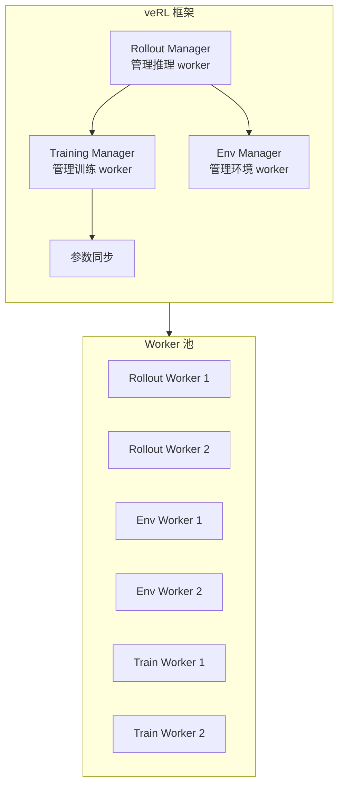
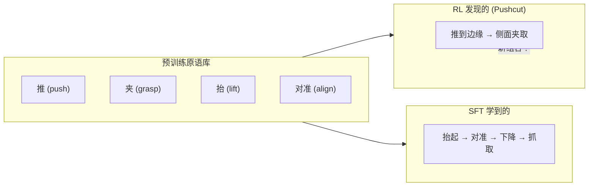

# SimpleVLA-RL：可扩展 VLA RL 训练 深度精读

> **论文标题**: Scaling VLA Training via Reinforcement Learning  
> **作者**: Qingwen Bu, Jia Zeng, Bangjun Wang, et al.  
> **机构**: Shanghai AI Lab, Tsinghua University, CUHK  
> **发表**: arXiv:2509.09674, ICLR 2026  
> **代码**: https://github.com/SimpleVLA/SimpleVLA-RL

**标签**: `#VLA` `#强化学习` `#PPO` `#veRL` `#pushcut` `#可扩展` `#新行为涌现`

**知识链接**：
- [策略梯度与 PPO](/前置知识/000a_前置知识_策略梯度与PPO) — PPO 的核心机制
- [动作 Token 化与自回归策略](/前置知识/000l_前置知识_动作Token化与自回归策略) — VLA 动作表示
- [行为克隆与 RL 微调范式](/前置知识/000d_前置知识_行为克隆与RL微调范式) — SFT → RL 的范式
- [VLA 模型的 RL 后训练综述](/论文综述/S06_VLA模型的RL后训练综述) — VLA + RL 全景图
- [VLA-RL 精读](./006_VLA_RL_PPO直接训练自回归VLA) — 对比：另一种 PPO 训练 VLA 的方案

---

## 一、背景与动机

### 1.1 VLA RL 训练的工程瓶颈

训练 7B 参数的 VLA 做强化学习，计算需求巨大：

| 组件 | 计算需求 | 瓶颈 |
|------|---------|------|
| Rollout（推理） | 每步要跑 7B 模型 forward | GPU 显存 + 推理延迟 |
| 环境交互 | 物理仿真渲染 | CPU/GPU 并行度 |
| 训练更新 | 7B 模型反向传播 | 显存 + 通信 |
| Critic（如 PPO） | 额外一个 7B 模型 | 显存翻倍 |

现有框架的问题：
- **OpenRLHF**：为 LLM RLHF 设计，不支持环境交互
- **VLA-RL 自建系统**：能跑但扩展性差，改环境或模型很痛苦
- **RIPT-VLA**：工程简洁但不支持多 GPU 并行 rollout

### 1.2 SimpleVLA-RL 的核心贡献

SimpleVLA-RL 基于 **veRL**（Volcano Engine RL，字节跳动开源的大模型 RL 框架）构建，将其扩展到支持 VLA + 机器人仿真环境的闭环训练。

**三大贡献**：
1. **工程框架**：首个将 veRL 适配到 VLA 机器人训练的开源方案
2. **Pushcut 发现**：RL 训练中涌现出全新的操作行为（不在训练数据中！）
3. **实验验证**：在真实机器人上验证 RL 训练的 VLA 超越纯 SFT

### 1.3 贯穿全文的例子

> **场景**：桌面机械臂执行 pick-and-place 任务——"把罐头推到桌子边缘并抓住它"。
>
> SFT 数据中，人类示教的标准策略是"从上方直接抓取罐头"。但 RL 训练后，策略发现了一种全新的方式："先用手掌侧面把罐头推到桌子边缘（pushcut），然后从边缘夹取"——**这种行为从未出现在训练数据中**。

---

## 二、方法：基于 veRL 的 VLA RL 框架

### 2.1 veRL 框架简介

veRL 是字节跳动为大模型 RLHF 开发的分布式 RL 框架。核心设计理念：

```mermaid
flowchart TB
    subgraph veRL["veRL 框架"]
        direction TB
        RM["Rollout Manager<br/>管理推理 worker"] --> TM["Training Manager<br/>管理训练 worker"]
        RM --> EM["Env Manager<br/>管理环境 worker"]
        TM --> Sync["参数同步"]
    end
    subgraph Workers["Worker 池"]
        direction LR
        RW1["Rollout Worker 1"] 
        RW2["Rollout Worker 2"]
        EW1["Env Worker 1"]
        EW2["Env Worker 2"]
        TW1["Train Worker 1"]
        TW2["Train Worker 2"]
    end
    veRL --> Workers
```

**核心思想**：将 RL 训练的三个阶段（rollout、环境交互、训练更新）解耦为独立的 worker 池，通过异步调度最大化 GPU 利用率。

### 2.2 SimpleVLA-RL 对 veRL 的扩展

veRL 原本只支持文本生成（LLM RLHF）。SimpleVLA-RL 做了以下适配：

**扩展 1：环境交互 Worker**

原 veRL 的 "environment" 是 reward model（给文本打分）。SimpleVLA-RL 替换为真正的物理仿真环境：

$$
\text{veRL 原版}: \quad \text{text} \xrightarrow{\text{reward model}} r \in \mathbb{R}
$$

**这个公式在做什么**：说明 veRL 原本的"环境"只是一个打分器——输入一段文本，输出一个标量奖励，没有真正的状态转移。

::: details 📐 公式详解（点击展开）

| 子表达式 | 它是谁 | 它在干嘛 |
|---------|--------|---------|
| $\text{text}$ | **唯一的输入** | LLM 生成的一段文本（如一次对话回复） |
| $\xrightarrow{\text{reward model}}$ | **打分动作** | 用一个训练好的 reward model 网络对这段文本评分，这个过程不改变"状态"，只产生一个数 |
| $r \in \mathbb{R}$ | **最终输出** | 一个标量分数，代表这段文本有多好 |

**用人话读**："veRL 原本设计的环境，就是拿一段生成的文本去过一遍打分模型，吐出一个分数，仅此而已——没有'下一个状态'的概念。"

**为什么是这个形式**：LLM RLHF 里没有物理世界的状态转移，"环境交互"本质上退化成"打分"，所以 veRL 原版只需要一个 reward model 接口，比真正的 RL 环境简单得多。
:::

$$
\text{SimpleVLA-RL}: \quad (o_t, a_t) \xrightarrow{\text{physics sim}} (o_{t+1}, r_t, \text{done})
$$

**这个公式在做什么**：说明 SimpleVLA-RL 把 veRL 的"打分器"替换成了真正的物理仿真环境——输入当前观测和动作，输出下一步观测、奖励、以及任务是否结束。

::: details 📐 公式详解（点击展开）

| 子表达式 | 它是谁 | 它在干嘛 |
|---------|--------|---------|
| $(o_t, a_t)$ | **当前局面** | 当前时刻的图像观测 $o_t$ 和机器人执行的动作 $a_t$ |
| $\xrightarrow{\text{physics sim}}$ | **物理引擎推演** | 仿真器根据动力学规律，把当前局面推演到下一时刻 |
| $(o_{t+1}, r_t, \text{done})$ | **推演结果三件套** | 下一步的新观测、这一步拿到的奖励、以及任务是否终止的标志 |

**用人话读**："机器人在当前画面下做了一个动作，物理仿真器算出'接下来会看到什么画面、这一步得多少分、任务是不是结束了'。"

**为什么是这个形式**：这正是标准 MDP（马尔可夫决策过程）的状态转移接口——真正的机器人 RL 必须有状态转移和终止信号，这是 SimpleVLA-RL 对 veRL 做的第一个关键工程扩展，把"打分器"换成了"闭环环境"。
:::

**扩展 2：多模态输入处理**

LLM 只处理 text token。VLA 需要处理图像 + 文本。SimpleVLA-RL 在 rollout worker 中集成了图像编码器（SigLIP + DINOv2）：

$$
\text{输入} = \text{ViT}(o_t) \oplus \text{Tokenize}(\text{instruction})
$$

**这个公式在做什么**：说明 rollout worker 怎么把"图像"和"文字指令"拼成一个统一的输入序列，喂给 VLA 模型。

::: details 📐 公式详解（点击展开）

| 子表达式 | 它是谁 | 它在干嘛 |
|---------|--------|---------|
| $\text{ViT}(o_t)$ | **图像翻译官** | 用视觉 Transformer（ViT，Vision Transformer，一种把图像切成小块再用 Transformer 编码的视觉骨干网络）把图像 $o_t$ 转成一串向量 |
| $\text{Tokenize}(\text{instruction})$ | **文字翻译官** | 把语言指令（如"把罐头推到桌边"）切成 token 序列 |
| $\oplus$ | **拼接工** | 把图像 token 序列和文字 token 序列首尾接起来，变成一条统一序列 |
| $\text{输入}$ | **最终喂给模型的东西** | 拼接后的完整输入序列，直接送进 VLA 的 Transformer |

**用人话读**："把这一帧画面编码成一串向量，把指令文字切成 token，两串拼在一起，就是模型看到的输入。"

**为什么是这个形式**：LLM 的 rollout 只需要处理纯文本 token，而 VLA 每一步都要重新处理一帧新画面——所以 SimpleVLA-RL 必须在 rollout worker 里额外集成图像编码器，并把图像和文本统一成同一种 token 序列格式，才能复用 veRL 原本为纯文本设计的 Transformer 推理流程。
:::

**扩展 3：Action Chunking 支持**

VLA 模型通常一次预测多步动作（action chunk），而不是单步。SimpleVLA-RL 支持 chunk-level 的 log-prob 计算：

$$
\log \pi_\theta(\mathbf{a}_{t:t+H} | s_t) = \sum_{h=0}^{H-1} \sum_{i=1}^{d} \log \pi_\theta(a_{t+h, i} | s_t, a_{t:t+h-1})
$$

**这个公式在做什么**：算出策略一次性预测一整个动作 chunk（连续 $H$ 步动作）的对数概率——把 chunk 拆成一个个动作 token，再把每个 token 的对数概率加起来。

::: details 📐 公式详解（点击展开）

| 子表达式 | 它是谁 | 它在干嘛 |
|---------|--------|---------|
| $\mathbf{a}_{t:t+H}$ | **整个动作包裹** | 一次预测的连续 $H$ 步动作打包在一起（action chunk） |
| $H$ | **包裹大小** | chunk 的长度，比如一次预测未来 4 步动作 |
| $d$ | **每步动作的零件数** | 每一步动作的维度数，如 7 维（xyz 位移 + 旋转 + 夹爪开合） |
| $\log\pi_\theta(a_{t+h,i}\|s_t,a_{t:t+h-1})$ | **单个零件的概率** | chunk 内第 $h$ 步、第 $i$ 维动作 token 的对数概率，条件是之前所有已生成的 token |
| $\sum_{h=0}^{H-1}\sum_{i=1}^d$ | **逐零件累加器** | 先跨每步内的维度求和，再跨 chunk 内的步数求和，把所有 token 的对数概率加总 |

**用人话读**："一个动作 chunk 是好几个时间步、每步好几个维度的 token 拼起来的，把这些 token 各自的对数概率全部加起来，就是整个 chunk 的对数概率。"

**为什么是这个形式**：LLM 每次只生成一个 token、log-prob 只是单个求和；VLA 常常一次预测一个动作 chunk（而不是单步），所以 SimpleVLA-RL 必须把 log-prob 的计算从"单步"扩展成"chunk 内逐步、逐维度"的双重求和，这样才能在 PPO 里正确计算概率比 $r_t(\theta)$。
:::

### 2.3 PPO 训练流程

SimpleVLA-RL 使用标准 PPO（详见 [策略梯度与 PPO](/前置知识/000a_前置知识_策略梯度与PPO)），但在工程上做了大量优化：

$$
\mathcal{L}_{\text{PPO}}(\theta) = -\mathbb{E}_t\left[\min\left(r_t(\theta)\hat{A}_t, \; \text{clip}(r_t(\theta), 1-\epsilon, 1+\epsilon)\hat{A}_t\right)\right] + c_1 \mathcal{L}_{\text{VF}} - c_2 H(\pi_\theta)
$$

**这个公式在做什么**：把"策略要往好动作方向更新但不能跨太大步"、"Critic 打分要准"、"策略别太快变得死板"三个目标合并成一个总损失，一次反向传播同时优化（详见 [策略梯度与 PPO](/前置知识/000a_前置知识_策略梯度与PPO)）。

::: details 📐 公式详解（点击展开）

| 子表达式 | 它是谁 | 它在干嘛 |
|---------|--------|---------|
| $r_t(\theta)=\frac{\pi_\theta(a_t\|s_t)}{\pi_{\theta_{\text{old}}}(a_t\|s_t)}$ | **策略变化倍数计** | 新策略选这个动作的概率 ÷ 旧策略选它的概率 |
| $\text{clip}(r_t(\theta),1-\epsilon,1+\epsilon)\hat A_t$ | **安全绳版本** | 把概率比强行卡在 $[1-\epsilon,1+\epsilon]$ 区间内再乘 advantage，防止更新步子太大 |
| $\min(\cdot,\cdot)$ | **保守裁判** | 在"放开跑"和"卡着安全绳跑"两个版本里取较小的 |
| $c_1\mathcal{L}_{\text{VF}}=c_1(V_\phi(s_t)-V_t^{\text{target}})^2$ | **Critic 体检分** | Value function 预测值和真实目标值的均方误差，权重 $c_1=0.5$ |
| $-c_2H(\pi_\theta)$ | **保持随机的奖励** | 策略熵 $H(\pi_\theta)=-\sum_a\pi_\theta(a\|s)\log\pi_\theta(a\|s)$ 取负号鼓励熵变大，权重 $c_2=0.01$，防止过早收敛成死板策略 |

**用人话读**："总损失 = 用安全绳限制过的策略更新目标 + Critic 打分误差（加权）- 策略保持随机性的奖励（加权），一起做梯度下降。"

**为什么是这个形式**：这是标准 PPO 的组合损失，clip 机制防止单次更新步子过大，Critic 损失让 GAE 用到的 $V_\phi$ 越来越准，熵奖励防止策略过早收敛丢失探索能力——三者缺一不可，详细推导见 [策略梯度与 PPO](/前置知识/000a_前置知识_策略梯度与PPO)。
:::

**代入数字的例子**：

假设机械臂在某个状态 $s_t$ 下：
- 旧策略选择"向左移动"的概率：$\pi_{\theta_{\text{old}}}(a_{\text{left}}|s_t) = 0.3$
- 新策略选择"向左移动"的概率：$\pi_{\theta}(a_{\text{left}}|s_t) = 0.6$
- GAE advantage：$\hat{A}_t = +1.5$（"向左移动"是好动作）

计算：
- $r_t = 0.6/0.3 = 2.0$（概率翻倍）
- 未裁剪项：$2.0 \times 1.5 = 3.0$
- 裁剪项：$\text{clip}(2.0, 0.8, 1.2) \times 1.5 = 1.2 \times 1.5 = 1.8$
- $\min(3.0, 1.8) = 1.8$ → 更新被限制

### 2.4 分布式并行策略

SimpleVLA-RL 的核心工程贡献——高效的多 GPU 并行：

| 阶段 | 并行策略 | GPU 分配 |
|------|---------|---------|
| Rollout 推理 | Tensor Parallel（模型切片） | 4 GPU per model shard |
| 环境仿真 | Data Parallel（多环境并行） | 8 GPU 各跑独立环境 |
| PPO 训练 | FSDP（全分片数据并行） | 所有 GPU 参与 |
| 参数同步 | All-Reduce | 自动 |

**关键优化**：Rollout 和环境交互可以**流水线化**——当一批环境在等待动作时，另一批环境的观测正在被模型处理。这减少了 GPU 空闲时间。

---

## 三、核心发现：Pushcut 现象

### 3.1 什么是 Pushcut

**Pushcut** 是 SimpleVLA-RL 在 RL 训练过程中发现的全新行为模式：

> 机器人不再像人类示教那样"从上方直接抓取物体"，而是**先把物体推到桌子边缘，利用边缘的几何约束，再从侧面/下方夹取**。

这种行为模式在所有 SFT 训练数据中**从未出现过**——它完全是 RL 探索 + 奖励信号自发涌现的。

### 3.2 为什么 Pushcut 有效

| 策略 | 描述 | 成功率 | 原因 |
|------|------|--------|------|
| 人类示教（top-down grasp） | 从上方对准物体中心抓取 | 70% | 需要精确的位置对准 |
| **Pushcut（RL 发现）** | 先推到边缘再夹取 | **90%+** | 边缘提供几何约束，降低对准要求 |

**直觉**：把罐头推到桌子边缘后，罐头只能在边缘的一个狭窄空间内——这消除了水平方向的位置不确定性。机器人只需要从侧面夹取，不再需要精确的垂直对准。

**这是"智能"的表现**：RL 策略发现了一个人类没有想到（或不会用）的更鲁棒的操作策略。

### 3.3 Pushcut 涌现的条件

论文通过消融实验发现 pushcut 涌现需要以下条件：

1. **足够的探索温度**：采样温度 < 1.0 时从不涌现（探索不足）
2. **足够的训练时间**：通常在 50+ RL iterations 后才开始出现
3. **合适的奖励设计**：只有 sparse binary reward（成功/失败）时最容易涌现——dense reward 反而会引导策略走"人类预期的路径"

**代入数字**：
- 采样温度 $\tau = 1.5$：pushcut 在 60% 的训练 run 中涌现
- 采样温度 $\tau = 1.0$：pushcut 在 15% 的 run 中涌现
- 采样温度 $\tau = 0.5$：pushcut 从未涌现

### 3.4 Pushcut 的理论意义

Pushcut 现象说明了两个深刻的事情：

1. **RL 可以超越人类示教**：SFT 的天花板是训练数据中最好的行为；RL 没有这个天花板——它可以发现完全新的策略
2. **VLA 预训练提供了丰富的行为原语**：VLA 在大规模数据上预训练时，"推"和"夹"都是它学过的原语。RL 的作用是发现了这些原语的**新组合方式**

```mermaid
flowchart LR
    subgraph SFT["SFT 学到的"]
        A["抬起 → 对准 → 下降 → 抓取"]
    end
    subgraph RL["RL 发现的 (Pushcut)"]
        B["推到边缘 → 侧面夹取"]
    end
    subgraph Primitives["预训练原语库"]
        P1["推 (push)"]
        P2["夹 (grasp)"]
        P3["抬 (lift)"]
        P4["对准 (align)"]
    end
    Primitives --> SFT
    Primitives --> RL
    RL -.->|"新组合！"| B
```

---

## 四、实验结果

### 4.1 仿真实验（LIBERO + MetaWorld）

| 方法 | LIBERO 平均 | MetaWorld 平均 | 训练时间 |
|------|------------|---------------|---------|
| SFT baseline | 76.5% | 68.2% | — |
| VLA-RL (PPO，自建框架) | 81.0% | 74.8% | 48h (4×A100) |
| RIPT-VLA (RLOO) | 93.6% | — | 24h (8×A100) |
| **SimpleVLA-RL (PPO，veRL)** | **94.2%** | **87.5%** | **18h (8×A100)** |

**关键发现**：
- SimpleVLA-RL 达到了与 RIPT-VLA 相当甚至更好的性能
- 但训练时间只有 VLA-RL 的 37.5%——veRL 框架的工程效率优势
- 在 MetaWorld 上大幅超越 VLA-RL（+12.7%）

### 4.2 真实机器人实验

SimpleVLA-RL 在真实 Franka Panda 机器人上验证：

| 任务 | SFT 成功率 | + RL 成功率 | 提升 |
|------|-----------|-----------|------|
| 抓取杯子 | 75% | 92% | +17% |
| 推物体到指定区域 | 60% | 85% | +25% |
| 叠放积木 | 40% | 72% | +32% |
| **平均** | **58.3%** | **83.0%** | **+24.7%** |

**真实机器人 RL 的额外挑战**：
- 每条轨迹耗时 ~15 秒（vs 仿真 <1 秒）
- 需要安全约束（关节极限、碰撞检测）
- 奖励需要外部感知系统（用额外相机判断成功）

SimpleVLA-RL 在真实世界使用了 **sim-to-real transfer** + **少量在线 fine-tuning** 的混合策略。

### 4.3 Scaling 特性

SimpleVLA-RL 验证了 VLA RL 训练的 scaling behavior：

| GPU 数量 | 并行环境数 | 吞吐量 (轨迹/小时) | 相对加速比 |
|---------|-----------|-------------------|----------|
| 2 | 8 | 120 | 1× |
| 4 | 16 | 230 | 1.92× |
| 8 | 32 | 440 | 3.67× |
| 16 | 64 | 820 | 6.83× |

**结论**：接近线性扩展——GPU 翻倍，吞吐量接近翻倍。这是 veRL 框架的异步调度带来的效率。

### 4.4 消融实验

| 配置 | LIBERO 平均成功率 |
|------|-----------------|
| **完整 SimpleVLA-RL** | **94.2%** |
| 去掉 action chunk（单步预测） | 86.7%（-7.5%） |
| 去掉 Critic warmup | 79.3%（-14.9%） |
| 采样温度 0.5（低探索） | 82.1%（-12.1%） |
| 采样温度 2.0（过高探索） | 88.4%（-5.8%） |
| 学习率 ×10 | 崩溃（<10%） |
| 去掉 KL 约束 | 85.6%（-8.6%） |

---

## 五、技术深入：veRL 适配细节

### 5.1 Rollout Worker 的图像处理

VLA 的 rollout 比 LLM 复杂——每步需要处理新的图像观测。SimpleVLA-RL 的处理流程：

$$
h_t = \text{VLA}(\text{concat}[\text{SigLIP}(o_t), \text{DINOv2}(o_t), \text{Embed}(\text{instr})])
$$

**这个公式在做什么**：把同一帧图像的两种不同视觉特征（语义 + 空间）和语言指令拼在一起，喂给 VLA 的 Transformer，算出当前时刻的隐藏表示。

::: details 📐 公式详解（点击展开）

| 子表达式 | 它是谁 | 它在干嘛 |
|---------|--------|---------|
| $\text{SigLIP}(o_t)$ | **"这是什么"的眼睛** | 语义级视觉特征提取器，捕获图像里物体的类别/语义信息 |
| $\text{DINOv2}(o_t)$ | **"在哪里"的眼睛** | 空间级视觉特征提取器，捕获物体的位置、几何结构信息 |
| $\text{Embed}(\text{instr})$ | **指令翻译官** | 把语言指令转成 token embedding 向量 |
| $\text{concat}[\cdot]$ | **拼接工** | 把三路特征首尾拼接成一条统一序列 |
| $\text{VLA}(\cdot)$ | **大脑本体** | VLA 的 Transformer backbone，把拼接后的序列编码成隐藏状态 |
| $h_t$ | **当前时刻的理解** | Transformer 输出的隐藏状态，后续会被 action head 解码成具体动作 |

**用人话读**："同一帧画面同时用两种视觉网络分别看'是什么'和'在哪里'，再和指令文字拼在一起，一起喂给 VLA 的 Transformer，得到这一时刻的内部表示。"

**为什么用两种视觉编码器而不是一种**：单一视觉编码器往往在"语义理解"和"空间精度"之间有取舍——SigLIP 擅长语义对齐（因为是用图文对比学习训练的），DINOv2 擅长空间/几何特征（因为是自监督在像素级一致性上训练的）。机器人操作既需要"认出物体是什么"也需要"知道它精确在哪里"，所以 SimpleVLA-RL 的 rollout worker 把两路特征都接入模型，而不是只用一种。
:::

### 5.2 GAE 在 Action Chunk 上的计算

标准 GAE 假设每步一个动作。当使用 action chunk（每次预测 $H$ 步）时，需要调整：

$$
\hat{A}_{t:t+H} = \sum_{l=0}^{L}(\gamma\lambda)^l \delta_{t+lH}
$$

**这个公式在做什么**：把 [GAE](/前置知识/000a_前置知识_策略梯度与PPO) 的优势估计从"逐单步"扩展到"逐 chunk"——每个 chunk 当作一个整体的"宏步骤"，用同样的加权求和方式算优势。

::: details 📐 公式详解（点击展开）

| 子表达式 | 它是谁 | 它在干嘛 |
|---------|--------|---------|
| $\delta_{t+lH}$ | **第 $l$ 个宏步骤的误差信号** | 第 $l$ 个 chunk 的 TD 残差（下面第二个公式定义），衡量"这个 chunk 实际表现比预期好多少" |
| $(\gamma\lambda)^l$ | **宏步骤折扣器** | 距离当前越远的未来 chunk，权重按 $(\gamma\lambda)^l$ 指数衰减 |
| $\sum_{l=0}^{L}$ | **跨 chunk 累加器** | 把当前 chunk 之后所有 chunk 的加权残差累加起来 |
| $\hat A_{t:t+H}$ | **整个 chunk 的优势分** | 这个动作 chunk 相对平均水平好多少，直接喂给 PPO 损失里的 $\hat A_t$ |

**用人话读**："把整个动作 chunk 当成一步'宏动作'，用和标准 GAE 一样的指数加权方式，把未来每个 chunk 的误差信号累加起来，得到这个 chunk 的优势分。"

**为什么要按 chunk 而不是按单步算 GAE**：标准 GAE 假设策略每步单独决策、每步都有一个 value 估计。但 VLA 一次预测 $H$ 步动作（action chunk），chunk 内部的动作是同一次前向传播生成的，没有必要（也没有信号）在 chunk 内部再算逐步优势——所以 SimpleVLA-RL 把整个 chunk 当作 GAE 递推里的一个"时间步"，$H$ 步一起进退。
:::

$$
\delta_{t} = \left(\sum_{h=0}^{H-1} \gamma^h r_{t+h}\right) + \gamma^H V(s_{t+H}) - V(s_t)
$$

**这个公式在做什么**：算出一个 chunk 的 TD（Temporal Difference，时序差分）残差——把 chunk 内实际拿到的奖励加上"chunk 结束后还能拿多少"的预测，减去"chunk 开始前预测能拿多少"，差值就是这个 chunk 带来的意外收益。

::: details 📐 公式详解（点击展开）

| 子表达式 | 它是谁 | 它在干嘛 |
|---------|--------|---------|
| $\sum_{h=0}^{H-1}\gamma^h r_{t+h}$ | **chunk 内实收** | 这 $H$ 步实际拿到的折扣奖励总和 |
| $\gamma^H V(s_{t+H})$ | **chunk 后的预期** | chunk 结束时下一个状态的 value 估计，打上 $H$ 步的折扣 |
| $V(s_t)$ | **chunk 前的预期** | chunk 开始时，Critic 对"接下来能拿多少分"的预测 |
| $\delta_t$ | **意外收益** | 实际表现（前两项之和）减去开始时的预期，正数=超预期，负数=不如预期 |

**用人话读**："这个 chunk 实际拿到的分加上 chunk 结束后还能预期拿到的分，减去 chunk 开始前 Critic 预测能拿到的分，差值就是这个 chunk 的意外收益。"

**为什么是这个形式**：这是标准 TD 残差 $\delta_t = r_t + \gamma V(s_{t+1}) - V(s_t)$ 在 chunk 级别的直接推广——把单步的 $r_t$ 换成 chunk 内 $H$ 步的折扣奖励总和，把单步的下一状态 value 换成 chunk 结束后的下一状态 value（多打 $H$ 次折扣）。这样就把"$H$ 步压缩成一个宏动作"这件事在数学上落到了实处，能直接喂给上面的 GAE 公式。
:::

### 5.3 KL 约束的实现

为了防止策略偏离 SFT baseline 太远（参见 [KL 散度与策略约束](/前置知识/000j_前置知识_KL散度与策略约束)）：

$$
\mathcal{L}_{\text{KL}} = \beta \cdot \mathbb{E}_t\left[D_{\text{KL}}\left(\pi_\theta(\cdot|s_t) \| \pi_{\text{ref}}(\cdot|s_t)\right)\right]
$$

**这个公式在做什么**：惩罚当前策略偏离 SFT 基线太远——用 KL 散度衡量"新策略和原始 SFT 策略的分布差多少"，乘上一个系数加进总损失里当作约束。

::: details 📐 公式详解（点击展开）

| 子表达式 | 它是谁 | 它在干嘛 |
|---------|--------|---------|
| $\pi_\theta(\cdot\|s_t)$ | **当前策略** | RL 训练中正在更新的策略，在状态 $s_t$ 下的动作分布 |
| $\pi_{\text{ref}}(\cdot\|s_t)$ | **参照基线** | 训练开始前固定住的 SFT 策略，在同一状态下的动作分布 |
| $D_{\text{KL}}(\pi_\theta\|\pi_{\text{ref}})$ | **偏离尺** | [KL 散度](/前置知识/000j_前置知识_KL散度与策略约束)，衡量两个分布差多少，越大说明当前策略跑得越偏离基线 |
| $\mathbb{E}_t[\cdot]$ | **批次平均** | 对采样到的一批时间步取平均 |
| $\beta$ | **约束松紧度旋钮** | 系数越大，惩罚越重，策略被拉得越贴近基线 |

**用人话读**："算出当前策略和原始 SFT 策略在每个状态下的分布差多远，乘上一个系数加进损失里，逼着策略别跑得太远。"

**为什么需要自适应 $\beta$**：如果 $\beta$ 固定不变，训练初期策略可能被约束得太死（学不动），训练后期又可能约束不够（跑飞、遗忘 SFT 学到的基础能力）。SimpleVLA-RL 用自适应机制——实际 KL 超过目标值就增大 $\beta$ 收紧约束，低于目标值就减小 $\beta$ 放松约束，把 KL 稳定控制在目标附近（本文设为 0.05）。
:::

SimpleVLA-RL 使用自适应 $\beta$：
- 如果当前 KL > 目标 KL：增大 $\beta$（加强约束）
- 如果当前 KL < 目标 KL：减小 $\beta$（放松约束）

目标 KL 设为 0.05（经验值）。

---

## 六、和其他工作的对比

### 6.1 和 VLA-RL 的对比

| 维度 | SimpleVLA-RL | VLA-RL |
|------|-------------|--------|
| RL 框架 | veRL（成熟开源） | 自建 |
| 并行化 | 异步 rollout + 流水线 | 同步 |
| 环境支持 | 多种（LIBERO, MetaWorld, 真实） | 主要 LIBERO |
| Action chunk | 原生支持 | 单步为主 |
| 训练效率 | 18h / 8×A100 | 48h / 4×A100 |
| 真实机器人 | ✓ | ✗ |
| 新行为涌现 | ✓ (pushcut) | 未报道 |

### 6.2 和 RIPT-VLA 的对比

| 维度 | SimpleVLA-RL | RIPT-VLA |
|------|-------------|----------|
| RL 算法 | PPO（有 Critic） | RLOO/GRPO（无 Critic） |
| 密集奖励 | GAE + Critic | 纯 trajectory-level |
| 工程复杂度 | 高（veRL 框架） | 低（极简） |
| 最终性能 | 94.2% | 93.6% |
| Few-shot | 未测试 | 极强（1-shot → 97%） |
| 可扩展性 | 极强（线性扩展） | 中等 |

### 6.3 SimpleVLA-RL 的定位

SimpleVLA-RL 不追求算法创新（用的是标准 PPO），而是追求**工程效率和可扩展性**。它的核心价值是：
- 证明了 veRL 框架可以无缝扩展到机器人领域
- 发现了 pushcut 等新行为涌现（RL 的独特价值）
- 提供了真实机器人上的验证

---

## 七、局限性与讨论

### 7.1 Pushcut 的可复现性

Pushcut 涌现具有随机性——不是每次训练都会出现。论文报道在特定超参数设置下有 60% 的概率涌现。这意味着：
- 没有可靠的方法"引导"特定新行为的涌现
- 需要多次 training run 才能发现最好的策略

### 7.2 Critic 的必要性讨论

SimpleVLA-RL 使用 PPO（有 Critic），而 RIPT-VLA 证明无 Critic 也能达到类似效果。论文认为 Critic 在以下场景仍有价值：
- 长序列任务（50+ 步）：GAE 的 step-level advantage 比 trajectory-level 更精细
- 非 binary reward：当环境提供连续奖励时，Critic 能更好地利用

### 7.3 对 veRL 的依赖

使用 veRL 的好处是工程成熟，但也意味着：
- 需要适配 veRL 的 API（有学习成本）
- 环境需要包装成 veRL 兼容的接口
- 调试分布式问题较困难

---

## 八、个人评价

### 8.1 核心价值

SimpleVLA-RL 最大的贡献不是算法而是**生态系统**——它证明了 LLM RL 的成熟框架（veRL）可以直接迁移到机器人领域。这降低了做 VLA RL 研究的工程门槛。

### 8.2 Pushcut 的启示

Pushcut 现象是整篇文章最令人兴奋的部分。它说明：
- RL 不只是"让 SFT 更好"——它可以发现全新的行为模式
- 这些新行为可能比人类设计的策略更优
- VLA 的预训练提供了足够丰富的行为原语，等待被组合

### 8.3 实践建议

- 如果你有 8+ GPU 且需要大规模 VLA RL 训练：选 SimpleVLA-RL
- 如果你只有 1-2 GPU 且优先简洁：选 RIPT-VLA
- 如果你关心发现新行为：提高采样温度（1.5+），用 sparse reward

---

## 延伸阅读

- [策略梯度与 PPO](/前置知识/000a_前置知识_策略梯度与PPO) ← PPO 核心机制
- [动作 Token 化与自回归策略](/前置知识/000l_前置知识_动作Token化与自回归策略) ← VLA 动作表示
- [VLA-RL 精读](./006_VLA_RL_PPO直接训练自回归VLA) ← 另一种 PPO 训练 VLA 方案
- [RIPT-VLA 精读](./007_RIPT_VLA_无Critic的VLA后训练) ← 无 Critic 路线的对比
- [VLA 模型的 RL 后训练综述](/论文综述/S06_VLA模型的RL后训练综述) ← VLA + RL 全景
