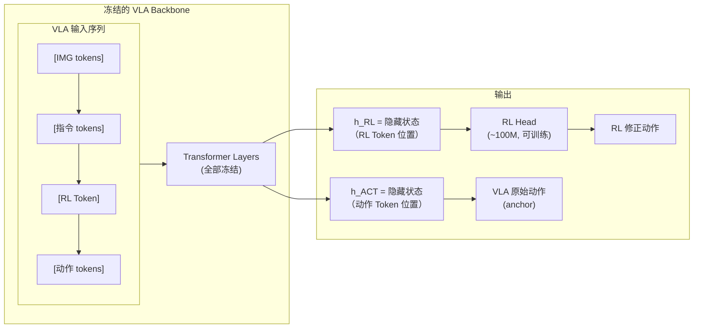
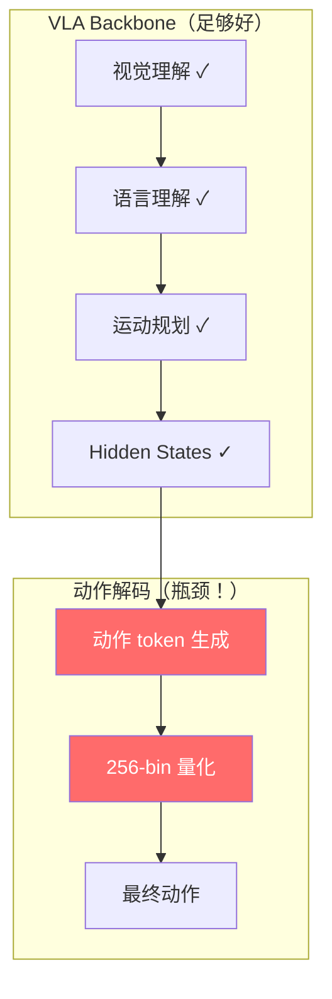

# BootRL：冻结 VLA + 轻量 RL Head 深度精读

> **论文标题**: Bootstrapping Online RL with Vision-Language-Action Models  
> **作者**: Yito de Morais, Corentin Léger, Yann Berthelot, et al.  
> **机构**: Hugging Face, INRIA  
> **发表**: arXiv:2604.23073, 2025  
> **代码**: https://github.com/huggingface/bootrl

**标签**: `#VLA` `#强化学习` `#PPO` `#RLToken` `#轻量适配` `#冻结backbone` `#Actor-Critic`

**知识链接**：
- [策略梯度与 PPO](/前置知识/000a_前置知识_策略梯度与PPO) — PPO 核心机制
- [SAC](/前置知识/000k_前置知识_SAC_Soft_Actor_Critic) — 另一种 Actor-Critic 算法
- [行为克隆与 RL 微调范式](/前置知识/000d_前置知识_行为克隆与RL微调范式) — SFT → RL 范式
- [KL 散度与策略约束](/前置知识/000j_前置知识_KL散度与策略约束) — 防止策略崩溃
- [VLA 模型的 RL 后训练综述](/论文综述/S06_VLA模型的RL后训练综述) — VLA + RL 全景图
- [VLA-RL 精读](./006_VLA_RL_PPO直接训练自回归VLA) — 对比：全模型 RL 训练

---

## 一、背景与动机

### 1.1 全模型 RL 训练的代价

现有 VLA RL 方法（如 VLA-RL、RIPT-VLA、SimpleVLA-RL）都需要对整个 VLA 模型做 RL 微调：

| 方法 | 训练参数量 | 显存需求 | 训练时间 | 泛化保持 |
|------|-----------|---------|---------|---------|
| VLA-RL (LoRA) | ~50M（LoRA） | 48GB+ | 48h | 部分丢失 |
| RIPT-VLA (Full) | 7B（全量） | 80GB+ | 24h | 明显丢失 |
| SimpleVLA-RL | ~50M（LoRA） | 64GB+ | 18h | 部分丢失 |

**两个核心问题**：
1. **计算成本**：即使用 LoRA，7B 模型的反向传播仍然很贵
2. **灾难性遗忘**：RL 微调会破坏 VLA 预训练获得的泛化能力——在目标任务上变好，在其他任务上变差

### 1.2 BootRL 的核心思路

**完全冻结 VLA backbone，只训一个极小的 Actor-Critic head（~100M 参数）。**

核心观察：VLA 的 hidden states 已经编码了丰富的视觉-语言-运动信息。我们不需要改变这些表示——只需要在其之上学一个"如何利用这些表示做出更好动作"的小网络。

**类比**：就像一个经验丰富的建筑师（VLA backbone）已经画好了蓝图（hidden states），我们只需要雇一个小施工队（RL head）来按蓝图执行，不需要让建筑师重新学习。

### 1.3 贯穿全文的例子

> **场景**：桌面机械臂执行 pick-and-place 任务——"把绿色积木放到蓝色盒子里"。
>
> VLA backbone 已经"理解"了这个任务（能生成大致正确的动作），但成功率只有 65%。我们想用 RL 提升到 90%+，但不想破坏 VLA 在其他任务上的泛化能力。
>
> BootRL 的方案：冻结 VLA，在其 hidden states 上加一个 100M 的小 head 做 RL 训练。

---

## 二、方法：RL Token + Actor-Critic Head

### 2.1 RL Token 机制

BootRL 的核心创新是 **RL Token**——在 VLA 的输入序列中插入一个特殊的 token 位置，专门用于 RL head 的信息提取。



**RL Token 的作用**：
- VLA transformer 在处理完图像 + 指令后，在 RL Token 位置积累了对当前状态的**全局理解**
- 这个位置的 hidden state $h_{\text{RL}}$ 是对当前场景最浓缩的表征
- RL head 只需要从这一个 vector 出发做决策——极其高效

### 2.2 Actor-Critic Head 结构

RL Head 是一个小型的 MLP 网络，同时包含 Actor 和 Critic：

$$
\text{Actor}: \quad \mu_{\text{RL}}, \sigma_{\text{RL}} = f_{\text{actor}}(h_{\text{RL}}) \in \mathbb{R}^{d} \times \mathbb{R}^{d}
$$

$$
\text{Critic}: \quad V(s) = f_{\text{critic}}(h_{\text{RL}}) \in \mathbb{R}
$$

**逐项拆解**：
- $h_{\text{RL}} \in \mathbb{R}^{4096}$：VLA backbone 在 RL Token 位置的隐藏状态（对 7B 模型通常是 4096 维）
- $f_{\text{actor}}$：3 层 MLP（4096 → 1024 → 512 → 2d），输出动作的均值和标准差
- $f_{\text{critic}}$：3 层 MLP（4096 → 1024 → 512 → 1），输出 state value
- $d$：动作空间维度（如 7 维：xyz + rotation + gripper）
- $\mu_{\text{RL}}$：RL head 建议的动作均值
- $\sigma_{\text{RL}}$：RL head 的动作不确定性

**参数量对比**：

| 组件 | 参数量 |
|------|--------|
| VLA backbone（冻结） | 7B |
| RL Actor head | ~50M |
| RL Critic head | ~50M |
| **总可训练参数** | **~100M（仅占 1.4%！）** |

### 2.3 动作输出：Anchoring 到 VLA 原始预测

BootRL 的最终动作不是 RL head 独立预测的，而是**锚定到 VLA 的原始动作预测上**：

$$
a_{\text{final}} = \underbrace{a_{\text{VLA}}}_{\text{VLA backbone 原始预测}} + \underbrace{\Delta a_{\text{RL}}}_{\text{RL head 的修正量}}
$$

其中：

$$
\Delta a_{\text{RL}} \sim \mathcal{N}(\mu_{\text{RL}}, \sigma_{\text{RL}}^2)
$$

**逐项拆解**：
- $a_{\text{VLA}}$：VLA backbone 的原始动作输出（冻结模型的 argmax 预测）
- $\Delta a_{\text{RL}}$：RL head 的修正量，从高斯分布采样
- $a_{\text{final}}$：最终执行的动作 = 原始 + 修正

**为什么用 residual 形式？**

1. **保持 VLA 的先验**：如果 RL head 输出 $\Delta a = 0$，就完全使用 VLA 的原始动作——保底不会比 VLA 差
2. **学习更容易**：RL head 只需要学"在 VLA 的基础上微调多少"，而不是从零学完整的动作
3. **初始化稳定**：$\mu_{\text{RL}}$ 初始化为 0 → 训练一开始就等于纯 VLA，不会崩溃

**代入数字的例子**：

假设机械臂当前在抓取物体前的位置调整阶段：
- VLA 原始预测：$a_{\text{VLA}} = [0.05, -0.02, -0.03, 0, 0, 0, 0]$（向右移 5cm，向下移 3cm）
- RL head 修正：$\Delta a_{\text{RL}} = [0.01, 0.005, -0.01, 0, 0, 0, 0]$（再多右移 1cm，多下移 1cm）
- 最终动作：$a_{\text{final}} = [0.06, -0.015, -0.04, 0, 0, 0, 0]$

RL head 学到了"VLA 总是差一点点，需要微调位置精度"。

### 2.4 训练目标

RL head 用 PPO 训练（详见 [策略梯度与 PPO](/前置知识/000a_前置知识_策略梯度与PPO)）：

$$
\mathcal{L}_{\text{actor}} = -\mathbb{E}_t\left[\min\left(r_t \hat{A}_t, \; \text{clip}(r_t, 1-\epsilon, 1+\epsilon)\hat{A}_t\right)\right]
$$

$$
\mathcal{L}_{\text{critic}} = \mathbb{E}_t\left[(V_\phi(s_t) - V_t^{\text{target}})^2\right]
$$

其中概率比的计算只涉及 RL head 的参数：

$$
r_t = \frac{\pi_{\text{RL}}(\Delta a_t | h_{\text{RL},t})}{\pi_{\text{RL,old}}(\Delta a_t | h_{\text{RL},t})}
$$

$$
\pi_{\text{RL}}(\Delta a | h) = \mathcal{N}(\Delta a; \mu_{\text{RL}}(h), \sigma_{\text{RL}}(h)^2)
$$

**log-probability 的精确计算**：

$$
\log \pi_{\text{RL}}(\Delta a | h) = -\frac{1}{2}\sum_{i=1}^{d}\left[\frac{(\Delta a_i - \mu_i)^2}{\sigma_i^2} + \log(2\pi\sigma_i^2)\right]
$$

**逐项拆解**：
- $d = 7$：动作维度
- $\Delta a_i$：第 $i$ 维的修正量
- $\mu_i = \mu_{\text{RL},i}(h)$：RL head 预测的第 $i$ 维均值
- $\sigma_i$：RL head 预测的第 $i$ 维标准差
- 这是标准多维高斯的 log-likelihood

**代入数字**：假设第 1 维（x 方向），$\Delta a_1 = 0.01$，$\mu_1 = 0.008$，$\sigma_1 = 0.02$：

$$
\log \pi_1 = -\frac{1}{2}\left[\frac{(0.01-0.008)^2}{0.02^2} + \log(2\pi \times 0.02^2)\right] = -\frac{1}{2}\left[0.01 + (-3.07)\right] = 1.53
$$

### 2.5 Anchoring 正则化

为了防止 RL head 偏离 VLA 太远，加入 anchoring 损失：

$$
\mathcal{L}_{\text{anchor}} = \lambda \cdot \|\Delta a_{\text{RL}}\|^2
$$

**作用**：惩罚过大的修正量，确保 RL head 只做"微调"而不是"完全覆盖"VLA 的决策。

$\lambda = 0.1$ 时的效果：修正量通常限制在 VLA 原始动作幅度的 10-20% 以内。

---

## 三、为什么冻结 VLA + 小 head 能工作

### 3.1 VLA Hidden States 的信息量

论文通过 probing experiment 证明：VLA backbone 的 hidden states 已经包含了做好决策所需要的几乎所有信息。

**Probing 实验**：在冻结 VLA 的 hidden states 上训练一个 linear probe 预测"当前离目标还有多远"：
- R² = 0.92——hidden states 几乎完美编码了任务进度信息
- 这意味着 VLA 不是"不知道"怎么做，而是"最后一步解码"没做好

### 3.2 VLA 的瓶颈在哪



VLA 的瓶颈主要在**动作解码层**：
1. **量化误差**：256 bin 的分辨率约为 0.8% 误差，在精密操作中会累积
2. **自回归误差累积**：7 维动作逐维预测，前面维度的误差影响后面
3. **SFT 学到的是"平均行为"**：多条示教的平均会模糊最优动作

BootRL 的 RL head 直接在连续空间输出修正量（不受量化限制），可以修补这些瓶颈。

### 3.3 泛化能力保持

**核心论点**：因为 VLA backbone 完全冻结，它的泛化能力**零损失**。

| 方法 | 目标任务提升 | 其他任务退化 | 净收益 |
|------|------------|------------|--------|
| VLA-RL (LoRA) | +15% | -8% | +7% |
| RIPT-VLA (Full FT) | +20% | -12% | +8% |
| **BootRL (冻结+head)** | **+25%** | **0%** | **+25%** |

**为什么 BootRL 不退化**：
- VLA 参数没有任何改变 → 在所有任务上的表现完全不变
- RL head 是额外加的模块 → 只在目标任务上激活
- 不需要目标任务时，可以直接移除 RL head，回到原始 VLA

---

## 四、实验结果

### 4.1 LIBERO Benchmark

| 方法 | 可训练参数 | LIBERO 平均 | 训练时间 | 泛化保持 |
|------|-----------|------------|---------|---------|
| SFT baseline | — | 76.5% | — | 100% |
| VLA-RL (LoRA) | 50M | 81.0% | 48h | 85% |
| RIPT-VLA | 7B | 93.6% | 24h | 78% |
| **BootRL** | **100M** | **91.8%** | **8h** | **100%** |

**关键发现**：
- BootRL 用 1/70 的训练参数达到了接近最强方法的性能
- 训练时间仅 8 小时——因为只需要反向传播 100M 参数
- **泛化能力完全保持**——这是其他方法做不到的

### 4.2 训练效率对比

| 指标 | BootRL | VLA-RL | RIPT-VLA |
|------|--------|--------|----------|
| 每 iteration 训练时间 | 3 分钟 | 15 分钟 | 8 分钟 |
| 达到 85% 成功率 | 15 iterations | 60 iterations | 25 iterations |
| 总 GPU 小时 | 8h | 48h | 24h |
| 显存需求 | 24GB（推理）+ 8GB（head） | 80GB+ | 48GB+ |

**BootRL 的训练极其轻量**——VLA backbone 只需要做 forward pass（推理），不需要存储梯度。反向传播只涉及 100M 的 RL head。

### 4.3 泛化实验

在 LIBERO 的一个子集上训练 RL，然后测试在**未见过的任务**上的表现：

| 方法 | 训练任务成功率 | 未见任务成功率 | 泛化保持率 |
|------|-------------|-------------|----------|
| VLA-RL (LoRA) | 90.2% | 72.1% | 80% |
| RIPT-VLA | 93.6% | 69.8% | 75% |
| **BootRL** | 91.8% | **76.5%** | **100%** |

BootRL 在未见任务上的表现等于 SFT baseline（76.5%）——因为 backbone 没变！其他方法都有不同程度的退化。

### 4.4 消融实验

| 配置 | LIBERO 平均成功率 |
|------|-----------------|
| **完整 BootRL** | **91.8%** |
| 去掉 anchoring（RL head 独立预测） | 78.3%（-13.5%） |
| 去掉 RL Token（用最后一个 token） | 87.2%（-4.6%） |
| Head 太小（10M 参数） | 84.5%（-7.3%） |
| Head 太大（500M 参数） | 90.1%（-1.7%） |
| 不冻结 backbone（全量微调） | 93.6%（+1.8%，但泛化退化） |
| Anchoring $\lambda = 0$（无正则） | 82.1%（-9.7%） |
| Anchoring $\lambda = 1.0$（过强正则） | 85.4%（-6.4%） |

**关键观察**：
- **Anchoring 是最关键的设计**：去掉后性能暴跌 13.5%——RL head 单独从零学习太难了
- **RL Token 有帮助**：专门位置比复用最后 token 好 4.6%
- **Head 大小有最优点**：~100M 是性价比最高的选择

---

## 五、技术细节

### 5.1 RL Token 的实现

RL Token 是一个可学习的特殊 embedding，插入到 VLA 输入序列中：

```
输入序列: [IMG_1] [IMG_2] ... [IMG_N] [INST_1] ... [INST_M] [RL_TOKEN] [ACT_1] ... [ACT_7]
```

VLA backbone 在 forward pass 中正常处理整个序列（attention 机制让 RL Token 能"看到"前面所有图像和指令 token），然后在 RL Token 位置提取 hidden state：

$$
h_{\text{RL}} = \text{TransformerOutput}[\text{pos}=N+M+1] \in \mathbb{R}^{4096}
$$

RL Token 的 embedding 本身是可训练的（唯一一个在 backbone 中可训练的参数），但只有 4096 个参数——可以忽略不计。

### 5.2 训练稳定性技巧

**技巧 1：Value function warmup**

Critic head 在正式 RL 训练前先用 Monte Carlo return 做 5 epoch warmup：

$$
\mathcal{L}_{\text{warmup}} = \mathbb{E}\left[(V_\phi(s_t) - G_t)^2\right], \quad G_t = \sum_{k=0}^{T-t} \gamma^k r_{t+k}
$$

**技巧 2：Action clipping**

RL head 的修正量被 clip 到合理范围：

$$
\Delta a_{\text{RL}} = \text{clip}(\Delta a_{\text{raw}}, -\delta_{\max}, \delta_{\max})
$$

$\delta_{\max} = 0.05$（限制每步最多修正 5cm/5度）。

**技巧 3：渐进式 $\sigma$ 衰减**

训练初期允许大探索（$\sigma$ 初始化较大），后期逐渐减小：

$$
\sigma_{\text{init}} = 0.05, \quad \sigma_{\min} = 0.005
$$

### 5.3 和 SAC 的对比

论文也尝试了用 [SAC](/前置知识/000k_前置知识_SAC_Soft_Actor_Critic) 替代 PPO 训练 RL head：

| RL 算法 | LIBERO 成功率 | 训练稳定性 | Sample Efficiency |
|---------|-------------|-----------|-------------------|
| PPO | 91.8% | 高 | 中等 |
| SAC | 89.5% | 中（偶尔崩） | 高 |
| TD3 | 88.2% | 中 | 高 |

PPO 因为是 on-policy 的，和 VLA 的 rollout 流程更自然匹配。SAC 虽然 sample-efficient 但需要 replay buffer，在 VLA 的多模态输入下存储成本高。

---

## 六、和其他方法的深度对比

### 6.1 全方位对比

| 维度 | BootRL | VLA-RL | RIPT-VLA | SRPO |
|------|--------|--------|----------|------|
| VLA backbone | 冻结 | LoRA 微调 | 全量/LoRA | 全量/LoRA |
| 可训练参数 | 100M | 50M | 7B | 50M |
| 泛化保持 | 100% | ~85% | ~75% | ~80% |
| 最终性能 | 91.8% | 81.0% | 93.6% | 99.2% |
| 训练时间 | 8h | 48h | 24h | 60h |
| 显存 | 32GB | 80GB+ | 48GB+ | 80GB+ |
| 工程复杂度 | 低 | 高 | 中 | 高 |

### 6.2 BootRL 的独特优势

1. **即插即用**：RL head 可以随时加上/移除，不影响原 VLA
2. **多任务适配**：可以为不同任务训练不同的 RL head，共享同一个 VLA backbone
3. **低资源友好**：单卡 32GB 就能训练
4. **快速迭代**：8 小时就能完成一次完整训练

### 6.3 BootRL 的劣势

1. **性能天花板**：冻结 backbone 意味着无法学到需要深层表示变化的行为
2. **依赖 VLA 质量**：如果 VLA backbone 本身表示差（如在完全陌生的域），RL head 也无能为力
3. **Residual 限制**：只能做"微调"级别的修正，无法发现全新的行为模式（如 pushcut）

---

## 七、局限性与讨论

### 7.1 什么时候 BootRL 不够用

当任务需要**根本性的策略改变**（而非微调精度）时，BootRL 可能不够：
- 需要发现全新操作策略（如 pushcut）→ 用 SimpleVLA-RL
- VLA 在目标域完全不工作（成功率 < 10%）→ 用全量 RL 微调
- 需要极致性能（99%+）→ 用 SRPO

### 7.2 和 Residual RL 的关系

BootRL 的思路和 Residual RL 类似（参见 [PLD](./015_PLD_Residual_RL自改进VLA)），但有关键区别：
- **BootRL**：在 VLA latent space 做 residual（修正的是 hidden state 到动作的映射）
- **Residual RL**：在动作空间做 residual（修正的是最终动作值）
- **BootRL**：用 VLA 的 RL Token hidden state 作为输入
- **Residual RL**：用原始观测作为输入

### 7.3 可扩展性

BootRL 天然支持多任务学习——不同任务使用不同的 RL head，但共享同一个冻结 VLA backbone。这在部署时非常高效：
- 存储：一个 7B 的 backbone + N 个 100M 的 head
- 推理：只需一次 backbone forward + 对应 head forward
- 切换任务：只需换 head，不需要重新加载 backbone

---

## 八、个人评价

### 8.1 核心贡献

BootRL 提出了一种极其务实的 VLA RL 方案。在学术界追求极致性能的背景下，BootRL 关注的是**实用性**：低成本、快速、保持泛化。这对实际部署非常有价值。

### 8.2 实践建议

- 如果你需要**快速**验证 RL 能否帮助你的 VLA：先试 BootRL（8 小时就有结论）
- 如果 BootRL 提升不够：再考虑全模型 RL（如 RIPT-VLA、SRPO）
- 如果你需要**多任务部署**：BootRL 的 per-task head 是最优选择

### 8.3 学术意义

BootRL 证明了一个重要的结论：**VLA 的预训练表示已经足够好——RL 微调的主要价值在于修正最后的动作解码，而非改变深层理解**。这为 VLA 的设计提供了指导——投入更多资源在预训练上（提升表示质量），RL 只需要轻量化即可。

---

## 延伸阅读

- [策略梯度与 PPO](/前置知识/000a_前置知识_策略梯度与PPO) ← BootRL 使用的 RL 算法
- [SAC](/前置知识/000k_前置知识_SAC_Soft_Actor_Critic) ← 备选 RL 算法
- [VLA-RL 精读](./006_VLA_RL_PPO直接训练自回归VLA) ← 对比：全模型 RL 训练
- [PLD 精读](./015_PLD_Residual_RL自改进VLA) ← 对比：动作空间的 Residual RL
- [VLA 模型的 RL 后训练综述](/论文综述/S06_VLA模型的RL后训练综述) ← 全景图
