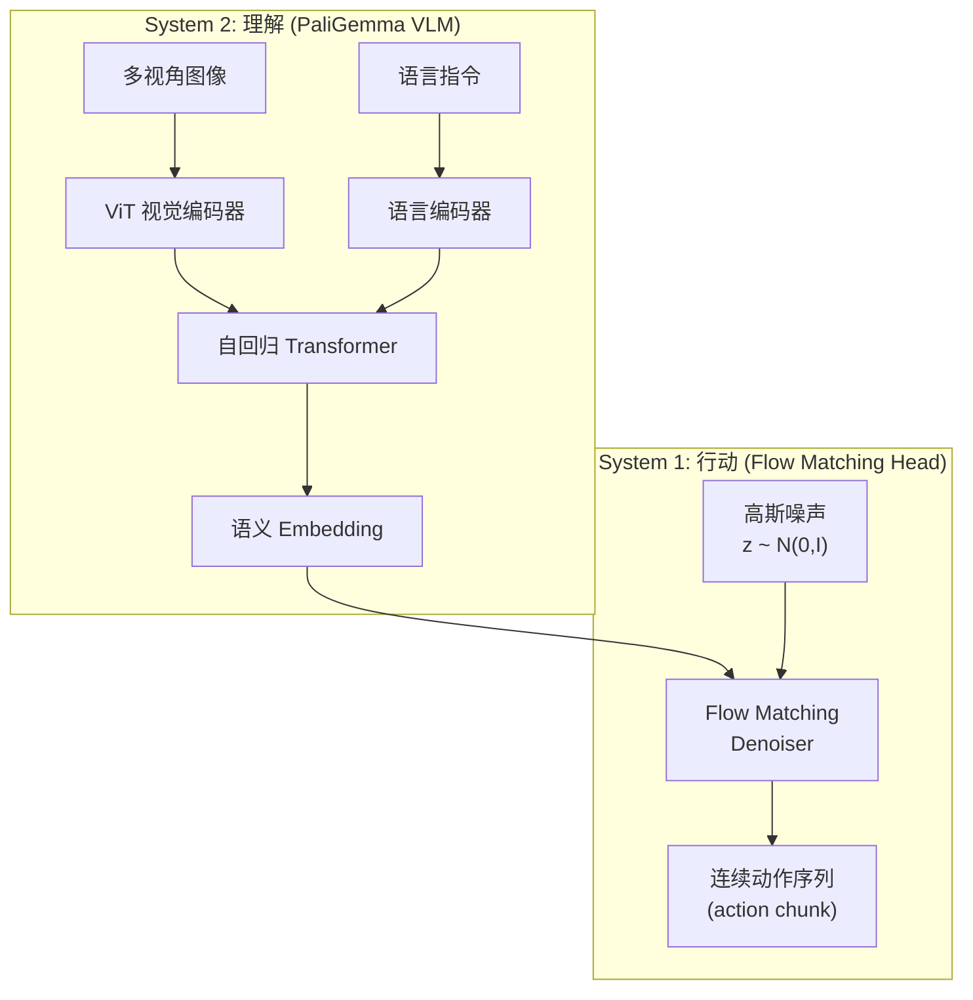

# π₀ (pi-zero)：通用机器人基础模型 深度精读

> **论文标题**: π₀: A Vision-Language-Action Flow Model for General Robot Control  
> **作者**: Kevin Black, Noah Brown, Danny Driess, Adnan Esmail 等  
> **机构**: Physical Intelligence  
> **发表**: arXiv:2410.24164, 2024  
> **官网**: https://www.physicalintelligence.company/blog/pi0

**标签**: `#VLA` `#基础模型` `#Flow Matching` `#预训练` `#多体态` `#pi-zero`

**知识链接**：
- [Flow Matching 与连续归一化流](/前置知识/000g_前置知识_Flow_Matching与连续归一化流) — π₀ 的动作生成核心机制
- [视觉-语言-动作模型 VLA 综述](/论文综述/S03_视觉语言动作模型VLA综述) — VLA 路线全景
- [Octo：开源通用策略](./012_Octo_开源通用机器人策略) — 开源预训练策略对比
- [OpenVLA：开源 VLA](./015_OpenVLA_开源视觉语言动作模型) — 另一种 VLA 方案

---

## 一、背景与动机

### 1.1 从 LLM 到 "Physical Intelligence"

大语言模型的成功路径是：大规模互联网数据预训练 → 指令微调 → 涌现出通用能力。Physical Intelligence 的赌注是：

> **同样的 scaling law 适用于机器人控制——只要数据够多、模型够大、架构对，就能训出一个"通用机器人大脑"。**

### 1.2 现有 VLA 的局限

2024 年中的 VLA 模型（RT-2、OpenVLA）有两个关键问题：

1. **动作离散化的信息损失**：把连续动作量化为 256 个 bin 的 token，丢失了精度。对于需要亚毫米精度的灵巧操作（如穿针引线），这种精度损失是致命的
2. **Action chunk 支持差**：自回归逐 token 生成动作，一个时间步生成 7 个 token，延迟高且不自然

### 1.3 π₀ 的核心创新

π₀ 的关键设计决策：**用 Flow Matching 替代自回归 token 生成来产出动作**。

- 视觉和语言理解：仍然用 VLM (PaliGemma) 的自回归 Transformer
- 动作生成：用 Flow Matching 直接输出连续动作序列

这样既利用了 VLM 的强大语义理解能力，又保持了动作输出的连续性和高精度。

---

## 二、模型架构

### 2.1 双塔设计

π₀ 的架构可以理解为一个"双系统"：

### 2.2 PaliGemma 作为视觉-语言骨干

π₀ 的视觉-语言部分基于 PaliGemma——Google 的一个开源 VLM：
- 视觉编码器：SigLIP ViT
- 语言模型：Gemma 2B

预训练的 VLM 已经学会了：理解图像中的物体、空间关系、语义概念。π₀ 继承这些能力，不需要从头学视觉。

### 2.3 Flow Matching Action Head

核心创新在于 action head。与 Octo 的扩散去噪类似，但使用了 Flow Matching——一种更高效的连续生成方法。

Flow Matching 的基本思路：学习一个向量场 $v_\theta(x_t, t)$，把高斯噪声 $x_1 \sim \mathcal{N}(0, I)$ 沿着最优传输路径"流动"到目标动作 $x_0$：

$$
\frac{dx_t}{dt} = v_\theta(x_t, t, c)
$$

**逐项拆解**：
- $x_t$ — 时刻 $t$ 的"中间状态"，$t=1$ 是纯噪声，$t=0$ 是干净动作
- $v_\theta$ — 神经网络学习的向量场（即"流动方向"）
- $c$ — 条件信息（来自 VLM 的语义 embedding）
- 推理时从 $x_1$ 积分到 $x_0$，用 ODE solver 求解

**相比扩散模型的优势**：
- 路径更直（最优传输），采样步数更少（5-10 步 vs 扩散的 20-50 步）
- 训练更稳定（没有 noise schedule 选择的困扰）

### 2.4 Action Chunk 输出

π₀ 一次性输出一个 action chunk——未来多步动作的连续序列：

$$
\hat{a}_{t:t+H} = \text{FlowMatch}(z, c_t; \theta) \in \mathbb{R}^{H \times d_a}
$$

其中 $H$ 是 chunk 长度（如 16 步），$d_a$ 是动作维度。这意味着：
- 推理频率可以很高（不需要每步都跑完整模型）
- 动作天然平滑（chunk 内部连贯）

---

## 三、训练数据与流程

### 3.1 数据来源

π₀ 的训练数据远超 Octo 和 OpenVLA：

| 数据类型 | 来源 | 规模 |
|---------|------|------|
| 互联网视觉-语言数据 | PaliGemma 预训练 | 数十亿图文对 |
| 公开机器人数据 | OXE、DROID、BridgeData | ~1M 轨迹 |
| 自采数据 | Physical Intelligence 自有 8 种机器人 | 未公开（据称数十万条） |

### 3.2 训练分为三阶段

1. **VLM 预训练**：PaliGemma 在互联网数据上学视觉-语言理解
2. **跨体态混合预训练**：在所有机器人数据上训练 Flow Matching head + 微调 VLM
3. **任务特定微调**：在目标任务的少量数据上精调

### 3.3 支持的机器人体态

π₀ 在发布时展示了 8 种不同体态的能力：
- 双臂桌面操作（类 ALOHA）
- 单臂 Franka
- 移动操作平台
- 灵巧手
- 人形上半身

---

## 四、关键能力展示

### 4.1 灵巧操作

π₀ 能完成之前 VLA 做不到的精细任务：
- 叠衣服（需要理解布料变形）
- 清理桌面（需要长序列规划）
- 装配纸箱（需要双手协调）
- 舀咖啡豆（需要精细力控制）

### 4.2 语言跟随

能理解并执行多种自然语言指令：
- "fold the shirt and put it in the drawer"
- "pick up the cup and place it on the coaster"
- "open the drawer and take out the sponge"

### 4.3 快速适配

通过微调，少量数据即可适配新任务。π₀ 后续开源版本 (OpenPI) 展示了用 ~50 条示教微调到新任务的能力。

---

## 五、对比与定位

| 维度 | π₀ | Octo | OpenVLA | RT-2-X |
|------|-----|------|---------|--------|
| 动作表示 | 连续 (Flow Matching) | 连续 (Diffusion) | 离散 token | 离散 token |
| VLM 骨干 | PaliGemma | 无 (ViT from scratch) | Llama-2 | PaLI-X |
| 参数量 | ~3B (估算) | 93M | 7B | 55B |
| 开源 | 部分 (OpenPI) | ✅ 完全 | ✅ 完全 | ❌ |
| 动作精度 | 极高（连续） | 高（连续） | 中（256 bin） | 中（256 bin） |
| 灵巧任务 | ✅ | 有限 | 有限 | 有限 |

π₀ 的核心定位：**工业级的通用机器人基础模型**，精度和灵巧性超越学术界方案。

---

## 六、总结

π₀ 的关键启示：

1. **VLM + Flow Matching 是当前最优的 VLA 架构**：兼顾语义理解和动作精度
2. **连续动作表示对灵巧操作至关重要**：离散 token 的 256 bin 精度不够用
3. **数据规模和多样性仍是核心瓶颈**：自采数据是 Physical Intelligence 的壁垒
4. **开源化趋势**：OpenPI 的发布让更多人能站在 π₀ 的肩膀上

---

## 延伸阅读

- [Flow Matching 与连续归一化流](/前置知识/000g_前置知识_Flow_Matching与连续归一化流) — 理解 π₀ 的动作生成原理
- [Octo：开源通用策略](./012_Octo_开源通用机器人策略) — 学术界的开源替代方案
- [GR00T N1：人形机器人基础模型](./019_GR00T_N1_人形机器人基础模型) — NVIDIA 的竞争方案
- [VLA 模型的 RL 后训练综述](/论文综述/S06_VLA模型的RL后训练综述) — 在 π₀ 基础上做 RL 微调
