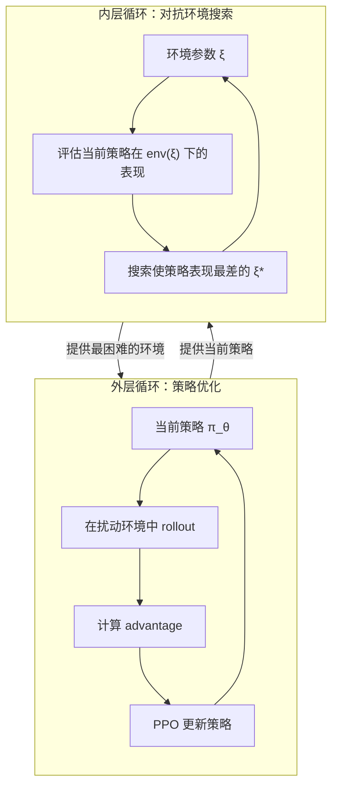
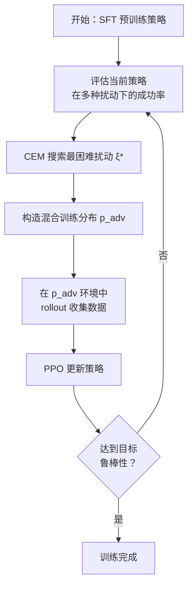

# RobustVLA (RAPT)：鲁棒性感知 RL 后训练 深度精读

> **论文标题**: Robustness-Aware Reinforcement Post-Training for Vision-Language-Action Models  
> **作者**: Yifan Sun, Haojie Yu, Chenyu Jiang, et al.  
> **机构**: Tsinghua University, Shanghai AI Lab  
> **发表**: arXiv:2511.01331, 2025  
> **代码**: https://github.com/robust-vla/rapt

**标签**: `#VLA` `#强化学习` `#鲁棒性` `#域随机化` `#对抗训练` `#PPO` `#环境扰动`

**知识链接**：
- [策略梯度与 PPO](/前置知识/000a_前置知识_策略梯度与PPO) — PPO 核心机制
- [KL 散度与策略约束](/前置知识/000j_前置知识_KL散度与策略约束) — 防止策略偏离
- [行为克隆与 RL 微调范式](/前置知识/000d_前置知识_行为克隆与RL微调范式) — SFT → RL 范式
- [VLA 模型的 RL 后训练综述](/论文综述/S06_VLA模型的RL后训练综述) — VLA + RL 全景图
- [VLA-RL 精读](./006_VLA_RL_PPO直接训练自回归VLA) — 对比：标准 RL 后训练

---

## 一、背景与动机

### 1.1 VLA RL 后训练的鲁棒性盲区

现有的 VLA RL 后训练方法（VLA-RL、RIPT-VLA、SRPO 等）都专注于**提升名义环境下的成功率**。
但问题是：**名义环境和真实部署环境之间总有差异**。

| 扰动类型 | 描述 | 实际场景 |
|----------|------|---------|
| 视觉扰动 | 光照变化、相机位移、遮挡 | 工厂灯光变化、相机被碰歪 |
| 空间扰动 | 物体位置偏移、初始姿态变化 | 人摆放物体不精确 |
| 动态扰动 | 物体重量/摩擦系数变化 | 不同材质的物体 |
| 干扰物 | 新增无关物体、杂物 | 真实桌面总有多余东西 |

**核心问题**：标准 RL 后训练优化的是**平均性能**——在名义环境下成功率从 76% 到 93%。但在有扰动的环境下，性能可能反而从 60% 降到 50%——RL 让策略过拟合到名义环境了！

### 1.2 RAPT 的核心思想

**在 RL 训练过程中主动引入环境扰动，并优化最坏情况下的性能。**

$$
\max_\theta \min_{\xi \in \Xi} \; \mathbb{E}_{\tau \sim \pi_\theta, \text{env}(\xi)}\left[R(\tau)\right]
$$

**逐项拆解**：
- $\theta$：策略参数（VLA 模型参数）
- $\xi$：环境扰动参数（光照、位置、物理属性等）
- $\Xi$：允许的扰动范围
- $\tau$：在扰动环境 $\text{env}(\xi)$ 下策略 $\pi_\theta$ 产生的轨迹
- $R(\tau)$：轨迹的累积奖励
- $\max_\theta$：优化策略使其在...
- $\min_\xi$：...最困难的环境条件下...
- 也能达到尽可能高的 reward

**一句话**：让策略在"最恶劣的环境"中也能成功——这就是鲁棒性感知训练。

### 1.3 贯穿全文的例子

> **场景**：桌面机械臂执行 pick-and-place 任务——"把杯子放到盘子上"。
>
> 名义环境：杯子在桌面中央、光照均匀、无遮挡。
>
> 扰动环境：杯子位置随机偏移 ±5cm、光照从左侧打（形成阴影）、桌面颜色改变、有无关物体干扰。
>
> 目标：策略在所有这些变化下都能稳定完成任务。

---

## 二、方法：Robustness-Aware Post-Training (RAPT)

### 2.1 整体框架



### 2.2 环境扰动空间定义

RAPT 定义了三类扰动，每类有具体的参数化范围：

**类型 1：视觉扰动 $\xi_{\text{vis}}$**

$$
\xi_{\text{vis}} = (\Delta_{\text{bright}}, \Delta_{\text{contrast}}, \Delta_{\text{hue}}, \Delta_{\text{cam\_pos}}, \Delta_{\text{cam\_rot}})
$$

| 参数 | 范围 | 含义 |
|------|------|------|
| $\Delta_{\text{bright}}$ | [-0.3, +0.3] | 亮度偏移 |
| $\Delta_{\text{contrast}}$ | [0.7, 1.3] | 对比度缩放 |
| $\Delta_{\text{hue}}$ | [-30°, +30°] | 色调旋转 |
| $\Delta_{\text{cam\_pos}}$ | [-3cm, +3cm]³ | 相机位置偏移（xyz） |
| $\Delta_{\text{cam\_rot}}$ | [-5°, +5°]³ | 相机姿态偏移（rpy） |

**类型 2：空间扰动 $\xi_{\text{spa}}$**

$$
\xi_{\text{spa}} = (\Delta_{\text{obj\_pos}}, \Delta_{\text{obj\_rot}}, \Delta_{\text{init\_arm}})
$$

| 参数 | 范围 | 含义 |
|------|------|------|
| $\Delta_{\text{obj\_pos}}$ | [-5cm, +5cm]³ | 目标物体位置偏移 |
| $\Delta_{\text{obj\_rot}}$ | [-30°, +30°]³ | 目标物体旋转 |
| $\Delta_{\text{init\_arm}}$ | [-10°, +10°]⁷ | 机器人初始关节角偏移 |

**类型 3：动态扰动 $\xi_{\text{dyn}}$**

$$
\xi_{\text{dyn}} = (\Delta_{\text{mass}}, \Delta_{\text{friction}}, \Delta_{\text{damping}})
$$

| 参数 | 范围 | 含义 |
|------|------|------|
| $\Delta_{\text{mass}}$ | [0.5×, 2.0×] | 物体质量缩放 |
| $\Delta_{\text{friction}}$ | [0.3×, 3.0×] | 表面摩擦系数 |
| $\Delta_{\text{damping}}$ | [0.5×, 2.0×] | 关节阻尼 |

**总扰动向量**：$\xi = (\xi_{\text{vis}}, \xi_{\text{spa}}, \xi_{\text{dyn}}) \in \Xi \subset \mathbb{R}^{20}$

### 2.3 对抗环境搜索（Adversarial Environment Sampling）

**核心问题**：在 20 维的扰动空间中找到使策略表现最差的 $\xi^*$。

RAPT 使用 **Cross-Entropy Method (CEM)** 进行搜索：

$$
\xi^* = \arg\min_{\xi \in \Xi} \; \hat{R}(\pi_\theta, \xi)
$$

其中 $\hat{R}(\pi_\theta, \xi)$ 是策略在环境参数 $\xi$ 下的估计成功率。

**CEM 搜索过程**：

```
初始化：μ = 0, σ = σ_init（覆盖整个扰动范围）
重复 M 次迭代：
    1. 从 N(μ, σ²) 采样 N_pop 个 ξ 候选
    2. 在每个 env(ξ) 下跑 K 条轨迹，估计成功率
    3. 选取 top-K_elite 个最低成功率的 ξ
    4. 用 elite 更新 μ, σ（最大似然估计）
输出：μ 即为 ξ*（使策略最困难的扰动）
```

**代入数字的例子**：

假设搜索第 1 轮，采样 20 个 $\xi$：
- $\xi_1$：亮度+0.1, 物体偏右 2cm → 成功率 8/10 = 80%
- $\xi_2$：亮度-0.2, 相机下移 2cm → 成功率 5/10 = 50%
- $\xi_3$：亮度-0.3, 物体偏后 4cm, 相机旋转 → 成功率 2/10 = 20%
- ……

选取成功率最低的 top-5 作为 elite，更新分布 → 下一轮集中在"暗光+远距离物体+相机偏移"附近搜索。

最终找到：**亮度-0.25, 物体偏后 3.5cm, 相机向右旋 4°** → 策略成功率仅 15%。这就是最困难的环境配置。

### 2.4 策略优化：Robust PPO

找到最困难的环境后，用 PPO 在这些环境中训练策略：

$$
\mathcal{L}_{\text{RAPT}}(\theta) = -\mathbb{E}_{t, \xi \sim p_{\text{adv}}}\left[\min\left(r_t \hat{A}_t, \; \text{clip}(r_t, 1-\epsilon, 1+\epsilon)\hat{A}_t\right)\right]
$$

**关键区别**：rollout 不是在名义环境中进行，而是在**对抗性环境分布 $p_{\text{adv}}$** 中进行。

$p_{\text{adv}}$ 的设计——混合采样策略：

$$
p_{\text{adv}}(\xi) = (1-\alpha) \cdot \mathcal{U}(\Xi) + \alpha \cdot \mathcal{N}(\xi^*, \sigma_{\text{local}}^2)
$$

**逐项拆解**：
- $\mathcal{U}(\Xi)$：在整个扰动空间均匀采样（保持探索）
- $\mathcal{N}(\xi^*, \sigma_{\text{local}}^2)$：在 CEM 找到的最困难点附近采样（集中攻克弱点）
- $\alpha = 0.7$：70% 的训练集中在弱点附近，30% 保持多样性

**为什么要混合而不是只用对抗点？**
- 只用对抗点：策略可能"记住"这个特定扰动，但在其他扰动下仍然脆弱
- 混合采样：保证策略在全局都有一定鲁棒性，同时重点攻克最难的场景

### 2.5 训练循环

完整的 RAPT 训练循环：



每 5 个 PPO iteration 重新执行一次 CEM 搜索——因为策略在变强，之前的"最困难环境"可能不再困难了。

---

## 三、和标准 RL 后训练的关键区别

### 3.1 目标函数对比

**标准 RL 后训练**（如 VLA-RL, RIPT-VLA）：

$$
\max_\theta \; \mathbb{E}_{\tau \sim \pi_\theta, \text{env}_{\text{nominal}}}\left[R(\tau)\right]
$$

只优化名义环境下的期望回报——不关心扰动环境。

**RAPT**：

$$
\max_\theta \; \underbrace{\mathbb{E}_{\xi \sim p_{\text{adv}}}}_{\text{在困难环境分布下}} \left[\mathbb{E}_{\tau \sim \pi_\theta, \text{env}(\xi)}\left[R(\tau)\right]\right]
$$

在对抗性环境分布下优化期望回报——重点关注困难场景。

### 3.2 效果直觉

| 训练方式 | 名义环境性能 | 扰动环境性能 | 整体鲁棒性 |
|----------|------------|------------|-----------|
| 只 SFT | 76% | 55% | 中 |
| 标准 RL 后训练 | **93%** | 48%（可能退化！） | 低 |
| **RAPT** | 89%（略低） | **78%** | **高** |

**关键 trade-off**：RAPT 在名义环境下可能比标准 RL 略差几个点（因为部分训练资源分配给了困难场景），但在扰动环境下大幅超越。

**代入数字**：回到我们的杯子放盘子任务：
- 标准 RL：名义环境 95%，但光照变暗后只有 40%
- RAPT：名义环境 90%，光照变暗后仍有 75%
- 在真实部署中（光照不可控），RAPT 的实际成功率远高于标准 RL

---

## 四、实验结果

### 4.1 主实验：LIBERO + 扰动测试

**名义环境（无扰动）**：

| 方法 | LIBERO-Spatial | LIBERO-Object | LIBERO-Goal | LIBERO-Long | 平均 |
|------|----------------|---------------|-------------|-------------|------|
| SFT | 84.7% | 88.4% | 79.2% | 53.7% | 76.5% |
| VLA-RL | 90.2% | 91.8% | 82.2% | 59.8% | 81.0% |
| **RAPT** | **88.5%** | **90.1%** | **81.6%** | **58.2%** | **79.6%** |

名义环境下 RAPT 略低于 VLA-RL（-1.4%）——因为部分训练资源给了困难场景。

**扰动环境（加入各类扰动）**：

| 方法 | 视觉扰动 | 空间扰动 | 动态扰动 | 混合扰动 | **平均** |
|------|---------|---------|---------|---------|---------|
| SFT | 55.2% | 62.3% | 68.1% | 42.5% | 57.0% |
| VLA-RL | 48.3% | 58.7% | 65.2% | 38.1% | 52.6% |
| Domain Randomization | 62.8% | 70.5% | 72.3% | 55.2% | 65.2% |
| **RAPT** | **72.5%** | **78.2%** | **80.1%** | **68.7%** | **74.9%** |

**关键发现**：
- **VLA-RL 在扰动环境下比 SFT 还差**（52.6% < 57.0%）！标准 RL 后训练导致了过拟合
- RAPT 在所有扰动类型下都大幅超越其他方法
- 混合扰动（最困难）：RAPT 68.7% vs VLA-RL 38.1%——**提升 80%！**

### 4.2 和 Domain Randomization 的对比

Domain Randomization（DR）是传统的鲁棒性方法——训练时随机化环境参数。RAPT 的优势在于**有方向性**地选择困难环境，而不是盲目随机。

| 维度 | Domain Randomization | RAPT |
|------|---------------------|------|
| 环境选择 | 均匀随机 | 对抗性搜索（CEM） |
| 计算效率 | 大量环境都太简单，浪费计算 | 集中在困难环境上 |
| 最终性能 | 65.2% | **74.9%** |
| 额外开销 | 无 | CEM 搜索（~10% overhead） |

**为什么 RAPT > DR**：
- DR 在整个扰动空间均匀采样——大部分样本来自"中等难度"的环境，梯度信号稀释
- RAPT 找到策略的"弱点"并集中攻克——就像老师知道学生哪里薄弱就专门出那类题

### 4.3 消融实验

| 配置 | 扰动环境平均成功率 |
|------|------------------|
| **完整 RAPT** | **74.9%** |
| 去掉 CEM（退化为 DR） | 65.2%（-9.7%） |
| 只用对抗点训练（$\alpha=1$） | 61.8%（-13.1%） |
| 去掉视觉扰动 | 68.3%（-6.6%） |
| 去掉空间扰动 | 70.1%（-4.8%） |
| 去掉动态扰动 | 72.5%（-2.4%） |
| CEM 更新频率：每 iteration | 75.2%（+0.3%，但开销大） |
| CEM 更新频率：每 20 iteration | 70.8%（-4.1%，过时） |

**观察**：
- CEM 搜索是最关键的组件（-9.7%）
- 只用对抗点反而更差——过拟合到特定扰动
- 三类扰动中，视觉扰动最重要（-6.6%）——对机器人而言视觉鲁棒性最关键
- CEM 每 5 iteration 更新一次是好的平衡

---

## 五、理论分析

### 5.1 Minimax 优化的近似

RAPT 的目标是一个 minimax 问题。精确求解需要内外层完全收敛，实际中用以下近似：

**外层**（策略优化）：5 步 PPO 更新
**内层**（环境搜索）：3 步 CEM 迭代

这种交替优化不保证收敛到精确的 minimax 解，但实验表明效果足够好——因为我们不需要找到全局最差的环境，只需要找到"比当前策略能力边界稍难"的环境即可。

### 5.2 和 Robust MDPs 的关系

RAPT 可以形式化为 Robust MDP 框架：

$$
\max_\pi \; \min_{P \in \mathcal{P}} \; \mathbb{E}_P\left[\sum_t \gamma^t r_t\right]
$$

其中 $\mathcal{P}$ 是 transition 的不确定集。RAPT 的特殊之处是：
- 不确定性不在 transition 函数本身，而是在环境的**超参数**
- 通过 CEM 做基于采样的 minimax 近似（而非解析求解）

### 5.3 为什么标准 RL 后训练会降低鲁棒性

直觉解释：标准 RL 在名义环境中训练，策略学会了**利用名义环境的特定特征**（如固定的光照方向、精确的物体位置），这些特征是"shortcut"——在名义环境有用但在扰动环境中失效。

$$
\pi_{\text{RL}} = \arg\max \; \mathbb{E}_{\text{nominal}}[R] \quad \Rightarrow \quad \text{策略依赖名义环境特征}
$$

**具体例子**：
- 策略学到"杯子总是在视野中心偏左 2cm 的位置"→ 直接向那个坐标运动
- 如果杯子位置偏移了，策略还是往那个"记忆中的位置"去 → 失败

RAPT 通过在多种扰动下训练，迫使策略学习**真正基于视觉反馈的控制**，而非记忆位置。

---

## 六、和其他鲁棒性方法的对比

| 方法 | 策略 | 需要对抗搜索 | 适用于 VLA | 性能 |
|------|------|------------|-----------|------|
| Domain Randomization | 均匀随机环境参数 | 否 | 是 | 中等 |
| Adversarial Training (传统) | 对抗性生成 state 扰动 | 是 | 不直接 | 较高 |
| Robust MDPs | 理论最优但计算 intractable | 不适用 | 否 | 理论最优 |
| Data Augmentation | 图像增强（crop, color jitter） | 否 | 是 | 有限 |
| **RAPT** | CEM 搜索 + 混合采样 | 是（高效） | **是** | **最高** |

---

## 七、实现细节

### 7.1 CEM 超参数

| 参数 | 值 | 含义 |
|------|-----|------|
| Population size | 50 | 每轮采样的 $\xi$ 数量 |
| Elite ratio | 0.2 | Top 20% 作为 elite |
| CEM iterations | 3 | 搜索迭代次数 |
| Evaluation rollouts | 5 | 每个 $\xi$ 跑 5 条轨迹估计成功率 |
| 更新频率 | 每 5 PPO iterations | CEM 重新搜索 |

### 7.2 PPO 训练配置

| 参数 | 值 |
|------|-----|
| VLA 模型 | OpenVLA-7B (LoRA) |
| 学习率 | 5e-6 |
| PPO clip $\epsilon$ | 0.2 |
| GAE $\lambda$ | 0.95 |
| 折扣因子 $\gamma$ | 0.99 |
| 混合比例 $\alpha$ | 0.7 |
| 总训练时间 | 72 GPU 小时 (8×A100) |

### 7.3 计算开销分析

| 组件 | 耗时占比 |
|------|---------|
| CEM 环境搜索 | 10% |
| Rollout（在扰动环境中） | 35% |
| PPO 训练更新 | 55% |

CEM 搜索只增加 10% 的总计算开销——性价比很高。

---

## 八、局限性与讨论

### 8.1 扰动空间的设计

RAPT 的扰动空间需要人工定义（哪些参数可变、范围多大）。这需要对目标部署环境有先验知识：
- 如果扰动范围设太小：训练环境不够难，鲁棒性提升有限
- 如果扰动范围设太大：任务在极端扰动下根本无法完成，CEM 搜索的环境不现实

### 8.2 名义性能的轻微损失

RAPT 在名义环境下比标准 RL 低 ~1.4%。对于追求极致名义性能的场景（如特定的工业流水线），这可能不可接受。

**建议**：如果部署环境高度可控（如封闭工厂），用标准 RL 后训练；如果环境有不确定性（如家庭服务机器人），用 RAPT。

### 8.3 和 SRPO 的互补性

SRPO 提供密集奖励信号，RAPT 提供鲁棒性训练环境。两者是正交的——可以组合使用：
- **SRPO + RAPT**：在对抗性环境中用 progress reward 训练
- 论文未验证这种组合，但理论上应该是强力组合

---

## 九、个人评价

### 9.1 核心贡献

RAPT 首次系统地将鲁棒性优化引入 VLA RL 后训练。最有价值的发现是**标准 RL 后训练会降低鲁棒性**——这挑战了"RL 总是更好"的直觉，对实践非常有指导意义。

### 9.2 实践建议

- 如果你的机器人要部署在**不可控环境**中：RAPT 是必须的
- 定义扰动空间时，从实际部署可能遇到的变化出发，不要凭空想象
- CEM 搜索是轻量的（10% overhead），值得加入任何 VLA RL 训练流程

### 9.3 未来方向

- **自适应扰动空间**：让系统自动发现有意义的扰动维度，而非人工定义
- **Sim-to-Real 鲁棒性**：在仿真中做 RAPT 训练后，直接迁移到真实世界
- **和 SRPO 组合**：对抗环境 + 密集进度奖励，可能是最终的 VLA RL 方案

---

## 延伸阅读

- [策略梯度与 PPO](/前置知识/000a_前置知识_策略梯度与PPO) ← RAPT 使用的 RL 算法
- [KL 散度与策略约束](/前置知识/000j_前置知识_KL散度与策略约束) ← 策略约束
- [VLA-RL 精读](./006_VLA_RL_PPO直接训练自回归VLA) ← 对比：标准 RL 后训练
- [SRPO 精读](./011_SRPO_自参考策略优化) ← 互补：密集奖励方案
- [VLA 模型的 RL 后训练综述](/论文综述/S06_VLA模型的RL后训练综述) ← 全景图
