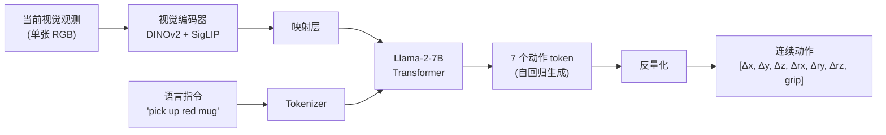

# OpenVLA：开源视觉-语言-动作模型 深度精读

> **论文标题**: OpenVLA: An Open-Source Vision-Language-Action Model  
> **作者**: Moo Jin Kim, Karl Pertsch, Siddharth Karamcheti, Ted Xiao 等  
> **机构**: Stanford, UC Berkeley, Google DeepMind, Toyota Research Institute  
> **发表**: CoRL 2024 (ICML 2024 workshop 版本)  
> **代码**: https://github.com/openvla/openvla  
> **权重**: https://huggingface.co/openvla/openvla-7b

**标签**: `#VLA` `#开源` `#预训练` `#自回归` `#Llama` `#OpenVLA`

**知识链接**：
- [动作 Token 化与自回归策略](/前置知识/000l_前置知识_动作Token化与自回归策略) — OpenVLA 的动作表示核心
- [视觉-语言-动作模型 VLA 综述](/论文综述/S03_视觉语言动作模型VLA综述) — VLA 路线全景
- [VLA-RL：PPO 训练 VLA](./006_VLA_RL_PPO直接训练自回归VLA) — OpenVLA 的 RL 微调后续
- [Open X-Embodiment 数据集](./011_OpenX_大规模跨体机器人数据集与RTX模型) — 训练数据来源

---

## 一、背景与动机

### 1.1 VLA 的闭源困境

2023 年底到 2024 年初，最强的 VLA 模型是 Google 的 RT-2 (55B 参数)。它在操作任务上表现惊艳，展示了视觉-语言预训练知识迁移到机器人控制的可能性。

但 RT-2 有两个致命问题：
- **完全闭源**：学术界无法复现或改进
- **巨大的推理开销**：55B 参数需要多卡推理，无法在实际机器人上实时运行

学术界需要一个**开源的、可部署的、性能不差的 VLA**。

### 1.2 OpenVLA 的设计哲学

OpenVLA 的核心思路很直接：

> 把一个开源 VLM (Prismatic VLM, 基于 Llama-2-7B) 在 970k 条机器人操作数据上做 SFT，让它学会输出动作 token。

这延续了 RT-2 的核心 insight：**动作可以表示为语言 token，VLM 自然就能"说出"动作**。

### 1.3 核心贡献

1. **7B 参数的开源 VLA**：比 RT-2 (55B) 小 7 倍，在 29 个任务上成功率高 16.5%
2. **高效微调方法**：LoRA 微调，单卡 A100 可训练
3. **强语言接地**：多任务环境中能正确理解"pick up the red cup"而非"pick up the blue one"
4. **完全开源**：代码、权重、训练脚本、评估协议全部公开

---

## 二、模型架构

### 2.1 整体流程

OpenVLA 的推理过程和一个视觉问答 VLM 一模一样，只是"回答"是动作 token：

### 2.2 视觉编码器：双骨干融合

OpenVLA 使用两个互补的视觉编码器：

| 编码器 | 预训练方式 | 擅长什么 |
|--------|----------|---------|
| DINOv2 | 自监督对比学习 | 精确的局部空间特征（物体位置、形状） |
| SigLIP | 图文对比学习 | 语义理解（"红色"、"杯子"等概念） |

两者的输出 token 拼接后送入 LLM——DINOv2 提供"在哪里"，SigLIP 提供"是什么"。

### 2.3 动作 Token 化

7 维连续动作 $a = [Δx, Δy, Δz, Δrx, Δry, Δrz, \text{grip}]$ 的量化过程：

1. 对训练集中每个维度统计范围，均匀分为 256 个 bin
2. 每个维度的值映射到最近的 bin 编号（0~255）
3. 这 256 个 bin 对应词表中新加的 256 个特殊 token

$$
\text{token}_i = \text{discretize}(a_i, \text{bins}=256) \quad \text{for } i = 1, \ldots, 7
$$

**代入数字**：假设 $Δx$ 的范围是 $[-0.05, 0.05]$ 米，bin 宽度为 $0.1/256 \approx 0.0004$ 米。如果实际动作 $Δx = 0.02$，它被映射到 bin $\lfloor(0.02 + 0.05) / 0.0004\rfloor = 175$，对应 token `<action_175>`。

**精度分析**：每个维度的量化精度约 $\frac{\text{range}}{256}$。对于典型的桌面操作（±5cm 范围），精度约 0.4mm——对大部分 pick-and-place 足够，但对穿针引线等任务可能不足。

### 2.4 为什么基于 Llama-2？

选择 Llama-2-7B 作为骨干的理由：
1. **开源**：完全可获取的权重
2. **生态成熟**：LoRA、QLoRA、Flash Attention 等优化工具齐全
3. **规模适中**：7B 在单卡 A100 上可推理，频率约 5-10 Hz
4. **语言能力强**：对自然语言指令的理解本就过关

---

## 三、训练流程

### 3.1 两阶段训练

**阶段 1：VLM 预训练（继承）**

OpenVLA 不从头训练 VLM。它直接使用 Prismatic VLM 的预训练权重——这个模型已经在大规模图文数据上学会了视觉理解和语言生成。

**阶段 2：机器人数据 SFT**

在 Open X-Embodiment 的 970k 条轨迹上做监督微调。输入是 (图像, 指令)，目标是预测 7 个动作 token。损失函数就是标准的 next-token prediction：

$$
\mathcal{L} = -\sum_{i=1}^{7} \log p_\theta(\text{token}_i | \text{image}, \text{instruction}, \text{token}_{1:i-1})
$$

### 3.2 数据混合策略

不是所有 OXE 数据集权重相等。OpenVLA 的数据混合考虑了：
- 数据集大小（大的降权，避免被少数大数据集主导）
- 数据质量（成功率低的降权）
- 体态覆盖（保证每种机器人都有足够曝光）

### 3.3 微调新任务

拿到 OpenVLA-7B 后，如何适配自己的机器人：

1. **冻结大部分参数**，仅用 LoRA (rank=32) 微调
2. 收集 ~100-200 条目标任务的示教
3. 训练 ~2-5 小时 (单卡 A100)
4. 部署推理，频率约 5-8 Hz

---

## 四、实验结果

### 4.1 广义评估：29 任务对比

在 BridgeData V2 的 WidowX 平台上，29 个操作任务的平均成功率：

| 模型 | 参数量 | 平均成功率 |
|------|-------|----------|
| RT-1-X | ~35M | 49.6% |
| RT-2-X | 55B | 52.1% |
| **OpenVLA** | **7B** | **68.6%** |

OpenVLA 以 7 倍少的参数超越了 RT-2-X，关键在于更好的训练数据混合和双视觉编码器。

### 4.2 微调后的多任务评估

在 WidowX 上微调后执行 4 个需要语言接地的任务：

- "put the corn in the bowl next to the bowl" — 需要区分两个碗
- "move the towel from the stove to the counter" — 需要理解空间关系

OpenVLA 微调后成功率比从头训练的 Diffusion Policy 高 20.4%。

### 4.3 语言接地能力

OpenVLA 继承了 VLM 的语言理解能力。在同一场景中面对"pick up the red mug"和"pick up the blue mug"时，能正确区分——这是纯视觉策略（如 Diffusion Policy）做不到的。

---

## 五、局限性

1. **动作精度有限**：256 bin 量化，~0.4mm 精度，不适合极精细任务
2. **单帧输入**：没有历史观测，缺乏时序推理能力
3. **推理延迟**：7B 模型 ~100-200ms per step，高频控制有压力
4. **不支持 action chunk**：每步独立预测，缺乏时间一致性

### 后续改进方向

- OpenVLA v2 (Fine-Tuning Vision-Language-Action Models, 2025)：优化微调策略
- VLA-RL (本项目 006 精读)：用 PPO 对 OpenVLA 做 RL 后训练
- π₀ 的 Flow Matching 路线：彻底解决离散化精度问题

---

## 六、总结

| 维度 | 贡献 |
|------|------|
| 开源标杆 | 第一个可用的 7B 开源 VLA |
| 性能证明 | 小模型 (7B) 可以超越大模型 (55B) |
| 微调范式 | LoRA 微调 + 少量数据即可适配新任务 |
| 语言接地 | 继承 VLM 的语义理解，区分"红杯子"和"蓝杯子" |
| 生态意义 | 为 VLA + RL (如 VLA-RL) 提供了基础模型 |

---

## 延伸阅读

- [VLA-RL：PPO 训练 VLA](./006_VLA_RL_PPO直接训练自回归VLA) — 在 OpenVLA 上做 RL 微调
- [动作 Token 化与自回归策略](/前置知识/000l_前置知识_动作Token化与自回归策略) — 动作离散化的详细原理
- [π₀：通用基础模型](./014_Pi0_通用机器人基础模型) — 连续动作的工业级方案
- [Octo：开源通用策略](./012_Octo_开源通用机器人策略) — 轻量级替代方案
