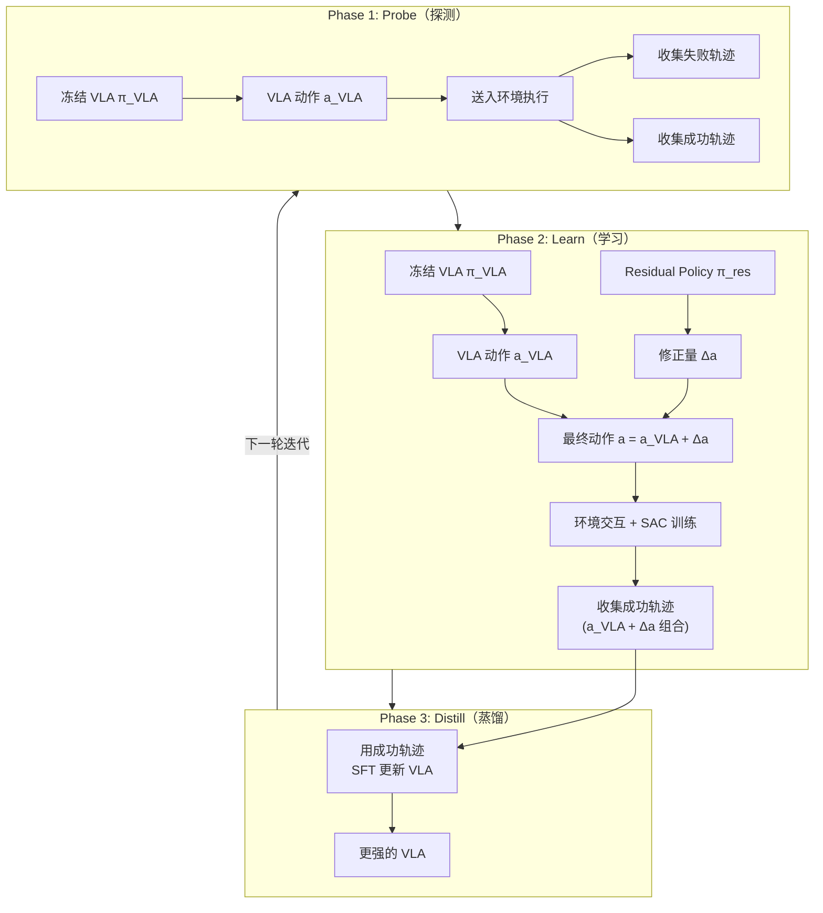

# PLD：Residual RL 自改进 VLA 深度精读

> **论文标题**: Self-Improving Vision-Language-Action Models with Data Generation via Residual RL  
> **作者**: Jianxiong Li, Zhihao Wang, Jinliang Zheng, et al.  
> **机构**: Tsinghua University, Shanghai AI Lab  
> **发表**: arXiv:2511.00091, 2025  
> **代码**: https://github.com/thu-ml/PLD-VLA

**标签**: `#VLA` `#强化学习` `#SAC` `#ResidualRL` `#蒸馏` `#自改进` `#迭代优化`

**知识链接**：
- [SAC](/前置知识/000k_前置知识_SAC_Soft_Actor_Critic) — Residual Policy 使用的 RL 算法
- [Replay Buffer](/前置知识/000r_前置知识_Replay_Buffer_经验回放) — SAC 的 off-policy 数据存储
- [行为克隆与 RL 微调范式](/前置知识/000d_前置知识_行为克隆与RL微调范式) — SFT → RL → 蒸馏的范式
- [策略梯度与 PPO](/前置知识/000a_前置知识_策略梯度与PPO) — 对比：on-policy 方法
- [VLA 模型的 RL 后训练综述](/论文综述/S06_VLA模型的RL后训练综述) — VLA + RL 全景图
- [BootRL 精读](./013_BootRL_冻结VLA加RL_Head) — 对比：另一种"加小模块"的路线

---

## 一、背景与动机

### 1.1 直接 RL 训练 VLA 的问题

直接对 7B VLA 做 RL 训练（如 VLA-RL、RIPT-VLA）面临：

| 问题 | 描述 | 后果 |
|------|------|------|
| 计算成本 | 7B 模型反向传播 | 需要多卡大显存 |
| 训练不稳定 | 大模型 + RL 探索 | 可能灾难性崩溃 |
| 灾难性遗忘 | RL 改变 backbone 权重 | 泛化能力下降 |
| 采样效率 | On-policy 方法数据利用率低 | 需要大量环境交互 |

### 1.2 PLD 的核心思路：不改 VLA，用小模型补偿 + 蒸馏回去

PLD 的核心洞察：**可以不直接训练 VLA，而是先用一个轻量的 Residual Policy 来修正 VLA 的动作，再把修正后的好轨迹蒸馏回 VLA**。

这形成了一个三阶段循环：

$$
\text{Probe}（探测） \to \text{Learn}（学习） \to \text{Distill}（蒸馏） \to \text{Probe} \to \cdots
$$

**类比**：
- **VLA** = 一个有经验但动作不够精准的老师傅
- **Residual Policy** = 一个身手敏捷的年轻助手，专门负责纠正老师傅的小错误
- **蒸馏** = 老师傅观察"老师傅+助手"合作的成功案例，学会了自己把动作做准确
- 然后年轻助手也可以升级（在更高水平上继续纠正），形成**迭代螺旋上升**

### 1.3 贯穿全文的例子

> **场景**：桌面机械臂执行 pick-and-place 任务——"把蓝色积木放到红色碗里"。
>
> VLA 的 SFT baseline 成功率 70%。失败原因分析：
> - 30% 的失败中，约 20% 是"夹取位置偏了 1-2cm"——方向对但精度不够
> - 约 10% 是"完全走错方向"——理解错误
>
> PLD 的目标：用 Residual Policy 修正那 20% 的"差一点"的失败，然后把修正后的好轨迹教给 VLA，使 VLA 本身变得更精准。

---

## 二、方法：Probe-Learn-Distill

### 2.1 整体框架

### 2.2 Phase 1: Probe（探测）

**目标**：评估当前 VLA 的能力，收集失败案例，确定需要改进的地方。

**具体步骤**：
1. 用冻结的 VLA $\pi_{\text{VLA}}$ 在环境中 rollout $N$ 条轨迹
2. 记录成功轨迹 $\mathcal{D}_{\text{success}}$ 和失败轨迹 $\mathcal{D}_{\text{fail}}$
3. 统计成功率 $p_{\text{success}} = |\mathcal{D}_{\text{success}}| / N$

**Probe 阶段的信息**：
- 当前成功率（衡量改进需求）
- 失败模式分析（为 Residual Policy 提供方向）
- 成功轨迹可直接用于后续蒸馏

### 2.3 Phase 2: Learn（学习 Residual Policy）

**核心**：训练一个轻量的 Residual Policy $\pi_{\text{res}}$，学习对 VLA 的动作进行修正。

**动作组合**：

$$
a_{\text{final}} = \underbrace{a_{\text{VLA}}}_{\text{VLA 原始动作（冻结）}} + \underbrace{\Delta a}_{\text{Residual Policy 修正量}}
$$

$$
\Delta a \sim \pi_{\text{res}}(\cdot | s_t), \quad \Delta a \in [-\delta_{\max}, \delta_{\max}]
$$

**逐项拆解**：
- $a_{\text{VLA}} = \pi_{\text{VLA}}(s_t)$：VLA 的原始动作输出（确定性的 argmax 或贪心解码）
- $\Delta a$：Residual Policy 学到的修正量
- $\delta_{\max} = 0.05$：修正量的最大幅度（限制为每步 5cm/5°）
- $s_t$：当前观测（图像 + 本体感知状态）

**为什么用 SAC 而非 PPO？**

Residual Policy 是一个小型网络（~5M 参数），训练它的关键需求是**样本效率**——因为每条轨迹都需要和环境交互。

| 维度 | PPO（on-policy） | SAC（off-policy） |
|------|----------------|-------------------|
| 数据利用率 | 低（每个 batch 只用一次） | 高（replay buffer 反复利用） |
| 适用模型大小 | 大模型（7B）直接训练 | 小模型（<10M）快速训练 |
| 探索方式 | 策略熵 | 最大熵目标（天然鼓励探索） |
| 收敛速度 | 慢 | 快 |
| 复杂度 | 简单 | 中等 |

**结论**：对小型 Residual Policy，[SAC](/前置知识/000k_前置知识_SAC_Soft_Actor_Critic) 是最佳选择——样本效率高、探索性好、收敛快。

**SAC 的训练目标**：

$$
\mathcal{L}_{\text{SAC}}(\phi) = \mathbb{E}_{(s,a,r,s') \sim \mathcal{B}}\left[\left(Q_\phi(s, a) - \left(r + \gamma \min_{i=1,2} Q_{\bar{\phi}_i}(s', a') - \alpha \log \pi_{\text{res}}(a'|s')\right)\right)^2\right]
$$

**逐项拆解**：
- $\mathcal{B}$：[Replay Buffer](/前置知识/000r_前置知识_Replay_Buffer_经验回放)——存储历史经验
- $Q_\phi(s, a)$：Q 网络估计的动作价值
- $r + \gamma \min_{i} Q_{\bar{\phi}_i}(s', a')$：TD 目标（用两个 target Q 取最小）
- $\alpha \log \pi_{\text{res}}$：最大熵项，鼓励探索
- 整体：让 Q 函数逼近真实动作价值

**Residual Policy 的结构**：

| 层 | 尺寸 | 说明 |
|----|------|------|
| 输入 | 状态向量（robot state: 7 关节角 + 末端位姿 + 夹爪） | ~20 维 |
| MLP Layer 1 | 20 → 256 | ReLU |
| MLP Layer 2 | 256 → 256 | ReLU |
| MLP Layer 3 | 256 → 14 | 输出 μ (7维) + log_σ (7维) |
| 输出 | Tanh Squashed Gaussian | 动作空间限制在 [-δ_max, δ_max] |
| **总参数量** | **~100K** | 极其轻量！ |

**代入数字的例子**：

假设当前状态 $s_t$ 下：
- VLA 预测：$a_{\text{VLA}} = [0.08, -0.01, -0.05, 0, 0, 0, 1]$（向右移 8cm，向下 5cm，夹爪闭合）
- 但实际上杯子比 VLA "以为的"位置偏右 1.5cm
- Residual Policy 学到：$\Delta a = [0.015, 0, 0, 0, 0, 0, 0]$（额外右移 1.5cm）
- 最终动作：$a_{\text{final}} = [0.095, -0.01, -0.05, 0, 0, 0, 1]$
- 结果：精确对准杯子 → 抓取成功！

### 2.4 Phase 3: Distill（蒸馏）

**核心**：把 (VLA + Residual) 组合策略产生的成功轨迹**蒸馏回 VLA 本身**——让 VLA 学会 Residual 修正过的好动作。

**蒸馏数据收集**：
- 从 Phase 2 的 SAC 训练过程中，收集所有成功的轨迹 $\{(o_1, a_{\text{final},1}), (o_2, a_{\text{final},2}), \ldots\}$
- 注意：这里的动作是 $a_{\text{final}} = a_{\text{VLA}} + \Delta a$，包含了 Residual 的修正

**蒸馏目标**（标准 SFT/行为克隆）：

$$
\mathcal{L}_{\text{distill}}(\theta) = \mathbb{E}_{(o_t, a_t^*) \sim \mathcal{D}_{\text{success}}}\left[\|{\pi_{\text{VLA}}(o_t; \theta) - a_t^*}\|^2\right]
$$

**逐项拆解**：
- $\theta$：VLA 模型参数（这里**解冻**，允许更新）
- $a_t^* = a_{\text{VLA,old}} + \Delta a$：组合策略产生的成功动作（作为新的"教师"）
- $\pi_{\text{VLA}}(o_t; \theta)$：更新后的 VLA 对同一观测的预测
- L2 损失：让 VLA 学会直接输出这个精确的动作（不再需要 Residual 修正）

**为什么蒸馏有效？**

1. **数据质量高**：只蒸馏成功轨迹——VLA 学到的都是"能完成任务的好动作"
2. **VLA 的泛化能力**：VLA 不只是记住这些具体动作，它的大模型能力让它在相似场景中也能泛化出正确动作
3. **渐进式改进**：每轮蒸馏后，VLA 的 baseline 更高 → 下一轮 Residual 需要修正的越少 → 成功率进一步提升

### 2.5 迭代 PLD 循环

PLD 的真正力量在于**迭代**——每一轮循环后 VLA 变强，下一轮 Residual 又可以在更高水平上进一步修正：

$$
\text{VLA}^{(0)} \xrightarrow{\text{PLD}} \text{VLA}^{(1)} \xrightarrow{\text{PLD}} \text{VLA}^{(2)} \xrightarrow{\text{PLD}} \cdots
$$

**每轮迭代的效果**：

| 迭代 | VLA 成功率 | Residual 修正后成功率 | 蒸馏后新 VLA 成功率 |
|------|-----------|--------------------|--------------------|
| 第 0 轮 | 70%（SFT baseline） | — | — |
| 第 1 轮 | 70% | 85% | 82% |
| 第 2 轮 | 82% | 92% | 89% |
| 第 3 轮 | 89% | 95% | 93% |
| 第 4 轮 | 93% | 96% | 95% |

**观察**：
- 每轮蒸馏后的 VLA 比组合策略稍低（82% < 85%）——因为蒸馏有信息损失
- 但每轮 VLA 都在提升——迭代螺旋上升
- 最终 VLA（95%）远超初始（70%），且不需要部署时携带 Residual Policy

---

## 三、为什么 PLD 优于直接 RL 训练 VLA

### 3.1 计算效率对比

| 方法 | 需要反向传播的模型 | 单次训练成本 |
|------|-------------------|------------|
| VLA-RL (PPO) | 7B VLA + 7B Critic | 48 GPU 小时 |
| RIPT-VLA | 7B VLA | 24 GPU 小时 |
| **PLD (每轮)** | **100K Residual + 7B 蒸馏** | **6h SAC + 4h SFT = 10h** |

PLD 的每轮 SAC 训练只涉及 100K 参数的小网络——在单卡上几小时就能完成。蒸馏阶段虽然要更新 7B VLA，但只是简单的 SFT（比 RL 稳定得多、快得多）。

### 3.2 训练稳定性对比

| 方法 | 崩溃风险 | 原因 |
|------|---------|------|
| VLA-RL | 中-高 | 7B RL 更新可能跳出好的区域 |
| RIPT-VLA | 低-中 | GRPO 无 Critic 但有方差 |
| **PLD** | **极低** | SAC 训 100K 小网络 + SFT 蒸馏（两步都稳） |

PLD 的两个阶段都是成熟的、稳定的训练方式：
- SAC 训小网络：off-policy、replay buffer 稳定
- SFT 蒸馏回 VLA：纯监督学习，无 RL 的不稳定性

### 3.3 泛化能力保持

直接 RL 微调 VLA 会改变 backbone 的表示 → 泛化退化。PLD 的蒸馏阶段虽然也更新 VLA，但用的是**高质量成功轨迹的 SFT**——这和预训练的 SFT 阶段本质相同，不会破坏表示结构。

---

## 四、实验结果

### 4.1 仿真实验

**单任务精度提升**：

| 任务 | SFT baseline | PLD 第 1 轮 | PLD 第 3 轮 | 直接 PPO |
|------|-------------|------------|------------|---------|
| 抓取红色杯子 | 72% | 84% | 93% | 85% |
| 放置到碗中 | 65% | 79% | 90% | 78% |
| 叠放积木 | 48% | 68% | 82% | 72% |
| 推到指定区域 | 78% | 88% | 94% | 87% |
| **平均** | **65.8%** | **79.8%** | **89.8%** | **80.5%** |

**关键发现**：
- PLD 第 3 轮（89.8%）超越直接 PPO（80.5%）达 9.3%
- PLD 的迭代优势在困难任务（叠放积木）上最明显：+34% vs PPO 的 +24%

### 4.2 多任务泛化

在 5 个任务上迭代 PLD 训练，测试在**未见过的 5 个任务**上的泛化：

| 方法 | 训练任务成功率 | 未见任务成功率 | 泛化保持率 |
|------|-------------|-------------|----------|
| SFT | 65.8% | 60.2% | 100% (baseline) |
| VLA-RL (LoRA) | 80.5% | 52.3% | 87% |
| **PLD** | **89.8%** | **58.5%** | **97%** |

PLD 的泛化退化极小（97% 保持率），因为蒸馏本质是 SFT，不会像 RL 那样严重扭曲表示。

### 4.3 消融实验

| 配置 | 最终成功率（3 轮后） |
|------|-------------------|
| **完整 PLD** | **89.8%** |
| 只 1 轮迭代（不迭代） | 79.8%（-10.0%） |
| 去掉 Residual，纯 SAC 从零学动作 | 62.3%（-27.5%） |
| 去掉蒸馏（只用组合策略部署） | 85.2%（-4.6%，且需要额外模块） |
| Residual 修正上限 δ_max = 0.02（太小） | 82.1%（-7.7%） |
| Residual 修正上限 δ_max = 0.15（太大） | 78.5%（-11.3%） |
| 用 PPO 替代 SAC 训 Residual | 83.2%（-6.6%） |
| 蒸馏时也包含失败轨迹 | 76.4%（-13.4%） |

**关键观察**：
- **迭代是最重要的**：1 轮 vs 3 轮差 10%——持续改进的价值
- **Residual 是核心**：去掉 Residual 从零学退化 27.5%——VLA 的先验极其重要
- **只蒸馏成功轨迹**：加入失败轨迹会"污染"蒸馏数据（-13.4%）
- **$\delta_{\max} = 0.05$ 是最佳**：太小修不动，太大偏离太远
- **SAC > PPO**（对小网络）：样本效率更高

### 4.4 Residual Policy 的可视化

论文可视化了不同迭代中 Residual Policy 输出的修正量分布：

| 迭代 | 平均 $|\Delta a|$ | 最大 $|\Delta a|$ | 含义 |
|------|------------------|------------------|------|
| 第 1 轮 | 0.032 | 0.048 | 修正量大——VLA 有较多误差 |
| 第 2 轮 | 0.021 | 0.037 | 修正量减小——VLA 已改进 |
| 第 3 轮 | 0.015 | 0.029 | 修正量更小——VLA 越来越准 |

**直觉**：随着迭代进行，VLA 本身变强了，Residual Policy 需要做的修正越来越少。最终 VLA 可以独立工作，不再需要 Residual。

---

## 五、和 BootRL 的关键区别

PLD 和 [BootRL](./013_BootRL_冻结VLA加RL_Head) 都使用"小模块修正大模型"的思路，但有本质区别：

| 维度 | PLD | BootRL |
|------|-----|--------|
| 修正模块输入 | 机器人状态（低维） | VLA hidden state（高维） |
| 修正模块大小 | ~100K | ~100M |
| VLA 更新否 | ✓（蒸馏阶段更新） | ✗（完全冻结） |
| 部署需求 | 蒸馏后只需 VLA | 需要 VLA + RL head |
| 迭代改进 | ✓（多轮 PLD） | ✗（一次训练） |
| 最终性能 | 更高（89.8%） | 较低（91.8% 但不可迭代） |
| 泛化保持 | 97% | 100% |

**核心区别**：
- BootRL 追求"不动 VLA"→ 部署时需要额外模块
- PLD 追求"改进 VLA 本身"→ 部署时 VLA 独立工作，但需要迭代训练

---

## 六、Residual RL 的理论基础

### 6.1 为什么 Residual 比从零学容易

**定理**（非正式）：如果基础策略 $\pi_{\text{base}}$ 的 expected return 为 $J_{\text{base}}$，且最优策略的 return 为 $J^*$，那么 Residual Policy 只需要弥补 gap $J^* - J_{\text{base}}$，而不是从零达到 $J^*$。

**形式化**：

$$
\text{Residual 需要学的量} = |a^* - a_{\text{VLA}}| \leq \delta_{\max}
$$

如果 VLA 已经"大致对"（$|a^* - a_{\text{VLA}}|$ 通常 < 0.05），Residual 只需要在一个很小的范围内搜索——搜索空间被大幅压缩。

**对比**：从零学习的搜索空间是整个动作空间（如 [-1, 1]⁷）。Residual 的搜索空间只有 [-0.05, 0.05]⁷——缩小了 20 倍！在 7 维空间中，这意味着搜索量减少了 $20^7 \approx 12.8$ 亿倍。

### 6.2 SAC + Residual 的收敛保证

由于 Residual 的动作空间有界（$[-\delta_{\max}, \delta_{\max}]$），SAC 的 Q 函数需要估计的 value range 也更小，这意味着：
- Q 函数近似误差更小
- TD 目标更稳定
- 收敛更快

实验数据：SAC 从零学需要 ~500K 环境步，SAC + Residual 只需要 ~50K 步——**10× 加速**。

---

## 七、实现细节

### 7.1 SAC 训练配置

| 参数 | 值 |
|------|-----|
| Residual Policy 架构 | MLP [20→256→256→14] |
| Q 网络架构 | MLP [27→256→256→1]（state+action→value） |
| 学习率 (Policy) | 3e-4 |
| 学习率 (Q) | 3e-4 |
| Replay Buffer 大小 | 100K transitions |
| Batch size | 256 |
| 温度系数 α | 自动调节 |
| Target Q 更新率 τ | 0.005 |
| 折扣因子 γ | 0.99 |
| 每轮 SAC 训练步数 | 50K 环境步 |
| 每轮训练时间 | ~6h (单 GPU) |

### 7.2 蒸馏配置

| 参数 | 值 |
|------|-----|
| 蒸馏数据量 | 成功轨迹 ~1000 条/轮 |
| 蒸馏方式 | LoRA SFT |
| 学习率 | 2e-5 |
| LoRA rank | 16 |
| 训练 epoch | 5 |
| 蒸馏时间 | ~4h (4×A100) |

### 7.3 完整一轮 PLD 耗时

| Phase | 耗时 | GPU 需求 |
|-------|------|---------|
| Probe | 1h | 1× A100（推理） |
| Learn (SAC) | 6h | 1× A100 |
| Distill (SFT) | 4h | 4× A100 |
| **总计** | **~11h/轮** | |
| **3 轮总计** | **~33h** | |

对比：VLA-RL (PPO) 需要 48h 且效果更差。PLD 用更少计算达到更好结果。

---

## 八、局限性与讨论

### 8.1 蒸馏的信息损失

每轮蒸馏后 VLA 的成功率比 (VLA + Residual) 组合策略低约 3-5%。这是因为 SFT 是近似模仿，不能完美复制组合策略的行为。

**缓解**：多轮迭代可以逐步缩小这个 gap。论文观察到 5 轮后 gap 缩小到 <2%。

### 8.2 Residual 的限制

Residual Policy 只能修正"差一点"的动作。如果 VLA 的基础策略**方向完全错误**（如该向左却向右），$\delta_{\max} = 0.05$ 的修正量不足以纠正。

**适用条件**：VLA 的 SFT baseline 成功率需要 > 30%（至少能"大致对"）。成功率太低说明 VLA 根本不理解任务，Residual 无法补救。

### 8.3 只用低维状态作为 Residual 输入

PLD 的 Residual Policy 只接收低维机器人状态（关节角+末端位姿），不接收图像。这意味着：
- **优势**：网络极小（100K 参数），训练极快
- **劣势**：无法做基于视觉的精细修正（如根据物体外观调整抓取角度）

论文认为 VLA backbone 已经处理了视觉信息并编码到了动作中，Residual 只需要做"空间精度补偿"——低维状态足够。但对于需要精细视觉-运动协调的任务，可能需要扩展为接收 VLA hidden states 的设计（类似 BootRL）。

### 8.4 部署简洁性

PLD 蒸馏完成后，部署时**只需要 VLA 本身**——不需要任何额外模块。这是它相对 BootRL 的核心优势：

- BootRL 部署 = VLA (7B) + RL head (100M)
- PLD 部署 = VLA (7B)（但更强了）

---

## 九、个人评价

### 9.1 核心贡献

PLD 提出了一种优雅的迭代自改进范式。它的关键洞察是：**不需要直接对大模型做 RL（困难且不稳定），可以用小模型探索好策略，再把好策略教回大模型（简单且稳定）**。

这种"explore with small model, consolidate into big model"的思路可能比直接 RL 训练大模型更加实际。

### 9.2 实践建议

- 如果 VLA 成功率 > 50%：PLD 是最稳定、最高效的改进方案
- 如果需要迭代到极高性能（95%+）：PLD 的 3-4 轮迭代可以做到
- 如果部署环境不允许额外模块：PLD 优于 BootRL（蒸馏后只需 VLA）
- 如果 VLA 成功率 < 30%：先考虑增加 SFT 数据或换用直接 RL 方法

### 9.3 学术价值

PLD 证明了 Residual RL + 蒸馏的迭代范式可以在 VLA 场景中高效工作。这个框架通用性强——不限于特定的 VLA 架构或 RL 算法。SAC 可以换成任何 off-policy 方法，VLA 可以换成任何预训练策略。

---

## 延伸阅读

- [SAC 前置知识](/前置知识/000k_前置知识_SAC_Soft_Actor_Critic) ← Residual Policy 使用的 RL 算法
- [Replay Buffer 前置知识](/前置知识/000r_前置知识_Replay_Buffer_经验回放) ← SAC 的 off-policy 数据存储
- [行为克隆与 RL 微调范式](/前置知识/000d_前置知识_行为克隆与RL微调范式) ← 蒸馏的理论基础
- [BootRL 精读](./013_BootRL_冻结VLA加RL_Head) ← 对比：另一种"加小模块"路线
- [VLA-RL 精读](./006_VLA_RL_PPO直接训练自回归VLA) ← 对比：直接 RL 训练 VLA
- [VLA 模型的 RL 后训练综述](/论文综述/S06_VLA模型的RL后训练综述) ← 全景图
