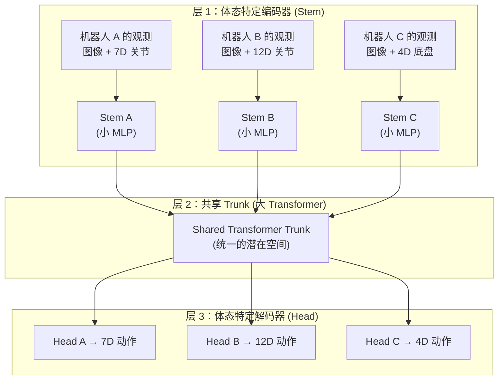

# HPT：异构预训练 Transformer —— 跨体态策略表示学习 深度精读

> **论文标题**: Scaling Proprioceptive-Visual Learning with Heterogeneous Pre-trained Transformers  
> **作者**: Lirui Wang, Xinlei Chen, Jialiang Zhao, Kaiming He  
> **机构**: MIT, Meta AI (FAIR)  
> **发表**: NeurIPS 2024  
> **代码**: https://github.com/liruiw/HPT  
> **权重**: https://huggingface.co/liruiw/hpt-base

**标签**: `#预训练` `#跨体学习` `#Transformer` `#异构数据` `#策略表示` `#HPT`

**知识链接**：
- [Open X-Embodiment 数据集](./011_OpenX_大规模跨体机器人数据集与RTX模型) — HPT 训练数据来源之一
- [Octo：开源通用策略](./012_Octo_开源通用机器人策略) — 另一种跨体预训练方案
- [机器人模仿学习综述](/论文综述/S02_机器人模仿学习综述) — 模仿学习系统背景

---

## 一、背景与动机

### 1.1 异构性问题

机器人数据的"异构性"是跨体态学习的最大障碍。具体来说：

| 异构维度 | 表现 | 例子 |
|---------|------|------|
| 观测空间 | 不同传感器类型和数量 | 有的有手腕摄像头，有的没有 |
| 动作空间 | 不同维度和语义 | 7DOF 臂 vs 12DOF 双臂 vs 四足 |
| 本体感受 | 不同维度 | 关节角 7 维 vs 20 维 |
| 数据格式 | 不同帧率、分辨率 | 5Hz vs 30Hz |

之前的方法（RT-X、Octo）主要通过"多头输出"或"动态维度"来处理。但 HPT 提出了一个更优雅的方案。

### 1.2 HPT 的核心思想

HPT 的关键 insight：

> **不同体态的策略网络共享一个巨大的 Transformer trunk（"共享语言"），只需要小的适配器把不同体态的观测/动作"翻译"到这个共享空间。**

类比：就像不同国家的人虽然母语不同，但可以用英语（共享 trunk）交流。只需要学会"母语 → 英语"的翻译（适配器）。

### 1.3 核心贡献

1. **共享 trunk + 体态适配器架构**：干净地解耦了"通用策略知识"和"体态特定知识"
2. **大规模预训练**：在 50 个数据集、数百万轨迹上训练，trunk 扩展到 1B 参数
3. **Scaling law 验证**：策略性能随 trunk 参数量单调递增
4. **迁移效果**：预训练 trunk 微调到新体态，比从头训练好 20%+

---

## 二、模型架构

### 2.1 三层结构

HPT 的架构清晰地分为三层：

### 2.2 Stem：观测到潜在空间的映射

每种体态有自己的 stem，负责把该体态的观测映射到**固定维度的潜在 token 序列**：

$$
z_t = \text{Stem}_e(o_t^{(e)}) \in \mathbb{R}^{N \times d}
$$

**逐项拆解**：
- $o_t^{(e)}$ — 体态 $e$ 在时间 $t$ 的原始观测（可能是图像 + 7D 关节，也可能是图像 + 20D 关节）
- $\text{Stem}_e$ — 体态 $e$ 专用的编码器（通常是 ViT + MLP，参数量小）
- $z_t$ — 统一维度的潜在 token（$N$ 个 token，每个 $d$ 维）
- 关键：**不管原始观测维度是多少，输出的 $z_t$ 维度相同**

**代入数字**：Franka (7D 关节 + 224×224 图像) → Stem 输出 16 个 256 维 token。WidowX (6D 关节 + 128×128 图像) → 同样输出 16 个 256 维 token。Trunk 看到的都是 16×256，不知道原始数据长什么样。

### 2.3 Shared Trunk：学习通用策略表示

Trunk 是一个标准的 Transformer，在所有体态的数据上共同训练：

$$
h_t = \text{Trunk}(z_t) \in \mathbb{R}^{N \times d}
$$

Trunk 学到的是**与体态无关的操作知识**——如何接近物体、何时该闭合夹爪、如何避障等。

关键设计：Trunk 的参数量远大于 Stem 和 Head，体现了"通用知识远多于体态特定知识"的假设。

### 2.4 Head：潜在空间到动作的映射

每种体态有自己的 action head：

$$
a_t = \text{Head}_e(h_t) \in \mathbb{R}^{d_a^{(e)}}
$$

输出维度 $d_a^{(e)}$ 随体态变化（Franka 是 7D，双臂是 14D，四足是 12D）。

---

## 三、Scaling Law 验证

### 3.1 实验设置

HPT 在 50 个机器人数据集上预训练，trunk 参数量从 1M 扩展到 1B：

| Trunk 大小 | 参数量 | 层数 |
|-----------|-------|------|
| HPT-XS | 1M | 4 |
| HPT-S | 10M | 8 |
| HPT-M | 100M | 16 |
| HPT-B | 300M | 24 |
| HPT-L | 1B | 32 |

### 3.2 关键发现

**策略性能随 trunk 参数量单调递增**——这是机器人策略领域第一次观察到类似 NLP 的 scaling law。

具体表现：
- HPT-XS (1M) → HPT-L (1B)：在仿真评估中成功率提升 30%+ (相对)
- 曲线没有饱和迹象，暗示更大的模型仍会更好
- 数据量和模型大小需要同步扩展（与 Chinchilla 结论一致）

### 3.3 为什么 Scaling 有效？

更大的 trunk 能捕获更复杂的操作模式：
- 小 trunk：只学会"接近物体 → 闭合"的简单模式
- 大 trunk：学会"根据物体形状选择抓取角度"、"预判物体滑动"等精细模式

---

## 四、迁移实验

### 4.1 零样本迁移

预训练的 HPT trunk 搭配随机初始化的新体态 stem + head，在仿真任务上直接评估：
- 比随机策略好很多（说明 trunk 携带了有用知识）
- 但不如微调后（体态差异大时零样本不够）

### 4.2 少样本微调

冻结 trunk，只训练新的 stem + head：
- 50 条示教：HPT 微调 62%，从头训练 35%
- 200 条示教：HPT 微调 78%，从头训练 55%

### 4.3 真实世界验证

在 Franka 真实机器人上评估 5 个 pick-and-place 任务：
- 从头训练 (200 demos)：52%
- HPT 微调 (200 demos)：**71%**（+19%）

---

## 五、与其他方法的对比

| 方法 | 处理异构的方式 | Trunk 大小 | 是否验证 scaling |
|------|-------------|-----------|----------------|
| RT-X | 多头输出 + 体态 token | ~35M | ❌ |
| Octo | 模块化 tokenizer | 93M | ❌ |
| CrossFormer | 统一 attention | ~100M | 部分 |
| **HPT** | **Stem + Trunk + Head** | **1B** | **✅ 系统性验证** |

HPT 的独特贡献不在于性能最好，而在于**首次系统验证了机器人策略的 scaling law**。

---

## 六、总结

HPT 的关键启示：

1. **架构设计**：Stem/Trunk/Head 三层分离是处理异构数据的优雅方案
2. **Scaling law 存在**：机器人策略性能随模型规模增长，与 NLP/CV 一致
3. **预训练收益显著**：大 trunk 预训练 + 小 stem/head 微调 >> 从头训练
4. **研究方向清晰**：更大的模型、更多的数据 → 更好的通用策略

---

## 延伸阅读

- [Octo：开源通用策略](./012_Octo_开源通用机器人策略) — 另一种预训练方案
- [CrossFormer：跨体通用策略](./017_CrossFormer_跨体通用策略) — 跨体策略的另一个代表
- [Open X-Embodiment](./011_OpenX_大规模跨体机器人数据集与RTX模型) — HPT 的训练数据来源
- [π₀：通用基础模型](./014_Pi0_通用机器人基础模型) — 工业级的大模型方案
