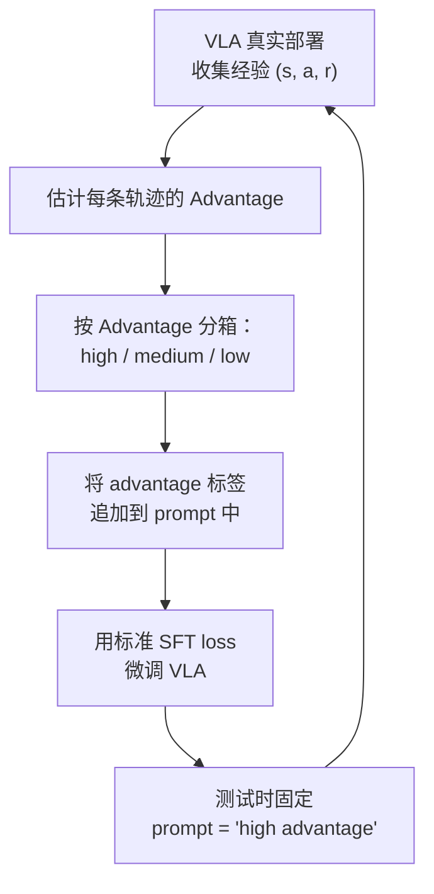
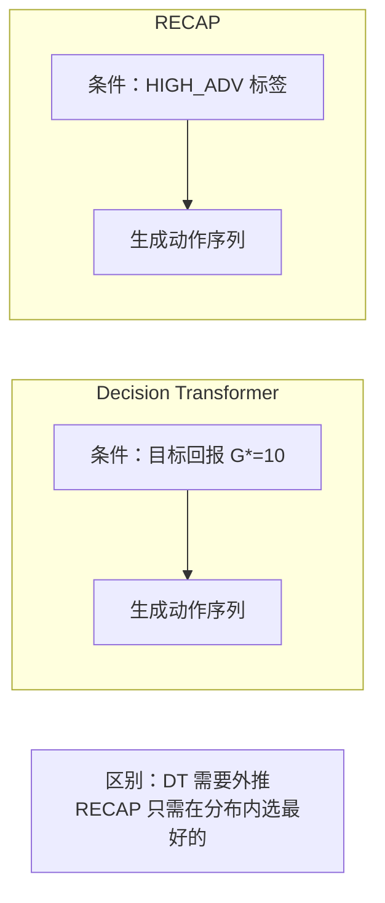

# RECAP：从真实部署经验中 RL 学习 深度精读

> **论文标题**: RECAP: a VLA That Learns From Experience  
> **作者**: Jiafei Duan, Siddharth Karamcheti, Percy Liang, Dorsa Sadigh 等  
> **机构**: Stanford University, Toyota Research Institute  
> **发表**: arXiv:2511.14759, 2025  
> **代码**: 未公开

**标签**: `#VLA` `#强化学习` `#真实机器人` `#advantage conditioning` `#人类校正` `#在线学习`

**知识链接**：
- [策略梯度与 PPO](/前置知识/000a_前置知识_策略梯度与PPO) — Advantage 估计与策略优化
- [Q 函数与 Value 函数](/前置知识/000o_前置知识_Q函数与Value函数) — Advantage = Q - V 的含义
- [行为克隆与 RL 微调范式](/前置知识/000d_前置知识_行为克隆与RL微调范式) — 先 BC 再 RL 的基本框架
- [KL 散度与策略约束](/前置知识/000j_前置知识_KL散度与策略约束) — 为什么不能偏离预训练太多
- [VLA 模型的 RL 后训练综述](/论文综述/S06_VLA模型的RL后训练综述) — RECAP 在综述中的定位

---

## 一、背景与动机

### 1.1 真实世界 VLA 的瓶颈

VLA 模型（如 Octo、OpenVLA、π₀）在大规模离线数据上做 SFT 后，部署到真实机器人通常只有 40-70% 的成功率。现有的改进路径：

| 方法 | 核心思路 | 真实世界可行？ |
|------|---------|-------------|
| 更多离线数据 | 继续收集示教 | 成本高，收益递减 |
| 仿真 RL（PPO/GRPO） | 在仿真中训练 | 需要仿真器，存在 sim2real gap |
| DPO/偏好优化 | 离线偏好排序 | 不做在线交互，提升有限 |
| **RECAP** | **从真实部署经验中学** | **直接在真机上，无需仿真** |

### 1.2 核心问题：如何在不改 VLA 架构的前提下做 RL？

现有的 RL 微调方法（PPO、GRPO）都需要修改训练流程：增加 Critic 网络、计算 importance ratio、引入 clip 目标等。这些方法通常只在仿真中有效——真实世界中 rollout 太贵，梯度估计方差太大。

RECAP 的核心问题是：**能否设计一种方法，只通过修改 VLA 的输入条件（不改架构和训练 loss），就实现 RL 效果？**

### 1.3 RECAP 的核心创新

RECAP 提出 **Advantage Conditioning**（优势条件化）：
1. 在 VLA 输入的 prompt 中附加一个"优势标签"（high/medium/low）
2. VLA 学会条件在高优势标签上时输出好动作，条件在低优势标签上时输出差动作
3. 测试时永远用"high advantage"标签 → 模型自动输出最好的动作

**一句话总结**：不改 VLA，只改输入 prompt，让 VLA 学会"区分好坏动作"——测试时只要好的。

---

## 二、方法详解

### 2.1 整体框架

### 2.2 Advantage 估计

对于每条真实世界的 rollout 轨迹 $\tau = (s_0, a_0, r_0, s_1, a_1, r_1, \ldots, s_T, a_T, r_T)$：

**Step 1：计算轨迹回报**

$$
G(\tau) = \sum_{t=0}^{T} \gamma^t r_t
$$

**逐项拆解**：
- $G(\tau)$：整条轨迹的折扣回报
- $\gamma$：折扣因子，论文使用 $\gamma = 0.99$
- $r_t$：环境每一步的奖励（成功 = 1，失败 = 0，中间步 = 小的 shaping reward）
- $T$：轨迹长度（真实机器人通常 20-60 步）

**Step 2：计算 Step-level Advantage**

$$
\hat{A}_t = G_t - V(s_t)
$$

其中 $G_t = \sum_{k=0}^{T-t} \gamma^k r_{t+k}$ 是从时刻 $t$ 开始的回报。

**关键问题**：真实世界数据量很少（50-200 条轨迹），如何估计 $V(s_t)$？

RECAP 使用**简单的平均回报**作为 Value baseline：

$$
V(s_t) \approx \bar{G} = \frac{1}{N}\sum_{i=1}^{N} G(\tau_i)
$$

**为什么可以这么简单？** 因为 RECAP 不需要精确的 Advantage 值，只需要把轨迹**排序**成好/中/差三类。粗略的 Advantage 估计足以实现排序。

### 2.3 Advantage 分箱与 Token 化

得到所有轨迹的 Advantage 后，按百分位数分箱：

| 百分位 | Advantage 范围 | 标签 |
|--------|--------------|------|
| Top 33% | $\hat{A} > A_{67\%}$ | `[HIGH_ADV]` |
| Middle 33% | $A_{33\%} \leq \hat{A} \leq A_{67\%}$ | `[MED_ADV]` |
| Bottom 33% | $\hat{A} < A_{33\%}$ | `[LOW_ADV]` |

**数值例子**（桌面机械臂 pick-and-place）：

假设收集了 60 条轨迹：
- 20 条成功（$G \approx 1.0$），Advantage ≈ 1.0 - 0.6 = 0.4 → `[HIGH_ADV]`
- 15 条接近成功（抓住但没放到位，$G \approx 0.5$），Advantage ≈ 0.5 - 0.6 = -0.1 → `[MED_ADV]`
- 25 条失败（$G \approx 0.0$），Advantage ≈ 0.0 - 0.6 = -0.6 → `[LOW_ADV]`

### 2.4 条件化训练

将 advantage 标签作为特殊 token 附加到输入 prompt：

$$
\text{Input}_t = [\text{image}_t, \; \text{"pick up the red mug"}, \; \texttt{[HIGH\_ADV]}]
$$

训练 loss 就是标准的下一个 token 预测（和 SFT 完全一样）：

$$
\mathcal{L}_{\text{RECAP}}(\theta) = -\mathbb{E}_{(\tau, \hat{A}) \sim \mathcal{D}}\left[\sum_{t=0}^{T} \log \pi_\theta(a_t | o_t, \text{instr}, \text{adv\_label}(\hat{A}_t))\right]
$$

**逐项拆解**：
- $\pi_\theta(a_t | o_t, \text{instr}, \text{adv\_label})$：VLA 在给定观测、指令和优势标签条件下输出动作的概率
- $\text{adv\_label}(\hat{A}_t)$：根据 Advantage 值映射到的标签（HIGH/MED/LOW）
- $\mathcal{D}$：所有收集到的经验数据（成功 + 失败都用）

**关键洞察**：训练数据包含所有质量的轨迹——好的、中等的、差的——但每条都带了对应的标签。VLA 学会了**"这个标签下应该输出什么水平的动作"**。

### 2.5 测试时推理

测试时，永远把 `[HIGH_ADV]` 标签注入到 prompt 中：

$$
a_t = \pi_\theta(\cdot | o_t, \text{instr}, \texttt{[HIGH\_ADV]})
$$

**直觉**：告诉模型"我现在处于一个高优势情况"，模型就会输出它见过的最好的动作模式。

### 2.6 人类校正的融入

RECAP 的另一个创新是**将人类校正（human corrections）无缝融入训练**：

**为什么人类校正 = 高 Advantage？**

- 人类只在策略即将犯错时介入
- 介入后提供的动作比策略原本要执行的动作好
- 所以相对于 baseline 策略，人类校正有很高的 Advantage

**数学表示**：

$$
\hat{A}_{\text{human}} = Q(s_t, a_{\text{human}}) - V(s_t) \gg 0
$$

因为 $a_{\text{human}}$ 是在策略即将失败的状态下给出的正确动作，所以 $Q(s_t, a_{\text{human}}) \gg V(s_t)$。

---

## 三、理论分析：为什么 Advantage Conditioning 有效

### 3.1 和 Decision Transformer 的关系

RECAP 的灵感来自 Decision Transformer（2021）——条件在目标回报上的序列建模。但有关键区别：

| 维度 | Decision Transformer | RECAP |
|------|---------------------|-------|
| 条件变量 | 目标回报 $G^*$ | Advantage 标签 |
| 粒度 | 轨迹级（整条轨迹同一个 return-to-go） | 步级（每步独立估计 Advantage） |
| 外推 | 设置超高回报可能导致外推失败 | 只需选最好的 1/3，无需外推 |
| 分布 | 连续数值 | 离散分箱（3 类） |

### 3.2 为什么优于"只用成功数据训练"

一个自然的 baseline 是：只用成功轨迹做 SFT，忽略失败数据。

但 RECAP 的设计**明确优于这个 baseline**，原因：

1. **负面数据提供信息**：失败轨迹告诉模型"什么不该做"。标记为 `[LOW_ADV]` 的数据让模型学会区分好坏。
2. **数据利用率更高**：真实世界数据珍贵，RECAP 利用了所有数据（包括失败的）。
3. **对比学习效果**：同一个状态下，模型见过 HIGH 和 LOW 两种标签对应的不同动作——对比信号比单纯模仿更强。

### 3.3 和 PPO 的等价性分析

RECAP 可以被理解为 PPO 的一种**隐式近似**：

$$
\pi_\theta(a|s, \texttt{HIGH\_ADV}) \approx \pi_{\text{old}}(a|s) \cdot \exp\left(\frac{\hat{A}(s,a)}{\beta}\right) / Z(s)
$$

**逐项拆解**：
- 左边：RECAP 在 HIGH_ADV 条件下的策略
- 右边：经典的 advantage-weighted regression（AWR）形式
- $\beta$：温度参数（对应分箱的粗细）
- $Z(s)$：归一化常数

**结论**：Advantage Conditioning 本质上是 Advantage-Weighted Regression 的离散近似——用分类标签替代连续权重，用 SFT loss 替代加权回归 loss。

---

## 四、贯穿全文的例子

### 4.1 场景：桌面机械臂 pick-and-place

任务："把红色方块放到蓝色容器中"

**初始 VLA 部署表现**：成功率 60%（30/50 次成功）

**失败模式分析**：
- 模式 A（15 次）：抓取偏移 2-3cm → 方块滑落
- 模式 B（5 次）：放置时高度判断错误 → 方块弹出容器

### 4.2 第一轮经验收集（50 episodes）

| 轨迹编号 | 结果 | 回报 $G$ | Advantage $\hat{A}$ | 标签 |
|----------|------|----------|---------------------|------|
| τ₁ | 成功 | 1.0 | +0.4 | HIGH |
| τ₂ | 成功 | 1.0 | +0.4 | HIGH |
| τ₃ | 失败（抓取偏移） | 0.2 | -0.4 | LOW |
| τ₄ | 接近成功（掉出容器） | 0.6 | 0.0 | MED |
| ... | ... | ... | ... | ... |
| τ₅₀ | 成功 | 1.0 | +0.4 | HIGH |

平均回报 $\bar{G} = 0.6$（对应 60% 成功率）

### 4.3 加入人类校正

在第一轮中，操作员发现策略经常在"精确对准"阶段出错。于是在第二轮 50 episodes 中：
- 30 次自主执行（不干预）
- 20 次在关键时刻干预，提供精确对准动作

人类校正数据全部标记为 `[HIGH_ADV]`。

### 4.4 训练后结果

| 阶段 | 数据量 | 成功率 |
|------|--------|--------|
| 初始 SFT | 0 episodes 新增 | 60% |
| 第一轮 RECAP（无校正） | 50 episodes | 72% |
| 第二轮 RECAP（加校正） | +50 episodes（含 20 次校正） | **85%** |

**从 60% → 85%，只用了 100 个真实 episodes（约 1 小时机器时间 + 20 分钟人类注意力）**。

### 4.5 数值对比：RECAP vs 直接微调

如果把同样的 100 条数据（成功 + 失败混合）直接做 SFT：

$$
\mathcal{L}_{\text{naive-SFT}} = -\frac{1}{N}\sum_{i=1}^{N}\log\pi_\theta(a_i|s_i)
$$

结果：成功率 60% → 65%（几乎没提升）。原因：SFT 对成功和失败数据一视同仁，学到的是"平均行为"。

RECAP 通过标签区分好坏，让模型学会在 `[HIGH_ADV]` 条件下只输出好动作模式。

---

## 五、实验结果

### 5.1 主实验：真实机器人任务

| 任务 | 初始 VLA | + 50 episodes （纯 SFT） | + 50 episodes （RECAP） | + 50 episodes （RECAP + 校正） |
|------|---------|-----------|------------|--------------|
| Pick & Place | 60% | 65% | 72% | **85%** |
| Stack Blocks | 45% | 48% | 58% | **72%** |
| Pour Water | 35% | 38% | 50% | **68%** |
| Drawer Open | 70% | 73% | 80% | **90%** |
| Wipe Table | 50% | 53% | 62% | **78%** |
| **平均** | **52%** | **55.4%** | **64.4%** | **78.6%** |

**关键发现**：
- RECAP（无校正）：+12.4%（对比纯 SFT 的 +3.4%）
- RECAP + 校正：+26.6%（校正数据带来额外 +14.2%）
- 人类校正的信息密度极高——20 次校正等效于 100+ 次额外示教

### 5.2 Sample Efficiency 对比

| 方法 | 达到 80% 成功率所需真实交互量 |
|------|--------------------------|
| 继续收集示教 + SFT | ~500 episodes |
| PPO（如果能在真实世界跑的话） | ~2000 episodes（理论，实际不可行） |
| DPO | 不收敛（缺少在线数据） |
| **RECAP** | **~50-100 episodes** |
| **RECAP + 校正** | **~50 episodes** |

### 5.3 消融实验

| 配置 | 平均成功率 |
|------|----------|
| **完整 RECAP + 校正** | **78.6%** |
| 去掉 advantage conditioning（只用成功数据 SFT） | 64.0%（-14.6%） |
| 去掉人类校正 | 64.4%（-14.2%） |
| 2 箱（只分 HIGH/LOW） | 74.2%（-4.4%） |
| 5 箱（更细分类） | 77.8%（-0.8%） |
| 用连续 Advantage 值（不分箱） | 75.0%（-3.6%） |

**结论**：
- Advantage conditioning 和人类校正贡献几乎相等
- 3 箱是最好的平衡点——太粗丢信息，太细导致数据不足
- 离散分箱优于连续值（可能因为数据量少时连续条件化过拟合）

---

## 六、和其他方法的深度对比

### 6.1 RECAP vs ConRFT

| 维度 | RECAP | ConRFT |
|------|-------|--------|
| 核心机制 | Advantage conditioning（修改输入） | Q-gradient（修改训练目标） |
| VLA 修改 | **零修改**（只改 prompt） | 需要换动作头为 Consistency Policy |
| RL 算法 | AWR 近似 | SAC / Q-learning |
| 人类参与 | 后验标注 + 校正数据 | 实时在线干预 |
| 训练复杂度 | 极低（标准 SFT） | 高（三个 loss 平衡） |
| 适用 VLA | 任何 VLA | 连续动作头 VLA |

### 6.2 RECAP vs Decision Transformer

---

## 七、局限性与展望

### 7.1 当前局限

1. **Advantage 估计粗糙**：用平均回报做 baseline，不如 GAE 精确。但数据量少时这是合理的 tradeoff
2. **不改变探索策略**：RECAP 只是被动地从部署数据中学习，不主动探索（对比 PPO 有 entropy bonus 鼓励探索）
3. **迭代效率**：每次收集新数据后需要重新微调整个 VLA（不是在线更新）
4. **Advantage 标签的语义**：VLA 是否真的理解了"HIGH_ADV"的含义，还是只是简单的条件化？

### 7.2 未来方向

1. **主动探索**：在测试时偶尔注入 `[MED_ADV]` 标签以增加动作多样性
2. **连续适应**：将 RECAP 变成真正的在线方法（每次执行后立即更新）
3. **多级标签**：用任务分解的里程碑来给更细粒度的 Advantage 估计
4. **跨任务迁移**：一个任务的 HIGH_ADV 经验是否能帮助相似任务

---

## 八、个人评价

### 8.1 独特贡献

RECAP 最优雅的地方在于**零架构修改**——不加 Critic、不加 reward head、不改 loss 函数。它只是改了输入数据的格式，就实现了 RL 的效果。这种"最小侵入"的设计哲学非常适合工业部署——你不需要重新搭建训练框架，只需要改数据预处理流程。

### 8.2 实践启示

对于想要改进已部署 VLA 的团队：
1. 不需要仿真环境
2. 不需要修改模型架构或训练代码
3. 只需要收集部署经验 + 贴标签 + 标准 SFT

### 8.3 哲学意义

RECAP 说明了一个深刻的观点：**好的数据组织方式本身就是一种 RL 算法**。你不需要复杂的策略梯度估计器，只需要告诉模型"这是好的，这是坏的"——模型自己会学会选择好的。

---

## 延伸阅读

- [策略梯度与 PPO](/前置知识/000a_前置知识_策略梯度与PPO) ← Advantage 估计的详细原理
- [Q 函数与 Value 函数](/前置知识/000o_前置知识_Q函数与Value函数) ← Advantage = Q - V
- [VLA 模型的 RL 后训练综述](/论文综述/S06_VLA模型的RL后训练综述) ← RECAP 在综述中的位置
- [ConRFT 精读](./010_ConRFT_一致性策略RL微调VLA) ← 另一种真实世界 RL 方案
- [VLA-RL 精读](./006_VLA_RL_PPO直接训练自回归VLA) ← 仿真 PPO 路线的对比
