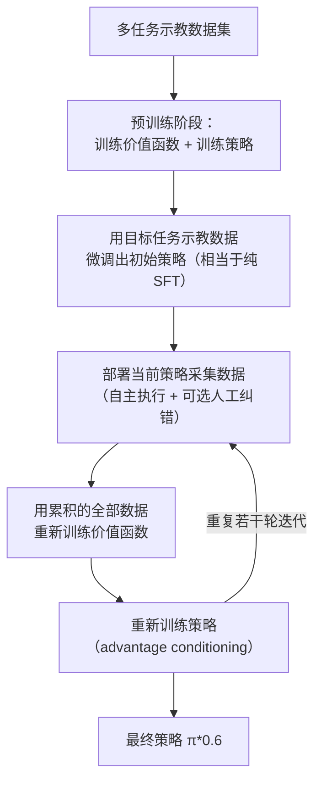

# RECAP：从真实部署经验中 RL 学习 深度精读

> **论文标题**: $\pi^*_{0.6}$: a VLA That Learns From Experience
> **方法名**: RECAP = **R**einforcement learning with **E**xperience and **C**orrections via **A**dvantage-conditioned **P**olicies
> **作者**: Physical Intelligence 团队（Kevin Black, Danny Driess, Chelsea Finn, Karol Hausman, Sergey Levine 等）
> **发表**: arXiv:2511.14759, 2025 年 11 月
> **官网**: https://pi.website/blog/pistar06

**标签**: `#VLA` `#强化学习` `#真实机器人` `#advantage conditioning` `#分布式值函数` `#CFG` `#π0.6`

**知识链接**：
- [Advantage Conditioning：优势条件化策略提取](/前置知识/002r_前置知识_Advantage_Conditioning优势条件化策略提取) — RECAP 核心机制的完整数学推导，本文只讲直觉，推导细节都在这篇
- [AWR：优势加权回归](/前置知识/000u_前置知识_AWR_优势加权回归) — RECAP 对比的另一个 baseline
- [分布式值函数与类别化回报预测](/前置知识/002q_前置知识_分布式值函数与类别化回报预测) — RECAP 价值函数训练用的核心技巧
- [Q 函数与 Value 函数](/前置知识/000o_前置知识_Q函数与Value函数) — Advantage = Q − V 的基础定义
- [Flow Matching 与连续归一化流](/前置知识/000g_前置知识_Flow_Matching与连续归一化流) — π0.6 动作头的生成机制
- [π₀：通用机器人基础模型](./014_Pi0_通用机器人基础模型) — π0.6\* 的前身模型系列
- [VLA 模型的 RL 后训练综述](/论文综述/S06_VLA模型的RL后训练综述) — RECAP 在综述中的定位

**配套阅读**：本文只讲"RECAP 为什么这样设计"，不涉及代码和训练细节。如果你想知道训练流程具体怎么跑、loss 代码长什么样、超参数怎么定，请看配套的工程篇 [RECAP 工程实践：训练流程、数据管道与 Loss 实现](/工程实践/RECAP_训练流程与Loss工程实现)。

---

## 一、背景与动机

### 1.1 VLA 模型的"最后一公里"问题

Physical Intelligence 的 [π₀](./014_Pi0_通用机器人基础模型) 系列 VLA 模型（π0 → π0.5 → π0.6）已经能在大规模示教数据上学到相当通用的操作能力。但示教数据本身有一个结构性的天花板：**模仿学习学到的策略最多和示教数据一样好，永远不会比数据本身更好**。真实部署时，策略仍然会犯专家示教里没出现过的错误——而且这些错误没有办法靠"收集更多同样质量的示教"来根除，因为示教者本身不会去演示"如何从这个特定错误中恢复"。

真正能让策略突破这个天花板的手段是强化学习：让策略在真实环境里反复尝试，用任务结果的反馈（成功/失败）来告诉策略"刚才这一步好还是不好"，从而学会修正自己的错误、加快执行速度、适应部署时遇到的新情况。问题在于，现有的 RL 微调方法几乎都是为仿真环境或中小规模模型设计的：

| 方法路线 | 代表工作 | 应用到大型 VLA + 真实机器人时的困难 |
|---------|---------|-------------------------------|
| 策略梯度直接微调整个 VLA | VLA-RL、PPO 系列变体 | 需要计算 log-likelihood，而 Flow Matching/Diffusion 动作头没有可解析的 log-likelihood；真实世界 rollout 昂贵，方差大 |
| 训练 Residual 策略叠加在冻结 VLA 上 | PLD、ObjectCentric-ResidualRL | 只能修正局部行为，无法端到端改进整个模型 |
| 在动作头之上加 Critic 打分/挑选动作 | Policy-Agnostic RL | 不改变 VLA 本身生成动作的分布 |
| 在扩散/flow 的噪声空间里做 RL | 潜空间 RL 微调（Diffusion Policy 系） | 依旧需要专门设计的策略梯度目标，工程复杂度高 |

这些方法有一个共同弱点：**它们都需要显式的策略梯度目标（policy gradient objective），而策略梯度目标对大型 flow-matching VLA 很难稳定训练**。RECAP 的核心问题是：能不能设计一种方法，**只用标准的下一 token / flow matching 监督学习损失（和预训练完全一样的 loss 形式）**，就把 RL 的效果做出来？

### 1.2 RECAP 的核心思路：一句话概括

RECAP 的答案是：不改变 VLA 的训练目标形式，只往输入里加一个"这是不是一个好动作"的条件标记。具体流程可以概括成三步循环：

1. **数据采集**：让 VLA 在真实任务上跑，记录每个 episode 的成功/失败结果（作为奖励信号），必要时允许专家远程操作在关键时刻介入纠错。
2. **训练价值函数**：用所有收集到的数据（示教 + 自主执行 + 人工纠错）训练一个多任务的价值函数，它能判断"当前状态离任务完成还有多远"。
3. **优势条件化训练**：用价值函数给每一条 (状态, 动作) 打一个二值化的"改进指示符" $I_t$（这个动作相对参考策略是否更优），把 $I_t$ 作为额外的文本输入拼进 VLA 的 prompt 里，用**和原来完全一样的监督学习 loss** 训练整个 VLA。

推理时永远把 $I_t$ 设成"positive"（好动作），VLA 就会输出它在训练数据里学到的"更优"那一类行为模式。

这个想法建立在**优势加权回归（AWR）**这条研究脉络之上，但做了一个关键的形式转换：**AWR 是给每条数据乘一个连续权重（好动作权重大、差动作权重小），RECAP 是给每条数据加一个离散条件标记（这条数据属于"好"类还是普通类），让模型自己学会区分两类数据对应的行为分布**。这个转换让整套方法能直接套用**分类器无关引导（Classifier-Free Guidance, CFG）**的思路——CFG 是图像生成领域的标准技巧：让生成模型同时学会"给条件"和"不给条件"两种模式，推理时通过对比两者的差异来增强条件的影响力（详见 [扩散模型 DDPM 第 5.3 节](/前置知识/000b_前置知识_扩散模型DDPM#5.3-classifier-free-guidance-无分类器引导)）。RECAP 把这个图像生成的技巧迁移到了 RL：条件不再是"红色的猫"这种文本描述，而是"这是一个好动作"这个改进标签——模型学会了"给 positive 标签时输出什么"和"不给标签时输出什么"之间的差异，推理时就能利用这个差异把动作更强力地推向"好"的方向。这背后完整的数学推导（为什么这个转换成立、为什么可以直接约掉一个量）单独放在了前置知识 [Advantage Conditioning：优势条件化策略提取](/前置知识/002r_前置知识_Advantage_Conditioning优势条件化策略提取) 里，本文 2.7 节会详细讲 CFG 在 RECAP 推理阶段的具体用法。

### 1.3 训练出的模型：$\pi^*_{0.6}$

RECAP 应用在 π0.6（π0.5 的改进版，见 1.4 节）上训练出的最终模型被称为 $\pi^*_{0.6}$（读作 pi-star-0.6）。论文的实验结果显示，$\pi^*_{0.6}$ 能够：连续 13 小时不间断制作浓缩咖啡、在陌生房间里连续 2 小时叠不同种类的衣物不中断、在真实工厂产线上组装用于实际包装的纸箱。在最难的几个任务上，RECAP 把任务吞吐率提升超过 2 倍，把失败率降低了大约一半。

### 1.4 π0.6 相较 π0.5 的改动（简要）

π0.6 是 [π0.5](./014_Pi0_通用机器人基础模型) 的直接迭代：底层 VLM 换成了 Gemma 3 4B，动作专家（负责 flow matching 生成连续动作的那部分权重）从更小的规模扩大到 8.6 亿参数，预训练数据加入了更多机器人平台的数据。训练依然遵循 π0.5 提出的 **Knowledge Insulation (KI)** 方案——用 stop-gradient 隔离 flow matching 动作专家和模型主干的其余部分，让离散 token 预测（下一子任务文本、FAST 离散化动作）和连续动作生成（flow matching 输出）各自训练、互不干扰。RECAP 在此基础上唯一新增的架构改动，是让模型多接受一路"改进指示符"文本输入——这是下一节要讲的核心机制。

---

## 二、方法核心思想

### 2.1 整体框架

```mermaid
flowchart TD
    A["多任务示教数据集"] --> B["预训练阶段：\n训练价值函数 + 训练策略"]
    B --> C["用目标任务示教数据\n微调出初始策略（相当于纯 SFT）"]
    C --> D["部署当前策略采集数据\n（自主执行 + 可选人工纠错）"]
    D --> E["用累积的全部数据\n重新训练价值函数"]
    E --> F["重新训练策略\n（advantage conditioning）"]
    F -->|"重复若干轮迭代"| D
    F --> G["最终策略 π*0.6"]
```

这个循环里，**价值函数训练**和**策略训练**是两个独立的子过程，唯一随迭代变化的是"喂给它们的数据"——预训练阶段用全部示教数据，后续每次迭代用示教数据加上不断累积的自主执行/纠错数据。价值函数和策略在每次迭代都是从**预训练检查点**重新微调，而不是从上一轮迭代的检查点继续训练，这样能避免多轮迭代之间的漂移累积。完整的迭代步骤和工程实现细节见配套的[工程篇](/工程实践/RECAP_训练流程与Loss工程实现)。

### 2.2 为什么价值函数 + 二值标签，而不是直接做策略梯度

标准 RL 的思路是直接优化"累计奖励的期望"，为了不让策略跑飞，通常还会加一个"不许偏离产生训练数据的参考策略太远"的约束（这类约束优化问题的标准解法参见 [KL 散度与策略约束](/前置知识/000j_前置知识_KL散度与策略约束)）。这类约束优化问题有一个经典的解——最优的新策略，等于"旧策略乘上一个由优势（advantage）决定的指数权重"：

$$
\hat\pi(a\mid s) \propto \pi_{\text{ref}}(a\mid s)\,\exp\!\big(A(s,a)/\beta\big)
$$

**这个公式在做什么**：给旧策略本来的动作概率乘上一个由优势决定的权重，优势越高权重越大，构造出一个"整体表现只会更好"的新策略。

::: details 📐 逐符号拆解 + 数值代入（点击展开）
**逐符号拆解**：

| 符号 | 含义 | 具体是什么 |
|------|------|-----------|
| $\hat\pi(a\mid s)$ | 改进后的新策略 | 我们想要构造出来的、比 $\pi_{\text{ref}}$ 更好的策略 |
| $\pi_{\text{ref}}(a\mid s)$ | 参考策略 | 产生训练数据的旧策略（示教/历史 rollout） |
| $A(s,a)$ | 优势 | 这个动作比参考策略平均水平好多少（怎么算见下文 2.3～2.5 节） |
| $\beta$ | 温度超参数 | 控制权重对优势的敏感程度，越小权重差距越极端 |
| $\exp(\cdot)$ | 指数函数 | 把优势变成一个正数权重，优势越大权重指数级放大 |
| $\propto$ | 正比于 | 右边算出来的数还要归一化才是合法的概率 |

**代入数字**：设 $\pi_{\text{ref}}(a\mid s)=0.3$，$A(s,a)=1.0$，$\beta=0.5$：

$$
\hat\pi(a\mid s)\propto 0.3\times\exp(1.0/0.5)=0.3\times\exp(2)=0.3\times7.39=2.22
$$

换一个优势为负的动作，$\pi_{\text{ref}}=0.3$，$A=-1.0$：$0.3\times\exp(-2)=0.3\times0.135=0.04$——同样起点的动作，优势为负时权重被压缩到接近 0，几乎不参与后续训练。

**为什么是这个形式**：这正是"最大化期望优势、同时不许偏离参考策略太远"这个约束优化问题的解析解，详见 [KL 散度与策略约束](/前置知识/000j_前置知识_KL散度与策略约束)。
:::

这正是 [AWR](/前置知识/000u_前置知识_AWR_优势加权回归) 的权重公式，也是很多离线 RL 方法的理论基础。但直接套用这个公式给每条训练数据算一个连续权重，在大型 flow-matching VLA 上会遇到实际困难：权重对优势的估计误差极其敏感（指数函数会放大误差），而且优势为负的"差样本"权重会趋近于 0，等于白白丢弃了这部分数据里"不该怎么做"的信息。

RECAP 的解法是把"连续权重"换成"二值标签"：不再给每个动作算一个精确的权重数值，而是先算出优势，再和一个阈值比较，只保留"够不够好"这一个粗粒度的判断：

$$
I_t = \mathbb{1}\big(A(s_t,a_t) > \epsilon\big)
$$

**这个公式在做什么**：把一个连续的优势数值，简化成一个只有"够格/不够格"两种取值的粗粒度标签。

::: details 📐 逐符号拆解 + 数值代入（点击展开）
**逐符号拆解**：

| 符号 | 含义 | 具体是什么 |
|------|------|-----------|
| $I_t$ | 改进指示符 | 二值标签，True（positive）或 False（negative） |
| $\mathbb{1}(\cdot)$ | 指示函数 | 括号内条件成立取 1（True），否则取 0（False） |
| $A(s_t,a_t)$ | 优势 | 2.5 节公式算出来的连续数值 |
| $\epsilon$ | 阈值 | 超参数，通常取价值函数打分的某个百分位数 |

**代入数字**：设 $\epsilon=0.5$。若 $A(s_t,a_t)=2.0$，因为 $2.0>0.5$，$I_t=\mathbb{1}(\text{True})=1$（positive）。若换一条数据 $A=-1.5$，因为 $-1.5<0.5$，$I_t=\mathbb{1}(\text{False})=0$（negative）。

**为什么是这个形式**：用硬阈值二值化换取对优势估计误差的鲁棒性——不需要优势的精确数值，只需要"够不够格"这个粗粒度判断，详见下方正文的三点工程好处。
:::

超过阈值标记为 positive，没超过标记为 negative。这个二值标签不再是乘进 loss 的权重，而是**作为一段文本，拼进模型的输入序列里**，让模型自己学会区分"看到 positive 标签时该输出什么样的动作"和"看到 negative 标签时该输出什么样的动作"。可以证明（推导过程见 [Advantage Conditioning 前置知识](/前置知识/002r_前置知识_Advantage_Conditioning优势条件化策略提取) 第二、三节），只要模型训练出了这个"条件在改进标签上的策略"，推理时直接把标签固定成 positive 采样，效果就等价于从"理论上的最优改进策略"里采样——不需要显式计算任何优势权重，也不需要额外的策略梯度项。

这个转换换来三个直接的工程好处：

1. **对优势估计误差更鲁棒**：只需要判断"够不够格"，不需要精确数值，对价值函数本身的估计噪声容忍度更高。
2. **不丢弃差样本**：negative 标记的数据仍然全力参与训练，只是训练目标是"学会区分它和 positive 样本的不同"，而不是"权重趋近于 0 被忽略"。
3. **训练目标完全不变**：整个过程只是给模型输入多加了一段文本，训练 loss 还是标准的（条件）监督学习损失，不涉及策略梯度、importance sampling 或 trust-region 约束。

上面这一节留了一个关键的空白：$A(s_t,a_t)$ 具体怎么算出来？答案分两步——先要有一个训练好的价值函数（Critic），再用这个 Critic 配合真实观察到的奖励，通过一个具体公式算出优势。下面 2.3～2.5 节依次把这条链路补完：**奖励怎么定义 → Critic 怎么训练出来 → 优势怎么从 Critic 算出来**。

### 2.3 奖励设计：从"成功/失败"这一个标签推出逐步奖励

真实世界任务的奖励信号必须简单、通用，才能应用到"叠衣服""做咖啡""装箱子"这些完全不同的任务上。RECAP 只用一个二元的 episode 级别成功/失败标签，导出逐步奖励：

$$
r_t =
\begin{cases}
0 & \text{episode 在第 } t \text{ 步成功结束} \\
-C_{\text{fail}} & \text{episode 在第 } t \text{ 步失败结束} \\
-1 & \text{其他中间步}
\end{cases}
$$

**这个公式在做什么**：把"整条轨迹最终成功还是失败"这一个粗粒度标签，拆成每一步都有的即时奖励——鼓励策略尽快完成任务，同时让失败的代价远大于任何拖慢速度的代价。

::: details 📐 逐符号拆解 + 数值代入（点击展开）
**逐符号拆解**：

| 符号 | 含义 | 具体是什么 |
|------|------|-----------|
| $r_t$ | 第 $t$ 步的即时奖励 | 三种取值之一：$0$、$-C_{\text{fail}}$ 或 $-1$ |
| $C_{\text{fail}}$ | 失败惩罚常数 | 超参数，取一个足够大的正数（如 200） |
| "episode 在第 $t$ 步成功/失败结束" | 终止条件 | 由任务的成功判定规则（见第三节任务表）决定 |
| "其他中间步" | 未终止的普通时间步 | episode 还没走到最后一步 |

**为什么是这个形式**：每步扣 1 分对应"吞吐率"这个优化目标（走得越快扣分越少）；失败扣一个很大的常数，确保失败轨迹的总回报明显低于任何成功轨迹，不会因为"失败得早"而被误判成不错的结果。

**举例**：某任务最大允许 100 步，$C_{\text{fail}}=200$。一条 40 步成功完成的轨迹，总回报是 $-1\times39+0=-39$；一条走满 100 步仍失败的轨迹，总回报是 $-1\times99-200=-299$——两者相差悬殊，价值函数不会把"走得快但失败"和"走得慢但成功"搞混。
:::

由此可见，价值函数本质上学的是**"负的剩余步数"**：成功的轨迹里价值从很负的数值逐渐爬升到 0，失败的轨迹价值会骤降到远低于任何成功轨迹的水平。论文对不同任务按最大步数做了归一化，统一映射到 $(-1,0)$ 区间，这样几十步和几百步的任务可以共用同一套超参数。这个 $r_t$ 就是下一节训练 Critic 时唯一的监督信号来源——除了它，训练 Critic 不需要任何别的标注。

### 2.4 价值函数（Critic）训练：这个"打分器"是怎么练出来的

**Critic 是需要专门训练的，不是白拿来的。** 上一节定义好 $r_t$ 之后，第一步是把它转换成一个可以直接当训练标签的量——从时刻 $t$ 到轨迹结束的真实回报：

$$
R_t(\tau) = \sum_{t'=t}^{T} r_{t'}
$$

**这个公式在做什么**：给轨迹里的每一个时刻 $t$ 都算一个"从这一步往后，直到 episode 结束，一共拿到了多少奖励"的数字，这个数字就是训练 Critic 时 $V(s_t)$ 应该去逼近的目标。

::: details 📐 逐符号拆解 + 数值代入（点击展开）
**逐符号拆解**：

| 符号 | 含义 | 具体是什么 |
|------|------|-----------|
| $\tau$ | 一条完整轨迹 | 一次机器人 rollout 的完整状态-动作-奖励序列，长度 $T$ 步 |
| $t'$ | 求和的时间下标 | 从当前时刻 $t$ 一直数到轨迹结束的 $T$ |
| $r_{t'}$ | 第 $t'$ 步的即时奖励 | 上一节定义的 $-1$ / $0$ / $-C_{\text{fail}}$ 三种取值之一 |
| $R_t(\tau)$ | 训练标签 | 从 $t$ 到结束的奖励总和，是一个已经能直接算出来的具体数字（不需要任何网络参与） |

**数值代入**：沿用上一节 $C_{\text{fail}}=200$、40 步成功轨迹的例子。这条轨迹里，最后一步（第 40 步）奖励是 $0$（成功），其余 39 步每步都是 $-1$。取 $t=38$（倒数第 3 步）：

$$
R_{38}(\tau) = r_{38}+r_{39}+r_{40} = (-1)+(-1)+0 = -2
$$

取 $t=0$（轨迹开头）：

$$
R_0(\tau) = \sum_{t'=0}^{39} r_{t'} = -1\times39 + 0 = -39
$$

可以看到 $R_t$ 随着 $t$ 增大（越接近成功）逐渐从 $-39$ 爬升到接近 $0$——这正是 2.3 节说的"价值函数学的是负的剩余步数"这句话的来源：$R_t$ 本身就是"剩余步数的负值"（在这个简化例子里）。

**为什么是这个形式**：不用折扣因子 $\gamma$（即隐含 $\gamma=1$），是因为这里的奖励结构本身已经是"每步固定扣 1 分"，任务的紧迫性已经体现在奖励设计里，不需要再用折扣去压制远期奖励——这和大多数 RL 任务里奖励稀疏、需要 $\gamma<1$ 控制方差的情况不同。
:::

有了每个时刻的标签 $R_t(\tau)$，训练 Critic 网络 $V_\phi$ 就是一个标准的监督学习问题：把 $(s_t,\ 语言指令,\ R_t(\tau))$ 三元组喂给网络，让网络的输出逼近 $R_t(\tau)$。RECAP 具体用的不是普通的均方误差回归，而是把 $R_t$ 离散化成落在哪个 bin、用分类交叉熵训练——这个"分布式 Critic"怎么训练、为什么这样比直接回归数字更稳，完整的公式推导和独立的数值例子见前置知识 [分布式值函数与类别化回报预测](/前置知识/002q_前置知识_分布式值函数与类别化回报预测)，这里不重复推导，只强调训练 Critic 用到的原始标签 $R_t(\tau)$ 正是上面这个公式，且训练是纯 Monte Carlo 的——不需要 bootstrap 自己预测自己，标签是轨迹跑完之后直接算出来的真实回报。Critic 的骨干规模比策略网络小（6.7 亿参数，同样从预训练 VLM 初始化），训练时混入少量通用多模态数据防止过拟合。

### 2.5 从 Critic 到优势 $A(s,a)$：把训练好的 $V$ 用起来

**一个自然的疑问**：2.4 节里，每条轨迹的真实回报 $R_t(\tau)$ 已经是实打实观察到的数字了（不是估计值），为什么不直接拿它当优势用，还要多训练一个 Critic 来打分？

**问题出在"真实"不等于"有参照"**。$R_t(\tau)$ 只回答了一件事：这一条轨迹，从 $t$ 时刻往后，实际拿到了多少总奖励。它没有回答第二件、更关键的事：**这个数字算好还是算差？** 要判断"好不好"，必须有一个参照点——从状态 $s_t$ 出发，正常水平能拿到多少。这个参照点在数学上就是 $V(s_t)=\mathbb{E}[R_t\mid s_t]$：对所有可能从 $s_t$ 出发的轨迹取平均（关于 $V$ 的定义详见前置知识 [Q 函数与 Value 函数](/前置知识/000o_前置知识_Q函数与Value函数) 第一节）。单独一条轨迹的 $R_t(\tau)$ 只是这个分布里的**一个样本**，样本本身不知道自己在分布里排第几，必须拿去和均值比较才有意义。

**为什么不能简单地把很多条轨迹的 $R_t(\tau)$ 分组平均，凑出这个参照点**？因为真实机器人的状态 $s_t$ 是连续、高维的（多路相机图像 + 关节角度），实际数据里几乎不可能出现两条轨迹在完全相同的 $s_t$ 上都跑过一遍——没有"重复实验"可以直接取平均。这正是需要训练一个 Critic（函数逼近）的原因：Critic 从几千条**不同**轨迹里学习"状态和回报的对应关系"，训练好之后，遇到一个新的、从未见过的具体状态，也能插值/泛化出"像这样的状态，正常水平大概能拿多少分"——本质上是用大量相似但不完全相同的状态，把统计意义上的"重复实验取平均"这件事用神经网络近似出来。

**不做这一步会有什么后果**：如果直接拿 $R_t(\tau)$ 的绝对值去跟阈值 $\epsilon$ 比较，会把"任务本身的难度"和"这一步动作的好坏"混在一起，产生系统性的误判。举个具体例子——同一个咖啡任务，两个不同的起始状态：

| 起始状态 | 该状态下正常水平 $V(s_t)$ | 某条实际轨迹的 $R_t(\tau)$ | 直接用 $R_t$ 判断 | 用 $A=R_t-V$ 判断 |
|---------|--------------------------|---------------------------|-------------------|---------------------|
| 状态 A（滤杯已经拿歪，起点本身就差） | $-80$（这个起点正常也要扣很多分才能补救） | $-75$（策略处理得相当不错，比这个烂起点的平均水平还好） | $-75 < \epsilon$（比如 $\epsilon=-50$），被误判为 negative | $A=-75-(-80)=+5>0$，正确判为 positive |
| 状态 B（一切正常，起点很顺） | $-10$（正常水平本来就很好） | $-15$（这一步其实操作得有点笨拙，比正常水平差） | $-15 < \epsilon$ 附近，可能被误判为 positive（因为绝对值不算差） | $A=-15-(-10)=-5<0$，正确判为 negative |

不减去 $V(s_t)$ 之前，状态 A 的动作因为绝对回报比较低而被冤枉成"差动作"，状态 B 的动作因为绝对回报看起来还行而被误判为"好动作"——但实际上状态 A 的策略正在努力补救一个烂摊子（做得比预期好），状态 B 的策略在一个简单局面下反而没发挥出正常水平（做得比预期差）。减去 $V(s_t)$ 之后，两者的标签才反映出**这一步动作本身的决策质量**，而不是"起点难不难"。这也是为什么 Advantage 要定义成 $Q-V$ 或者这里的"实际回报 − 参照回报"而不是直接用绝对回报——[Q 函数与 Value 函数](/前置知识/000o_前置知识_Q函数与Value函数) 第五节讲过同样的道理：Advantage 天然是"相对于平均水平"的度量，能把"任务/状态本身的难度"这个混杂因素减掉。

理解了这一层动机，再看 Critic 训练好、冻结之后怎么被用来打分就很直接了。RECAP 用的是**N 步展开**的优势公式：

$$
A(s_t,a_t) = \sum_{i=0}^{N-1} r_{t+i} + V_\phi(s_{t+N}) - V_\phi(s_t)
$$

**这个公式在做什么**：衡量"实际执行了这个动作之后的 $N$ 步"比"Critic 原本对当前状态的预期"好了多少——真实拿到的近期奖励，加上 Critic 对远期价值的估计，再减去 Critic 一开始对当前状态的估计。

::: details 📐 逐符号拆解 + 数值代入（点击展开）
**逐符号拆解**：

| 符号 | 含义 | 具体是什么 |
|------|------|-----------|
| $N$ | 向前展开的步数 | 一个超参数，论文目标任务微调阶段取 $N=50$；预训练阶段直接取 $N=T$（整条轨迹展开到底，此时 $V_\phi(s_{t+N})$ 对应轨迹终态，约定其值为 0，公式退化为纯 Monte Carlo 回报减去 $V_\phi(s_t)$） |
| $r_{t+i}$ | 未来第 $i$ 步的真实奖励 | 2.3 节定义的即时奖励，是训练数据里真实观察到的值，不是估计值 |
| $\sum_{i=0}^{N-1} r_{t+i}$ | 未来 $N$ 步的真实奖励总和 | 对应第〇节（工程篇）伪代码里的 `future_reward_sum` |
| $V_\phi(s_{t+N})$ | Critic 对"$N$ 步之后那个状态"的估计 | 用 2.4 节训练好的 Critic，在 $N$ 步之后的观测上跑一次前向得到；对应工程篇伪代码的 `v_lookahead` |
| $V_\phi(s_t)$ | Critic 对"当前状态"的估计 | 同一个 Critic，在当前观测上的输出；对应工程篇伪代码的 `v_current` |

**数值代入**：取 $N=3$。假设 Critic 对当前状态的估计是 $V_\phi(s_t)=-10$，实际执行 3 步后到达的状态，Critic 估计是 $V_\phi(s_{t+3})=-5$，这 3 步真实拿到的奖励是 $r_t=-1,\ r_{t+1}=-1,\ r_{t+2}=-1$（都是中间步，未成功未失败）：

$$
A(s_t,a_t) = \big[(-1)+(-1)+(-1)\big] + (-5) - (-10) = -3 + (-5) + 10 = 2
$$

算出来 $A=2$，是个正数：意味着实际走的这 3 步，比 Critic 原本对当前状态的预期要好（虽然过程中每步都在扣分，但扣的分比"当前状态和 3 步后状态的价值差"还少，说明进展比预期快）。接下来就是前面已经给出的二值化：设阈值 $\epsilon=0.5$，因为 $A=2>0.5$，这一步被标记为 $I_t=\text{True}$（positive）。如果换一批数据算出来 $A=-1.5$，因为 $-1.5<0.5$，则 $I_t=\text{False}$（negative）。这一步二值化的完整理论依据（为什么"优势阈值化"等价于"条件策略提取"）在前置知识 [Advantage Conditioning](/前置知识/002r_前置知识_Advantage_Conditioning优势条件化策略提取#四怎么把改进指示符变成一个可以训练的标签) 第四节有完整推导，这里只强调 $A$ 本身怎么来。

**为什么是这个形式（$N$ 步展开而不是纯 Monte Carlo）**：纯 Monte Carlo（$N=T$）不依赖 Critic 的估计误差，完全用真实发生的奖励，但代价是方差大——因为要等一整条轨迹跑完才能算，且轨迹越长，噪声（环境随机性、策略的探索性动作）累积得越多。用较小的 $N$（如 50）截断，用真实奖励覆盖近期、用 Critic 估计覆盖远期，是标准的"用一点模型带来的偏差，换取更低的方差"（bias-variance trade-off）的做法：训练数据还不多、Critic 本身可能不够准的目标任务微调阶段用小 $N$ 更稳；预训练阶段数据量大、每条轨迹本身就是完整的示教/rollout，直接用完整轨迹的真实回报（$N=T$）更简单也更准确。
:::

### 2.6 模型输入：改进指示符插在哪、和什么一起训练

π0.6 本身的生成顺序是：先自回归预测下一个子任务描述（比如"拿起咖啡杯"），再基于此用 flow matching 生成一段连续动作块。RECAP 唯一新增的输入，是把改进指示符 $I_t$ 编码成一句文本（"Advantage: positive" 或 "Advantage: negative"），插在预测出的子任务描述之后、动作块之前——这意味着改进条件只影响动作生成这一部分，不影响子任务预测本身。

训练目标是同时优化两条分支：一条不给 $I_t$（学习"数据平均行为"），一条给出真实的 $I_t$（学习"区分好坏"）。两条分支共享全部参数，只是输入序列里有没有那一段改进文本。此外有两个重要的实现细节：

1. **人工纠错样本强制标记为 positive**：只要这段动作来自专家远程操作介入纠错，就直接把 $I_t$ 设为 True，不再依赖价值函数重新估计——专家介入的时刻通常正是策略即将犯严重错误的时刻，专家提供的动作几乎必然优于策略原本会执行的动作。
2. **训练时随机丢弃 $I_t$（概率 30%）**：训练循环中每个样本有 30% 的概率**不把改进文本塞进输入**——模型这次前向只看到观测、语言指令和子任务描述，不看到任何 advantage 标签。这意味着模型必须同时学会两件事：(a) 在看到"Advantage: positive/negative"时，输出和标签对应的那一类动作；(b) 在**什么标签都没看到**时，输出训练数据里所有动作的平均趋势。这样训练出来的模型就自带"有条件"和"无条件"两种推理入口——推理时可以对比这两个入口的差异来放大条件的影响，这正是分类器无关引导（[Classifier-Free Guidance](/前置知识/000b_前置知识_扩散模型DDPM#5.3-classifier-free-guidance-无分类器引导), CFG）的标准训练方式。为什么需要这个、推理时怎么用这两个入口，2.7 节马上展开。

由于 π0.6 的动作部分是用 flow matching 生成的连续分布，没有解析的对数似然，实际训练用 flow matching 的去噪回归损失代替（详见 [Flow Matching 与连续归一化流](/前置知识/000g_前置知识_Flow_Matching与连续归一化流)）——这一层 RECAP 完全没有做任何改动，也是"advantage conditioning 只改输入格式、不改训练目标形式"这句话最直接的体现。这部分训练循环的完整伪代码在[工程篇](/工程实践/RECAP_训练流程与Loss工程实现)第二节给出。

### 2.7 推理时的增强：Classifier-Free Guidance（CFG）

#### 2.7.1 CFG 在 RECAP 里具体做了什么

回顾 2.6 节：训练时通过随机丢弃 $I_t$，模型同时学会了两种生成能力：

- **无条件生成** $\pi_\theta(a\mid s)$：不看改进标签，输出"训练数据中所有动作的平均趋势"
- **条件生成** $\pi_\theta(a\mid I{=}\text{positive}, s)$：看到"positive"标签，输出训练数据中"好动作"那一子集对应的行为分布

最直接的推理方式就是把标签固定为 positive，让模型走条件生成分支——这等价于 $\beta=1$ 的情况。但分类器无关引导（Classifier-Free Guidance, CFG）提供了一种更激进的选择：**不只是走条件分支，而是在条件和无条件两个分支的"差异方向"上多走几步**，把策略更强力地推向"好动作"的方向。

具体机制：π0.6 的动作头是基于 flow matching 的生成模型。在每一步采样迭代中（flow matching 的 ODE 积分步），模型输出一个"速度场"（velocity field）$v_\theta$——可以理解为"当前噪声应该朝哪个方向变化才能逐渐变成一个合理的动作"。CFG 在这一步上做文章：

$$
v_{\text{guided}}(a_t, s) = v_\theta(a_t \mid s) + \beta \Big( v_\theta(a_t \mid I{=}\text{pos}, s) - v_\theta(a_t \mid s) \Big)
$$

**这个公式在做什么**：把"有改进标签时的速度场"和"无标签时的速度场"之间的差异方向提取出来，再按 $\beta$ 倍放大后叠加回去——效果是让每一步去噪都更激进地朝"好动作区域"偏移，而不是仅仅沿着条件分布的自然方向走。

::: details 📐 逐符号拆解 + 数值代入（点击展开）
**逐符号拆解**：

| 符号 | 含义 | 具体是什么 |
|------|------|-----------|
| $v_\theta(a_t \mid s)$ | 无条件速度场 | 模型不看改进标签时预测的"噪声应该往哪变"，对应训练时丢弃 $I_t$ 那 30% 的前向传播路径学到的行为 |
| $v_\theta(a_t \mid I{=}\text{pos}, s)$ | 条件速度场 | 模型看到"Advantage: positive"时预测的速度场，对应训练时保留 $I_t$ 的那 70% 路径学到的行为 |
| $v_\theta(\cdot \mid I{=}\text{pos}) - v_\theta(\cdot \mid s)$ | 条件修正方向 | "给了改进标签之后，速度场往哪个方向偏了多少"——这个差值向量就是"改进"这个条件在动作空间里的几何方向 |
| $\beta$ | CFG 强度（guidance scale） | 控制沿着修正方向多走几步。$\beta=1$ 时公式简化为 $v_\theta(a_t \mid I{=}\text{pos}, s)$——就是普通的条件采样，不做额外增强 |
| $v_{\text{guided}}$ | 最终用于 ODE 积分的合成速度场 | 比条件速度场还更激进地偏向"好动作"区域 |

**数值代入**：假设动作是 2 维向量 $(x, y)$。在某一步 ODE 积分中：

- 无条件速度场：$v_\theta(a_t \mid s) = (0.3, -0.1)$
- 条件速度场（positive）：$v_\theta(a_t \mid I{=}\text{pos}, s) = (0.5, 0.2)$
- 差值（修正方向）：$(0.5-0.3,\ 0.2-(-0.1)) = (0.2, 0.3)$

取 $\beta=1$（不增强）：
$$
v_{\text{guided}} = (0.3,-0.1) + 1\times(0.2,0.3) = (0.5, 0.2)
$$
就是条件速度场本身——普通条件采样。

取 $\beta=2$（温和增强）：
$$
v_{\text{guided}} = (0.3,-0.1) + 2\times(0.2,0.3) = (0.3+0.4,\ -0.1+0.6) = (0.7, 0.5)
$$
比条件速度场 $(0.5, 0.2)$ 更极端——在修正方向上多走了一倍，最终生成的动作会更偏向"高优势"的那一端。

取 $\beta=3$（激进增强）：
$$
v_{\text{guided}} = (0.3,-0.1) + 3\times(0.2,0.3) = (0.9, 0.8)
$$
更极端。速度场已经明显超出了条件分布的自然范围——对应图像生成里"过饱和"的现象，在机器人动作领域就是"动作过于激进、可能超出安全/合理范围"。

**为什么是这个形式**：这个公式本质上是对 score function 的线性插值/外推。在概率论层面，它等价于从一个"条件效果被放大了 $\beta$ 倍"的虚拟分布中采样：$\log\hat\pi \propto \log\pi_\theta(a\mid s) + \beta\big(\log\pi_\theta(a\mid I,s)-\log\pi_\theta(a\mid s)\big)$。$\beta>1$ 时是外推（比条件采样更极端），$\beta<1$ 时是插值（比条件采样更保守）。数学推导见 [Advantage Conditioning 前置知识](/前置知识/002r_前置知识_Advantage_Conditioning优势条件化策略提取) 第五节。
:::

#### 2.7.2 为什么 RECAP 对 CFG 用得很克制

虽然 CFG 在图像生成领域几乎是标配（Stable Diffusion 默认 $w=7.5$），但 RECAP 对 CFG 非常谨慎，实践中 $\beta$ 只在 1.5～2.5 的温和范围内使用，很多任务甚至直接用 $\beta=1$（等于不做增强）。原因有三：

1. **动作空间比像素空间小得多、更敏感**：图像有百万维像素，个别像素过饱和不影响整体画质。但机器人动作通常只有 6～20 维，任何一个维度的过度偏移都可能导致碰撞、失控或超出关节限位。$\beta$ 过高时，合成速度场会把动作推向训练数据支撑集的边界甚至外部——那里模型从未见过真实数据，行为不可预测。

2. **阈值 $\epsilon$ 已经提供了充足的"挑食"能力**：2.5 节的优势阈值本身就在做"只学好动作"这件事——阈值设得越高，positive 集合越精英化，模型学到的条件分布本身就已经足够好。在此基础上再用 CFG 外推，边际收益递减，风险却急剧上升。

3. **经验上，$\beta>3$ 后性能开始下降**：论文实验发现，$\beta$ 从 1 提升到 2 时有小幅收益（动作更果断），但超过 3 后任务成功率反而开始下滑——策略变得过于"自信"，在需要谨慎精确操作的阶段（如锁紧咖啡机滤杯）反而出错。

**总结**：CFG 在 RECAP 中是一个可选的微调旋钮，不是核心机制。核心机制是 advantage conditioning 本身（2.2～2.6 节）——它决定了策略的质量下限；CFG 只是在边际上"再锐化一点"，而且必须小心使用。

---

## 三、贯穿全文的例子：五类真实世界任务

RECAP 的实验完全基于真实机器人平台（双臂系统，两只 6 自由度手臂配平行夹爪，50Hz 关节位置控制，头部相机+双腕相机三路视觉输入），而不是仿真。评估任务覆盖：

| 任务 | 描述 | 成功判定 |
|------|------|---------|
| 叠衣服（T 恤和短裤） | π0 论文中的标准折叠任务 | 200 秒内正确折叠并堆放在指定角落 |
| 叠衣服（多样化） | 11 种衣物类型（毛衣、牛仔裤、袜子等），主要评估最难的翻领衬衫 | 500 秒内正确折叠 |
| 叠衣服（定向去除失败模式） | 单一橙色 T 恤，从固定的对抗性初始姿态开始 | 200 秒内领子必须正面朝上折叠 |
| 双份浓缩咖啡制作 | 拿滤杯、磨豆、压粉、锁紧、接杯、萃取、上桌，共 7 个子步骤 | 200 秒内无重大失误完成全部步骤 |
| 纸箱装配 | 从平铺纸板折成箱子、贴标签、码放到指定位置 | 600 秒内完成全部子步骤 |

这些任务共同的特点是**长时程（5~15 分钟）、涉及可形变物体/液体/接触密集的操作**，是模仿学习最容易在真实世界中"看起来会做、实际不够稳"的那类任务——非常适合暴露 RL 微调的效果。

---

## 四、实验结果

### 4.1 RECAP 相较各阶段基线的提升

论文比较了五个逐步递进的基线：预训练的 π0.5、预训练的 π0.6（无优势条件化）、RL 预训练的 π0.6\*（预训练阶段就用 RECAP，但没有目标任务的在线数据）、π0.6\* + 目标任务示教微调（相当于"离线 RL 预训练 + 高质量 SFT"）、最终的完整 π0.6\*（RECAP，含自主 rollout 和专家纠错）。

**核心发现**：在所有任务上，完整 RECAP 训练出的 π0.6\* 显著超过前面所有阶段。在多样化叠衣服和浓缩咖啡两个最难的任务上，**吞吐率提升超过 2 倍**，失败率**降低约一半**。除了多样化叠衣服任务外，其余任务最终成功率都达到 **90% 以上**——这是一个真正可以在办公室连续煮咖啡、在工厂连续装箱的实用化水平。对于简单的叠衣服任务（T 恤和短裤），SFT 阶段成功率已经接近上限，但完整 RECAP 仍能通过提升执行速度带来吞吐率的显著增益。

### 4.2 多轮迭代带来的持续提升

论文进一步考察了多次"采集数据 → 重训价值函数 → 重训策略"迭代循环的效果，在 T 恤/短裤折叠任务（每轮迭代在 4 台机器人上采集 300 条轨迹，仅用自主执行数据，不含人工纠错）和纸箱装配任务（每轮迭代 600 条自主轨迹 + 360 条含专家纠错的轨迹）上分别测试两轮迭代。

折叠任务在第一轮迭代后成功率已经爬升到 90% 以上，第二轮迭代主要贡献在吞吐率上（总体吞吐率提升约 50%）；纸箱装配任务需要更多数据才能看到效果，但第二轮迭代后吞吐率提升了约 **2 倍**，成功率在两轮迭代中都持续显著改善，最终折箱和贴标签两个子步骤的成功率都达到约 90%（在 600 秒时限内）。

### 4.3 消融：advantage conditioning vs AWR vs PPO

为了验证 advantage conditioning 这个策略提取方式本身的价值，论文用**完全相同的数据**（用 RECAP 采集得到的数据）分别训练三种策略提取方法：

| 方法 | 核心机制 | 相对表现 |
|------|---------|---------|
| **RECAP（advantage conditioning）** | 条件化生成，监督学习 loss | 吞吐率和成功率均显著领先 |
| AWR | 用 $\exp(A/\beta)$ 对每条样本加权做模仿学习 | 能达到还算合理的成功率，但吞吐率明显更低（学出来的策略更慢） |
| PPO（DPPO/FPO 变体 + SPO 式约束） | 显式策略梯度 + trust-region 约束 | 表现远落后于 RECAP，且难以稳定超过"离线 RL + SFT"基线；由于是离策略（off-policy）设置，需要非常小的信任域参数才能稳定训练，但即便稳定了效果依然不好 |

这个对比直接验证了 2.2 节的核心论点：**在大型 flow-matching VLA 上，条件化生成比显式策略梯度（PPO）或连续权重回归（AWR）更容易训练出既高成功率又高速度的策略**——PPO 对数似然的近似在离策略场景下天然不稳定，AWR 因为把"差样本"的权重压到接近零，等价于只用一小部分高质量数据训练，导致学出来的策略趋向于"保守但慢"。

### 4.4 用 RECAP 定向消除特定失败模式

论文还专门设计了一个诊断性实验：用严格的成功判据（T 恤必须折叠得领子正面朝上）和一个对抗性的初始摆放条件，验证 RECAP 是否真的能"针对性地"改掉策略的某个具体坏习惯，而不只是整体上变好一点。结果显示，仅用两轮迭代（每轮采集 600 条轨迹）、**完全没有人工纠错数据、纯靠 RL**，策略在这个刁钻的初始条件下成功率提升到 **97%**，且执行速度也很快。这说明 RECAP 不仅能提升整体鲁棒性，也能被用作"用少量数据精准修正模型某个已知坏习惯"的工具，而不需要重新收集大批量示教数据。

---

## 五、和其他方法的深度对比

### 5.1 RECAP vs Decision Transformer / Reward-Conditioned Policies

RECAP 和 Decision Transformer 都属于"条件化生成"这条脉络（把 RL 问题转化为条件序列建模），但两者的条件粒度和使用方式不同：

| 维度 | Decision Transformer | RECAP |
|------|---------------------|-------|
| 条件变量 | 连续的目标回报 (return-to-go) | 二值化的改进指示符 $I_t$ |
| 粒度 | 整条轨迹共享同一个 return-to-go | 每个时间步独立估计优势再二值化 |
| 推理时如何"要好结果" | 设置一个较高的目标回报（存在外推风险——训练时没见过这么高的回报，模型可能瞎猜） | 永远设 $I_t=\text{True}$，这个条件在训练数据里天然存在，不需要任何外推 |
| 理论保证 | 依赖 return-conditioned supervised learning 是否能逼近最优策略（不总成立） | 直接对应正则化 RL 目标的闭式解，有更明确的理论支撑 |

### 5.2 RECAP vs ConRFT（Q-gradient 路线）

[ConRFT](./010_ConRFT_一致性策略RL微调VLA) 代表了另一条思路——直接用 Q 函数梯度改变策略（类似 SAC），需要把动作头换成支持梯度回传的 Consistency Policy：

| 维度 | RECAP | ConRFT |
|------|-------|--------|
| 核心机制 | Advantage conditioning（只改输入格式） | Q-gradient（改训练目标本身） |
| VLA 架构修改 | 极小——只多接受一路文本输入 | 需要替换动作头为 Consistency Policy |
| 是否需要策略梯度/Q 梯度回传 | 不需要 | 需要，涉及跨动作头的梯度传播 |
| 数据利用 | 天然支持离线示教+在线自主+人工纠错混合，不要求 on-policy | 通常更依赖在线交互 |
| 适用的 VLA 类型 | 任何生成式动作头（flow matching、diffusion、离散 token 均可，只要能算出条件/无条件两种似然） | 需要连续、可微的动作头 |

### 5.3 RECAP vs 直接策略梯度微调（PPO/GRPO 系列）

VLA-RL、SimpleVLA-RL 等工作直接把 PPO/GRPO 套用在 VLA 上，通常依赖仿真环境做大规模 on-policy 采样。RECAP 明确指出这条路线在真实机器人场景下的两个根本困难：(1) flow matching/diffusion 动作头没有解析的 log-likelihood，只能用近似，这个近似在离策略训练下不稳定；(2) 真实机器人 rollout 昂贵，PPO 类算法对新鲜的 on-policy 数据依赖程度高，难以只用"离线攒起来再批量更新"的方式训练。4.3 节的 PPO 消融实验直接证实了这一点。

---

## 六、局限与未来方向

论文在讨论部分坦诚地列出了三个尚未解决的问题：

1. **系统依赖大量人工参与**：奖励反馈需要人工标注 episode 成败，场景重置、专家纠错都依赖人工操作员。虽然已有工作探索用高层策略自动重置场景，但整套流程距离"全自主"还有距离。
2. **探索方式相当朴素**：RECAP 主要靠策略本身的随机性和人工纠错来发现新的解决方案，没有引入更精细的主动探索机制。这在初始模仿学习策略本身已经"及格"的前提下是合理的简化，但留有改进空间。
3. **是迭代式的离线更新，不是真正的在线 RL**：每轮迭代都是"采一批数据 → 全部重新训练 → 部署新策略 → 采下一批数据"，价值函数和策略并不随数据采集实时更新。论文认为把这套方法扩展成真正并发的在线 RL 循环是一个有前景的方向。

---

## 七、总结

### 7.1 核心 takeaway

| 维度 | RECAP |
|------|-------|
| 核心问题 | 如何用监督学习的训练目标（而不是策略梯度）对大型 flow-matching VLA 做 RL |
| 核心方案 | 训练分布式价值函数估计优势 → 二值化成改进指示符 → 作为文本条件输入训练 VLA |
| 理论基础 | 正则化 RL 目标的闭式解 + 贝叶斯公式改写为条件策略比值 → 把策略优化转化为条件生成（与图像生成 CFG 同源，详见 2.7 节） |
| 数据来源 | 示教 + 自主 rollout + 专家远程纠错，三者统一处理，纠错样本强制标记为"改进" |
| 关键效果 | 真实机器人任务吞吐率提升 2 倍以上，失败率降低约一半，多任务成功率普遍达到 90%+ |
| 相对 AWR/PPO 的优势 | 同样的数据上，advantage conditioning 显著优于连续权重回归（AWR）和显式策略梯度（PPO 变体） |

### 7.2 对读者的启示

RECAP 最值得记住的洞察是：**当基础模型足够强、足够灵活时，很多"策略优化"问题可以被重新表述成"条件生成"问题**——不需要额外的 Critic 梯度回传、不需要 importance sampling、不需要 trust-region 约束，只需要让模型学会区分"好"和"一般"两类数据对应的行为分布，然后在推理时选择性地只要好的那一类。这个思路和图像生成里的 Classifier-Free Guidance 高度同构，说明"条件化 + 无条件/有条件对比"这个工具，正在从生成模型领域迁移到强化学习/决策领域，成为一种通用的策略提取范式。

想看这套思路具体怎么落地成训练脚本，请继续读配套的[工程篇](/工程实践/RECAP_训练流程与Loss工程实现)。

---

## 延伸阅读

- [Advantage Conditioning：优势条件化策略提取](/前置知识/002r_前置知识_Advantage_Conditioning优势条件化策略提取) — 本文核心机制的完整数学推导
- [AWR：优势加权回归](/前置知识/000u_前置知识_AWR_优势加权回归) — 理解 advantage conditioning 与传统加权回归的关系与区别
- [分布式值函数与类别化回报预测](/前置知识/002q_前置知识_分布式值函数与类别化回报预测) — RECAP 价值函数训练的通用原理
- [RECAP 工程实践：训练流程、数据管道与 Loss 实现](/工程实践/RECAP_训练流程与Loss工程实现) — 训练流程、伪代码和超参数的工程篇
- [π₀：通用机器人基础模型](./014_Pi0_通用机器人基础模型) — π0.6\* 所基于的模型系列
- [Flow Matching 与连续归一化流](/前置知识/000g_前置知识_Flow_Matching与连续归一化流) — π0.6 动作头的生成机制
- [ConRFT 精读](./010_ConRFT_一致性策略RL微调VLA) — 另一种真实世界 RL 方案（Q-gradient 路线）
- [VLA 模型的 RL 后训练综述](/论文综述/S06_VLA模型的RL后训练综述) — RECAP 在综述中的位置
