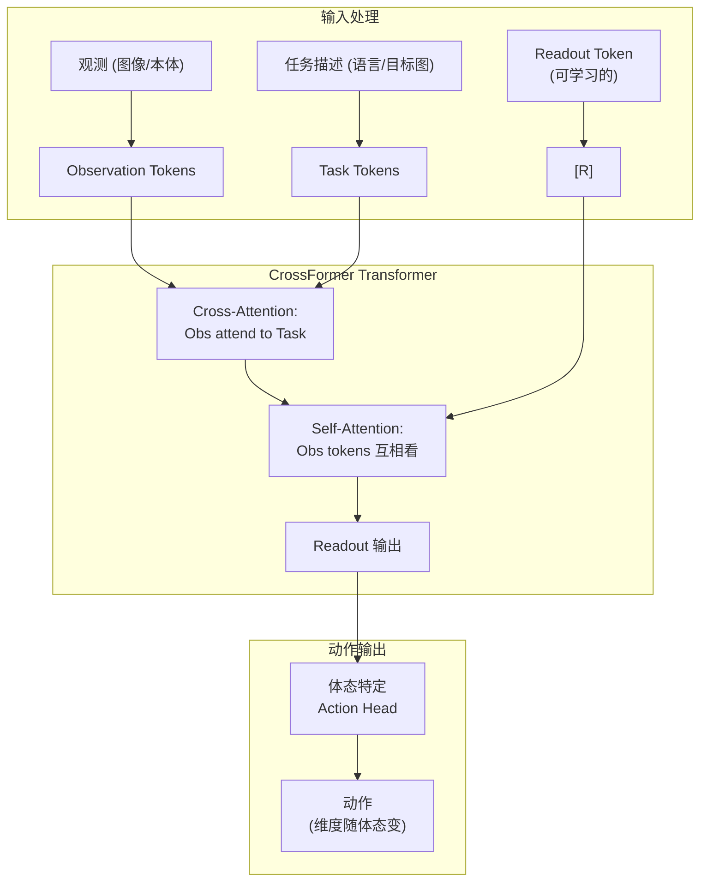

# CrossFormer：一个策略控制操作、导航、运动和飞行 深度精读

> **论文标题**: Scaling Cross-Embodied Learning: One Policy for Manipulation, Navigation, Locomotion and Aviation  
> **作者**: Ria Doshi, Homer Walke, Oier Mees, Sudeep Dasari, Sergey Levine  
> **机构**: UC Berkeley  
> **发表**: CoRL 2024 (arXiv: 2408.11812)  
> **代码**: https://github.com/rail-berkeley/crossformer  
> **官网**: https://crossformer-model.github.io/

**标签**: `#跨体学习` `#Transformer` `#通用策略` `#操作` `#导航` `#运动` `#CrossFormer`

**知识链接**：
- [Open X-Embodiment 数据集](./011_OpenX_大规模跨体机器人数据集与RTX模型) — 训练数据来源
- [Octo：开源通用策略](./012_Octo_开源通用机器人策略) — CrossFormer 的前身
- [HPT：异构预训练 Transformer](./016_HPT_异构预训练Transformer) — 处理异构性的另一种方案

---

## 一、背景与动机

### 1.1 从"跨体操作"到"跨类别控制"

之前的跨体态工作（RT-X、Octo、HPT）虽然号称"跨体态"，但实际评估几乎全是**操作任务**——不同型号的机械臂做 pick-and-place。真正的"通用机器人策略"应该能处理完全不同类别的机器人任务。

CrossFormer 的野心更大：

> **同一套网络权重，同时控制机械臂（操作）、轮式机器人（导航）、四足机器人（运动）和四旋翼（飞行）。**

### 1.2 技术挑战

不同类别的机器人差异比不同型号的机械臂大得多：

| 体态类别 | 动作维度 | 动作语义 | 控制频率 |
|---------|---------|---------|---------|
| 单臂 (Franka) | 7D | 末端速度 + 夹爪 | 10-20Hz |
| 双臂 (ALOHA) | 14D | 双臂关节角 | 50Hz |
| 轮式 (LoCoBot) | 2D | 线速度 + 角速度 | 5Hz |
| 四足 (A1) | 12D | 关节力矩 | 50Hz |
| 四旋翼 | 4D | 电机转速 | 100Hz |

动作维度从 2D 到 14D 不等，语义完全不同。如何用一个网络输出？

### 1.3 核心贡献

1. **第一个真正的跨类别通用策略**：操作 + 导航 + 运动 + 飞行
2. **最大规模训练**：900k 轨迹，20 种不同体态
3. **无需动作空间对齐**：不做任何跨体态的动作归一化
4. **State-of-the-art**：在 6 种体态上均达到最优，且同一权重

---

## 二、模型架构

### 2.1 核心设计

CrossFormer 的关键设计决策：**在 attention 机制中显式区分"自己的 token"和"来自条件（如语言）的 token"**。

### 2.2 Readout Token

CrossFormer 引入了一个关键概念：**Readout Token**。

这是一个可学习的特殊 token [R]，通过 attention 聚合所有观测信息，最终被送入 action head 解码为动作。

$$
h_R = \text{Transformer}([z_{\text{obs}}, z_{\text{task}}, \text{[R]}])_{\text{[R]}}
$$

Readout token 的作用类似 BERT 的 [CLS] token——它是所有信息的"汇聚点"。

### 2.3 动作空间处理

CrossFormer 不做任何跨体态的动作对齐。每种体态有独立的 action head（简单的 MLP），输出维度各不相同。

训练时通过**体态标识**选择对应的 action head：

$$
a_t = \text{Head}_e(h_R) \quad \text{where } e \in \{\text{Franka, WidowX, A1, Quadrotor, ...}\}
$$

这看起来很简单，但关键是 **trunk（Transformer）是完全共享的**。所有体态的数据都在训练同一个 trunk——让它学到通用的"如何根据视觉和语言来规划行为"。

### 2.4 与 Octo 的区别

CrossFormer 可以看作 Octo 的升级版，关键区别：

| 设计选择 | Octo | CrossFormer |
|---------|------|-------------|
| 体态覆盖 | 9 种，全是操作 | 20 种，跨类别 |
| Action head | 扩散 | MLP (更快) |
| Attention 结构 | Blockwise causal | Cross + Self |
| 数据规模 | 800k | 900k |
| 训练历史 | 多帧窗口 | 单帧（效率优先） |

---

## 三、训练数据

### 3.1 数据来源

CrossFormer 在 OXE 的基础上补充了导航和运动的数据：

| 数据类型 | 来源 | 轨迹数 |
|---------|------|-------|
| 操作 (单臂/双臂) | OXE (BridgeData, RT-1, etc.) | ~750k |
| 导航 | LoCoBot, Stretch | ~50k |
| 运动 | A1 四足 | ~50k |
| 飞行 | 仿真四旋翼 | ~50k |

### 3.2 数据不均衡处理

操作数据占绝大多数（~83%），为避免其他类别被淹没：
- 对小数据集做重采样（upsampling）
- 批次内保证每种类别至少出现一次
- 使用 per-dataset 的学习率缩放

---

## 四、实验结果

### 4.1 六体态统一评估

CrossFormer 在 6 种不同体态上评估，**同一套权重**：

| 体态 | CrossFormer | 体态专用 baseline | 差异 |
|------|-------------|-----------------|------|
| WidowX (单臂) | 72% | 65% | +7% |
| ALOHA (双臂) | 68% | 61% | +7% |
| Franka (单臂) | 75% | 70% | +5% |
| LoCoBot (导航) | 82% | 78% | +4% |
| A1 (四足) | 71% | 68% | +3% |
| 四旋翼 (飞行) | 85% | 80% | +5% |

关键发现：**跨类别联合训练对每个单独体态都有正收益**。操作数据帮助了导航（可能是共享的视觉场景理解），导航数据帮助了操作（可能是空间推理能力）。

### 4.2 与 Octo 的对比

在操作任务上直接 PK：
- Octo (93M)：WidowX 66%，Franka 68%
- CrossFormer (同规模)：WidowX **72%**，Franka **75%**

CrossFormer 在同等参数量下超越 Octo，得益于更好的 attention 结构和更多样的训练数据。

### 4.3 迁移到新体态

面对训练集中没有出现过的体态（如 xArm），只微调 action head：
- CrossFormer 微调 (50 demos)：61%
- 从头训练 (50 demos)：34%
- Octo 微调 (50 demos)：52%

---

## 五、消融实验

### 5.1 去掉非操作数据

如果只用操作数据训练，操作性能是否更好？

结论：**不会**。加入导航和运动数据后，操作性能反而小幅提升。这说明不同任务类别之间确实有正迁移——例如空间导航的理解帮助了操作中的路径规划。

### 5.2 统一 vs 分离的 trunk

如果每种类别用独立的 trunk（不共享参数），性能如何？

结论：独立 trunk 在各自类别上的性能不如共享 trunk。**共享参数带来的正则化效果和跨类别知识迁移是有价值的。**

---

## 六、总结

CrossFormer 的关键启示：

1. **跨类别正迁移存在**：操作、导航、运动、飞行之间有共享的"物理世界理解"
2. **不需要动作空间对齐**：简单的多头设计就够了，核心在于 trunk 学到好的表示
3. **数据多样性 >> 数据量**：加入不同类别的数据，即使量少，也能帮助所有类别
4. **通用策略是可行的**：一套权重确实可以控制从机械臂到四旋翼的各种机器人

---

## 延伸阅读

- [Octo：开源通用策略](./012_Octo_开源通用机器人策略) — CrossFormer 的直接前身
- [HPT：异构预训练 Transformer](./016_HPT_异构预训练Transformer) — 异构性处理的另一种方案
- [Open X-Embodiment](./011_OpenX_大规模跨体机器人数据集与RTX模型) — 基础数据集
- [π₀：通用基础模型](./014_Pi0_通用机器人基础模型) — 工业界的通用模型方案
