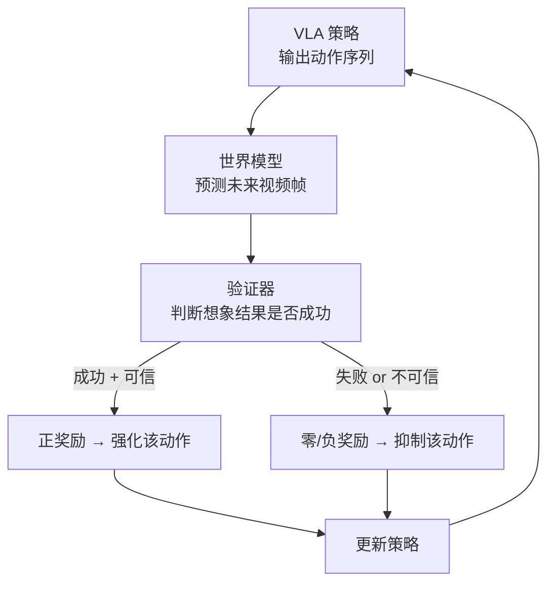
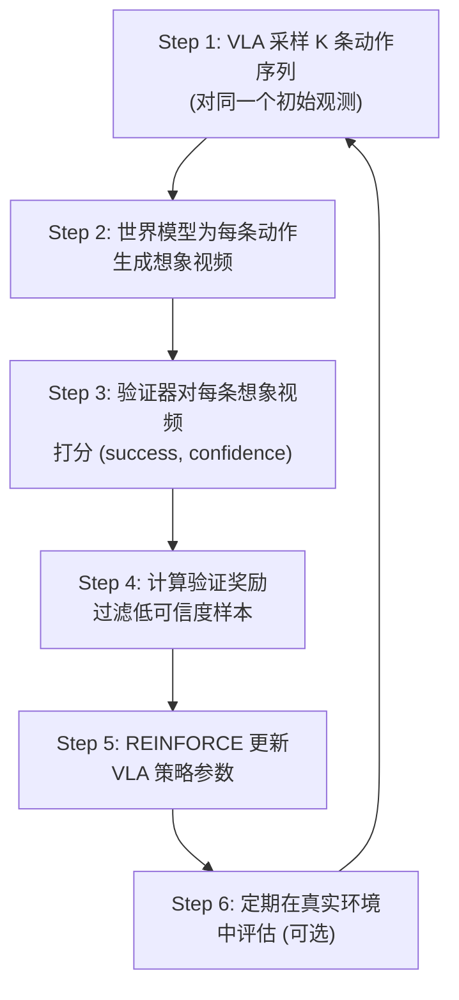

# VLA-RFT：世界模型验证奖励 RL 微调 深度精读

> **论文标题**: VLA-RFT: Vision-Language-Action Reinforcement Fine-tuning with Verified Rewards in World Simulators  
> **作者**: Jingzhou Luo, Zhehao Zhang, Yixiao Wang, Guanqi Chen 等  
> **机构**: The University of Hong Kong, Shanghai AI Laboratory  
> **发表**: arXiv:2510.00406, 2025  
> **代码**: 未公开

**标签**: `#VLA` `#强化学习` `#世界模型` `#视频预测` `#验证奖励` `#想象力训练`

**知识链接**：
- [策略梯度与 PPO](/前置知识/000a_前置知识_策略梯度与PPO) — RL 微调的基本算法
- [Process Reward Model](/前置知识/000n_前置知识_Process_Reward_Model) — 过程奖励与验证器的关系
- [行为克隆与 RL 微调范式](/前置知识/000d_前置知识_行为克隆与RL微调范式) — SFT 到 RL 的过渡
- [扩散模型 DDPM](/前置知识/000b_前置知识_扩散模型DDPM) — 视频预测模型的基础
- [VLA 模型的 RL 后训练综述](/论文综述/S06_VLA模型的RL后训练综述) — VLA-RFT 的综述定位

---

## 一、背景与动机

### 1.1 VLA RL 微调的环境依赖问题

现有 VLA RL 微调方法的核心流程：

$$
\text{策略输出动作} \xrightarrow{\text{环境执行}} \text{获得奖励} \xrightarrow{\text{梯度更新}} \text{改进策略}
$$

中间环节"环境执行"是最大瓶颈：

| 环境类型 | 优势 | 问题 |
|----------|------|------|
| 物理仿真器（如 MuJoCo, Isaac） | 精确、可并行 | 需要人工建模、资产制作成本高 |
| 真实世界 | 无 sim2real gap | 极慢、不可并行、有安全风险 |
| **数据驱动世界模型** | **从数据中学、无需人工建模** | **准确性需要验证** |

### 1.2 核心洞察：视频预测模型 = 免费的仿真器

近年视频生成模型（如 Sora、Cosmos）已经能生成高度逼真的视频。VLA-RFT 的关键 insight：

> 如果视频预测模型足够好，我们可以用它来**想象**策略执行后的结果，而不需要真实执行。

但视频预测不完美——它可能产生"幻觉"。所以需要一个**验证器**来判断想象出的结果是否可信。

### 1.3 VLA-RFT 的整体思路



**一句话**：让 VLA 在"想象"中训练——用世界模型预测结果，用验证器判断对错，用 RL 更新策略。

---

## 二、方法详解

### 2.1 世界模型：视频预测

VLA-RFT 使用一个 **video prediction model**（视频预测模型）$\mathcal{W}_\psi$ 作为世界模型。

**输入**：当前观测 $o_t$（图像） + 动作序列 $a_{t:t+H}$（策略输出的未来 H 步动作）

**输出**：预测的未来 H 帧图像 $\hat{o}_{t+1:t+H}$

$$
\hat{o}_{t+1:t+H} = \mathcal{W}_\psi(o_t, a_{t:t+H})
$$

**逐项拆解**：
- $\mathcal{W}_\psi$：基于扩散模型的视频预测网络（如 UniSim、Cosmos 架构）
- $o_t$：当前时刻的 RGB 图像（224×224）
- $a_{t:t+H}$：从 VLA 策略中采样的未来 H 步动作（通常 H=8-16）
- $\hat{o}_{t+1:t+H}$：世界模型"想象"出的未来帧序列

**训练数据**：从大量机器人操作视频中学习 $(o_t, a_{t:t+H}, o_{t+1:t+H})$ 的映射关系。

### 2.2 验证器：判断想象结果是否可信

单纯用视频预测模型有个问题：它可能产生"虚假成功"（幻觉出一个看起来成功的结果，但物理上不可能）。

**验证器的双重角色**：
1. **成功判定**：想象的最终帧是否显示任务完成？
2. **可信度判定**：想象的视频是否物理上合理？

VLA-RFT 使用一个 VLM（如 GPT-4V 或更轻量的 InternVL）作为验证器 $\mathcal{V}$：

$$
(\text{success}, \text{confidence}) = \mathcal{V}(\hat{o}_{t+1:t+H}, \text{task\_description})
$$

**验证器的 prompt 设计**：

```
Given the following predicted video frames of a robot performing the task: 
"{task_description}"

1. Does the final frame show task completion? (yes/no)
2. Are the frames physically plausible? (score 1-5)
3. Is there any obvious hallucination? (yes/no)

Based on your analysis, provide:
- success: boolean
- confidence: float [0, 1]
```

### 2.3 验证奖励的计算

$$
r_{\text{verified}}(o_t, a_{t:t+H}) = \begin{cases}
+1 & \text{if success} = \text{True} \;\wedge\; \text{confidence} > \tau \\
-0.1 & \text{if success} = \text{True} \;\wedge\; \text{confidence} \leq \tau \\
0 & \text{if success} = \text{False} \;\wedge\; \text{confidence} > \tau \\
\text{skip} & \text{if confidence} \leq \tau \;\wedge\; \text{success} = \text{False}
\end{cases}
$$

**逐项拆解**：
- $\tau$：可信度阈值（论文使用 $\tau = 0.7$）
- "成功且可信" → 正奖励：强化该动作
- "成功但不可信" → 小负奖励：惩罚可能的幻觉
- "失败但可信" → 零奖励：不强化也不惩罚（合理的失败尝试）
- "失败且不可信" → 跳过：数据不可靠，不用于训练

**数值例子**（桌面机械臂 pick-and-place）：

VLA 输出动作序列 → 世界模型预测 8 帧未来图像：

| 样本 | 想象结果 | 验证器判断 | 奖励 |
|------|---------|-----------|------|
| 动作 A | 方块被抓起放入容器 | success=True, conf=0.85 | +1.0 |
| 动作 B | 方块被推出桌面 | success=False, conf=0.90 | 0.0 |
| 动作 C | 方块瞬间消失（幻觉） | success=True, conf=0.3 | -0.1 |
| 动作 D | 图像模糊不清 | success=False, conf=0.2 | skip |

### 2.4 策略更新：基于验证奖励的 REINFORCE

有了验证奖励后，VLA-RFT 使用 REINFORCE 风格的策略梯度更新 VLA：

$$
\nabla_\theta \mathcal{L} = -\mathbb{E}_{\tau \sim \pi_\theta}\left[r_{\text{verified}}(\tau) \cdot \nabla_\theta \log \pi_\theta(\tau)\right]
$$

展开为 token 级别（VLA 输出离散 action token）：

$$
\nabla_\theta \mathcal{L} = -\mathbb{E}\left[r_{\text{verified}} \cdot \sum_{t=0}^{H} \sum_{i=1}^{d} \nabla_\theta \log \pi_\theta(v_{t,i} | o_t, \text{instr})\right]
$$

**逐项拆解**：
- $r_{\text{verified}}$：验证器给出的奖励（整条想象轨迹共享一个奖励）
- $v_{t,i}$：第 $t$ 步第 $i$ 维的动作 token
- $H$：想象 horizon（8-16 步）
- $d$：动作维度（通常 7 维：xyz + 旋转 + 夹爪）

**加入 baseline 减方差**：

$$
\nabla_\theta \mathcal{L} = -\mathbb{E}\left[(r_{\text{verified}} - b) \cdot \nabla_\theta \log \pi_\theta(\tau)\right]
$$

其中 $b = \frac{1}{K}\sum_{k=1}^{K} r_{\text{verified}}^{(k)}$ 是当前 batch 中 K 条想象轨迹的平均奖励。

### 2.5 完整训练流程



**关键超参数**：

| 参数 | 值 | 含义 |
|------|-----|------|
| K | 16 | 每个状态采样的动作数量 |
| H | 8 | 想象 horizon（步数） |
| $\tau$ | 0.7 | 可信度阈值 |
| 学习率 | 1e-5 | VLA 微调学习率 |
| 微调步数 | 200-400 | 总更新步数 |
| LoRA rank | 16 | VLA 微调的 LoRA 配置 |

---

## 三、世界模型的训练与质量分析

### 3.1 世界模型的架构

VLA-RFT 使用的世界模型基于 **条件视频扩散模型**：

$$
\hat{o}_{1:H} = \text{DDPM}(o_0, a_{0:H-1}, \epsilon), \quad \epsilon \sim \mathcal{N}(0, I)
$$

架构选择：
- 基础结构：3D U-Net（类似 Video Diffusion Models）
- 条件注入：动作序列通过 cross-attention 注入
- 分辨率：128×128（平衡质量和速度）
- 去噪步数：50 步 DDPM（训练） / 10 步 DDIM（推理加速）

### 3.2 世界模型的质量评估

| 指标 | 含义 | VLA-RFT 世界模型 | 随机视频基线 |
|------|------|----------------|------------|
| FID (↓) | 图像质量 | 28.3 | 95.7 |
| FVD (↓) | 视频一致性 | 156.4 | 423.8 |
| Action Consistency (↑) | 动作-视频对齐 | 0.82 | 0.31 |
| Physical Plausibility (↑) | 物理合理性 | 0.76 | 0.45 |

### 3.3 世界模型的失败模式

| 失败类型 | 描述 | 频率 | 验证器能检测？ |
|----------|------|------|-------------|
| 物体穿透 | 手臂穿过物体 | 8% | 是（confidence 低） |
| 纹理漂移 | 物体外观突变 | 12% | 部分能 |
| 幽灵物体 | 凭空出现新物体 | 3% | 是 |
| 运动模糊 | 快速动作导致模糊 | 15% | 部分能 |

**结论**：世界模型不完美（约 20-30% 的预测有明显问题），但验证器能过滤掉大部分不可靠预测。过滤后剩余样本的可靠性 > 90%。

---

## 四、贯穿全文的例子

### 4.1 场景：桌面机械臂 pick-and-place

任务："把红色方块放到蓝色容器中"

**初始状态**：方块在桌面左侧，容器在右侧。VLA 经过 SFT 后成功率 55%。

### 4.2 一次想象力训练的完整过程

**Step 1：VLA 采样 16 条动作序列**

从当前观测 $o_0$ 出发，VLA 通过温度采样生成 K=16 条不同的 8 步动作序列：

| 样本 | 动作描述（简化） |
|------|-----------------|
| $\tau_1$ | 向下→抓取→抬起→向右移→放下 |
| $\tau_2$ | 向下但偏左 2cm→抓空→向右移→... |
| $\tau_3$ | 向下→抓取→抬起但太高→... |
| ... | ... |
| $\tau_{16}$ | 向右移（方向错误）→... |

**Step 2：世界模型想象**

对每条 $\tau_k$，世界模型生成 8 帧未来图像：

- $\tau_1$ → 想象视频：手臂精准抓取方块，移到容器上方，放入 ✓
- $\tau_2$ → 想象视频：手臂抓空，方块没动 ✗
- $\tau_3$ → 想象视频：抓取成功但提升过高时方块滑落 ✗

**Step 3：验证器评分**

| 样本 | success | confidence | 奖励 | 用于训练？ |
|------|---------|------------|------|----------|
| $\tau_1$ | True | 0.88 | +1.0 | ✓ |
| $\tau_2$ | False | 0.91 | 0.0 | ✓ |
| $\tau_3$ | False | 0.83 | 0.0 | ✓ |
| $\tau_5$ | True | 0.45 | -0.1 | ✓ |
| $\tau_{12}$ | False | 0.30 | skip | ✗ |
| ... | ... | ... | ... | ... |

有效样本：12/16 条（4 条因低可信度被过滤）

**Step 4：计算 baseline 并更新**

$$
b = \frac{1}{12}\sum_{k \in \text{valid}} r_k = \frac{1.0 + 0 + 0 + (-0.1) + \ldots}{12} \approx 0.25
$$

对于 $\tau_1$（奖励最高）：

$$
\Delta\theta \propto (1.0 - 0.25) \cdot \nabla_\theta \log\pi_\theta(\tau_1) = 0.75 \cdot \nabla_\theta \log\pi_\theta(\tau_1)
$$

→ 强化 $\tau_1$ 对应的动作模式

对于 $\tau_2$（失败）：

$$
\Delta\theta \propto (0.0 - 0.25) \cdot \nabla_\theta \log\pi_\theta(\tau_2) = -0.25 \cdot \nabla_\theta \log\pi_\theta(\tau_2)
$$

→ 抑制 $\tau_2$ 对应的"偏左"模式

### 4.3 训练收敛过程

| 微调步数 | 成功率（真实环境评估） | 想象成功率 |
|----------|---------------------|-----------|
| 0 | 55% | 52% |
| 100 | 65% | 68% |
| 200 | 73% | 76% |
| 300 | 80% | 82% |
| 400 | **82%** | 85% |

**观察**：想象成功率略高于真实成功率（世界模型比真实世界"容易"一些），但趋势一致——说明世界模型是可靠的训练代理。

---

## 五、实验结果

### 5.1 主实验：SIMPLER Benchmark

| 方法 | Pick Place | Stack | Push | Drawer | **平均** |
|------|-----------|-------|------|--------|--------|
| OpenVLA (SFT) | 55% | 42% | 60% | 65% | 55.5% |
| OpenVLA + DPO | 60% | 48% | 63% | 70% | 60.3% |
| OpenVLA + PPO (仿真) | 72% | 58% | 75% | 80% | 71.3% |
| **VLA-RFT (世界模型)** | **75%** | **62%** | **78%** | **82%** | **74.3%** |

**关键发现**：
- VLA-RFT 不需要物理仿真器，性能却**超过了用仿真器训的 PPO**（+3.0%）
- 原因推测：世界模型从真实数据中学，比手工仿真器更接近真实分布

### 5.2 鲁棒性测试

在扰动条件下（光照变化、背景干扰、相机抖动）：

| 方法 | 正常条件 | 光照变化 | 背景干扰 | 相机抖动 | 平均下降 |
|------|---------|---------|---------|---------|---------|
| OpenVLA (SFT) | 55.5% | 38.2% | 41.0% | 45.5% | -14.9% |
| PPO (仿真) | 71.3% | 52.4% | 55.8% | 60.2% | -14.7% |
| **VLA-RFT** | **74.3%** | **62.1%** | **65.4%** | **68.0%** | **-9.0%** |

**VLA-RFT 的鲁棒性更强**（平均下降只有 9.0% vs PPO 的 14.7%）。原因：世界模型从多样化的真实视频数据中学习，训练分布本身就包含了各种扰动。

### 5.3 Sample Efficiency

| 方法 | 达到 70% 成功率需要的步数 |
|------|------------------------|
| PPO (仿真) | ~2000 RL 步 |
| GRPO (仿真) | ~1500 RL 步 |
| **VLA-RFT (世界模型)** | **~300 RL 步** |

VLA-RFT 的 sample efficiency 高出 5-7x。原因：
1. 世界模型可以任意重复"想象"（不需要真实交互）
2. 验证器过滤了低质量样本，每个训练样本的信息量更高
3. 同时对 K=16 条轨迹打分，对比信号强

### 5.4 消融实验

| 配置 | 平均成功率 |
|------|----------|
| **完整 VLA-RFT** | **74.3%** |
| 去掉验证器（信任所有想象结果） | 62.5%（-11.8%） |
| 去掉可信度过滤（只看 success） | 68.0%（-6.3%） |
| 世界模型用少量数据训（1/5） | 66.2%（-8.1%） |
| 想象 horizon H=4（减半） | 70.1%（-4.2%） |
| 想象 horizon H=16（加倍） | 72.8%（-1.5%） |
| 采样数 K=4（减少） | 69.5%（-4.8%） |

**关键结论**：
- **验证器是最重要的组件**（去掉后 -11.8%）——没有验证器，世界模型的幻觉会误导训练
- 可信度过滤提供额外 6% 的提升——仅看 success 不够，还需要确保预测可信
- 世界模型质量很重要——用少量数据训的世界模型损失 8%

---

## 六、和其他方法的深度对比

### 6.1 VLA-RFT vs 传统仿真 RL

| 维度 | 传统仿真 RL | VLA-RFT |
|------|-----------|---------|
| 仿真器来源 | 人工搭建（MuJoCo/Isaac） | 从数据中学（视频预测） |
| 资产制作 | 需要 3D 模型+物理参数 | 不需要 |
| Sim-to-real gap | 存在（需要 domain randomization） | **更小**（从真实数据学） |
| 并行能力 | 强（GPU 并行渲染） | 中（受限于扩散模型推理） |
| 新任务适配 | 需要搭建新仿真场景 | 只需要新任务的视频数据 |

### 6.2 VLA-RFT vs RECAP

| 维度 | RECAP | VLA-RFT |
|------|-------|---------|
| 数据来源 | 真实部署经验 | 世界模型想象 |
| 是否需要真实交互 | 是（50-100 episodes） | **否**（只需初始观测） |
| 人工参与 | 需要人类校正 | 不需要 |
| 训练速度 | 受限于真实执行速度 | 可以快速并行想象 |
| 准确性 | 100%（真实数据） | ~80%（需要验证器过滤） |

---

## 七、局限性与展望

### 7.1 当前局限

1. **世界模型训练成本高**：训练一个好的视频预测模型本身需要大量数据和计算
2. **想象 horizon 有限**：H=8-16 步（约 2-4 秒），长时间规划能力有限
3. **验证器也可能出错**：VLM 验证器并非完美，约 10-15% 的判断有误
4. **接触丰富任务困难**：接触力学（如拧螺丝、折叠布料）的视频预测仍然很难

### 7.2 未来方向

1. **更强的世界模型**：随着 Sora/Cosmos 等模型的进步，想象质量会持续提升
2. **混合训练**：世界模型想象 + 少量真实验证的组合
3. **自适应 horizon**：根据任务复杂度动态调整想象步数
4. **世界模型的在线更新**：用策略部署产生的新数据持续改进世界模型

---

## 八、个人评价

### 8.1 独特贡献

VLA-RFT 的最大价值是提出了一条**不依赖传统仿真器**的 RL 微调路径。对于没有高质量仿真环境的任务（如厨房操作、医疗器械等），这提供了一种全新的可能性。

### 8.2 技术洞察

最深刻的 insight 是**"不完美的世界模型 + 验证器"比"不做 RL"更好**。世界模型有 20-30% 的预测不可靠，但通过验证器过滤后，剩余的可靠样本足以提供有效的训练信号。

### 8.3 和 LLM 领域的类比

VLA-RFT 的"世界模型 + 验证器"框架类似于 LLM 中的"生成 + 验证"范式（如 Process Reward Model）：模型生成多个候选答案，验证器选出正确的。区别是 VLA-RFT 把这个思路用在了动作生成上。

---

## 延伸阅读

- [策略梯度与 PPO](/前置知识/000a_前置知识_策略梯度与PPO) ← REINFORCE 和策略梯度基础
- [Process Reward Model](/前置知识/000n_前置知识_Process_Reward_Model) ← 验证器设计的灵感来源
- [扩散模型 DDPM](/前置知识/000b_前置知识_扩散模型DDPM) ← 世界模型的底层技术
- [VLA-RL 精读](./006_VLA_RL_PPO直接训练自回归VLA) ← 传统仿真 RL 路线的对比
- [VLA 模型的 RL 后训练综述](/论文综述/S06_VLA模型的RL后训练综述) ← 完整方法对比
