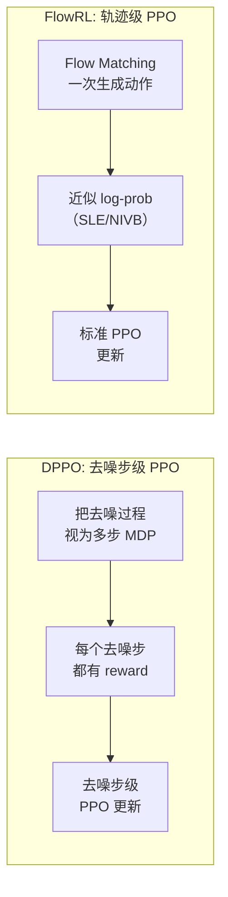

# FlowRL：Flow VLA 的在线 RL 微调 深度精读

> **论文标题**: Online RL Fine-tuning for Flow-based Vision-Language-Action Models  
> **作者**: Jingwei Zhang, Kevin Black, Mitsuhiko Nakamoto, Sergey Levine 等  
> **机构**: UC Berkeley, Physical Intelligence  
> **发表**: arXiv:2510.25889, 2025  
> **代码**: 未公开

**标签**: `#VLA` `#强化学习` `#Flow Matching` `#π₀` `#策略梯度` `#似然近似`

**知识链接**：
- [Flow Matching 与连续归一化流](/前置知识/000g_前置知识_Flow_Matching与连续归一化流) — Flow Matching 的基本原理
- [策略梯度与 PPO](/前置知识/000a_前置知识_策略梯度与PPO) — 策略梯度定理
- [为什么扩散策略难以 RL 微调](/前置知识/000f_前置知识_为什么扩散策略难以RL微调) — 连续生成模型做 RL 的核心困难
- [对数似然与变分下界](/前置知识/000e_前置知识_对数似然与变分下界) — 似然估计的数学基础
- [KL 散度与策略约束](/前置知识/000j_前置知识_KL散度与策略约束) — 防止策略崩溃
- [VLA 模型的 RL 后训练综述](/论文综述/S06_VLA模型的RL后训练综述) — FlowRL 的综述定位

---

## 一、背景与动机

### 1.1 Flow-based VLA 的兴起

2024-2025 年，最强的 VLA 模型（如 π₀）开始采用 **Flow Matching** 作为动作生成机制：

| VLA 模型 | 动作生成方式 | 性能 |
|----------|------------|------|
| OpenVLA | 自回归 Token | 中 |
| Octo | Diffusion Policy | 中高 |
| **π₀** | **Flow Matching** | **最强** |
| π₀-FAST | 自回归 Token（蒸馏自 π₀） | 高 |

Flow Matching 的优势在于：连续动作空间、高表达力、比扩散更快的推理。

### 1.2 核心问题：Flow Matching 没有 log-probability

策略梯度方法（PPO、REINFORCE）的核心公式：

$$
\nabla_\theta J = \mathbb{E}_{\tau \sim \pi_\theta}\left[\hat{A}_t \cdot \nabla_\theta \log \pi_\theta(a_t | s_t)\right]
$$

这要求能计算 $\log \pi_\theta(a_t | s_t)$。

**自回归 VLA**：每个 action token 是 softmax 分类 → $\log \pi$ 精确可算 ✓

**扩散策略**：需要对整个去噪链积分 → 不可行（[详见为什么扩散策略难以 RL 微调](/前置知识/000f_前置知识_为什么扩散策略难以RL微调)） ✗

**Flow Matching**：定义了从噪声到动作的确定性 ODE 路径 → 似然需要求解 ODE 的雅可比行列式 → 计算昂贵 ✗

### 1.3 FlowRL 的核心贡献

FlowRL 提出两种近似方法来计算 Flow-based 策略的 log-likelihood：
1. **Score-based likelihood estimation**：利用 Flow Matching 的 score function 近似 log-prob
2. **Noise-injection variational bound**：通过加噪声构造变分下界

使得 PPO/REINFORCE 可以直接应用于 Flow-based VLA（如 π₀），而**不需要将策略蒸馏为自回归形式**。

---

## 二、方法详解

### 2.1 Flow Matching 回顾

Flow Matching 定义了一个速度场 $v_\theta(x_t, t)$，将噪声 $x_0 \sim \mathcal{N}(0, I)$ 沿 ODE 路径推到动作 $x_1 = a$：

$$
\frac{dx_t}{dt} = v_\theta(x_t, t), \quad t \in [0, 1]
$$

**训练目标**（条件 Flow Matching）：

$$
\mathcal{L}_{\text{CFM}}(\theta) = \mathbb{E}_{t, x_0, x_1}\left[\|v_\theta(x_t, t) - (x_1 - x_0)\|^2\right]
$$

其中 $x_t = (1-t)x_0 + t x_1$ 是线性插值路径。

**推理过程**：从 $x_0 \sim \mathcal{N}(0, I)$ 出发，用 Euler 方法积分 ODE：

$$
x_{t+\Delta t} = x_t + \Delta t \cdot v_\theta(x_t, t)
$$

经过 N 步积分后得到动作 $a = x_1$。

### 2.2 Flow Matching 的 log-likelihood 精确计算

Flow Matching 定义了一个可逆变换 $x_0 \mapsto x_1$。通过 Change of Variables：

$$
\log p_\theta(x_1) = \log p_0(x_0) - \int_0^1 \text{tr}\left(\frac{\partial v_\theta(x_t, t)}{\partial x_t}\right) dt
$$

**逐项拆解**：
- $\log p_0(x_0)$：初始高斯噪声的 log-density（容易算）
- $\text{tr}(\partial v / \partial x)$：速度场的散度（Jacobian 的迹）
- 积分：需要沿整条 ODE 路径计算散度——**计算量巨大**

**为什么不可行？**
- 散度计算需要对每个维度求偏导：$O(d)$ 次前向传播（$d$ = 动作维度 × chunk 大小 = 7×16 = 112）
- 加上时间积分：总计 $O(d \times N)$ 次前向传播 = 112 × 10 = 1120 次！
- 对于 7B 参数的 π₀ 模型，这完全不可行

### 2.3 方法一：Score-based Likelihood Estimation (SLE)

**核心思想**：用 Flow Matching 的速度场近似一个 score function，再用 score 计算 log-likelihood。

**Step 1：定义辅助的噪声分布**

在动作 $a$ 周围加一个小高斯噪声 $\sigma$：

$$
\tilde{a} = a + \sigma \epsilon, \quad \epsilon \sim \mathcal{N}(0, I)
$$

**Step 2：Score 近似**

Flow Matching 的速度场在 $t \to 1$ 时，和 score function 有如下关系：

$$
\nabla_a \log p_\theta(a) \approx \frac{v_\theta(a, 1-\sigma) - a}{\sigma}
$$

**逐项拆解**：
- $v_\theta(a, 1-\sigma)$：在接近终点 $t=1-\sigma$ 时刻的速度场评估
- 直觉：速度场在终点附近的方向指示了密度增加的方向
- $\sigma$：小的扰动步长（论文使用 $\sigma = 0.01$）

**Step 3：从 score 到 log-likelihood**

$$
\log \pi_\theta(a | s) \approx \log p_0(x_0) + \int_0^1 \nabla \cdot v_\theta(x_t, t) dt \approx \frac{1}{M}\sum_{m=1}^{M}\left[-\frac{\|a - v_\theta(a + \sigma_m \epsilon_m, 1-\sigma_m)\|^2}{2\sigma_m^2}\right] + C
$$

**逐项拆解**：
- $M$：Monte Carlo 采样次数（论文使用 M=5）
- $\sigma_m$：第 m 个噪声尺度
- $\epsilon_m \sim \mathcal{N}(0, I)$：随机噪声样本
- $C$：与 $\theta$ 无关的常数（在策略梯度中可忽略）

**计算成本**：M=5 次前向传播（vs 精确计算需要 1120 次）→ 加速 200x+

### 2.4 方法二：Noise-Injection Variational Bound (NIVB)

**核心思想**：构造一个可以精确计算的变分下界。

**Step 1：定义加噪策略**

给 Flow Matching 输出加噪声，得到一个"模糊"版本的策略：

$$
\tilde{\pi}_\theta(a | s) = \int \mathcal{N}(a | f_\theta(x_0, s), \sigma^2 I) \cdot p_0(x_0) dx_0
$$

其中 $f_\theta(x_0, s)$ 是从噪声 $x_0$ 经过 ODE 积分得到的动作。

**Step 2：变分下界**

$$
\log \pi_\theta(a | s) \geq \log \tilde{\pi}_\theta(a | s) - D_{\text{KL}}(\pi_\theta \| \tilde{\pi}_\theta) \geq \mathbb{E}_{x_0}\left[\log \mathcal{N}(a | f_\theta(x_0, s), \sigma^2 I)\right]
$$

**展开**：

$$
\log \tilde{\pi}_\theta(a | s) \geq \log \frac{1}{K}\sum_{k=1}^{K} \mathcal{N}(a | f_\theta(x_0^{(k)}, s), \sigma^2 I)
$$

**逐项拆解**：
- $K$：从先验 $p_0$ 采样的噪声数量（论文使用 K=8）
- $f_\theta(x_0^{(k)}, s)$：第 k 个噪声种子经过 ODE 积分得到的动作
- $\sigma$：注入噪声的标准差（可调超参数）
- 直觉：如果多个噪声种子都映射到接近 $a$ 的动作 → $a$ 的似然高

**计算成本**：K=8 次 ODE 积分（每次 N=10 步前传）= 80 次前向传播。比精确计算仍然快 14x。

### 2.5 两种方法的对比

| 维度 | SLE（Score-based） | NIVB（变分下界） |
|------|-------------------|----------------|
| 计算成本 | 5 次前传 | 80 次前传 |
| 准确度 | 近似（偏差约 10-15%） | 下界（偏差约 5-8%） |
| 梯度质量 | 方差较大 | 方差较小 |
| 适用场景 | 计算预算紧 | 需要稳定训练 |
| 论文推荐 | 快速实验 | 最终训练 |

### 2.6 PPO with Approximate Log-Likelihood

有了 log-likelihood 近似后，标准 PPO 直接可用：

$$
\mathcal{L}_{\text{PPO}}(\theta) = \mathbb{E}_t\left[\min\left(\frac{\tilde{\pi}_\theta(a_t | s_t)}{\tilde{\pi}_{\theta_{\text{old}}}(a_t | s_t)} \hat{A}_t, \; \text{clip}(\cdot, 1-\epsilon, 1+\epsilon) \hat{A}_t\right)\right]
$$

**关键修改**：importance ratio 用近似的 log-likelihood 计算：

$$
\frac{\tilde{\pi}_\theta(a_t | s_t)}{\tilde{\pi}_{\theta_{\text{old}}}(a_t | s_t)} = \exp\left(\widetilde{\log \pi}_\theta(a_t | s_t) - \widetilde{\log \pi}_{\theta_{\text{old}}}(a_t | s_t)\right)
$$

**逐项拆解**：
- $\widetilde{\log \pi}_\theta$：用 SLE 或 NIVB 近似得到的 log-likelihood
- clip 范围 $\epsilon = 0.2$（和标准 PPO 一样）
- $\hat{A}_t$：GAE 计算的 advantage

**稳定性保证**：

由于 log-likelihood 是近似的，importance ratio 可能有额外噪声。FlowRL 增加了以下稳定性措施：
1. **Ratio clipping 更保守**：使用 $\epsilon = 0.1$（而非 0.2）
2. **KL penalty**：加入额外的 KL 惩罚项防止策略偏移过大
3. **Gradient clipping**：全局梯度裁剪到 norm = 0.5

---

## 三、贯穿全文的例子

### 3.1 场景：桌面机械臂 pick-and-place（π₀ 模型）

**任务**："把红色方块放到蓝色容器中"  
**模型**：π₀（3B 参数，Flow Matching 动作头，action chunk = 16 步）

**SFT 后表现**：成功率 72%。目标：通过 RL 微调提升到 85%+。

### 3.2 log-likelihood 计算的数值例子

假设 π₀ 在某个状态 $s$ 下输出了动作 $a \in \mathbb{R}^{112}$（7 维 × 16 步 chunk）。

**精确计算（不可行）**：

$$
\log p_\theta(a) = \log p_0(x_0) - \int_0^1 \text{tr}\left(\frac{\partial v_\theta}{\partial x_t}\right)dt
$$

需要 1120 次前传 × 3B 参数 ≈ 不可接受的计算时间

**SLE 近似**：

$$
\widetilde{\log \pi}_\theta(a | s) \approx \frac{1}{5}\sum_{m=1}^{5}\left[-\frac{\|a - v_\theta(a + 0.01 \cdot \epsilon_m, 0.99)\|^2}{2 \times 0.01^2}\right]
$$

5 次前传 × 3B 参数 ≈ 几秒（可接受）

**数值**：
- $\epsilon_1 \sim \mathcal{N}(0, I)$：随机扰动
- $v_\theta(a + 0.01\epsilon_1, 0.99)$：模型预测的速度 → 假设得到 $v_1$
- $\|a - v_1\|^2 / (2 \times 0.0001) = 1250.3 / 0.0002 = -6251500$？

**修正**：实际上 $\sigma$ 不能太小，论文使用多尺度：

| $\sigma_m$ | $\|a - v_m\|^2$ | 贡献 |
|------------|-----------------|------|
| 0.01 | 0.015 | -75.0 |
| 0.02 | 0.048 | -60.0 |
| 0.05 | 0.180 | -36.0 |
| 0.10 | 0.520 | -26.0 |
| 0.20 | 1.600 | -20.0 |

$$
\widetilde{\log \pi}_\theta(a | s) \approx \frac{1}{5}(-75 - 60 - 36 - 26 - 20) + C = -43.4 + C
$$

### 3.3 PPO 更新的一步

假设某个 rollout 中：
- 旧策略的 log-prob：$\widetilde{\log \pi}_{\text{old}}(a_t | s_t) = -43.4$
- 新策略的 log-prob：$\widetilde{\log \pi}_{\theta}(a_t | s_t) = -42.1$
- Advantage：$\hat{A}_t = +0.8$（好动作）

Importance ratio：

$$
r_t = \exp(-42.1 - (-43.4)) = \exp(1.3) = 3.67
$$

Clip 后：$\min(3.67 \times 0.8, \; 1.1 \times 0.8) = \min(2.94, 0.88) = 0.88$

→ 梯度被 clip 限制住了，防止策略跳太远（这就是 PPO 的安全机制）。

---

## 四、和其他 Flow/Diffusion RL 方法的对比

### 4.1 方法对比表

| 方法 | 动作生成 | log-prob 计算 | RL 算法 | 是否修改架构 |
|------|---------|-------------|---------|-----------|
| DPPO | Diffusion（DDPM） | 展开去噪链 MDP | PPO on denoising | 是（去噪步级 PPO） |
| SRPO | Diffusion（Score） | Score → 近似 log-prob | PPO | 部分 |
| VLA-RL | 自回归 Token | 精确 softmax | 标准 PPO | 否 |
| **FlowRL** | **Flow Matching** | **SLE / NIVB 近似** | **PPO** | **否** |

### 4.2 FlowRL vs DPPO 的关键区别

**DPPO 的问题**：
- 把去噪过程拆成 20-100 步的 MDP → 训练变量和 credit assignment 问题
- 需要为每个去噪步设计中间 reward（如何定义？）
- 修改了 Diffusion Policy 的原始训练框架

**FlowRL 的优势**：
- 不改变 Flow Matching 的生成过程
- 直接在动作空间做 PPO（和自回归 VLA 一样的框架）
- 只需要近似 log-prob 这一个额外模块

---

## 五、实验结果

### 5.1 主实验：仿真 Benchmark

| 方法 | MetaWorld (10 tasks) | LIBERO-Long | RoboMimic |
|------|---------------------|-------------|-----------|
| π₀ (SFT) | 68.5% | 62.3% | 70.1% |
| π₀-FAST + PPO（蒸馏为自回归） | 78.2% | 74.5% | 79.8% |
| DPPO（扩散策略） | 72.3% | 66.8% | 74.2% |
| **FlowRL-SLE** | **76.8%** | **72.1%** | **78.5%** |
| **FlowRL-NIVB** | **79.5%** | **75.8%** | **81.2%** |

**关键发现**：
- FlowRL-NIVB 性能**匹配**甚至**超过**将 π₀ 蒸馏为自回归再做 PPO 的方案
- 直接在 Flow Matching 上做 RL，避免了蒸馏带来的信息损失
- NIVB 比 SLE 好 2-3%（更准确的 log-prob 估计 → 更稳定的训练）

### 5.2 和"蒸馏+RL"路线的对比

| 指标 | 蒸馏为自回归 → PPO | FlowRL（直接 RL） |
|------|-------------------|-----------------|
| 动作精度 | 受限于 token 量化（256 bins） | **连续空间，无量化损失** |
| 动作平滑性 | 不保证（逐 token 独立） | **ODE 路径天然平滑** |
| 训练流程 | 两步（蒸馏 + RL） | **一步（直接 RL）** |
| 蒸馏损失 | ~3-5%（蒸馏不完美） | **0%（无蒸馏）** |
| 推理速度 | 快（7 token 自回归） | 中（10 步 ODE） |

### 5.3 Log-likelihood 近似质量分析

论文通过和精确计算（少量低维实验中可行）对比，评估近似质量：

| 方法 | 和精确值的 Pearson 相关系数 | 均方误差 |
|------|--------------------------|---------|
| SLE (M=1) | 0.72 | 8.3 |
| SLE (M=5) | 0.88 | 3.1 |
| SLE (M=10) | 0.91 | 2.4 |
| NIVB (K=4) | 0.90 | 2.8 |
| NIVB (K=8) | 0.94 | 1.5 |
| NIVB (K=16) | 0.96 | 1.1 |

**结论**：NIVB (K=8) 是最佳性价比——相关系数 0.94，计算成本适中。

### 5.4 消融实验

| 配置 | MetaWorld 平均成功率 |
|------|-------------------|
| **完整 FlowRL-NIVB** | **79.5%** |
| 改用 SLE | 76.8%（-2.7%） |
| 去掉 KL penalty | 74.2%（-5.3%） |
| Clip 范围 ε=0.2（标准值） | 76.0%（-3.5%） |
| NIVB K=2（减少采样） | 73.5%（-6.0%） |
| ODE 步数 N=5（减半） | 77.1%（-2.4%） |
| 不做 Critic warmup | 68.3%（-11.2%） |

**关键发现**：
- Critic warmup 依然是最关键的（和 VLA-RL 一致）
- KL penalty 对 Flow-based 策略尤其重要（因为 log-prob 近似有偏差，额外的 KL 约束防止策略崩溃）
- 更保守的 clip（ε=0.1）比标准值（ε=0.2）更好——近似 log-prob 的噪声要求更保守的更新

---

## 六、为什么不直接蒸馏为自回归？

### 6.1 蒸馏的信息损失

π₀ 的 Flow Matching 动作头输出连续的 action chunk（16 步 × 7 维 = 112 维连续向量）。蒸馏为自回归 token 需要：
1. 将连续值量化为 256 bins → **0.4% 量化误差（每维）**
2. 假设各维度条件独立 → **丢失维度间相关性**
3. 动作 chunk 的时间连贯性被打断

**累积误差估计**：

$$
\text{量化误差} = \frac{\text{bin 宽度}}{2} = \frac{2}{256} \approx 0.0078
$$

对于 7 维 × 16 步 = 112 维，累积误差：

$$
\|\epsilon_{\text{quant}}\| \approx 0.0078 \times \sqrt{112} \approx 0.083
$$

对比动作范围 [-1, 1]，累积误差约 **4.2%**——对精密操作任务是显著的。

### 6.2 Flow Matching 的连续性优势

Flow Matching 通过 ODE 积分生成动作，天然保证了：
- 动作各维度之间的相关性（联合分布）
- 时间步之间的平滑过渡（ODE 路径连续）
- 高精度连续值输出（浮点精度）

直接在 Flow Matching 上做 RL 保留了这些优势。

---

## 七、局限性与展望

### 7.1 当前局限

1. **计算成本仍较高**：即使是近似，NIVB 仍需 K×N=80 次前传来估计一个 log-prob
2. **近似偏差**：SLE 和 NIVB 都不是精确的——长期训练中偏差可能累积
3. **只在仿真验证**：未在真实机器人上验证（推理速度可能是瓶颈）
4. **超参数敏感**：噪声尺度 σ、采样数 K 等需要仔细调节

### 7.2 未来方向

1. **更高效的 log-prob 估计**：学习一个 amortized likelihood estimator
2. **真实世界验证**：在 π₀ 的真实硬件上做在线 RL
3. **和 GRPO 结合**：GRPO 不需要 log-prob（只需要排序），可能更适合 Flow-based VLA
4. **Consistency Flow**：将 Flow Matching 蒸馏为 Consistency 形式，兼得速度和 RL 兼容性

---

## 八、个人评价

### 8.1 独特贡献

FlowRL 解决了一个技术上非常重要的问题：如何给 Flow-based VLA 做策略梯度更新。在 π₀ 成为最强 VLA 的背景下，这个问题直接决定了"最强 VLA 能否被 RL 进一步改进"。

### 8.2 技术洞察

最深刻的 insight 是**"近似的 log-prob + 保守的 PPO > 无 RL"**。即使 log-likelihood 估计有 5-8% 的偏差，只要用更保守的 clip 范围和 KL penalty 来补偿，PPO 仍然能稳定改进策略。

### 8.3 实践意义

对于使用 π₀ 或类似 Flow-based VLA 的团队，FlowRL 提供了一条不蒸馏的 RL 微调路径——保留 Flow Matching 的连续动作优势，同时享受 RL 带来的性能提升。

---

## 延伸阅读

- [Flow Matching 与连续归一化流](/前置知识/000g_前置知识_Flow_Matching与连续归一化流) ← Flow Matching 的详细原理
- [为什么扩散策略难以 RL 微调](/前置知识/000f_前置知识_为什么扩散策略难以RL微调) ← 相关的 log-prob 困难
- [DPPO 精读](./001_DPPO_扩散策略策略优化) ← 扩散策略的 RL 微调（不同路线）
- [VLA-RL 精读](./006_VLA_RL_PPO直接训练自回归VLA) ← 自回归 VLA 的 PPO（log-prob 精确可算的情况）
- [VLA 模型的 RL 后训练综述](/论文综述/S06_VLA模型的RL后训练综述) ← 完整方法对比
