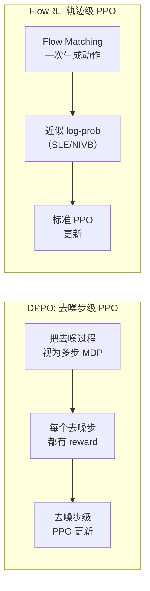

# FlowRL：Flow VLA 的在线 RL 微调 深度精读

> **论文标题**: Online RL Fine-tuning for Flow-based Vision-Language-Action Models  
> **作者**: Jingwei Zhang, Kevin Black, Mitsuhiko Nakamoto, Sergey Levine 等  
> **机构**: UC Berkeley, Physical Intelligence  
> **发表**: arXiv:2510.25889, 2025  
> **代码**: 未公开

**标签**: `#VLA` `#强化学习` `#Flow Matching` `#π₀` `#策略梯度` `#似然近似`

**知识链接**：
- [Flow Matching 与连续归一化流](/前置知识/000g_前置知识_Flow_Matching与连续归一化流) — 本文所有 ODE / CFM / 精确似然公式的完整推导都在这篇里，读之前建议先看一遍
- [策略梯度与 PPO](/前置知识/000a_前置知识_策略梯度与PPO) — 策略梯度定理、PPO clip 目标的完整推导
- [为什么扩散策略难以 RL 微调](/前置知识/000f_前置知识_为什么扩散策略难以RL微调) — 连续生成模型做 RL 的核心困难
- [KL 散度与策略约束](/前置知识/000j_前置知识_KL散度与策略约束) — 防止策略崩溃
- [VLA 模型的 RL 后训练综述](/论文综述/S06_VLA模型的RL后训练综述) — FlowRL 的综述定位

---

## 一、背景与动机

### 1.1 Flow-based VLA 的兴起

2024-2025 年，最强的 VLA 模型（如 π₀）开始采用 **Flow Matching** 作为动作生成机制：

| VLA 模型 | 动作生成方式 | 性能 |
|----------|------------|------|
| OpenVLA | 自回归 Token | 中 |
| Octo | Diffusion Policy | 中高 |
| **π₀** | **Flow Matching** | **最强** |
| π₀-FAST | 自回归 Token（蒸馏自 π₀） | 高 |

Flow Matching 的优势在于：连续动作空间、高表达力、比扩散更快的推理（原理见 [Flow Matching 前置知识](/前置知识/000g_前置知识_Flow_Matching与连续归一化流)）。

### 1.2 核心问题：Flow Matching 没有 log-probability

策略梯度方法（PPO、REINFORCE）都依赖同一个量：动作的对数概率 $\log \pi_\theta(a_t|s_t)$。完整的策略梯度定理和公式详解见[策略梯度与 PPO 前置知识](/前置知识/000a_前置知识_策略梯度与PPO)，这里只说结论——不同 VLA 的动作生成方式，决定了这个量算不算得出来：

| 动作生成方式 | $\log \pi(a|s)$ 能不能算 |
|---|---|
| 自回归 Token（每步 softmax 分类） | ✅ 精确可算 |
| 扩散策略（去噪链） | ❌ 需要对整条链积分，不可行（见[为什么扩散策略难以 RL 微调](/前置知识/000f_前置知识_为什么扩散策略难以RL微调)） |
| Flow Matching（确定性 ODE） | ⚠️ 理论上可算，但需要求 ODE 雅可比行列式，代价极高 |

π₀ 用的正是最后一种。FlowRL 要解决的就是"理论可算但实践算不起"这个矛盾。

### 1.3 FlowRL 的核心贡献

FlowRL 提出两种近似方法来计算 Flow-based 策略的 log-likelihood：
1. **Score-based likelihood estimation (SLE)**：利用 Flow Matching 的 score function 近似 log-prob
2. **Noise-injection variational bound (NIVB)**：通过加噪声构造变分下界

使得 PPO/REINFORCE 可以直接应用于 Flow-based VLA（如 π₀），而**不需要将策略蒸馏为自回归形式**。这两种近似是本文真正的技术贡献，也是下一节的重点。

---

## 二、方法详解：怎么把"算不出 log-prob"变成"能跑 PPO"

上一节说清楚了问题：策略梯度（PPO、REINFORCE）的更新方向由 $\nabla_\theta \log \pi_\theta(a|s)$ 决定，Flow Matching 的动作生成是一个确定性 ODE，理论上能算这个 log-prob，但代价是 1120 次前向传播——训练时每一步都要付这个代价，完全跑不起来。

FlowRL 的两种方法（SLE、NIVB）本质上都是在做同一件事：**放弃"精确算出 log-prob"这个目标，换成"用几次前向传播，估计出一个足够好用的 log-prob 替代值"**，然后把这个替代值原样塞进标准 PPO 的 importance ratio 里（2.5 节）。区别只在于两者对"足够好用"的取舍不同：SLE 更快但没有理论保证，NIVB 稍慢但有严格的下界保证。下面分别看它们具体怎么做到这件事。

### 2.1 为什么精确似然算不起

Flow Matching 用一个确定性 ODE 把噪声 $x_0$ 变成动作 $x_1$（ODE 定义、训练目标 CFM、Euler 积分推理，完整推导见 [Flow Matching 前置知识第三节](/前置知识/000g_前置知识_Flow_Matching与连续归一化流#三flow-matching-的数学推导)）。这个 ODE 是可逆变换，根据变量替换公式（change of variables），$x_1$ 的精确 log-likelihood 需要沿整条路径对速度场的 Jacobian 做迹的积分（完整公式和推导见[前置知识第五节](/前置知识/000g_前置知识_Flow_Matching与连续归一化流#五-flow-policy-把-flow-matching-用作机器人策略)）。

问题出在这个积分的计算代价：
- 散度计算需要对每个维度求偏导：$O(d)$ 次前向传播（$d$ = 动作维度 × chunk 大小，π₀ 中 $d=7\times16=112$）
- 加上时间积分（$N=10$ 个时间点）：总计 $O(d \times N) = 112 \times 10 = 1120$ 次前向传播
- 对 3B 参数的 π₀ 模型，1120 次前传每次动作决策都要跑一遍，完全不可接受

FlowRL 的两个方法（SLE、NIVB）都是为了绕开这 1120 次前传，用远低于这个数量级的计算换一个"够用"的 log-likelihood 估计。

### 2.2 方法一：Score-based Likelihood Estimation (SLE)

**核心思想**：不算精确积分，而是用 Flow Matching 的速度场直接近似 score function（密度上升最快的方向），再从 score 反推 log-likelihood。

具体做法分两步。第一步是"探测"：在真实动作 $a$ 周围加一个小高斯噪声 $\tilde{a}=a+\sigma\epsilon$，然后问速度场网络"如果你站在这个扰动点附近、快要到达终点时（$t=1-\sigma$），你觉得该往哪走"。因为 Flow Matching 的速度场在接近终点时的取值和 score function 之间存在解析关系（两者共享同一条概率路径），所以"速度场读数和当前位置的差、除以步长 $\sigma$"就近似等于 score——这一步只需要**一次前向传播**，不需要算任何积分。

第二步是把这个 score 近似落地成一个真正能用的 log-likelihood 数值。做法是重复"探测"过程 $M$ 次，每次用不同大小的噪声尺度 $\sigma_m$，把每次探测得到的"差多远"取平方、除以对应的 $\sigma_m^2$ 再取负号，最后对 $M$ 次结果取平均。直觉是：如果 $a$ 真的处在高密度区域，那么无论用多大的噪声去探测，速度场都应该稳定地把扰动点"拉回" $a$ 附近；反之如果探测结果和 $a$ 偏差很大，说明 $a$ 处在低密度区，log-likelihood 就应该更低。多个尺度取平均是为了压低单次探测的随机性（论文用 $M=5$）：

$$
\log \pi_\theta(a | s) \approx \frac{1}{M}\sum_{m=1}^{M}\left[-\frac{\|a - v_\theta(a + \sigma_m \epsilon_m, 1-\sigma_m)\|^2}{2\sigma_m^2}\right] + C
$$

**这个公式在做什么**：用 $M$ 次速度场"探测"的平均误差，直接当作 log-likelihood 的估计值——探测误差越小，说明 $a$ 越处在高密度区，log-likelihood 就越高。

::: details 📐 公式详解（点击展开）

| 子表达式 | 它是谁 | 它在干嘛 |
|---------|--------|---------|
| $v_\theta(a+\sigma_m\epsilon_m,1-\sigma_m)$ | **第 m 次探测的速度场读数** | 在扰动点、快到终点时网络给出的方向 |
| $-\frac{\|a-v_\theta(\cdot)\|^2}{2\sigma_m^2}$ | **单次探测打分** | 探测结果和真实动作 $a$ 差多远，差得越远打分越低 |
| $\frac{1}{M}\sum_{m=1}^M(\cdot)$ | **多尺度平均** | 用 $M$ 个不同噪声尺度重复探测，取平均降低单次估计的方差 |
| $C$ | **无关常数** | 和参数 $\theta$ 无关的归一化项，求梯度时自动消失，不影响策略更新 |

**用人话读**："在真实动作附近用几种不同大小的噪声分别探测一次，看速度场把扰动点拉回来的准不准，平均打分就是近似的对数概率。"

**为什么要多个噪声尺度而不是一个**：单一尺度的探测方差大、容易被噪声主导；多尺度平均能显著降低估计方差，代价仍只是 $M$ 次前向传播。
:::

**计算成本**：M=5 次前向传播（vs 精确计算需要 1120 次）→ 加速 200x+

### 2.3 方法二：Noise-Injection Variational Bound (NIVB)

**核心思想**：SLE 是"近似"，没有理论保证；NIVB 换一个思路——构造一个数学上严格成立的**下界**，下界本身可以精确计算。PPO 用一个偏低估计的 log-prob 训练是安全的（顶多更新保守），用一个偏高估计的则可能导致策略更新方向错误——这正是 NIVB 相比 SLE 更适合"最终训练"的原因。

做法的第一步是"模糊化"：Flow Matching 原本的输出是一个确定性的点（给定噪声种子 $x_0$，ODE 积分后只有一个动作有非零概率），这样没法定义一个处处有密度的分布来算似然。NIVB 的处理是在这个确定性输出周围套一层高斯噪声，把尖锐的点模糊成一个有宽度 $\sigma$ 的高斯分布，再对所有可能的噪声种子取平均，得到一个模糊版的策略分布 $\tilde{\pi}_\theta(a|s)$。

第二步是关键：直接算这个模糊分布在真实动作 $a$ 处的密度仍然很贵（要遍历所有噪声种子的积分）。但用 Jensen 不等式可以证明，只需采样 $K$ 个噪声种子、各自跑一遍完整的 ODE 积分，把真实动作 $a$ 到这 $K$ 个生成结果的距离转成高斯密度、取平均再取 log，得到的值必然是真实 log-likelihood 的一个**下界**——不会高估，只会低估：

$$
\log \pi_\theta(a | s) \;\geq\; \log \frac{1}{K}\sum_{k=1}^{K} \mathcal{N}\big(a \mid f_\theta(x_0^{(k)}, s), \sigma^2 I\big)
$$

**这个公式在做什么**：给出一个数学上严格成立的下界——采样 $K$ 个噪声种子各自跑一遍 ODE，看真实动作离这些结果有多近，平均起来就是一个可以直接计算、且保证不高估真实似然的估计。

::: details 📐 公式详解（点击展开）

| 子表达式 | 它是谁 | 它在干嘛 |
|---------|--------|---------|
| $f_\theta(x_0^{(k)},s)$ | **第 k 个种子的生成结果** | 从第 $k$ 个采样噪声出发，经过 ODE 积分得到的具体动作 |
| $\mathcal{N}(a\|f_\theta(x_0^{(k)},s),\sigma^2 I)$ | **这个种子给 $a$ 打的分** | 真实动作 $a$ 落在第 $k$ 个种子生成的高斯分布里的密度值 |
| $\frac{1}{K}\sum_{k=1}^K(\cdot)$ | **K 个种子的投票平均** | 汇总所有噪声种子的打分，取平均作为最终似然下界 |

**用人话读**："采样 K 个噪声种子，各自跑一遍 ODE 生成一个动作，看真实动作离这些生成结果有多近，把这些'近似程度'平均起来就是似然下界。"

**为什么种子越多估计越准**：如果多个独立的噪声种子都映射到接近 $a$ 的位置，说明 $a$ 处在模型高概率区域；$K$ 越大，蒙特卡洛平均的方差越小，下界越紧（论文取 $K=8$ 作为效果与成本的折中）。中间推导用到的 Jensen 不等式链（$\log\tilde\pi_\theta \geq \mathbb{E}_{x_0}[\log\mathcal{N}(\cdot)]$）属于标准的变分下界构造技巧，这里从略。
:::

**计算成本**：K=8 次 ODE 积分（每次 N=10 步前传）= 80 次前向传播。比精确计算仍然快 14x，比 SLE 贵但估计更稳。

### 2.4 两种方法的对比

| 维度 | SLE（Score-based） | NIVB（变分下界） |
|------|-------------------|----------------|
| 计算成本 | 5 次前传 | 80 次前传 |
| 准确度 | 近似（偏差约 10-15%） | 下界（偏差约 5-8%） |
| 梯度质量 | 方差较大 | 方差较小 |
| 适用场景 | 计算预算紧 | 需要稳定训练 |
| 论文推荐 | 快速实验 | 最终训练 |

### 2.5 接入 PPO：改的只有一处

回到最初的问题——策略梯度需要 $\log\pi_\theta(a|s)$，Flow Matching 算不起精确值。现在有了 SLE 或 NIVB 给出的近似值（记作 $\widetilde{\log\pi}$），策略梯度这条路就通了：标准 PPO（完整 clip 目标推导见[策略梯度与 PPO 前置知识](/前置知识/000a_前置知识_策略梯度与PPO)）几乎原样套用，**唯一的改动**是 importance ratio 用近似值而非精确值计算：$r_t = \exp\big(\widetilde{\log \pi}_\theta(a_t|s_t) - \widetilde{\log \pi}_{\theta_{\text{old}}}(a_t|s_t)\big)$。这是标准的"log 空间做减法、再取指数还原成比值"技巧——因为 log-likelihood 本身可能是很大的负数，直接做除法数值不稳定，先减后指数化更稳。

因为近似的 log-likelihood 带噪声，直接套用标准 PPO 超参数会不稳定，FlowRL 额外做了三点补偿：
1. **Ratio clipping 更保守**：$\epsilon = 0.1$（标准值是 0.2）
2. **KL penalty**：额外加 KL 惩罚项防止策略偏移过大
3. **Gradient clipping**：全局梯度裁剪到 norm = 0.5

---

## 三、贯穿全文的例子

### 3.1 场景：桌面机械臂 pick-and-place（π₀ 模型）

**任务**："把红色方块放到蓝色容器中"  
**模型**：π₀（3B 参数，Flow Matching 动作头，action chunk = 16 步，动作维度 $d=7\times16=112$）

**SFT 后表现**：成功率 72%。目标：通过 RL 微调提升到 85%+。

### 3.2 三种计算方式的代价对比

沿用第二节的结论，把抽象的"计算量"换算成这个具体场景下的前传次数：

| 方法 | 每步要做的事 | 前向传播次数 |
|------|------------|------------|
| 精确似然 | 112 维每维求偏导 × 10 个时间点积分 | 1120 次 |
| SLE（$M=5$） | 5 个噪声尺度，各探测一次终点附近速度场 | 5 次 |
| NIVB（$K=8$） | 8 个噪声种子，各跑一次完整 10 步 ODE 积分 | 80 次 |

SLE 的 5 次探测对应 5 个噪声尺度 $\sigma_m \in \{0.01, 0.02, 0.05, 0.10, 0.20\}$，每个尺度贡献一个打分，加权平均后作为 $\widetilde{\log\pi}_\theta(a|s)$ 的估计值（本例中平均结果约为 $-43.4$，具体数值不重要，重点是"多尺度平均"这个机制）。

### 3.3 PPO 更新的一步

假设某个 rollout 中，旧策略和新策略对同一个动作给出的近似 log-prob 分别是 $-43.4$ 和 $-42.1$，advantage $\hat{A}_t=+0.8$（好动作）。代入上一节的 importance ratio 公式：$r_t = \exp(-42.1-(-43.4)) = e^{1.3} \approx 3.67$。

新策略比旧策略更喜欢这个动作 3.67 倍——如果不加 clip，这么大的比值乘上正的 advantage 会带来过大的更新。用 $\epsilon=0.1$ 的保守 clip（对应 clip 区间 $[0.9, 1.1]$）：$\min(3.67\times0.8,\ 1.1\times0.8) = \min(2.94,\ 0.88) = 0.88$。

梯度被 clip 死死限制在 0.88，这就是"近似似然噪声大，所以要用更保守的 clip 范围"补偿措施在实际更新中的样子。

---

## 四、和其他 Flow/Diffusion RL 方法的对比

### 4.1 方法对比表

| 方法 | 动作生成 | log-prob 计算 | RL 算法 | 是否修改架构 |
|------|---------|-------------|---------|-----------|
| DPPO | Diffusion（DDPM） | 展开去噪链 MDP | PPO on denoising | 是（去噪步级 PPO） |
| SRPO | Diffusion（Score） | Score → 近似 log-prob | PPO | 部分 |
| VLA-RL | 自回归 Token | 精确 softmax | 标准 PPO | 否 |
| **FlowRL** | **Flow Matching** | **SLE / NIVB 近似** | **PPO** | **否** |

### 4.2 FlowRL vs DPPO 的关键区别

```mermaid
flowchart LR
    subgraph DPPO["DPPO: 去噪步级 PPO"]
        A1["把去噪过程<br/>视为多步 MDP"] --> B1["每个去噪步<br/>都有 reward"]
        B1 --> C1["去噪步级<br/>PPO 更新"]
    end
    subgraph FlowRL["FlowRL: 轨迹级 PPO"]
        A2["Flow Matching<br/>一次生成动作"] --> B2["近似 log-prob<br/>（SLE/NIVB）"]
        B2 --> C2["标准 PPO<br/>更新"]
    end
```

**DPPO 的问题**：
- 把去噪过程拆成 20-100 步的 MDP → 训练变量和 credit assignment 问题
- 需要为每个去噪步设计中间 reward（如何定义？）
- 修改了 Diffusion Policy 的原始训练框架

**FlowRL 的优势**：
- 不改变 Flow Matching 的生成过程
- 直接在动作空间做 PPO（和自回归 VLA 一样的框架）
- 只需要近似 log-prob 这一个额外模块

---

## 五、实验结果

### 5.1 主实验：仿真 Benchmark

| 方法 | MetaWorld (10 tasks) | LIBERO-Long | RoboMimic |
|------|---------------------|-------------|-----------|
| π₀ (SFT) | 68.5% | 62.3% | 70.1% |
| π₀-FAST + PPO（蒸馏为自回归） | 78.2% | 74.5% | 79.8% |
| DPPO（扩散策略） | 72.3% | 66.8% | 74.2% |
| **FlowRL-SLE** | **76.8%** | **72.1%** | **78.5%** |
| **FlowRL-NIVB** | **79.5%** | **75.8%** | **81.2%** |

**关键发现**：
- FlowRL-NIVB 性能**匹配**甚至**超过**将 π₀ 蒸馏为自回归再做 PPO 的方案
- 直接在 Flow Matching 上做 RL，避免了蒸馏带来的信息损失
- NIVB 比 SLE 好 2-3%（更准确的 log-prob 估计 → 更稳定的训练）

### 5.2 和"蒸馏+RL"路线的对比

| 指标 | 蒸馏为自回归 → PPO | FlowRL（直接 RL） |
|------|-------------------|-----------------|
| 动作精度 | 受限于 token 量化（256 bins，单维平均误差约 0.4%，累积到 112 维约 4.2%） | **连续空间，无量化损失** |
| 动作平滑性 | 不保证（逐 token 独立） | **ODE 路径天然平滑** |
| 训练流程 | 两步（蒸馏 + RL） | **一步（直接 RL）** |
| 蒸馏损失 | ~3-5%（蒸馏不完美） | **0%（无蒸馏）** |
| 推理速度 | 快（7 token 自回归） | 中（10 步 ODE） |

> 量化误差的估算：把 $[-1,1]$ 切成 256 个格子，每个连续值四舍五入到最近格子中心，平均误差是半个格宽 $\approx 0.0078$；假设 112 个维度的误差独立，总误差按 $\sqrt{112}$ 累积，约为 $0.0078\times\sqrt{112}\approx 0.083$，相对动作范围 [-1,1] 约 4.2%——这是把连续动作硬蒸馏为离散 token 必须付出的代价，也是 FlowRL 坚持直接在连续空间做 RL 的动机之一。

### 5.3 Log-likelihood 近似质量分析

论文通过和精确计算（少量低维实验中可行）对比，评估近似质量：

| 方法 | 和精确值的 Pearson 相关系数 | 均方误差 |
|------|--------------------------|---------|
| SLE (M=1) | 0.72 | 8.3 |
| SLE (M=5) | 0.88 | 3.1 |
| SLE (M=10) | 0.91 | 2.4 |
| NIVB (K=4) | 0.90 | 2.8 |
| NIVB (K=8) | 0.94 | 1.5 |
| NIVB (K=16) | 0.96 | 1.1 |

**结论**：NIVB (K=8) 是最佳性价比——相关系数 0.94，计算成本适中。

### 5.4 消融实验

| 配置 | MetaWorld 平均成功率 |
|------|-------------------|
| **完整 FlowRL-NIVB** | **79.5%** |
| 改用 SLE | 76.8%（-2.7%） |
| 去掉 KL penalty | 74.2%（-5.3%） |
| Clip 范围 ε=0.2（标准值） | 76.0%（-3.5%） |
| NIVB K=2（减少采样） | 73.5%（-6.0%） |
| ODE 步数 N=5（减半） | 77.1%（-2.4%） |
| 不做 Critic warmup | 68.3%（-11.2%） |

**关键发现**：
- Critic warmup 依然是最关键的（和 VLA-RL 一致）
- KL penalty 对 Flow-based 策略尤其重要（因为 log-prob 近似有偏差，额外的 KL 约束防止策略崩溃）
- 更保守的 clip（ε=0.1）比标准值（ε=0.2）更好——近似 log-prob 的噪声要求更保守的更新

---

## 六、为什么不直接蒸馏为自回归？

π₀ 的 Flow Matching 动作头输出连续的 action chunk（112 维连续向量）。蒸馏为自回归 token 需要把每个维度量化成有限个离散桶，还要假设各维度条件独立——上一节已经算过，这会带来约 4.2% 的累积误差，并丢失维度间的相关性和动作 chunk 的时间连贯性。

Flow Matching 通过 ODE 积分生成动作，天然保证了：
- 动作各维度之间的相关性（联合分布）
- 时间步之间的平滑过渡（ODE 路径连续）
- 高精度连续值输出（浮点精度）

直接在 Flow Matching 上做 RL 保留了这些优势——这正是 FlowRL 要解决 log-likelihood 计算难题、而不是绕道蒸馏的根本原因。

---

## 七、局限性与展望

### 7.1 当前局限

1. **计算成本仍较高**：即使是近似，NIVB 仍需 K×N=80 次前传来估计一个 log-prob
2. **近似偏差**：SLE 和 NIVB 都不是精确的——长期训练中偏差可能累积
3. **只在仿真验证**：未在真实机器人上验证（推理速度可能是瓶颈）
4. **超参数敏感**：噪声尺度 σ、采样数 K 等需要仔细调节

### 7.2 未来方向

1. **更高效的 log-prob 估计**：学习一个 amortized likelihood estimator
2. **真实世界验证**：在 π₀ 的真实硬件上做在线 RL
3. **和 GRPO 结合**：GRPO 不需要 log-prob（只需要排序），可能更适合 Flow-based VLA
4. **Consistency Flow**：将 Flow Matching 蒸馏为 Consistency 形式，兼得速度和 RL 兼容性

---

## 八、个人评价

### 8.1 独特贡献

FlowRL 解决了一个技术上非常重要的问题：如何给 Flow-based VLA 做策略梯度更新。在 π₀ 成为最强 VLA 的背景下，这个问题直接决定了"最强 VLA 能否被 RL 进一步改进"。

### 8.2 技术洞察

最深刻的 insight 是**"近似的 log-prob + 保守的 PPO > 无 RL"**。即使 log-likelihood 估计有 5-8% 的偏差，只要用更保守的 clip 范围和 KL penalty 来补偿，PPO 仍然能稳定改进策略。

### 8.3 实践意义

对于使用 π₀ 或类似 Flow-based VLA 的团队，FlowRL 提供了一条不蒸馏的 RL 微调路径——保留 Flow Matching 的连续动作优势，同时享受 RL 带来的性能提升。

---

## 延伸阅读

- [Flow Matching 与连续归一化流](/前置知识/000g_前置知识_Flow_Matching与连续归一化流) ← Flow Matching 的详细原理
- [为什么扩散策略难以 RL 微调](/前置知识/000f_前置知识_为什么扩散策略难以RL微调) ← 相关的 log-prob 困难
- [DPPO 精读](./001_DPPO_扩散策略策略优化) ← 扩散策略的 RL 微调（不同路线）
- [VLA-RL 精读](./006_VLA_RL_PPO直接训练自回归VLA) ← 自回归 VLA 的 PPO（log-prob 精确可算的情况）
- [VLA 模型的 RL 后训练综述](/论文综述/S06_VLA模型的RL后训练综述) ← 完整方法对比
