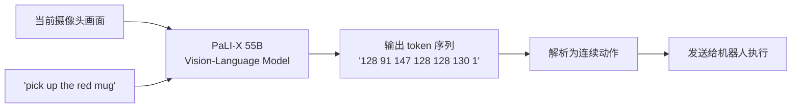

# RT-2：视觉-语言-动作模型 深度精读

> **论文标题**: RT-2: Vision-Language-Action Models Transfer Web Knowledge to Robotic Control  
> **作者**: Anthony Brohan, Noah Brown, Justice Carbajal 等  
> **机构**: Google DeepMind  
> **发表**: CoRL 2023 (arXiv: 2307.15818)  
> **官网**: https://robotics-transformer2.github.io/

**标签**: `#VLA` `#VLM` `#预训练` `#涌现能力` `#迁移学习` `#RT-2`

**知识链接**：
- [视觉-语言-动作模型 VLA 综述](/论文综述/S03_视觉语言动作模型VLA综述) — VLA 路线全景
- [动作 Token 化与自回归策略](/前置知识/000l_前置知识_动作Token化与自回归策略) — RT-2 的动作表示方式
- [OpenVLA：开源 VLA](./015_OpenVLA_开源视觉语言动作模型) — RT-2 的开源继承者
- [Open X-Embodiment](./011_OpenX_大规模跨体机器人数据集与RTX模型) — RT-2-X 的训练数据

---

## 一、背景与动机

### 1.1 视觉-语言模型的"互联网知识"

2023 年中，大规模视觉-语言模型 (VLM) 已经在互联网数据上学到了惊人的世界知识：
- 识别数千种物体和场景
- 理解空间关系（"在...左边"、"在...上面"）
- 推理物体属性（"可以用来装水的"）
- 语义泛化（"看起来像一颗心的物体"）

但这些知识被"锁"在语言/视觉模态中——VLM 能*说出*答案，却不能*做出*动作。

### 1.2 核心想法

RT-2 的核心 insight 极其简单但极其有力：

> **把机器人动作表示为文本 token，VLM 就能直接"说出"动作——就像回答问题一样。**

具体来说：如果一个 VLM 能回答"这张图里红色物体在哪里？"（输出文本坐标），那它也应该能回答"如何抓取这个红色物体？"（输出动作 token）。

### 1.3 核心贡献

1. **首次证明 VLM → VLA 的可行性**：用 co-finetuning 把互联网知识迁移到机器人控制
2. **涌现能力**：在完全没有训练过的语义概念上（"pick up the extinct animal"），机器人也能正确执行
3. **55B 参数的 VLA**：当时最大的端到端机器人控制模型
4. **定义了 VLA 范式**：后续的 OpenVLA、π₀ 等全部沿袭这一框架

---

## 二、技术方案

### 2.1 动作 = 语言

RT-2 的动作表示方式：

一个 7 维连续动作（末端位移 + 旋转 + 夹爪）被量化为一组整数 token：

$$
a = [\Delta x, \Delta y, \Delta z, \Delta rx, \Delta ry, \Delta rz, \text{grip}] \rightarrow [128, 91, 147, 128, 128, 130, 1]
$$

这些整数被直接当作"文字"表示——VLM 输出 "128 91 147 128 128 130 1" 这样一个字符串。

**量化过程**：每个维度均匀离散为 256 个 bin (0~255)，值 128 对应"不动"（居中）。

### 2.2 Co-Finetuning 策略

RT-2 不是先训练 VLM 再在机器人数据上微调，而是**混合训练**：

$$
\mathcal{L} = \lambda_{\text{web}} \mathcal{L}_{\text{VQA}} + \lambda_{\text{robot}} \mathcal{L}_{\text{action}}
$$

- $\mathcal{L}_{\text{VQA}}$：互联网视觉问答任务的损失（保持 VLM 能力不退化）
- $\mathcal{L}_{\text{action}}$：机器人动作预测的损失（学习新能力）
- $\lambda$ 控制混合比例

这样做的好处：**训练过程中不断"提醒"模型原本的视觉-语言知识**，防止灾难性遗忘。

### 2.3 两种 VLM 骨干

RT-2 测试了两种 VLM：

| VLM 骨干 | 参数量 | 视觉编码器 | 语言模型 |
|---------|-------|-----------|---------|
| PaLI-X | 55B | ViT-22B | 32B LM |
| PaLM-E | 12B | ViT-4B | PaLM 8B |

55B 版本效果最好，但推理需要多卡。

### 2.4 推理流程



---

## 三、涌现能力

### 3.1 什么是"涌现"？

RT-2 最震撼的结果不是数字上的提升，而是**在训练数据中从未出现过的概念上表现出正确行为**。

### 3.2 具体例子

**语义推理**：
- 指令："pick up the extinct animal"
- 机器人训练数据中从未标注过"extinct animal"
- 但 VLM 知道恐龙是已灭绝动物 → 正确抓取桌上的恐龙玩具

**视觉概念迁移**：
- 指令："put the object that looks like a heart into the basket"
- 机器人数据中没有"看起来像心形的物体"这个标签
- 但 VLM 的视觉理解能识别心形 → 正确操作

**符号推理**：
- 桌上有多个数字积木，指令："pick up the number that is smaller than 5 but larger than 2"
- VLM 理解数学比较 → 抓取数字 3 或 4

### 3.3 为什么会涌现？

涌现能力来自 VLM 的互联网预训练知识。Co-finetuning 让模型学会了"把理解转化为动作"的**接口**，而理解本身来自数十亿的互联网数据。

这意味着：**VLA 的知识上限不是机器人数据量决定的，而是 VLM 预训练决定的。**

---

## 四、实验结果

### 4.1 标准操作任务

在 Google 的 Everyday Robots 平台上评估：
- RT-1 (baseline)：73%
- RT-2 (PaLM-E 12B)：76%
- RT-2 (PaLI-X 55B)：**82%**

### 4.2 涌现泛化任务

在训练数据中**从未出现过**的语义概念上评估：
- RT-1：32%（基本是瞎猜）
- RT-2 (PaLI-X 55B)：**62%**

这 62% 完全来自 VLM 的互联网知识迁移。

### 4.3 Chain-of-Thought 推理

RT-2 还可以输出"思考过程"再输出动作：

```
输入图像 + "I need to use something to poke the food"
→ 输出："I will use the fork because it has prongs suitable for poking. Action: 142 88 155 ..."
```

虽然 CoT 对成功率提升不大（+2-3%），但它让模型的决策可解释。

---

## 五、局限性

1. **推理极慢**：55B 模型，需要 TPU 集群，单步推理 ~1-2 秒
2. **闭源**：代码和权重不公开
3. **单帧输入**：没有历史，缺乏时序推理
4. **动作精度有限**：256 bin 量化
5. **单一机器人**：只在 Everyday Robots 上验证（后续 RT-2-X 解决了这点）

### 为什么 RT-2 的局限催生了后续工作

- 推理慢 + 闭源 → **OpenVLA** (7B, 开源)
- 动作精度有限 → **π₀** (Flow Matching, 连续动作)
- 单一机器人 → **RT-2-X** (跨体态版本)

---

## 六、历史意义

RT-2 的最大贡献不是某个具体的性能数字，而是**证明了一个路线**：

> 互联网预训练 → VLM → VLA → 机器人通用策略

这条路线在 2023 年之前还只是假设。RT-2 第一次用实验证明它是可行的，由此开启了整个 VLA 研究方向。

| 维度 | 历史贡献 |
|------|---------|
| 范式定义 | 定义了 "VLM + 动作 token = VLA" 的范式 |
| 涌现证明 | 首次展示机器人的"互联网知识涌现" |
| 研究方向 | 开启了 VLA 方向，催生 OpenVLA/π₀/GR00T 等 |
| 社区影响 | 让机器人界认识到"大模型时代到来了" |

---

## 延伸阅读

- [OpenVLA：开源 VLA](./015_OpenVLA_开源视觉语言动作模型) — RT-2 的开源继承者
- [Open X-Embodiment + RT-2-X](./011_OpenX_大规模跨体机器人数据集与RTX模型) — RT-2 的跨体态扩展
- [π₀：通用基础模型](./014_Pi0_通用机器人基础模型) — 解决 RT-2 精度问题的方案
- [VLA-RL：PPO 训练 VLA](./006_VLA_RL_PPO直接训练自回归VLA) — 在 VLA 基础上做 RL
