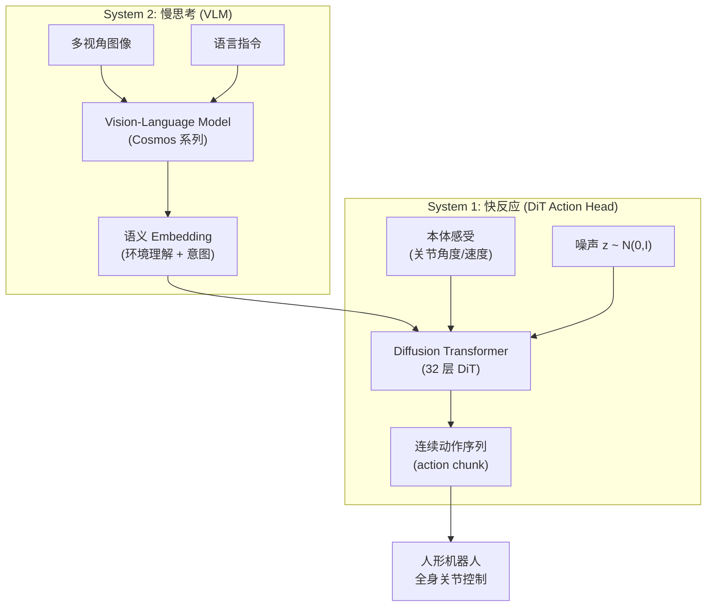

# GR00T N1：NVIDIA 人形机器人开放基础模型 深度精读

> **论文标题**: GR00T N1: An Open Foundation Model for Generalist Humanoid Robots  
> **作者**: NVIDIA Isaac Team  
> **机构**: NVIDIA  
> **发表**: arXiv:2503.14734, 2025 (GTC 2025 发布)  
> **代码**: https://github.com/NVIDIA/Isaac-GR00T

**标签**: `#人形机器人` `#VLA` `#基础模型` `#扩散Transformer` `#GR00T` `#NVIDIA`

**知识链接**：
- [扩散模型 DDPM](/前置知识/000b_前置知识_扩散模型DDPM) — GR00T 的动作生成基础
- [视觉-语言-动作模型 VLA 综述](/论文综述/S03_视觉语言动作模型VLA综述) — VLA 路线对比
- [π₀：通用基础模型](./010_Pi0_通用机器人基础模型) — GR00T 的直接竞品

---

## 一、背景与动机

### 1.1 人形机器人的机遇与挑战

2024-2025 年，人形机器人迎来爆发期——Figure 01/02、Tesla Optimus、1X NEO、Unitree G1/H1 等纷纷亮相。但这些硬件面临一个共同的软件瓶颈：

> **没有一个通用的"大脑"能让人形机器人做各种日常任务。**

每个团队都在自己训练策略，数据贵、效率低、不通用。

### 1.2 GR00T 的定位

GR00T (Generalist Robot 00 Technology) 是 NVIDIA 推出的**专为人形机器人设计的开放基础模型**：

- 接受视觉观测 + 语言指令
- 输出连续的全身运动控制
- 支持不同人形机器人体态
- 完全开源（代码 + 权重）

### 1.3 双系统架构灵感

GR00T N1 的核心设计灵感来自认知心理学的"双系统理论"（Kahneman）：

- **System 2**：慢思考——理解环境、解析指令、做高层决策（对应 VLM）
- **System 1**：快反应——实时生成流畅的运动轨迹（对应 Diffusion Transformer）

---

## 二、模型架构

### 2.1 整体设计

### 2.2 System 2：视觉-语言理解

基于 NVIDIA 的 Cosmos 系列 VLM：
- 视觉编码器处理多视角图像（头部摄像头 + 外部摄像头）
- 语言模型理解自然语言指令
- 输出高维语义 embedding，编码了"当前环境状态"和"要做什么"

System 2 不需要实时运行——它可以以较低频率（1-2Hz）更新语义理解，类似人"看一眼环境，理解局势"。

### 2.3 System 1：Diffusion Transformer 动作头

动作生成用 32 层 Diffusion Transformer (DiT)：

$$
a_{0:H} = \text{DiT}(z_T, c_{\text{vlm}}, c_{\text{prop}}; \theta)
$$

**逐项拆解**：
- $z_T$ — 初始噪声，维度等于 $H \times d_a$（$H$ 步 × 动作维度）
- $c_{\text{vlm}}$ — System 2 输出的语义条件
- $c_{\text{prop}}$ — 当前本体感受（关节角、角速度）
- 输出 $a_{0:H}$：未来 $H$ 步的连续动作序列

**为什么用 DiT 而不是简单的 MLP？**

1. 人形机器人动作维度极高（20-30 个关节），需要强大的建模能力
2. DiT 天然支持 action chunk（一次性生成多步）
3. 扩散过程能建模多模态动作分布（多种合理的运动方式）

### 2.4 模型规模

GR00T N1 的总参数约 3B：
- VLM 部分：~2B
- DiT 动作头：~1B（32 层 Transformer）

相比 Octo (93M) 大得多，但比 RT-2 (55B) 小很多。定位在"够大能做复杂任务，够小能实时推理"的平衡点。

---

## 三、训练数据与流程

### 3.1 数据来源

GR00T N1 的训练数据包括：
- **人形机器人遥操作数据**：多种人形机器人的双臂操作示教
- **仿真数据**：NVIDIA Isaac Sim 中生成的大规模轨迹
- **跨体态数据**：OXE 中的操作数据（非人形，但提供操作知识）
- **人类动作视频**：从人类活动视频中提取运动先验

### 3.2 训练策略

三阶段训练：

1. **VLM 预训练**：在互联网视觉-语言数据上训练 System 2
2. **跨体态操作预训练**：在多种机器人操作数据上训练 DiT action head
3. **人形特定微调**：在目标人形平台的遥操作数据上精调

### 3.3 支持的人形平台

GR00T N1 发布时支持：
- 1X NEO
- Unitree G1/H1
- Fourier Intelligence GR-1
- Apptronik Apollo
- NVIDIA 自有测试平台

---

## 四、关键能力

### 4.1 双臂协调操作

人形机器人最重要的能力之一——双手协作：
- 一只手稳定物体，另一只手操作
- 双手同时抓取和放置
- 灵巧的组装和拆卸

### 4.2 语言跟随

理解并执行多种指令：
- "pick up the cup with your right hand"
- "open the drawer and take out the plate"
- "fold the towel and put it on the shelf"

### 4.3 快速适配新硬件

通过更换 action head 的输出维度 + 少量微调，可以适配不同的人形平台：
- 不同关节数量（12-30 个 DOF）
- 不同执行器类型（电机/液压）
- 不同传感器配置

---

## 五、与竞品对比

| 维度 | GR00T N1 | π₀ | Octo |
|------|---------|-----|------|
| 目标体态 | 人形为主 | 多种（含人形） | 多种（操作臂为主） |
| 动作表示 | Diffusion Transformer | Flow Matching | Diffusion |
| 参数量 | ~3B | ~3B | 93M |
| 开源 | ✅ 完全 | 部分 (OpenPI) | ✅ 完全 |
| 全身控制 | ✅ | 部分 | ❌（操作臂只） |
| 仿真集成 | Isaac Sim | 无 | 无 |
| 硬件生态 | Jetson + Isaac | 无绑定 | 无绑定 |

GR00T N1 的独特优势：**与 NVIDIA 的仿真 (Isaac Sim) 和硬件 (Jetson) 生态深度集成**，形成从训练到部署的闭环。

---

## 六、总结

GR00T N1 的关键启示：

1. **双系统架构合理**：慢思考（VLM）+ 快反应（DiT）的分工契合机器人控制需求
2. **人形需要专用设计**：通用策略（Octo/CrossFormer）可能不够，人形的高自由度需要更大的动作模型
3. **开源 + 生态是壁垒**：代码+权重+仿真器+硬件的完整链路降低了入门门槛
4. **DiT 作为动作生成器**：32 层 DiT 对高维连续动作的建模能力优秀

---

## 延伸阅读

- [π₀：通用基础模型](./014_Pi0_通用机器人基础模型) — Physical Intelligence 的竞争方案
- [扩散模型 DDPM](/前置知识/000b_前置知识_扩散模型DDPM) — 理解 DiT 的扩散基础
- [DROID：大规模真实数据集](./013_DROID_大规模真实世界操作数据集) — 训练数据来源之一
- [VLA 模型的 RL 后训练综述](/论文综述/S06_VLA模型的RL后训练综述) — 基础模型之上的 RL 微调
