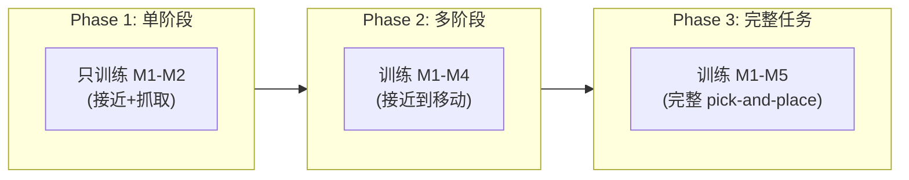

# TGRPO：轨迹级 GRPO 微调 VLA 深度精读

> **论文标题**: Fine-tuning Vision-Language-Action Model via Trajectory-wise Group Relative Policy Optimization  
> **作者**: Haoran Chen, Kaiwen Zhou, Yixiao Wang, Junbo Wang 等  
> **机构**: Tsinghua University, Shanghai AI Laboratory  
> **发表**: arXiv:2506.08440, 2025  
> **代码**: 未公开

**标签**: `#VLA` `#强化学习` `#GRPO` `#轨迹级优化` `#里程碑奖励` `#课程学习`

**知识链接**：
- [GRPO (Group Relative Policy Optimization)](/前置知识/000m_前置知识_GRPO_Group_Relative_Policy_Optimization) — GRPO 的基本原理
- [策略梯度与 PPO](/前置知识/000a_前置知识_策略梯度与PPO) — PPO 和 GRPO 的关系
- [Process Reward Model](/前置知识/000n_前置知识_Process_Reward_Model) — 里程碑奖励的灵感来源
- [行为克隆与 RL 微调范式](/前置知识/000d_前置知识_行为克隆与RL微调范式) — SFT → RL 的范式
- [VLA 模型的 RL 后训练综述](/论文综述/S06_VLA模型的RL后训练综述) — TGRPO 在综述中的定位

---

## 一、背景与动机

### 1.1 GRPO 在 LLM 中的成功

GRPO（Group Relative Policy Optimization）是 DeepSeek 提出的无 Critic 强化学习方法：

- 对同一个 prompt 生成一组（G 个）回答
- 用 reward 对组内回答排序
- 用组内相对排名替代 Critic 的 value baseline
- 省去了训练 Critic 网络的成本

**LLM GRPO 的公式**：

$$
\mathcal{L}_{\text{GRPO}}(\theta) = -\mathbb{E}_{q \sim P(Q)}\left[\frac{1}{G}\sum_{i=1}^{G}\frac{1}{|o_i|}\sum_{t=1}^{|o_i|}\left(\min(\rho_t^{(i)} \hat{A}_i, \text{clip}(\rho_t^{(i)}, 1\pm\epsilon) \hat{A}_i) - \beta D_{\text{KL}}\right)\right]
$$

其中 $\hat{A}_i = \frac{r_i - \text{mean}(\{r_j\}_{j=1}^G)}{\text{std}(\{r_j\}_{j=1}^G)}$

### 1.2 GRPO 直接用于 VLA 的问题

RIPT-VLA 已经尝试将 GRPO 应用于 VLA（[RIPT-VLA 精读](./007_RIPT_VLA_无Critic的VLA后训练)），但有几个关键问题：

| 问题 | LLM 场景 | VLA 场景 | 影响 |
|------|---------|---------|------|
| 奖励粒度 | 每个回答一个得分 | 每条轨迹只有 0/1 | 组内区分度极低 |
| 序列长度 | 100-1000 token | 50×7=350 token（但分布在 50 步） | Credit assignment 更难 |
| 状态依赖 | 同一 prompt 不同回答 | 同一初始状态不同轨迹 | 轨迹间差异更大 |
| 奖励多样性 | 连续得分（如 0-10） | 二值（0 或 1） | 组内 normalized advantage 极端 |

**核心问题**：当奖励只有 0/1 时，一组 G 条轨迹中如果全成功或全失败，normalized advantage = 0 → **完全学不到东西**。

### 1.3 TGRPO 的核心贡献

1. **轨迹级 GRPO**：将 GRPO 从 token 级别适配到轨迹级别
2. **里程碑密集奖励**：设计阶段性奖励替代稀疏的 0/1 reward
3. **渐进式课程训练**：从简单子任务开始，逐步增加难度
4. **轨迹感知的 advantage 归一化**：考虑轨迹结构的 group 归一化

---

## 二、方法详解

### 2.1 从 Token-level 到 Trajectory-level GRPO

**LLM GRPO（token-level）**：对同一个 prompt 生成 G 个完整回答，每个回答的所有 token 共享同一个 advantage。

**TGRPO（trajectory-level）**：对同一个初始状态 $s_0$ 执行 G 条轨迹，但每条轨迹的每个时间步可以有不同的 advantage。

**TGRPO 的核心公式**：

$$
\mathcal{L}_{\text{TGRPO}}(\theta) = -\frac{1}{G}\sum_{i=1}^{G}\sum_{t=0}^{T_i}\left[\min\left(\rho_t^{(i)} \hat{A}_t^{(i)}, \text{clip}(\rho_t^{(i)}, 1\pm\epsilon) \hat{A}_t^{(i)}\right) - \beta D_{\text{KL}}^{(i)}\right]
$$

**逐项拆解**：
- $G$：组大小（论文使用 G=8）
- $T_i$：第 $i$ 条轨迹的长度
- $\rho_t^{(i)} = \frac{\pi_\theta(a_t^{(i)} | s_t^{(i)})}{\pi_{\theta_{\text{old}}}(a_t^{(i)} | s_t^{(i)})}$：importance ratio
- $\hat{A}_t^{(i)}$：第 $i$ 条轨迹第 $t$ 步的 advantage（关键区别！）
- $\epsilon = 0.2$：clip 范围
- $\beta$：KL 惩罚系数

**关键区别**：$\hat{A}_t^{(i)}$ 不再是整条轨迹共享一个值，而是每步不同——这通过里程碑奖励实现。

### 2.2 里程碑密集奖励设计

**问题**：环境只给 0/1 最终奖励。如何为每步提供有意义的 reward？

**TGRPO 的解决方案**：将复杂任务分解为多个**里程碑（milestones）**，每个里程碑完成时给予中间奖励。

**里程碑定义规则**：
1. 检测末端执行器（gripper）的状态变化（开→闭 = 抓取，闭→开 = 放置）
2. 检测目标物体的位置变化超过阈值
3. 预定义的任务阶段语义分割

**数值例子**（桌面机械臂 pick-and-place）：

| 里程碑 | 触发条件 | 奖励 |
|--------|---------|------|
| M1: 接近物体 | 末端距物体 < 3cm | +0.2 |
| M2: 成功抓取 | 夹爪闭合且力传感器 > 阈值 | +0.3 |
| M3: 抬起物体 | 物体高度 > 5cm | +0.2 |
| M4: 移至目标上方 | 末端 xy 距目标 < 3cm | +0.1 |
| M5: 成功放置 | 物体在目标区域内 | +0.2 |
| **总计** | | **1.0** |

**对比只有最终奖励**：

$$
r_{\text{sparse}} = \begin{cases} 1.0 & \text{任务成功} \\ 0.0 & \text{其他} \end{cases}
$$

$$
r_{\text{milestone}} = \sum_{k=1}^{5} r_k \cdot \mathbb{1}[\text{milestone } k \text{ achieved}]
$$

### 2.3 轨迹感知的 Group Relative Advantage

有了里程碑奖励后，每条轨迹每步的累积回报可以精细计算：

$$
G_t^{(i)} = \sum_{k=t}^{T_i} \gamma^{k-t} r_k^{(i)}
$$

**TGRPO 的 advantage 归一化**：在组内进行时间步感知的归一化：

$$
\hat{A}_t^{(i)} = \frac{G_t^{(i)} - \mu_t}{\sigma_t + \epsilon}
$$

其中：

$$
\mu_t = \frac{1}{G}\sum_{j=1}^{G} G_t^{(j)}, \quad \sigma_t = \sqrt{\frac{1}{G}\sum_{j=1}^{G}(G_t^{(j)} - \mu_t)^2}
$$

**逐项拆解**：
- $G_t^{(i)}$：第 $i$ 条轨迹从第 $t$ 步开始的累积回报
- $\mu_t$：G 条轨迹在时刻 $t$ 的平均回报
- $\sigma_t$：G 条轨迹在时刻 $t$ 的回报标准差
- **关键**：归一化是在同一时刻跨轨迹做的（不是跨时间步！）

**对比 LLM GRPO**：

| 维度 | LLM GRPO | TGRPO |
|------|----------|-------|
| Advantage 粒度 | 整个序列一个值 | 每步一个值 |
| 归一化范围 | 跨回答的最终 reward | 跨轨迹的同时刻回报 |
| 信号密度 | 稀疏（一个 reward 分给所有 token） | 密集（里程碑每步都有） |
| 区分度 | 低（0/1 → 方差大） | 高（连续里程碑 → 精细区分） |

### 2.4 数值例子：TGRPO 的一次更新

**设置**：G=4 条轨迹，任务 = pick-and-place，5 个里程碑。

| 轨迹 | M1(0.2) | M2(0.3) | M3(0.2) | M4(0.1) | M5(0.2) | 总回报 |
|------|---------|---------|---------|---------|---------|--------|
| τ₁ | ✓ | ✓ | ✓ | ✓ | ✓ | 1.0 |
| τ₂ | ✓ | ✓ | ✓ | ✗ | ✗ | 0.7 |
| τ₃ | ✓ | ✗ | ✗ | ✗ | ✗ | 0.2 |
| τ₄ | ✓ | ✓ | ✓ | ✓ | ✗ | 0.8 |

**在 t=0（开始时刻）的 advantage**：
- $G_0^{(1)} = 1.0, G_0^{(2)} = 0.7, G_0^{(3)} = 0.2, G_0^{(4)} = 0.8$
- $\mu_0 = (1.0+0.7+0.2+0.8)/4 = 0.675$
- $\sigma_0 = \sqrt{(0.325^2+0.025^2+0.475^2+0.125^2)/4} = 0.295$
- $\hat{A}_0^{(1)} = (1.0-0.675)/0.295 = +1.10$（强化）
- $\hat{A}_0^{(3)} = (0.2-0.675)/0.295 = -1.61$（抑制）

**在 t=M2 之后（抓取完成后）的 advantage**：
- $G_{M2}^{(1)} = 0.5, G_{M2}^{(2)} = 0.2, G_{M2}^{(4)} = 0.3$（τ₃ 没到达 M2，不参与）
- 归一化后：τ₁ 的后半段被强化，τ₂ 的后半段被抑制

**效果**：模型学会了"τ₁ 的抓取后移动策略最好，τ₃ 的抓取策略有问题"——精细到每个阶段。

### 2.5 渐进式课程训练



**为什么需要课程学习？**

初始 VLA 如果成功率很低（如 30%），一组 G=8 条轨迹中可能全部失败 → advantage 全为 0 → 学不到任何东西。

**解决方案**：从简单子任务开始，确保组内有成功和失败的混合 → 有对比信号。

**课程设计**：

| 阶段 | 目标 | 评判标准 | 进入下阶段条件 |
|------|------|---------|-------------|
| Phase 1 | 成功接近+抓取 | M1+M2 完成 | 成功率 > 70% |
| Phase 2 | 抓取+抬起+移动 | M1-M4 完成 | 成功率 > 60% |
| Phase 3 | 完整任务 | M1-M5 完成 | — |

**自适应难度**：每个 phase 训练到组内成功率达到阈值后，自动进入下一个 phase。

### 2.6 KL 正则化

防止策略偏离预训练太远：

$$
D_{\text{KL}}^{(i)} = \frac{1}{T_i}\sum_{t=0}^{T_i}\left[\frac{\pi_\theta(a_t^{(i)}|s_t^{(i)})}{\pi_{\text{ref}}(a_t^{(i)}|s_t^{(i)})} - \log\frac{\pi_\theta(a_t^{(i)}|s_t^{(i)})}{\pi_{\text{ref}}(a_t^{(i)}|s_t^{(i)})} - 1\right]
$$

**逐项拆解**：
- $\pi_{\text{ref}}$：参考策略（SFT 后的初始 VLA）
- 使用的是 KL 的分析近似形式（避免需要两个模型同时推理）
- $\beta = 0.04$：KL 惩罚系数

---

## 三、和 RIPT-VLA 的对比

### 3.1 RIPT-VLA 的局限

RIPT-VLA 是第一个将 GRPO 应用于 VLA 的工作，但直接沿用了 LLM GRPO 的设计：

| 问题 | RIPT-VLA 的做法 | TGRPO 的改进 |
|------|---------------|-------------|
| 奖励稀疏 | 仍用 0/1 final reward | 里程碑密集奖励 |
| Advantage 粒度 | 整条轨迹一个值 | 每步独立计算 |
| 训练稳定性 | 组内全成功/全失败时崩溃 | 课程学习保证混合 |
| 信号传播 | 350 token 共享一个 advantage | 每 7 token（一步）有独立信号 |

### 3.2 数值对比

**RIPT-VLA**（0/1 reward, G=8）：
- 8 条轨迹中 6 条成功、2 条失败
- 成功的 advantage: $(1 - 0.75)/0.43 = +0.58$
- 失败的 advantage: $(0 - 0.75)/0.43 = -1.74$
- **问题**：6 条成功轨迹获得相同的 advantage，即使它们的执行质量不同

**TGRPO**（里程碑 reward, G=8）：
- 轨迹得分范围：0.2（只完成 M1）到 1.0（全部完成）
- 每条轨迹在每个时刻有不同的 advantage
- **优势**：即使两条轨迹都成功，也能区分"快速精确成功"和"磕磕绊绊成功"

---

## 四、实验结果

### 4.1 主实验：LIBERO Benchmark

| 方法 | Spatial | Object | Goal | Long | **平均** |
|------|---------|--------|------|------|--------|
| OpenVLA (SFT) | 84.7% | 88.4% | 79.2% | 53.7% | 76.5% |
| RIPT-VLA (GRPO) | 86.2% | 89.5% | 80.8% | 55.2% | 77.9% |
| VLA-RL (PPO) | 90.2% | 91.8% | 82.2% | 59.8% | 81.0% |
| **TGRPO** | **91.5%** | **93.2%** | **85.6%** | **63.4%** | **83.4%** |

**关键发现**：
- TGRPO 超越 RIPT-VLA **5.5%**（同样用 GRPO 框架，但设计更合理）
- TGRPO 超越 VLA-RL (PPO) **2.4%**——不需要 Critic 也能比 PPO 好！
- 在最难的 LIBERO-Long 上提升最大（+8.2% vs RIPT-VLA），说明里程碑奖励对长序列尤其重要

### 4.2 LIBERO-Long 详细分析

LIBERO-Long 是最具挑战性的子集（需要完成 5-8 步的复杂操作链）：

| 方法 | 步数 ≤ 3 的任务 | 步数 4-5 的任务 | 步数 6+ 的任务 |
|------|---------------|---------------|--------------|
| RIPT-VLA | 72% | 52% | 38% |
| VLA-RL | 76% | 58% | 42% |
| **TGRPO** | **80%** | **62%** | **48%** |

**结论**：任务越长越复杂，里程碑奖励的优势越明显——因为它解决了长序列中的 credit assignment 问题。

### 4.3 训练效率对比

| 方法 | 达到 80% 平均成功率需要的环境步数 | GPU 小时 |
|------|-------------------------------|---------|
| VLA-RL (PPO + Critic) | 50K steps | 48h |
| RIPT-VLA (GRPO) | 80K steps（因为信号稀疏） | 40h |
| **TGRPO** | **30K steps** | **32h** |

TGRPO 训练效率高的原因：
1. 里程碑奖励提供更密集的学习信号 → 每步更新更有效
2. 无 Critic → 省去 Critic warmup 的时间
3. 课程学习 → 早期训练不浪费在完全无信号的轨迹上

### 4.4 消融实验

| 配置 | LIBERO 平均成功率 |
|------|----------------|
| **完整 TGRPO** | **83.4%** |
| 去掉里程碑奖励（用 0/1） | 78.2%（-5.2%） |
| 去掉课程学习 | 80.5%（-2.9%） |
| 去掉时间步归一化（用全轨迹归一化） | 80.8%（-2.6%） |
| G=4（减小组大小） | 81.2%（-2.2%） |
| G=16（增大组大小） | 83.8%（+0.4%） |
| 里程碑奖励换为均匀分配 | 81.5%（-1.9%） |
| 去掉 KL 正则化 | 76.3%（-7.1%，崩溃） |

**关键结论**：
- **KL 正则化是稳定训练的底线**（去掉后 -7.1%）
- 里程碑奖励是最大的性能贡献（-5.2%）
- 课程学习和时间步归一化各贡献 2-3%
- 组大小 G=8 是好的 trade-off（G=16 略好但计算翻倍）

### 4.5 里程碑奖励 vs 均匀奖励

| 奖励设计 | Pick&Place | Stack | Pour | **说明** |
|----------|-----------|-------|------|---------|
| 只有 final 0/1 | 78.2% | 65.3% | 58.0% | 稀疏，信号差 |
| 均匀分 5 段（每段 0.2） | 81.5% | 70.2% | 63.5% | 有密集信号但无语义 |
| **里程碑（按难度加权）** | **83.4%** | **73.8%** | **66.2%** | 语义对齐+难度加权 |

**里程碑奖励的加权原则**："更难完成的阶段给更高的奖励"。例如精确放置（M5）比接近物体（M1）难，所以 M5 的奖励应该更高。

---

## 五、贯穿全文的例子

### 5.1 场景：桌面机械臂 pick-and-place → stack

任务升级："先把红色方块放到蓝色方块上面（堆叠）"

这是一个 7 步任务：接近红块→抓取→抬起→移至蓝块上方→对准→慢放→松手

### 5.2 课程学习的详细过程

**Phase 1（训练 500 步）**：目标 = 接近+抓取

```
评价指标：M1(接近) + M2(抓取) 完成率
初始：M1=65%, M2=40%
500步后：M1=90%, M2=75% → 达到阈值，进入 Phase 2
```

**Phase 2（训练 800 步）**：目标 = 抓取+抬起+移动

```
评价指标：M1-M4 完成率
初始（继承 Phase 1）：M1=90%, M2=75%, M3=60%, M4=45%
800步后：M1=95%, M2=88%, M3=82%, M4=70% → 进入 Phase 3
```

**Phase 3（训练 1000 步）**：目标 = 完整堆叠

```
评价指标：M1-M7 完成率
最终：M1=96%, M2=90%, M3=85%, M4=78%, M5=72%, M6=68%, M7=62%
完整成功率 = 62%（vs 初始的 35%）→ +27%！
```

### 5.3 一组轨迹的详细分析

Phase 3 中某次训练，G=8 条轨迹的结果：

| 轨迹 | M1 | M2 | M3 | M4 | M5 | M6 | M7 | 得分 |
|------|----|----|----|----|----|----|----|----|
| τ₁ | ✓ | ✓ | ✓ | ✓ | ✓ | ✓ | ✓ | 1.0 |
| τ₂ | ✓ | ✓ | ✓ | ✓ | ✓ | ✗ | ✗ | 0.75 |
| τ₃ | ✓ | ✓ | ✓ | ✗ | ✗ | ✗ | ✗ | 0.5 |
| τ₄ | ✓ | ✓ | ✓ | ✓ | ✓ | ✓ | ✗ | 0.85 |
| τ₅ | ✓ | ✗ | ✗ | ✗ | ✗ | ✗ | ✗ | 0.15 |
| τ₆ | ✓ | ✓ | ✓ | ✓ | ✗ | ✗ | ✗ | 0.6 |
| τ₇ | ✓ | ✓ | ✓ | ✓ | ✓ | ✓ | ✓ | 1.0 |
| τ₈ | ✓ | ✓ | ✗ | ✗ | ✗ | ✗ | ✗ | 0.35 |

**如果用 0/1 final reward**：只有 τ₁、τ₇ 得到 reward=1，其余都是 0 → 6 条轨迹的信息浪费了。

**TGRPO 里程碑奖励的优势**：
- τ₂ 和 τ₄ 虽然没有完全成功，但它们在 M5 阶段（精确对准）做得好 → 这些"部分成功"的经验被保留
- τ₅ 在 M2（抓取）就失败了 → 它的前半段被抑制
- τ₃ vs τ₆：两者都停在中间，但 τ₆ 到达了 M4 → τ₆ 的"移动"阶段被强化

---

## 六、TGRPO vs PPO 的优劣分析

### 6.1 TGRPO 的优势

1. **无需 Critic**：省去 Critic 网络（在 7B VLA 场景中节省约 7B 参数的显存）
2. **无需 Critic warmup**：VLA-RL 的消融显示 Critic warmup 贡献 +10%——但 TGRPO 根本不需要
3. **训练更简单**：只有一个策略网络需要更新
4. **里程碑奖励设计灵活**：可以根据任务语义定制奖励结构

### 6.2 TGRPO 的劣势

1. **需要里程碑定义**：需要为每个任务定义里程碑——对新任务有额外工程成本
2. **组大小限制**：G=8 意味着每次更新需要并行跑 8 条轨迹（对环境并行性有要求）
3. **不如 PPO 的 value 估计精细**：PPO 的 Critic 可以为每个状态给出连续的 value，TGRPO 只有离散的里程碑

### 6.3 什么时候用 TGRPO vs PPO？

| 场景 | 推荐方法 | 原因 |
|------|---------|------|
| 任务有清晰的阶段分解 | TGRPO | 里程碑容易定义 |
| GPU 显存有限 | TGRPO | 无 Critic |
| 需要最高性能 | TGRPO（本文证明） | 里程碑奖励 > Critic value |
| 任务没有明确阶段 | PPO | 不依赖手工奖励设计 |
| 需要精细的 value 估计 | PPO | Critic 提供连续 value |

---

## 七、局限性与展望

### 7.1 当前局限

1. **里程碑定义的 scalability**：每个新任务需要人工定义里程碑——不够自动化
2. **只在仿真中验证**：LIBERO 环境中里程碑可以通过环境 API 精确检测，真实世界中需要额外感知
3. **依赖初始成功率**：如果 SFT 策略成功率 < 10%，课程学习可能无法启动（Phase 1 也全失败）
4. **组大小固定**：G=8 对所有任务一样，没有自适应

### 7.2 未来方向

1. **自动里程碑发现**：用 VLM 自动从任务描述中推断里程碑
2. **真实世界验证**：用视觉检测替代环境 API 检测里程碑
3. **自适应组大小**：根据当前成功率动态调整 G
4. **和 RPRM 结合**：用 VLA-RL 的 RPRM 替代手工里程碑（自动学习奖励模型）

---

## 八、个人评价

### 8.1 独特贡献

TGRPO 证明了**GRPO 在机器人场景中不需要 Critic 也能超越 PPO**——前提是奖励设计得当。这是一个重要的实践经验：好的奖励设计 > 复杂的 value 估计。

### 8.2 技术洞察

最核心的 insight 是"轨迹级别的 group 归一化"。LLM 中一个回答对应一个 reward，自然可以 group 归一化。但机器人轨迹中每步状态不同，直接用最终 reward 归一化会丢失大量信息。里程碑奖励 + 时间步归一化优雅地解决了这个 gap。

### 8.3 和 VLA-RL RPRM 的比较

VLA-RL 的 RPRM（自动学习的过程奖励模型）和 TGRPO 的手工里程碑本质上在解决同一个问题：**给稀疏奖励的轨迹添加密集信号**。RPRM 更自动化但需要训 reward model；TGRPO 更简单直接但需要人工定义。未来方向是结合两者——用 VLM 自动定义里程碑（兼顾自动化和可解释性）。

---

## 延伸阅读

- [GRPO 前置知识](/前置知识/000m_前置知识_GRPO_Group_Relative_Policy_Optimization) ← GRPO 的详细原理
- [Process Reward Model](/前置知识/000n_前置知识_Process_Reward_Model) ← 过程奖励的设计思想
- [RIPT-VLA 精读](./007_RIPT_VLA_无Critic的VLA后训练) ← GRPO 用于 VLA 的第一篇工作
- [VLA-RL 精读](./006_VLA_RL_PPO直接训练自回归VLA) ← PPO 路线的对比
- [VLA 模型的 RL 后训练综述](/论文综述/S06_VLA模型的RL后训练综述) ← 完整方法对比
