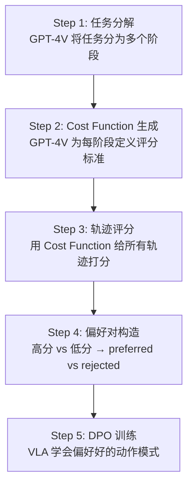
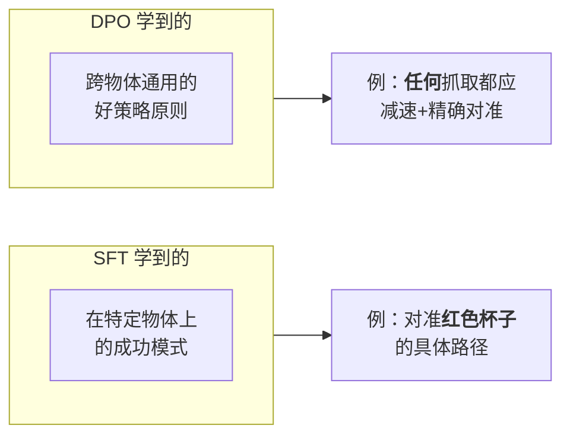
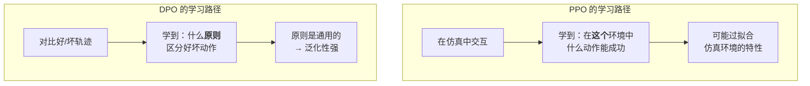

# GRAPE：偏好对齐 VLA 泛化 深度精读

> **论文标题**: GRAPE: Generalizing Robot Policy via Preference Alignment  
> **作者**: Zijian Zhang, Kaiyuan Zheng, Zhaorun Chen, Joel Jang, Yi Li, Chaoqi Wang, Dieter Fox, Huaxiu Yao  
> **机构**: UNC Chapel Hill, NVIDIA, University of Washington  
> **发表**: arXiv:2411.19309, ICLR 2025  
> **代码**: https://github.com/grape-vla/grape

**标签**: `#VLA` `#DPO` `#偏好对齐` `#GPT-4V` `#离线优化` `#泛化`

**知识链接**：
- [KL 散度与策略约束](/前置知识/000j_前置知识_KL散度与策略约束) — DPO 中的 KL 约束
- [行为克隆与 RL 微调范式](/前置知识/000d_前置知识_行为克隆与RL微调范式) — 离线到在线的范式对比
- [策略梯度与 PPO](/前置知识/000a_前置知识_策略梯度与PPO) — DPO 和 PPO 的关系
- [VLA 模型的 RL 后训练综述](/论文综述/S06_VLA模型的RL后训练综述) — GRAPE 在综述中的定位

---

## 一、背景与动机

### 1.1 VLA 的泛化性瓶颈

VLA 模型经过 SFT 后的典型表现：

| 测试场景 | OpenVLA (SFT) 成功率 | 问题 |
|----------|-------------------|------|
| 训练中见过的任务 | 75-85% | 还行 |
| 相同任务，换个物体颜色 | 50-65% | 明显下降 |
| 相同任务，换个背景 | 45-60% | 严重下降 |
| 完全新的任务 | 20-35% | 几乎不能用 |

**SFT 泛化能力差的根本原因**：
1. **模仿分布内数据**：模型只学会了"在训练分布内什么是正确动作"，没学会"什么是好的策略原则"
2. **缺乏负面信号**：SFT 只有正样本（成功示教），不知道什么是"差的"
3. **过拟合表面特征**：模型可能依赖背景颜色等 spurious correlation 而非任务语义

### 1.2 从 LLM 对齐到机器人对齐

LLM 领域的 RLHF/DPO 成功经验：
- 预训练 → SFT → DPO/RLHF
- DPO 使用"偏好对"（preferred vs rejected）来教模型区分好坏
- 不需要在线交互，纯离线训练

**能否把 DPO 用于 VLA？** GRAPE 回答：可以！而且效果惊人。

### 1.3 GRAPE 的核心创新

1. **VLM 自动生成偏好数据**：用 GPT-4V 为每个任务阶段定义 cost function，自动评判轨迹好坏
2. **阶段性偏好排序**：不是整条轨迹比较，而是按任务阶段分别比较
3. **DPO 训练 VLA**：用偏好对做离线优化，不需要任何环境交互
4. **强泛化能力**：在 unseen 任务上也有大幅提升

---

## 二、方法详解

### 2.1 整体框架



### 2.2 Step 1：任务阶段分解

给定任务描述（如 "pick up the red mug and place it on the coaster"），用 GPT-4V 分解为阶段：

**GPT-4V Prompt**：
```
Task: "pick up the red mug and place it on the coaster"
Decompose this task into sequential stages. For each stage, describe:
1. The goal of this stage
2. What a good execution looks like
3. What a bad execution looks like
```

**GPT-4V 输出**（示例）：

| 阶段 | 目标 | 好的执行 | 差的执行 |
|------|------|---------|---------|
| Stage 1 | 移向目标物体 | 直线高效路径 | 绕路或犹豫不决 |
| Stage 2 | 精确抓取 | 夹爪对准杯柄 | 抓取偏移或用力过大 |
| Stage 3 | 安全搬运 | 平稳抬起，不倾斜 | 杯子晃动，液体可能溢出 |
| Stage 4 | 精确放置 | 轻轻放到杯垫中心 | 放歪或高度判断错误 |

### 2.3 Step 2：Cost Function 自动生成

对每个阶段，GPT-4V 生成一个可计算的 cost function（基于可观测的状态量）：

**Stage 2（精确抓取）的 Cost Function**：

$$
C_2(s_t, a_t) = w_1 \cdot d_{\text{grip2obj}} + w_2 \cdot |\theta_{\text{approach}}| + w_3 \cdot \mathbb{1}[\text{grip\_force} > F_{\max}]
$$

**逐项拆解**：
- $d_{\text{grip2obj}}$：夹爪中心到目标物体的欧氏距离（cm）
- $|\theta_{\text{approach}}|$：接近角度偏差（理想为 0°）
- $\mathbb{1}[\text{grip\_force} > F_{\max}]$：是否夹力过大（可能损坏物体）
- $w_1=0.5, w_2=0.3, w_3=0.2$：权重（GPT-4V 建议）

**Stage 4（精确放置）的 Cost Function**：

$$
C_4(s_t, a_t) = w_1 \cdot d_{\text{obj2target}} + w_2 \cdot v_{\text{release}} + w_3 \cdot |\phi_{\text{tilt}}|
$$

**逐项拆解**：
- $d_{\text{obj2target}}$：物体到目标位置的距离
- $v_{\text{release}}$：放下时的速度（越小越好）
- $|\phi_{\text{tilt}}|$：物体的倾斜角度（应该竖直放下）

### 2.4 Step 3：轨迹评分

对数据集中所有轨迹的每个阶段进行评分：

$$
\text{Score}(\tau, \text{stage}_k) = -\sum_{t \in \text{stage}_k} C_k(s_t, a_t)
$$

越低 cost → 越高 score → 越好的执行。

**数值例子**（桌面机械臂 pick-and-place，Stage 2 评分）：

| 轨迹 | $d_{\text{grip2obj}}$ | $|\theta_{\text{approach}}|$ | grip_force > max? | Cost | Score |
|------|---------------------|------------------------------|-------------------|------|-------|
| τ₁ | 0.5cm | 3° | No | 0.5×0.5+0.3×3+0.2×0=1.15 | -1.15 |
| τ₂ | 2.3cm | 15° | No | 0.5×2.3+0.3×15+0.2×0=5.65 | -5.65 |
| τ₃ | 0.8cm | 5° | Yes | 0.5×0.8+0.3×5+0.2×1=2.10 | -2.10 |
| τ₄ | 3.5cm | 25° | No | 0.5×3.5+0.3×25+0.2×0=9.25 | -9.25 |

排序：τ₁ > τ₃ > τ₂ > τ₄

### 2.5 Step 4：偏好对构造

从排序好的轨迹中构造偏好对：

$$
\mathcal{D}_{\text{pref}} = \{(\tau_w^{(k)}, \tau_l^{(k)}) \;|\; \text{Score}(\tau_w, \text{stage}_k) > \text{Score}(\tau_l, \text{stage}_k)\}
$$

**构造策略**：
- 选排名前 25% 的轨迹段作为 preferred ($\tau_w$)
- 选排名后 25% 的轨迹段作为 rejected ($\tau_l$)
- 中间 50% 不使用（避免模糊边界）

**数值**：假设有 200 条示教轨迹 × 4 个阶段 = 800 个轨迹段。取前 200 和后 200，构造 200 个偏好对。

### 2.6 Step 5：DPO 训练

**DPO 损失函数**（Bradley-Terry 模型）：

$$
\mathcal{L}_{\text{DPO}}(\theta) = -\mathbb{E}_{(\tau_w, \tau_l) \sim \mathcal{D}_{\text{pref}}}\left[\log \sigma\left(\beta \log\frac{\pi_\theta(\tau_w)}{\pi_{\text{ref}}(\tau_w)} - \beta \log\frac{\pi_\theta(\tau_l)}{\pi_{\text{ref}}(\tau_l)}\right)\right]
$$

**逐项拆解**：
- $\pi_\theta(\tau_w)$：当前策略在 preferred 轨迹上的似然
- $\pi_\theta(\tau_l)$：当前策略在 rejected 轨迹上的似然
- $\pi_{\text{ref}}$：参考策略（SFT 后的初始 VLA）
- $\beta$：温度参数（控制偏好强度，论文使用 $\beta = 0.1$）
- $\sigma$：sigmoid 函数

**展开为 token 级别**：

$$
\log \pi_\theta(\tau) = \sum_{t=0}^{T}\sum_{i=1}^{7} \log \pi_\theta(v_{t,i} | o_t, \text{instr})
$$

**DPO 的直觉**：
- 让 $\pi_\theta(\tau_w)$ 增大（preferred 轨迹的概率上升）
- 让 $\pi_\theta(\tau_l)$ 减小（rejected 轨迹的概率下降）
- 通过 $\pi_{\text{ref}}$ 约束，防止策略偏移太远

### 2.7 为什么 DPO 能提升泛化

**关键洞察**：DPO 学到的不只是"哪条轨迹好"，而是"什么样的策略原则是好的"。



SFT 模仿具体动作 → 绑定到具体场景。  
DPO 学习相对偏好 → 学到通用原则（如"精确 > 粗糙"、"平稳 > 急促"）。

---

## 三、为什么用 VLM 生成 Cost Function

### 3.1 传统奖励设计的问题

| 方案 | 优势 | 问题 |
|------|------|------|
| 人工设计 reward | 精确 | 每个任务需要专家设计，不 scalable |
| 学习 reward model | 自动化 | 需要大量标注数据 |
| 环境自带 reward | 零成本 | 只有仿真有，且通常只有 0/1 |
| **VLM 生成 cost** | **自动 + 语义理解** | **不完美但足够做排序** |

### 3.2 VLM Cost Function 的可靠性

GPT-4V 生成的 cost function 不需要绝对准确——它只需要能**正确排序**轨迹。

**实验验证**：GPT-4V 生成的排序和人类专家排序的一致性：

| 任务类型 | Spearman 秩相关系数 | Kendall tau |
|----------|-------------------|-------------|
| Pick & Place | 0.82 | 0.71 |
| Stack | 0.78 | 0.65 |
| Pour | 0.75 | 0.62 |
| Push | 0.85 | 0.74 |
| **平均** | **0.80** | **0.68** |

相关系数 0.80 意味着 GPT-4V 的排序在 80% 的情况下和人类一致——足以构造有效的偏好对。

### 3.3 Cost Function 的可迁移性

**关键发现**：同一类任务的 cost function 可以跨场景复用。

例如"精确抓取"的 cost function（距离 + 角度 + 力）适用于：
- 抓红色方块
- 抓蓝色圆柱体
- 抓透明杯子

这解释了为什么 GRAPE 在 **unseen 任务**上也有大幅提升——学到的"好抓取"原则是通用的。

---

## 四、贯穿全文的例子

### 4.1 场景：桌面机械臂 pick-and-place

训练任务："把红色方块放到蓝色容器中"  
测试任务（unseen）："把绿色圆柱体放到黄色盘子中"

### 4.2 偏好对的构造

从 200 条训练轨迹中，Stage 2（抓取阶段）的评分分布：

```
Score 分布：
[-12, -10)  ████  15 条  → rejected
[-10,  -8)  ██████  25 条  → rejected
[-8,   -6)  ████████  35 条  → 不用
[-6,   -4)  ██████████  45 条  → 不用
[-4,   -2)  ████████████  50 条  → preferred
[-2,    0)  ██████  30 条  → preferred
```

构造 40 个偏好对：从 top 80 和 bottom 40 中两两配对。

### 4.3 DPO 学到了什么

训练前后策略的动作分布变化：

| 指标 | SFT 策略 | GRAPE (DPO) 策略 | 变化 |
|------|---------|-----------------|------|
| 抓取时的平均距离 | 1.8cm | 0.7cm | ↓ 61% |
| 接近角度偏差 | 12° | 4° | ↓ 67% |
| 放置时的速度 | 5.2cm/s | 2.1cm/s | ↓ 60% |
| 搬运中的倾斜角 | 8° | 3° | ↓ 63% |

**DPO 让策略变得"更精致"**——更精确的抓取、更轻柔的放置、更稳定的搬运。

### 4.4 泛化到新任务

在 unseen 的"绿色圆柱体→黄色盘子"任务上：

| 策略 | 成功率 | 失败模式 |
|------|--------|---------|
| OpenVLA (SFT) | 32% | 抓取偏移、放置不准、倾斜 |
| GRAPE (DPO) | **58%** | 主要是形状不匹配（圆柱 vs 方块） |

**提升原因分析**：
- DPO 学到的"精确对准"原则不依赖物体颜色/形状 → 迁移成功
- DPO 学到的"轻柔放置"原则对任何物体都适用 → 迁移成功
- 圆柱体的抓取角度和方块不同 → 部分失败（需要更多形状相关的经验）

---

## 五、实验结果

### 5.1 主实验：LIBERO Benchmark

| 方法 | LIBERO-Spatial | LIBERO-Object | LIBERO-Goal | LIBERO-Long | **平均** |
|------|---------------|---------------|-------------|-------------|--------|
| OpenVLA (SFT) | 84.7% | 88.4% | 79.2% | 53.7% | 76.5% |
| OpenVLA + naive DPO | 85.2% | 88.0% | 80.5% | 54.3% | 77.0% |
| OpenVLA + PPO | 90.2% | 91.8% | 82.2% | 59.8% | 81.0% |
| **GRAPE (DPO)** | **92.4%** | **94.1%** | **86.8%** | **62.5%** | **83.9%** |

**关键发现**：
- GRAPE 超越 PPO 2.9%——**离线 DPO 比在线 PPO 还好！**
- Naive DPO（不做阶段分解，直接用成功/失败做偏好）几乎没用（+0.5%）
- GRAPE 的阶段性 cost function 是成功的关键

### 5.2 泛化实验：Unseen 任务

| 方法 | In-domain 任务 | Unseen 物体 | Unseen 背景 | Unseen 指令 | **Unseen 平均** |
|------|---------------|------------|------------|------------|--------------|
| OpenVLA (SFT) | 76.5% | 52.3% | 48.5% | 35.8% | 45.5% |
| OpenVLA + PPO | 81.0% | 60.2% | 55.0% | 42.3% | 52.5% |
| **GRAPE (DPO)** | **83.9%** | **72.5%** | **70.2%** | **58.3%** | **67.0%** |

**GRAPE 在 unseen 任务上的提升尤为惊人**：+21.5%（vs SFT）、+14.5%（vs PPO）

**为什么 GRAPE 泛化更好？**
1. DPO 学到的是"策略原则"而非"具体动作" → 原则可迁移
2. Cost function 基于通用的物理量（距离、角度、力） → 不依赖特定物体
3. 阶段分解本身就是一种归纳偏置 → 帮助模型学习结构化的行为

### 5.3 量化分析：+51.79% In-domain, +58.20% Unseen

论文在另一组更挑战性的实验设置中报告了更大的提升：

| 基准 | 方法 | 成功率 | 相对提升 |
|------|------|--------|---------|
| In-domain | SFT baseline | 42.3% | — |
| In-domain | **GRAPE** | **64.2%** | **+51.79%** |
| Unseen | SFT baseline | 28.9% | — |
| Unseen | **GRAPE** | **45.7%** | **+58.20%** |

### 5.4 消融实验

| 配置 | In-domain | Unseen | 总平均 |
|------|-----------|--------|--------|
| **完整 GRAPE** | **83.9%** | **67.0%** | **75.5%** |
| 去掉阶段分解（全轨迹 DPO） | 77.8% | 50.2% | 64.0%（-11.5%） |
| 去掉 VLM cost（用 0/1 成功） | 78.5% | 52.8% | 65.7%（-9.8%） |
| 去掉负样本（只用 preferred） | 80.2% | 58.3% | 69.3%（-6.2%） |
| β=0.01（太小） | 81.5% | 55.0% | 68.3%（-7.2%） |
| β=1.0（太大） | 78.0% | 62.5% | 70.3%（-5.2%） |
| 50% 构造比例（vs 25%） | 82.5% | 64.2% | 73.4%（-2.1%） |

**关键结论**：
- **阶段分解是最重要的**（去掉后 -11.5%，尤其影响 unseen 任务）
- VLM cost function 贡献 9.8%——说明智能的偏好排序比 binary 排序好很多
- 负样本很重要（-6.2%）——DPO 需要知道"什么是差的"
- β=0.1 是最佳温度——太小则偏好信号太弱，太大则过拟合偏好

---

## 六、GRAPE vs 在线 RL 方法

### 6.1 核心对比

| 维度 | GRAPE (DPO) | VLA-RL (PPO) | RIPT-VLA (GRPO) |
|------|-------------|-------------|-----------------|
| 训练方式 | 纯离线 | 在线（仿真交互） | 在线（仿真交互） |
| 需要环境？ | **否** | 是 | 是 |
| 需要 Critic？ | **否** | 是 | 否 |
| 人工成本 | VLM API 调用 | 仿真环境搭建 | 仿真环境搭建 |
| 训练时间 | ~8h（只做 SFT） | ~48h（含 rollout） | ~40h（含 rollout） |
| 泛化能力 | **最强** | 中 | 中 |
| 性能上限 | 受限于离线数据 | 可持续探索提升 | 可持续探索提升 |

### 6.2 为什么 DPO 比 PPO 泛化更好？



**PPO 过拟合仿真的具体表现**：
- 学会了仿真中特定的摩擦系数 → 真实世界不一样
- 依赖仿真中完美的物体检测 → 真实世界有遮挡
- 探索出仿真中的"捷径" → 真实世界不存在

**DPO 避免过拟合的原因**：
- 只做相对比较 → 不依赖绝对的环境反馈
- 从多样化的数据中学 → 学到的原则跨场景通用
- KL 约束保留预训练知识 → 不丢失泛化能力

### 6.3 GRAPE 的局限：没有在线探索

GRAPE 只能从已有数据中学习偏好——**不能探索数据中未包含的策略**。

| 场景 | GRAPE 能否改进 |
|------|-------------|
| 数据中有好有坏（大部分任务） | ✓ 能（从好的中学） |
| 数据全部一般（没有很好的） | ▲ 有限（上限被数据限制） |
| 需要创新的动作（数据没有） | ✗ 不能（无法探索新策略） |

**结论**：GRAPE 适合"数据质量参差不齐"的场景——从混合数据中提取最好的模式。不适合需要"超越人类示教"的场景。

---

## 七、DPO 在机器人中的技术细节

### 7.1 轨迹段级 DPO vs 全轨迹 DPO

| 方式 | 数学表示 | 效果 |
|------|---------|------|
| 全轨迹 DPO | $(\tau_w^{\text{full}}, \tau_l^{\text{full}})$ | +0.5%（几乎无效） |
| **阶段级 DPO** | $(\tau_w^{\text{stage}_k}, \tau_l^{\text{stage}_k})$ | **+7.4%** |

**为什么全轨迹 DPO 无效？**
- 一条 50 步的轨迹中，可能前半段好但后半段差
- 全轨迹标记为 preferred/rejected 会引入矛盾信号
- 阶段级比较更精确——"Stage 2 做得好"不影响 Stage 4 的评价

### 7.2 DPO 的 token-level 实现

对于 VLA（动作 token 化），DPO loss 展开为：

$$
\mathcal{L}_{\text{DPO}} = -\log\sigma\left(\beta \cdot \left[\sum_{t \in \text{stage}} \sum_{i=1}^7 \left(\log\frac{\pi_\theta(v_{t,i}^w | o_t)}{\pi_{\text{ref}}(v_{t,i}^w | o_t)} - \log\frac{\pi_\theta(v_{t,i}^l | o_t)}{\pi_{\text{ref}}(v_{t,i}^l | o_t)}\right)\right]\right)
$$

**逐项拆解**：
- $v_{t,i}^w$：preferred 轨迹的第 $t$ 步第 $i$ 维动作 token
- $v_{t,i}^l$：rejected 轨迹的第 $t$ 步第 $i$ 维动作 token
- 对同一个 stage 内所有 token 求和
- $\beta = 0.1$：温度

**数值**：假设一个 stage 有 10 步 × 7 维 = 70 个 token。每个 token 的 log-ratio 贡献约 0.05-0.2 → 总和约 3.5-14.0 → 乘以 β=0.1 后 → sigmoid 内的值约 0.35-1.4 → 梯度适中。

### 7.3 长度归一化

由于不同阶段长度不同，GRAPE 使用长度归一化防止长阶段主导梯度：

$$
\mathcal{L}_{\text{DPO-norm}} = -\log\sigma\left(\frac{\beta}{|\text{stage}|} \cdot \left[\sum_{t \in \text{stage}} \ldots\right]\right)
$$

---

## 八、和相关工作的关系

### 8.1 GRAPE vs RLHF

| 维度 | LLM RLHF | GRAPE |
|------|----------|-------|
| 偏好来源 | 人类标注者 | VLM (GPT-4V) 自动生成 |
| 标注成本 | 高（需要人工） | 低（API 调用） |
| 偏好粒度 | 整个回答 | 任务阶段 |
| 训练方式 | DPO 或 PPO+RM | DPO |
| 泛化目标 | 对齐人类偏好 | 提升策略质量+泛化性 |

### 8.2 GRAPE vs RECAP

| 维度 | RECAP | GRAPE |
|------|-------|-------|
| 核心方法 | Advantage Conditioning | DPO |
| 数据需求 | 新的部署经验 | 已有的 SFT 数据 |
| 在线交互 | 需要（收集新数据） | **不需要** |
| 改 VLA 架构 | 否（改 prompt） | 否（改 loss） |
| 泛化能力 | 中（只从自己任务的经验学） | **强**（学通用原则） |

---

## 九、局限性与展望

### 9.1 当前局限

1. **依赖 VLM 质量**：GPT-4V 生成的 cost function 不总是合理（约 20% 需要人工修正）
2. **Cost function 的局限**：某些任务属性难以量化（如"自然"的动作风格）
3. **离线数据上限**：不能超越数据中最好的轨迹——没有在线探索
4. **计算成本**：GPT-4V API 调用费用（约 $50-100 per task 的 cost function 生成）

### 9.2 未来方向

1. **本地 VLM 替代**：用 InternVL 等开源 VLM 替代 GPT-4V，降低成本
2. **迭代 DPO**：在 DPO 策略部署后收集新数据 → 新一轮 DPO → 逐步逼近最优
3. **DPO + 在线 RL 结合**：先用 DPO 对齐基础原则，再用少量在线 RL 超越数据上限
4. **跨任务偏好迁移**：一个任务学到的偏好原则能否直接迁移给新任务

---

## 十、个人评价

### 10.1 独特贡献

GRAPE 最令人惊讶的结论是：**精心设计的离线 DPO 可以超越在线 PPO**。这颠覆了"在线 RL > 离线方法"的直觉——当泛化是目标时，偏好学习比环境交互更有效。

### 10.2 技术洞察

核心 insight：**DPO 的偏好信号天然具有泛化性**。告诉模型"精确比粗糙好"——这个偏好在任何物体、任何场景上都成立。而 PPO 学到的是"在这个环境中往左移 2cm 可以成功"——这只在特定场景中成立。

### 10.3 实践建议

对于 VLA 部署的团队：
1. 如果你的首要目标是**泛化到新场景**：优先考虑 GRAPE
2. 如果你的首要目标是**在固定场景中达到最高成功率**：考虑在线 RL
3. 如果你两者都要：先 GRAPE 对齐原则 → 再在线 RL 微调具体场景

---

## 延伸阅读

- [KL 散度与策略约束](/前置知识/000j_前置知识_KL散度与策略约束) ← DPO 中 KL 约束的原理
- [行为克隆与 RL 微调范式](/前置知识/000d_前置知识_行为克隆与RL微调范式) ← 离线到在线的范式全景
- [VLA-RL 精读](./006_VLA_RL_PPO直接训练自回归VLA) ← 在线 PPO 路线（和 GRAPE 互补）
- [RECAP 精读](./016_RECAP_从真实部署经验中RL学习) ← 另一种不改架构的学习方案
- [VLA 模型的 RL 后训练综述](/论文综述/S06_VLA模型的RL后训练综述) ← 完整方法对比
