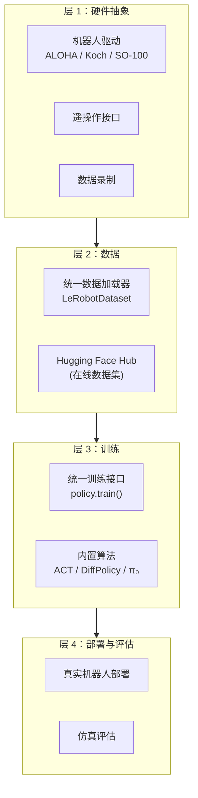

# LeRobot：Hugging Face 的开源端到端机器人学习库 深度精读

> **论文标题**: LeRobot: An Open-Source Library for End-to-End Robot Learning  
> **作者**: Rémi Cadène, Simon Music, Quentin Gallouédec 等 (Hugging Face Robotics Team)  
> **机构**: Hugging Face  
> **发表**: arXiv:2602.22818, 2025  
> **代码**: https://github.com/huggingface/lerobot

**标签**: `#开源工具` `#机器人学习` `#数据集` `#模型库` `#Hugging Face` `#LeRobot`

**知识链接**：
- [Octo：开源通用策略](./012_Octo_开源通用机器人策略) — LeRobot 集成的预训练模型之一
- [DROID：大规模数据集](./013_DROID_大规模真实世界操作数据集) — LeRobot 托管的数据集
- [Diffusion Policy](/前置知识/000c_前置知识_Diffusion_Policy) — LeRobot 内置的策略算法

---

## 一、背景与动机

### 1.1 机器人学习的"碎片化"问题

2024 年的机器人学习领域面临严重的碎片化：

| 问题 | 表现 |
|------|------|
| 代码碎片 | 每篇论文自己的 repo，风格各异，依赖冲突 |
| 数据碎片 | 每个数据集格式不同（HDF5/TFRecord/pickle...） |
| 模型碎片 | 权重散落各处，加载方式不统一 |
| 硬件碎片 | 每种机器人的驱动和接口都不同 |

一个研究生想复现三篇论文的方法对比，可能需要花一周配环境。

### 1.2 LeRobot 的定位

LeRobot 要做**机器人学习的 Hugging Face Transformers**——一个统一的库，覆盖从数据采集到模型训练到部署的全链路：

> **一条命令加载数据集，一条命令训练模型，一条命令部署到真实机器人。**

### 1.3 核心贡献

1. **统一数据格式**：所有数据集转为 LeRobot 格式，支持版本控制和在线预览
2. **算法集成**：ACT、Diffusion Policy、TDMPC、π₀ 等 SOTA 方法统一接口
3. **硬件集成**：支持 ALOHA、Koch、SO-100 等低成本平台的端到端流程
4. **社区生态**：Hugging Face Hub 上已有数千个机器人数据集共享

---

## 二、系统架构

### 2.1 四层设计



### 2.2 统一数据格式

LeRobot 数据格式的核心设计：

```python
# 加载任意机器人数据集
dataset = LeRobotDataset("lerobot/aloha_sim_transfer_cube_human")

# 统一的访问接口
sample = dataset[0]
# sample["observation.images.top"]  → 图像 tensor
# sample["observation.state"]       → 关节状态
# sample["action"]                  → 动作
# sample["language_instruction"]    → 语言指令（如有）
```

关键特性：
- **Parquet 格式**：数值数据用 Parquet 存储，支持列式查询
- **视频压缩**：图像以 MP4 视频存储，节省 5-10x 空间
- **版本控制**：通过 Hugging Face Hub 的 Git LFS 管理
- **在线预览**：网页上直接可视化轨迹

### 2.3 内置算法

LeRobot 集成了主流的模仿学习算法，统一的训练接口：

| 算法 | 原理 | 适用场景 |
|------|------|---------|
| ACT | CVAE + Transformer | 双臂精细操作 |
| Diffusion Policy | DDPM 扩散去噪 | 通用操作 |
| TDMPC2 | Model-based + 规划 | 需要长期规划的任务 |
| π₀ | VLM + Flow Matching | 语言条件操作 |
| VQ-BeT | VQ-VAE + Transformer | 离散动作场景 |

```python
# 训练一个 Diffusion Policy
python lerobot/scripts/train.py \
    policy=diffusion \
    dataset_repo_id=lerobot/aloha_sim_transfer_cube_human
```

### 2.4 硬件支持

LeRobot 原生支持多种低成本硬件平台：

| 平台 | 价格 | 自由度 | 特点 |
|------|------|--------|------|
| Koch v1.1 | ~$500 | 6DOF 单臂 | 最便宜的入门方案 |
| SO-100 | ~$200 | 5DOF 单臂 | 极低成本 |
| ALOHA (开源版) | ~$20k | 12DOF 双臂 | 高性能双臂 |
| Moss v1 | ~$800 | 6DOF + 移动底盘 | 移动操作 |

配套的端到端流程：
1. **遥操作采集**：`python lerobot/scripts/control_robot.py record`
2. **训练策略**：`python lerobot/scripts/train.py`
3. **部署评估**：`python lerobot/scripts/control_robot.py replay`

---

## 三、数据生态

### 3.1 Hub 上的数据集

截至 2025 年中，Hugging Face Hub 上已有数千个 LeRobot 格式的数据集：

- **大规模**：DROID (76k 轨迹), Open X-Embodiment (部分转换)
- **社区贡献**：全球用户在各自平台上采集并分享
- **仿真数据**：RoboCasa, LIBERO 等仿真环境的数据

### 3.2 数据工具

- **可视化**：`python lerobot/scripts/visualize_dataset.py` 在网页查看轨迹
- **统计**：自动计算动作分布、轨迹长度、成功率等
- **转换**：从 HDF5、TFRecord、pickle 等格式转为 LeRobot 格式
- **过滤**：按成功率、任务类型、语言指令等筛选子集

---

## 四、核心设计理念

### 4.1 可复现性

LeRobot 的每次训练都记录完整的配置和随机种子：

```yaml
# 自动保存的训练配置
policy: diffusion
dataset: lerobot/aloha_sim_transfer_cube_human
seed: 42
batch_size: 64
lr: 1e-4
num_epochs: 100
```

论文中报告的结果可以通过同一配置文件精确复现。

### 4.2 模块化

每个组件都可以独立使用：
- 只想用数据加载器？`from lerobot.common.datasets import LeRobotDataset`
- 只想用某个策略？`from lerobot.common.policies import DiffusionPolicy`
- 只想做遥操作？`from lerobot.common.robot_devices import make_robot`

### 4.3 社区优先

LeRobot 的设计鼓励社区贡献：
- 上传数据集：`huggingface-cli upload` 一行命令
- 贡献新算法：实现 `Policy` 接口即可集成
- 支持新硬件：实现 `Robot` 接口即可

---

## 五、对机器人研究的影响

### 5.1 降低入门门槛

之前：买了一个机械臂 → 写驱动 → 写数据采集代码 → 实现训练 pipeline → 调试部署 → 花了一个月还没跑通

现在：买了一个 Koch 臂 → 装 LeRobot → 录 50 条数据 → 训练 → 部署。一天搞定。

### 5.2 加速研究迭代

统一接口让对比实验变得简单：

```bash
# 对比三种算法
python train.py policy=act
python train.py policy=diffusion  
python train.py policy=tdmpc
```

同样的数据、同样的评估流程，公平对比。

### 5.3 数据飞轮效应

越多人用 LeRobot → 越多人往 Hub 上传数据 → 数据越多预训练越好 → 越多人用 LeRobot。

这是 Hugging Face 在 NLP 领域验证过的飞轮效应，现在正在机器人领域复制。

---

## 六、总结

| 维度 | 贡献 |
|------|------|
| 工具统一 | 第一个覆盖全链路的机器人学习库 |
| 数据标准化 | 统一格式 + Hub 共享，解决碎片化 |
| 降低门槛 | 从"一个月"到"一天"部署策略 |
| 社区建设 | 建立了机器人数据的开放共享文化 |
| 生态意义 | 机器人领域的 Transformers 库 |

LeRobot 的意义不仅是一个库，更是一种范式：**开放、共享、可复现的机器人研究方式**。

---

## 延伸阅读

- [Octo：开源通用策略](./012_Octo_开源通用机器人策略) — LeRobot 集成的预训练模型
- [DROID：大规模数据集](./013_DROID_大规模真实世界操作数据集) — Hub 上的重要数据集
- [Diffusion Policy](/前置知识/000c_前置知识_Diffusion_Policy) — LeRobot 内置的经典算法
- [π₀：通用基础模型](./014_Pi0_通用机器人基础模型) — LeRobot 集成的最新模型
