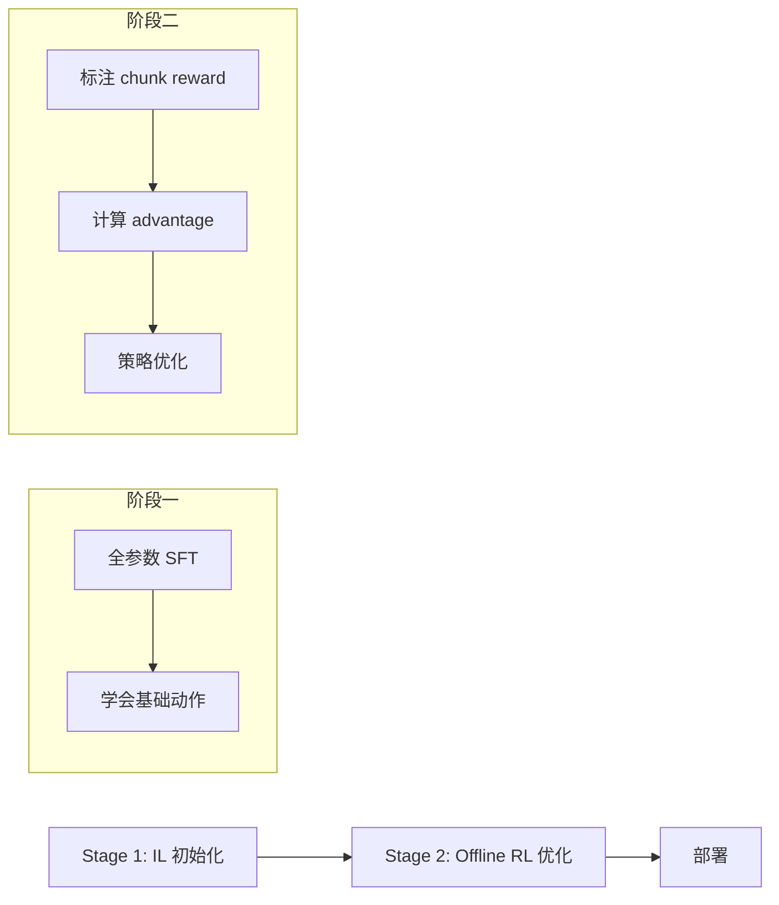

# CO-RFT：离线分块 RL 微调 VLA 深度精读

> **论文标题**: Efficient Fine-Tuning of Vision-Language-Action Models through Chunked Offline Reinforcement Learning  
> **作者**: Fanqi Lin, Yixiao Wang, Yichen Zhu, et al.  
> **机构**: Shanghai Jiao Tong University, Midea Group  
> **发表**: arXiv:2508.02219, 2025  
> **代码**: https://github.com/OpenDriveLab/CO-RFT

**标签**: `#VLA` `#强化学习` `#离线RL` `#ActionChunking` `#轻量微调` `#数据高效`

**知识链接**：
- [策略梯度与 PPO](/前置知识/000a_前置知识_策略梯度与PPO) — 对比：在线 RL 方法
- [行为克隆与 RL 微调范式](/前置知识/000d_前置知识_行为克隆与RL微调范式) — SFT → RL 的基本范式
- [Replay Buffer](/前置知识/000r_前置知识_Replay_Buffer_经验回放) — 离线 RL 数据存储
- [动作 Token 化与自回归策略](/前置知识/000l_前置知识_动作Token化与自回归策略) — VLA 动作表示
- [离线强化学习基础](/前置知识/000s_前置知识_离线强化学习基础) — Offline RL 核心概念
- [VLA 模型的 RL 后训练综述](/论文综述/S06_VLA模型的RL后训练综述) — VLA + RL 全景图
- [BootRL 精读](./013_BootRL_冻结VLA加RL_Head) — 对比：另一种轻量 RL 路线
- [TGRPO 精读](./019_TGRPO_轨迹级GRPO微调VLA) — 对比：轨迹级在线方法

---

## 一、背景与动机

### 1.1 在线 RL 微调 VLA 的代价

现有 VLA RL 后训练方法（VLA-RL、RIPT-VLA、SimpleVLA-RL）都依赖**在线交互**——需要在仿真环境中不断 rollout 收集新数据。这带来三个问题：

| 问题 | 具体表现 | 后果 |
|------|---------|------|
| 仿真器依赖 | 需要高保真的物理仿真环境 | 很多真实任务无法建模 |
| 采样成本 | 每次梯度更新需要数百条轨迹 | GPU/仿真时间巨大 |
| 真实部署风险 | 在真实环境在线探索可能损坏设备 | 安全隐患 |

**关键问题**：能否只用少量离线示教数据（30-60 条轨迹）就完成 VLA 的 RL 微调？

### 1.2 CO-RFT 的核心思路

CO-RFT 提出了一种**离线**RL 微调方案，核心创新有两点：

1. **Chunked RL**：将动作分块（chunk），在 chunk 级别计算 advantage 和更新策略，避免逐 token 的稀疏奖励问题
2. **Offline + 少量数据**：只需 30-60 条示教轨迹，无需仿真环境在线交互

**类比**：传统在线 RL 像让学生不断在考场上实战练习（耗时且有风险），CO-RFT 像让学生反复研究 30-60 份高质量范文，通过"模拟对比"来找到更好的写作策略。

---

## 贯穿全文的例子

> **场景**：一个基于 OpenVLA 的 7B VLA 模型，需要在真实桌面机器人上完成 "pick up the cup and place it on the plate" 任务。
>
> - **可用数据**：50 条人类示教轨迹（每条约 200 步）
> - **约束**：没有仿真环境，不能在线交互
> - **动作分块**：每 4 步为一个 chunk，共约 50 个 chunk/轨迹
> - **目标**：只用这 50 条轨迹，让成功率从 60% 提升到 85%+

---

## 二、方法详解

### 2.1 两阶段框架

CO-RFT 分为两个阶段：

**阶段一：IL 初始化**

用全参数微调（Full Fine-Tuning）在示教数据上做模仿学习，让 VLA 模型学会基础的任务执行能力。这一步和标准 SFT 一样。

**阶段二：Chunked Offline RL**

在同一批示教数据上，通过 Offline RL 的方式进一步优化策略。关键在于如何在没有新交互的情况下构造 RL 信号。

### 2.2 Action Chunking：为什么要分块

传统自回归 VLA 逐 token 生成动作，一个 7-DoF 动作有 7 个 token。但奖励通常是 episode 级别的（成功/失败），如果逐 token 做 RL：

$$
\text{信用分配问题：200 步} \times 7 \text{ token/步} = 1400 \text{ 个 token，只有 1 个奖励}
$$

CO-RFT 将连续的 $k$ 步动作打包为一个 **action chunk**：

$$
c_i = (a_{ik}, a_{ik+1}, \ldots, a_{ik+k-1})
$$

**一句话**：把 $k$ 步动作视为一个整体来评估和优化，减少信用分配的难度。

**代入数字**：$k=4$，一条 200 步轨迹被分为 50 个 chunk。这样 RL 只需在 50 个决策点上做信用分配，而非 1400 个 token。

### 2.3 Chunk-Level Reward 标注

对每个 chunk $c_i$，CO-RFT 通过以下方式估计其"好坏"：

$$
R(c_i) = \gamma^{T-ik} \cdot R_{\text{final}} + \sum_{j=0}^{k-1} r_{\text{shaping}}(s_{ik+j}, a_{ik+j})
$$

**逐项拆解**：
- $R_{\text{final}}$ — 最终奖励（成功=1，失败=0）
- $\gamma^{T-ik}$ — 折扣因子，离终点越远折扣越大
- $r_{\text{shaping}}$ — 奖励塑形项（如末端距目标物体的距离变化）

**代入数字**：假设 $\gamma=0.99$，第 10 个 chunk（$i=10, k=4$，即第 40 步），最终成功：
- 折扣项：$0.99^{200-40} = 0.99^{160} \approx 0.20$
- 距离奖励项：假设这一 chunk 让末端靠近目标 2cm，$r_{\text{shaping}} = 0.02 \times 4 = 0.08$
- 总 chunk reward：$R(c_{10}) = 0.20 + 0.08 = 0.28$

### 2.4 Offline 策略优化

有了 chunk-level 的 reward 后，CO-RFT 使用 **Advantage Weighted Regression (AWR)** 风格的目标函数：

$$
\mathcal{L}_{\text{CO-RFT}} = -\mathbb{E}_{c \sim \mathcal{D}} \left[ \exp\left(\frac{A(c)}{\beta}\right) \cdot \log \pi_\theta(c | s) \right]
$$

**一句话**：对"好 chunk"（高 advantage）加大模仿力度，对"差 chunk"降低模仿力度。

**逐项拆解**：
- $A(c) = R(c) - V(s)$ — chunk 的优势，正值表示比平均好
- $\beta$ — 温度系数，控制 advantage 对权重的影响力度
- $\log \pi_\theta(c|s)$ — 策略在状态 $s$ 下生成 chunk $c$ 的对数概率
- $\exp(A/\beta)$ — 将 advantage 转化为非负权重

**为什么用 AWR 而不是 PPO**：AWR 是纯离线方法，不需要环境交互。它本质上是"加权模仿学习"——对好动作模仿更多，对差动作模仿更少。

**代入数字**：假设 $\beta=0.1$，两个 chunk：
- Chunk A：$A=+0.5$，权重 $= \exp(0.5/0.1) = e^5 \approx 148$
- Chunk B：$A=-0.3$，权重 $= \exp(-0.3/0.1) = e^{-3} \approx 0.05$

Chunk A 的训练权重是 Chunk B 的约 3000 倍！好动作会被大力强化。

### 2.5 与在线方法的关键区别

| 维度 | CO-RFT（离线） | VLA-RL / SimpleVLA-RL（在线） |
|------|---------------|------------------------------|
| 环境交互 | ❌ 不需要 | ✅ 必须 |
| 数据需求 | 30-60 条轨迹 | 数千条 rollout |
| 计算成本 | 低（纯监督学习式训练） | 高（需要并行 rollout） |
| 探索能力 | ❌ 无法发现新策略 | ✅ 可以发现新策略 |
| 安全性 | ✅ 纯离线，零风险 | ⚠️ 在线探索有风险 |

---

## 三、实验结果

### 3.1 真实世界实验

在真实机器人上的结果（6 个桌面任务）：

| 方法 | 数据量 | 成功率 | 周期时间 |
|------|--------|--------|---------|
| SFT (baseline) | 50 demos | 43% | 12.3s |
| CO-RFT | 50 demos | 67.5% (+57%) | 9.6s (-22%) |
| Online RL (VLA-RL) | 50 demos + 2000 rollouts | 71% | 10.1s |

**核心发现**：CO-RFT 在不需要任何在线交互的情况下，接近了在线 RL 的性能，同时训练成本远低。

### 3.2 Chunk 大小的影响

| Chunk size $k$ | 成功率 | 训练稳定性 |
|---------------|--------|-----------|
| 1（逐步） | 52% | 差（稀疏奖励） |
| 4 | **67.5%** | **好** |
| 8 | 63% | 中等 |
| 16 | 58% | 一般（chunk 太粗） |

最佳 chunk size $k=4$ — 平衡了信用分配精度和奖励密度。

---

## 四、方法局限与讨论

1. **无法超越示教质量**：纯离线方法只能从已有数据中"挑选最优片段"，无法发现数据中没有的新策略
2. **依赖 reward shaping**：chunk reward 的构造需要任务相关的 shaping 函数，不是完全通用的
3. **最适合"已经接近成功"的模型**：如果 SFT 后的策略太差（<30% 成功率），数据中"好 chunk"太少，AWR 可能失效

---

## 五、总结

| 维度 | CO-RFT |
|------|--------|
| 核心创新 | Chunk 级 Offline RL，30-60 条数据即可微调 |
| RL 算法 | AWR（加权回归） |
| 训练代价 | 极低（无需仿真，无需在线交互） |
| 性能提升 | +57% 成功率，-22% 周期时间 |
| 适用场景 | 真实机器人、无仿真环境、数据稀缺 |
| 主要限制 | 无法超越数据上界 |

---

## 延伸阅读

- [TGRPO：轨迹级 GRPO 微调 VLA](./019_TGRPO_轨迹级GRPO微调VLA) — 另一种 chunk 级 RL 方法，但是在线的
- [BootRL：冻结 VLA 加 RL Head](./013_BootRL_冻结VLA加RL_Head) — 另一种低成本 RL 路线
- [SimpleVLA-RL：可扩展 VLA RL 训练](./012_SimpleVLA_RL_可扩展VLA_RL训练) — 在线 RL 的标杆
