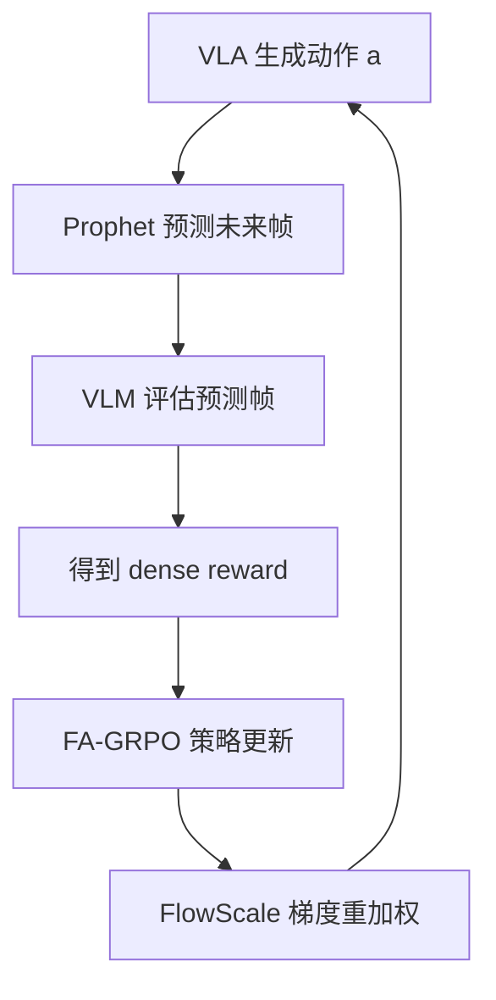

# ProphRL：预测式奖励驱动的 VLA 后训练深度精读

> **论文标题**: Reinforcing Action Policies by Prophesying  
> **作者**: Zhihao Wang, Jianxiong Li, et al.  
> **机构**: Tsinghua University, Shanghai AI Lab  
> **发表**: arXiv:2511.20633, 2025  
> **代码**: https://github.com/thu-ml/ProphRL

**标签**: `#VLA` `#强化学习` `#GRPO` `#FlowMatching` `#Prophet` `#轻量高效` `#奖励模型`

**知识链接**：
- [GRPO](/前置知识/000m_前置知识_GRPO_Group_Relative_Policy_Optimization) — Group Relative Policy Optimization
- [Flow Matching 与连续归一化流](/前置知识/000g_前置知识_Flow_Matching与连续归一化流) — Flow-based VLA 的生成框架
- [Process Reward Model](/前置知识/000n_前置知识_Process_Reward_Model) — 过程奖励模型
- [策略梯度与 PPO](/前置知识/000a_前置知识_策略梯度与PPO) — 对比：PPO 方法
- [KL 散度与策略约束](/前置知识/000j_前置知识_KL散度与策略约束) — 策略约束机制
- [VLA 模型的 RL 后训练综述](/论文综述/S06_VLA模型的RL后训练综述) — 全景概览
- [FlowRL 精读](./018_FlowRL_Flow_VLA的在线RL微调) — 对比：另一种 Flow VLA RL 方法

---

## 一、背景与动机

### 1.1 VLA 后训练的效率困境

现有 VLA RL 后训练方法的核心瓶颈是**采样效率**：

- PPO 方法（VLA-RL）：需要数千条在线 rollout，每条需要物理仿真执行
- GRPO 方法（TGRPO）：需要每个 prompt 采样多条轨迹做组内排序
- 奖励稀疏：机器人任务只有最终的 success/fail，中间无信号

**关键洞察**：如果我们能**预测**一个动作执行后环境会变成什么样（不需要真的执行），就可以极大加速奖励评估。

### 1.2 ProphRL 的三大组件

ProphRL 由三个互相配合的组件构成：

1. **Prophet**（预言者）：一个视频预测模型，预测当前动作执行后的未来帧
2. **FA-GRPO**（Flow-Action GRPO）：将 GRPO 适配到 Flow-based VLA 的动作空间
3. **FlowScale**：对 flow matching 各 denoising step 的梯度做重新加权

---

## 贯穿全文的例子

> **场景**：一个基于 π₀ 的 Flow-based VLA 模型（3B 参数），需要完成 "put the red block into the blue bowl"。
>
> - **Prophet 的作用**：执行动作 $a$ 前，先预测"如果执行 $a$，3 帧后画面会是什么样"
> - **VLM 评分**：用一个 VLM 对预测画面打分（"红块是否在碗里？0-1"）
> - **好处**：一次 forward pass（~0.1s）就能得到奖励信号，不需要等物理仿真（~5s/rollout）
> - **目标**：用 200 步 RL 训练将成功率从 60% 提升到 85%+

---

## 二、方法详解

### 2.1 Prophet：动作效果预测器

Prophet 是一个轻量视频预测模型，给定当前观测 $o_t$ 和动作 $a_t$，预测未来 $k$ 帧：

$$
\hat{o}_{t+1}, \hat{o}_{t+2}, \ldots, \hat{o}_{t+k} = \text{Prophet}(o_t, a_t)
$$

**为什么需要它**：
- 物理仿真太慢（一条轨迹需要 5-30 秒）
- Prophet 是纯 neural network 推理（~100ms）
- 可以并行预测多个动作的效果 → 加速采样

**训练方式**：在已有的示教数据上，用 $(o_t, a_t) \to o_{t+1:t+k}$ 对来训练。模型架构可以是简单的 U-Net 或 DiT。

### 2.2 FA-GRPO：将 GRPO 适配到 Flow 动作空间

标准 [GRPO](/前置知识/000m_前置知识_GRPO_Group_Relative_Policy_Optimization) 是为离散 token 设计的。但 Flow-based VLA（如 π₀）的动作是**连续向量**，通过 flow matching 生成。

FA-GRPO 的适配方式：

**Step 1**：对同一个观测 $o$，采样 $G$ 组动作（通过不同的 flow noise）：

$$
\{a^{(1)}, a^{(2)}, \ldots, a^{(G)}\} \sim \pi_\theta(\cdot | o)
$$

**Step 2**：用 Prophet + VLM 对每个动作快速评分：

$$
r^{(i)} = \text{VLM}(\text{Prophet}(o, a^{(i)}))
$$

**Step 3**：组内相对排序计算 advantage：

$$
A^{(i)} = \frac{r^{(i)} - \text{mean}(\{r^{(j)}\})}{\text{std}(\{r^{(j)}\})}
$$

**Step 4**：用 advantage 加权更新 flow matching loss：

$$
\mathcal{L}_{\text{FA-GRPO}} = -\mathbb{E}\left[ A^{(i)} \cdot \nabla_\theta \log p_\theta(a^{(i)} | o) \right]
$$

**代入数字**：$G=8$ 组动作，奖励分别为 $[0.2, 0.5, 0.8, 0.3, 0.9, 0.1, 0.6, 0.4]$：
- mean = 0.475, std = 0.27
- 最好的动作（$r=0.9$）：$A = (0.9-0.475)/0.27 = +1.57$
- 最差的动作（$r=0.1$）：$A = (0.1-0.475)/0.27 = -1.39$

好动作得到强正梯度，差动作得到强负梯度。

### 2.3 FlowScale：分步梯度重加权

Flow matching 生成动作时有 $N$ 个 denoising step。不同 step 对最终动作质量的贡献不同——早期 step 决定大方向，后期 step 决定精度。

FlowScale 为每个 step $n$ 分配不同的梯度权重：

$$
w_n = \frac{\|v_\theta(x_n, n) - v_{\text{target}}\|^2}{\sum_{m=1}^N \|v_\theta(x_m, m) - v_{\text{target}}\|^2}
$$

**一句话**：误差越大的 step 获得越大的梯度权重——把优化资源集中在"最需要改进的地方"。

---

## 三、实验结果

### 3.1 主要结果（LIBERO 基准）

| 方法 | RL 步数 | 成功率提升 | 计算成本 |
|------|---------|-----------|---------|
| SFT baseline | - | 48.9% | - |
| GRPO (标准) | 500 | +8% | 100% |
| FlowRL | 500 | +12% | 150% |
| **ProphRL** | **200** | **+17%** | **60%** |

### 3.2 真实机器人实验

| 场景 | SFT | ProphRL | 提升 |
|------|-----|---------|------|
| 抓取放置 | 60% | 84% | +24% |
| 开抽屉 | 55% | 85% | +30% |

**核心优势**：仅需 200 步 RL 训练（约 30 分钟），其他方法需要 500-1000 步。

### 3.3 Prophet 的加速效果

| 奖励评估方式 | 单条评估时间 | 8 组并行时间 |
|-------------|------------|-------------|
| 物理仿真 | 5s | 40s |
| Prophet + VLM | 0.3s | 0.5s |

加速 **80 倍**。这是 ProphRL 能用 200 步就收敛的关键。

---

## 四、核心优势与局限

### 优势

1. **极低训练成本**：200 步 RL 即收敛，比 VLA-RL 快 5 倍
2. **不依赖物理仿真**：Prophet 替代环境执行，可用于无仿真场景
3. **兼容多种 VLA**：适用于 Flow-based（π₀）和 Autoregressive（OpenVLA）

### 局限

1. **Prophet 的准确性**：预测帧不完美，可能导致错误的奖励信号
2. **短视**：只预测几帧，对需要长期规划的任务可能不够
3. **VLM 评分器偏差**：VLM 的判断可能与真实任务成功不完全对齐

---

## 五、总结

| 维度 | ProphRL |
|------|---------|
| 核心创新 | Prophet 预测代替环境交互 + FA-GRPO 适配 Flow VLA |
| RL 算法 | FA-GRPO（Flow-Action GRPO） |
| 训练代价 | 极低（200 步，30 分钟） |
| 性能 | +17% 仿真、+24-30% 真实机器人 |
| 关键依赖 | 视频预测模型 + VLM 评分器 |

---

## 延伸阅读

- [FlowRL：Flow VLA 的在线 RL 微调](./018_FlowRL_Flow_VLA的在线RL微调) — 同为 Flow VLA RL，但需要在线交互
- [TGRPO：轨迹级 GRPO 微调 VLA](./019_TGRPO_轨迹级GRPO微调VLA) — GRPO 在自回归 VLA 上的应用
- [VLA-RFT：世界模型验证奖励](./017_VLA_RFT_世界模型验证奖励RL微调) — 类似使用世界模型的思路
